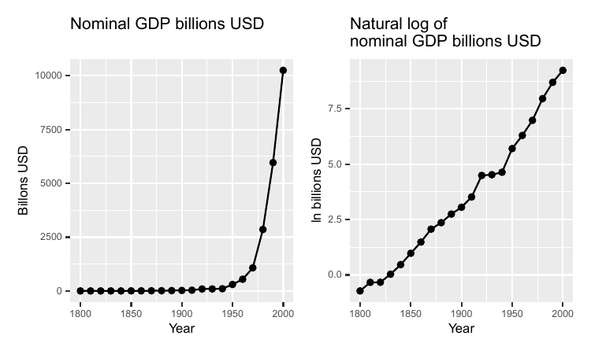

# Logarithms {#chap-logaritmer}

This chapter introduces logarithms, which among other things can be used to facilitate calculations with powers. Logarithms can be used to solve equations with unknown exponents, compare percentage changes, linearize exponential relationships, and analyze exponential growth such as economic development over long periods.

## Base, exponent, logarithm

In chapter \@ref(chap-grundlaggande-matematik-1) we described powers with a base and an exponent: $\text{power}=\text{base}^{\text{exponent}}$. Logarithms are another way to write power expressions. The logarithm of the number $a$ is the exponent $x$ that the base $b$ must be raised to to get the value $a$:

$$
\begin{align}
a & =b^{x}\\
\text{log}_{b}a & =x\nonumber 
 (\#eq:log-funktion-1a)
\end{align}
$$

If we for example take the logarithm with base 3 of the number 9, this is equal to the value that the base 3 must be raised to for us to get 9: 

$$
\begin{equation}
\log_{3}\left(9\right)=2\text{ since }3^{2}=9
\end{equation}
$$

Logarithmic calculation is a designation for the computational exercise we do when we search for a specific exponent in a power expression. Logarithmic calculation is a form of mathematical function called $\log\left(\right)$: the logarithm function. Sometimes logarithms are written with parentheses $\log\left(a\right)$ and sometimes without parentheses $\log a$, but the parentheses do not have any specific mathematical function. Sometimes one can see the notation $^{b}\log a=x$, with the base $b$ written to the left of the word $\log$.

Logarithms are not defined for negative values, such as $\log-9$, since there is no base $b$ which can be raised to any exponent and get $-9$, or any other negative value.

Now we have the following expression:

$$
\begin{equation}
\log_{b}a=x
\end{equation}
$$

 and want to solve for $a$. We do this by putting $\log_{b}a$ as an exponent to the base $b$. At the same time we use the right-hand side also as an exponent to base $b$: 

$$
\begin{align}
\log_{b}a & =x\\
b^{\log_{b}a} & =b^{x}\nonumber \\
a & =b^{x}\nonumber 
 (\#eq:anti-log)
\end{align}
$$

Here is the same example but instead of $b$ we use base 3:

$$
\begin{align}
\log_{3}9 & =2\\
3^{\log_{3}9} & =3^{2}\nonumber \\
9 & =3^{2}\nonumber 
\end{align}
$$

## The common logarithm

A common base for logarithmic calculation is 10. It is so common that when one sees an equation where the function $\log\left(\right)$ appears but no base is defined, it is usually logarithmic calculation with base 10 that is meant, which is called the common logarithm. Just as above, the common logarithm means that $\log_{10}a$ is equal to the value that 10 must be raised to for us to get the value $a$, where $a$ is some number. Here are some examples of logarithms with base 10:

$$
\begin{align}
\log_{10}10 & =1\;\text{since }10^{1}=10\\
\log_{10}100 & =2\;\text{since }10^{2}=100\nonumber \\
\log_{10}1,000 & =3\;\text{since }10^{3}=1,000\nonumber 
\end{align}
$$

The common logarithm means that for the number $a$ we have: 

$$
\begin{equation}
a=10^{\log_{10}\left(a\right)}
\end{equation}
$$

Logarithmic calculation is useful for several things. Say for example that we want to solve for $x$ from the following function

$$
\begin{align}
1,000,000 & =100^{x}
\end{align}
$$

For this we take the common logarithm of the numbers on both sides:

$$
\begin{align}
\log_{10}\left(1,000,000\right) & =x\log_{10}\left(100\right)\\
6 & =x*2\nonumber \\
x & =3\nonumber 
\end{align}
$$

Let us go through the equation above step by step. In the left side we get the logarithm of 1,000,000 with base 10, which is equal to the number that 10 must be raised to for us to get 1,000,000. The answer is 6. In the right side, logarithmic calculation means that one can move down the exponent $x$ from $100^{x}$ and write this in front of $\log\left(100\right)$. Generally it applies for exponents that $\left(a^{b}\right)^{c}=a^{b*c}$ and we know that the common logarithm of 100 is 2, since $10^{2}=100$. Therefore we get: 

$$
\begin{align}
100^{3} & =\left(10^{2}\right)^{3}=10^{2*3}=10^{6}
\end{align}
$$

If we take the logarithm of $10^{6}$ we may write:

$$
\begin{align}
\log_{10}\left(10^{6}\right) & =\log_{10}\left(10^{2}\right)^{3}=3*\log_{10}\left(10^{2}\right)=3*2=6
\end{align}
$$

 Since $\log100=2$ we can also write: 

$$
\begin{align}
100 & =10^{\log100}=10^{2}
\end{align}
$$

If the logarithm function appears in an equation we must remember that it is the result of the function that should be used in the calculation and nothing else. Consider the following equation: $\log1,000+42$. To calculate this we take the result of the first term, $\log1,000=3$, and add 42: 

$$
\begin{align}
\log_{10}1,000+42 & =3+42=45
\end{align}
$$

 Same thing if we have several logarithmic expressions in the same equation. Here is an example with two terms:

$$
\begin{align}
\log_{10}100+\log_{10}10 & =2+1=3
\end{align}
$$

## Properties of logarithms {#sec-logaritmlagar}

Logarithms have the following properties:

$$
\begin{align}
\textbf{Product rule: } & \log\left(a*b\right)=\log\left(a\right)+\log\left(b\right)\\
\textbf{Quotient rule: } & \log\left(\frac{a}{b}\right)=\log\left(a\right)-\log\left(b\right)\nonumber \\
\textbf{Power rule: } & \log\left(x^{a}\right)=a\log\left(x\right)\nonumber
 (\#eq:logaritmlagar)
\end{align}
$$

To see what these three rules mean we can take some simple examples. Let us start with multiplication, the product rule:

$$
\begin{align}
\log1,000 & =\log\left(100*10\right)\\
 & =\log100+\log10\nonumber \\
 & =2+1\nonumber \\
 & =3\nonumber 
\end{align}
$$

Note the difference between the following two expressions:

$$
\begin{align}
\log a & *\log b\neq\log a+\log b\\
\log ab & =\log a+\log b\nonumber 
\end{align}
$$

To see the meaning of this difference we substitute $a$ and $b$ with numbers and use the common logarithm:

$$
\begin{align}
\log_{10}5+\log_{10}2 & =\log_{10}\left(5*2\right)=\log_{10}10=1\\
\log_{10}5*\log_{10}2 & \approx0.699*0.3\approx0.21\nonumber 
\end{align}
$$

Let us now illustrate the Quotient rule, using the following example:

$$
\begin{align}
\log100 & =\log\frac{1,000}{10}=\log1,000-\log10=3-1=2
\end{align}
$$

When we work with logarithms and powers one can use the Power rule:

$$
\begin{align}
\log10,000 & =\log100^{2}=2\log100=2*2=4
\end{align}
$$

The Power rule states that $\log x^{a}=a\log x$. This can also be written:

$$
\begin{align}
a\log x & =\log\left(x^{a}\right)=\log\left(10^{\log x}\right)^{a}
\end{align}
$$

## Natural logarithm {#sec-naturliga-logaritmen}

We have previously mentioned the constant $\pi$, which is approximately 3.14. Another commonly occurring constant is Euler's number $e$, which is approximately 2.718. Just as the number 10, the number $e$(approximately 2.718) is a common base for logarithmic calculation, which is called the natural logarithm and is often written as $\ln\left(x\right)$:

$$
\begin{equation}
\ln x=\text{the number we need to raise e to obtain the value x}
\end{equation}
$$

 Another way to write the same thing:

$$
\begin{align}
y & =\ln\left(x\right)\\
\text{where }e^{y} & =x\nonumber 
\end{align}
$$

Just as for other logarithms it applies that if $x=1$ then $\ln\left(x\right)=\ln\left(1\right)=0$, since all numbers raised to 0 equal 1. Above we went through how $100=10^{\log_{10}100}=10^{2}=100$. When we have $\ln\left(\right)$ we instead have the base $e$. This means that $e$ raised to the natural logarithm of the number $a$ equals just $a$. Since the natural logarithm uses the number e as base, the following applies: 

$$
\begin{equation}
a=e^{\ln\left(a\right)}
\end{equation}
$$

In equation \@ref(eq:anti-log) we went through how by using the logarithm on a power expression one can isolate the exponent. If we have a power expression where Euler's number e is the base we may do the same with the natural logarithm:

$$
\begin{align}
e^{y} & =x\\
\ln e^{y} & =\ln x\nonumber \\
y & =\ln x\nonumber 
\end{align}
$$

The antilogarithm of the natural logarithm has a specific function called the natural exponential function and is denoted $\exp\left(\right)$:

$$
\begin{align}
y & =\ln x\\
\exp\left(y\right) & =\exp\left(\ln x\right)\nonumber \\
e^{y} & =e^{\ln x}\nonumber \\
e^{y} & =x\nonumber 
\end{align}
$$

We shall now calculate:

$$
\begin{equation}
e^{\ln8+\ln2}+4
\end{equation}
$$

We start by summing the exponent in the first term, where we use the logarithm law for addition, $\ln a+\ln b=\ln ab$:

$$
\begin{align}
e^{\ln8+\ln2}+4 & =e^{\ln16}+4
 (\#eq:e-ln-16)
\end{align}
$$

 The first term is now $e$ raised to the natural logarithm of 16. Since $\ln\left(16\right)$ by definition is the number that $e$ must be raised to in order to get 16, we have that $e^{\ln16}=16$. Based on this, we now have the following:

$$
\begin{align}
e^{\ln16}+4 & =16+4=20
\end{align}
$$

## Change of base for logarithms {#sec-basbyte-for-logaritmer}

We have so far worked with logarithmic calculation where the logarithmic terms in the expressions have the same base. Sometimes we may however encounter expressions where we have logarithms with different bases in the same expression. Then it can be useful to know how we can change the base of a logarithmic expression. This also facilitates the understanding of logarithmic calculation generally. Suppose we have the expression:

$$
\begin{equation}
x=a^{\log_{a}x}
\end{equation}
$$

 Note how the right side only says that a raised to $\log_{a}x$, with $a$ as base, is the same thing as $x$. We now take the natural logarithm on both sides. Since we shall describe base change of logarithms we now write the natural logarithm as $\log_{e}\left(\right)$ instead of $\ln\left(\right)$. We now get: 

$$
\begin{align}
\log_{e}x & =\log_{e}\left(a^{\log_{a}x}\right)\\
\log_{e}x & =\left(\log_{a}x\right)\left(\log_{e}a\right)\nonumber \\
\log_{a}x & =\frac{\log_{e}x}{\log_{e}a}\nonumber 
 (\#eq:log-andra-bas-ekvationen)
\end{align}
$$

The last line describes the calculation rule for how to change the base from the logarithm with base $a$ to any other base. Here we used the natural logarithm, where we wrote $\log_{e}$ instead of $\ln$. But the same principle applies for any other base we would want to change to. As an example:

$$
\begin{equation}
\log_{a}x=\frac{\log_{e}x}{\log_{e}a}=\frac{\ln x}{\ln a}=\frac{\log_{5}x}{\log_{5}a}
\end{equation}
$$

In the first term we have the logarithm of $x$ with base $a$. In the second and third terms we have the natural logarithm in numerator and denominator. In the fourth term we have the logarithm with base 5 in numerator and denominator. This calculation rule can also be illustrated with an example. We have:

$$
\begin{equation}
100=10^{\log_{10}100}
\end{equation}
$$

Now we shall rewrite this expression to a form where we instead use the natural logarithm. We may then take the natural logarithm of both sides:

$$
\begin{align}
\ln\left(100\right) & =\ln\left(10^{\log_{10}100}\right)=\left(\log_{10}100\right)\ln\left(10\right)
\end{align}
$$

 We move the parts with natural logarithm to one side so that we get a new definition for $\log_{10}100$:

$$
\begin{equation}
\log_{10}100=\frac{\ln100}{\ln10}
\end{equation}
$$

We know that $\log_{10}100=2$ since $10^{2}=100$. That the right side with natural logarithm is also equal to 2 we can see by taking:

$$
\begin{align}
\frac{\ln100}{\ln10} & =\frac{\ln10^{2}}{\ln10}=\frac{2\ln10}{\ln10}=2
\end{align}
$$

## Using natural log to calculate percentage change

The natural logarithm has several useful properties. One of these is that for small changes, the difference between the natural logarithm of two values is approximately the same as the percentage difference. That is, for small $a$ the following applies:

$$
\begin{equation}
\ln(1+a)\approx a
\end{equation}
$$

 which means that if we raise Eulers number $e$ to the small value $a$ we get $1+a$. For instance, the value 102 is 2 percent higher than 100: $102/100-1=0.02=2\%$. If we take the natural log of $102/100=1.02$ we get approximately 2 percent:

$$
\begin{align}
\ln\left(\frac{102}{100}\right) & =\ln(102)-\ln(100)\\
 & \approx4.62497-4.60517\nonumber \\
 & \approx0.0198\nonumber \\
 & \approx2\%\nonumber 
\end{align}
$$

This may seem like a complicated way to measure percent. But this is very useful in a lot of statistical analysis, which we will introduce in part III.

Notice that it is only natural logarithms that work as an approximation for small percent change. With another log base we get other results. For instance, $\log_{10}\left(105/100\right)\approx0.02$, which is of course wrong.

For small differences the natural logarithm gives an acceptable approximation of percentage differences. But when the difference between the values increases, this no longer applies. For example:

$$
\begin{align}
\ln\left(\frac{30}{15}\right) & \approx0.69=69\%
\end{align}
$$

 which is wrong, since a change from 15 to 30 is 100%. If we know in advance how much the percentage change is, it is possible to create a correct measure by changing the base of the logarithms. The details are not included here, but explained pedagogically by [Huntington-Klein (2021)](https://theeffectbook.net) .

## Logarithms for linearity {#sec-logaritmering-for-linjaritet}

A lot of analysis is based on more or less linear relationships, such as if we increase (decrease) $A$ this will result in an increase (decrease) of $B$. There is a lot of important associations that are not linear. But some of them we may want to recalculate so that they become more linear. One such example is exponential growth, where something is increasing at an increasing rate. If we take logarithms.

To see how logarithmic transformation can create a more linear relationship between different values we look at the four graphs in figure \@ref(fig:x-x-2-lnx-lnx-2) . The figure shows four different combinations of values for the variables $x,x^{2},\ln x$ and $\ln x^{2}$, which is also described in table \@ref(tab:avrundade-varden-for) . Of the four graphs (a), (b), (c) and (d), it is only in graph (d) we have a linear relationship between the variables. In graph (d) the values for $\ln\left(x^{2}\right)$ are shown on the y-axis and values for $\ln x$ on the x-axis. The line in the graph is straight, which means that it by definition must be able to be drawn with a variant of the straight line equation:

$$
\begin{align}
y & =a+bx\\
\ln\left(x^{2}\right) & =a+b\left(\ln x\right)\nonumber 
\end{align}
$$

 In graph (a) we have plotted combined values of $x$ and $x^{2}$. The line grows exponentially and is therefore not linear. In graph (b) combined values of $x$ and $\ln\left(x^{2}\right)$ are shown. The line is curved and the rate of increase decreases with higher values for $x$, which is not a linear relationship. Graph (c) shows combined values of $x^{2}$ and $\ln\left(x\right)$, which also does not result in a linear function.

```{r x-x-2-lnx-lnx-2, echo=FALSE, out.width="71%", fig.cap="Illustration of $x$, $x^{2}$, $\\ln x$ and $\\ln x^{2}$"}
library("tidyverse")
library("patchwork")
th5 <- ggplot() + theme(axis.title.y=element_text(angle=0), text=element_text(size=11))
lnp1 <- th5 + stat_function(fun=function(x) x^2, color="#F8766D") +
  scale_x_continuous(limits=c(1,8), breaks=c(1,2,4,8)) +
  labs(title="(a)", x="x", y=expression(x^2))
lnp2 <- th5 + stat_function(fun=function(x) log(x^2), xlim=c(.001,10), color="#F8766D") +
  scale_x_continuous(limits=c(1,8), breaks=c(1,2,4,8)) +
  scale_y_continuous(limits=c(0,5)) +
  labs(title="(b)", x="x", y=expression(ln(x^2)))
lnp3 <- th5 + stat_function(fun=function(x) x^2, color="#F8766D") +
  labs(title="(c)", x=expression(ln(x)), y=expression(x^2)) +
  scale_x_continuous(trans="log", limits=c(1,8), breaks=c(1,2,4,8))
lnp4 <- th5 + stat_function(fun=function(x) log(x^2), color="#F8766D") +
  labs(title="(d)", x=expression(ln(x)), y=expression(ln(x^2))) +
  scale_x_continuous(trans="log", limits=c(1,8), breaks=c(1,2,4,8))
ln_plots <- (lnp1 + lnp2) / (lnp3 + lnp4)
ln_plots
```

 

Table: Rounded values for $x$, $x^{2}$, $\ln x$ and $\ln x^{2}$(\#tab:avrundade-varden-for)

| $x$| $y=x^{2}$| $\ln x$| $y=\ln x^{2}$|
| --- | --- | --- | --- |
| 1 | 1 | 0.0 | 0.0 |
| 2 | 4 | 0.7 | 2.1 |
| 3 | 9 | 1.1 | 3.3 |
| 4 | 16 | 1.4 | 4.2 |
| 5 | 25 | 1.6 | 4.8 |
| 6 | 36 | 1.8 | 5.4 |
| 7 | 49 | 1.9 | 5.8 |
| 8 | 64 | 2.1 | 6.2 |
| 9 | 81 | 2.2 | 6.6 |
| 10 | 100 | 2.3 | 6.9 |

In section \@ref(sec-den-rata-linjens) we defined the slope of the straight line as:

$$
\begin{equation}
b=\frac{y_{2}-y_{1}}{x_{2}-x_{1}}
\end{equation}
$$

 where we compare the distance between two points where the first point has coordinates $\left(x_{1},y_{1}\right)$ and the second point has coordinates $\left(x_{2},y_{2}\right)$. Now we will use this again to calculate the slope of the function that draws the straight line in graph (d) in figure \@ref(fig:x-x-2-lnx-lnx-2) . Let us use the point $\left(x_{1},y_{1}\right)=\left(2,4\right)$ and the point $\left(x_{2},y_{2}\right)=\left(3,9\right)$:

$$
\begin{align}
b & =\frac{y_{2}-y_{1}}{x_{2}-x_{1}}\\
 & =\frac{\left(\ln x_{2}^{2}\right)-\left(\ln x_{1}^{2}\right)}{\left(\ln x\right)_{2}-\left(\ln x\right)_{1}}\nonumber \\
 & =\frac{\ln\left(x_{2}^{2}/x_{1}^{2}\right)}{\ln\left(x_{2}/x_{1}\right)}\nonumber \\
 & =\frac{\ln\left(9/4\right)}{\ln\left(3/2\right)}\nonumber \\
 & =2\nonumber 
\end{align}
$$

The result 2 is the same thing as the exponent in the term $x^{2}$. For the logarithm law about powers in equation \@ref(eq:logaritmlagar) we saw that $\ln\left(x^{a}\right)=a\ln x$. In this case we have a function of type $y=x^{2}$. If we take logarithms of both sides of $y=x^{2}$ we get:

$$
\begin{align}
\ln y & =\ln\left(x^{2}\right)\\
\ln y & =2\ln x\nonumber 
\end{align}
$$

This is a linear function, a function of the same form as the straight line equation. This might become even easier to see if we substitute $\ln y=z$ and $\ln x=q$. We then get:

$$
\begin{equation}
z=2q
\end{equation}
$$

 where $z$ and $q$ are now our variables and 2 is a constant. This equation can be described as a variant of the straight line equation $y=a+bx$ when $a=0$.

## Taking logarithms to get $\boldsymbol{x}${#sec-logaritmering-los-ut-x}

In section \@ref(sec-logaritmlagar) we introduced the logarithm law for powers and saw that $\log\left(a^{b}\right)=b\log\left(a\right)$. Sometimes we want to use this to solve for $x$ in an equation. Consider the following example:

$$
\begin{equation}
3^{x}=21
\end{equation}
$$

 We take logarithms of both sides:

$$
\begin{align}
3^{x} & =21\\
\log\left(3^{x}\right) & =\log\left(21\right)\nonumber \\
x\log3 & =\log21\nonumber \\
x & =\frac{\log21}{\log3}\approx2.77\nonumber 
\end{align}
$$

Let us go through this calculation step by step. We start by taking logarithms of both sides of the equation, which allows us to move down x from exponent to multiplier for $\log3$. The result becomes the same thing regardless of which base we use when we take logarithms, as long as we use the same base on both sides of the equals sign.

Suppose now that we wish to know what makes people happy and satisfied. Within social science the concept utility function is often used in these contexts. The concept "utility" is used here to describe preferences and what a person finds useful depends on their preferences. Say now that we have a theory that a person's utility is a result of two things: work and leisure. On a somewhat abstract level utility = percent of the year that we feel happy, work = working hours per year while leisure = all time that is not used for work. We describe our theory with the following equation:

$$
\begin{equation}
N=A^{z}F^{1-z}
 (\#eq:nyttofunkt-cobbd)
\end{equation}
$$

 where $N$ stands for utility, $A$ for work and $F$ for leisure. The exponent $z$ is a constant that describes what significance the two explanatory variables have for the person's utility. While $A$ and $F$ are included in the equation based on our general theory of how the world works, the value for $z$ can be calculated based on information about $A$ and $F$(more about this later). We feel satisfied with the theory itself but we want to rewrite the equation to a linear function. This can be done with logarithmic transformation: 

$$
\begin{equation}
\ln N=\ln\left(A^{z}F^{1-z}\right)
\end{equation}
$$

 The next step is to use the Product law for logarithms (equation \@ref(eq:logaritmlagar) ):

$$
\begin{align}
\ln N & =\ln\left(A^{z}\right)+\ln\left(F^{1-z}\right)=z\ln A+\left(1-z\right)\ln F
\end{align}
$$

Let us substitute some symbols to make it even clearer:

$$
\begin{equation}
n=\beta_{1}a+\beta_{2}f
\end{equation}
$$

 where small letters $n$, $a$ and $f$ symbolize logarithmic versions of the variables $N$, $A$ and $F$, while $\beta_{1}$ and $\beta_{2}$ symbolize our slope coefficients, which were previously $z$ and $\left(1-z\right)$. Why would we want to rewrite our equation? Partly it becomes easier to illustrate the relationship between the variables, partly the linear equation is easier to work with if we shall compare our theory against reality, which we return to in chapter \@ref(chap-ols)

## Log GDP {#sec-log-linjar-ex-bnp}

In this section we shall again work with gross national product, GDP (see section \@ref(sec-tillvaxt-ex1) ). Table \@ref(tab:inc-and-ln-inc) shows nominal GDP for the US for every ten years 1800–2000. The third column contains the natural logarithm of GDP. The natural logarithm is here rounded to one decimal place. Year 1800 GDP was 0.486 billions USD and $\ln\left(0.486\right)\approx-0.7$, which means that $e^{-0.7}\approx-0.486$.

In the table we see how an equally large relative change in $x$ corresponds to the same absolute change of the natural logarithm. Every time GDP doubles, regardless of from which level, the change in $\ln(GDP)$ is approximately 0.7. Every time GDP triples, $\ln\left(GDP\right)$ increases by approximately 1.1. When GDP increases tenfold, $\ln\left(GDP\right)$ increases by approximately 2.3. 

Table: US GDP 1800–2000 and the natural log of GDP (\#tab:inc-and-ln-inc)

| Year | GDP billions USD | ln GDP |
| --- | --- | --- |
| 1800 | 0.486 | $-0.7$|
| 1810 | 0.714 | $-0.3$|
| 1820 | 0.718 | $-0.3$|
| 1830 | 1.032 | 0 |
| 1840 | 1.59 | 0.5 |
| 1850 | 2.656 | 1 |
| 1860 | 4.41 | 1.5 |
| 1870 | 7.899 | 2.1 |
| 1880 | 10.592 | 2.4 |
| 1890 | 15.607 | 2.7 |
| 1900 | 21.197 | 3.1 |
| Note: Data from Measuring Worth | | |

 $\,\,\,$ 

| Year | GDP billions USD | ln GDP |
| --- | --- | --- |
| 1910 | 33.746 | 3.5 |
| 1920 | 89.246 | 4.5 |
| 1930 | 92.16 | 4.5 |
| 1940 | 102.899 | 4.6 |
| 1950 | 299.827 | 5.7 |
| 1960 | 542.382 | 6.3 |
| 1970 | 1,073.303 | 7 |
| 1980 | 2,857.307 | 8 |
| 1990 | 5,963.144 | 8.7 |
| 2000 | 10,250.952 | 9.2 |
| . | . | . |

 

```{r us-gdp-nominal-and-log, echo=FALSE, out.width="92%", fig.cap="US GDP per capita, 1,000 USD PPP. Data from Our World in Data"}

```

The same thing is illustrated in figure \@ref(fig:us-gdp-nominal-and-log) , where the numbers from table \@ref(tab:inc-and-ln-inc) are shown in two graphs: in the left graph a line for GDP in USA between the years 1800–2000 is shown, in billions of dollars. The line increases exponentially. The greater GDP becomes, the greater is the rate of increase. In the right graph the curve for $\ln(\text{GDP})$ is shown. The line now increases at a more even pace and is almost straight. This effect occurs because of the logarithmization of the nominal values, which makes the graph's scale to show relative changes. Note that this does not necessarily mean that $\ln(\text{GDP})$ is a better measure than nominal GDP. Which measure you should use depends on what you want to measure, compare or show.

## Using logarithms to discuss theory {#sec-log-bnp-och-lycka}

There is a well-known covariation between a country's residents' subjectively estimated satisfaction with their lives and the country's average income level, which simply can be described as the covariation between "happiness" and income. This is illustrated in figure \@ref(fig:bnp-och-lycka-1) where we see data for happiness and income in 2017 in all the world's countries. Each dot represents a combined value of happiness and gross national product per inhabitant, GDP per capita, that is average amount of total income per inhabitant.

```{r bnp-och-lycka-1, echo=FALSE, out.width="92%", fig.cap="Happiness and GDP. Source: www.ourworldindata.org"}
library("ggrepel")
library("gghighlight")
df5 <- read_delim(file="data/gdp-vs-happiness2.csv", delim=";", show_col_types=FALSE) %>%
  filter(Year==2017) %>%
  rename(gdp_cap="GDP per capita, PPP (constant 2011 international $)",
         happiness="Life satisfaction in Cantril Ladder (World Happiness Report 2019)",
         pop="Total population (Gapminder, HYDE & UN)")
my_select_countries5 <- c("Sweden","Brazil","Congo","France","Jamaica","Haiti")
g1_gdphappy <- df5 %>%
  ggplot(aes(x=gdp_cap/1000, y=happiness)) +
  geom_point(aes(size=pop), show.legend=FALSE) +
  geom_text_repel(aes(label=Entity), size=4) +
  geom_smooth(method='lm', alpha=.1, linewidth=.1, linetype='longdash',
              formula=y~log(x), se=FALSE) +
  gghighlight(Entity %in% my_select_countries5) +
  labs(x="GDP per capita*", y="Happiness*") +
  xlim(0,100) +
  theme(text=element_text(size=11))
g2_loggdphappy <- df5 %>%
  ggplot(aes(log10(gdp_cap/1000), happiness)) +
  geom_point(aes(size=pop), show.legend=FALSE) +
  geom_text_repel(aes(label=Entity), size=4) +
  geom_smooth(method='lm', se=FALSE,
              linewidth=.1, alpha=.1, linetype='longdash') +
  gghighlight(Entity %in% my_select_countries5) +
  labs(x="log GDP per capita*", y="Happiness*",
       caption="*Life satisfaction 1-10.\nGDP per capita in $1,000 adjusted for cost of living.") +
  scale_x_continuous(breaks=log10(c(1,2,4,8,16,32,64,128)),
                     labels=c(1,2,4,8,16,32,64,128)) +
  theme(text=element_text(size=11))
(g1_gdphappy + g2_loggdphappy)
```

Happiness is measured here as a survey response on a scale from 1 to 10 where 10 is the highest level of satisfaction with life. The measure of GDP we use here is so-called purchasing power adjusted GDP per capita calculated in thousands of American dollars. This is a rough measure of average income adjusted for price differences between countries. Some dots represent groups of countries, for example all countries that are members of the organization OECD or all countries in Africa south of the Sahara.

In the graph to the left, inhabitants in richer countries are on average happier than in poorer countries. But happiness is only higher with higher GDP up to a certain level. For the richest countries there does not seem to be any particularly clear covariation between happiness and GDP. In the right graph we compare happiness and logarithmic values for GDP. Now the average happiness among inhabitants seems on average to be higher with higher GDP, both among countries with low and high GDP. A large part of the countries lie almost as on a straight line from the graph's lower left corner up to the right corner. In both graphs we have also drawn a trend line so that the pattern shows more clearly. The black line is the trend for the marked countries. The less visible gray line is the trend line for all the world's countries.

To understand technically why the pattern changes we compare the highlighted countries Sweden, France, Brazil, Jamaica, Congo, Kenya and Haiti. Table \@ref(tab:lycka-och-bnp-1) shows the values for these countries, sorted by GDP. To understand the right graph we look particularly at the difference between Congo (happiness 4.9), Brazil (happiness 6.3) and Sweden (happiness 7.3). If we compare GDP the differences appear much larger than happiness, where Congo has a GDP per capita of 4.9, Brazil 14.1 and Sweden 46.9.

Table: Happiness and GDP in six countries (\#tab:lycka-och-bnp-1)

| Country | Happiness | GDP per capita | $\log_{10}\left(\text{GDP per capita}\right)$|
| --- | --- | --- | --- |
| Haiti | 3.8 | 1.7 | 0.2 |
| Congo | 4.9 | 4.9 | 0.7 |
| Jamaica | 5.9 | 8.2 | 0.9 |
| Brazil | 6.3 | 14.1 | 1.1 |
| France | 6.6 | 38.6 | 1.6 |
| Sweden | 7.3 | 46.9 | 1.7 |
| Source: Our World in Data, www.ourworldindata.org. | | | |

If we compare relative differences in income Sweden has a little more than three times as high average income as Brazil, which has almost three times as high average income as Congo. This is also reflected in the logarithmic values, where Sweden's $\log_{10}\left(\text{GDP}\right)$ is 1.7, Brazil's 1.1 and Congo's 0.7. Logarithmic transformation facilitates relative comparisons since the difference between logarithmic values is the same for corresponding relative differences in absolute values.

The relative differences in income covariate relatively well with life satisfaction. Exactly why this is the case is impossible to say, especially based on only the information we use here. An important part of the explanation might be that an income increase of a fixed sum, for example 100 USD, usually is not as valuable for a rich person as it is for a poor. However, a relative income increase, such as 10%, are useful no matter if you are poor or rich to begin with. That is, life satisfaction might increase even among very high income earners if their income increase sufficiently much.

The right graph has a striking pattern. But note that not even this in itself is any proof of a direct causal relationship between happiness and income. High income countries are usually very different from poor countries in many aspects, and these things also might affect life satisfaction. It is therefore not correct to say that we here see a direct causal relation from just income. Therefore we cannot draw any conclusions about how much happiness in a population would increase if incomes would increase. To understand this, just think about the different ways that income could increase in theory, while other parts of life could get worse at the same time. Part II introduce methods to study causal relationships.

## Chapter summary

- Logarithms are another way to write powers. In a power expression $b^{x}$, $b$ is called the base and $x$ the exponent. Given the base $b$, $\log_{b}x=$ the number that $b$ must be raised to obtain the value $x$. Thus: if base $=b=10$ then $\log_{10}100=2$ since $10^{2}=100$.

- The function $\log\left(\right)$ often uses base 10. This is so common that if it only says $\log\left(\right)$ this usually means that the base is 10. The function $\ln\left(\right)$ is $\log$ with Euler's number $e$(approximately 2.718) as base. For all bases it applies that $\log1=0$ since all numbers, all bases, raised to 0 become 1.

- The logarithm laws:

    - Multiplication: $\log\left(ab\right)=\log a+\log b$.

    - Division: $\log\left(a/b\right)=\log a-\log b$.

    - Powers: $\log x^{a}=a\log x$.

- To change base for the logarithm it applies that $\log_{b}x=\frac{\log_{a}x}{\log_{a}b}=\frac{\ln x}{\ln b}$, where $b$, $a$ and $x$ are real numbers.

- For small differences the difference between the natural logarithm of two values is approximately equal to the percentage difference. Example: $\ln\left(102/100\right)=\ln102-\ln100\approx0.02$, approximately 2%.

- Logarithmic transformation can among other things be used to compare relative differences, create linear equations and solve expressions with powers.


## Exercises

<div id="ex-4" class="exercises-container"></div>
<script>
(function(){
var ex=[
  {q:'<p>Calculate:</p><ol type="a"><li>\\(\\log_{2}64 \\)</li><li>\\(\\log_{3}81 \\)</li><li>\\(\\log_{5}125 \\)</li></ol>',a:'<p>(a)\\(\\log_{2}64=6 \\) since \\( 2^{6}=64 \\) , (b)\\(\\log_{3}81=4 \\) since \\( 3^{4}=81 \\) , (c)\\(\\log_{5}125=3 \\) since \\( 5^{3}=125 \\)</p>'},
  {q:'<p>Write each power expression as a logarithm:</p><ol type="a"><li>\\( 2^{8}=256 \\)</li><li>\\( 10^{-2}=0.01 \\)</li><li>\\( e^{1}=e \\)</li></ol>',a:'<p>(a)\\(\\log_{2}256=8 \\) , (b)\\(\\log_{10}0.01=-2 \\) , (c)\\(\\ln e=1 \\)</p>'},
  {q:'<p>Calculate using the common logarithm (base 10):</p><ol type="a"><li>\\(\\log_{10}10,000 \\)</li><li>\\(\\log_{10}0.001 \\)</li><li>\\(\\log_{10}10^{7}\\)</li></ol>',a:'<p>(a)\\(\\log_{10}10,000=4 \\) , (b)\\(\\log_{10}0.001=-3 \\) , (c)\\(\\log_{10}10^{7}=7 \\)</p>'},
  {q:'<p>Use the product rule to simplify:</p><ol type="a"><li>\\(\\log(20)+\\log(5)\\)</li><li>\\(\\log_{2}(8)+\\log_{2}(4)\\)</li><li>\\(\\log_{3}(9)+\\log_{3}(27)\\)</li></ol>',a:'<p>(a)\\(\\log(20\\times5)=\\log100=2 \\) , (b)\\(\\log_{2}(8\\times4)=\\log_{2}32=5 \\) , (c)\\(\\log_{3}(9\\times27)=\\log_{3}243=5 \\)</p>'},
  {q:'<p>Use the quotient rule to calculate:</p><ol type="a"><li>\\(\\log(1,000,000)-\\log(1,000)\\)</li><li>\\(\\log_{3}(81)-\\log_{3}(3)\\)</li><li>\\(\\log_{2}(64)-\\log_{2}(4)\\)</li></ol>',a:'<p>(a)\\(\\log(1,000,000/1,000)=\\log1,000=3 \\) , (b)\\(\\log_{3}(81/3)=\\log_{3}27=3 \\) , (c)\\(\\log_{2}(64/4)=\\log_{2}16=4 \\)</p>'},
  {q:'<p>Use the power rule to simplify:</p><ol type="a"><li>\\(\\log(1,000^{2})\\)</li><li>\\(\\log_{2}(4^{3})\\)</li><li>\\(\\ln(e^{5})\\)</li></ol>',a:'<p>(a)\\( 2\\log1,000=2\\times3=6 \\) , (b)\\( 3\\log_{2}4=3\\times2=6 \\) , (c)\\(\\ln(e^{5})=5 \\)</p>'},
  {q:'<p>Simplify using logarithm laws:</p><ol type="a"><li>\\( 2\\log(10)+\\log(100)\\)</li><li>\\( 2\\log_{3}(9)+\\log_{3}(3)\\)</li><li>\\(\\log\\sqrt{10,000}\\)</li></ol>',a:'<p>(a)\\( 2\\times1+2=4 \\) , (b)\\( 2\\times2+1=5 \\) , (c)\\(\\frac{1}{2}\\log10,000=\\frac{1}{2}\\times4=2 \\)</p>'},
  {q:'<p>Calculate using the natural logarithm:</p><ol type="a"><li>\\(\\ln(e^{4})\\)</li><li>\\( e^{\\ln5}\\)</li><li>\\( e^{\\ln3+\\ln4}\\)</li></ol>',a:'<p>(a)\\(\\ln(e^{4})=4 \\) , (b)\\( e^{\\ln5}=5 \\) , (c)\\( e^{\\ln3+\\ln4}=e^{\\ln12}=12 \\)</p>'},
  {q:'<p>Solve for \\( x \\) :</p><ol type="a"><li>\\(\\log_{3}x=4 \\)</li><li>\\(\\log x=5 \\) (base 10)</li><li>\\( 10^{x}=500 \\)</li></ol>',a:'<p>(a)\\( x=3^{4}=81 \\) , (b)\\( x=10^{5}=100,000 \\) , (c)\\( x=\\log500=\\log(5\\times100)=\\log5+2\\approx0.699+2=2.699 \\)</p>'},
  {q:'<p>Use the change of base formula \\(\\log_{a}x=\\frac{\\ln x}{\\ln a}\\) :</p><ol type="a"><li>Calculate \\(\\log_{8}(64)\\) by rewriting using natural logarithms.</li><li>Calculate \\(\\log_{4}(32)\\) .</li><li>Express \\(\\log_{2}(100)\\) using common logarithms (base 10) and calculate.</li></ol>',a:'<p>(a)\\(\\frac{\\ln64}{\\ln8}=\\frac{6\\ln2}{3\\ln2}=2 \\) , (b)\\(\\frac{\\ln32}{\\ln4}=\\frac{5\\ln2}{2\\ln2}=2.5 \\) , (c)\\(\\frac{\\log100}{\\log2}=\\frac{2}{0.301}\\approx6.64 \\)</p>'},
  {q:'<p>Use the natural logarithm to approximate percentage changes:</p><ol type="a"><li>Monthly wages increased from 40,000 to 40,800. Calculate \\(\\ln(40,800)-\\ln(40,000)\\) and compare with the actual percentage change.</li><li>GDP per capita in country A is 8,000 USD and in country B 12,000 USD. Calculate \\(\\ln(12,000)-\\ln(8,000)\\) . Is this a good approximation of the percentage difference?</li><li>A price index rose from 100 to 103. Use ln to approximate the percentage change and compare with the exact value.</li></ol>',a:'<p>(a)\\(\\ln(40,800/40,000)=\\ln(1.02)\\approx0.0198\\approx2\\%\\) ; actual: \\( 800/40,000=2\\%\\) — good approximation, (b)\\(\\ln(12,000/8,000)=\\ln(1.5)\\approx0.405\\approx40.5\\%\\) ; actual: 50% — poor approximation for large differences, (c)\\(\\ln(103/100)=\\ln(1.03)\\approx0.030\\approx3\\%\\) ; actual: 3% — good approximation</p>'}
];
var c=document.getElementById("ex-4");
if(!c)return;
var h='<ol class="exercise-list">';
ex.forEach(function(e){
  h+='<li class="exercise-item">';
  h+='<div class="exercise-question">'+e.q+'</div>';
  if(e.a){
    h+='<details class="exercise-answer">';
    h+='<summary>Show answer &#9654;</summary>';
    h+='<div class="answer-content">'+e.a+'</div>';
    h+='</details>';
  }
  h+='</li>';
});
h+='</ol>';
c.innerHTML=h;
if(window.MathJax){
  if(MathJax.Hub)MathJax.Hub.Queue(["Typeset",MathJax.Hub,c]);
  else if(MathJax.typesetPromise)MathJax.typesetPromise([c]);
}
c.querySelectorAll("details").forEach(function(d){
  d.addEventListener("toggle",function(){
    if(d.open&&window.MathJax){
      if(MathJax.Hub)MathJax.Hub.Queue(["Typeset",MathJax.Hub,d]);
      else if(MathJax.typesetPromise)MathJax.typesetPromise([d]);
    }
  });
});
})();
</script>


