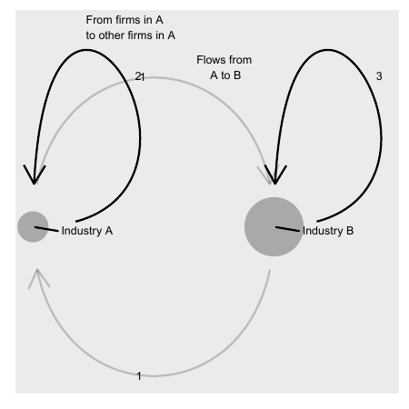

# Linear Algebra: Vectors and Matrices {#chap-linjar-algebra}

This chapter introduces linear algebra, specifically how to use vectors and matrices. These methods can be used, among other things, to calculate covariation and to study networks. Linear algebra is a central piece of empirical analysis, which is introduced more in detail in part III to V.

## Vectors

If we have a mathematical quantity that only has one type of value, for example length, weight, temperature or income, this can be called a scalar. Often when we say scalar we mean a real number, even though the word scalar also can refer to other types of numbers. Quantities with multiple values are called vectors. Suppose we have a vector $\vec{p}$, where the arrow over $p$ indicates that this is a vector, with information about a person's weight and height:

$$
\begin{align}
\text{Person 1} & =\vec{p}_{1}=\left(\text{weight},\text{height}\right)
\end{align}
$$

Elements can also be written vertically:

$$
\begin{equation}
\vec{p}=\left(\begin{matrix}\text{weight}\\
\text{height}
\end{matrix}\right)
\end{equation}
$$

Each value in the vector is called an element. The number of elements in a vector can also be described as the number of dimensions or variables. The vector $\vec{p}$ has two dimensions, which can be described as $\vec{p}\in\mathbb{R}^{2}$, where $\mathbb{R}$ is the symbol for the real numbers. Vectors with two dimensions can be illustrated in graphs using the x- and y-axis. Say that the vector $\vec{p_{1}}=\left(90,190\right)$ and we let the x-axis represent weight and the y-axis represent height, then we place $\vec{p_{1}}$ at the point $\left(x,y\right)=\left(90,190\right)$ in a graph:

$$
\begin{equation}
\vec{p}=\left(\begin{matrix}x\\
y
\end{matrix}\right)=\left(\begin{matrix}90\\
190
\end{matrix}\right)
\end{equation}
$$

 A vector $\vec{x}$ with information about ten variables can be described as $\vec{x}\in\mathbb{R}^{10}$.

## Vector calculations

Vectors have their own rules for addition, subtraction and multiplication. Here follows a brief description based on examples.

#### Addition of vectors.

Let us take two vectors as examples: $\vec{x}_{1}$ and $\vec{x}_{2}$, each with $n$ number of elements. Each element contains a number, a value, but here we just call the first element in $\vec{x}_{1}$ for $x_{11}$. First element in $\vec{x}_{2}$ we call $x_{21}$. The two vectors can be added together and then create a new vector, which we call $\vec{x}_{3}$. The first element in $\vec{x}_{3}$ is the sum of element 1 in $\vec{x}_{1}$ and $\vec{x}_{2}$, so $x_{31}=x_{11}+x_{21}$. The second element is the sum of element 2 in $\vec{x}_{1}$ and $\vec{x}_{2}$, so $x_{32}=x_{12}+x_{22}$. And so on:

$$
\begin{align}
\vec{x}_{3} & =\vec{x}_{1}+\vec{x}_{2}\\
 & =\left(x_{11},x_{12},...,x_{1n}\right)+\left(x_{21},x_{22},...,x_{2n}\right)\nonumber \\
 & =\left(x_{11}+x_{21},x_{12}+x_{22},...,x_{1n}+x_{2n}\right)\nonumber \\
 & =\left(x_{31},x_{32},...,x_{3n}\right)\nonumber 
\end{align}
$$

#### Subtraction of vectors.

For subtraction, the corresponding calculation rules as for addition apply. This time too we call our new vector $\vec{x}_{3}$:

$$
\begin{align}
\vec{x}_{3} & =\vec{x}_{1}-\vec{x}_{2}\\
 & =\left(x_{11},x_{12},...,x_{1n}\right)-\left(x_{21},x_{22},...,x_{2n}\right)\nonumber \\
 & =\left(x_{11}-x_{21},x_{12}-x_{22},...,x_{1n}-x_{2n}\right)\nonumber \\
 & =\left(x_{31},x_{32},...,x_{3n}\right)\nonumber 
\end{align}
$$

#### Multiplication of vector by scalar.

Vectors can be multiplied by scalars. This results in a new vector. If we multiply the vector $\vec{x}_{1}$ by the scalar (the number) $s$ we get:

$$
\begin{align}
s*\vec{x_{1}} & =s*\left(x_{11},...,x_{1n}\right)=\left(sx_{11},...,sx_{1n}\right)
\end{align}
$$

#### Multiplication of vector with vector.

Multiplication of two vectors does not result in a new vector but in a scalar. This is also called inner product or dot product. This time we take the following two vectors as examples: $\vec{x}=\left(x_{1},x_{2}\right)$ and $\vec{y}=\left(y_{1},y_{2}\right)$. Each vector has only two elements, where $x_{1}$ is the first element in vector $\vec{x}$. We multiply the vectors $\vec{x}$ and $\vec{y}$:

$$
\begin{align}
\vec{x}*\vec{y} & =\left(x_{1},x_{2}\right)*\left(y_{1},y_{2}\right)=x_{1}y_{1}+x_{2}y_{2}=a
\end{align}
$$

 where $a$ is a scalar, a number.

The calculation means that the first element in one vector is multiplied by the corresponding first element in the other vector. The second element in the first vector is multiplied by the second element in the second vector. All these products are summed to a number, which becomes the result, the scalar $a$. If we multiply three vectors, this becomes in practice like multiplication of a scalar and a vector:

$$
\begin{align}
\underbrace{\left(\vec{x}_{1}*\vec{x}_{2}\right)}_{=\text{scalar}}*\vec{x}_{3}=a*\vec{x}_{3}
\end{align}
$$

Regardless of the order in which two vectors are multiplied, the scalar product remains the same. Suppose we have the vectors $\vec{a}$ and $\vec{b}$: 

$$
\begin{equation}
\vec{a}*\vec{b}=\vec{b}*\vec{a}=k
\end{equation}
$$

 where $k$ is a scalar. Say now that we have the three vectors $\vec{a}$, $\vec{b}$ and $\vec{c}$. If we multiply $\vec{a}$ and $\vec{c}$ we get the scalar product $\vec{a}*\vec{c}=s_{1}$, where the scalar product is a single value. Furthermore, the following also applies:

$$
\begin{align}
s_{3} & =\left(\vec{a}+\vec{b}\right)*\vec{c}=\vec{a}*\vec{c}+\vec{b}*\vec{c}=s_{1}+s_{2}
\end{align}
$$

 where $s_{1}$, $s_{2}$ and $s_{3}$ are scalars. Based on the calculation rules we have already gone through, it can be seen that the following also applies:

$$
\begin{equation}
\left(k\vec{a}\right)*\vec{b}=k\left(\vec{a}*\vec{b}\right)
\end{equation}
$$

 where $k$ is any scalar and $\vec{a}$ and $\vec{b}$ are vectors. We know that the product of two negative values is a positive value. For vectors, this means among other things that regardless of which elements are in a vector, the scalar product of a vector multiplied by itself can never be negative:

$$
\begin{equation}
\vec{a}*\vec{a}\geq0
\end{equation}
$$

This is because if the elements in a vector $\vec{a}$ are negative numbers, the multiplication with the same negative numbers will result in positive values. This in turn also means that the scalar product $\vec{a}*\vec{a}=0$ if and only if all elements in $\vec{a}$ are equal to 0.

#### Summary of vector calculations.

The above calculation rules can be illustrated with the following two vectors, which each have three elements:

$$
\begin{equation}
\vec{v}_{1}=\left(\begin{matrix}1\\
2\\
3
\end{matrix}\right),\quad\vec{v}_{2}=\left(\begin{matrix}4\\
5\\
6
\end{matrix}\right)
\end{equation}
$$

For these two vectors, the following applies for addition:

$$
\begin{align}
\vec{v}_{1}+\vec{v}_{2} & =\left(\begin{matrix}1\\
2\\
3
\end{matrix}\right)+\left(\begin{matrix}4\\
5\\
6
\end{matrix}\right)=\left(\begin{matrix}1+4\\
2+5\\
3+6
\end{matrix}\right)=\left(\begin{matrix}5\\
7\\
9
\end{matrix}\right)
\end{align}
$$

For subtraction:

$$
\begin{align}
\vec{v}_{1}-\vec{v}_{2} & =\left(\begin{matrix}1\\
2\\
3
\end{matrix}\right)-\left(\begin{matrix}4\\
5\\
6
\end{matrix}\right)=\left(\begin{matrix}1-4\\
2-5\\
3-6
\end{matrix}\right)=\left(\begin{matrix}-3\\
-3\\
-3
\end{matrix}\right)
\end{align}
$$

For multiplication by constant:

$$
\begin{align}
4*\vec{v}_{1} & =4*\left(\begin{matrix}1\\
2\\
3
\end{matrix}\right)=\left(\begin{matrix}4*1\\
4*2\\
4*3
\end{matrix}\right)=\left(\begin{matrix}4\\
8\\
12
\end{matrix}\right)
 (\#eq:vektor-konstant-multplikation)
\end{align}
$$

For multiplication of the two vectors, the scalar product: 

$$
\begin{align}
\vec{v}_{1}*\vec{v}_{2} & =\left(\begin{matrix}1\\
2\\
3
\end{matrix}\right)*\left(\begin{matrix}4\\
5\\
6
\end{matrix}\right)=1*4+2*5+3*6=32
\end{align}
$$

## More vectors

Let us calculate some more examples. We have the following three vectors:

$$
\begin{equation}
\vec{a}=\left(\begin{array}{c}
2\\
5\\
8
\end{array}\right),\quad\vec{b}=\left(\begin{array}{c}
10\\
3\\
2
\end{array}\right),\quad\vec{c}=\left(\begin{array}{c}
22\\
14\\
17
\end{array}\right)
\end{equation}
$$

 We will now calculate:

$$
\begin{equation}
5\vec{a}=5*\left(\begin{array}{c}
2\\
5\\
8
\end{array}\right)
\end{equation}
$$

 The scalar 5 is multiplied by each value in the vector:

$$
\begin{align}
5*\left(\begin{array}{c}
2\\
5\\
8
\end{array}\right) & =\left(\begin{array}{c}
5*2\\
5*5\\
5*8
\end{array}\right)=\left(\begin{array}{c}
10\\
25\\
40
\end{array}\right)
\end{align}
$$

If we add all three vectors:

$$
\begin{align}
\vec{a}+\vec{b}+\vec{c} & =\left(\begin{array}{c}
2\\
5\\
8
\end{array}\right)+\left(\begin{array}{c}
10\\
3\\
2
\end{array}\right)+\left(\begin{array}{c}
22\\
14\\
17
\end{array}\right)=\left(\begin{array}{c}
42\\
22\\
27
\end{array}\right)
\end{align}
$$

If we instead subtract vectors $\vec{a}$ and $\vec{b}$ from $\vec{c}$:

$$
\begin{align}
\vec{c}-\vec{a}-\vec{b} & =\left(\begin{array}{c}
22\\
14\\
17
\end{array}\right)-\left(\begin{array}{c}
2\\
5\\
8
\end{array}\right)-\left(\begin{array}{c}
10\\
3\\
2
\end{array}\right)=\left(\begin{array}{c}
10\\
6\\
7
\end{array}\right)
\end{align}
$$

A common way to draw two-dimensional vectors in a two-dimensional graph is as arrows from the origin, the zero point, to the point that the vector's values indicate. Let us take the following two vectors as examples:

$$
\begin{equation}
\vec{a}=\left(\begin{array}{c}
-2\\
3
\end{array}\right),\quad\vec{b}=\left(\begin{array}{c}
1\\
2
\end{array}\right)
\end{equation}
$$

```{r tva-vektorer, echo=FALSE, out.width="71%", fig.cap="Two vectors"}
library("tidyverse")
g_vectors <- ggplot() +
  geom_segment(aes(x=0, y=0, xend=1, yend=2), arrow=arrow(14, length=unit(4, "mm"))) +
  geom_segment(aes(x=0, y=0, xend=-2, yend=3), arrow=arrow(15, length=unit(4, "mm"))) +
  annotate('text', x=-1.3, y=3, label="(-2,3)", size=4) +
  annotate('text', x=.5, y=2, label="(1,2)", size=4) +
  geom_vline(xintercept=0, alpha=.3) +
  theme(axis.title.y=element_text(angle=0), text=element_text(size=11))
g_vectors
```

 Figure \@ref(fig:tva-vektorer) illustrates the two vectors in the form of two arrows. The arrows go from the zero point $\left(x,y\right)=\left(0,0\right)$ to the values that the vectors indicate. The first value in each vector indicates the x-value and the second value indicates the y-value. Now we will calculate the length of each vector's arrow. The vector's length is called norm. For the vector $\vec{a}$ the norm is written $\Vert\vec{a}\Vert$ and is calculated as the square root of the sum of the included values:

$$
\begin{align}
\Vert\vec{a}\Vert & =\sqrt{a_{1}^{2}+a_{2}^{2}}=\left(a_{1}^{2}+a_{2}^{2}\right)^{\frac{1}{2}}
\end{align}
$$

In this case we have: 

$$
\begin{align}
\Vert\vec{a}\Vert & =\left(\left(-2\right)^{2}+3^{2}\right)^{\frac{1}{2}}\approx3.6\\
\Vert\vec{b}\Vert & =\left(1^{2}+2^{2}\right)^{\frac{1}{2}}\approx2.24\nonumber 
\end{align}
$$

 This should be read as the arrow that goes from the zero point to the point $\left(x,y\right)=\left(1,2\right)$ is 2.24 length units long. If the vectors are drawn in a graph where the two axes measure centimeters, then centimeter is the length unit and the arrow is in that case 2.24 cm long.

## Matrices {#sec-matriser}

A matrix is a collection of values organized in rectangle with rows and columns. Matrices are often described with number of rows $\times$ number of columns $\left(r\times k\right)$ before the name of the matrix. For example $2\times3$ matrix $M$:

$$
\begin{equation}
M=\left[\begin{matrix}a & b & c\\
d & e & f
\end{matrix}\right]
\end{equation}
$$

The expressions in a matrix are called elements. In matrix $M$ the elements consist of the letters $a$ to $f$, which represent any real numbers. Matrices are often written with capital letters $\left(M\right)$ while individual elements in the matrix are written with lowercase letters and corresponding row and column: $m_{11}$ represents the element in row 1, column 1 in matrix M. Element $m_{12}$ is in row 1 column 2:

$$
\begin{equation}
M=\left[\begin{matrix}m_{11} & m_{12}\\
m_{21} & m_{22}
\end{matrix}\right]
\end{equation}
$$

If two matrices have the same shape it means that they have the same number of columns and the same number of rows. If we have a matrix $A$ with 5 rows and 7 columns, then it has the same shape as all other matrices that also have 5 rows and 7 columns. There are special calculation rules for how we can use and combine matrices. We begin by going through addition, subtraction, multiplication and division.

#### Addition and subtraction with matrices.

To be able to add or subtract two matrices they must have the same shape. Suppose we have the following two $2\times2$ matrices $A$ and $B$:

$$
\begin{equation}
A=\left[\begin{matrix}1 & 2\\
3 & 4
\end{matrix}\right],\;B=\left[\begin{matrix}5 & 6\\
7 & 8
\end{matrix}\right]
\end{equation}
$$

In addition, each element at position $r,k$ is added to the corresponding element at the corresponding position in the other matrix:

$$
\begin{align}
A+B & =\left[\begin{matrix}1 & 2\\
3 & 4
\end{matrix}\right]+\left[\begin{matrix}5 & 6\\
7 & 8
\end{matrix}\right]=\left[\begin{matrix}1+5 & 2+6\\
3+7 & 4+8
\end{matrix}\right]=\left[\begin{matrix}6 & 8\\
10 & 12
\end{matrix}\right]
\end{align}
$$

The result becomes a new matrix. Subtraction is done in the same way:

$$
\begin{align}
A-B & =\left[\begin{matrix}1 & 2\\
3 & 4
\end{matrix}\right]-\left[\begin{matrix}5 & 6\\
7 & 8
\end{matrix}\right]=\left[\begin{matrix}1-5 & 2-6\\
3-7 & 4-8
\end{matrix}\right]=\left[\begin{matrix}4 & -4\\
-4 & -4
\end{matrix}\right]
\end{align}
$$

#### Multiplication and division with matrices.

Matrices can be multiplied both by individual numbers and other matrices, given certain conditions. We begin by multiplying matrix $A$ by the number 10:

$$
\begin{align}
10A & =10\left[\begin{matrix}1 & 2\\
3 & 4
\end{matrix}\right]=\left[\begin{matrix}10*1 & 10*2\\
10*3 & 10*4
\end{matrix}\right]=\left[\begin{matrix}10 & 20\\
30 & 40
\end{matrix}\right]
\end{align}
$$

 If we multiply matrix $A$ by the fraction $\frac{1}{10}$ we get: 

$$
\begin{align}
\frac{1}{10}A & =\left[\begin{matrix}0.1 & 0.2\\
0.3 & 0.4
\end{matrix}\right]
\end{align}
$$

#### Matrix multiplication.

If we multiply a matrix by another matrix this is called matrix multiplication, and it has its own rules. We illustrate using the following $2\times2$ matrices $A$ and $B$:

$$
\begin{equation}
A=\left[\begin{matrix}1 & 2\\
3 & 4
\end{matrix}\right],\quad B=\left[\begin{matrix}a & b\\
c & d
\end{matrix}\right]
\end{equation}
$$

 The letters $a,b,c$ and $d$ are any numbers. Matrix multiplication means that the values in column $k$ in matrix $A$ are multiplied by the values in row $r$ in matrix $B$:

$$
\begin{align}
AB & =\left[\begin{matrix}1 & 2\\
3 & 4
\end{matrix}\right]\left[\begin{matrix}a & b\\
c & d
\end{matrix}\right]=\left[\begin{matrix}1a+2c & 1b+2d\\
3a+4c & 3b+4d
\end{matrix}\right]
\end{align}
$$

Matrix $AB$ is a new matrix. Matrix multiplication does not necessarily give the same result if we change the order of the matrices:

$$
\begin{equation}
AB\neq BA
\end{equation}
$$

We see this by calculating $BA$:

$$
\begin{align}
BA & =\left[\begin{matrix}a & b\\
c & d
\end{matrix}\right]\left[\begin{matrix}1 & 2\\
3 & 4
\end{matrix}\right]=\left[\begin{matrix}a1+b3 & a2+b4\\
c1+d3 & c2+d4
\end{matrix}\right]
\end{align}
$$

In matrix multiplication, the number of columns in the left matrix must be equal to the number of rows in the right matrix. The matrix that is created will have the same number of rows as the left matrix and the same number of columns as the right matrix. If we have $3\times2$ matrix $C$ and $2\times3$ matrix $D$:

$$
\begin{equation}
C=\left[\begin{matrix}1 & 2\\
3 & 4\\
5 & 6
\end{matrix}\right],\quad D=\left[\begin{matrix}a & b & c\\
d & e & f
\end{matrix}\right]
\end{equation}
$$

 and we matrix multiply $CD$: 

$$
\begin{align}
CD & =\left[\begin{matrix}1 & 2\\
3 & 4\\
5 & 6
\end{matrix}\right]\left[\begin{matrix}a & b & c\\
d & e & f
\end{matrix}\right]\\
 & =\left[\begin{matrix}1a+2d & 1b+2e & 1c+2f\\
3a+4d & 3b+4e & 3c+4f\\
5a+6d & 5b+6e & 5c+6f
\end{matrix}\right]\nonumber \\
 & =\left[\begin{matrix}r_{11} & r_{12} & r_{13}\\
r_{21} & r_{22} & r_{23}\\
r_{31} & r_{32} & r_{33}
\end{matrix}\right]\nonumber 
\end{align}
$$

 where $r$ is the new values in each element in the $3\times3$ matrix $CD$.

Not all matrices can be multiplied with all other matrices. If we have the matrices $E$ and $F$:

$$
\begin{equation}
E=\left[\begin{matrix}a & b\\
c & d\\
e & f
\end{matrix}\right],\quad F=\left[\begin{matrix}1 & 2\\
3 & 4\\
5 & 6
\end{matrix}\right]
\end{equation}
$$

If we try to matrix multiply $EF$, the value at the first position in the new matrix should be equal to $a*1+b*3+...*5$. We have no element in matrix $E$ that we can multiply by the value 5 in column 1 row 3 in matrix $F$. Matrix multiplication is not defined for this case.

## More matrices {#sec-mer-matriser-transponerad-diagonal-identitet}

This section introduces additional examples of useful definitions, operations and calculation rules for matrices in the form of transposition, diagonal matrix, identity matrix and triangular matrix.

#### Transposition.

Transposition of a matrix $A$ means that the elements change places. The transposed version of $A$, the matrix transpose, is written $A^{T}$ or $A'$. If $a_{rk}$ is an element in $A$ at row $r$ column $k$ then the element ends up at position $a_{kr}^{T}$ in $A^{T}$. We illustrate with $2\times3$ matrix $A$:

$$
\begin{equation}
A=\left[\begin{matrix}a & b & c\\
d & e & f
\end{matrix}\right]
\end{equation}
$$

 Transposed $A$:

$$
\begin{equation}
A^{T}=\left[\begin{matrix}a & d\\
b & e\\
c & f
\end{matrix}\right]
\end{equation}
$$

 If we transpose $A^{T}$ we get $\left(A^{T}\right)^{T}$:

$$
\begin{equation}
\left(A^{T}\right)^{T}=\left[\begin{matrix}a & b & c\\
d & e & f
\end{matrix}\right]=A
\end{equation}
$$

Transposition does not affect constants. If we multiply matrix $A$ with a constant $s$ and transpose the result we may write:

$$
\begin{equation}
\left(sA\right)^{T}=sA^{T}
\end{equation}
$$

Transposition of two matrices that are multiplied results in a new matrix where with the transpose of the matrix and where the order of the matrix multiplication is reversed. Thus, if we have two matrices $A$ and $B$, multiply these as $AB$ and transpose the result $\left(AB\right)^{T}$ we get:

$$
\begin{equation}
\left(AB\right)^{T}=B^{T}A^{T}
\end{equation}
$$

#### Diagonal matrix.

A diagonal matrix is a matrix where all elements except the elements in the diagonal are equal to 0. For example:

$$
\begin{equation}
U=\left[\begin{matrix}3 & 0\\
0 & \frac{7}{4}
\end{matrix}\right]
\end{equation}
$$

Usually diagonal matrix refers to square matrices but even rectangular matrices can be diagonal. In that case all elements outside $r=k$ are equal to 0. The expression $r=k$ means row number equal to column number, that is the diagonal in the matrix. For example $2\times4$ matrix $T$:

$$
\begin{equation}
T=\left[\begin{matrix}16 & 0 & 0 & 0\\
0 & 2 & 0 & 0
\end{matrix}\right]
\end{equation}
$$

Or $3\times2$ matrix $S$: 

$$
\begin{equation}
S=\left[\begin{matrix}a & 0\\
0 & z\\
0 & 0
\end{matrix}\right]
\end{equation}
$$

Here we have a column vector $V$ with 2 rows:

$$
\begin{equation}
\vec{v}=\left(\begin{matrix}a\\
b
\end{matrix}\right)
\end{equation}
$$

Now we will create a square diagonal matrix that we call $V$ with the two values from $\vec{v}$ on the diagonal. This can be written as $\text{diag}\left(\vec{v}_{r}\right)$, where $r$ indicates the number of rows and columns, the dimensions for the new matrix:

$$
\begin{equation}
V=\text{diag}\left(\vec{v}_{r}\right)=\text{diag}\left(\vec{v}_{2}\right)=\left[\begin{matrix}a & 0\\
0 & b
\end{matrix}\right]
 (\#eq:diagonalmatris-diag)
\end{equation}
$$

If we want to calculate the sum of the elements in a square diagonal matrix, the result is called trace and can be written as $\text{tr}\left(V\right)$ and is defined:

$$
\begin{equation}
\text{tr}\left(V\right)=\sum_{i=1}^{r}v_{ii}
 (\#eq:matris-spar-trace)
\end{equation}
$$

#### Identity matrix.

A matrix that is square, has the same number of rows as columns, and whose diagonal values are equal to 1 and where all other values are equal to 0 is called an identity matrix or unit matrix. This type of matrix is often written as $I_{k}$ where k indicates the number of rows and columns. Here are two examples of identity matrices with dimensions $2\times2$ and $3\times3$:

$$
\begin{align}
I_{2} & =\left[\begin{matrix}1 & 0\\
0 & 1
\end{matrix}\right],\:I_{3}=\left[\begin{matrix}1 & 0 & 0\\
0 & 1 & 0\\
0 & 0 & 1
\end{matrix}\right]
\end{align}
$$

We have the following $2\times3$ matrix $A$:

$$
\begin{equation}
A_{2\times3}=\left[\begin{matrix}a & b & c\\
d & e & f
\end{matrix}\right]
\end{equation}
$$

For a matrix $A$ and identity matrices $I$ the following applies: 

$$
\begin{equation}
AI_{3}=A=I_{2}A
 (\#eq:ai-a-ia-identietsmatriser)
\end{equation}
$$

#### Triangular matrix.

A triangular matrix is a square matrix that has zeros on one side of the diagonal. Matrix $R$ is for example triangular:

$$
\begin{equation}
R=\left[\begin{matrix}a & b & c\\
0 & d & e\\
0 & 0 & f
\end{matrix}\right]
\end{equation}
$$

 The letters $a$ to $f$ symbolize any values, not all equal to 0. In this case $a,d$ and $f$ are the values in the diagonal for matrix $R$.

## Multiplication and transposition {#sec-multiplikation-och-transponering}

Matrix transposition can among other things be useful in matrix multiplication. Suppose we have the three matrices $A$, $B$ and $C$:

$$
\begin{equation}
A=\left[\begin{matrix}5\\
3\\
-1
\end{matrix}\right],\quad B=\left[\begin{matrix}2 & 0 & 4\\
7 & 1 & 8
\end{matrix}\right],\quad C=\left[\begin{matrix}0 & 2 & 1\\
3 & 1 & 1\\
3 & 0 & 0
\end{matrix}\right]
\end{equation}
$$

We may matrix multiply $BC$, $BA$ and $CA$:

$$
\begin{align}
BC & =\left[\begin{matrix}2 & 0 & 4\\
7 & 1 & 8
\end{matrix}\right]\left[\begin{matrix}0 & 2 & 1\\
3 & 1 & 1\\
3 & 0 & 0
\end{matrix}\right]=\left[\begin{matrix}12 & 4 & 2\\
27 & 15 & 8
\end{matrix}\right]\\
BA & =\left[\begin{matrix}2 & 0 & 4\\
7 & 1 & 8
\end{matrix}\right]\left[\begin{matrix}5\\
3\\
-1
\end{matrix}\right]=\left[\begin{matrix}6\\
30
\end{matrix}\right]\nonumber \\
CA & =\left[\begin{matrix}0 & 2 & 1\\
3 & 1 & 1\\
3 & 0 & 0
\end{matrix}\right]\left[\begin{matrix}5\\
3\\
-1
\end{matrix}\right]=\left[\begin{matrix}5\\
17\\
15
\end{matrix}\right]\nonumber 
\end{align}
$$

We cannot however multiply the matrices $CB$, since the number of rows in $B$ is fewer than the number of columns in $C$(section \@ref(sec-matriser) ). We also cannot multiply $AC$. We can however transpose $A$ so that we get $A^{T}$: 

$$
\begin{align}
A^{T} & =\left[\begin{matrix}5\\
3\\
-1
\end{matrix}\right]^{T}=\left[\begin{matrix}5 & 3 & -1\end{matrix}\right]
\end{align}
$$

This new matrix $A^{T}$ we matrix multiply with matrix $C$: 

$$
\begin{align}
A^{T}C & =\left[\begin{matrix}5 & 3 & -1\end{matrix}\right]\left[\begin{matrix}0 & 2 & 1\\
3 & 1 & 1\\
3 & 0 & 0
\end{matrix}\right]=\left[\begin{matrix}6 & 13 & 8\end{matrix}\right]
\end{align}
$$

Say now that we want to square all values in the column matrix $A$. Matrix multiplication is not defined for $A^{2}=A\times A$, since the number of columns in the left matrix (1) is not equal to the number of rows in the right matrix (3). We calculate $A^{T}\times A$ but then we get the sum of the squared values:

$$
\begin{equation}
AA^{T}=\left[\begin{matrix}5 & 3 & -1\end{matrix}\right]\times\left[\begin{matrix}5\\
3\\
-1
\end{matrix}\right]=\left[5^{2}+3^{2}+\left(-1\right)^{2}\right]=3
\end{equation}
$$

## Determinant {#sec-determinant-matris}

The values in a square matrix can be calculated to a determinant, which is a value and not a matrix. Being able to calculate the determinant of a matrix facilitates many types of calculations later on. The determinant for matrix A can be written $det\left(A\right)$ or $\left|A\right|$, but since the latter is also a way to write absolute value (chapter \@ref(chap-grundlaggande-matematik-1) ) we stick to $det\left(\right)$ here. In the body text we use italic text $det\left(\right)$ while in the equations we write $\det\left(\right)$. If we have $2\times2$ matrix A: 

$$
\begin{equation}
A=\left[\begin{matrix}a & b\\
c & d
\end{matrix}\right]
\end{equation}
$$

 Its determinant $det\left(A\right)$ is then:

$$
\begin{equation}
\det\left(A\right)=ad-bc
\end{equation}
$$

 If we have the $3\times3$ matrix $B$:

$$
\begin{equation}
B=\left[\begin{matrix}a & b & c\\
d & e & f\\
g & h & i
\end{matrix}\right]
\end{equation}
$$

 Its determinant:

$$
\begin{align}
\det\left(B\right) & =a*\det\left[\begin{matrix}e & f\\
h & i
\end{matrix}\right]-b*\det\left[\begin{matrix}d & f\\
g & i
\end{matrix}\right]+c*\det\left[\begin{matrix}d & e\\
g & h
\end{matrix}\right]\\
 & =a\left(ei-fh\right)-b\left(di-fg\right)+c\left(dh-eg\right)\nonumber \\
 & =aei+bfg+cdh-afh-bdi-ceg\nonumber 
\end{align}
$$

In section \@ref(sec-mer-matriser-transponerad-diagonal-identitet) we described triangular matrices and in the next section we will go through how to transform a matrix so that it becomes triangular. For a square triangular matrix!triangular matrix, the determinant is the product of its diagonal, that is the values in the matrix's diagonal multiplied with each other. For example if we have $2\times2$ matrix $Z$: 

$$
\begin{equation}
Z=\left[\begin{matrix}a & b\\
0 & c
\end{matrix}\right]
\end{equation}
$$

 its determinant $\det\left(Z\right)$ can be calculated as: 

$$
\begin{equation}
\det\left(Z\right)=ac-0=ac
\end{equation}
$$

The product $ac$ is the diagonal elements in $Z$ multiplied with each other. Let us now calculate the determinant for the following matrix $R$: 

$$
\begin{equation}
R=\left[\begin{matrix}a & b & c\\
0 & e & f\\
0 & 0 & i
\end{matrix}\right]
\end{equation}
$$

Determinant $\det\left(R\right)$ is in this case: 

$$
\begin{align}
\det\left(R\right) & =a*\det\left[\begin{matrix}e & f\\
0 & i
\end{matrix}\right]-b*\det\left[\begin{matrix}0 & f\\
0 & i
\end{matrix}\right]+c*\det\left[\begin{matrix}0 & e\\
0 & 0
\end{matrix}\right]\\
 & =a\left(ei-0f\right)-b\left(0i-0f\right)+c\left(0-0e\right)\nonumber \\
 & =aei-0-0-0\nonumber \\
 & =aei\nonumber 
\end{align}
$$

 This is the product of the diagonal in matrix $R$.

## Row reduction in matrix

In section \@ref(sec-radreduktion) we introduced row reduction for equation systems. Row reduction can also be used for matrices. In the previous section we went through how we for a triangular matrix can calculate the determinant as the product of the diagonal. With the help of row reduction it is possible to change a matrix until we get a triangular matrix. In row reduction with matrices we can:

1. Switch places of rows in the matrix, for example switch row 1 with row 2.

1. Multiply a row by a scalar, except 0.

1. Add or subtract all elements in a row with corresponding elements in another row. This can be combined with multiplication by scalar.

Let us take the following matrix $H$ as an example:

$$
\begin{equation}
H=\left[\begin{matrix}1 & 2 & 3\\
4 & 5 & 6\\
7 & 8 & 9
\end{matrix}\right]
\end{equation}
$$

Now we will use row reduction until $H$ becomes triangular. We begin by adding $-4*$ row 1 to row 2:

$$
\begin{align}
\left[\begin{matrix}1 & 2 & 3\\
4 & 5 & 6\\
7 & 8 & 9
\end{matrix}\right] & \begin{array}{c}
\\-4r_{1}\\
\\\end{array}=\\
=\left[\begin{matrix}1 & 2 & 3\\
0 & -3 & -6\\
7 & 8 & 9
\end{matrix}\right]\nonumber 
\end{align}
$$

We add $-7*$ row 1 to row 3:

$$
\begin{align}
\left[\begin{matrix}1 & 2 & 3\\
0 & -3 & -6\\
7 & 8 & 9
\end{matrix}\right] & \begin{matrix}\\\\-7r_{1}
\end{matrix}=\\
=\left[\begin{matrix}1 & 2 & 3\\
0 & -3 & -6\\
0 & -6 & -12
\end{matrix}\right]\nonumber 
\end{align}
$$

Then we add $-2*$ row 2 to row 3:

$$
\begin{align}
\left[\begin{matrix}1 & 2 & 3\\
0 & -3 & -6\\
0 & -6 & -12
\end{matrix}\right] & \begin{matrix}\\\\-2r_{2}
\end{matrix}=\\
=\left[\begin{matrix}1 & 2 & 3\\
0 & -3 & -6\\
0 & 0 & 0
\end{matrix}\right]\nonumber 
\end{align}
$$

The determinant of matrix $H$ is the product of the diagonal:

$$
\begin{equation}
\det\left(\left[\begin{matrix}1 & 2 & 3\\
0 & -3 & -6\\
0 & 0 & 0
\end{matrix}\right]\right)=1\times\left(-3\right)\times0=0
\end{equation}
$$

## Inverse of a matrix {#sec-inversen-av-matris}

If we divide the number 1 by a real number a we get $1/a=a^{-1}$, which means that $\frac{a}{a}=a^{1}a^{-1}=1$(section \@ref(sec-brak) ). The number $a^{-1}$ is called the multiplicative inverse of $a$. There is no definition for division of matrices but there is something called the inverse of a matrix, also called inverse matrix or matrix inverse. A square matrix $A$ is invertible if there exists a matrix $B$ which when matrix multiplied $AB$ results in identity matrix $I_{r}$:

$$
\begin{equation}
AB=I_{r}
 (\#eq:inverse-matrix-villkor-1)
\end{equation}
$$

 where $r$ is the number of rows and columns in the square matrices $A$ and $B$ respectively. Matrix $B$ is the inverse of $A$, which is written $A^{-1}$ and is calculated based on the elements in $A$. We therefore rewrite the equation \@ref(eq:inverse-matrix-villkor-1) :

$$
\begin{align}
AB & =I_{r}\\
AA^{-1} & =I_{r}\nonumber 
\end{align}
$$

The inverse matrix has the same dimensions as the current matrix. Another way to describe the condition for whether a matrix $A$ is invertible is that the determinant of A is not equal to 0. If $det\left(A\right)=0$ there exists no matrix $B$ that fulfills the condition in equation \@ref(eq:inverse-matrix-villkor-1) . If we have $A^{-1}$, the inverse of matrix $A$, and take the inverse of the matrix inverse, the result becomes matrix $A$:

$$
\begin{equation}
\left(A^{-1}\right)^{-1}=A
\end{equation}
$$

Let us take the following $2\times2$ matrix $A$ as example:

$$
\begin{equation}
A=\left[\begin{matrix}a & b\\
c & d
\end{matrix}\right]
\end{equation}
$$

Inverse matrix $A^{-1}$: 

$$
\begin{align}
A^{-1} & =\frac{1}{\det\left(A\right)}\left[\begin{matrix}d & -b\\
-c & a
\end{matrix}\right]
 (\#eq:invers-av-2x2-a)
\end{align}
$$

The expression $\det\left(A\right)$ is the determinant of matrix $A$: 

$$
\begin{align}
A^{-1} & =\frac{1}{ad-cb}\left[\begin{matrix}d & -b\\
-c & a
\end{matrix}\right]=\left[\begin{matrix}\frac{d}{ad-cb} & \frac{-b}{ad-cb}\\
\frac{-c}{ad-cb} & \frac{a}{ad-cb}
\end{matrix}\right]
 (\#eq:invers-2x2-a-enklast)
\end{align}
$$

If we take the inverse of $A^{-1}$:

$$
\begin{align}
\left(A^{-1}\right)^{-1} & =\left[\begin{matrix}\frac{d}{ad-cb} & \frac{-b}{ad-cb}\\
\frac{-c}{ad-cb} & \frac{a}{ad-cb}
\end{matrix}\right]^{-1}\\
 & =\frac{1}{\left(\frac{d}{ad-cb}\right)\left(\frac{a}{ad-cb}\right)-\left(\frac{-c}{ad-cb}\right)\left(\frac{-b}{ad-cb}\right)}\left[\begin{matrix}\frac{a}{ad-cb} & \frac{b}{ad-cb}\\
\frac{c}{ad-cb} & \frac{d}{ad-cb}
\end{matrix}\right]\nonumber \\
 & =\frac{1}{\left(\frac{ad-cb}{\left(ad-cb\right)^{2}}\right)}\left[\begin{matrix}\frac{a}{ad-cb} & \frac{b}{ad-cb}\\
\frac{c}{ad-cb} & \frac{d}{ad-cb}
\end{matrix}\right]\nonumber \\
 & =\frac{\left(ad-cb\right)^{2}}{ad-cb}\left[\begin{matrix}\frac{a}{ad-cb} & \frac{b}{ad-cb}\\
\frac{c}{ad-cb} & \frac{d}{ad-cb}
\end{matrix}\right]\nonumber \\
 & =\left(ad-cb\right)\left[\begin{matrix}\frac{a}{ad-cb} & \frac{b}{ad-cb}\\
\frac{c}{ad-cb} & \frac{d}{ad-cb}
\end{matrix}\right]\nonumber \\
 & =\left[\begin{matrix}a & b\\
c & d
\end{matrix}\right]\nonumber \\
 & =A\nonumber 
\end{align}
$$

For larger matrices the calculation of the inverse often becomes complicated. Already for a $3\times3$ matrix the calculation becomes relatively extensive. If we for example have the following $3\times3$ matrix $B$:

$$
\begin{equation}
B=\left[\begin{matrix}a & b & c\\
d & e & f\\
g & h & i
\end{matrix}\right]
\end{equation}
$$

 the inverse of matrix $B$ can be defined as: 

$$
\begin{equation}
B^{-1}=\frac{1}{\det\left(B\right)}\left[\begin{matrix}\det\left(\begin{matrix}e & f\\
h & i
\end{matrix}\right) & \det\left(\begin{matrix}c & b\\
i & h
\end{matrix}\right) & \det\left(\begin{matrix}b & c\\
e & f
\end{matrix}\right)\\
\det\left(\begin{matrix}f & d\\
i & g
\end{matrix}\right) & \det\left(\begin{matrix}a & c\\
g & i
\end{matrix}\right) & \det\left(\begin{matrix}c & a\\
d & f
\end{matrix}\right)\\
\det\left(\begin{matrix}d & e\\
g & h
\end{matrix}\right) & \det\left(\begin{matrix}b & a\\
h & g
\end{matrix}\right) & \det\left(\begin{matrix}a & b\\
d & e
\end{matrix}\right)
\end{matrix}\right]
\end{equation}
$$

 where each element is a determinant of four of the elements in B. There are several methods to facilitate the calculation of inverse matrices. One such method is to use row reduction, also called Gauss-Jordan elimination. This works by adding an identity matrix, $I_{3}$, next to our $3\times3$ matrix $B$, where the identity matrix has the same number of rows and columns as B: 

$$
\begin{equation}
BI=\left[\begin{matrix}a & b & c & 1 & 0 & 0\\
d & e & f & 0 & 1 & 0\\
g & h & i & 0 & 0 & 1
\end{matrix}\right]
 (\#eq:bi-gauss-jordan)
\end{equation}
$$

Matrix $BI$ has three rows and six columns, $3\times6$. Now we perform row reduction on this new matrix BI until the left half of the matrix is an identity matrix. That is, columns 1–3 in equation \@ref(eq:bi-gauss-jordan) should be an identity matrix, instead of columns 4–6. The values in columns 4–6 in matrix $BI$ after the row reduction are the inverse of $B$. We call this inverse matrix $B^{-1}$. Let us illustrate with $3\times3$ matrix $D$ where we use numbers instead of letters: 

$$
\begin{equation}
D=\left[\begin{matrix}1 & 2 & 1\\
2 & 1 & 3\\
1 & 0 & 2
\end{matrix}\right]
\end{equation}
$$

To get $D^{-1}$ we take the matrix $DI$:

$$
\begin{equation}
DI=\left[\begin{matrix}1 & 2 & 1 & 1 & 0 & 0\\
2 & 1 & 3 & 0 & 1 & 0\\
1 & 0 & 2 & 0 & 0 & 1
\end{matrix}\right]
\end{equation}
$$

 and do the following calculations:

$$
\begin{align}
DI & =\left[\begin{matrix}1 & 2 & 1 & 1 & 0 & 0\\
2 & 1 & 3 & 0 & 1 & 0\\
1 & 0 & 2 & 0 & 0 & 1
\end{matrix}\right]\begin{matrix}\\-2r_{3}\\
-r_{1}
\end{matrix}\\
 & =\left[\begin{matrix}1 & 2 & 1 & 1 & 0 & 0\\
0 & 1 & -1 & 0 & 1 & -2\\
0 & -2 & 1 & -1 & 0 & 1
\end{matrix}\right]\begin{matrix}\\\\+2r_{2}
\end{matrix}\nonumber \\
 & =\left[\begin{matrix}1 & 2 & 1 & 1 & 0 & 0\\
0 & 1 & -1 & 0 & 1 & -2\\
0 & 0 & -1 & -1 & 2 & -3
\end{matrix}\right]\begin{matrix}\\-r_{3}\\
\times\left(-1\right)
\end{matrix}\nonumber \\
 & =\left[\begin{matrix}1 & 2 & 1 & 1 & 0 & 0\\
0 & 1 & 0 & 1 & -1 & 1\\
0 & 0 & 1 & 1 & -2 & 3
\end{matrix}\right]\begin{matrix}-r_{3}\\
\\\\\end{matrix}\nonumber \\
 & =\left[\begin{matrix}1 & 2 & 0 & 0 & 2 & -3\\
0 & 1 & 0 & 1 & -1 & 1\\
0 & 0 & 1 & 1 & -2 & 3
\end{matrix}\right]\begin{matrix}-2r_{2}\\
\\\\\end{matrix}\nonumber \\
 & =\left[\begin{matrix}1 & 0 & 0 & -2 & 4 & -5\\
0 & 1 & 0 & 1 & -1 & 1\\
0 & 0 & 1 & 1 & -2 & 3
\end{matrix}\right]\begin{matrix}\\\\\\\end{matrix}\nonumber \\
 & =ID^{-1}\nonumber 
 (\#eq:matris-di)
\end{align}
$$

The right part of the matrix in the second to last row is the inverse of $D$: 

$$
\begin{equation}
D^{-1}=\left[\begin{matrix}-2 & 4 & -5\\
1 & -1 & 1\\
1 & -2 & 3
\end{matrix}\right]
\end{equation}
$$

## Linear equation systems in matrix {#sec-linjara-ekvationssystem-i-matris}

In chapter \@ref(chap-linjara-ekvationssystem) we introduced linear equations in systems. Linear equation systems can be expressed and calculated using matrices. Let us take the following equation system as an example:

$$
\begin{equation}
\begin{cases}
x_{1}-2x_{2} & =3\\
4x_{1}+5x_{2} & =6
\end{cases}
 (\#eq:ekvationssys-exempel-for-matris)
\end{equation}
$$

 where $x_{1}$ and $x_{2}$ are variables. We use $x_{1}$ and $x_{2}$ instead of for example $x$ and $y$. We will now investigate whether the system has any solutions. We have previously gone through how we may use substitution, for example taking $x_{1}=3+2x_{2}$ from the upper equation and inserting into the lower:

$$
\begin{align}
4\left(3+2x_{2}\right)+5x_{2} & =6\\
x_{2}^{*} & =-\frac{6}{13}\nonumber 
 (\#eq:ekv-sys-losning-1-infor-matris-ex-1)
\end{align}
$$

We insert $x_{2}^{*}$ into the first equation and solve for $x_{1}^{*}$:

$$
\begin{align}
x_{1}-2x_{2} & =3\\
x_{1}-2\left(-\frac{6}{13}\right) & =3\nonumber \\
x_{1}^{*} & =\frac{27}{13}\nonumber 
 (\#eq:ekv-sys-losning-2-infor-matris-ex-1)
\end{align}
$$

Now we will instead use matrices. We begin by setting up matrices in such a way that the result looks the same as the system in equation \@ref(eq:ekvationssys-exempel-for-matris) . We place the coefficients in a matrix that we call $K$:

$$
\begin{equation}
K=\left[\begin{matrix}1 & -2\\
4 & 5
\end{matrix}\right]
\end{equation}
$$

The variables $x_{1}$ and $x_{2}$ we place in a matrix with only one column, a column matrix, that we call $X$:

$$
\begin{equation}
X=\left[\begin{matrix}x_{1}\\
x_{2}
\end{matrix}\right]
\end{equation}
$$

When we now matrix multiply $KX$ we get:

$$
\begin{align}
KX & =\left[\begin{matrix}1 & -2\\
4 & 5
\end{matrix}\right]\left[\begin{matrix}x_{1}\\
x_{2}
\end{matrix}\right]=\left[\begin{matrix}x_{1}-2x_{2}\\
4x_{1}+5x_{2}
\end{matrix}\right]
\end{align}
$$

Now we have an expression for the left side in equation \@ref(eq:ekvationssys-exempel-for-matris) . We also need a column matrix for the two values that are to the right of the equals sign, the numbers 3 and 6. These we place in the column matrix $Y$:

$$
\begin{equation}
Y=\left[\begin{matrix}3\\
6
\end{matrix}\right]
\end{equation}
$$

Now we write the system in equation \@ref(eq:ekvationssys-exempel-for-matris) in the form of matrices:

$$
\begin{align}
\left[\begin{matrix}1 & -2\\
4 & 5
\end{matrix}\right]\left[\begin{matrix}x_{1}\\
x_{2}
\end{matrix}\right] & =\left[\begin{matrix}3\\
6
\end{matrix}\right]\\
KX & =Y\nonumber 
 (\#eq:fr-ekvationssystem-till-matriser-ex-1)
\end{align}
$$

Now we will find solutions to $x_{1}$ and $x_{2}$ with the help of row reduction. Row reduction with matrices works in the same way as when we use row reduction for equation systems (section \@ref(sec-radreduktion) ). We can add and subtract entire rows with each other as well as multiply individual rows with a constant. We begin by setting up matrix $K$ and $Y$ as one matrix and draw a vertical line between their values:

$$
\begin{align}
\left[K|Y\right]=\left[\begin{array}{cc|c}
1 & -2 & 3\\
4 & 5 & 6
\end{array}\right]
\end{align}
$$

The vertical line separates the right and left sides in the equation \@ref(eq:ekvationssys-exempel-for-matris) :

$$
\begin{equation}
\begin{cases}
x_{1}-2x_{2} & =3\\
4x_{1}+5x_{2} & =6
\end{cases}\stackrel{\text{ becomes }}{\,\longrightarrow\,}\left[\begin{array}{cc|c}
1 & -2 & 3\\
4 & 5 & 6
\end{array}\right]
\end{equation}
$$

We noted in section \@ref(sec-mer-matriser-transponerad-diagonal-identitet) that $I_{2}X=X$(equation \@ref(eq:ai-a-ia-identietsmatriser) ). With the help of row reduction we can rewrite $KY$ so that we get an identity matrix $I_{2}$ to the left in matrix $KY$, whereupon the right column in $KY$ will be the solutions $x_{1}^{*}$ and $x_{2}^{*}$. We begin by multiplying row 1 by -4 and adding this to row 2:

$$
\begin{align}
KY & =\left[\begin{array}{cc|c}
1 & -2 & 3\\
4 & 5 & 6
\end{array}\right]\begin{matrix}\\-4r_{1}
\end{matrix}\\
 & =\left[\begin{array}{cc|c}
1 & -2 & 3\\
0 & 13 & -6
\end{array}\right]\nonumber 
\end{align}
$$

We divide row 2 by 13:

$$
\begin{align}
\left[\begin{array}{cc|c}
1 & -2 & 3\\
0 & 13 & -6
\end{array}\right] & \begin{matrix}\\\times\left(\frac{1}{13}\right)
\end{matrix}=\\
=\left[\begin{array}{cc|c}
1 & -2 & 3\\
0 & 1 & -\frac{6}{13}
\end{array}\right] & \begin{matrix}\\\\\end{matrix}\nonumber 
\end{align}
$$

To row 1 we now add row 2 multiplied by 2:

$$
\begin{align}
\left[\begin{array}{cc|c}
1 & -2 & 3\\
0 & 1 & -\frac{6}{13}
\end{array}\right] & \begin{matrix}+2r_{2}\\
\\\end{matrix}=\\
=\left[\begin{array}{cc|c}
1 & 0 & \frac{27}{13}\\
0 & 1 & -\frac{6}{13}
\end{array}\right] & \begin{matrix}\\\\\end{matrix}\nonumber 
\end{align}
$$

The first two columns to the left are now a $2\times2$ identity matrix. We have gotten the same result as when we used substitution:

$$
\begin{align}
\left[\begin{matrix}1 & 0\\
0 & 1
\end{matrix}\right]\left[\begin{matrix}x_{1}\\
x_{2}
\end{matrix}\right] & =\left[\begin{matrix}\frac{27}{13}\\
-\frac{6}{13}
\end{matrix}\right]\\
\left[\begin{matrix}x_{1}^{*}\\
x_{2}^{*}
\end{matrix}\right] & =\left[\begin{matrix}\frac{27}{13}\\
-\frac{6}{13}
\end{matrix}\right]\nonumber \\
X & =Y^{*}\nonumber 
\end{align}
$$

Let us now go through another method to reach the same result. We start from the expression $KX=Y.$ If the inverse of $K$, which we call $K^{-1}$, exists we have that $KK^{-1}=I_{2}$(section \@ref(sec-inversen-av-matris) ). In that case we write:

$$
\begin{align}
KX & =Y\\
K^{-1}KX & =K^{-1}Y\nonumber \\
X & =Y^{*}\nonumber 
\end{align}
$$

 where $Y^{*}$ contains the solutions $x_{1}^{*}$ and $x_{2}^{*}$. Let us illustrate by calculating $K^{-1}$. In this case we have that the inverse of $K$ is (see equation \@ref(eq:invers-2x2-a-enklast) ):

$$
\begin{align}
K^{-1} & =\frac{1}{5-\left(-8\right)}\left[\begin{matrix}5 & 2\\
-4 & 1
\end{matrix}\right]=\left[\begin{matrix}\frac{5}{13} & \frac{2}{13}\\
-\frac{4}{13} & \frac{1}{13}
\end{matrix}\right]
\end{align}
$$

Let us go through the calculation from $K^{-1}KX=K^{-1}Y$: 

$$
\begin{align}
K^{-1}KX & =K^{-1}Y\\
\left[\begin{matrix}\frac{5}{13} & \frac{2}{13}\\
-\frac{4}{13} & \frac{1}{13}
\end{matrix}\right]\left[\begin{matrix}1 & -2\\
4 & 5
\end{matrix}\right]\left[\begin{matrix}x_{1}\\
x_{2}
\end{matrix}\right] & =\left[\begin{matrix}\frac{5}{13} & \frac{2}{13}\\
-\frac{4}{13} & \frac{1}{13}
\end{matrix}\right]\left[\begin{matrix}3\\
6
\end{matrix}\right]\nonumber \\
\left[\begin{matrix}\frac{5}{13}*1+\frac{2}{13}*4 & \frac{5}{13}*\left(-2\right)+\frac{2}{13}*5\\
-\frac{4}{13}*1+\frac{1}{13}*4 & -\frac{4}{13}*\left(-2\right)+\frac{1}{13}*5
\end{matrix}\right]\left[\begin{matrix}x_{1}\\
x_{2}
\end{matrix}\right] & =\left[\begin{matrix}\frac{5}{13}*3+\frac{2}{13}*6\\
-\frac{4}{13}*3+\frac{1}{13}*6
\end{matrix}\right]\nonumber \\
\left[\begin{matrix}1 & 0\\
0 & 1
\end{matrix}\right]\left[\begin{matrix}x_{1}\\
x_{2}
\end{matrix}\right] & =\left[\begin{matrix}2+\frac{1}{13}\\
-\frac{6}{13}
\end{matrix}\right]\nonumber \\
\left[\begin{matrix}x_{1}\\
x_{2}
\end{matrix}\right] & =\left[\begin{matrix}\frac{27}{13}\\
-\frac{6}{13}
\end{matrix}\right]\nonumber \\
X & =Y^{*}\nonumber 
\end{align}
$$

 We can also use an inverse matrix in another way. The expression $KX=Y$ can also be rewritten by transposing both sides:

$$
\begin{align}
\left(KX\right)^{T} & =Y^{T}\\
X^{T}K^{T} & =Y^{T}\nonumber \\
\left[\begin{matrix}x_{1} & x_{2}\end{matrix}\right]\left[\begin{matrix}1 & 4\\
-2 & 5
\end{matrix}\right] & =\left[\begin{matrix}3 & 6\end{matrix}\right]\nonumber 
\end{align}
$$

 where $X^{T},K^{T}$ and $Y^{T}$ are the transposed versions of the matrices. This equation can also be solved using an inverse matrix but the multiplication needs to be done in the following way this time:

$$
\begin{align}
X^{T}K^{T} & =Y^{T}\\
X^{T}K^{T}\left(K^{T}\right)^{-1} & =Y^{T}\left(K^{T}\right)^{-1}\nonumber \\
X^{T}I_{2} & =Y^{T}\left(K^{T}\right)^{-1}\nonumber \\
X^{T} & =\left(Y^{*}\right)^{T}\nonumber 
 (\#eq:matris-k-invers)
\end{align}
$$

 $\left(K^{T}\right)^{-1}$ is the inverse of the transposed version of matrix $K$, and $\left(Y^{*}\right)^{T}$ is the transposed version of matrix $Y^{*}$ which contains the solutions to the equation system. Note also in this case how the order of the matrices determines how we can use matrix multiplication $\left(K^{T}\right)^{-1}$:

$$
\begin{align}
X^{T} & =Y^{T}\left(K^{T}\right)^{-1}\\
\left[\begin{matrix}x_{1} & x_{2}\end{matrix}\right] & =\left[\begin{matrix}3 & 6\end{matrix}\right]\left[\begin{matrix}1 & 4\\
-2 & 5
\end{matrix}\right]^{-1}\nonumber \\
\left[\begin{matrix}x_{1}^{*} & x_{2}^{*}\end{matrix}\right] & =\left[\begin{matrix}\frac{27}{13} & -\frac{6}{13}\end{matrix}\right]\nonumber 
\end{align}
$$

 We have once again solved the equation system and gotten the same answer as above.

## Example 1: A bakery

This section and the following two describes simplified examples of how we can use linear algebra to describe real world phenomenons. In later parts we will use vector and matrices for empirical analysis.

Consider a small bakery that makes three products: bread, pastries, and cakes. Each product requires different ingredients:

- Bread needs: 2 kg flour, 0 kg sugar, 1 kg yeast

- Pastries need: 1 kg flour, 3 kg sugar, 0 kg yeast

- Cakes need: 1 kg flour, 4 kg sugar, 1 kg yeast

We organize this information in table \@ref(tab:bakery-io-table) . The numbers in the table we put as elements in a matrix $R$(recipes).

Table: Bakery recipes (\#tab:bakery-io-table)

| | Flour (kg) | Sugar (kg) | Yeast (kg) |
| --- | --- | --- | --- |
| Bread | 2 | 0 | 1 | 
| Pastries | 1 | 3 | 0 | 
| Cakes | 1 | 4 | 1 | 

$$
\begin{equation}
R=\left[\begin{matrix}2 & 0 & 1\\
1 & 3 & 0\\
1 & 4 & 1
\end{matrix}\right]
\end{equation}
$$

Now the bakery wants to make 10 breads, 5 pastries, and 3 cakes and we wish to calculate the resources needed. For this we can use matrix multiplication to find total ingredient. First we define the production vector $P$: 

$$
\begin{equation}
P=\left[\begin{matrix}10 & 5 & 3\end{matrix}\right]
\end{equation}
$$

To calculate how much ingredients the bakery need in total for this production we can use matrix multiplication $PR$. The new matrix will have the same number of rows as the first matrix $R$(3 rows) and the same number of columns as the second matrix in the multiplication $P$(1 column), see section \@ref(sec-matriser) :

$$
\begin{equation}
PR=\left[\begin{matrix}10 & 5 & 3\end{matrix}\right]\left[\begin{matrix}2 & 0 & 1\\
1 & 3 & 0\\
1 & 4 & 1
\end{matrix}\right]=\left[\begin{matrix}10*2+5*1+3*1\\
10*0+5*3+3*4\\
10*1+5*0+3*1
\end{matrix}\right]=\left[\begin{matrix}28\\
27\\
13
\end{matrix}\right]
\end{equation}
$$

This is the amounts needed of flour (28 kg), sugar (27 kg) and yeast (13 kg).

## Example 2: Input-output analysis

This section describes another example of how we can use linear algebra in analytical work, by describing how firms in different industries trade with each other. For this we can use what is called input-output analysis (IO). This is based on an input-output table, IO table, where each industry has its own row and its own column. Each row describes the value of everything that companies in an industry sell to other companies in the same industry or other industries. Each column describes the production that is purchased and delivered to each industry respectively. Companies in each industry can trade both with companies in the same industry and companies in other industries.

Table \@ref(tab:input-output-tabell) shows an example of an IO table with the two industries A and B. Each industry has its own row and its own column. The numbers in the table show the value of the production that is delivered to each industry as well as to final consumption by households and the public sector. In the row for industry A, the numbers show the value of the production that A sells to other companies in the same industry (the value 2) and to companies in industry B (the value 1). The fourth column describes the amount of production for final consumption while the fifth column sums columns 2–4.

Table: Input-output table (\#tab:input-output-tabell)

| | Industry A | Industry B | Final consumption | Sum | 
| --- | --- | --- | --- | --- |
| Industry A | 2 | 1 | 3 | 6 | 
| Industry B | 1 | 3 | 3 | 7 | 
| Sum | 3 | 4 | 6 | 13 | 

The data in table \@ref(tab:input-output-tabell) we use to calculate how changed production in one part of the economy affects other parts. We begin by placing the table's values in matrices. We collect the flows to and from the industries in a $2\times2$ matrix $Z$(the flow matrix), final consumption in column matrix $C$ and the sum in the last column in column matrix $S$:

$$
\begin{equation}
Z=\left[\begin{matrix}2 & 1\\
1 & 3
\end{matrix}\right],\quad C=\left[\begin{matrix}3\\
3
\end{matrix}\right],\quad S=\left[\begin{matrix}6\\
7
\end{matrix}\right]
\end{equation}
$$

The flows to and from industries $\left(Z\right)$ we divide by each industry's total production $\left(S\right)$:

$$
\begin{equation}
a_{ij}=\frac{y_{ij}}{y_{j}}
 (\#eq:a-elementen)
\end{equation}
$$

 where $y_{ij}$ is production from industry i that is delivered to industry $j$, while $y_{j}$ is the total production that industry j produces. For each value in matrix $Z$ we calculate a value $a_{ij}$ and collect in a $2\times2$ matrix $A$.

To do this calculation with matrices we first calculate the multiplicative inverse (section \@ref(sec-inversen-av-matris) ) of each element in S, that is place the values as denominators in separate fractions with numerator 1. Industry A gets $\frac{1}{6}$ and industry B $\frac{1}{7}$. We collect these values in a column matrix $S_{m}$ and place in a diagonal matrix, which we describe as $\text{diag}\left(S_{m}\right)$: 

$$
\begin{equation}
\text{diag}\left(S_{m}\right)=\left[\begin{matrix}\frac{1}{6} & 0\\
0 & \frac{1}{7}
\end{matrix}\right]
\end{equation}
$$

To calculate $A$ we now matrix multiply $Z$ with $\text{diag}\left(S_{m}\right)$:

$$
\begin{align}
A & =Z*\text{diag}\left(S_{m}\right)\\
 & =\left[\begin{matrix}2 & 1\\
1 & 3
\end{matrix}\right]\left[\begin{matrix}\frac{1}{6} & 0\\
0 & \frac{1}{7}
\end{matrix}\right]\nonumber \\
 & =\left[\begin{matrix}\frac{2}{6} & \frac{1}{7}\\
\frac{1}{6} & \frac{3}{7}
\end{matrix}\right]\nonumber 
\end{align}
$$

For each industry $j$ we define total production $y_{j}$ as the sum of input production to all industries plus production to final consumption, which in this case becomes:

$$
\begin{equation}
y_{j}=a_{j1}y_{1}+a_{j2}y_{2}+c_{j}
\end{equation}
$$

 where $a$ are the weights we defined in equation \@ref(eq:a-elementen) , $y_{1}$ is the total production from industry 1 and $y_{2}$ is total production from industry 2, or industry A and B as we called them. We do not know the values for $y_{j}$ yet but we can calculate it using the matrices. We collect the elements of total production in column matrix $Y$ and can now describe $Y$ as:

$$
\begin{align}
Y & =AY+C\\
Y-AY & =C\nonumber \\
IY-AY & =C\nonumber \\
\left(I-A\right)Y & =C\nonumber \\
Y & =\left(I-A\right)^{-1}C\nonumber 
 (\#eq:y-i-a-1-s)
\end{align}
$$

Identity matrix $I$ has the same dimensions as A. Column matrix Y describes how much production is required from each industry to companies in the same and other industries as well as to final consumption:

$$
\begin{align}
Y & =\left(I-A\right)^{-1}S=\left[\begin{matrix}\frac{8}{5} & \frac{2}{5}\\
\frac{7}{15} & \frac{28}{15}
\end{matrix}\right]\left[\begin{matrix}3\\
3
\end{matrix}\right]\approx\left[\begin{matrix}12,4\\
15,9
\end{matrix}\right]
\end{align}
$$

This shows how much industry A and B must produce in total for input goods and final consumption. We call the inverted matrix $B=(I-A)^{-1}$. Matrix $B$ has the same dimensions as matrix $A$. Let us calculate $B$ with the values from table \@ref(tab:input-output-tabell) :

$$
\begin{align}
B & =\left(I-A\right)^{-1}\\
 & =\left(\left[\begin{matrix}1 & 0\\
0 & 1
\end{matrix}\right]-\left[\begin{matrix}\frac{2}{6} & \frac{1}{7}\\
\frac{1}{6} & \frac{3}{7}
\end{matrix}\right]\right)^{-1}\nonumber \\
 & =\left[\begin{matrix}\frac{4}{6} & -\frac{1}{7}\\
-\frac{1}{6} & \frac{4}{7}
\end{matrix}\right]^{-1}\nonumber \\
 & =\left[\begin{matrix}\frac{8}{5} & \frac{2}{5}\\
\frac{7}{15} & \frac{28}{15}
\end{matrix}\right]\nonumber 
\end{align}
$$

If we now in matrix $B$ calculate the sum of a column for an industry $j$ we get the total amount of production for all industries that would be required if the final consumption for industry $j$ were to increase by one unit. This shows how much other industries must deliver in input goods to industry $j$. This measure is called production multiplier in this context.

If we for matrix $B$ calculate the sum of a row for an industry $j$ in matrix $B$ we get a measure of how much extra production in total in society that is enabled if industry $j$ increases its production of input goods by one unit. This is called input multiplier.

```{r natverksdiagram-1, echo=FALSE, out.width="71%", fig.cap="A network with the two industries A and B"}

```

Figure \@ref(fig:natverksdiagram-1) shows an example of how this can be illustrated in a network diagram. The points describe the two industries A and B and the arrows describe the flows to and from the two industries. The values at each arrow represent the values in table \@ref(tab:input-output-tabell) . The size of the points represents each industry's total production, the rightmost column in the table. In the diagram we have not included any illustration of the production that the industries send to final consumption.

In the same way as the results we calculated above, we can also add other information to our matrices and calculate other mechanisms. Input-output analysis is used among other things to describe how changes in one industry can affect employment in other industries or to describe industries' climate impact. These methods have a long history but began to spread especially within social science during the 1920s, when among others the economist Wassily Leontief published texts about this.

## Example 3: Social networks

Linear algebra can also be used to describe other types of networks and flows between actors, for example a social network of friends. Table \@ref(tab:matris-socialt-natverk) describes a network of five friends in the form of a matrix with five rows and five columns. The elements in the matrix describe the number of messages that the people send to each other on average per day. Maria for example sends 5 messages to Nushi. Nushi sends 2 messages to Maria.

We can also illustrate this network in a network diagram, which is shown with an example in figure \@ref(fig:det-sociala-natverket) . Each arrow represents that communication has occurred between the people. The thickness of the arrows illustrates how many messages have been sent in this direction. The thicker the line, the more messages have been sent.

Table: Matrix with average number of messages sent per day (\#tab:matris-socialt-natverk)

|  | **Maria** | **Nushi** | **Mohammed** | **Jose** | **Sum** |
| --- | --- | --- | --- | --- | --- |
| **Maria** | 0 | 5 | 1 | 3 | 9 |
| **Nushi** | 2 | 0 | 2 | 6 | 10 |
| **Mohammed** | 3 | 1 | 0 | 1 | 4 |
| **Jose** | 1 | 7 | 0 | 0 | 8 |
| **Sum** | 5 | 13 | 3 | 10 | 31 |

 

```{r det-sociala-natverket, echo=FALSE, out.width="71%", fig.cap="Illustration of number of sent messages"}
library("igraph")
library("ggraph")
social_nw14 <- tibble(
  source=rep(c("Maria","Nushi","Mohammed","Jose"), 4),
  target=c(rep("Maria",4),rep("Nushi",4), rep("Mohammed",4),rep("Jose",4)),
  values=c(0,2,3,1,
           5,0,1,7,
           1,2,0,0,
           3,6,1,0)
) %>%
  group_by(target) %>%
  mutate(sums=sum(values, na.rm=TRUE))
g_social_nw <- social_nw14 %>%
  filter(values>0) %>%
  graph_from_data_frame(directed=TRUE) %>%
  ggraph() +
  geom_edge_arc(aes(width=sums),
                start_cap=ggraph::circle(10, 'mm'),
                end_cap=ggraph::circle(10, 'mm'),
                arrow=arrow(angle=35,
                            length=unit(0.08, "inches"),
                            type='open'), alpha=.8) +
  geom_node_label(aes(label=name), size=4) +
  scale_edge_width(range=c(0,1.5)) +
  theme(legend.position='none', text=element_text(size=11)) +
  labs(caption="Arrows illustrate sent messages\nLine width show number of messages.")
g_social_nw
```

In network analyses, one sometimes wants to use measures to calculate how important or influential actors in the network are. A basic measure of this is degree centrality, which in this case is a measure of how many connections each node, person or industry, has to some other node in the network. The concept of centrality also occurs in statistics but then means something else. Degree centrality for a node j is the sum of the number of contacts and can be described with the function:

$$
\begin{equation}
c_{j}^{D}\left(a\right)=\sum_{i}^{n}a_{ji}
\end{equation}
$$

We call degree centrality $c^{D}$. In this equation $a_{ji}$ represents whether there is any contact from node j to another node i. Nodes are then for example individual persons, industries or actors, depending on what we study. The letter $n$ symbolizes the amount of nodes in the network. For our social network everyone has sent messages to everyone else, except Jose who has not sent anything to Mohammed. Mohammed thus has $c^{D}=3$ while the other three actors have $c^{D}=4$.

Often we want to adjust our measures for the maximum number of possible connections. In this case we adjust degree centrality to take into account the maximum number of possible connections in the network by dividing by $n-1$:

$$
\begin{equation}
c_{j}^{D}\left(a\right)=\frac{\sum_{i}^{n}a_{ji}}{n-1}
\end{equation}
$$

Formalized network analysis has existed at least since the 1700s. An early example is a famous text by Leonhard Euler about the seven bridges in Königsberg in Prussia, present-day Kaliningrad in Russia [(Euler, 1741)](https://www.jstor.org/stable/27900293). Euler's article laid the foundation for the part of mathematics called graph theory. Leonard Euler is by the way the same Euler as in Euler's number, $e$.

## Chapter summary

- A mathematical quantity with one value is called scalar. A vector is a quantity with multiple values, for example a person's weight and height. A vector can contain a large amount of values. The values in a vector can be described as variables, dimensions or elements.

- Vectors with the same number of dimensions can be added or subtracted. Example: the vectors $\vec{a}=\left(a_{1},a_{2}\right)$ and $\vec{b}=\left(b_{1},b_{2}\right)$ give $\vec{a}+\vec{b}=\left(a_{1}+b_{1},a_{2}+b_{2}\right)$. Multiplication of vector by scalar: $s*\vec{a}=s\left(a_{1},a_{2}\right)=\left(sa_{1},sa_{2}\right)$ where s is any number.

- Multiplication of two vectors results in a scalar, for example $\vec{a}*\vec{b}=\left(a_{1},a_{2}\right)*\left(b_{1},b_{2}\right)=a_{1}b_{1}+a_{2}b_{2}=s$ where $s$ is any number. A vector's norm, length, can be calculated as $\Vert\vec{a}\Vert=\sqrt{a_{1}^{2}+a_{2}^{2}}$.

- A matrix is a collection of values organized as a rectangle, with columns and rows. Dimensions for a matrix are given with rows $\times$ columns or $r\times k$. Example $2\times3$ matrix $A$ has 2 rows and 3 columns. The values in a matrix are called elements. Element $a_{12}$ is the value at row 1 column 2. A matrix where $r=k$ is square.

- Matrices with the same shape can be added and subtracted, whereby the value at position $rk$ is added or subtracted with the value in the other matrix at the corresponding position. Example: we have $2\times2$ matrices $A$ and $B$ where the elements are denoted $a_{rk}$ and $b_{rk}$ respectively. $A+B$ means $a_{11}+b_{11}$ and so on.

- Multiplication of matrix by scalar means that all elements are multiplied by the scalar: 

$$
sA=\left[\begin{matrix}sa_{11} & sa_{12}\\
sa_{21} & sa_{22}
\end{matrix}\right]
$$

 .

- Matrix multiplication: the rows in the left matrix are multiplied by the columns in the right matrix. Matrix multiplication of matrices A and B is defined for AB given that number of rows in A = number of columns in B. If we switch places of the matrices we do not necessarily get the same result, that is $AB\neq BA$.

-$A^{T}$ or $A'$: transposed matrix $A$, where $a_{rk}^{T}=a_{kr}$. Generally: $\left(A^{T}\right)^{T}=A$ and $\left(AB\right)^{T}=B^{T}A^{T}$. Transposition does not affect scalars: $\left(sA\right)^{T}=sA^{T}$, where s is scalar.

- A matrix where all elements outside the matrix's diagonal are 0 is called diagonal matrix. The elements in the diagonal in a matrix $A$ are those elements $a_{rk}$ where $r=k$, that is $a_{11},a_{22},...,a_{nn}$, where $n$ is any number.

- A diagonal matrix where all values on the diagonal are 1 is called identity matrix or unit matrix. A square matrix where only the elements on one side of the diagonal are equal to 0 is called triangular matrix.

- The determinant of matrix A is denoted $det\left(A\right)$. Example: matrix 

$$
A=\left[\begin{matrix}a & b\\
c & d
\end{matrix}\right]
$$

 . If $c=0$ or $b=0$ then $\det\left(A\right)=ad$. For a triangular matrix the determinant is equal to the product of the diagonal's elements.

- We can use row reduction in matrices in the same way as for linear equation systems, among other things to edit a matrix until it becomes triangular.

- The inverse of matrix $A$, the inverse matrix, is written $A^{-1}$. The inverse matrix can be calculated with Gauss-Jordan elimination: If $A$ has dimensions $r\times k$ we add an $r\times k$ identity matrix $I_{r}$, so that we get $AI$. Edit $AI$ until the right part becomes an identity matrix, which gives $IA^{-1}$, where the right half is the inverse matrix we seek.

- Vectors and matrices can be used to describe and study networks and flows between actors, for example goods and services between different industries or contacts in a social network.


## Exercises

<div id="ex-9" class="exercises-container"></div>
<script>
(function(){
var ex=[
  {q:'<p>Let \\(\\vec{v}_{1}=\\left(2,3,1\\right)\\) and \\(\\vec{v}_{2}=\\left(4,1,5\\right)\\) .</p><ol type="a"><li>Calculate \\(\\vec{v}_{1}+\\vec{v}_{2}\\) .</li><li>Calculate \\(\\vec{v}_{1}-\\vec{v}_{2}\\) .</li><li>Calculate the scalar product \\(\\vec{v}_{1}*\\vec{v}_{2}\\) .</li></ol>',a:'<p>(a) \\(\\left(6,4,6\\right)\\) (b) \\(\\left(-2,2,-4\\right)\\) (c) \\(2\\cdot4+3\\cdot1+1\\cdot5=16\\)</p>'},
  {q:'<p>Let \\(\\vec{a}=\\left(3,4\\right)\\) and \\(\\vec{b}=\\left(1,-2\\right)\\) .</p><ol type="a"><li>Calculate \\(5\\vec{a}\\) .</li><li>Calculate the norm \\(\\left\\Vert \\vec{a}\\right\\Vert\\) .</li><li>Calculate the scalar product \\(\\vec{a}*\\vec{b}\\) .</li></ol>',a:'<p>(a) \\(\\left(15,20\\right)\\) (b) \\(\\left\\Vert \\vec{a}\\right\\Vert =\\sqrt{9+16}=5\\) (c) \\(3\\cdot1+4\\cdot\\left(-2\\right)=-5\\)</p>'},
  {q:'<p>Let</p><p>\\(\\displaystyle A=\\left[\\begin{matrix}2 & 1\\\\ 3 & 4 \\end{matrix}\\right]\\)</p><p>and</p><p>\\(\\displaystyle B=\\left[\\begin{matrix}5 & 2\\\\ 1 & 0 \\end{matrix}\\right]\\)</p><p>.</p><ol type="a"><li>Calculate \\(A+B\\) .</li><li>Calculate \\(A-B\\) .</li><li>Calculate \\(3A\\) .</li></ol>',a:'<p>(a)</p><p>\\(\\displaystyle \\left[\\begin{matrix}7 & 3\\\\ 4 & 4 \\end{matrix}\\right]\\)</p><p>(b)</p><p>\\(\\displaystyle \\left[\\begin{matrix}-3 & -1\\\\ 2 & 4 \\end{matrix}\\right]\\)</p><p>(c)</p><p>\\(\\displaystyle \\left[\\begin{matrix}6 & 3\\\\ 9 & 12 \\end{matrix}\\right]\\)</p>'},
  {q:'<p>Let</p><p>\\(\\displaystyle A=\\left[\\begin{matrix}1 & 2\\\\ 3 & 4 \\end{matrix}\\right]\\)</p><p>and</p><p>\\(\\displaystyle B=\\left[\\begin{matrix}2 & 0\\\\ 1 & 3 \\end{matrix}\\right]\\)</p><p>.</p><ol type="a"><li>Calculate \\(AB\\) .</li><li>Calculate \\(BA\\) .</li><li>Is \\(AB=BA\\) ? What does this illustrate?</li></ol>',a:'<p>(a)</p><p>\\(\\displaystyle AB=\\left[\\begin{matrix}4 & 6\\\\ 10 & 12 \\end{matrix}\\right]\\)</p><p>(b)</p><p>\\(\\displaystyle BA=\\left[\\begin{matrix}2 & 4\\\\ 10 & 14 \\end{matrix}\\right]\\)</p><p>(c) \\(AB\\neq BA\\)</p>'},
  {q:'<p>Let</p><p>\\(\\displaystyle A=\\left[\\begin{matrix}1 & 2\\\\ 3 & 4\\\\ 5 & 6 \\end{matrix}\\right]\\)</p><p>.</p><ol type="a"><li>Write out the transpose \\(A^{T}\\) .</li><li>What are the dimensions of \\(A\\) and \\(A^{T}\\) ?</li><li>Verify that \\(\\left(A^{T}\\right)^{T}=A\\) .</li></ol>',a:'<p>(a)</p><p>\\(\\displaystyle A^{T}=\\left[\\begin{matrix}1 & 3 & 5\\\\ 2 & 4 & 6 \\end{matrix}\\right]\\)</p><p>(b) \\(A\\) (c) Transposing \\(A^{T}\\)</p>'},
  {q:'<p>Let</p><p>\\(\\displaystyle D=\\left[\\begin{matrix}4 & 0\\\\ 0 & 7 \\end{matrix}\\right]\\)</p><p>and</p><p>\\(\\displaystyle A=\\left[\\begin{matrix}3 & 1\\\\ 2 & 5 \\end{matrix}\\right]\\)</p><p>.</p><ol type="a"><li>Write out the \\(3\\times3\\) identity matrix \\(I_{3}\\) .</li><li>Verify that \\(AI_{2}=A\\) by computing the matrix product.</li><li>Calculate the trace \\(\\text{tr}(D)\\) .</li></ol>',a:'<p>(a)</p><p>\\(\\displaystyle I_{3}=\\left[\\begin{matrix}1 & 0 & 0\\\\ 0 & 1 & 0\\\\ 0 & 0 & 1 \\end{matrix}\\right]\\)</p><p>(b)</p><p>\\(\\displaystyle AI_{2}=\\left[\\begin{matrix}3 & 1\\\\ 2 & 5 \\end{matrix}\\right]=A\\)</p><p>(c) \\(\\text{tr}(D)=4+7=11\\)</p>'},
  {q:'<p>Let</p><p>\\(\\displaystyle A=\\left[\\begin{matrix}3 & 2\\\\ 1 & 4 \\end{matrix}\\right]\\)</p><p>.</p><ol type="a"><li>Calculate the determinant \\(\\det(A)\\) .</li><li>Find the inverse matrix \\(A^{-1}\\) .</li><li>Verify that \\(A\\cdot A^{-1}=I_{2}\\) by computing the product.</li></ol>',a:'<p>(a) \\(\\det(A)=3\\cdot4-2\\cdot1=10\\) (b)</p><p>\\(\\displaystyle A^{-1}=\\frac{1}{10}\\left[\\begin{matrix}4 & -2\\\\ -1 & 3 \\end{matrix}\\right]\\)</p><p>(c)</p><p>\\(\\displaystyle A\\cdot A^{-1}=\\frac{1}{10}\\left[\\begin{matrix}10 & 0\\\\ 0 & 10 \\end{matrix}\\right]=I_{2}\\)</p>'},
  {q:'<p>Let</p><p>\\(\\displaystyle A=\\left[\\begin{matrix}1 & 3\\\\ 2 & 1 \\end{matrix}\\right]\\)</p><p>and</p><p>\\(\\displaystyle B=\\left[\\begin{matrix}0 & 1\\\\ 1 & 2 \\end{matrix}\\right]\\)</p><p>.</p><ol type="a"><li>Calculate \\((A+B)^{T}\\) .</li><li>Verify that \\((A+B)^{T}=A^{T}+B^{T}\\) .</li><li>Calculate \\(AB\\) and verify that \\((AB)^{T}=B^{T}A^{T}\\) .</li></ol>',a:'<p>(a)</p><p>\\(\\displaystyle A+B=\\left[\\begin{matrix}1 & 4\\\\ 3 & 3 \\end{matrix}\\right]\\)</p><p>(b)</p><p>\\(\\displaystyle A^{T}+B^{T}=\\left[\\begin{matrix}1 & 2\\\\ 3 & 1 \\end{matrix}\\right]+\\left[\\begin{matrix}0 & 1\\\\ 1 & 2 \\end{matrix}\\right]=\\left[\\begin{matrix}1 & 3\\\\ 4 & 3 \\end{matrix}\\right]\\)</p><p>(c)</p><p>\\(\\displaystyle AB=\\left[\\begin{matrix}3 & 7\\\\ 1 & 4 \\end{matrix}\\right]\\)</p>'},
  {q:'<p>Solve the system of equations using the inverse matrix: \\(2x+y=5\\) and \\(x+3y=10\\) .</p><ol type="a"><li>Write the system in matrix form \\(A\\mathbf{x}=\\mathbf{b}\\) .</li><li>Calculate \\(\\det(A)\\) .</li><li>Find \\(A^{-1}\\) and solve for \\(\\mathbf{x}=A^{-1}\\mathbf{b}\\) .</li></ol>',a:'<p>(a)</p><p>\\(\\displaystyle A=\\left[\\begin{matrix}2 & 1\\\\ 1 & 3 \\end{matrix}\\right]\\)</p><p>(b) \\(\\det(A)=6-1=5\\) (c)</p><p>\\(\\displaystyle A^{-1}=\\frac{1}{5}\\left[\\begin{matrix}3 & -1\\\\ -1 & 2 \\end{matrix}\\right]\\)</p>'},
  {q:'<p>Let \\(\\vec{u}=(3,1)\\) and \\(\\vec{v}=(2,4)\\) .</p><ol type="a"><li>Calculate the scalar product \\(\\vec{u}\\cdot\\vec{v}\\) .</li><li>Calculate the projection of \\(\\vec{u}\\) onto \\(\\vec{v}\\) : \\(\\text{proj}_{\\vec{v}}(\\vec{u})=\\frac{\\vec{u}\\cdot\\vec{v}}{\\left\\Vert \\vec{v}\\right\\Vert ^{2}}\\vec{v}\\) .</li><li>Interpret: what does this projection represent geometrically?</li></ol>',a:'<p>(a) \\(\\vec{u}\\cdot\\vec{v}=6+4=10\\) (b) \\(\\left\\Vert \\vec{v}\\right\\Vert ^{2}=4+16=20\\) (c) The projection is the component of \\(\\vec{u}\\)</p>'},
  {q:'<p>A market equilibrium model gives the conditions \\(4x_{1}-x_{2}=10\\) and \\(-2x_{1}+3x_{2}=5\\) .</p><ol type="a"><li>Write the system in matrix form \\(A\\mathbf{x}=\\mathbf{b}\\) .</li><li>Calculate \\(\\det(A)\\) .</li><li>Find the equilibrium quantities \\(x_{1}\\) and \\(x_{2}\\) using \\(A^{-1}\\) .</li></ol>',a:'<p>(a)</p><p>\\(\\displaystyle A=\\left[\\begin{matrix}4 & -1\\\\ -2 & 3 \\end{matrix}\\right]\\)</p><p>(b) \\(\\det(A)=12-2=10\\) (c)</p><p>\\(\\displaystyle A^{-1}=\\frac{1}{10}\\left[\\begin{matrix}3 & 1\\\\ 2 & 4 \\end{matrix}\\right]\\)</p>'},
  {q:'<p>Let</p><p>\\(\\displaystyle W=\\left[\\begin{matrix}3 & 0 & 0\\\\ 0 & 5 & 0\\\\ 0 & 0 & 2 \\end{matrix}\\right]\\)</p><p>be a weight matrix and \\(\\vec{v}=\\left(2,1,4\\right)\\) a score vector.</p><ol type="a"><li>Calculate the weighted score vector \\(W\\vec{v}\\) .</li><li>Calculate the trace \\(\\text{tr}(W)\\) .</li><li>Calculate the norm \\(\\left\\Vert \\vec{v}\\right\\Vert\\) .</li></ol>',a:'<p>(a) \\(W\\vec{v}=\\left(6,5,8\\right)^{T}\\) (b) \\(\\text{tr}(W)=3+5+2=10\\) (c) \\(\\left\\Vert \\vec{v}\\right\\Vert =\\sqrt{4+1+16}=\\sqrt{21}\\approx4.58\\)</p>'}
];
var c=document.getElementById("ex-9");
if(!c)return;
var h='<ol class="exercise-list">';
ex.forEach(function(e){
  h+='<li class="exercise-item">';
  h+='<div class="exercise-question">'+e.q+'</div>';
  if(e.a){
    h+='<details class="exercise-answer">';
    h+='<summary>Show answer &#9654;</summary>';
    h+='<div class="answer-content">'+e.a+'</div>';
    h+='</details>';
  }
  h+='</li>';
});
h+='</ol>';
c.innerHTML=h;
function fixMathAlign(el){
  el.querySelectorAll(".MathJax_Display").forEach(function(d){
    d.style.textAlign="left";
    d.style.marginLeft="1.5em";
  });
}
if(window.MathJax){
  if(MathJax.Hub){
    MathJax.Hub.Queue(["Typeset",MathJax.Hub,c]);
    MathJax.Hub.Queue(function(){fixMathAlign(c);});
  } else if(MathJax.typesetPromise){
    MathJax.typesetPromise([c]).then(function(){fixMathAlign(c);});
  }
}
c.querySelectorAll("details").forEach(function(d){
  d.addEventListener("toggle",function(){
    if(d.open&&window.MathJax){
      if(MathJax.Hub){
        MathJax.Hub.Queue(["Typeset",MathJax.Hub,d]);
        MathJax.Hub.Queue(function(){fixMathAlign(d);});
      } else if(MathJax.typesetPromise){
        MathJax.typesetPromise([d]).then(function(){fixMathAlign(d);});
      }
    }
  });
});
})();
</script>


