# Microsoft Excel {#ch-excel}

This chapter introduces the computer program Microsoft Excel, hereafter simply Excel. The examples are written using the version of the program called Excel for Microsoft 365 with Windows 11 and English language settings. Excel may look and function slightly differently depending on your computer's language settings. Name of functions and commands in Excel depend on language settings.

## General about Excel {#sec-excel-general}

When we open Excel, we first see a screen where it is possible to choose what type of document we want to create, see the figure below. Select the option "Blank workbook". You will now get a blank workbook that contains an empty worksheet, see the figure below. At the bottom left we see the tab "Sheet1". Sheet1 is the empty worksheet. If we click on the circled plus sign next to the tab name Sheet1, a new tab is created: Sheet2.

```{r, out.width="80%", fig.align="center", echo=FALSE}

```

*Excel start screen*

```{r, out.width="40%", fig.align="center", echo=FALSE}
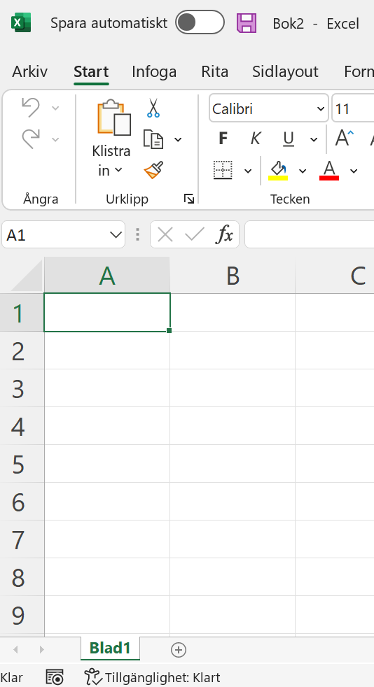
```

*Empty workbook*

Excel looks different depending on what language the program or computer is set to. The examples in this chapter are primarily in English. If your program is set to Swedish language, it will show "Blad1" instead of "Sheet1" at the bottom left of the workbook. To change the user language in Excel, go to File menu > More... > Options > Language > Office Display Language.

There are several different ways to work in Excel. Excel supports several different types of programming languages, for example. Here we primarily describe how to work in the worksheets and using the menus. The boxes in Excel's worksheets are called cells. The cells are numbered according to column and row. The top cell in the upper left is called A1. The cell to the right of this is B1. The cell below A1 is called A2, and so on. In the cells we can write numbers, letters, or mathematical calculations. Click on a cell to place the cursor in that cell. Write an equals sign and a mathematical expression. When we have finished writing the expression, we press the Enter key. A mathematical expression in a cell can look like this, for example: `=1+2`. After we press Enter, the cell changes to show the result of the mathematical expression: 3. Division where we divide 1 by 2 is written: `1/2`. Multiplication is written with an asterisk, for example: `1*2`. To calculate power expressions, such as $2^{3}$, we write: `=2^3`.

Computer programs distinguish between numbers and text strings. A text string can contain numbers, which are then perceived as text characters. We indicate that something is a text string by using quotation marks. Example: If we write `=13`, the program treats it as a number, a numeric value. If we write `="13"`, the program treats this as a text string.

Computer programs generally understand information in a less flexible way than we humans do. For a computer, the words "human" and "Human" are different because in the latter we use a capital letter for H. This is called case-sensitive input.

If we want to be sure about how the program handles information in a cell, we can change the cell's data format by selecting one or more cells and right-clicking. In the menu that appears, we select "Format Cells...". A new dialog box appears where we choose how Excel should handle information in the cell. For example, whether the information should be handled as text, a number with decimals, as a currency, a date, and so on.

Changing the data format can also affect how the information in the cell is displayed, for example the number of decimals. Changing the number of decimals does not affect the information stored in the cell. If we change the format from, for example, a number to text, however, the actual content is also affected.

## Import and edit data {#sec-excel-import}

The workbook can be saved as a file on your computer's hard drive. Excel has several proprietary file formats where .xlsx is the standard format for the type of exercises we will do in this chapter. In Excel's worksheets, we see the data we are working with and we edit directly in the actual data material. This creates a significant risk that we might accidentally overwrite important information or change something that shouldn't be changed. Therefore, be careful to continuously save your files in such a way that you can easily undo your work steps.

Another common file format that Excel can read is .csv. The abbreviation csv stands for Comma-Separated Values. Csv files contain data tables where different observations are separated by a comma character.

Data in csv files can also be separated by other types of characters, for example semicolons or tabs (a number of spaces). If we try to open a csv file in Excel, it is important that the program knows which character separates the data. Csv files are not unique to Excel but can be read by many other programs, including the two other analysis tools described in this book. There are also several other ways to import and export data to and from Excel from various types of sources, which there isn't space to describe here. You can find more examples under the Data menu > Get & Transform Data.

In Excel, we edit the information in each cell by placing the cursor on a cell or in the cell. We also select multiple cells and press Delete to erase the information in all these cells at once. If we press Ctrl + -, the entire cell or cells that are selected are deleted. When we delete one or more cells, the cells to the right or below the deleted cells move left or up to replace the deleted cells.

We select entire rows by clicking on a row's row number at the far left of the worksheet, and entire columns by clicking on the column's letter at the top of the worksheet. If we delete an entire row, all rows below move up and replace the deleted row. If we delete a column, all columns to the right of this column move left and replace the deleted column. To select all cells in an area or a worksheet, we press Ctrl + A.

## Worksheet functions {#sec-excel-functions}

In Excel's cells, we can use Excel's own worksheet functions. These functions are ready-made commands that perform different types of operations. Excel currently has 484 functions of this type. In this book, we only go through a small selection. Microsoft provides lists and descriptions of all functions on their website: <https://support.microsoft.com/sv-se/excel>

All functions are written with the function's name followed by parentheses. Example: `SUM()`. The function is called SUM. In the parentheses after the function's name, we write the arguments that the function should use. For example `SUM(3,8)`. In this case, we have two arguments in the form of the numbers 3 and 8. Each argument is separated with a comma (,). If we place the cursor in a cell in our Excel sheet and write `=SUM(3,8)` and press Enter, the function returns the sum of 3+8, that is, the value 11. The cell then displays the value 11, but the function remains in the cell. If we click on the cell again, or select the cell and press F2, we may edit the function we used.

Which arguments a function can use varies between different functions. The arguments can consist of references to other cells in Excel, in the same or another worksheet. The figure below shows an example with `SUM(A1,A2,A3)`. A1, A2, and A3 are interpreted by Excel as references to the corresponding cells. The function retrieves the value in each cell and calculates the sum. The SUM function is used in this example in cell A4, where the function's result is returned.

We can also refer to several adjacent cells as one and the same argument. The figure below shows an example where we use the command `=SUM(A1:A3)`. The colon indicates that we are referring to all cells from cell A1 through cell A3. Between cell A1 and A3, there is only cell A2, which is also included. When we write `SUM(A1:A3)`, the cells A1:A3 are used as one argument to the `SUM()` function. We do not use a comma to separate the reference to the cells. If we want to refer to the entire column A, we can instead write A:A, for example `SUM(A:A)`. If we refer to the entire column, we must write the command `=SUM(A:A)` in a cell that is not located in the same column A. If we write the command in a cell in column A, a circular reference is created. Circular reference refers to a cell that refers, among other things, to itself. Circular reference can also occur if a cell refers to a cell that indirectly refers to itself, for example through a third cell.

```{r, out.width="45%", fig.align="center", echo=FALSE}
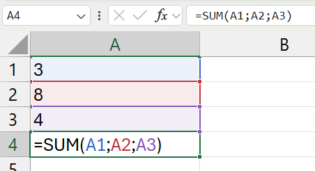
```

*Each argument is a cell reference*

```{r, out.width="45%", fig.align="center", echo=FALSE}
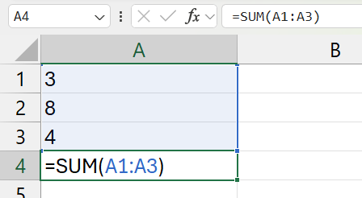
```

*Multiple cells as one argument*

All worksheet functions in Excel have their own help pages. These are often worth reading and contain practical tips on how to use the function in different ways. To find a help section about a function, we can do one of the following:

- Go via Help menu > Help. Search for the function's name.
- Place the cursor in a cell and write the function's name, don't press Enter. Press F1.
- Place the cursor in a cell and write the function's name. The program now shows a box just below the cell with some instructions for what type of arguments the function needs. Click with the cursor in this box on the function's name.

Excel has several functions for different types of mathematical operations. Here are some examples:

- `ABS()`: Returns the absolute value of a number. Example: `ABS(-4)` returns result 4, since $|-4|=4$.
- `AVERAGE()`: Returns the average of a collection of numbers. Example: `AVERAGE(4,5,12)` returns the value 7.
- `MEDIAN()`: Returns the median of a collection of numbers. Example: `MEDIAN(4,5,12)` returns the value 5.
- `LOG()`: Returns the base-10 logarithm of a number. Example: `LOG(100)` returns result 2, since $\log_{10}100=2$ and $10^{2}=100$. If we want, we can specify a different base than 10 as the second argument in the function. Example: `LOG(100,2)` returns the logarithm for the number 100 with base 2, which is approximately 6.644.
- `LN()`: Returns the logarithm of a number with base e, the natural logarithm. Example: `LN(10)` returns result approximately 2.3, since $\ln 10 \approx 2.3$.
- `SUMPRODUCT()`: Returns the sum of products of two or more collections of values. See example in the section on combining functions below.
- `FACT(a)` where a > 0. Returns a factorial. Example: `FACT(3)` = $3! = 3*2*1$.
- `PERMUT(a,b)` where a and b are arbitrary numbers and a > b. Returns the number of permutations: $\frac{a!}{\left(a-b\right)!}$.

## Quick ways to fill multiple cells {#sec-excel-fill-cells}

Often we want to calculate several similar results next to each other. Several sums or several logarithmic values. This section goes through some examples of how we can do this. All Excel functions we use in this book can use information from another cell as arguments.

Some functions are designed to use a value, for example from a cell, to return a result. Above we used, for example, the `LOG()` function which returns the logarithm of a number. If we nevertheless specify multiple values as arguments, the function can still return multiple results, but then in separate cells. The figure below shows an example where we have three numbers in column A. In cell B1 we write `LOG(A1:A3)` which retrieves the information in cells A1 to A3 as an argument to the `LOG()` function. When we press Enter, the program returns the results from the function in cells B1, B2, and B3. In cell B1 we get the result $\log_{10}10=1$. In cell B2 we get $\log_{10}100=2$, in cell B3 we get $\log_{10}1000=3$.

```{r, out.width="80%", fig.align="center", echo=FALSE}
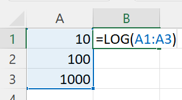
```

```{r, out.width="40%", fig.align="center", echo=FALSE}
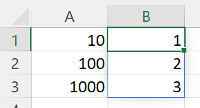
```

*Reference multiple cells at the same time*

Some functions are designed to use multiple values as one argument, for example as we described that the `SUM()` function calculates the sum of a collection of numbers. If we refer to three cells in the parentheses of `SUM()`, we get the sum of the values in those cells. Sometimes, however, we want to calculate the sum of different combined values next to each other.

The figure below shows an example where we want to calculate the sum of the cells in rows 1 to 3 in each respective column. One way to get one sum per column is to select the cells in row 5 in the columns we want to calculate the sum for, in this case columns A to D. Without clicking anywhere, we then begin typing the content we want in cell A5: `=SUM(A1:A3)`. Press Ctrl + Enter. Now cells B5, C5, and D5 are also filled with the `SUM()` function and references to the cells in rows 1 to 3 in each respective column.

```{r, out.width="70%", fig.align="center", echo=FALSE}
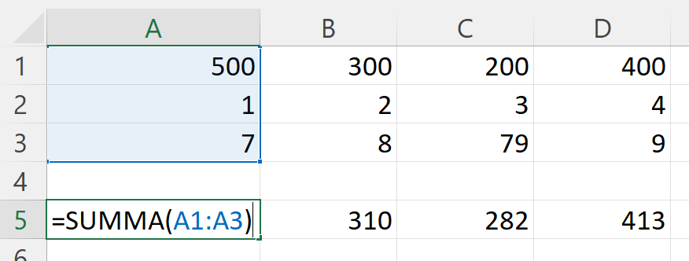
```

*One sum per column*

## Combining functions within calculations {#sec-excel-combining-functions}

A weighted average for variable $X$ can be calculated as $\bar{X}_{\text{weighted}}=\frac{\sum_{i}^{n}x_{i}v_{i}}{\sum_{i}^{n}v_{i}}$ where $x_{i}$ is the value for observation $i$ and $v_{i}$ is the weight for this observation. Say that the two school classes A and B have 10 and 20 students respectively. On the latest math test, the students in the two classes scored 32 and 42 points respectively. The weighted average of their test results:

$$\bar{X}_{\text{weighted}}=\frac{\sum_{i}^{n}x_{i}v_{i}}{\sum_{i}^{n}v_{i}}=\frac{10*32+20*42}{10+20}=\frac{1160}{30}\approx38.7$$

Now we will use Excel to calculate a weighted average. Excel has no ready-made function for this, but we can combine the `SUMPRODUCT()` and `SUM()` functions. In the numerator of the equation above we have the sum of products $\sum_{i}x_{i}v_{i}$ and in the denominator we have the sum $\sum_{i}v_{i}$.

The figure below shows an example of how it can look in Excel. Column B contains the test scores for classes A and B. Column C contains the number of students. In cell E4 we calculate the sum of products in the numerator. In cell E5 we calculate the sum in the denominator. In cell E6 the weighted average is calculated by combining the two functions. In the parentheses of `SUMPRODUCT()` we refer as the first argument to cells B2:B3. As the second argument we refer to cells C2 and C3. The `SUMPRODUCT()` function then calculates the following expression: 32 * 10 + 42 * 20 = 1160. If we divide this by the sum of the weights 10 + 20, the result is approximately 38.7. This is the result we calculate in cell E6.

```{r, out.width="70%", fig.align="center", echo=FALSE}
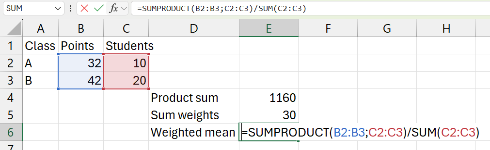
```

*Calculate a weighted mean*

We can also combine functions by writing one or more functions in the parentheses of another function. The figure below shows an example. In cells A1, A2, and A3 we have the values 10, 100, and 1000. We want to use the base-10 logarithm of each value and calculate the sum of the logarithmic values. In cell B4 we write `=SUM(LOG(A1:A3))` and get the result 6:

$$\log10+\log100+\log1,000=1+2+3=6$$

```{r, out.width="60%", fig.align="center", echo=FALSE}
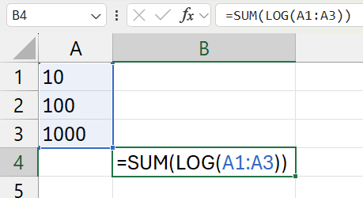
```

*Example of a function within a function*

## Logic conditions {#sec-excel-logic}

In data analysis, we often use logical conditions. A logical condition is true or false. With numbers, we can describe it as the condition being either 1 (true) or 0 (false). Excel's `IF()` function checks whether a logical condition is met and returns a value based on that. We can define which value the function should return if the condition is true or false.

The figure below shows an example where we have a collection of numbers in column A. In column B we use the `IF()` function to test the logical condition of whether the value in column A is under 10. We refer to all cells A1 to A7 simultaneously, see the section on filling multiple cells above. Depending on whether the logical condition is true or false, the function returns the values "yes" or "no" in cells B1 to B7.

```{r, out.width="60%", fig.align="center", echo=FALSE}
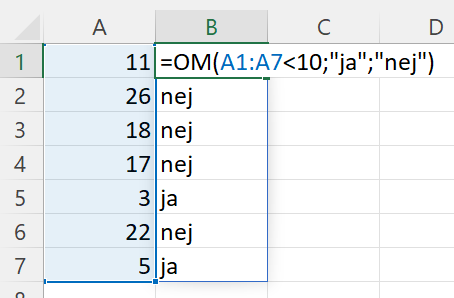
```

*Example with function IF()*

The `SUMIF()` function calculates the sum of a collection of values if these values meet a logical condition. The figure below shows an example where we sum the values in column A that are less than 10. The `SUMIF()` function needs three arguments:

1. The cells for which the condition should be tested. In this case: A1 to A7.
2. The condition. This is formulated with quotation marks. In this case `"<10"`. If we want to check whether the cells are equal to the value 10, we write only the value itself: `"10"`.
3. Cells that should be summed. In this case: A1 to A7.

```{r, out.width="60%", fig.align="center", echo=FALSE}
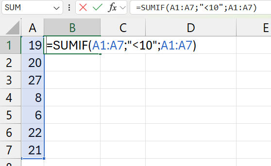
```

*Example with function SUM.IF()*

The figure above shows an example where we calculate the sum of the values in column A that are less than 10. The answer is returned in cell B1. The sum in this case becomes 8 + 6 = 14.

If we want to calculate a sum with multiple conditions, we can use the `SUMIFS()` function. The first argument is the range to be summed, after which we can add any number of conditions and condition ranges. This is useful, for example, if we have values that are grouped at multiple levels. For example, a list of employees (column A) at a company who work in different departments (column B) with different job tasks (column C) and we want to calculate the sum of salaries (column D) per department and job task.

Above we described the `AVERAGE()` function for calculating averages. Averages can also be calculated with conditions, for which we can use the `AVERAGEIF()` and `AVERAGEIFS()` functions, which work in the same way as `SUMIF()` and `SUMIFS()`.

## Calculate index with Excel {#sec-excel-index}

To compare relative differences in, for example, a time series with values, we can use an index with a base year. The base year's value can, for example, be 100. Index for year t is calculated as:

$$\text{Index}_{t}=\frac{\text{Value}_{t}}{\text{Value}_{\text{base year}}}*100$$

In Excel, we can calculate this by referring to cells with our time series and using division and multiplication. The figure below shows an example where we have years in column A and data on Sweden's GDP in column B. In column C we write the formulas for our index. Column D shows the result with two decimal places.

```{r, out.width="70%", fig.align="center", echo=FALSE}
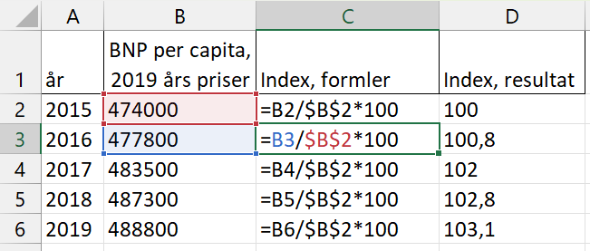
```

*Calculate an index*

There are several ways to make this calculation faster and more convenient. We start by writing the formula in cell C2: `=B2/ $B$ 2*100`. This gives the result 100, which is shown in cell D2. The reason we use dollar signs $here is to be able to fill in the rest of the cells in column C faster. To fill in the other cells in column C, we start by selecting cells C3 to C6 in one of the following ways:

- Use the mouse cursor to select cell C3, hold down the mouse button and drag to cell C6 so C3:C6 is selected.
- Use the mouse cursor to select cell C3. Release the mouse. Hold down the Shift key and use the mouse cursor to click on C6. Now all three cells C3:C6 are selected.
- Select cell C3. Release the mouse. Hold down the Shift key and press the Down arrow key until we reach cell C6.

When cells C3 to C6 are selected, press Ctrl + D. The keyboard shortcut Ctrl + D copies the formula in cell C3 to the other cells and changes the references to the corresponding cells in column B. The numerator in the fraction, which we wrote as B2, changes for each row to B3 on row 3, B4 on row 4, and so on. The dollar sign means that the cell reference ` $B$ 2` in the denominator is locked and remains the same even in the other cells, which we want because this is the base year. If we want to do the same type of copying in cells to the right of the leftmost cell in a selection, we can use the keyboard shortcut Ctrl + R.

Another way to achieve the same thing is to first select cells C3:C6. Then begin, without selecting any other cell, typing the equation `=B2/ $B$ 2*100`. Press Ctrl + Enter, whereupon all cells are filled with the corresponding equation where the cell reference B2 is updated in the other cells but ` $B$ 2` is locked and remains the same.

## Matrix calculations {#sec-excel-matrices}

A matrix is a collection of values organized in a row, a column, or in multiple rows and columns. In accordance with the calculation rules for matrices, there are special functions in Excel for calculating with matrices. To add or subtract two matrices, we can use regular mathematical operations in a similar way to what we have gone through above. The figure below shows an example with matrix A in cell A1:B2 and matrix B in cell D1:E2. Note that we now use a colon to describe ranges between two cells in different columns and on different rows.

To subtract matrix A-B, we select cell D4:E5. It is in this $2\times2$ field that we will get the result of the calculation. Without moving the cursor, we then write `=A1-D1` and press Ctrl + Enter. Although what we wrote appears in cell D4, cells D5, E4, and E5 are now automatically filled with corresponding references to matrix A and B. The figure below shows only the formulas. The result becomes a $2\times2$ matrix with the value -4 in each cell:

$$A-B=\left[\begin{matrix}1 & 2\\ 3 & 4\end{matrix}\right]-\left[\begin{matrix}5 & 6\\ 7 & 8\end{matrix}\right]=\left[\begin{matrix}-4 & -4\\ -4 & -4\end{matrix}\right]$$

```{r, out.width="70%", fig.align="center", echo=FALSE}
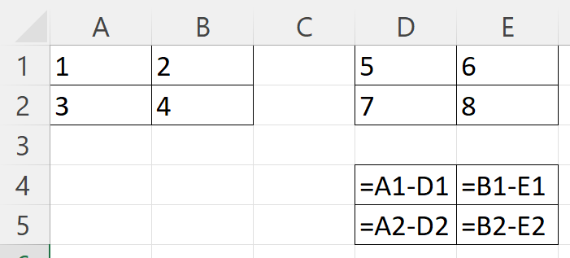
```

*Subtract matrix $A-B$*

Given that the number of rows in A equals the number of columns in B, we can calculate the matrix product AB:

$$AB=\left[\begin{matrix}1 & 2\\ 3 & 4\end{matrix}\right]\left[\begin{matrix}5 & 6\\ 7 & 8\end{matrix}\right]=\left[\begin{matrix}1*5+2*7 & 1*6+2*8\\ 3*5+4*7 & 3*6+4*8\end{matrix}\right]=\left[\begin{matrix}19 & 22\\ 43 & 50\end{matrix}\right]$$

Matrix multiplication can be performed with Excel's `MMULT()` function. In the parentheses of `MMULT()` we specify two arguments with references to the cells that contain the values for the two matrices we want to multiply. The figure below shows an example where we matrix multiply the values in the four cells A1:B2 (matrix A) with the four cells D1:E2 (matrix B). The `MMULT()` function is used in cell D4, where the first argument in the parentheses is A1:B2 and the second argument is D1:E2. The arguments are separated as usual with a comma. The result becomes a new $2\times2$ matrix, whose values will be shown in the four cells D4:E5.

```{r, out.width="70%", fig.align="center", echo=FALSE}
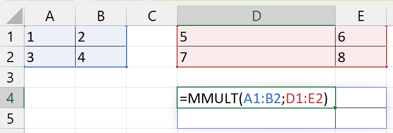
```

*Matrix multiplication with MMULT()*

We can transpose a matrix with the `TRANSPOSE()` function by specifying in the function's parentheses the matrix we want to transpose. We can calculate the inverse of a matrix with the `MINVERSE()` function, specifying in the parentheses the matrix for which we want to calculate the inverse matrix. The figure below shows an example where we transpose the $2\times2$ matrix in cells A1:B2. The result will be shown in D1:E2. The figure after that shows an example where we use the `MINVERSE()` function to calculate the inverse matrix of the $2\times2$ matrix in cells A1:B2. The result will be shown in cells D1:E2.

```{r, out.width="60%", fig.align="center", echo=FALSE}
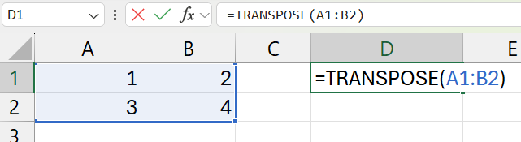
```

*Transpose matrix with TRANSPOSE()*

```{r, out.width="60%", fig.align="center", echo=FALSE}
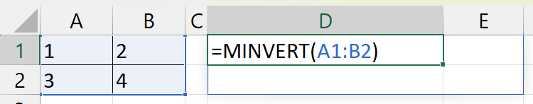
```

*Calculate inverse matrix with MINVERT()*

### Solving a system of equations

Say now that we have the following system of equations:

$$\begin{cases}x_{1}-2x_{2} & =3\\ 4x_{1}+5x_{2} & =6\end{cases}$$

This system has the unique solution $x_{1}^{*}=\frac{27}{13},\, x_{2}^{*}=-\frac{6}{13}$. There are several ways we can use Excel to help find these solutions. One way is to use matrix calculations. Let us write the system of equations with matrices:

$$KX=Y \quad \left[\begin{matrix}1 & -2\\ 4 & 5\end{matrix}\right]\left[\begin{matrix}x_{1}\\ x_{2}\end{matrix}\right]=\left[\begin{matrix}3\\ 6\end{matrix}\right]$$

The solution can now be given by matrix multiplying both sides with the inverse matrix $K^{-1}$:

$$K^{-1}KX=K^{-1}Y \quad \left[\begin{matrix}x_{1}\\ x_{2}\end{matrix}\right]=\left[\begin{matrix}\frac{27}{13}\\ -\frac{6}{13}\end{matrix}\right]$$

The figure below shows how we can calculate these matrices in Excel. Cells A2:B3 contain matrix K. Cells D2:D3 contain matrix $Y$. Cell A6:B7 contains the inverse matrix $K^{-1}$ and cell D6:D7 contains $Y^{*}=K^{-1}Y$.

```{r, out.width="70%", fig.align="center", echo=FALSE}
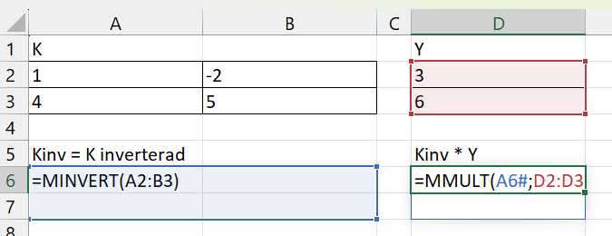
```

*Solving systems of equations with matrix algebra*

Excel also has functions in the menus that we can use to solve equations with unknown variables. Say as an example that we want to find the value for x in the following polynomial:

$$x^{3}+4x^{2}-10x=30$$

For this we can use Excel's Goal Seek function, which we access by clicking on the Data menu > What-If Analysis > Goal Seek... The Goal Seek dialog box opens, where we must fill in three values. Set cell: the equation we want to solve. To value: the value that the equation should equal, in this case 30. By changing cell: the cell that we use as a reference for the variable $x$. The figure below shows an example where we have entered the left side of the equation above, that is, without =30. Instead of x we refer to the empty cell B4. If we click OK, Excel searches for the solution.

```{r, out.width="70%", fig.align="center", echo=FALSE}
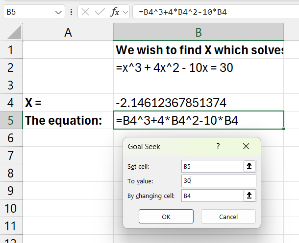
```

*Goal seek*

## Input-output analysis {#sec-excel-io}

Matrices can be used for input-output analysis and network analysis, among other things. Input-output analysis often starts from flow tables that describe how companies in different industries in an economy produce input goods for their own and other industries in the economy, as well as goods and services for final consumption. We call the flow matrix Z. We take the multiplicative inverse of total production for industry j that goes to input goods and final consumption per industry, as $\frac{1}{s_{j}}$. These inverses for all industries we collect in matrix $S_{m}$. From this we can define matrix $A$:

$$A=Z*\text{diag}\left(S_{m}\right)$$

where $\text{diag}\left(S_{m}\right)$ is a diagonal matrix with the multiplicative inverse of total production per industry along the diagonal. We define matrix $C$ as a column matrix with the production per industry that goes to final consumption. The total production required from industry $j$ for all input goods and final consumption we call $y_{j}$. We collect the values for this for all industries in matrix $Y$ and write:

$$\begin{align}Y & =AY+SY-AY\\ & =S\left(I-A\right)Y\\ & =SY\\ & =\left(I-A\right)^{-1}S\end{align}$$

where $I$ is an identity matrix with the same dimensions as $A$. The values in Y are the total production required for this economy taking into account both input goods and final consumption. We call $B=\left(I-A\right)^{-1}$ where $B$ has the same dimensions as $A$. The sum of column $j$ in $B$ is the output multiplier for industry $j$. The sum of row $j$ in $B$ is the input multiplier for industry $j$. These things we can calculate in Excel using the functions we used above.

The figure below shows an example with the matrices:

$$Z=\left[\begin{matrix}2 & 1\\ 1 & 3\end{matrix}\right],\,C=\left[\begin{matrix}3\\ 3\end{matrix}\right],\,S=\left[\begin{matrix}6\\ 7\end{matrix}\right]$$

```{r, out.width="70%", fig.align="center", echo=FALSE}
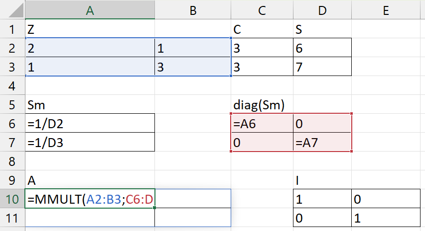
```

*Input-output analysis with Excel, step 1*

We calculate:

$$A=Z*\text{diag}\left(S_{m}\right)=\left[\begin{matrix}2 & 1\\ 1 & 3\end{matrix}\right]*\left[\begin{matrix}\frac{1}{6} & 0\\ 0 & \frac{1}{7}\end{matrix}\right]=\left[\begin{matrix}\frac{1}{3} & \frac{1}{7}\\ \frac{1}{6} & \frac{3}{7}\end{matrix}\right]$$

Then we can calculate:

$$B=\left(I-A\right)^{-1}=\left[\begin{matrix}\frac{2}{3} & -\frac{1}{7}\\ -\frac{1}{6} & \frac{4}{7}\end{matrix}\right]^{-1}=\left[\begin{matrix}\frac{8}{5} & \frac{2}{5}\\ \frac{7}{15} & \frac{28}{15}\end{matrix}\right]$$

From this matrix we can then calculate the column and row sums to get the output and input multipliers for each industry. Total production required from each industry is given by column matrix $Y$:

$$Y=\left(I-A\right)^{-1}S=\left[\begin{matrix}\frac{8}{5} & \frac{2}{5}\\ \frac{7}{15} & \frac{28}{15}\end{matrix}\right]*\left[\begin{matrix}6\\ 7\end{matrix}\right]=\left[\begin{matrix}12.4\\ 15.9\end{matrix}\right]$$

The figure below shows the calculations for matrix $B$ and $Y$, where we use the same functions as before.

```{r, out.width="70%", fig.align="center", echo=FALSE}
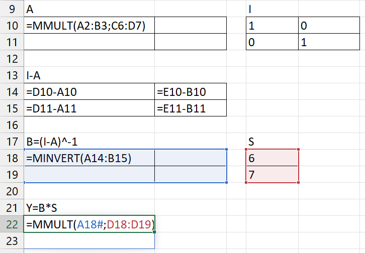
```

*Input-output analysis with Excel, step 2*

## Variance and covariance {#sec-excel-variance}

If we want to calculate how a collection of values is distributed, we can calculate the frequency distribution, among other things — the number of observations per unique value or the number of observations within different intervals, for example using the `FREQUENCY()` function. The figure below shows an example. In column A we have variable x which contains a collection of values, all between 0 and 1. In column B we use the `UNIQUE()` function, which returns the unique values from the numbers in column A. The unique values in this case are 0.1, 0.2, 0.3, ..., 0.9 and 1. The results will be shown in cells B2:B11. In column C we use the `FREQUENCY()` function to count the number of occurrences in column A of each respective value in column B. The result is shown in the chart to the right in the image.

```{r, out.width="70%", fig.align="center", echo=FALSE}
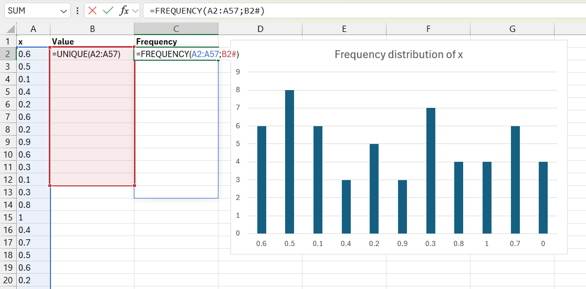
```

*Frequency distribution*

We have described above the `AVERAGE()` function for mean, and the `MEDIAN()` function. Mode describes the value in a collection that occurs most frequently. For example, among the values 3, 3, 15, 27, the mode is 3, because it occurs twice and the other values only occur once each. In Excel, mode can be calculated with the `MODE.SNGL()` function. In the parentheses we are required to specify cells or values on which the mode should be calculated. Example: `MODE.SNGL(A:A)` returns the most common value in column A.

If there are multiple values that occur most frequently in a collection, we can use the `MODE.MULT()` function. If we use this function as usual in a cell, it returns the mode for a collection of numbers. The figure below shows an example with `MODE.MULT()`. In column A we have the values 4, 5, 5, 6, 6, 6, 5. The values 5 and 6 occur three times each.

To show multiple modes, we select cells B1 to B4. Without clicking anywhere else, we now write `=MODE.MULT(A:A)`. Press Ctrl + Shift + Enter. This command creates what is called an array formula. When `MODE.MULT()` is used as an array formula, it returns multiple modes, if there are multiple. If only one value in the collection is most common, the function returns the same value in all cells.

The result is shown in cells B1 to B4. Since the values 5 and 6 are most common with three occurrences each, these are shown in cells B1 and B2. In the collection of values, only one other value occurs, 4, once. Since no other values occur as frequently as the numbers 5 and 6 in the collection, the value #N/A! is returned in cells B3 and B4.

```{r, out.width="60%", fig.align="center", echo=FALSE}
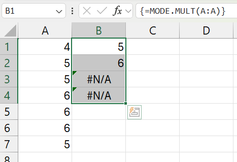
```

*Example with MODE.MULT()*

A common type of measure of dispersion is percentiles, deciles, and quartiles. A percentile divides a collection of values into 100 equal parts. The 10th percentile is greater than 10 percent of the values in the collection and less than 90 percent. Deciles instead divide the collection into ten equal parts. The 10th percentile is the same as the 1st decile. The 9th decile is the same as the 90th percentile. Quartiles divide the collection of values into four equal parts. The 25th percentile is the same as the 1st quartile. The 50th percentile is the same as the 2nd quartile, 5th decile, and the median.

In Excel, we can calculate percentiles, deciles, and quartiles with the `PERCENTILE.INC()` and `PERCENTILE.EXC()` functions. Both of these functions calculate percentiles. In the parentheses of the functions, we must specify two arguments: First, the values on which the percentiles should be calculated, or a reference to the cells that contain the values. The second argument should be a value that defines which percentile we want to return, by specifying a value between 0 and 1.

The difference between the functions is that for `PERCENTILE.INC()` we can specify the values 0 and 1 and all decimals in between. If we specify 0, we get the lowest value in the collection, and if we specify 1, we get the highest value in the collection. For `PERCENTILE.EXC()`, the boundary values 0 and 1 are excluded. We must instead specify a decimal value that at least gives us the next value above or below the boundary values.

The figure below shows an example where we have a collection of values in column A. In column B we calculate using the `PERCENTILE.INC()` function the 0th, 10th, 25th, 50th, 75th, and 90th percentiles in cells B2 to B8. The results that the functions return are also pasted in cells B11 to B17.

```{r, out.width="60%", fig.align="center", echo=FALSE}
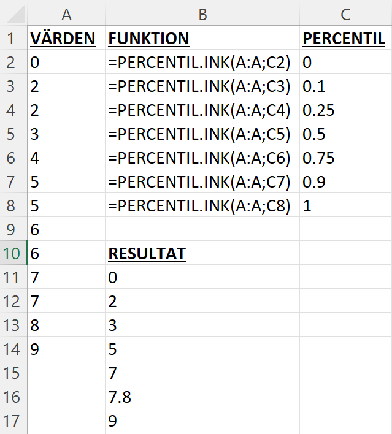
```

*Calculate percentiles with PERCENTILE.INC()*

If we want to estimate the variance for a sample from a population, we can use the `VAR.S()` function. If the observations we have access to are population data, we can instead use the `VAR.P()` function. The corresponding functions for estimating standard deviation are `STDEV.S()` for sample data and `STDEV.P()` for population data. In the parentheses for each respective function, we specify the values, or reference to cells with the values, that we want to perform the analysis on. For example: `VAR.S(1,2,3)` or `VAR.S(A:A)`.

Excel also has several functions for estimating covariation. To estimate the covariance between two variables, we can use the `COVARIANCE.P()` function if we have population data and the `COVARIANCE.S()` function if we have sample data. The figure below shows an example where we estimate the covariance between variables X and Y. Data for the variables can be found in cells A2:B5. We enter `COVARIANCE.S()` in cell D2 and specify in the parentheses references to the variables' data in cells A2:A5 and B2:B5 respectively.

```{r, out.width="60%", fig.align="center", echo=FALSE}
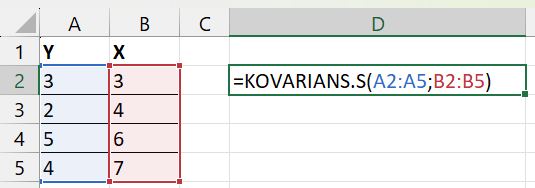
```

*Covariance with COVARIANCE.S()*

To estimate the correlation coefficient, Pearson's r, we can use the `CORREL()` function. In the parentheses we specify references to the values for the two variables we want to estimate the covariation between. The figure below shows an example where we estimate the correlation coefficient between $Y$ and $X$. We enter `CORREL()` in cell D2 and refer to data in cells A1:A5 and B1:B5 respectively.

## Probability {#sec-excel-probability}

Excel has several ready-made functions for calculating probabilities based on some of the most well-known probability distributions. To calculate probabilities for a random variable that follows a normal distribution, we can for example use the `NORM.DIST()` function. The function has four arguments: the input value x, the distribution's mean, the distribution's standard deviation, and a logical argument regarding whether we want to use the normal distribution's cumulative distribution function $F\left(x\right)$ or density function $f\left(x\right)$.

The figure below shows an example where we use `NORM.DIST()` in two columns, one for the cumulative distribution function and one for the density function. In all cells we specify mean 0 and standard deviation 1, that is, the standard normal distribution. In column A we find the input values for x: -3 to 3. The figure shows the formulas in all cells in columns B and C. In the charts below these cells we can see the returned values illustrated in a chart for the cumulative distribution function (left) and one for the density function (right).

```{r, out.width="60%", fig.align="center", echo=FALSE}
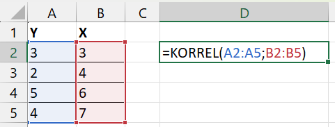
```

*Correlation with CORREL()*

```{r, out.width="70%", fig.align="center", echo=FALSE}
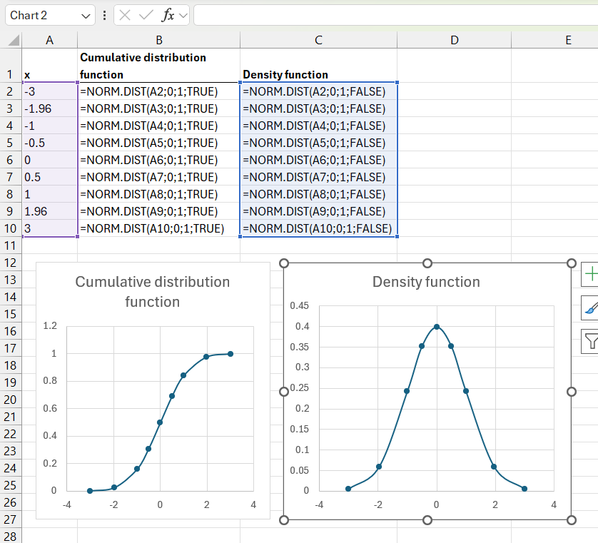
```

*Calculate probabilities for the normal distribution*

If we want to know which value $x$ corresponds to a specified probability in the normal distribution's cumulative distribution function $F\left(x\right)$, we can use Excel's `NORM.INV()` function. The function has three arguments: a value for the probability, the distribution's mean, and the distribution's standard deviation. Say as an example that we have a standard normal distribution, like the example in the figure above. Since the mean marks half of the probability distribution, $x=0$ gives that the cumulative distribution function $F\left(0\right)=0.5$. If we want to know which value for $x$ gives this cumulative probability, we write `=NORM.INV(0.5, 0, 1)` in a cell in our worksheet and press Enter.

There are several functions that correspond to `NORM.DIST()` but for other probability distributions. If we want to work with the standard normal distribution and avoid having to specify mean and standard deviation, we can use the `NORM.S.DIST()` function.

The `T.DIST()` function returns the probability for a left-tailed t-distribution based on three arguments: variable value x, degrees of freedom, and whether the function should return values for the distribution function (TRUE) or density function (FALSE). The corresponding function for getting probabilities for a right-tailed t-distribution is `T.DIST.RT()`, which only has two arguments: variable value x and degrees of freedom.

The `T.DIST.2T()` function returns the probability for a two-tailed t-distribution based on two arguments: variable value x and degrees of freedom. To instead obtain the variable value x that corresponds to a specified probability for a two-tailed t-distribution, we can use the `T.INV.2T()` function. This function has two arguments: probability and degrees of freedom. If we for example write `T.INV.2T(0.05, 300)`, the function returns approximately 1.9679. If we then specify `T.DIST.2T(1.9679, 300)` based on this, this function in turn returns the value 0.05. That is, 5 percent.

Table: Probability distributions in Excel

| **Probability Distribution** | **Example Functions in Excel** |
|:------------------------------|:-------------------------------|
| Binomial distribution | BINOM.DIST() |
| Poisson distribution | POISSON.DIST() |
| Exponential distribution | EXPON.DIST() |
| Gamma distribution | GAMMA.DIST() |
| Chi-square distribution | CHISQ.DIST(), CHISQ.DIST.RT(), CHISQ.INV(), CHISQ.INV.RT() |
| F-distribution | F.DIST(), F.DIST.RT(), F.INV(), F.INV.RT() |
| Normal distribution | NORM.DIST(), NORM.INV() |
| T-distribution | T.DIST(), T.DIST.RT(), T.DIST.2T(), T.INV.2T() |

The table above describes examples of other functions in Excel for various common probability distributions. See each function's help section for more information about how that particular function works. Excel has no ready-made functions for uniform probability distributions.

Excel also has ready-made functions for statistical tests based on several common probability distributions. The normal distribution is symmetric with half of the probability distribution below and above the mean respectively. This means that the distribution function $F\left(-x\right)=1-F\left(x\right)$. For a one-tailed statistical test with the normal distribution and confidence level $\alpha=0.05$, we set the critical value in one tail so that the calculated statistic must be greater than 95% of the distribution. For a two-tailed test with the same $\alpha$, the critical value in each respective tail corresponds to $\alpha/2=0.025$, which means that the critical region in each respective tail corresponds to 2.5% of the distribution.

Say as an example that we have two normally distributed variables with means $\bar{X}_{1}=83.95$ and $\bar{X}_{2}=80.38$ with variance (standard deviation squared) $s_{1}^{2}=1.663$ and $s_{2}^{2}=1.032$ and $n_{1}=n_{2}=3$. We use a z-test (based on the standardized normal distribution) to calculate the probability that these two variables come from the same population with the same mean:

$$z=\frac{\bar{X}_{1}-\bar{X}_{2}}{\left(\frac{s_{1}^{2}}{n_{1}}+\frac{s_{2}^{2}}{n_{2}}\right)^{\frac{1}{2}}}\approx\frac{83.95-80.38}{\left(\frac{1.032}{3}+\frac{1.663}{3}\right)^{\frac{1}{2}}}\approx3.767$$

which we can compare against the standard normal distribution's distribution function. Our calculated z-value is so far from the mean that the probability that the two samples would come from a population with the same mean is under one hundredth of a percent. The figure below shows how we can calculate this with Excel. Rows 2 to 5 contain information from samples for variables $X_{1}$ and $X_{2}$. In cell B7 we calculate the z-value above. In cell B8 we calculate the p-value by taking $1-F\left(z\right)$ where $z=3.767$, which gives $p\approx0.000083$. That is, the probability that the two populations have the same mean is very low.

```{r, out.width="80%", fig.align="center", echo=FALSE}
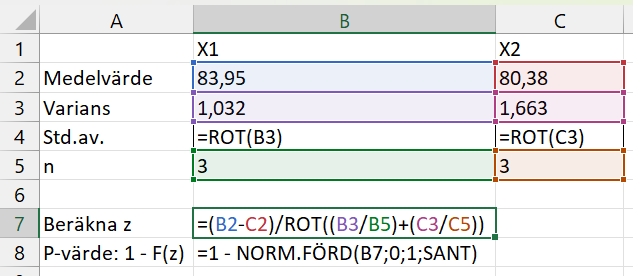
```

*Z test*

Excel also has statistical functions that we can access through the menus. For the next step we first need to install the Analysis ToolPak add-in. Go to the File menu > Options. The Excel Options dialog box opens. Select the Add-ins tab. Under the Manage menu, select Excel Add-ins. Click Go... and check the box for Analysis ToolPak. Click OK. Now we have more tools for statistical analysis, including the Data Analysis dialog box. Go to the Data menu > Data Analysis. A dialog box opens. Select "z-Test: Two Sample for Means". Click OK. A new dialog window opens, see the figure below.

```{r, out.width="70%", fig.align="center", echo=FALSE}
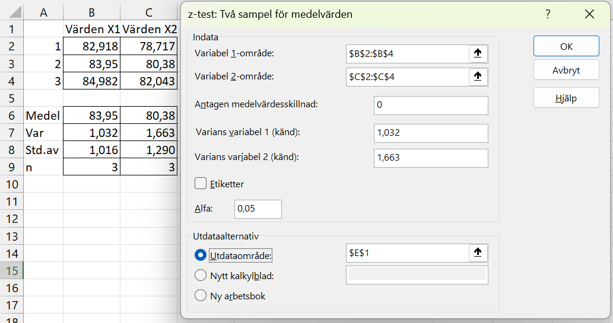
```

*Z-test via dialog interface*

In the worksheet we have three observations for $X_{1}$ and $X_{2}$ respectively in cells B2:B4 and C2:C4. In the dialog window for the z-test, we enter in the Variable 1 Range box a reference to the cells that contain the observations for $X_{1}$: B2:B4. In the Variable 2 Range box we enter a reference to the observations for $X_{2}$: C2:C4. In the Hypothesized Mean Difference box we enter the difference we want to test whether it exists between the two variables. In this case we enter 0 since we want to compare whether the two samples come from the same population and therefore have the same mean. In the variance boxes we enter the variance for each respective variable, which in this example is specified in cells B7 and C7 respectively. Under Output options we can choose where the results should be pasted. If we specify cell E2, the results are displayed in the same worksheet, see the figure below.

```{r, out.width="70%", fig.align="center", echo=FALSE}
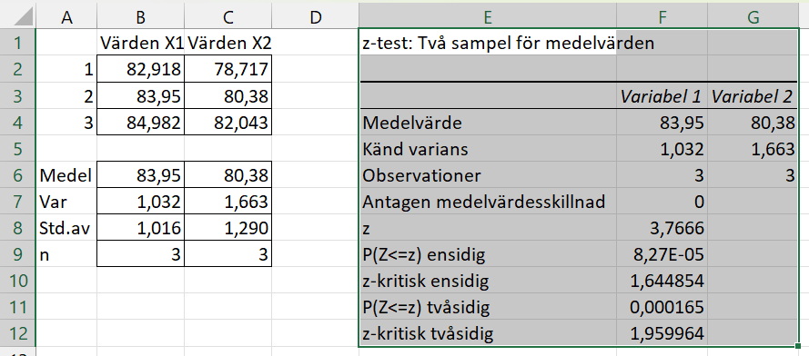
```

*Results from Z-test*

## Regression analysis {#sec-excel-regression}

This section describes different methods for performing regression analysis with Excel. First we go through how we can estimate the coefficients in the regression model using matrix calculations, and then how we can use various shortcuts in Excel.

### Regression analysis using matrices

Now we will estimate the regression model:

$$y=a+bx+u$$

where $y$ and $x$ are variables, $a$ and $b$ are coefficients and $u$ is the error term. A regression model can be written with matrices as

$$Y=BX+U$$

where $Y$ is a column matrix with the dependent variable and its observations. $Y$ has as many rows as observations. Matrix $B$ is the coefficients. Matrix $X$ contains the explanatory variables. The first column in matrix $X$ has the value 1, because in the regression model above we have coefficient $a$, which is not multiplied by any variable (the model's y-intercept). $U$ is a column matrix with the error terms (number of rows = number of observations). The least squares estimator $\hat{B}$ can be described with the following equation:

$$\hat{B}=\left(X^{T}X\right)^{-1}X^{T}Y$$

where $X^{T}$ is the transposed matrix $X$ and $\left(X^{T}X\right)^{-1}$ is the inverse of matrix $X^{T}X$. We will now estimate the regression model with an example where we use four observations for the variables $y=\left\{ 3,4,6,7\right\}$ and $x=\left\{ 3,2,5,4\right\}$. The first observation is $\left(y,x\right)=\left(3,3\right)$ and the second $\left(y,x\right)=\left(4,2\right)$. Matrices $Y$ and $X$ are:

$$Y=\left[\begin{matrix}3\\ 4\\ 6\\ 7\end{matrix}\right],\:X=\left[\begin{matrix}1 & 3\\ 1 & 2\\ 1 & 5\\ 1 & 4\end{matrix}\right]$$

The figure below shows how we can estimate the regression model using Excel's matrix functions that we introduced above. In cells A2:A5 we find the values for variable y, which are also the elements in matrix Y. In cells C2:D5 we find the values for matrix $X$. In cell A8 we use the `TRANSPOSE()` function to create the transposed matrix $X^{T}$. In cell A12 we use `MINVERSE()` to create the inverse matrix $\left(X^{T}X\right)^{-1}$. In cell A16 we use the `MMULT()` function to matrix multiply $X^{T}$ with $Y$. In cell C16 we use `MMULT()` to matrix multiply $\left(X^{T}X\right)^{-1}$ with $X^{T}Y$, which gives $\hat{B}$. In the two cells C16 and C17 we obtain the estimated coefficients $\hat{a}=1$ and $\hat{b}=0.5$ respectively. From here we can continue and for example calculate t-tests for the coefficients, but for this we will instead use shortcuts in the next section.

```{r, out.width="70%", fig.align="center", echo=FALSE}
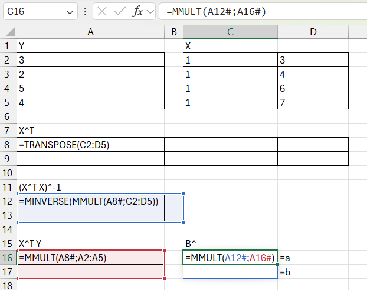
```

*Regression analysis with matrices*

### Regression analysis with LINEST()

In Excel, we can estimate regression models using the `LINEST()` function. We estimate again the regression model $y=a+bx+u$. In the parentheses of `LINEST()` we first need to specify the observations for our dependent variable, which in this case is y. After a comma we specify a reference to the cells where we have observations for our explanatory variables, which in this case is only variable x.

The figure below shows an example where column A contains the values for variable y and column B contains variable x. In cell C6 we use the `LINEST()` function. In the parentheses of the function we refer to the values in columns A and B. The function returns the estimated coefficients $\hat{b}$ and $\hat{a}$ in cells C6 and D6. Note that the function first reports the slope coefficient $\hat{b}$ and then $\hat{a}$. The result is exactly as before: $\hat{a}=1$ and $\hat{b}=0.5$.

```{r, out.width="70%", fig.align="center", echo=FALSE}
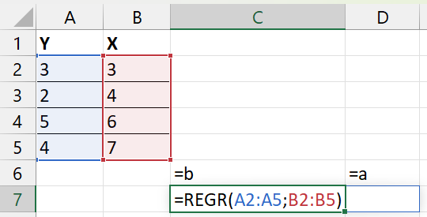
```

*Regression analysis with LINEST()*

Let us take another example. We will now use `LINEST()` to instead estimate the regression model:

$$Y=c+dX+eZ+\epsilon$$

where $Y$, $X$ and $Z$ are variables and $c$, $d$ and $e$ are the coefficients. $\epsilon$ is the error term. The figure below shows an example where we use `LINEST()` and in the parentheses refer to cells A2:A5 (variable $Y$) and B2:C5 (variables $X$ and $Z$). In cells D6, E6 and F6 the three coefficients $\hat{e}\approx2.89$, $\hat{d}\approx0.28$ and finally $\hat{c}\approx-0.54$ are returned, which is thus in reverse order compared to how we set up our regression model.

```{r, out.width="70%", fig.align="center", echo=FALSE}
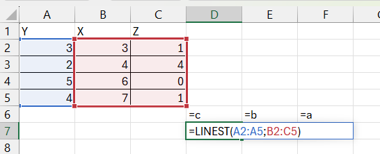
```

*LINEST() with two explanatory variables*

The `LINEST()` function has two optional arguments, const and stats, which we can choose to leave unchanged. The const and stats options are controlled by the logical arguments TRUE and FALSE. The default setting for `LINEST()` is that const=TRUE and stats=FALSE, which is used if we don't specify anything else in the parentheses of `LINEST()`. The results illustrated in the figure above are created with these default settings.

If we instead specify const=FALSE, then the regression model $Y=dX+eZ+\epsilon$ is estimated, without the y-intercept $c$. The second optional argument in `LINEST()` is stats, which controls whether `LINEST()` should also report results for t-tests for the coefficients, F-test for the entire model, and estimate $R^{2}$.

The figure below shows an example where we set the option stats=TRUE, with the same four observations for variables $y$, $x$ and $z$ in columns A, B and C. The results are reported in cells D6:F10. When stats=TRUE, `LINEST()` reports results for a regression model with k coefficients $a_{1}$ to $a_{k}$ with corresponding standard errors $se_{1}$ to $se_{k}$. Estimated coefficients are shown in the first row and standard errors in the second row. The regression statistics include $R^{2}$, estimated standard error for the residuals $\hat{s}_{\hat{\epsilon}}$, F-statistic, degrees of freedom for the F-test $df_{F}$, the sum of squared explained variation $SSE$, and the residual sum of squares $SSR$.

```{r, out.width="70%", fig.align="center", echo=FALSE}
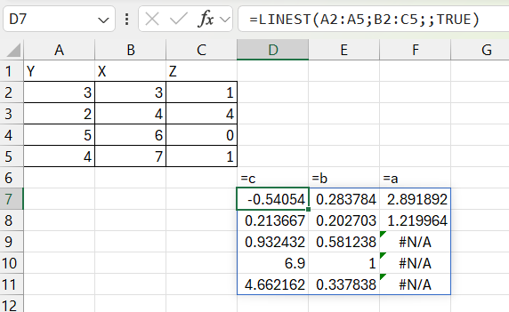
```

*Regression analysis using LINEST() and stats = TRUE*

The top row is in the example row 6 in the worksheet with the estimated coefficients $\hat{c}\approx-0.54$, $\hat{d}\approx0.28$ and $\hat{e}\approx2.89$. The second row, row 7, is the standard error for each respective coefficient: $\hat{s}_{\hat{c}}\approx0.21$, $\hat{s}_{\hat{d}}\approx0.2$ and $\hat{s}_{\hat{e}}\approx1.22$.

Cells D8 to D10 report $R^{2}\approx0.93$, F-statistic for the F-test for the entire regression model $F=6.9$, and the sum of squares of the explained variation $SSE=\sum_{i}^{n}\left(\hat{Y}_{i}-\bar{Y}\right)^{2}\approx0.34$.

Cells E8 to E10 report estimated standard error for the residuals $\hat{s}_{\hat{\epsilon}}\approx0.58$, degrees of freedom for the F-test $df_{F}=1$, and the residual sum of squares $SSR=\sum_{i}^{n}\epsilon_{i}^{2}\approx4.66$.

In cells F9:F11, #N/A! is returned, which just means that the function does not return any value for these cells. This is not an error. See Excel's help section for more information about the `LINEST()` function and the results.

If we have a regression model with one explanatory variable, we can estimate predicted $\hat{Y}$ with the `FORECAST.LINEAR()` function. From older versions of Excel there are also the similar functions `FORECAST()` and `TREND()`. The figure below shows an example where we predict the regression model:

$$\hat{Y}=a+bX+U$$

where $a$ and $b$ are coefficients and $U$ is the error term. In cells A2:B5 we find the observations for variables $Y$ and $X$. In cell B2 we write the `FORECAST.LINEAR()` function. In the parentheses we specify three arguments: (1) the $X$-values that should be used to calculate the predicted values for $\hat{Y}$(which can be any $X$-values we want), (2) the known $Y$-values, and (3) the known $X$-values. The result is shown in cells C2:C5.

```{r, out.width="70%", fig.align="center", echo=FALSE}
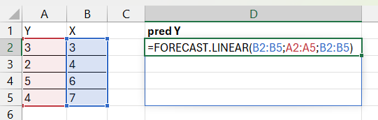
```

*Prediction of $\hat{Y}$ with FORECAST.LINEAR()*

### Regression analysis with Analysis ToolPak

We can also perform regression analysis in Excel through the Data Analysis dialog box, which we installed using Analysis ToolPak, see the section on probability above. Click on Data menu > Data Analysis. A new dialog window opens. Select "Regression" and click OK. The dialog window for regression opens, see the figure below. We will now again estimate the regression model:

$$Y=c+dX+eZ+\epsilon$$

In the Y Input Range box we specify a reference to the cells that contain the dependent variable's data, including the variable header with the name of the variable. In this example this is cells A1:A5. Check the Labels box, which indicates that we include the variable name in the top cell in the input range. In the X Input Range box we specify a reference to all cells that contain the explanatory variables, which in this case are X and Z. The cells are B1:C5. Under Output options we can choose the settings for where our results should be displayed. In the figure below we have chosen that the results should be displayed in cell A7.

```{r, out.width="70%", fig.align="center", echo=FALSE}
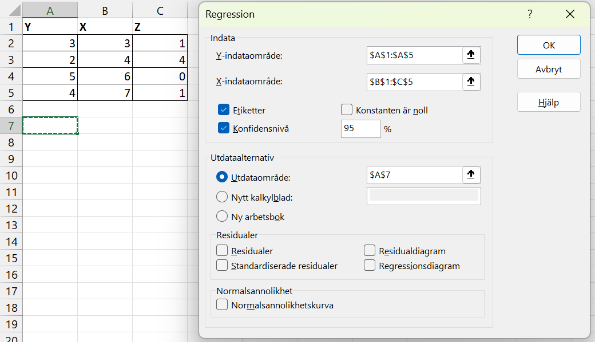
```

*Dialog window for regression analysis*

If we click OK, we get the results shown in the figure below, in the form of three different tables with results from the regression analysis. The top table, rows 10--14, first shows "Multiple R", which stands for the correlation coefficient, also called Pearson's r, which here indicates the correlation between the dependent variable $Y$ and predicted $\hat{Y}$. The correlation coefficient takes a value between -1 (perfect negative correlation) and 1 (perfect positive correlation). A result of 0 means no correlation.

R Square $\left(R^{2}\right)$ and Adjusted R Square measure what proportion of the variation in the dependent variable can be explained by the regression model and the variation in the explanatory variables. Standard Error here refers to the square root of the mean square sum of the residuals:

$$\left(MSR\right)^{\frac{1}{2}}=\left(\frac{\sum\left(y_{i}-\hat{y}\right)^{2}}{p-1}\right)^{\frac{1}{2}}$$

where p is the number of estimated coefficients in the regression model. The last row in the top results table is the number of observations, which in this example is 4.

The second table, rows 16--20, is called the ANOVA (Analysis Of VAriance) table where the headings stand for df = degrees of freedom, SS = sum of squares, MS = mean squares, F = F-statistic, and the p-value for the F-test. The F-statistic is calculated:

$$F=\left(\frac{SSR_{m2}-SSR_{m1}}{SSR_{m1}}\right)/\left(\frac{q}{n-k_{m1}-1}\right)$$

where SSR stands for the residual sum of squares, $q=df_{m1}-df_{m2}$ and df stands for degrees of freedom and k is the number of explanatory variables. The F-test tests the null hypothesis that the population coefficients for the two explanatory variables are zero:

$$H_{0}:d=e=0$$

against the alternative hypothesis that at least $d$ or $e$ is statistically significantly different from zero.

The third and bottom table, rows 22--25, contains the estimates for the coefficients and associated statistical results. In the first column A, the name of each respective coefficient is given, where "Intercept" refers to the first coefficient c, the y-intercept, which is not multiplied by any variable. The other two, X and Z, refer to coefficients $d$ and $e$ which are multiplied by their respective variables.

The columns in the third and bottom table to the right of the coefficients' names are Coefficients (the estimates), estimated standard error, t Stat, and P-value for a t-test for the null hypothesis:

$$H_{0}:c=0,\:H_{1}:c\neq0$$

That is, the p-value indicates the probability that the coefficient is statistically significantly different from zero. The columns thereafter show estimated bounds for the 95% confidence interval for each respective coefficient.

```{r, out.width="70%", fig.align="center", echo=FALSE}
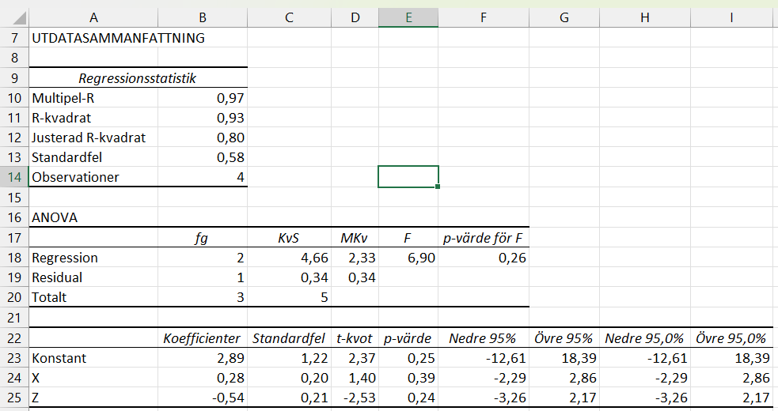
```

*Regression results from the Data Analysis menu*

There are no pre-installed functions in Excel for estimating regressions with robust standard errors. We can do this with our own calculations, for example with matrix calculations. If you search online, you can also find functions that private users have created themselves that you can download. In the chapters below we go through how we can easily perform this type of regression with commands in Stata and R.

## Creating plots {#sec-excel-plots}

Excel has shortcuts for creating several common charts, such as line charts, scatter plots, bar charts, and more. In the menus we find the functions for creating charts under the Insert heading. A simple way to create a chart quickly is to first select the cells with data that we want to illustrate in a chart. Then we click on the Insert menu and choose what type of chart we want to create.

The figure below shows an example where we have created a line chart using the menu with the five values in column A. To create the line chart we select the Insert menu, click on the symbol for line charts next to the larger icon for "Recommended Charts" and choose the first option under 2-D Line.

```{r, out.width="70%", fig.align="center", echo=FALSE}
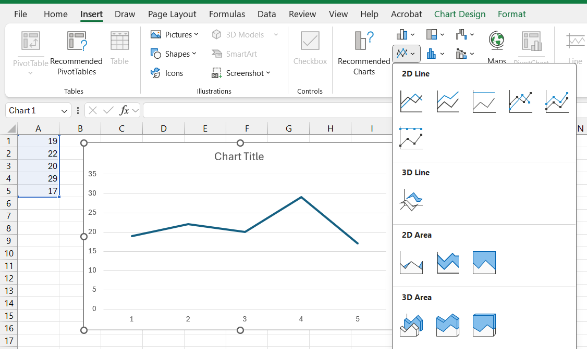
```

*Create a line plot*

When Excel creates a chart this way, the program makes some guesses about how we want our selected chart to look. Sometimes the program guesses correctly and sometimes it guesses incorrectly. In the chart in the figure above, the values in column A have been placed on the vertical y-axis. If we wanted the values on the horizontal x-axis instead, we would need to instruct the program about this. We can also select multiple things simultaneously and create a chart based on this.

To edit a chart that we have created, we can click on the chart. When we select the chart, the two new menu headings Chart Design and Format open, at the far right among the menus at the top. Under these menus we can then choose various ready-made options to change the appearance of the chart. For example, add points along the line, add or remove titles for the y- and x-axes, and more.

We can also right-click on different parts of the chart and get different options, depending on which parts of the chart we click on. If we want to keep the chart but change which values are shown in the chart, we can right-click somewhere in the chart and choose the Select Data... option. This way we can add or remove variables and observations. By clicking on a chart's different parts, we can change appearance, color and shape, and even what type of chart, if we would prefer a bar chart or scatter plot, for example. There isn't space to go through all possible options for how we can or should edit our charts here. There are several help sections regarding these things in Excel. Many things are also relatively simple to understand by just experimenting by selecting different parts of the chart, trying the options in the menus, and the different options that appear when we right-click in the chart.

Another way to get help from the program is to use the Recommended Charts option, under the Insert menu heading. We select the data we want to use for the chart and click on Recommended Charts. The new Insert Chart dialog box opens, with suggestions for charts that the program thinks should fit the data we selected. The figure below shows an example with GDP per capita for 2015--2019. In the dialog box we have received suggestions for a line chart, a bar chart, a chart with lines and points, and at the bottom a pie chart. In the suggested line chart, the program has now placed the title at the top and the years on the horizontal x-axis.

```{r, out.width="70%", fig.align="center", echo=FALSE}
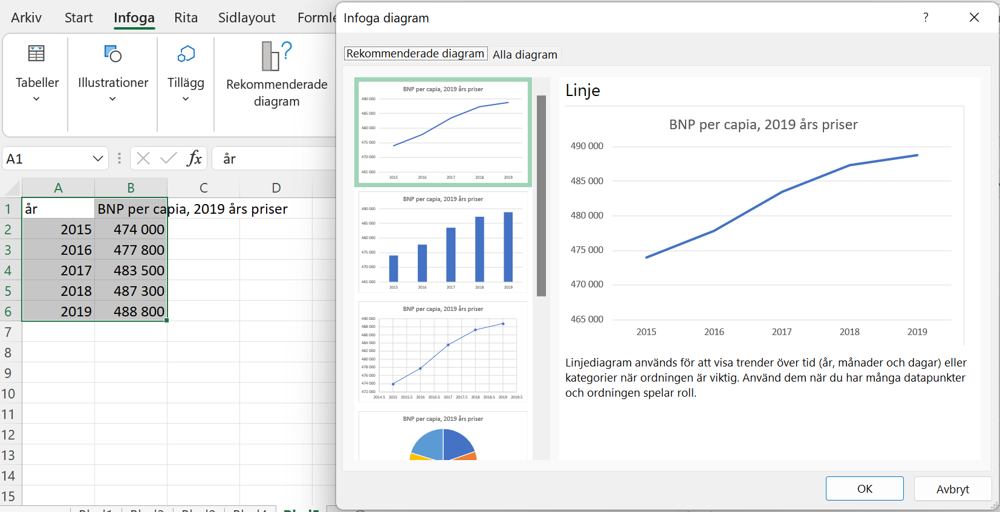
```

*Recommended charts*

Scatter plots are often used to illustrate the covariation between two variables. One way to calculate a linear covariation between two variables is the least squares method. Say that we have the regression model:

$$Y=a+bX+u$$

We have four observations with values for variables $Y$ and $X$ that we will use to calculate the constants a and b. The letter u is the error term. With Excel we can create a scatter plot that shows the covariation between $Y$ and $X$. The figure below shows an example with a scatter plot, which is created by selecting Insert menu > Scatter. In the chart we can also add the regression line that we calculate using the least squares method. After we have created the chart, we right-click on one of the points in the chart. This opens a menu where we select the option "Add Trendline...". A new dialog box opens where we can specify what type of trendline we want to create. To create a linear regression line, calculated using the least squares method, we select the "Linear" option.

```{r, out.width="70%", fig.align="center", echo=FALSE}
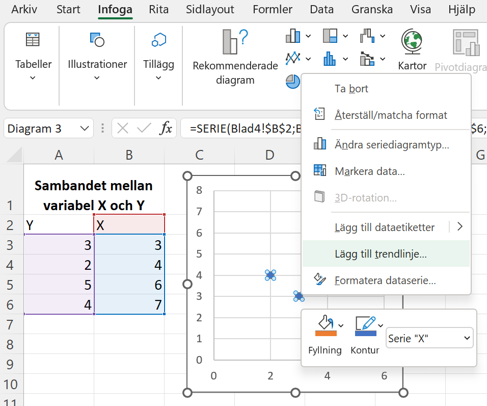
```

*Add the regression line to a scatter plot*

In the same menu that we use to define the trendline, we can also choose the option "Display Equation on chart". If we click this option, the equation that draws the regression line is written out in the chart. We can also choose to show the calculated $R^{2}$ by clicking the option "Display R-squared value on chart". The figure below shows the chart with trendline and equation after we have clicked these options.

```{r, out.width="80%", fig.align="center", echo=FALSE}
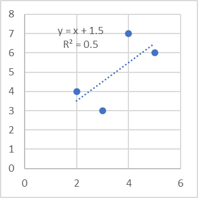
```

*Finished chart with regression line*

### Presenting results in other programs

When we have calculated a result in an analysis program, we often want to present our results, for example tables and charts, in another program, such as in a text that we write in Microsoft Word or in a presentation that we make in Microsoft PowerPoint. There are several ways to do this and the methods can vary depending on which analysis program we are working in, as well as which program we want to export the results to.

If we work in Microsoft's programs Excel, Word and PowerPoint, it is usually easy to copy and paste results from one program to another. The programs are designed to be able to work together. To export a table in Excel, for example, we can select the cells we want to show, copy (Ctrl + C), place the cursor in the other program at the location where we want to paste the table, and paste (Ctrl + V). The same method also works with charts we have created in Excel.

We can also paste tables and charts from Excel into other programs as images. This method often works in both Microsoft's programs Word and PowerPoint, as well as in programs from other manufacturers. Charts can also be exported as images directly from Excel to an image file on the computer's hard drive. This can be done by right-clicking on the outer surface of a chart, the outer frame, and selecting Save as Picture.... This opens a new dialog box where we can choose which image file format we want to save the chart as and in which directory on the computer's hard drive we want the file to be saved, see the figure below.

```{r, out.width="70%", fig.align="center", echo=FALSE}
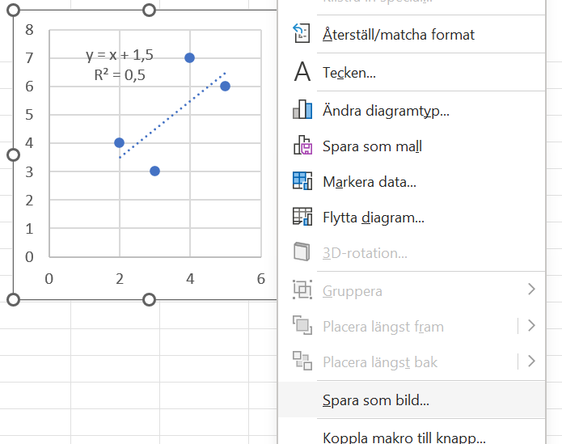
```

*Save chart as image from Excel*

## Example with GDP per working hour {#sec-excel-gdp-example}

Now we will go through an example where we use the data shown in the table below. The figures show millions of gross domestic product (GDP) per working hour calculated in US dollars, adjusted for price changes over time (inflation) and price differences between countries (purchasing power adjusted). Purchasing power adjusted values are called Purchasing power parities in English. The data covers Sweden, Denmark, Finland, Norway, USA, and the United Kingdom for the years 1990, 2000, 2010, and 2020 and is taken from the database that the think tank The Conference Board has online. The database contains, in addition to this data, other variables and many more countries and years, which can be downloaded for free at the following address: <www.conference-board.org/data/>

Table: GDP per working hour

| **Country** | **1990** | **2000** | **2010** | **2020** |
|:------------|:--------:|:--------:|:--------:|:--------:|
| Denmark | 62.6 | 76.6 | 84.2 | 95.9 |
| Finland | 47 | 64.3 | 73.5 | 77 |
| Norway | 68.1 | 89.3 | 95.9 | 101.1 |
| Sweden | 54.6 | 68.4 | 81.6 | 89.3 |
| United Kingdom | 50 | 63.1 | 70.4 | 73.4 |
| United States | 53.2 | 63.6 | 79.5 | 87.4 |

*Source: The Conference Board. Real GDP purchasing power adjusted millions USD, divided by hours worked per year.*

GDP indicates the value of all goods and services produced during the relevant year, divided by all hours worked the same year for each respective country. GDP per working hour is therefore a measure of how productive all companies are in a country. Since we measure the value of everything produced, this is also a measure of income level. We adjust for inflation to thereby get an estimate of the value of incomes, how much we can buy for the money. We adjust for purchasing power in different countries to adjust for the fact that goods and services cost different amounts in different countries.

There is no method for measuring all these things exactly, which is why the figures should be regarded as approximate. Working time is calculated partly by asking people how much they work, which for natural reasons is difficult to estimate exactly. It is also difficult to adjust for price changes over time and between countries, which is why this too must be interpreted with some caution. But the fact that things are difficult to measure does not mean that the figures are unusable. The measurement methods have been refined over decades and can be used to make several interesting observations. Authorities, organizations, and experts have also synchronized their methods worldwide to make the figures comparable over time and between countries. This means that even though we should be careful about drawing strong conclusions about small variations, we can still get an idea of overall differences between countries and years.

To work with these figures, we need to copy and paste them into an Excel sheet, or write them down. You can also download the material from The Conference Board yourself and make your own calculations. If we want to know the average productivity for the countries in the table, we can use Excel's `AVERAGE()` function. We can, for example, calculate average productivity per year by referring in the parentheses of `AVERAGE()` to the six boxes per year.

A good way to get a bit more overview of the data is to create charts. The figure below shows an example of how it can look in a line chart created in Excel. In the chart we can clearly see that Sweden and the USA are mostly in the middle of the group during these years. At the top are Norway and Denmark. At the bottom are Finland and the United Kingdom.

```{r, out.width="80%", fig.align="center", echo=FALSE}
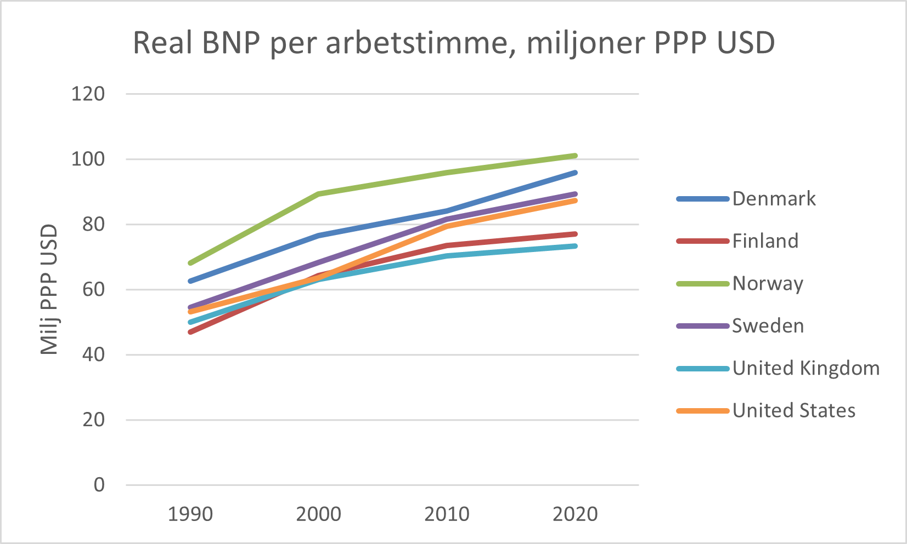
```

*GDP per working hour, illustrated in chart in Excel*

The chart is created with one of the common presets available in Excel. It is possible to change the appearance and colors in many ways by, for example, selecting all or parts of the chart and clicking in the Chart Design or Format menus, and for example choosing among the options Quick Layout, Add Chart Element, or Change Colors.

GDP per working hour increases over the period in the long term. One way to compare the development is to create an index per country. We choose 1990 as the base year and give this year the index value 100. We calculate index $x_{it}$ for country $i$ in year $t$ with the following formula:

$$x_{it}=\frac{GDP_{it}}{GDP_{i,1990}}*100$$

The figure below shows how this calculation can look in Excel. The data on GDP per working hour is collected in cells B2:E7. Index per country is calculated in cells B11:E16, compare the section on calculating index above. To fill in all cells faster, we can use one of the tricks we went through in the example in that section. We can, for example, enter the formula in cell B11: `=B2/ $B$ 2`, select cells B11:E16 and press Ctrl + D and Ctrl + R. This makes the formula in B11 copy to all other cells we selected.

The cell reference in our index calculation's numerator, B2, is updated. The cell reference in the denominator ` $B$ 2` is locked on column B but not on row 2. The cell reference will therefore update the row but not the column, which means that each country will use the year 1990 as the base year, which is what we want.

```{r, out.width="70%", fig.align="center", echo=FALSE}
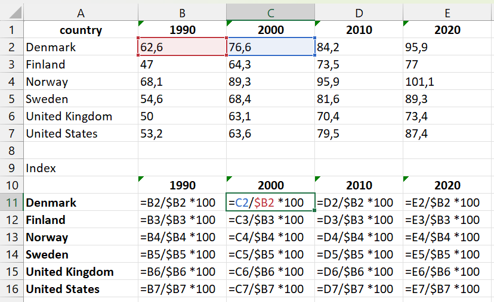
```

*Calculate index per country*

Another way to compare the long-term development is to estimate the following regression model per country:

$$G_{it}=a_{i}+b_{i}T_{it}+\epsilon_{it}$$

where $G_{it}$ is the natural logarithm of GDP per working hour in country $i$ in year $t$, $a_{i}$ is a coefficient for country $i$(the y-intercept, the constant), $b_{i}$ is the slope coefficient for country $i$ with respect to the explanatory variable $T_{it}$ which is the year for country $i$ in year $t$, and $\epsilon_{it}$ is the error term for country $i$ in year $t$.

We take the natural logarithm of GDP per working hour, because we can then interpret slope coefficient $b$ as an approximate measure of average percentage increase in GDP per working hour per year (when variable $T$ increases by one).

To estimate this regression model in Excel, we can for example use `LINEST()`. As the first argument we use the natural logarithm of the values in the GDP table above. As the second argument we use the years 1990, 2000, 2010, and 2020. The figure below shows how this can look in an Excel sheet. In cells B11:E16 we use the `LN()` function to take the natural logarithm of the values in cells B2:E7. In cells G11:G16 we use the `LINEST()` function to estimate a regression model per row 11--16, which gives us an estimate per country.

```{r, out.width="70%", fig.align="center", echo=FALSE}
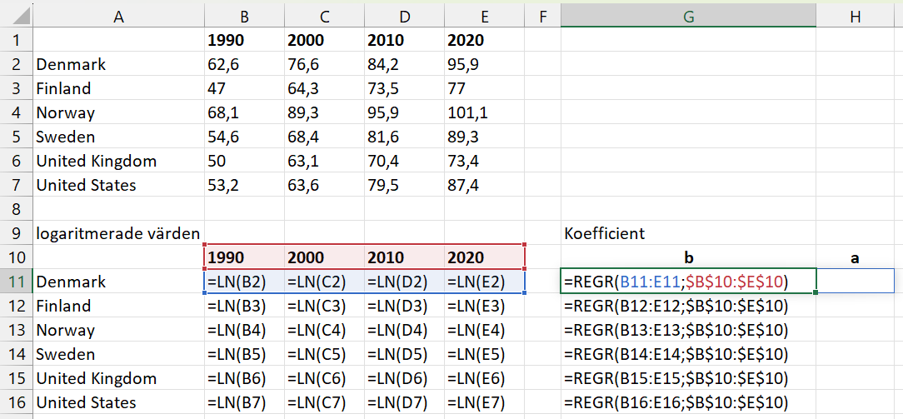
```

*One regression model per country*

## Some other useful functions {#sec-excel-other-functions}

Excel has many more functions and options than can be covered here. Here are some brief tips on additional functions that are good to know about. You can easily find more information about each respective function in the program's help sections and online.

- `ROUND()`, `ROUNDDOWN()`, `ROUNDUP()`, `TRUNC()`: Functions for rounding numbers.
- `COUNT()`, `COUNTA()`, `COUNTIF()`, `COUNTIFS()`, `COUNTBLANK()`: Functions that return the number of cells that are not empty or that contain values, with or without consideration of conditions.
- `FIND()` and `SEARCH()`: Return the starting position for text strings (that we want to search for) in other text strings.
- `LEFT()`, `LEFTB()`, `RIGHT()`, `RIGHTB()`: Return one or more characters in a text string counted from the left or right.
- `MID()` and `MIDB()`: Return a number of characters from a text starting at the position we specify.
- `DATE()`, `YEAR()`, `WEEKNUM()`, `DAYS()`: Examples of functions for working with dates and time. Computer programs often handle dates and time specifications in special ways. As an example, we can use the `DATE()` function to create a date specification from three separate values, for example if we have the values for year, month, and day specified in separate columns. The `DAYS()` function returns the number of days between two specified dates.
- `INDEX()`, `MATCH()`, `LOOKUP()`: Functions for finding positions or unique values in a search range based on a specified search term.

## Chapter Summary {#sec-excel-summary}

- Excel's worksheet functions are written with the function's name followed by parentheses, for example `SUM()`. In the parentheses we specify the arguments the function requires. The `SUM()` function calculates the sum of the numbers that we specify in its parentheses. In the parentheses of functions we can also refer to cells with values. Other examples of functions: `AVERAGE()`, `MIN()`, `MAX()`, `LOG()`, `LN()`, `FACT()`, and `PERMUT()`.

- The worksheet functions can be used for many different types of work tasks, such as mathematical operations, calculating probability, and estimating regression models. Many functions use logical conditions, which are true or false. A logical condition in a function can often be answered by specifying TRUE or FALSE. To calculate with matrices we can use functions such as `MMULT()`, `TRANSPOSE()`, `MINVERSE()`.

- To create charts we can go to the Insert menu and choose chart type, for example 2-D Line. After we have created the chart we can also edit its appearance by clicking on its different parts, such as the axes' titles and scales.

- We can estimate regression models with the `LINEST()` function or using Analysis ToolPak and the Data Analysis dialog box. Excel has several functions for working with common probability distributions, for example `BINOM.DIST()` and `NORM.DIST()`.
