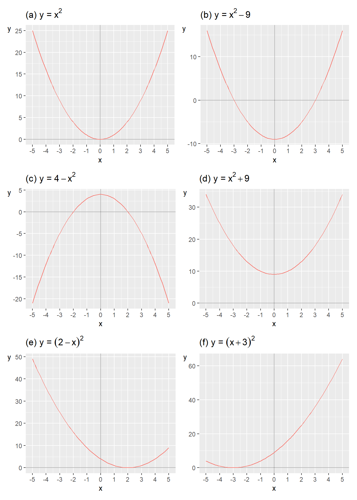
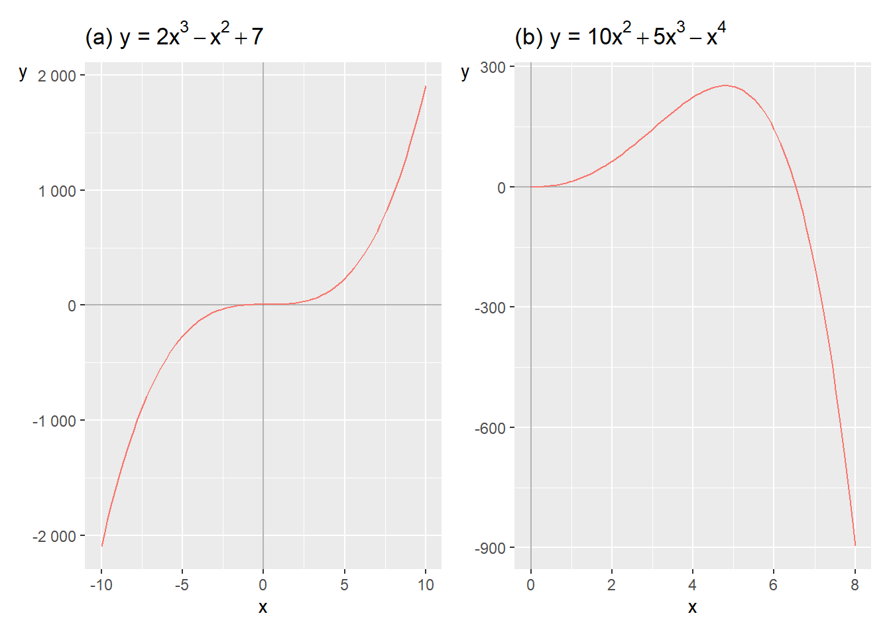
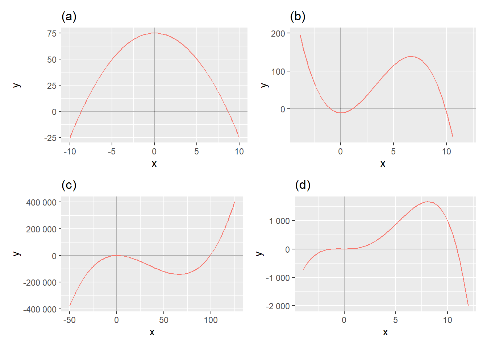

# Polynomial Equations {#chap-polynomekvationer}

This chapter introduces polynomials. A polynomial is an equation with variables and constants combined with addition, subtraction and multiplication and with a positive integer exponent. This is useful for a lot of things in analytical work, for instance describing different theories about how humans behave.

## Quadratic Equations {#sec-andragradsekvationer}

The following expression is an example of a polynomial:

$$
\begin{equation}
x^{2}+3
 (\#eq:polynom-1)
\end{equation}
$$

 The following expression is not a polynomial because the exponent $-2$ is negative: 

$$
\begin{equation}
x^{-2}+3
 (\#eq:polynom-2)
\end{equation}
$$

 The degree of the polynomial is given by the largest positive integer exponent in the expression. Let us now take the following polynomial:

$$
\begin{equation}
x^{2}+x+2
\end{equation}
$$

 Since the exponent in the term $x^{2}$ is 2, this is called a second-degree polynomial (quadratic equation). If the largest exponent in the expression had been 3, for example $x^{3}$, this would have been a third-degree polynomial (cubic equation). If the largest exponent is 4, it is called a fourth-degree equation, and so on. Examples:

$$
\begin{align}
\text{Quadratic polynomial: } & x^{2}-25x+321\\
\text{Cubic polynomial: } & x^{3}+x^{2}-11x+20\nonumber 
\end{align}
$$

Often we want to find an equation's zeros: the $x$-values for which the entire equation equals 0. This is also called the real solutions to the equation. A polynomial's degree determines the number of possible solutions. A quadratic equation can have at most two zeros: two, one or no solution. A cubic equation can have at most three solutions: three, two, one or none.

(\#fig:andragradsekvationer)Examples of quadratic equations

To find the solutions, zeros, of an equation we set the equation equal to 0 and solve for $x$. Sometimes we may also find the solutions using graphs. In figure \@ref(fig:andragradsekvationer) six graphs are shown with one quadratic equation each, written as functions of the form $y=f\left(x\right)$. The solution for each function is the point where the function's line crosses the x-axis. Let us go through graphs (a) to (f) in order. Graph (a) illustrates the function:

$$
\begin{equation}
y=f\left(x\right)=x^{2}
\end{equation}
$$

 The term $x^{2}$ indicates that this is a quadratic equation and it has at most two solutions. In this case there is only one x-value that gives the result $f\left(x\right)=0$ and that is $x=0$:

$$
\begin{align}
f\left(0\right) & =0^{2}=0
\end{align}
$$

 We write the solution as $x^{*}=0$. Graph (b) shows the function: 

$$
\begin{equation}
y=x^{2}-9
 (\#eq:andragradsekvation-diagram-b)
\end{equation}
$$

 The function's line crosses the $x$-axis at two points, where the function, $y=f\left(x\right)$, equals 0: $x=-3$ and $x=3$. These are the function's solutions. When we have more than one solution we can write $x_{1}^{*}=-3$ and $x_{2}^{*}=3$. We may also see this if we set the function equal to 0 and solve for $x$:

$$
\begin{align}
f\left(x\right)=x^{2}-9 & =0\\
x^{2} & =9\nonumber \\
\left(x^{2}\right)^{\frac{1}{2}} & =9^{\frac{1}{2}}\nonumber \\
x^{2*\frac{1}{2}} & =9^{\frac{1}{2}}\nonumber \\
x & =\pm3\nonumber 
\end{align}
$$

 In row three we take the square root of both sides, that is exponent $1/2$(see section \@ref(sec-potenser) ). We get the solutions $x_{1}^{*}=3$ and $x_{2}^{*}=-3$ and can also test these by substituting them into equation \@ref(eq:andragradsekvation-diagram-b) :

$$
\begin{align}
y= & x^{2}-9\\
x_{1}^{*}=3\Rightarrow y= & 3^{2}-9=0\nonumber \\
x_{2}^{*}=-3\Rightarrow y= & \left(-3\right)^{2}-9=0\nonumber 
\end{align}
$$

Graph (c) illustrates the function:

$$
\begin{equation}
y=4-x^{2}
\end{equation}
$$

 The line crosses the $x$-axis at $x_{1}^{*}=-2$ and $x_{2}^{*}=2$. We can also solve for the function's zeros:

$$
\begin{align}
4-x^{2} & =0\\
x^{2} & =4\nonumber \\
x^{*} & =\pm2\nonumber 
\end{align}
$$

Graph (d) illustrates the function:

$$
\begin{equation}
y=x^{2}+9
\end{equation}
$$

 In the graph the function's line does not cross the x-axis. This means that the function lacks a solution that is a real number, the function lacks a real solution. If we calculate the function's solutions:

$$
\begin{align}
x^{2}+9 & =0\\
x & =\left(-9\right)^{1/2}\nonumber \\
 & =\pm\sqrt{-9}\nonumber 
\end{align}
$$

 To calculate $x$ we must here take the square root of a negative number, such as $\sqrt{-9}$, which is not defined for any real numbers. We can however instead use the imaginary unit, which is denoted $i$. The imaginary unit $i$ has the following properties:

$$
\begin{align}
i & =\left(-1\right)^{1/2}\\
i^{2} & =-1\nonumber 
\end{align}
$$

We now get:

$$
\begin{align}
x & =\pm\sqrt{-9}=\pm\sqrt{-1*9}=\pm\sqrt{i^{2}*3^{2}}=\pm3i
\end{align}
$$

 The equation's solutions are $x_{1}^{*}=3i$ and $x_{2}^{*}=-3i$. Graph (e) illustrates the function:

$$
\begin{equation}
y=\left(2-x\right)^{2}
 (\#eq:diagram-e-2-x-2)
\end{equation}
$$

 In the graph the line passes through the x-axis at $x^{*}=2$. For equation \@ref(eq:diagram-e-2-x-2) to equal zero, $x$ must be 2. All other values for $x$ result in $y>0$. Graph (f) shows the function:

$$
\begin{align}
y & =\left(x+3\right)^{2}
\end{align}
$$

 For $y=0$ we need $x+3=0$, and thus $x^{*}=-3$, which can also be seen in the graph.

## Factoring Equations {#sec-faktorisera-andragradsekvationer}

This section and the two following go through methods for solving polynomials. Section \@ref(sec-faktorisering-och-delbarhet) introduced factorization of integers. An equation can also be factorized. We illustrate this with the following equation:

$$
\begin{equation}
\left(x+1\right)\left(x+2\right)=0
 (\#eq:x-1-2)
\end{equation}
$$

The entire expression on the left side must equal 0. The two parentheses are multiplied together, making each parenthesis a factor. For the entire expression to equal 0, one or both parentheses must equal 0. This gives us the solutions $x_{1}^{*}=-1$ and $x_{2}^{*}=-2$. If we multiply the parentheses in equation \@ref(eq:x-1-2) , this results in a quadratic polynomial:

$$
\begin{align}
\left(x+1\right)\left(x+2\right) & =0\\
x^{2}+3x+2 & =0\nonumber 
\end{align}
$$

 If we have a quadratic polynomial of this type, it can facilitate our work if we succeed in factorizing so that we get the two parentheses. To be sure that we have found the correct solutions, we substitute our x-values into the quadratic polynomial and check:

$$
\begin{align}
 & x^{2}+3x+2=0\\
x=-1\Rightarrow & \left(1\right)^{2}+3\left(-1\right)+2=0\nonumber \\
x=-2\Rightarrow & \left(-2\right)^{2}+3\left(-2\right)+2=0\nonumber 
\end{align}
$$

Both values result in the quadratic polynomial becoming 0, which confirms that these x-values $x_{1}^{*}=-1$ and $x_{2}^{*}=-2$ are solutions to the equation. Now we shall find the possible solutions to the following quadratic equation:

$$
\begin{equation}
x^{2}+5x=0
 (\#eq:exempel-med-2a-grad)
\end{equation}
$$

The variable $x$ appears in both terms on the left-hand side. We factor out $x$ and put the rest of the expression in parentheses:

$$
\begin{equation}
x\left(x+5\right)=0
\end{equation}
$$

For the left-hand side to equal 0, we must have either $x=0$ or $x+5=0$, which in that case requires that $x=-5$. This gives us the solutions $x_{1}^{*}=0$ and $x_{2}^{*}=-5$, which we can test by substitution in equation \@ref(eq:exempel-med-2a-grad) :

$$
\begin{align}
 & x^{2}+5x=0\\
x_{1}^{*}=0\Rightarrow & \left(0\right)^{2}+5*0=0\nonumber \\
x_{2}^{*}=-5\Rightarrow & \left(-5\right)^{2}+5\left(-5\right)=25-25=0\nonumber 
\end{align}
$$

Both these $x$-values result in the equation becoming 0, which confirms that these are solutions to our equation. Since $x\left(x+5\right)=x^{2}+5x$ is a quadratic equation we seek at most two solutions.

It can be difficult to find expressions that can be factorized from an equation. Sometimes one must try different approaches. Or draw the equation in a graph to find a first solution and then try from there. Even if a polynomial at first glance can look complicated, we can often make it more manageable with simple means. Consider the following quadratic polynomial as an example:

$$
\begin{equation}
3x^{2}+3x-168=0
\end{equation}
$$

We want to find the zeros and start by dividing by 3:

$$
\begin{align}
\frac{3x^{2}}{3}+\frac{3x}{3}-\frac{168}{3} & =0\\
x^{2}+x-56 & =0\nonumber 
\end{align}
$$

This expression is easier to factorize. We seek two factors that result in the product 56. Since we shall factor out two factors we also use the fact that the second term should become $+x$, that is $\left(+1\right)x$. We can here try different approaches until we succeed in rewriting the expression: 

$$
\begin{align}
x^{2}+x-56 & =0\\
\left(x+8\right)\left(x-7\right) & =0\nonumber 
\end{align}
$$

This gives us two proposed solutions: $x_{1}^{*}=-8$ respectively $x_{2}^{*}=7$. We test these proposed solutions by substituting the x-values into the quadratic equation:

$$
\begin{align}
 & x^{2}+x-56=0\\
x=-8\Rightarrow & \left(-8\right)^{2}+\left(-8\right)-56=0\nonumber \\
x=7\Rightarrow & 7^{2}+7-56=0\nonumber 
\end{align}
$$

Both these $x$-values result in the equation becoming 0, which means that they are solutions, thus $x_{1}^{*}=-8$ and $x_{2}^{*}=7$. Let us now find the solutions (zeros) of the following polynomial:

$$
\begin{equation}
x^{2}+2x-8=0
\end{equation}
$$

We factorize this expression and get: 

$$
\begin{align}
x^{2}+2x-8 & =0\\
\left(x+4\right)\left(x-2\right) & =0\nonumber 
\end{align}
$$

This gives us the solutions $x_{1}^{*}=-4$ and $x_{2}^{*}=2$. Feel free to test the solutions yourself using substitution.

## Rational Roots {#sec-rationella-rotter}

Another method for finding an equation's solutions is to search for its rational roots. We illustrate this with the following quadratic equation:

$$
\begin{equation}
2x^{2}+x-3
 (\#eq:rationella-rotter-polynom)
\end{equation}
$$

The method we will now go through is based on the polynomial having a rational root, which in that case is also a solution to the equation. If the equation has a root, this is found among the numbers we can put together as the fraction $p/q$. The letter $p$ is an integer factor to the equation's constant, where the constant in this case refers to the number 3. The letter $q$ is an integer factor to the number that is multiplied with the power with the largest integer exponent. In this case $2x^{2}$ is the term in the equation with the largest exponent, and the number that is multiplied with the power is thus 2.

For $p$: Potential factors for the number 3 are $\pm1$ and $\pm3$, where the symbol $\pm$ is called the plus-minus sign and indicates that the values 1 respectively 3 can be both positive (plus) and negative (minus). Potential candidates for p are $-3,-1,1$ and 3.

For $q$: The number 2 has the potential integer factors $\pm1$ and $\pm2$. For $q$ we get the candidates $-2,-1,1$ and 2. We combine the possible integer factors in the fraction $p/q$ and thereby get the equation's possible rational roots:

$$
\begin{equation}
\frac{p}{q}=\pm1,\pm\frac{1}{2},\pm3,\pm\frac{3}{2}
 (\#eq:rationella-rotter-ec)
\end{equation}
$$

These roots we test in equation \@ref(eq:rationella-rotter-polynom) and check if the result becomes 0, which in that case indicates that the value is a solution. For $x=1$ we get:

$$
\begin{align}
x=1\Rightarrow & 2\left(1\right)^{2}+1-3=0
\end{align}
$$

For $x=-\frac{3}{2}$ we get:

$$
\begin{align}
x=-\frac{3}{2}\Rightarrow & 2\left(-\frac{3}{2}\right)^{2}-\frac{3}{2}-3\\
 & =2\left(\frac{9}{4}\right)-\frac{3}{2}-3\nonumber \\
 & =\frac{9-3}{2}-\frac{6}{2}=0\nonumber 
\end{align}
$$

These two values are our solutions: $x_{1}^{*}=1$ and $x_{2}^{*}=-\frac{3}{2}$. Let us now take the following quadratic equation:

$$
\begin{equation}
x^{2}+4x-5
\end{equation}
$$

To study its solutions we start by checking the equation's potential rational roots. The constant 5 gives that $p=1$ and 5, while $q=1$. Potential rational roots are in this case: 

$$
\begin{equation}
\frac{p}{q}=\pm1,\pm5
\end{equation}
$$

Through substitution we can see that: 

$$
\begin{align}
 & x^{2}+4x-5\\
x=1\Rightarrow & 1^{2}+4*1-5=0\nonumber \\
x=-5\Rightarrow & \left(-5\right)^{2}+4\left(-5\right)-5=0\nonumber 
\end{align}
$$

This gives us the solutions $x_{1}^{*}=1$ and $x_{2}^{*}=-5$.

## The Quadratic Formula {#sec-pq-formeln}

A third method for solving quadratic equations is the the quadratic formula. Suppose we have the following quadratic equation:

$$
\begin{equation}
ax^{2}+bx+c=0
\end{equation}
$$

The letters $a$, $b$ and $c$ are constants and $c\neq0$. The solutions for this equation can be calculated with the the quadratic formula: 

$$
\begin{align}
x^{*} & =-\frac{p}{2}\pm\sqrt{\left(\frac{p}{2}\right)^{2}-q}\\
\text{where }p & =\frac{b}{a},\text{ och }q=\frac{c}{a}\nonumber 
 (\#eq:pq-formeln)
\end{align}
$$

Table: Derivation of the the quadratic formula (\#tab:harledning-av-pq-formeln)

| In general | Our example | $ax^{2}+bx+c=0$, where $a,\,b,\,c$ are constants and $c\neq0$. |
| --- | --- | --- |
| $2x^{2}+3x+\frac{1}{4}=0$| $x^{2}+\frac{b}{a}x+\frac{c}{a}=0$| $x^{2}+\frac{3}{2}x+\frac{1}{8}=0$|
| $$
\begin{align*}
x^{2}+px+q & =0\\
x^{2}+px+q-q & =0-q\\
x^{2}+px & =-q
\end{align*}
$$ | $$
\begin{align*}
x^{2}+\frac{3}{2}x+\frac{1}{8} & =0\\
x^{2}+\frac{3}{2}x+\frac{1}{8}-\frac{1}{8} & =0\\
x^{2}+\frac{3}{2}x & =-\frac{1}{8}
\end{align*}
$$ | $x^{2}+px+\left(\frac{p}{2}\right)^{2}=-q+\left(\frac{p}{2}\right)^{2}$ |
| $x^{2}+\frac{3}{2}x+\left(\frac{3}{2}\right)^{2}=-\frac{1}{8}+\left(\frac{3}{2}\right)^{2}$| $\left(x+\frac{p}{2}\right)^{2}=-q+\left(\frac{p}{2}\right)^{2}$| $\left(x+\frac{3}{2}\right)^{2}=-\frac{1}{8}+\left(\frac{3}{2}\right)^{2}$|
| $x+\frac{p}{2}=\pm\sqrt{-q+\left(\frac{p}{2}\right)^{2}}$| $x^{*}+\frac{3}{2}=\pm\sqrt{-\frac{1}{8}+\left(\frac{3}{2}\right)^{2}}$| $x=-\frac{p}{2}\pm\sqrt{-q+\left(\frac{p}{2}\right)^{2}}$|
| | $x^{*}=-\frac{3}{2}\pm\sqrt{-\frac{1}{8}+\left(\frac{3}{2}\right)^{2}}$| |

Table \@ref(tab:harledning-av-pq-formeln) shows how the quadratic formula can be derived. In the left column a general example with letters is given step by step. In the right column we go through the same thing for the following equation, where we solve for $x$:

$$
\begin{align}
2x^{2}+3x+\frac{1}{4} & =0
 (\#eq:pq-harledning-1)
\end{align}
$$

In equation \@ref(eq:parentes-kvadrat) we went through the squaring rule for parentheses:

$$
\begin{equation}
\left(x+d\right)^{2}=x^{2}+2dx+d^{2}
 (\#eq:kvadreringsregel-repetition)
\end{equation}
$$

From equation \@ref(eq:pq-harledning-1) we start by moving $\frac{1}{4}$ to the right side and dividing everything by 2: 

$$
\begin{align}
2x^{2}+3x & =-\frac{1}{4}\\
x^{2}+\frac{3}{2}x & =-\frac{1}{8}\nonumber 
\end{align}
$$

In this equation the fraction $\frac{3}{2}$ now corresponds to the term $2d$ in equation \@ref(eq:pq-harledning-1) . The expression $d^{2}$ is therefore $\left(\frac{3}{2}\right)^{2}$. We add this to both sides and rewrite: 

$$
\begin{align}
x^{2}+\frac{3}{2}x+\left(\frac{3}{2}\right)^{2} & =-\frac{1}{8}+\left(\frac{3}{2}\right)^{2}\\
\left(x+\frac{3}{2}\right)^{2} & =-\frac{1}{8}+\left(\frac{3}{2}\right)^{2}\nonumber 
\end{align}
$$

 We take the square root of both sides and move everything except $x$ to the right side:

$$
\begin{align}
x^{*} & =-\frac{3}{2}\pm\sqrt{-\frac{1}{8}+\left(\frac{3}{2}\right)^{2}}
\end{align}
$$

 The square root of a number is given by both a negative and a positive value, which is symbolized by the plus-minus sign $\pm$. This gives us two solutions to equation \@ref(eq:pq-harledning-1) :

$$
\begin{align}
x_{1}^{*} & =-\frac{3}{2}+\sqrt{-\frac{1}{8}+\left(\frac{3}{2}\right)^{2}}\\
x_{2}^{*} & =-\frac{3}{2}-\sqrt{-\frac{1}{8}+\left(\frac{3}{2}\right)^{2}}\nonumber 
\end{align}
$$

## Third degree and Higher {#sec-polynom-av-hogre-grad}

Polynomials of higher degree can also be illustrated in graphs. In figure \@ref(fig:ex-3e-och-4e-grads-poly) the following two functions are illustrated::

$$
\begin{align}
y & =2x^{3}-x^{2}+7\\
y & =6x^{2}+3x^{3}-x^{4}\nonumber 
 (\#eq:polynom-3egrad-ex1)
\end{align}
$$

(\#fig:ex-3e-och-4e-grads-poly)Examples of third- and fourth-degree polynomials

 In the first row we have a third-degree polynomial, since we have $x^{3}$. On the second row we have a fourth-degree polynomial, which we see on the term $x^{4}$. Even though we have several terms where x appears in each function we still have only two variables, x and y. The first function in equation \@ref(eq:polynom-3egrad-ex1) in graph (a) gets increasingly higher $y$-values at higher $x$-values, the line curves upward further to the right in the graph.

For the second equation, graph (b), y first increases slightly and then decreases with higher x-values. In both cases this is controlled by which sign stands in front of the term that has the largest positive integer exponent. In graph (a) the increase is controlled by $x^{3}$ being positive in the first equation. In graph (b) the negative development is controlled by $x^{4}$ being negative. Let us now look at the following four functions, which are illustrated in figure \@ref(fig:fler-exempel-pa-polynom) in their respective graphs:

$$
\begin{align}
\text{(a) : } & y=75-x^{2}\\
\text{(b) : } & y=-10+10x^{2}-x^{3}\nonumber \\
\text{(c) : } & y=100x-100x^{2}+x^{3}\nonumber \\
\text{(d) : } & y=10x^{2}+10x^{3}-x^{4}\nonumber 
\end{align}
$$

(\#fig:fler-exempel-pa-polynom)More examples of polynomials

 Graph (a) shows the function $y=75-x^{2}$, which we can see since the line meets the $y$-axis at $y=75$, when $x=0$. Graph (b) shows the line for the function $y=-10+10x^{2}-x^{3}$. The line meets the $y$-axis at $y=-10$ when $x=0$. The negative term $-x^{3}$ dominates the line's development further to the right in the graph where the line curves downward below the $x$-axis.

Graph (c) shows the line for function $y=100x-100x^{2}+x^{3}$ which meets the $y$-axis at $y=0$ when $x=0$. The positive term $+x^{3}$ dominates the line's development upward for higher values of $x$, further to the right in the graph. Graph (d) shows the function $y=10x^{2}+10x^{3}-x^{4}$ which also meets the $y$-axis at $y=0$ when $x=0$. The negative term $-x^{4}$ causes the line to curve downward for higher values of $x$, further to the right in the graph.

## Factorizing Polynomials of Higher Degree

Polynomials of higher degree can be more difficult to solve. Sometimes we can rewrite equations so that we first succeed in solving a quadratic equation and solve this with one of the methods above, like the the quadratic formula. Consider the following cubic equation:

$$
\begin{equation}
x^{3}+2x^{2}-5x-6
\end{equation}
$$

We seek the zeros of this equation. When one should factorize it can be difficult to know how to start and sometimes one has to try different approaches. We set the equation equal to 0 and see after some puzzling that we can write:

$$
\begin{align}
x^{3}+2x^{2}-5x-6=0\\
x^{3}+3x^{2}-x^{2}-3x-2x-6=0\nonumber \\
\left(x^{2}-x-2\right)\left(x+3\right)=0\nonumber \\
\left(x+1\right)\left(x-2\right)\left(x+3\right)=0\nonumber 
\end{align}
$$

Now that we have factorized out the three parentheses in the last row we can more easily find proposals for the equation's zeros: $x_{1}=-1$, $x_{2}=2$ and $x_{3}=-3$. We test our solutions by substituting these $x$-values into the third-degree polynomial on the first line:

$$
\begin{align}
 & x^{3}+2x^{2}-5x-6=0\\
x=-1\Rightarrow & \left(-1\right)^{3}+2\left(-1\right)^{2}+5-6=0\nonumber \\
x=2\Rightarrow & 2^{3}+2*2^{2}-5*2-6=0\nonumber \\
x=-3\Rightarrow & \left(-3\right)^{3}+2\left(-3\right)^{2}-5(-3)-6=0\nonumber 
\end{align}
$$

All these three $x$-values are solutions to the polynomial: $x_{1}^{*}=-1$, $x_{2}^{*}=2$ and $x_{3}^{*}=-3$. Let us now study if the following cubic equation with variable $x$ has any solutions:

$$
\begin{equation}
x^{3}-2x^{2}-x
 (\#eq:3gradspolynom-1)
\end{equation}
$$

We set the equation equal to 0 and factor out $x$:

$$
\begin{align}
x^{3}-2x^{2}-x & =0\\
x\left(x^{2}-2x-1\right) & =0\nonumber 
\end{align}
$$

This gives us our first proposed solution, $x_{1}^{*}=0$, which we see since we now have two factors: $x$ respectively the parenthesis $\left(x^{2}-2x-1\right)$. At least one of these factors must be 0. The expression in the parenthesis is a quadratic equation that we can solve with for example the the quadratic formula. This gives us two new proposed solutions: $x_{2}^{*}=1-2^{1/2}$ and $x_{3}^{*}=1+2^{1/2}$. Test these solutions yourself by substituting these values for $x$ in equation \@ref(eq:3gradspolynom-1) .

Let us now take the following cubic equation:

$$
\begin{equation}
2x^{3}+3x^{2}+\frac{1}{4}x=0
 (\#eq:exempel-3egrad)
\end{equation}
$$

Since all terms contain $x$ we can factor this out:

$$
\begin{equation}
x\left(2x^{2}+3x+\frac{1}{4}\right)=0
 (\#eq:3egradsekv-parentes)
\end{equation}
$$

This gives us our first solution in $x_{1}^{*}=0$, which we test by putting it into equation \@ref(eq:exempel-3egrad) :

$$
\begin{align}
x=0\Rightarrow & 2*0^{3}+3*0^{2}+\frac{1}{4}*0=0
\end{align}
$$

Now it remains to find the remaining solutions to equation \@ref(eq:exempel-3egrad) by calculating what is left in the parenthesis in equation \@ref(eq:3egradsekv-parentes) . This we did above when we derived the the quadratic formula, in equation \@ref(eq:pq-harledning-1) .

## Divisions of Polynomials of Higher Degree

Another useful method for solving polynomials of higher degree is polynomial division. The method is based simply on having a polynomial of higher degree and having found one of the solutions which we use to factorize. To find the remaining solutions we can divide the remaining polynomial by our factor and thereby solve for new factors. Consider the following fourth-degree polynomial:

$$
\begin{equation}
x^{4}-2x^{3}-13x^{2}+14x+24
 (\#eq:polynomdiv-ex1)
\end{equation}
$$

The constant 24 indicates that the polynomial's roots should be found among the numbers $\pm1,\pm2,\pm3,\pm4,\pm6,\pm8,\pm12,\pm24$. To proceed we try substituting these numbers in our equation and see if the result becomes 0. In that case we have found a root. We start by testing $x=-2$. For $x=-2$ we get:

$$
\begin{align}
 & x^{4}-2x^{3}-13x^{2}+14x+24\\
x=-2\Rightarrow & \left(-2\right)^{4}-2\left(-2\right)^{3}-13\left(-2\right)^{2}+14\left(-2\right)+24\neq0\nonumber 
\end{align}
$$

For $x=-2$ the equation is not equal to 0, which is why this is not a solution or root. Let us try $x=2$ instead: 

$$
\begin{align}
x=2\Rightarrow & \left(2\right)^{4}-2\left(2\right)^{3}-13\left(2\right)^{2}+14(2)+24=0
\end{align}
$$

Since $x_{1}^{*}=2$ is a solution to equation \@ref(eq:polynomdiv-ex1) we know that $x-2$ is a factor in the equation. To find the remaining solutions to the polynomial we shall now divide the polynomial by the factor $x-2$. For this we use polynomial division with the help of long division:

| $x^{4}$| $-2x^{3}$| $-13x^{2}$| $+14x$| $+24$| $\left(x-2\right)$|
| --- | --- | --- | --- | --- | --- |

We start by dividing $x$ in our parenthesis $\left(x-2\right)$ into the term with the largest exponent, $x^{4}$. The result, $x^{3}$, we write above this term:

| $x^{3}$| $x^{4}$| $-2x^{3}$| $-13x^{2}$| $+14x$| $+24$|
| --- | --- | --- | --- | --- | --- |
| $\left(x-2\right)$| | | | | |

Then we multiply $x^{3}$ by our denominator, the parenthesis. The results of this, $\left(x^{4}-2x^{3}\right)$ we write under the polynomial. Then we subtract this from the polynomial and save the remainder in the next row:

| $x^{3}$| $x^{4}$| $-2x^{3}$| $-13x^{2}$| $+14x$| $+24$|
| --- | --- | --- | --- | --- | --- |
| $\left(x-2\right)$| $-\left(x^{4}-2x^{3}\right)$| $-13x^{2}$| $+14x$| $+24$| |

Now we again divide $x$ from our denominator $\left(x-2\right)$ into the term with the largest exponent in this new equation $\left(-13x^{2}+14x+24\right)$, the result is multiplied by the denominator and subtracted from the new equation:

| $x^{3}$| $-13x$| $x^{4}$| $-2x^{3}$| $-13x^{2}$| $+14x$|
| --- | --- | --- | --- | --- | --- |
| $+24$| $\left(x-2\right)$| $-\left(x^{4}-2x^{3}\right)$| $-13x^{2}$| $+14x$| $+24$|
| $-\left(-13x^{2}+26x\right)$| $-12x$| $+24$| | | |

We repeat the same procedure once more:

| $x^{3}$| $-13x$| $-12$| $x^{4}$| $-2x^{3}$| $-13x^{2}$|
| --- | --- | --- | --- | --- | --- |
| $+14x$| $+24$| $\left(x-2\right)$| $-\left(x^{4}-2x^{3}\right)$| $-13x^{2}$| $+14x$|
| $+24$| $-\left(-13x^{2}+26x\right)$| $-12x$| $+24$| $-\left(-12x+24\right)$| $0$|

On the bottom row there is now 0. The equation has divided evenly and what now stands on the top row is the expression that we can multiply our denominator $\left(x-2\right)$ by to get our original fourth-degree polynomial:

$$
\begin{align}
x^{4}-2x^{3}-13x^{2}+14x+24 & =\\
=\left(x-2\right)\left(x^{3}-13x-12\right)\nonumber 
\end{align}
$$

Let us now do the same thing also with the longer factor, the third-degree polynomial $\left(x^{3}-13x-12\right)$. But now we again need to find a new root to divide with. The constant 12 indicates the following potential roots: $\pm1,\pm2,\pm3,\pm4,\pm6,\pm8$ or $\pm12$. By testing these in our equation we find our second root: $x_{2}^{*}=-1$:

$$
\begin{align}
 & x^{3}-13x-12\\
x=-1\Rightarrow & \left(-1\right)^{3}-13\left(-1\right)-12=0\nonumber 
\end{align}
$$

We therefore divide the third-degree polynomial $x^{3}-13x-12$ by the expression $x+1$:

| $x^{2}$| $-x$| $-12$| $x^{3}$| $-13x$|
| --- | --- | --- | --- | --- |
| $-12$| $\left(x+1\right)$| $-\left(x^{3}+x^{2}\right)$| $-x^{2}$| $-13x$|
| $-12$| $-\left(-x^{2}-x\right)$| $-12x$| $-\left(-12x-12\right)$| $0$|

Again the equation divides evenly and we have gotten a new polynomial:

$$
\begin{align}
x^{3}-13x-12=\left(x+1\right)\left(x^{2}-x-12\right)
\end{align}
$$

The quadratic polynomial in the second parenthesis we can solve with the the quadratic formula or factorization. We can also continue to search for roots with the help of the constant and then polynomial divide the result thereof as well. The constant 12 indicates that the potential roots to this quadratic polynomial can be $\pm1,\pm2,\pm3,\pm4,\pm6,\pm12$. By trying our way forward we find the third solution $x_{3}^{*}=-3$:

$$
\begin{equation}
x=-3\Rightarrow9+3-12=0
\end{equation}
$$

From this we now make the following division:

| $x$| $-4$| $x^{2}$| $-x$|
| --- | --- | --- | --- |
| $-12$| $\left(x+3\right)$| $-\left(x^{2}+3x\right)$| $-4x$|
| $-12$| $-\left(-4x-12\right)$| $0$| |

The division divides evenly and we get 0 on the bottom row. On the top row we have now found the last factor: 

$$
\begin{align}
x-4 & =0\,\Rightarrow\,x_{4}^{*}=4
\end{align}
$$

We have now found all four roots to our fourth-degree polynomial and can factorize out four terms:

$$
\begin{align}
x^{4}-2x^{3}-13x^{2}+14x+24=(x+1)(x-2)(x+3)(x-4)
\end{align}
$$

Feel free to test the solutions by substituting them into the fourth-degree polynomial.

## Chapter summary

- Equations that consist of variables and constants with a positive integer exponent and where the different parts are combined with plus, minus and multiplication, are called polynomials or polynomial equations. Example of polynomial: $x^{2}+3$. The following is not a polynomial: $x^{-2}+3$, since the exponent $-2$ is negative.

- A polynomial's degree is determined by the largest positive integer exponent in the expression. Example of a quadratic polynomial: $x^{2}+3$. Example of a cubic polynomial: $x^{3}+3$.

- To find the solution to a polynomial we set the equation equal to 0 and solve for possible values of the variable or variables. Example: $x^{2}-9=0$ has the solutions $x=\pm\sqrt{9}=\pm3$. In a graph this can be illustrated with the points when the function y=0.

- One method for finding the equation's solutions is to factorize. Example: $x^{2}-x-6=\left(x+2\right)\left(x-3\right)=0$ has the solutions $x_{1}^{*}=-2$ and $x_{2}^{*}=3$.

- If a polynomial has a rational root we can also try $p/q$ as a potential solution. The letter $p$ is an integer factor to the equation's constant and $q$ is an integer factor to the number that is multiplied with the power in the equation that has the largest exponent.

- A third method is the the quadratic formula: given $ax^{2}+bx+c=0$, where $a,\,b,\,c$ are constants and $c\neq0$, the solutions are given by $x^{*}=-p/2\pm\sqrt{\left(p/2\right)^{2}-q}$, where $p=b/a,\:q=c/a$.

- Polynomials of higher degree can also be solved with factorization. Example: the cubic polynomial $\left(x+1\right)\left(x-2\right)\left(x+3\right)=0$ has the solutions $x_{1}^{*}=-1,x_{2}^{*}=2,x_{3}^{*}=-3$.

- Another method for solving polynomials of higher degree is polynomial division. If we have found a solution to a polynomial, $x_{1}^{*}=1$, we can divide the polynomial by the equation $x-1$. Thereby we can then find more factors and solutions.

## Exercises

