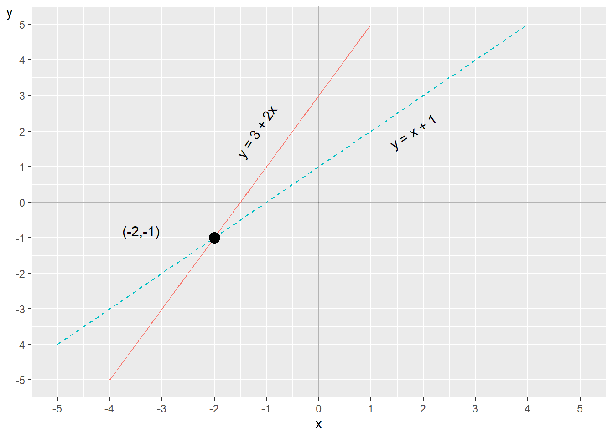
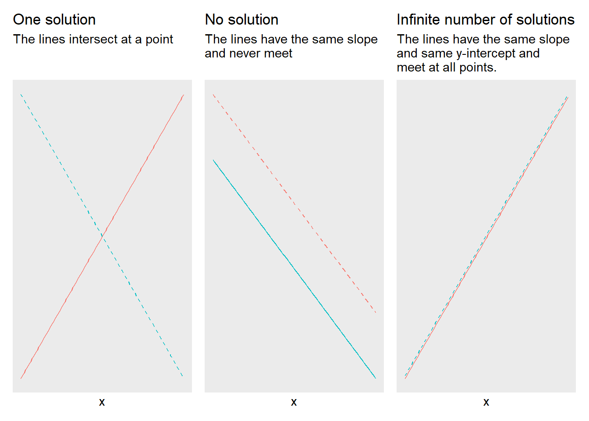

# Systems of Linear Equations {#chap-linjara-ekvationssystem}

So far we have worked with functions that we solve individually. Several linear functions can also be connected and apply simultaneously. This is called equations belonging to a system of equations. This is a central part of many analytical methods and is widely used in both empirical and theoretical work.

## Linear system

A linear system of equations consists of two or more linear equations. The word "system" means that all the equations apply simultaneously. We begin with a simple example with two equations and two variables, $y$ and $x$:

$$
\begin{equation}
\begin{cases}
y & =2x+3\\
x & =y-1
\end{cases}
\end{equation}
$$

 Now we shall investigate if there exists a unique solution for this system. A unique solution for the system would mean that there exist unique values for variables $x$ and $y$ that fit in the equations simultaneously. A linear system of equations of this type can have either a unique solution, infinitely many solutions or no solution, see next section.

If we are to investigate a system of equations' solutions, a useful method is what is called substitution. The idea is based on that we replace, substitute, parts of one equation with parts from the other. For example to use the definition of a variable from one equation and insert this into the other equation. We begin by taking the definition of $x$ from the lower equation: $x=y-1$. This definition of $x$ we insert at the place $x$ stands in the upper equation. The upper equation now becomes: 

$$
\begin{align}
y & =2x+3\\
y & =2\left(y-1\right)+3\nonumber \\
y & =2y-2+3\nonumber \\
y^{*} & =-1\nonumber 
\end{align}
$$

We have now obtained a new definition of the variable $y$. We mark this solution candidate with an asterisk, $y^{*}$, since we need to verify it satisfies both equations. We substitute $y^{*}$ into the lower equation and thereby also obtain a candidate solution for $x$:

$$
\begin{align}
x & =y^{*}-1\\
x^{*} & =\left(-1\right)-1=-2\nonumber 
\end{align}
$$

We must always test substituting our solutions into the original system of equations to see that they really are correct. We check $x^{*}$ by substituting this into the first equation:

$$
\begin{align}
y & =2x^{*}+3\\
y & =2\left(-2\right)+3=-1\nonumber 
\end{align}
$$

Since this gives the same result this confirms that we have found the unique solutions for our two variables: $x^{*}=-2$ and $y^{*}=-1$. The variables $x$ and $y$ can assume other values, but no other values will result in the two equations being satisfied simultaneously. Therefore, these other values are not solutions to the system. Let us now study the following system of equations:

$$
\begin{equation}
\begin{cases}
x & =1+y\\
x & =2-y
\end{cases}
\end{equation}
$$

The equations are now formulated as two functions for $x$. We can also here use substitution and therefore replace $x$ in the upper equation with the definition of $x$ from the lower equation:

$$
\begin{align}
2-y & =1+y\\
1 & =2y\nonumber \\
y^{*} & =\frac{1}{2}\nonumber 
\end{align}
$$

This gives us the following:

$$
\begin{align}
x & =2-y^{*}\\
x^{*} & =2-\frac{1}{2}=\frac{3}{2}\nonumber 
\end{align}
$$

We test substituting this solution into the upper equation:

$$
\begin{align}
x^{*} & =1+y\\
\frac{3}{2} & =1+y\nonumber \\
y^{*} & =\frac{1}{2}\nonumber 
\end{align}
$$

This means that we have found the solution for both $x$ and $y$. Previously we went through how we may illustrate one or more functions with two variables in graphs with two axes. Let us look at the first system of equations we went through above:

$$
\begin{equation}
\begin{cases}
y & =2x+3\\
x & =y-1
\end{cases}
\end{equation}
$$

To more easily be able to see how this looks in a graph we can rewrite the lower equation, so that we get another expression for $y$:

$$
\begin{equation}
\begin{cases}
y & =2x+3\\
y & =x+1
\end{cases}
\end{equation}
$$

(\#fig:tva-ekvationer-i)Two equations in one graph

Now we have two functions for $y$ that we can draw in a graph, which is shown in figure \@ref(fig:tva-ekvationer-i) . One line per function. The two lines meet at the point $\left(x,y\right)=\left(-2,-1\right)$. These values for x and y are the only possible solution to our system of equations. This is also the only point where the two lines meet. We know this because we are here working with linear equations. Even if we were to extend the lines far beyond the points that are visible in the graph the lines will never bend and meet at any other point.

## Number of solutions in the system

In a system of equations with two straight lines (linear functions) we can either have a unique solution, no solution or infinitely many solutions. Figure \@ref(fig:mojligt-antal-losningar-linjara-sy) shows three plot with illustrations of the possibilities for number of solutions. Each plot illustrate two lines, drawn with one equation each. In the left graph the lines meet at one point and this system of equations has one unique solution (compare figure \@ref(fig:tva-ekvationer-i) ). In the middle graph the lines are parallel and the system therefore lacks a solution. In the right graph the lines go along the same points and therefore meet an infinite number of times. The system of equations for the right graph therefore has an infinite number of solutions.

(\#fig:mojligt-antal-losningar-linjara-sy)Possible number of solutions for linear systems of equations

A linear system of equations lacks a solution if the two straight lines never meet at any point. This applies if the slope of the lines is the same, which means that the lines are parallel. In that case there are no values for x and y that satisfy the system of equations in its entirety. If we for example have the following system of equations:

$$
\begin{equation}
\begin{cases}
y & =5x-4\\
10x & =2y
\end{cases}
\end{equation}
$$

 we can from the second, lower, equation solve for $y=5x$. If we replace $y$ in the first equation with this we get:

$$
\begin{align}
y & =5x-4\\
5x & =5x-4\nonumber \\
5x-5x & \neq-4\nonumber 
\end{align}
$$

The last line leads to a paradox. The expression $5x-5x$ equals 0 and not $-4$. The system lacks a solution. We have infinitely many solutions if the equations instead can be described with the same slope and the same value for the y-intercept. For example: 

$$
\begin{equation}
\begin{cases}
y & =3x\\
13+12x & =4y+6+7
\end{cases}
\end{equation}
$$

 We rewrite the second equation: 

$$
\begin{align}
13+12x & =4y+6+7\\
12x & =4y+6+7-13\nonumber \\
3x & =y\nonumber 
\end{align}
$$

This means that the system of equations can be written:

$$
\begin{equation}
\begin{cases}
y & =3x\\
3x & =y
\end{cases}
\end{equation}
$$

 Since the two equations is the same the has an infinite number of solutions. Another situation that leads to an infinite number of solutions is if we have a linear system of equations with more variables than equations, since we then cannot find any unique definitions for the variables in the system.

## Row Reduction {#sec-radreduktion}

Another useful method that can be used to find the solution for linear systems of equations is elimination, also called row reduction or Gaussian elimination. Suppose we have the following system:

$$
\begin{equation}
\begin{cases}
x=6+2y\\
2x=3-8y
\end{cases}
\end{equation}
$$

When we use row elimination we can both add and subtract an entire row with the values from another row, and multiply individual rows with a constant. These two operations can also be combined. To find the solution to the system we can therefore multiply row 1 by the number 2: 

$$
\begin{equation}
\begin{cases}
\left(x=6+2y\right)\times2\\
2x=3-8y
\end{cases}
\end{equation}
$$

 We then get the system of equations:

$$
\begin{equation}
\begin{cases}
2x=12+4y\\
2x=3-8y
\end{cases}
\end{equation}
$$

 We then take row 2 minus row 1 (we subtract row 1 from row 2):

$$
\begin{align}
-\left(2x=12+4y\right)\\
\underline{\left(2x=3-8y\right)}\nonumber \\
0=-9-12y\nonumber 
\end{align}
$$

The third row, below the line, shows the difference between row 2 minus row 1. From the bottom row we can solve for y and then get the solution $y^{*}$:

$$
\begin{align}
-9-12y & =0\\
y^{*} & =-\frac{3}{4}\nonumber 
\end{align}
$$

This value we can then substitute for $y$ in the original row 1 in the system of equations. This gives us the solution for $x$:

$$
\begin{align}
x & =6+2y^{*}\\
x^{*} & =6+2\left(-\frac{3}{4}\right)=9/2\nonumber 
\end{align}
$$

Let us check our solution by substituting $x^{*}$ into row 2 and calculate $y^{*}$:

$$
\begin{align}
2\left(\frac{9}{2}\right) & =3-8y\\
y^{*} & =\frac{1}{8}\left(3-9\right)=-\frac{3}{4}\nonumber 
\end{align}
$$

This seems to be correct. The result becomes the same as when we used substitution. We can see this if we for example take the definition $x=6+2y$ from row 1 and substitute into row 2:

$$
\begin{align}
2x & =3-8y\\
2\left(6+2y\right) & =3-8y\nonumber \\
y^{*} & =-\frac{3}{4}\nonumber 
\end{align}
$$

## Taking logarithms in systems of equations

Even when we have systems of equations we can benefit from being able to add or remove logarithms. Here is a linear system of equations with two equations and an equal number of variables, $x$ and $y$. Other letters symbolize constants:

$$
\begin{equation}
\begin{cases}
y+12 & =3\\
5^{x}+12y & =8
\end{cases}
\end{equation}
$$

The upper equation gives us the solution for $y^{*}=-9$. This we can substitute into the lower equation. Thereafter we can rewrite in logarithmic form to solve for $x$: 

$$
\begin{align}
5^{x}+12y^{*} & =8\\
5^{x}+12*\left(-9\right) & =8\nonumber \\
5^{x} & =8+108\nonumber \\
\ln5^{x} & =\ln116\nonumber \\
x\ln5 & =\ln116\nonumber \\
x^{*} & =\frac{\ln116}{\ln5}\approx2.95\nonumber 
\end{align}
$$

Consider the following example of logarithmic functions in a system of equations:

$$
\begin{equation}
\begin{cases}
\log x+2\log y & =4\\
\log y-3 & =\log x
\end{cases}
 (\#eq:linjart-system-med-log)
\end{equation}
$$

We therefore use $\log x=\log y-3$ in the upper equation:

$$
\begin{align}
\log x+2\log y & =4\\
\left(\log y-3\right)+2\log y & =4\nonumber \\
3\log y & =7\nonumber \\
y^{3} & =10^{7}\nonumber \\
y^{*} & =10^{\frac{7}{3}}\nonumber 
\end{align}
$$

Now we have a definition for $y$, which we substitute into the lower equation in the system of equations \@ref(eq:linjart-system-med-log) :

$$
\begin{align}
\log y^{*}-3 & =\log x\\
\log\left(10^{\frac{7}{3}}\right)-3 & =\log x\nonumber \\
\frac{7}{3}-3 & =\log x\nonumber \\
-\frac{2}{3} & =\log x\nonumber \\
x & =10^{-\frac{2}{3}}\nonumber 
\end{align}
$$

Now we have the solutions $y^{*}=10^{\frac{7}{3}}$ and $x^{*}=10^{-\frac{2}{3}}$. Verify these solutions by substitution.

## Three or more variables

So far we have only gone through systems of equations with two variables but systems of equations can also have several variables. Let us look at the following system as an example, where we have the three variables $x,y$ and $z$:

$$
\begin{equation}
\begin{cases}
x & =5+y\\
y & =13-z\\
z & =x+y
\end{cases}
 (\#eq:system-with-3-ex-1)
\end{equation}
$$

We shall now investigate if the system has one or infinitely many solutions. The definition of $z$ from row 3 we can substitute into row 2:

$$
\begin{align}
y & =13-z\\
y & =13-\left(x+y\right)\nonumber 
\end{align}
$$

 From this we solve for a new definition for $x$:

$$
\begin{align}
y & =13-x-y\\
x & =13-2y
 (\#eq:x-tre-linjara-ekvationer)
\end{align}
$$

 This definition of $x$ we substitute into row 1 in equation \@ref(eq:system-with-3-ex-1) , which gives the solution for $y$:

$$
\begin{align}
x & =5+y\\
\left(13-2y\right) & =5+y\nonumber \\
3y & =8\nonumber \\
y^{*} & =\frac{8}{3}\nonumber 
\end{align}
$$

From this we can in turn find solutions for $x$ and $z$. We begin by substituting $y^{*}$ into equation \@ref(eq:x-tre-linjara-ekvationer) :

$$
\begin{align}
x & =13-2y^{*}\\
x^{*} & =13-2*\left(\frac{8}{3}\right)=\frac{23}{3}\nonumber 
\end{align}
$$

By using the solutions for $x^{*}$ and $y^{*}$ in the third equation in the system we get the solution for $z$: 

$$
\begin{equation}
z^{*}=\frac{23+8}{3}=\frac{31}{3}
\end{equation}
$$

Let us check this by substituting $z^{*}$ into row 2:

$$
\begin{align}
y^{*} & =13-\frac{31}{3}=\frac{8}{3}
\end{align}
$$

That seems to be correct. We can also use row elimination, but to facilitate understanding in this case we arrange all terms in the same order on all rows. We start from the system:

$$
\begin{equation}
\begin{cases}
x & =5+y\\
y & =13-z\\
z & =x+y
\end{cases}
\end{equation}
$$

 We rewrite:

$$
\begin{equation}
\begin{cases}
x & =5+y\\
0 & =13-z-y\\
x & =z-y
\end{cases}
\end{equation}
$$

 We add row 3 to row 2::

$$
\begin{equation}
\begin{cases}
x & =5+y\\
x & =13-2y\\
x & =z-y
\end{cases}
\end{equation}
$$

 We subtract row 1 from row 2:

$$
\begin{equation}
\begin{cases}
x & =5+y\\
0 & =8-3y\\
x & =z-y
\end{cases}
\end{equation}
$$

 From row two we now get the solution $y^{*}=\frac{8}{3}$. This we can substitute into row 1, whereupon we find the solution $x^{*}=\frac{23}{3}$. These two solutions we can then substitute into row 3 and then find $z^{*}=\frac{23}{3}+\frac{8}{3}=\frac{31}{3}$.

## Some more examples

We shall now investigate the solution to the following system of equations:

$$
\begin{equation}
\begin{cases}
y=1+x\\
x=2-y
\end{cases}
\end{equation}
$$

In this case we can relatively easily create two definitions for $y$ and set these equal to each other and solve for $x^{*}$. We begin by rewriting the second equation in the system so that we get $y=2-x$. We set these equal to each other and thereby find the solution for $x$:

$$
\begin{align}
2-x & =1+x\\
x^{*} & =\frac{1}{2}\nonumber 
\end{align}
$$

 We substitute this into the first equation and get the solution for $y$:

$$
\begin{align}
y & =1+x^{*}\\
y^{*} & =1+\frac{1}{2}=\frac{3}{2}\nonumber 
\end{align}
$$

Verify these solutions by substitution. Consider a similar example but with fractions and test whether we can find a solution for $x$ and $y$: 

$$
\begin{equation}
\begin{cases}
y=-\frac{3}{4}-\frac{5}{6}x\\
x=-1+y
\end{cases}
\end{equation}
$$

 The lower equation in the system we can rewrite to $y=x+1$. We set the two definitions for $y$ equal to each other and solve for $x^{*}$:

$$
\begin{align*}
x+1 & =-\frac{3}{4}-\frac{5}{6}x\\
\frac{11}{6}x & =-\frac{7}{4}\\
x^{*} & =-\frac{21}{22}
\end{align*}
$$

 This gives us the solution for $y$:

$$
\begin{align}
y^{*} & =-\frac{3}{4}-\frac{5}{6}\left(-\frac{21}{22}\right)=\frac{1}{22}
\end{align}
$$

Try yourself to substitute the solutions into the original system of equations to check that it is correct. Here we have a system of equations with the variables $x,y$ and $z$:

$$
\begin{equation}
\begin{cases}
x=y+2z\\
y=5-x+3z\\
z=1
\end{cases}
 (\#eq:ekvsys-ovning-3-var-abc)
\end{equation}
$$

Already from equation \@ref(eq:ekvsys-ovning-3-var-abc) we see that $c^{*}=1$. This we can use in row 2:

$$
\begin{align}
y & =2-x+3z^{*}\\
y & =5-x+3\nonumber 
\end{align}
$$

This definition of $y$ as well as row 3, $z=1$, we can substitute into row 1:

$$
\begin{align}
x & =y+2z\\
x & =\left(5-x+3\right)+2\nonumber \\
x^{*} & =5\nonumber 
\end{align}
$$

 Row 3, $z=1$, and $x^{*}=5$ we can substitute into row 2:

$$
\begin{align}
y & =5-x+3z\\
y^{*} & =5-5+3=3\nonumber 
\end{align}
$$

We have now found the three solutions we are looking for the system: $x^{*}=5,\,y^{*}=3$ and $z^{*}=1$. Verify these solutions by substitution. Consider the following expression with the same letters, but new numbers and equations:

$$
\begin{equation}
\begin{cases}
x=10-0.3z\\
y=x+5\\
z=x-y
\end{cases}
\end{equation}
$$

Row 2 and 3 in combination give:

$$
\begin{align}
z^{*} & =x-x-5=-5
\end{align}
$$

 We substitute $z^{*}$ into row 1 and get:

$$
\begin{align}
x^{*} & =10-0.3*\left(-5\right)=11.5
\end{align}
$$

 This we can substitute into row 2: 

$$
\begin{align}
y^{*} & =11,5+5=16,5
\end{align}
$$

Let us now take the following system of equations as an example:

$$
\begin{equation}
\begin{cases}
x=23-5y+z\\
x=2+8z
\end{cases}
\end{equation}
$$

 Since this system of equations has more variables (three: $x,y$ and $z$) than equations (two), the system has an infinite number of solutions.

## Beyond the third dimension {#sec-bortom-trredje-dimensionen}

Note that an ordinary graph with two axes has two dimensions: height and width, the vertical and the horizontal axis, which are usually called y and x. As we went through above there is no limitation for how many variables that can be included in an equation. However, it becomes considerably more complicated to illustrate relationships between more than two variables. We can draw two variables in a graph with two axes. If we have three variables we can draw this in a three-dimensional graph as a cube.

We can also use other tricks to add additional dimensions, for example let a variable determine the size of the dots in a graph, or illustrate one or more variables with the help of colors. But there is still a limitation of how much information that can be illustrated in one and the same graph. Already three variables in the same graph often becomes difficult to overview.

Does this mean that it is meaningless to use more than three variables simultaneously? No. Suppose we have a theory that a person's life expectancy depends on their income and that this can be written in the form of the equation for a straight line: 

$$
\begin{equation}
y=a+bx
\end{equation}
$$

 where $y$ and $x$ are variables and $a$ and $b$ are coefficients. The coefficient $a$ is a constant that indicates the value that $y$ takes when $x=0$, the line's y-intercept. Coefficient $b$ is the constant slope coefficient that indicates how much $y$ changes when $x$ increases by one unit.

Say now that we in addition to income also think that life expectancy in various ways depends on an additional five variables: (1) the person's gender, (2) genetic conditions, (3) eating habits, (4) alcohol consumption and (5) number of kilometers the person jogs each week. These other variables we can in that case describe as additional dimensions in our theoretical model. We now have six explanatory variables and can write these into our linear equation as $x_{1},\;x_{2},\;x_{3},\;x_{4},\;x_{5}$ and $x_{6}$. Each variable gets its own slope coefficient, which we call $b_{1},\;b_{2},\;b_{3},\;b_{4},\;b_{5}$ and $b_{6}$. Each slope coefficient describes how $y$ changes when the respective explanatory variable $\left(x_{1},...,x_{6}\right)$ changes:

$$
\begin{equation}
y=a+b_{1}x_{1}+b_{2}x_{2}+b_{3}x_{3}+b_{4}x_{4}+b_{5}x_{5}+b_{6}x_{6}
\end{equation}
$$

 We are thus often interested in relationships, covariations and correlations that are difficult to illustrate in graphs and pictures.

In this model with several variables have a longer equation compared to what we have worked with earlier. But despite this we still describe a relatively "simple" linear relationship between $y$ and the each explanatory variable, $x_{1}$ to $x_{6}$. To see why this is a rather simple approach, we can for example imagine that the different explanatory variables $\left(x_{1},...,x_{6}\right)$ also might affect each other and also affect each other's slope coefficients $\left(b_{1},...,b_{6}\right)$. Parts of the relationship between the variables might only apply under certain conditions, and so on. It is not difficult to reason about several changes to the theory that would require more complex mathematics to be described.

In our everyday life we often consider complex relationships and correlations between different phenomena. We can easily understand that our lives are affected by many different types of phenomena that in many cases also affect each other. Certain phenomena we additionally have limited or no influence over. Despite this we seem to have surprisingly easy to become convinced by simple arguments about complex and significant causal relationships through banal arguments within politics or in advertising, how one phenomenon causes another phenomenon. It is difficult to be human.

## Chapter summary

- A system of equations consists of several equations that are valid simultaneously. Linear systems of equations can have a unique solution, infinitely many solutions or lack a solution. For a system of equations with two equations a unique solution means that the equations' lines in a graph meet at one point. An infinite number of solutions means that the lines have the same $x$- and $y$-values at all points. If the system lacks a solution the lines never meet.

- To find solutions to a system of equations we can use substitution or row reduction.

- A graph with two axes is a good way to illustrate how two variables, for example $x$ and $y$, relate to each other. It is usually difficult to illustrate the relationship between three or more variables.

## Exercises

