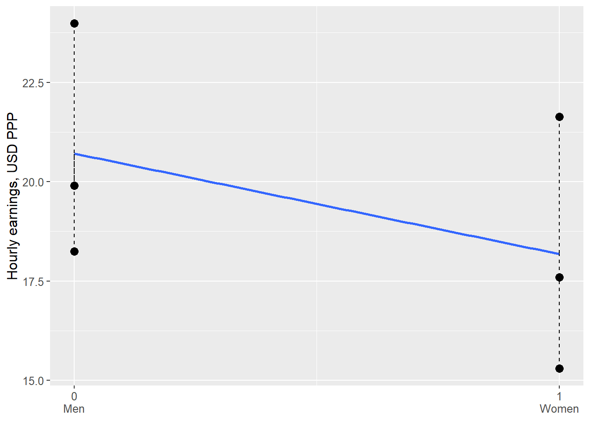
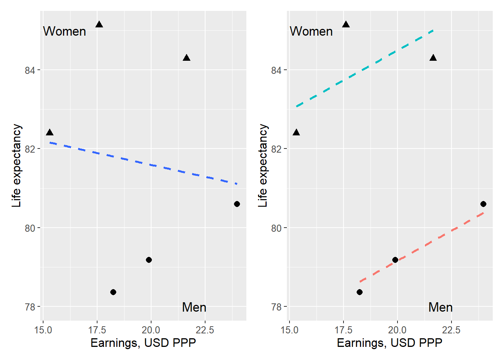
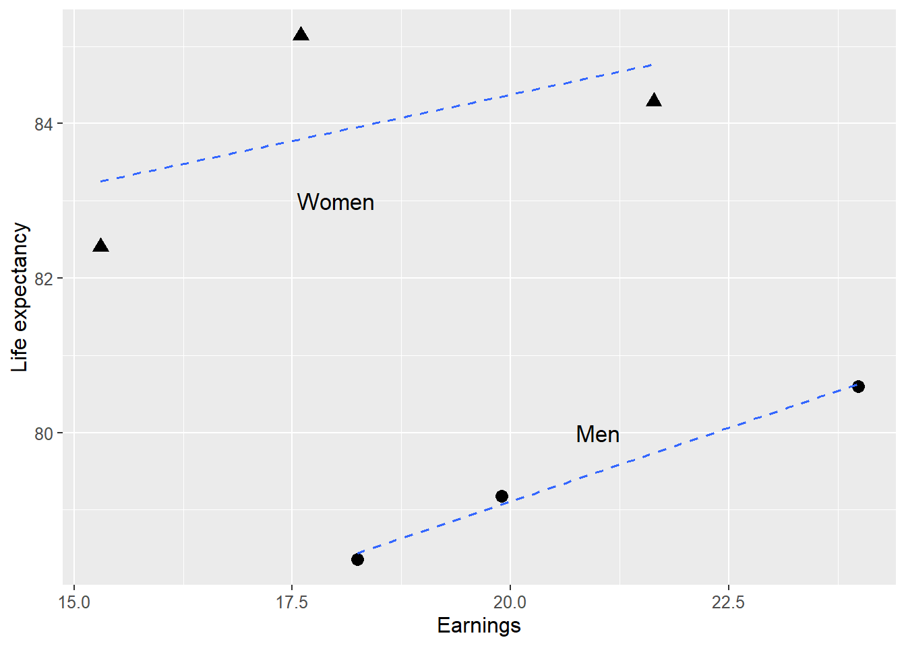

# Least Squares with Multiple Variables {#chap-ols-flera-variabler-matriser}

In this chapter, we will introduce regression models with multiple explanatory variables. Suppose we are studying the effect of X on an outcome Y among people. We also want to know whether the participants' gender and age affect Y. We could certainly divide all participants and estimate separate regression models for all age groups separately for men and women. But this risks becoming confusing and leading to misleading results.

Instead, we will use a regression model where, in addition to variable X, we add the variables gender and age. This allows us to adjust our estimate of the effect that X has on Y, taking these variables into account. In many situations, we must perform this type of analysis to obtain correct estimates of the covariation we seek.

An important result in this context is that observations from all variables in a regression model can affect the results for all coefficients in the model. That is, when we adjust for age and gender, perhaps the estimated covariation between X and Y also changes.

Large parts of this review are abstract and may seem removed from reality. Later on, examples follow of how we can use this within social science. The method is completely central to an enormous amount of analytical work and research.

## Regression analysis with three variables {#sec-ols-pa-tre-variabler}

Let us now start from a regression model where the explained (dependent) variable $Y$ is explained by the two explanatory (independent) variables $X$ and $Z$:

$$
\begin{equation}
Y_{i}=a+bX_{i}+cZ_{i}+V_{i}
 (\#eq:regressionsmodell-3-variabler)
\end{equation}
$$

The letters $a$, $b$ and $c$ are constant coefficients and $V_{i}$ is the error term for observation $i$. We will now estimate the coefficients $\hat{a}$, $\hat{b}$ and $\hat{c}$ and thereafter $\hat{Y}$ as well as $\hat{V}$. The coefficient $\hat{b}$ will give us the average change in $Y$ that is associated with an increase of $X$ by one unit, given the values in $Z$. Coefficient $\hat{c}$ shows the average change in $Y$ that is associated with an increase of $Z$ by one unit, given the values in $X$.

That is, by using both explanatory variables $X$ and $Z$ in the same regression model, the calculation will show the covariation between Y and X, taking into account variations in $Z$. The covariation between $Y$ and $Z$ will be estimated taking into account variations in $X$. This is a central aspect of this type of regression analysis and we return below to what this means.

Just as when we only had one explanatory variable in the regression model, we shall now, when we have two explanatory variables, find those values for the constant coefficients $a$, $b$ and $c$ that minimize the squared residuals $\sum\hat{V}^{2}$, compare equation \@ref(eq:ols-minimeringsproblem) . We therefore again describe our calculation as a minimization problem:

$$
\begin{equation}
\min_{\hat{a},\hat{b},\hat{c}}\sum_{i=1}^{n}\hat{V}_{i}^{2}=\min_{\hat{a},\hat{b},\hat{c}}\sum_{i=1}^{n}\left(Y_{i}-\hat{Y_{i}}\right)^{2}
\end{equation}
$$

Predicted $\hat{Y}$ can be defined from our regression model as:

$$
\begin{equation}
\hat{y_{i}}=\hat{a}+\hat{b}x_{i}+\hat{c}z_{i}
\end{equation}
$$

This definition of $\hat{Y}$ can be inserted into our minimization problem:

$$
\begin{align}
\min_{\hat{a},\hat{b},\hat{c}}\sum_{i=1}^{n}\hat{V}_{i}^{2} & =\min_{\hat{a},\hat{b},\hat{c}}\sum_{i=1}^{n}\left(Y_{i}-\hat{Y_{i}}\right)^{2}=\min_{\hat{a},\hat{b},\hat{c}}\sum_{i=1}^{n}\left(Y_{i}-\hat{a}-\hat{b}X_{i}-\hat{c}Z_{i}\right)^{2}
 (\#eq:minimera-e-2-med-y-x-z)
\end{align}
$$

In this equation we know $Y_{i}$, $X_{i}$ and $Z_{i}$, since these are our observed data. We have three factors to take into account in the form of the three constants $\hat{a}$, $\hat{b}$ and $\hat{c}$. We calculate the first-order conditions by differentiating the expression in equation \@ref(eq:minimera-e-2-med-y-x-z) with respect to $a$, $b$ and $c$ respectively and setting each result equal to 0. Since we have three factors we get the following three results:

$$
\begin{align}
\frac{\partial}{\partial\hat{a}}\left(\sum_{i=1}^{n}\hat{V}_{i}^{2}\right) & =\sum-2\left(Y_{i}-\hat{a}-\hat{b}X_{i}-\hat{c}Z_{i}\right) (\#eq:ols-forstagradsvillkor-3-variabler)\\
\frac{\partial}{\partial\hat{b}}\left(\sum_{i=1}^{n}\hat{V}_{i}^{2}\right) & =\sum-2X_{i}\left(Y_{i}-\hat{a}-\hat{b}X_{i}-\hat{c}Z_{i}\right)\nonumber \\
\frac{\partial}{\partial\hat{c}}\left(\sum_{i=1}^{n}\hat{V}_{i}^{2}\right) & =\sum-2Z_{i}\left(Y_{i}-\hat{a}-\hat{b}X_{i}-\hat{c}Z_{i}\right)\nonumber
\end{align}
$$

In a similar way as we did in section \@ref(sec-harled-ols-med-vanliga-f) we set the first condition equal to 0 and solve for a definition of $\hat{a}$:

$$
\begin{align}
0 & =-2\sum y+\sum\hat{a}+\sum\hat{b}x_{i}+\sum\hat{c}z_{i} (\#eq:a-intercept-def-1-for-regmodell-med-2-var)\\
n\hat{a} & =ny-\hat{b}nx_{i}-\hat{c}nz_{i}\nonumber \\
\hat{a} & =\bar{y}-\hat{b}\bar{x}-\hat{c}\bar{z}\nonumber
\end{align}
$$

Compare the definition for the y-intercept when we only have two variables in equation \@ref(eq:ols-konstanter-definition-1) . Coefficient $\hat{a}$ is a function of the observations in all three variables included in the regression model: $Y$, $X$ and $Z$. From here we continue to solve for the slope coefficients $\hat{b}$ and $\hat{c}$. Here, however, we only look at the final results.

The equations below describe the estimators for the two slope coefficients $\hat{b}$ and $\hat{c}$. To compress the algebra we write $\tilde{X_{i}}=X_{i}-\bar{X}$ and correspondingly for $\tilde{Y_{i}}$ and $\tilde{Z_{i}}$. This means that the coefficients' estimators are described based on the observations' deviations from their respective means:

$$
\begin{align}
\hat{b} & =\frac{\left(\sum\tilde{y_{i}}\tilde{x_{i}}\right)\left(\sum\tilde{z}_{i}^{2}\right)-\left(\sum\tilde{y}_{i}\tilde{z}_{i}\right)\left(\sum\tilde{x_{i}}\tilde{z_{i}}\right)}{\left(\sum\tilde{x}_{i}^{2}\right)\left(\sum\tilde{z}_{i}^{2}\right)-\left(\sum\tilde{x}_{i}\tilde{z}_{i}\right)^{2}} (\#eq:ols-konstanterna-b-och-c)\\
\hat{c} & =\frac{\left(\sum\tilde{y}_{i}\tilde{z}_{i}\right)\left(\sum\tilde{x}_{i}^{2}\right)-\left(\sum\tilde{y}_{i}\tilde{x}_{i}\right)\left(\sum\tilde{x}_{i}\tilde{z}_{i}\right)}{\left(\sum\tilde{x}_{i}^{2}\right)\left(\sum\tilde{z}_{i}^{2}\right)-\left(\sum\tilde{x}_{i}\tilde{z}_{i}\right)^{2}}\nonumber
\end{align}
$$

All three coefficients $\hat{a}$, $\hat{b}$ and $\hat{c}$ depend on the observed values in the three variables in the regression model: $Y$, $X$ and $Z$. We see this because values for all three variables are included in each respective equation. This means that even though $\hat{b}$ measures the covariation between $Y$ and $X$, $\hat{b}$ is a function of $Y$, $X$ and $Z$. And despite the fact that the slope coefficient $\hat{c}$ measures the covariation between the variables $Y$ and $Z$, $\hat{c}$ is also a function of observations in all three variables $Y$, $X$ and $Z$.

Had we had more variables and coefficients in our regression model, the equations would have become even more extensive. At the end of this chapter we will go through another way to derive equations for the coefficients in a regression model regardless of the number of variables and coefficients.

If we add a variable to our analysis, this can affect the results for all coefficients included in the model. Say that the variable $Z$ should be included in the model but that this for some reason is not included in the analysis. In that case the result for variable $X$ will become misleading. We do not get the correct result until we include $Z$. This is central to understanding this type of method and analytical work in general. 

Table: Variables $Y,X$ and $Z$(\#tab:variablerna-y-x-z)

| $i$| $y_{i}$| $x_{i}$| $z_{i}$| $\tilde{y}_{i}$| $\tilde{x}_{i}$| $\tilde{z_{i}}$| $\tilde{y}_{i}\tilde{x_{i}}$| $\tilde{y_{i}}\tilde{z_{i}}$| $\tilde{x_{i}}\tilde{z_{i}}$| $\tilde{x_{i}}^{2}$| $\tilde{z_{i}}^{2}$|
| --- | --- | --- | --- | --- | --- | --- | --- | --- | --- | --- | --- |
| 1 | 3 | 3 | 1 | –0.5 | –2 | –0.5 | 1 | 0.25 | 1 | 4 | 0.25 |
| 2 | 2 | 4 | 4 | –1.5 | -1 | 2.5 | 1.5 | –3.75 | –2.5 | 1 | 6.25 |
| 3 | 5 | 6 | 0 | 1.5 | 1 | –1.5 | 1.5 | –2.25 | –1.5 | 1 | 2.25 |
| 4 | 4 | 7 | 1 | 0.5 | 2 | 0.5 | 1 | –0.25 | –1 | 4 | 0.25 |
| Mean | 3.5 | 5 | 1.5 | | | | | | | | |
| Sum | | | | | | | 5 | $-6$| $-4$| 10 | 9 |

*Note: $\tilde{y}_{i}=y_{i}-\bar{y}$, as well as for $\tilde{x}_{i}$ and $\tilde{z}_{i}$*

Now we will estimate a regression model based on some observations. For this we reuse the fictitious variables $Y,X$ and $Z$ with four observations each that we used in chapter \@ref(chap-ols) when we introduced the least squares method. All three variables are reported in table \@ref(tab:variablerna-y-x-z) with some calculations that we need. In section \@ref(sec-minstakvadratmetoden-ols) we used the variables $Y$ and $X$ to estimate the regression model $Y_{i}=a+bX_{i}+V_{i}$ and found then that $\hat{a}=1$ and $\hat{b}=0.5$. Now we will estimate the coefficients for the following regression model: 

$$
\begin{equation}
y_{i}=a+bx_{i}+cz_{i}+v_{i}
\end{equation}
$$

 where Y, X and Z are the variables, a, b and c are the coefficients we will estimate and V is the error term. In equation \@ref(eq:ols-konstanterna-b-och-c) we have the definitions for how we estimate $\hat{b}$ and $\hat{c}$. In table \@ref(tab:variablerna-y-x-z) we have some of the results we need:

$$
\begin{align}
\hat{b} & =\frac{\left(5\right)\left(9\right)-\left(-6\right)\left(-4\right)}{\left(10\right)\left(9\right)-\left(-4\right)^{2}}\approx0.28\\
\hat{c} & =\frac{\left(-6\right)\left(10\right)-\left(5\right)\left(-4\right)}{\left(10\right)\left(9\right)-\left(-4\right)^{2}}\approx-0.54\nonumber 
\end{align}
$$

 

Table: Calculations of $\hat{Y}$ and $\hat{V}$(\#tab:berakningar-av-y-och-e)

| $y_{i}$| $x_{i}$| $z_{i}$| $\hat{y}_{i}$| $\hat{v}_{i}$|
| --- | --- | --- | --- | --- |
| 3 | 3 | 1 | 3.2 | $-0.2$|
| 2 | 4 | 4 | 1.86 | 0.14 |
| 5 | 6 | 0 | 4.59 | 0.41 |
| 4 | 7 | 1 | 4.34 | $-0.34$|

 

<iframe src="Eriks_3d_graf/3dscatter.html" width="672" height="500px" data-external="1"></iframe>

(\#fig:3d-regression-y-x-z)Results from the regression model $y_{i}=a+bx_{i}+cz_{i}+v_{i}$

When we estimated the regression model $Y=a+bX+V$ we found that $\hat{b}=0.5$. When we now added the variable $Z$ to the regression model we see how the result for the slope coefficient $\hat{b}$ goes from 0.5 to 0.3. We use the results for $\hat{b}$ and $\hat{c}$ to estimate $\hat{a}$:

$$
\begin{align}
\hat{a} & =3.5-\hat{b}*5-\hat{c}*1.5\\
 & =3.5-0.28*5-\left(-0.54\right)*1.5\nonumber \\
 & \approx2.89\nonumber 
\end{align}
$$

We summarize our estimated coefficients by inserting the results into our regression model:

$$
\begin{align}
y_{i} & =\hat{a}+\hat{b}x_{i}+\hat{c}z_{i}+v_{i}=2.89+0.28x_{i}-0.54z_{i}+v_{i}
\end{align}
$$

Now we may also estimate predicted $\hat{Y}_{i}$ and the residual $\hat{V}_{i}$, which is summarized in table \@ref(tab:berakningar-av-y-och-e) with rounded results. When we have three variables it is more difficult to illustrate covariation in a graph. Despite this, an attempt is made in figure \@ref(fig:3d-regression-y-x-z) where the four observations are placed in the graph based on their values for $Y,X$ and $Z$. The vertical axis is the $Y$-axis while the variables $X$ and $Z$ each have their own horizontal axis. The black dot at the top of the graph is observation 3 whose values are $\left(Y,X,Z\right)=\left(5,6,0\right)$.

Since the regression model has three variables, the regression line $\left(\hat{Y}\right)$ now becomes a plane surface with three dimensions, which is illustrated by the grid. This plane surface is angled with regard to the two variables $X$ and $Z$, depending on their respective slope coefficient. Since the slope coefficient $\hat{c}<0$ the grid slopes downward along the $Z$-axis seen from the $Y$-axis. Since $\hat{b}>0$ the grid slopes upward along the $X$-axis seen from the $Y$-axis.

## Factor variables {#sec-faktorvariabler}

Regression analysis is a quantitative method in the sense that we use quantitative data to create quantitative results. We can also use qualitative data in our analysis, information that is not originally expressed in numbers, as long as we assign numbers to this. One such example is factor variables, also called categorical variables. Factor variables typically contain nominal data, see section \@ref(sec-olika-typer-av-data) .

Let us start with factor variables that only assume two different values, for example if we send out a survey and ask recipients to answer "Yes" or "No". A common method is then to replace one response alternative with the number 0 and the other with the number 1. Another example is a variable that indicates whether a row in a table contains information about a man or a woman, whereupon the variable can assume the value 0 for one gender and 1 for the other gender. It does not matter which variable value gets which number, as long as we keep track of what represents what when we calculate.

An explanatory variable in a regression model that only assumes the values 0 or 1 is called a dummy variable or indicator variable. Data that can only assume two values is called binary. Often 0 or 1 is used precisely to describe the information in a binary variable, even though 0 and 1 symbolize something else (compare section \@ref(sec-star-wars) ).

Table: Average earnings for men and women (\#tab:genomsnittlig-inkomst-for-man-kvinnor-tre-kommuner)

| Country | Men | Women |
| --- | --- | --- |
| France | 19.9 | 17.6 |
| United Kingdom | 18.2 | 15.3 |
| Sweden | 24 | 21.6 |

*Note: Data from ILOSTAT. Earnings in 2021 US dollars (USD), adjusted for inflation and local prices (PPP = Purchasing Power Parity).*

Table \@ref(tab:genomsnittlig-inkomst-for-man-kvinnor-tre-kommuner) shows average hourly earnings for men and women respectively in three countries 2020, calculated in US dollars, adjusted for local prices (Purchasing Power Parity). Now we will study the differences in average earnings between male and females. We begin by formulating a regression model:

$$
\begin{equation}
W_{i}=a+bG_{i}+e_{i}
\end{equation}
$$

 

Table: Data for $W$ and $G$(\#tab:data-med-dummyvariabel)

| Country | $W_{i}$| $G_{i}$| $\tilde{W}$| $\tilde{G}$| $\tilde{G}^{2}$| $\tilde{W}\tilde{G}$|
| --- | --- | --- | --- | --- | --- | --- |
| France | 19.9 | 0 | 0.452 | $-0.5$| 0.25 | -0.226 |
| United Kingdom | 18.2 | 0 | -1.19 | $-0.5$| 0.25 | 0.597 |
| Sweden | 24 | 0 | 4.54 | $-0.5$| 0.25 | -2.27 |
| France | 17.6 | 1 | -1.85 | 0.5 | 0.25 | -0.924 |
| United Kingdom | 15.3 | 1 | -4.14 | 0.5 | 0.25 | -2.07 |
| Sweden | 21.6 | 1 | 2.2 | 0.5 | 0.25 | 1.1 |
| Mean | 19.4 | 0.5 | | | | |
| Sum | | | | | 1.5 | -3.79 |

*Note: Data from ILOSTAT. Earnings in 2021 PPP USD. $\tilde{W}=W_{i}-\bar{W_{i}}$, $\tilde{G}=G_{i}-\bar{G_{i}}$.*

 where $W_{i}$ is average earnings in country $i$ and $G_{i}$ is gender which has the value 0 for men and 1 for women. We then estimate the regression model in the same way as before, where the coefficients are estimated by the least squares method. Table \@ref(tab:genomsnittlig-inkomst-for-man-kvinnor-tre-kommuner) gives us parts of the calculation:

$$
\begin{align}
\hat{b} & =\frac{\sum\left(G_{i}-\bar{G}\right)\left(W_{i}-\bar{W}\right)}{\sum\left(G_{i}-\bar{G}\right)^{2}}\approx\frac{-3.7945}{1.5}\approx-2.53\\
\hat{a} & =\bar{W}-\hat{b}\bar{G}\approx19.445-\left(-2.53\right)0.5\approx20.71\nonumber 
\end{align}
$$

The coefficient $\hat{b}$ is negative, which means that the variable $G$ has a negative covariation with $W$. Our dummy variable is defined $G=1$ for women. Variable $W$ is associated with an 2.53 units lower value for women compared to men, which means that women on average in 2020 had 2.53 lower earnings per hour than men in these countries. The result is illustrated in figure \@ref(fig:medelinkomst-kon-6-kommuner) . 

(\#fig:medelinkomst-kon-6-kommuner)Average earnings for men and women in three countries

Dummy variables can also be useful for categorizing factor variables with more than two values. Let us again compare differences in earnings between the three countries in the previous example, but instead of the difference between women and men we will now calculate the difference in average earnings between the countries. Table \@ref(tab:tre-kommuner-och-tva-dummy) presents the variables, where $Y_{i}$ now indicates average earnings for all residents in the countries. The variables $K_{1}$ and $K_{2}$ are two dummy variables for the countries in the following regression model:

$$
\begin{equation}
Y_{i}=a+bK_{\text{United Kingdom}}+cK_{\text{Sweden}}+e_{i}
 (\#eq:regmodell-2-dummies-for-kommuner)
\end{equation}
$$

 

Table: Three countries and two dummy variables (\#tab:tre-kommuner-och-tva-dummy)

| Country | $Y_{i}$| $K_{\text{United Kingdom}}$| $K_{\text{Sweden}}$|
| --- | --- | --- | --- |
| France | 18.8 | 0 | 0 |
| United Kingdom | 16.8 | 1 | 0 |
| Sweden | 22.8 | 0 | 1 |

*Note: Average earnings 2020. Data from ILOSTAT. Earnings in 2021 PPP USD.*

 where $e$ is the error term. Our dummy variables represent the countries United Kingdom and Sweden, one dummy variable fewer than the number of countries. When both dummy variables in the model equal 0 we get the estimates for the third country, France. Regression analysis with dummy variables is sometimes called fixed effects. Our regression model calculates the same thing as we already see in the data material. The purpose of this exercise is to understand the meaning of dummy variables in a regression model. We estimate the regression model in equation \@ref(eq:regmodell-2-dummies-for-kommuner) with the least squares method:

$$
\begin{align}
\hat{Y} & =\hat{a}+\hat{b}K_{\text{United Kingdom}}+\hat{c}K_{\text{Sweden}}\\
 & =18.763-1.97K_{\text{United Kingdom}}+4.086K_{\text{Sweden}}\nonumber 
\end{align}
$$

The result $\hat{a}=18.763$ is approximately 18.8, which match our data for France. This is the result for earnings $\hat{Y}$ if we set $K_{\text{United Kingdom}}=K_{\text{Sweden}}=0$.

We get $\hat{b}=-1.97$, which means that the average earnings in United Kingdom equals $18.763-1.97=16.793\approx16.8$, same as the table. Coefficient $\hat{c}=4.086$ means that the average earnings in Sweden equals $18.763+4.086=22.849\approx22.8$.

When you have a regression model where a categorical variable is included, for example region, you can often see formulations of regression models with abbreviations for dummy variables. Say for example that we would like to estimate the regression model in equation \@ref(eq:regmodell-2-dummies-for-kommuner) with data on 150 countries. In that case we would want to use 149 dummy variables (number of countries minus 1). The last country's result is given by setting all dummy variables equal to zero.

## Ceteris paribus {#sec-konstanthaller}

As we went through in the introduction to this chapter, regression analysis with multiple explanatory variables is often useful for getting a correct picture of the covariation between multiple phenomena. By controlling for other relevant variables in our model, the slope coefficient for another variable in the model can change.

This is what we saw in section \@ref(sec-ols-pa-tre-variabler) , where the coefficients $a$, $b$, $c$ in a regression model of the type $Y_{i}=a+bX_{i}+cZ_{i}+V_{i}$ do not only depend on how each individual variable covaries with $Y$, but also on the relationships between all variables included in the regression model. This is called estimating the covariation for $X$ and $Y$ while holding constant the other variables (which is included in the model). In our particular model we estimate the covariation between $Y$ and $X$, while holding $Z$ constant. And we estimate the covariation between $Y$ and $Z$, while holding $X$ constant.

Table: Data on earnings and life expectancy per country and gender (\#tab:earnings-lifeexp-gender-per-country)

| Country and gender | $L$| $I$| $G$|
| --- | --- | --- | --- |
| France, Women | 85.137 | 17.597 | 1 |
| France, Men | 79.179 | 19.897 | 0 |
| Sweden, Women | 84.284 | 21.641 | 1 |
| Sweden, Men | 80.597 | 23.982 | 0 |
| United Kingdom, Women | 82.400 | 15.302 | 1 |
| United Kingdom, Men | 78.362 | 18.250 | 0 |
| | | | |
| Mean | 81.6598 | 19.4448 | 0.5 |

*Note: Data from ILOSTAT (earnings, $I$), Our World in Data (life expectancy, $L$). Earnings in 2021 PPP USD.*

We illustrate this with the help of data on average life expectancy and earnings for women and men respectively in three countries, described in table \@ref(tab:earnings-lifeexp-gender-per-country) . The column furthest to the right describes a dummy variable for gender where women = 0 and men = 1. Let us begin by comparing the relationship between life expectancy and earnings with the following regression model:

$$
\begin{equation}
L=a_{1}+a_{2}I+\epsilon
 (\#eq:allt-annat-lika-reg-mod-1)
\end{equation}
$$

 where $L$ is life expectancy, $I$ is earnings, $a_{1}$ and $a_{2}$ are the coefficients we will estimate with the least squares method and $\epsilon$ is the error term. The slope coefficient $a_{2}$ we estimate to:

$$
\begin{align}
\hat{a_{2}} & =\frac{\sum_{i}\left(I_{i}-\bar{I}\right)\left(L_{i}-\bar{L}\right)}{\sum_{i}\left(I_{i}-\bar{I}\right)^{2}}\approx\frac{-5.7321}{47.6187}\approx-0.1204
\end{align}
$$

Coefficient $a_{1}$ we estimate to:

$$
\begin{align}
\hat{a_{1}} & =\bar{L}-\hat{b}\bar{I}\approx81.6598-\left(-0.1204\right)19.4448\approx84
\end{align}
$$

 The calculations are not described here.

According to our calculations there seems to be a negative relationship between life expectancy L and earnings I, which means that people with higher earnings on average live shorter lives. Let us now add the variable gender G to our regression model. In table \@ref(tab:earnings-lifeexp-gender-per-country) this is a dummy variable that only takes the value 0 or 1. We will now estimate the following regression model:

$$
\begin{equation}
L=b_{1}+b_{2}I+b_{3}G+V
 (\#eq:allt-annat-lika-reg-mod-2)
\end{equation}
$$

 where $L,\:I$ and $G$ are our variables, $b_{1},\:b_{2}$ and $b_{3}$ are the coefficients we will estimate using least squares, and $V$ is the error term. To estimate the slope coefficients we now use the definitions in equation \@ref(eq:ols-konstanterna-b-och-c) . We begin with the slope coefficient $b_{2}$:

$$
\begin{align}
\hat{b}_{2} & =\frac{\left(\sum\tilde{L_{i}}\tilde{I_{i}}\right)\left(\sum\tilde{G}_{i}^{2}\right)-\left(\sum\tilde{L}_{i}\tilde{G}_{i}\right)\left(\sum\tilde{I_{i}}\tilde{G_{i}}\right)}{\left(\sum\tilde{I}_{i}^{2}\right)\left(\sum\tilde{G}_{i}^{2}\right)-\left(\sum\tilde{I}_{i}\tilde{G}_{i}\right)^{2}}\\
 & \approx\frac{\left(-5.73\right)\left(1.5\right)-\left(6.84\right)\left(-3.79\right)}{\left(-3.79\right)\left(1.5\right)-\left(14.4\right)^{2}}\nonumber \\
 & \approx0.3044\nonumber 
\end{align}
$$

 Tilde over a letter describes deviation from the mean, for example: $\tilde{G}=G_{i}-\bar{G}$. The slope coefficient $b_{3}$:

$$
\begin{align}
\hat{b}_{3} & =\frac{\left(\sum\tilde{L}_{i}\tilde{G}_{i}\right)\left(\sum\tilde{I}_{i}^{2}\right)-\left(\sum\tilde{L}_{i}\tilde{I}_{i}\right)\left(\sum\tilde{I}_{i}\tilde{G}_{i}\right)}{\left(\sum\tilde{I}_{i}^{2}\right)\left(\sum\tilde{G}_{i}^{2}\right)-\left(\sum\tilde{I}_{i}\tilde{G}_{i}\right)^{2}}\\
 & \approx\frac{\left(6.84\right)\left(47.6\right)-\left(-5.73\right)\left(-3.79\right)}{\left(47.6\right)\left(1.5\right)-14.4}\nonumber \\
 & \approx5.3311\nonumber 
\end{align}
$$

 Finally we estimate the coefficient $b_{1}$: 

$$
\begin{align}
\hat{b_{1}} & =\bar{L}-\hat{b_{2}}\bar{I}-\hat{b_{3}}\bar{G}\\
 & \approx81.66-0.3*19.44-5.33*0.5\nonumber \\
 & \approx73.0746\nonumber 
\end{align}
$$

 Let's put our estimates into the regression model in equation \@ref(eq:allt-annat-lika-reg-mod-2) :

$$
\begin{align}
L & =\hat{b}_{1}+\hat{b}_{2}I+\hat{b}_{3}G=73.0746+0.3044I+5.3311G
\end{align}
$$

The result now indicates a positive relationship between our explained variable life expectancy $\left(L\right)$ and the explanatory variable earnings $\left(I\right)$ taking into account gender $\left(G\right)$. People with higher earnings live on average longer lives. When we estimated the regression model in equation \@ref(eq:allt-annat-lika-reg-mod-1) we found that earnings and life expectancy related negatively. 

(\#fig:allt-annat-lika-livslangd-inkomst-gender)Life expectancy, earnings and gender

Figure \@ref(fig:allt-annat-lika-livslangd-inkomst-gender) illustrates the relationship between life expectancy and earnings in two diagrams, one each for the regression models in equation \@ref(eq:allt-annat-lika-reg-mod-1) and \@ref(eq:allt-annat-lika-reg-mod-2) . In both graphs we have marked which observations belong to men and women respectively. We have three dots for men and three for women, since we have three countries with two observations per country. The left graph illustrates the result in the first regression model in equation \@ref(eq:allt-annat-lika-reg-mod-2) . Above we estimated a negative relationship between life expectancy and earnings for this model. In the graph the regression line is illustrated with a dashed line.

The right graph illustrates the result in the second regression model in equation \@ref(eq:allt-annat-lika-reg-mod-2) . In the graph we have drawn two regression lines to illustrate the significance of this dummy variable. The two regression lines are estimated with the same regression model, but illustrate the difference between $G=0$ and $G=1$. If $G=0$ we get the upper regression line, which runs through the dots that illustrate the observations for women. If the dummy variable $G=1$ we instead have the lower regression line, which runs through the three dots for men.

## Least Squares with Matrices {#sec-minstakvadratmetoden-med-matrise}

In section \@ref(sec-harled-ols-med-vanliga-f) we derived the coefficient estimators for the least squares method for a regression model with two variables. In this section we will derive a more general expression for the estimators based on a regression model with any number of coefficients and variables. For this we will use matrices. We begin with the assumptions:

- Suppose we have a regression model with many coefficients, variables and observations. The model can be summarized as $y_{i}=b_{1}+b_{2}x_{1}+b_{3}x_{2}+...+b_{k}x_{k-1}+v_{i}$ where $y_{i}$ is the explained variable for observation $i$. $b_{1}$ to $b_{k}$ are the coefficients we will estimate using the least squares method. $x_{1}$ to $x_{k-1}$ are the explanatory variables. $v_{i}$ is the error term.

- The first coefficient $b_{1}$ is the constant term and is not multiplied by any explanatory variable (similar to a in the model $y=a+bx$). In matrix notation, this constant term is represented by multiplying $b_{1}$ with a column of ones. Therefore, the first column in $X$ consists of the number 1 in each cell, followed by one column for each explanatory variable $x_{1}$ to $x_{k-1}$. We collect all coefficients $b$ in a column matrix $B$, with as many rows as coefficients. Since we have $k$ coefficients, $B$ has the dimensions $k\times1$.

- We collect our explanatory variables $x_{1}$ to $x_{k-1}$ in matrix $X$. Each column in matrix $X$ contains the values for one explanatory variable. The first column in $X$ consists of the number 1 in each cell, which we will multiply with $b_{1}$. The next column in $X$ contains observed values for the first explanatory variable, $x_{1}$, followed by one column per explanatory variable, $x_{2}$ to $x_{k-1}$. The number of rows in $X$ is the same as the number of observations, $n$. Matrix $X$ has the dimensions $n\times k$.

- We collect the error term, $v_{1},v_{2},...,v_{n}$, in matrix $V$. We have as many error terms as observations, $n$.

Our regression model can now be written with matrices:

$$
\begin{align}
\left[\begin{matrix}y_{1}\\
y_{2}\\
\vdots\\
y_{n}
\end{matrix}\right]_{n\times1} & =\left[\begin{matrix}1 & x_{11} & x_{21} & ... & x_{k1}\\
1 & x_{12} & x_{22} & ... & x_{k2}\\
\vdots & \vdots & \vdots & \ddots & \vdots\\
1 & x_{1n} & x_{2n} & ... & x_{k-1,n}
\end{matrix}\right]_{n\times k}\left[\begin{matrix}b_{1}\\
b_{2}\\
\vdots\\
b_{k}
\end{matrix}\right]_{k\times1}+\left[\begin{matrix}v_{1}\\
v_{2}\\
\vdots\\
v_{n}
\end{matrix}\right]_{n\times1} (\#eq:ols-reg-modell-matriser-y-xb-e)\\
Y & =XB+V\nonumber
\end{align}
$$

 We get a column matrix $Y$, a matrix $X$ with a column with ones and the variables, a column matrix $B$ with the coefficients and a column matrix $V$ with the error terms.

Based on our regression model we now formulate our minimization problem using matrix notation. We seek the estimated coefficients $\hat{B}$ that minimize the sum of squared residuals. We begin by inserting $\hat{B}$ and $\hat{V}$ into our equation and rearrange a bit so that we get an equation where the residuals $\hat{V}$ are a result of the other terms:

$$
\begin{equation}
\hat{V}=Y-X\hat{B}
 (\#eq:e-def-matrix)
\end{equation}
$$

 $\hat{V}$ is a column matrix and we cannot get squared residuals by multiplying $\hat{V}\hat{V}$, since this is not defined for matrices (the number of columns in the left matrix must equal the number of rows in the right matrix). To get the sum of squared residuals in matrix $\hat{V}$ we instead multiply the transposed $\hat{V}^{T}$ with $\hat{V}$(see section \@ref(sec-multiplikation-och-transponering) ): 

$$
\begin{equation}
\hat{V}^{T}\hat{V}=\left[v_{1}+v_{2}+...+v_{n}\right]\times\left[\begin{matrix}v_{1}\\
v_{2}\\
\vdots\\
v_{n}
\end{matrix}\right]=\left[v_{1}^{2}+v_{2}^{2}+...+v_{n}^{2}\right]
 (\#eq:feltermer-i-kvadrat)
\end{equation}
$$

This equation can be rewritten by using the definition of $\hat{V}$ from equation \@ref(eq:e-def-matrix) :

$$
\begin{align}
\hat{V}^{T}\hat{V} & =\left(Y-X\hat{B}\right)^{T}\left(Y-X\hat{B}\right)\\
 & =Y^{T}Y-Y^{T}X\hat{B}-\hat{B}^{T}X^{T}Y+\hat{B}^{T}X^{T}X\hat{B}\nonumber 
\end{align}
$$

Since $Y^{T}\hat{B}X=\left(\hat{B}^{T}X^{T}Y\right)^{T}$ we write: 

$$
\begin{equation}
\hat{V}^{T}\hat{V}=Y^{T}Y-2\hat{B}^{T}X^{T}Y+\hat{B}^{T}X^{T}X\hat{B}
 (\#eq:rss-med-matriser)
\end{equation}
$$

Now we have an expression for the squared residuals in $\hat{V}^{T}\hat{V}$ and it is this equation we will minimize with respect to the coefficients in matrix $\hat{B}$: $\min_{\hat{B}}\left(\hat{V}^{T}\hat{V}\right)$. We differentiate equation \@ref(eq:rss-med-matriser) with respect to $\hat{B}$ and set the result equal to 0, which gives us the first-order conditions:

$$
\begin{equation}
\frac{\partial\hat{V}^{T}\hat{V}}{\partial\hat{B}}=-2X^{T}Y+2X^{T}X\hat{B}=0
\end{equation}
$$

From this we solve for $\hat{B}$. The first step is to move the negative term $-2X^{T}Y$ to the right-hand side:

$$
\begin{align}
-2X^{T}Y+2X^{T}X\hat{B} & =0\\
\left(X^{T}X\right)\hat{B} & =X^{T}Y\nonumber 
\end{align}
$$

We know that the matrix $\left(X^{T}X\right)$ is square and symmetric with dimensions $k\times k$, where k is the number of explanatory variables plus the constant. Given that the inverse of this matrix exists, $\left(X^{T}X\right)^{-1}$, we multiply both sides by this and thereby get a definition of $\hat{B}$. The multiplication of the inverted matrix $\left(X^{T}X\right)^{-1}$ and $\left(X^{T}X\right)$ equals the identity matrix I, a matrix with the value 1 on the diagonal. Since $I\hat{B}=\hat{B}$ we get: 

$$
\begin{align}
\left(X^{T}X\right)^{-1}\left(X^{T}X\right)\hat{B} & =\left(X^{T}X\right)^{-1}X^{T}Y (\#eq:ols-beta-matrisen-definitionen)\\
I\hat{B} & =\left(X^{T}X\right)^{-1}X^{T}Y\nonumber \\
\hat{B} & =\left(X^{T}X\right)^{-1}X^{T}Y\nonumber
\end{align}
$$

 We now have an expression for the estimated coefficients $\hat{B}$ as a function of the explanatory variables in $X$ and the explained variable in $Y$. The matrices $Y$ and $X$ include all observations for each respective variable. This means that all coefficients in $\hat{B}$ are a result of all variables in $Y$ and $X$, regardless of the number of variables. All variables in the regression model can therefore affect the results for all coefficients in the regression model.

## Estimation with matrices {#sec-berakna-ols-med-matriser}

Let us now reuse the first regression model we went through in chapter \@ref(chap-ols) , $Y=a+bX+V$, and estimate this with matrices and the observations in table \@ref(tab:variablerna-x-y-for-matriser) . We begin by describing the regression model with matrices:

$$
\begin{align}
Y= & XB+V\\
\left[\begin{matrix}3\\
4\\
6\\
7
\end{matrix}\right]= & \left[\begin{matrix}1 & 3\\
1 & 2\\
1 & 5\\
1 & 4
\end{matrix}\right]\left[\begin{matrix}a\\
b
\end{matrix}\right]+\left[\begin{matrix}v_{1}\\
v_{2}\\
v_{3}\\
v_{4}
\end{matrix}\right]\nonumber 
\end{align}
$$

 

Table: The variables $x$ and $y$(\#tab:variablerna-x-y-for-matriser)

| 
 $i$
 | $y_{i}$| $x_{i}$|
| --- | --- | --- |
| 1 | 3 | 3 |
| 2 | 4 | 2 |
| 3 | 6 | 5 |
| 4 | 7 | 4 |

Our estimator is: 

$$
\begin{align}
\hat{B} & =\left(X^{T}X\right)^{-1}X^{T}Y
\end{align}
$$

 If we calculate these matrices we get the estimated coefficients:

$$
\begin{align}
\hat{B} & =\left(X^{T}X\right)^{-1}X^{T}Y\\
\left[\begin{matrix}\hat{a}\\
\hat{b}
\end{matrix}\right] & =\left(\left[\begin{matrix}1 & 1 & 1 & 1\\
3 & 4 & 6 & 7
\end{matrix}\right]\left[\begin{matrix}1 & 3\\
1 & 4\\
1 & 6\\
1 & 7
\end{matrix}\right]\right)^{-1}\left[\begin{matrix}1 & 1 & 1 & 1\\
3 & 4 & 6 & 7
\end{matrix}\right]\left[\begin{matrix}3\\
2\\
5\\
4
\end{matrix}\right]\nonumber \\
\left[\begin{matrix}\hat{a}\\
\hat{b}
\end{matrix}\right] & =\left[\begin{matrix}4 & 20\\
20 & 110
\end{matrix}\right]^{-1}\left[\begin{matrix}14\\
75
\end{matrix}\right]\nonumber 
\end{align}
$$

 We calculate the inverse matrix, in the way we described in section \@ref(sec-inversen-av-matris) :

$$
\begin{align}
\left[\begin{matrix}\hat{a}\\
\hat{b}
\end{matrix}\right] & =\left[\begin{matrix}4 & 20\\
20 & 110
\end{matrix}\right]^{-1}\left[\begin{matrix}14\\
75
\end{matrix}\right]\\
 & =\left(\frac{1}{4*110-\left(-20\right)*\left(-20\right)}\right)\left[\begin{matrix}110 & -20\\
-20 & 4
\end{matrix}\right]\left[\begin{matrix}14\\
75
\end{matrix}\right]\nonumber \\
 & =\left(\frac{1}{440-400}\right)\left[\begin{matrix}110 & -20\\
-20 & 4
\end{matrix}\right]\left[\begin{matrix}14\\
75
\end{matrix}\right]\nonumber \\
 & =\left[\begin{matrix}\frac{110}{40} & \frac{-20}{40}\\
\frac{-20}{40} & \frac{4}{40}
\end{matrix}\right]\left[\begin{matrix}14\\
75
\end{matrix}\right]\nonumber \\
 & =\left[\begin{matrix}\frac{11}{4} & -\frac{1}{2}\\
-\frac{1}{2} & \frac{1}{10}
\end{matrix}\right]\left[\begin{matrix}14\\
75
\end{matrix}\right]\nonumber \\
 & =\left[\begin{matrix}1\\
0.5
\end{matrix}\right]\nonumber 
\end{align}
$$

 

Table: Variables $y$, $x$ and $z$(\#tab:variablerna-y-x-z-1)

| 
 $i$
 | $y_{i}$| $x_{i}$| $z_{i}$|
| --- | --- | --- | --- |
| 1 | 3 | 3 | 1 |
| 2 | 2 | 4 | 4 |
| 3 | 5 | 6 | 0 |
| 4 | 4 | 7 | 1 |

Our result shows that $\hat{a}=1$ and $\hat{b}=0.5$, which is the same thing we arrived at earlier. Let us also do the same thing for the regression model from the introduction of this chapter:

$$
\begin{equation}
y_{i}=a+bx_{i}+cz_{i}+v_{i}
 (\#eq:ols-matriser-reg-mod-3-var)
\end{equation}
$$

 which can be written with matrices as $Y=XB+V$, where matrix $X$ contains the variables $x$ and $z$ and matrix $B$ contains the coefficients $a$, $b$ and $c$. $V$ is the error terms and $Y$ is the explained variable. The observations we will use are repeated in table \@ref(tab:variablerna-y-x-z-1) . To estimate the coefficients we now take:

$$
\begin{align}
\hat{B} & =\left(X^{T}X\right)^{-1}X^{T}Y\\
\left[\begin{matrix}\hat{a}\\
\hat{b}\\
\hat{c}
\end{matrix}\right] & =\left(\left[\begin{matrix}1 & 1 & 1 & 1\\
3 & 4 & 6 & 7\\
1 & 4 & 0 & 1
\end{matrix}\right]\left[\begin{matrix}1 & 3 & 1\\
1 & 4 & 4\\
1 & 6 & 0\\
1 & 7 & 1
\end{matrix}\right]\right)^{-1}\left[\begin{matrix}1 & 1 & 1 & 1\\
3 & 4 & 6 & 7\\
1 & 4 & 0 & 1
\end{matrix}\right]\left[\begin{matrix}3\\
2\\
5\\
4
\end{matrix}\right]\nonumber \\
 & =\left[\begin{matrix}4 & 20 & 6\\
20 & 110 & 26\\
6 & 26 & 18
\end{matrix}\right]^{-1}\left[\begin{matrix}14\\
75\\
15
\end{matrix}\right]\nonumber \\
 & \approx\left[\begin{matrix}2.9\\
0.3\\
-0.5
\end{matrix}\right]\nonumber 
\end{align}
$$

 

Table: Variables $Z$ and $K$(\#tab:variablerna-z-och-k-k20)

| 
 $i$
 | $Z_{i}$| $K_{i}$|
| --- | --- | --- |
| 1 | 1 | 0 |
| 2 | 4 | 0 |
| 3 | 0 | 4 |
| 4 | 1 | 4 |

The last row contains the rounded results $\hat{a}=2.9$, $\hat{b}=0.3$ and $\hat{c}=-0.5$. This is the same thing we arrived at in section \@ref(sec-ols-pa-tre-variabler) . In section \@ref(sec-ols-ex-2) we used four observations for the variables $Z$ and $K$, which are repeated in table \@ref(tab:variablerna-z-och-k-k20) . With these observations we estimated the regression model $Z=\alpha+\beta K+\epsilon$, where $\epsilon$ is the error term and $\alpha$ and $\beta$ are the model's coefficients, which we found were $\hat{\alpha}=2.5$ and $\hat{\beta}=-0.5$.

With matrices we write this regression model as $Z=KB+E$, where $Z$ is the explained variable, B is a matrix with the coefficients $\alpha$ and $\beta$, $K$ is a column matrix with the explanatory variable and E is the error terms. The estimator can in this case be written:

$$
\begin{align}
\hat{B} & =\left(K^{T}K\right)^{-1}K^{T}Z
\end{align}
$$

This gives us the following estimates:

$$
\begin{align}
\left[\begin{matrix}\hat{\alpha}\\
\hat{\beta}
\end{matrix}\right] & =\left(\left[\begin{matrix}1 & 1 & 1 & 1\\
0 & 0 & 4 & 4
\end{matrix}\right]\left[\begin{matrix}1 & 0\\
1 & 0\\
1 & 4\\
1 & 4
\end{matrix}\right]\right)^{-1}\left[\begin{matrix}1 & 1 & 1 & 1\\
0 & 0 & 4 & 4
\end{matrix}\right]\left[\begin{matrix}1\\
4\\
0\\
1
\end{matrix}\right]=\left[\begin{matrix}2.5\\
-0.5
\end{matrix}\right]
\end{align}
$$

 which is the same result as in section \@ref(sec-ols-ex-2) .

## Interaction {#sec-interaktion}

Interaction effect means that we combine two or more of the explanatory variables into a new variable. Thereby we check whether an explanatory variable's relationship with the explained variable varies depending on the values in another explanatory variable. Consider the following regression model as an example:

$$
\begin{equation}
y=a+bx+cz+\epsilon
\end{equation}
$$

 where $\epsilon$ is the error term, $a$, $b$ and $c$ are coefficients, $x$ and $z$ are explanatory variables and y is the explained variable. Now we have reason to believe that the relationship between $y$ and $x$ may also depend on what value the variable $z$ has. We also believe that z relates to y in its own way, which in turn may also vary with the values in variable $x$.

Say for example that we believe the relationship between $y$ and $x$ is slightly positive for low values of $z$, but that the slope is different for higher values of $z$. This interaction effect we estimate by creating a new variable $k=x*z$, where we for each observation multiply the value in $x$ with the value in $z$. We add the new variable k to our regression model with its own slope coefficient:

$$
\begin{align}
y_{i} & =a+bx+cz+dxz+\epsilon (\#eq:reg-model-interaktion-introduktion)\\
 & =a+bx+cz+dk+\epsilon\nonumber
\end{align}
$$

Coefficient $a$, the model's intercept, is just as before the value that y takes when all other variables equal zero $\left(x=z=k=0\right)$. Coefficient $d$ which is multiplied by $k=xz$ measures the average change in $y$ that is associated with an increase of variable $x$ by one unit and an increase of variable $z$ by one unit. Coefficient $b$ indicates how large a change in $y$ is associated with one unit higher $x$. To estimate the total relationship between $x$ and $y$ we also need to add $d*z$, since variable $z$ is included as a multiplier in variable $k$. The total relationship between $x$ and $y$ can therefore be summarized as: 

$$
\begin{equation}
\frac{\Delta y}{\Delta x}=b+d*z
 (\#eq:interaktionseffekt-1)
\end{equation}
$$

 where $\Delta y$ means change in variable $y$ and $\Delta x$ is change in variable $x$. The letters $b$, $d$ and $z$ are the same as in the regression model in equation \@ref(eq:reg-model-interaktion-introduktion) . For those values when $z=0$, $b$ measures the change in y that coincides with an increase of $x$ by one unit. In a corresponding way we get the total relationship between variable $z$ and $y$ through the following expression:

$$
\begin{equation}
\frac{\Delta y}{\Delta z}=c+d*x
 (\#eq:interaktionseffekt-2)
\end{equation}
$$

For the values $x=0$, the slope coefficient c indicates how much y increases when z increases by 1. Let us illustrate the interaction effect with the help of data. In section \@ref(sec-konstanthaller) we estimated the relationship between life expectancy and earnings for men and women in three countries. Now we will use the same data again but this time add an interaction effect.

Table: Data on earnings and life expectancy per country and gender (\#tab:earnings-lifeexp-gender-interaction-2)

| Country and gender | $L$| $I$| $G$| $I*G$|
| --- | --- | --- | --- | --- |
| France, Women | 85.137 | 17.597 | 1 | 17.597 |
| France, Men | 79.179 | 19.897 | 0 | 0 |
| Sweden, Women | 84.284 | 21.641 | 1 | 21.641 |
| Sweden, Men | 80.597 | 23.982 | 0 | 0 |
| United Kingdom, Women | 82.400 | 15.302 | 1 | 15.302 |
| United Kingdom, Men | 78.362 | 18.250 | 0 | 0 |
| | | | | |
| Mean | 81.6598 | 19.4448 | 0.5 | |

*Note: Data from ILOSTAT (earnings, $I$), Our World in Data (life expectancy, $L$). Earnings in 2021 PPP USD.*

Table \@ref(tab:earnings-lifeexp-gender-interaction-2) describes the same data that we used in section \@ref(sec-konstanthaller) but with the addition of a new variable that is created by multiplying the two variables earnings $I$ and gender $G$. The new variable has the heading "Interaction, $I*G$". Since $G$ is a dummy where three of six observations have the value 0, the new variable also gets the value 0 in these cases. In section \@ref(sec-konstanthaller) we estimated two regression models. First a model for the relationship between life expectancy and earnings, with the following result: 

$$
\begin{align}
L & =\hat{a_{1}}+\hat{a}_{2}I=92-4.2*I
\end{align}
$$

 The second model also included the dummy variable gender $G$: 

$$
\begin{align}
L & =\hat{b}_{1}+\hat{b}_{2}I+\hat{b}_{3}G=69.6+6.64I-6.66G
\end{align}
$$

 Now we will estimate the following regression model:

$$
\begin{equation}
L=c_{1}+c_{2}I+c_{3}G+c_{4}GI+v
\end{equation}
$$

 where $c_{1},c_{2},c_{3}$ and $c_{4}$ are coefficients we will estimate with the least squares method and $v$ is the error term. We recognize the variables in the model from table \@ref(tab:earnings-lifeexp-gender-interaction-2) : life expectancy $L$, earnings $I$, gender $G$ and the interaction term $GI$. With matrices we may describe our regression model in the following way:

$$
\begin{equation}
L=CX+V
\end{equation}
$$

$L$ is a column matrix with the values for the explained variable life expectancy $L$. $C$ is a column matrix with all coefficients in the model, $c_{1}$ to $c_{4}$. $X$ is a matrix with all explanatory variables in the model and the observations for each variable in its own column. $V$ is a column matrix with the error terms $v_{1},v_{2},...,v_{n}$ where n is the number of observations. To estimate the coefficients we have the estimator, with corresponding setup as in equation \@ref(eq:ols-beta-matrisen-definitionen) but with other letters:

$$
\begin{equation}
\hat{C}=\left(X^{T}X\right)^{-1}X^{T}L
\end{equation}
$$

Matrix $X$ is in this case:

$$
\begin{equation}
X=\left[\begin{matrix}1 & 17.597 & 1 & 17.597\\
1 & 19.897 & 0 & 0\\
1 & 21.641 & 1 & 21.641\\
1 & 23.982 & 0 & 0\\
1 & 15.302 & 1 & 15.302\\
1 & 18.25 & 0 & 0
\end{matrix}\right]
\end{equation}
$$

All elements in the first column in matrix $X$ have the value 1 since the first coefficient in the regression model is not multiplied by any variable. The other values in the matrix are taken from the observations for the three explanatory variables in table \@ref(tab:earnings-lifeexp-gender-interaction-2) . The transposed version of $X$ is written $X^{T}$. The values in $X^{T}$:

$$
\begin{equation}
X'=\left[\begin{matrix}1 & 1 & 1 & 1 & 1 & 1\\
17.597 & 19.897 & 21.641 & 23.982 & 15.302 & 18.25\\
1 & 0 & 1 & 0 & 1 & 0\\
17.597 & 0 & 21.641 & 0 & 15.302 & 0
\end{matrix}\right]
\end{equation}
$$

 The values in matrix $L$ are also taken from table \@ref(tab:earnings-lifeexp-gender-interaction-2) :

$$
\begin{equation}
L=\left[\begin{matrix}85.137\\
79.179\\
84.284\\
80.597\\
82.4\\
78.362
\end{matrix}\right]
\end{equation}
$$

As in previous examples we estimate the regression model's coefficients with the equation $\hat{C}=\left(X^{T}X\right)^{-1}X^{T}L$. Our result is now: 

$$
\begin{align}
\hat{C} & =\left(X^{T}X\right)^{-1}X^{T}L\\
\left[\begin{matrix}c_{1}\\
c_{2}\\
c_{3}\\
c_{4}
\end{matrix}\right] & \approx\left[\begin{matrix}71.4732\\
0.3818\\
8.121\\
-0.1427
\end{matrix}\right]\nonumber 
\end{align}
$$

This we may put in our regression model:

$$
\begin{align}
L & =\hat{c}_{1}+\hat{c}_{2}I+\hat{c}_{3}G+\hat{c}_{4}GI (\#eq:ols-interaktion-main-result-exempel)\\
 & =71.4732+0.3818I+8.1211G-0.1427*GI\nonumber
\end{align}
$$

 where the capital letters now indicate individual variables, not matrices. Now we shall estimate how the interaction term $GI$ contributes to the covariation between the explanatory $I$ and $G$ and the explained variable $L$. In equation \@ref(eq:interaktionseffekt-1) we saw that the total effect for a variable $x$ must include both the coefficient for that variable as well as the interaction effect: $\frac{\Delta y}{\Delta x}=b+d*z$. To estimate the total covariation between earnings $I$ and life expectancy $L$ we therefore take:

$$
\begin{align}
\frac{\Delta L}{\Delta I} & =\hat{c}_{2}+\hat{c}_{4}G=0.3818-0.1427*G
 (\#eq:beraknad-interaktion-1)
\end{align}
$$

The total relationship $\Delta L/\Delta I$ can be read as that for men, $G=0$, on average one extra PPP USD in annual earnings on average coincides with 0.3818 years longer life expectancy. For women, $G=1$, one extra PPP USD in annual earnings on average coincides to $0.3818-0.1427=0.2391$ years (almost three months) longer average life expectancy.

Men have lower life expectancy than women, but the relationship between life expectancy and earnings is more positive for men compared to women. The total relationship between gender $G$ and average life expectancy $L$ we can estimate from our regression model to:

$$
\begin{align}
\frac{\Delta L}{\Delta G} & =\hat{c}_{3}+\hat{c}_{4}*I=8.1211+0.1427*I
 (\#eq:beraknad-interaktion-2)
\end{align}
$$

The coefficient $c_{1}$ in our regression model we estimated to 71.4732 (equation \@ref(eq:ols-interaktion-main-result-exempel) ). This is the average life expectancy that our regression model indicates that people have, where the variables $I$ and $G$ equal zero, that is, a woman $G=0$ without earnings $I=0$.

If the person without earnings is a woman, $G=1$, $\hat{c}_{3}=8.1211$ in equation \@ref(eq:beraknad-interaktion-2) indicates that we expect that person to on average live 8.121 years longer. This relationship changes however at higher earnings.

Figure \@ref(fig:livslangd-inkomst-kon) illustrates parts of the results in a diagram where we see the relationship between life expectancy and earnings. Two regression lines are drawn in the diagram, one for women and one for men. The regression line for women is drawn with the equation:

$$
\begin{align}
L & =\hat{a}+\hat{b}\left(I|G=1\right)=79.5943+0.2391\left(I|G=1\right)
 (\#eq:interaktion-ex-endast-kvinnor)
\end{align}
$$

 where $\left(I|G=1\right)$ means that we only use the observations for life expectancy $\left(L\right)$ in table \@ref(tab:earnings-lifeexp-gender-interaction-2) that represent women. The coefficients $\hat{a}$ and $\hat{b}$ are estimated with the least squares method . The regression line for men is drawn in the diagram with the equation:

$$
\begin{align}
L & =\hat{c}+\hat{d}\left(I|G=0\right)=71.4732+0.3818\left(I|G=0\right)
 (\#eq:interaktion-ex-endast-man)
\end{align}
$$

(\#fig:livslangd-inkomst-kon)Life expectancy and earnings for women and men

 where $\left(I|G=1\right)$ means that we only use the observations in table \@ref(tab:earnings-lifeexp-gender-interaction-2) that represent men. By estimating the relationship between life expectancy and earnings for men and women separately we reach the same conclusion as when we estimate the regression model with interaction effects. The regression results for only women in equation \@ref(eq:interaktion-ex-endast-kvinnor) are the same as the results from the regression model in equation \@ref(eq:ols-interaktion-main-result-exempel) with $G=0$, since the first two coefficients in both regression models are the same: $\hat{c}_{1}=\hat{a}$ and $\hat{c}_{2}=\hat{b}$.

The results in the regression model for men in equation \@ref(eq:interaktion-ex-endast-man) can simply be described as us adding together the coefficients in equation \@ref(eq:ols-interaktion-main-result-exempel) . The coefficient $\hat{c}=\hat{c}_{1}+\hat{c}_{3}=71.4732+8.1211=79.5943$. And coefficient $\hat{d}=\hat{c}_{2}+\hat{c}_{4}=0.3818-0.1427=0.2391$. The slope coefficient in the regression model for only men, $\hat{d}$, is the same value as $\Delta L/\Delta I$ for $G=1$ in equation \@ref(eq:beraknad-interaktion-1) . This also means that the difference between the two slope coefficients in the regression models for women and men respectively is $\hat{b}-\hat{d}=0.2391-0.3818=-0.1427$, which is the same value that we found for $\hat{c}_{4}$ in equation \@ref(eq:ols-interaktion-main-result-exempel) .

## Adjusted $R^{2}${#sec-adj-r-2}

In section \@ref(sec-ssr-sse-sst-vilken-modell-ar-bast) we introduced the measure $R^{2}$, which measures what proportion of the variation in the explained variable, for example $y$, that can be explained by the variation in the explanatory variable, for example $x$: 

$$
\begin{equation}
R^{2}=1-\frac{\sum\left(y_{i}-\hat{y_{i}}\right)^{2}}{\sum\left(y_{i}-\bar{y}\right)^{2}}
\end{equation}
$$

 where $y_{i}-\hat{y}$ indicates the difference between observed $y_{i}$ and predicted $\hat{y}_{i}$. The expression $y_{i}-\bar{y}$ indicates the difference between observed $y_{i}$ and the mean $\bar{y}$. Say now that we have a regression model with k number of explanatory variables:

$$
\begin{equation}
y=b_{0}+b_{1}x_{1}+b_{2}x_{2}+...+b_{k}x_{k}+e
 (\#eq:regmodell-ex-r-2-inflatio)
\end{equation}
$$

 where all $b$ are constant coefficients and all $x$ are explanatory variables. Coefficients and variables are numbered to mark that they differ from each other. The term $e$ is the error term. Let us rewrite the calculation of $R^{2}$ by reminding ourselves of how $\hat{y}$ is defined from the regression model: 

$$
\begin{align}
R^{2} & =1-\frac{\sum\left(y_{i}-\hat{y_{i}}\right)^{2}}{\sum\left(y_{i}-\bar{y}\right)^{2}}\\
 & =1-\frac{\sum\left(y_{i}-\left(\hat{b}_{0}+\hat{b}_{1}x_{1}+...+\hat{b}_{k}x_{k}+\hat{e}_{i}\right)\right)^{2}}{\sum\left(y_{i}-\bar{y}\right)^{2}}\nonumber 
\end{align}
$$

 where $i$ marks the number of the observation. Now we will add to our regression model in equation \@ref(eq:regmodell-ex-r-2-inflatio) another explanatory variable: $x_{k+1}$ and its slope coefficient $b_{k+1}$. The new regression model will have $k+1$ number of explanatory variables. $R^{2}$ for this new model becomes:

$$
\begin{equation}
\text{R^{2}}=1-\frac{\sum\left(y_{i}-\left(\hat{b}_{0}+\hat{b}_{1}x_{1}+...+\hat{b}_{k}x_{k}+\hat{b}_{k+1}x_{k+1}+\hat{e}_{i}\right)\right)^{2}}{\sum\left(y_{i}-\bar{y}\right)^{2}}
\end{equation}
$$

The squared parenthesis in the numerator increases, or alternatively remains unchanged if the new term $b_{k+1}x_{k+1}=0.$ $R^{2}$ for this new model is equal to or greater than $R^{2}$ for the model with fewer variables. If we add more variables, $R^{2}$ risks increasing even though the new regression model we thereby create cannot explain variations in the explained variable more than the previous regression model.

This does not mean that $R^{2}$ is a worthless measure but we must be aware of these characteristics when we use it. Another common measure is adjusted $R^{2}$, which is denoted $R_{\text{adj}}^{2}$ or $\bar{R^{2}}$: 

$$
\begin{equation}
\bar{R^{2}}=1-\left(1-R^{2}\right)\frac{n-1}{n-k-1}
\end{equation}
$$

Table: Calculations with $y$ and $\hat{y}$(\#tab:berakningar-med-y-yhat)

| $i$| $y_{i}$| $\hat{y}_{i}$| $y_{i}-\hat{y}_{i}$| $y_{i}-\bar{y}$| $\left(y_{i}-\hat{y}_{i}\right)^{2}$| $\left(y_{i}-\bar{y}\right)^{2}$|
| --- | --- | --- | --- | --- | --- | --- |
| 1 | 3 | 3.2 | $-0.2$| $-0.5$| 0.041 | 0.25 |
| 2 | 2 | 1.86 | 0.14 | $-1.5$| 0.018 | 2.25 |
| 3 | 5 | 4.59 | 0.41 | 1.5 | 0.164 | 2.25 |
| 4 | 4 | 4.34 | $-0.34$| 0.5 | 0.114 | 0.25 |
| Mean | 3.5 | | | | | |
| Sum | | | | | 0.3378 | 5 |

 where k is the number of explanatory variables and n is the number of observations. For the regression model $y=a+bx+v$ we have one explanatory variable $x$ with an associated coefficient, therefore $k=1$. In the regression model $y=a+bx+cz+v$ we have the two explanatory variables $x$ and $z$, therefore $k=2$.

Let us now estimate $R^{2}$ and $\bar{R^{2}}$ for the regression model $y=a+bx+cz+e$ from the chapter's introduction. Table \@ref(tab:berakningar-med-y-yhat) summarizes with rounded results the calculations we need, which gives $R^{2}$:

$$
\begin{align}
R^{2} & =1-\frac{\sum\left(y_{i}-\hat{y_{i}}\right)^{2}}{\sum\left(y_{i}-\bar{y}\right)^{2}}\approx1-\frac{0.34}{5}\approx0.9324
\end{align}
$$

We estimate $\bar{R^{2}}$(adjusted $R^{2}$):

$$
\begin{align}
\bar{R^{2}} & =1-\left(1-R^{2}\right)\frac{n-1}{n-k-1}\\
 & =1-0.0676*\left(\frac{4-1}{4-2-1}\right)\nonumber \\
 & \approx0.7973\nonumber 
\end{align}
$$

The result shows that our estimated $\bar{R^{2}}<R^{2}$. The difference arises due to the adjustment for the number of explanatory variables.

## If we have too few variables {#sec-omitted-variable-bias}

With the least squares method we can estimate the covariation between two variables and hold constant other important variables by including these in the regression model. We may describe it as the goal of the method being that the covariation we estimate between the explained variable $y$ and one of our explanatory variables, for example $x$, is the covariation that applies all else being equal. Sometimes the Latin phrase ceteris paribus is used.

But to be able to estimate the covariation between two variables all else being equal, the method requires that we in our regression analysis have in one way or another taken into account everything else. What is not included in the regression model must covary with our explanatory variable y in such a way that it is only random and can be captured by the regression model's error term. If we for example conduct a randomized experiment, create treatment and control groups through random assignment and compare the outcome for the groups with regression analysis, then our ambition with the random assignment is to ensure that nothing disturbs the covariation between the variables in the regression analysis.

If we work with a model of the type $y=a+bx$ the result can become seriously misleading if the relationship between $x$ and $y$ actually depends on variable $z$. If some other variable, for example $z$, can be expected to affect $y$ in a way that is not captured by the variable x that already is included in the model, we may need to include $z$ to get a correct result. If one or more variables that should be included in the regression model are missing, this is called the regression model being underspecified.

Table: Variables $y$, $x$ and $z$(\#tab:variablerna-y-x-z-k20)

| 
 $i$
 | $y_{i}$| $x_{i}$| $z_{i}$|
| --- | --- | --- | --- |
| 1 | 3 | 3 | 1 |
| 2 | 2 | 4 | 4 |
| 3 | 5 | 6 | 0 |
| 4 | 4 | 7 | 1 |
| Mean | 3.5 | 5 | 1.5 |

The impact a missing variable in a regression model has on the other variables is called omitted variable bias (often abbreviated OVB). We illustrate OVB by comparing the two regression models with the fictitious data we used in section \@ref(sec-ols-pa-tre-variabler) . Table \@ref(tab:variablerna-y-x-z-k20) repeats the observations we will use. We reuse the regression model:

$$
\begin{align}
y_{i} & =\hat{a}_{1}+\hat{b}_{1}x_{i}+v_{i}=1+0,5x_{i}+v_{i}
 (\#eq:ovb-regmodell-1)
\end{align}
$$

 where we number the coefficients $\hat{a}_{1}$ and $\hat{b}_{1}$ to indicate that this is model 1. We also have the results from the second regression model, which we have also estimated previously:

$$
\begin{align}
y_{i} & =\hat{a}_{2}+\hat{b}_{2}x_{i}+\hat{c}_{2}z_{i}+e_{i}=2.9+0.3x_{i}-0.5z_{i}+e_{i}
 (\#eq:ovb-regmodell-2)
\end{align}
$$

 where we number the coefficients $\hat{a}_{2}$ and $\hat{b}_{2}$ with 2. We see that $\hat{b}_{1}=0.5$ when we have one explanatory variable $\left(x\right)$ and that $\hat{b}_{2}=0.3$ when we have two explanatory variables $\left(x,z\right)$. Given that variable z should be included in our model, we note that there is a bias in the result for $\hat{b}$. In this simple fictitious example it is possible to estimate the size of the bias, that is, how incorrect our estimated result for $\hat{b}$ becomes due to our omitting $z$. For this we use the observations in table \@ref(tab:variablerna-y-x-z) to estimate the covariation between the explanatory variables $x$ and $z$. With the least squares method we now estimate a regression model where $x$ is a function of $z$:

$$
\begin{align}
x_{i} & =\hat{\beta}_{1}+\hat{\beta}_{2}z_{i}+u_{i}=5.7-0.4z_{i}+u_{i}
\end{align}
$$

 where $u_{i}$ is the error term. The calculation of the coefficients $\hat{\beta}_{1}$ and $\hat{\beta}_{2}$ is not described here but is left as an exercise for the reader. The results for these are rounded. The bias in the result for $\hat{b}$ that arises in the first regression model (equation \@ref(eq:ovb-regmodell-1) ) is what is called omitted variable bias (OVB): 

$$
\begin{align}
\textbf{Omitted Variable Bias: } & =\hat{b}_{2}+\hat{c}_{2}\hat{\beta}_{2}\\
 & =0.3+\left(-0.5\right)\left(-0.4\right)\nonumber \\
 & =0.5\nonumber 
\end{align}
$$

 which is the same result as what we found for $\hat{b}_{1}$ in the first regression model where we only have one explanatory variable x. This example is fictitious and here we easily get to know that z should be included in the regression model and moreover we have observations for all involved variables. The purpose of this exercise is however to illustrate a more complex problem. Whether an additional variable, such as z, should be included in a regression model is often a more complicated question, many times without any simple answer. In many situations this is primarily a qualitative question that is best answered by the theory behind the analysis. Unfortunately there is rarely or never any simple clear answer to exactly which variables should be included in a regression model. It depends on what is being studied and in what way, that is, what the purpose and method of the investigation is.

The calculation we have performed in this section of bias as a result of a missing variable illustrates the importance of not missing any variable. In practice we may sometimes reason our way to conclude that a variable, a phenomenon, is missing in our regression model but simultaneously face the problem that no data exists for this phenomenon. That we lack data is however no reason to ignore a problem. It simply means that our results become misleading, regardless of whether we have all the data we wish for or not.

## If we have too many variables {#sec-overfitting}

In the previous section we described how the result in a regression analysis can become incorrect if one or more variables are missing in the regression model. It is easy in such a situation to be tempted to insert more variables into the model for safety's sake. But since all variables included in a regression model can affect also the results concerning all other variables, this can lead to other problems. As an example, our estimates can become incorrect if we insert wrong variables into the model. Having too much information in a regression model leads to the regression model becoming overspecified.

Regression analysis can among other things be used to predict future outcomes. A regression model with many variables may possibly explain variations in the explained variable's historical observations. But if the result is too dependent on a large and complex regression model, it risks reducing our possibilities to make statements about future observations.

If we suspect that our regression model may be overspecified, there are several methods for testing and handling this. A simple method is to remove one or a few observations at a time and estimate the regression model without this or these. A regression model that is overspecified will have difficulty predicting the observations that are removed. But just as with underspecification, there is unfortunately no simple method that can guarantee identification of exactly which variables should be included in a regression model and often it is simply something we must reason and work our way towards in each individual analysis and situation.

## The error term does not need to approach zero

In regression analysis it is easy to believe that the error term $V$ always should approach 0, that is, that the regression model should create a line that lies very close to the points and thereby be able to explain all variation in the explained variable $Y$. That might be the case for some models. But not in general.

If we use regression analysis to study a causal relationship and estimate what effect a phenomenon X has on Y. Given that we have controlled for all important factors that affect the effect, the error terms capture variation in Y that is not explained by our analysis. The error terms instead capture other things that do not affect the effect we are interested in. As long as the error terms are random noise, there is no reason why the sum of error terms should approach 0. X can still affect Y even if many other things can also affect Y.

To understand this we may think of an example. Suppose we want to study whether medicine X affects headache Y in a collection of patients, divided into treatment and control groups. We find that medicine X affects headache Y. But medicine X is of course not the only thing that affects a headache. Other potential factors include a patient's age, food, drink, general health and so on. Our analysis is correctly designed (there is a true effect between medicine and headache) but cannot explain all variation in Y. The variation we cannot explain is captured by the error term.

The error terms can also represent uncertainty in measurements, such as our variables being data about people that contain small random measurement errors. Many social science phenomena are studied based on scarce information, partly because people are complex and a lot of parts of life is not easy to measure in any simple way. We often work with approximate measures and more or less subjective estimates.

Many times our regression model also describes a simplification of the relationship between the variables. In reality the relation we study is not exactly linear. But even so, linear covariation often works surprisingly well. In these cases the error terms also do not become 0. In certain situations it would require very much work to construct a non-linear regression model that represents the relationship between the variables. But a completely correct model might still not help for the specific purpose with our analysis. Linear models instead give a rough and often sufficiently good picture of the relationship between variables, even if the error terms do not become 0.

## Chapter summary

- Regression models can be described with matrices: $Y=XB+V$ where $Y$ is a column matrix with $n$ observations for the explained variable, $X$ is an $n\times k$ matrix where all rows in the first column have the value 1 and the other columns consists of the observations for the explanatory variables $x_{1},...,x_{k-1}$. $B$ is a column matrix with all coefficients $b_{0},...,b_{k}$, where $b_{0}$ is the constant. $V$ is a column matrix with $n$ error terms. The least squares estimator: $\hat{B}=\left(X'X\right)^{-1}X'Y$ where all coefficients in the model are a function of all explanatory variables in the model.

- The purpose of a regression model with multiple explanatory variables is to estimate the covariation between one explanatory variable and the explained variable, taking into account the covariation between all the other explanatory variables and the explained variable. This is called estimating the covariation for one explanatory variable while holding constant the variation in all other explanatory variables.

- The goal of regression analysis is that we should take into account or control for all phenomena that are significant for the covariation we are studying. The phenomena that are not included in the model are represented by the error term. Underspecified: one or more variables are missing in the regression model. Overspecified: variables should be removed from the regression model. Both over- and underspecification can lead to incorrect results.

-$R^{2}$ is a rough measure of what proportion of the variation in the explained variable Y that can be "explained" by the regression model and the explanatory variables. $R^{2}$ risks increasing if we add more variables. Adjusted $R^{2}$ does not necessarily increase because more explanatory variables are included in the model.

## Exercises

