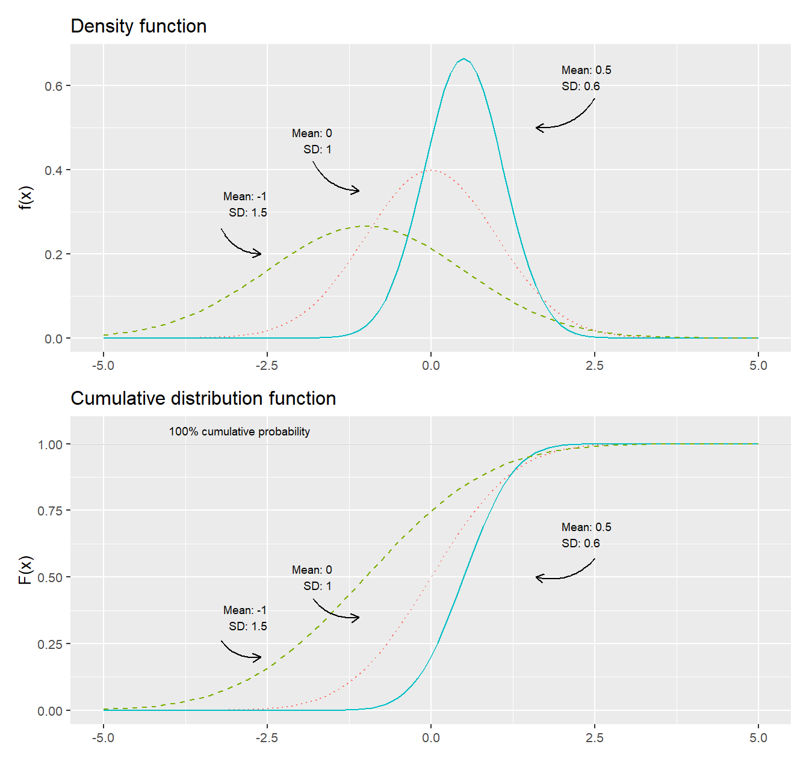
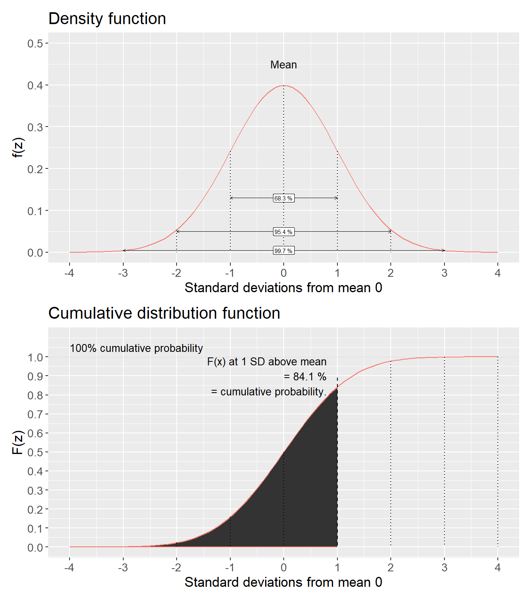
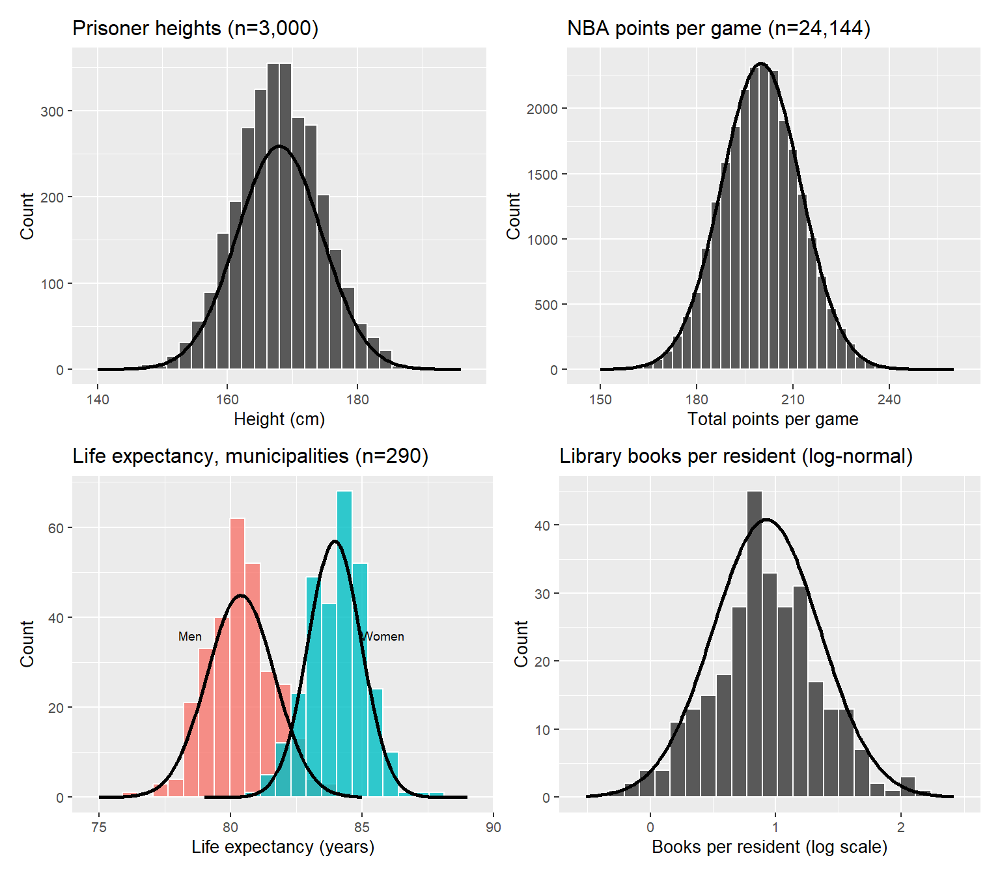
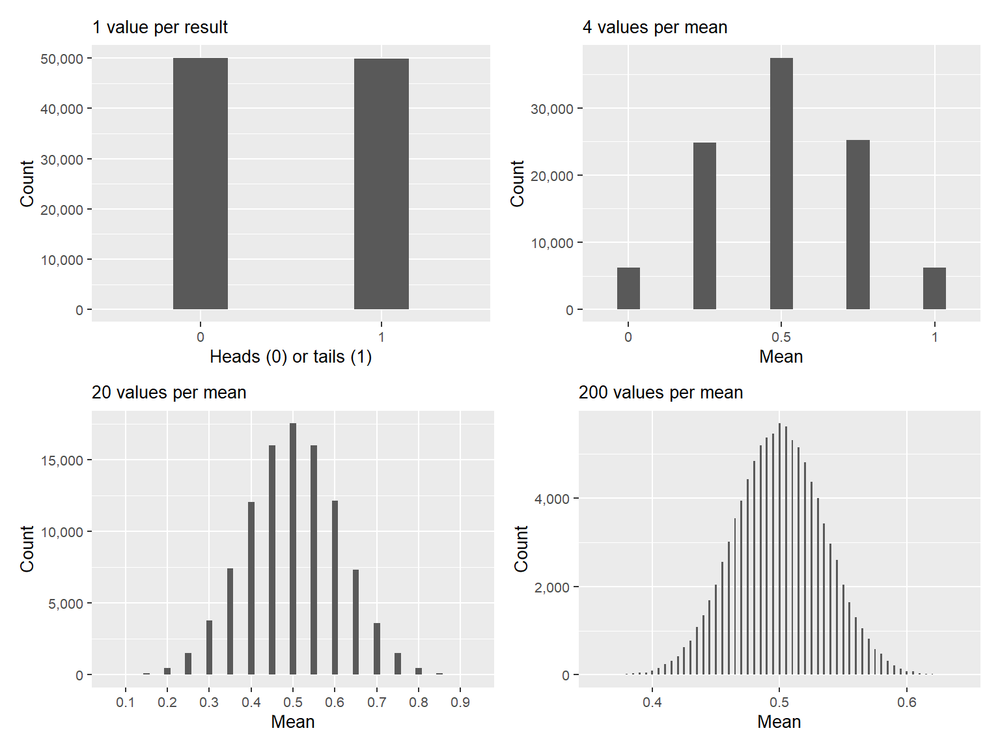
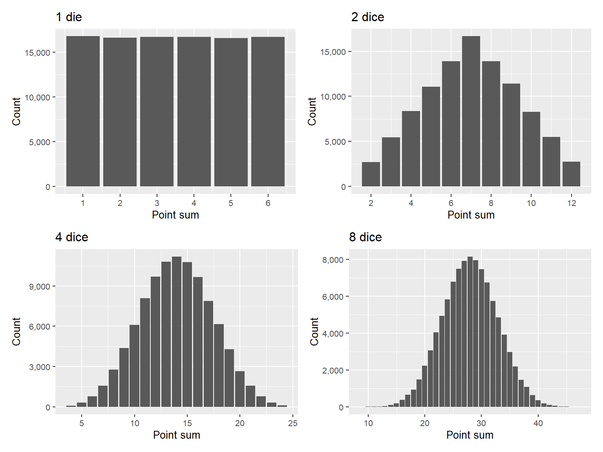
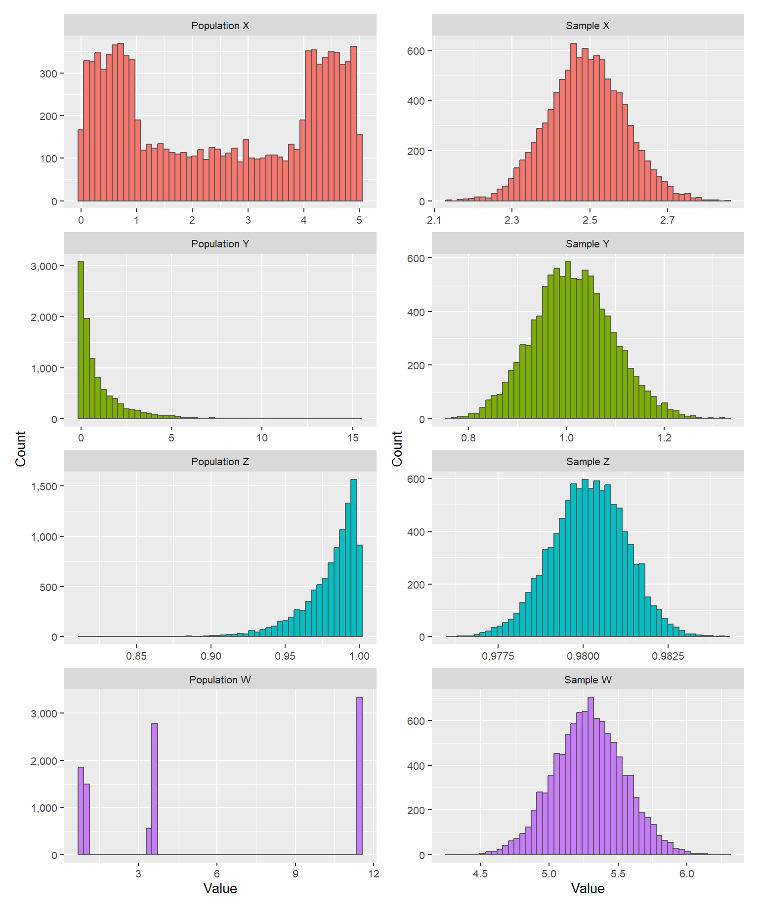
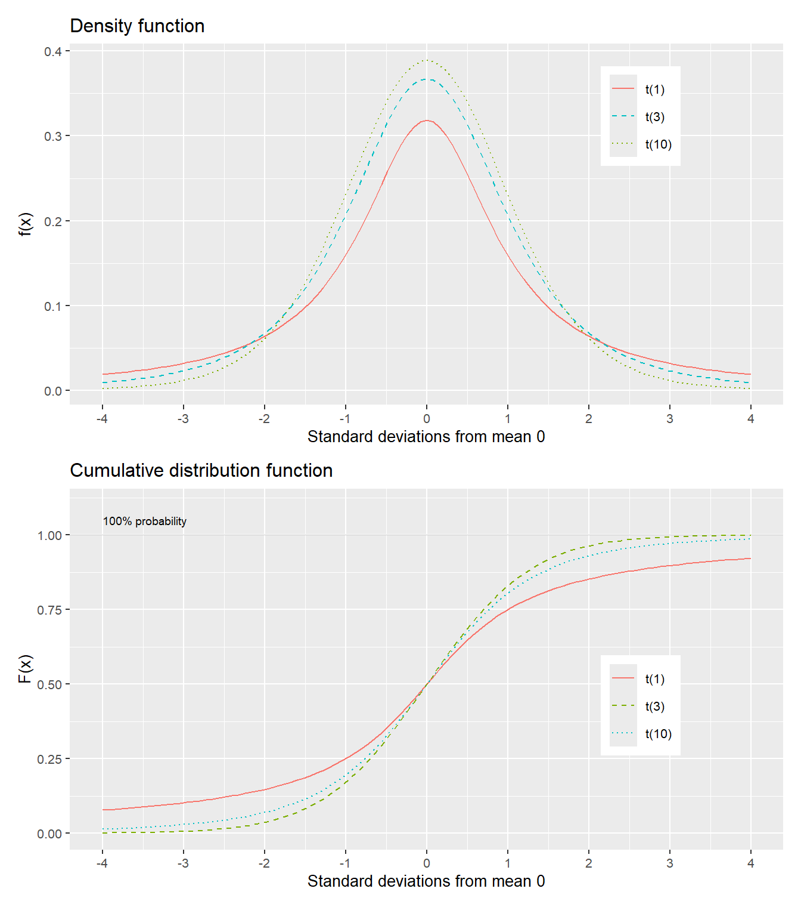
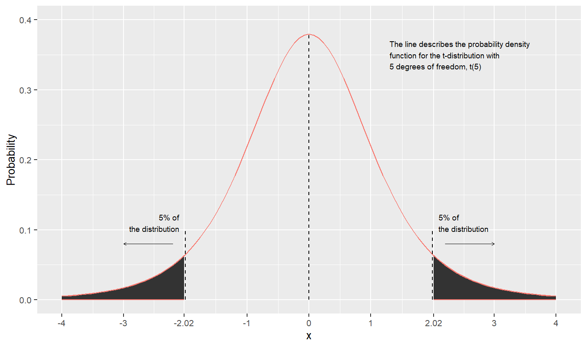

# Normal and t distributions {#ch-probability-normal-t}

This chapter introduces normal and t-distributions, which are central to a large amount of research and analytical work.

## Probability with normal variables {#sec-normal-distribution}

The normal distribution is recognized by its symmetric bell-shaped illustration. It occurs from time to time in social debate and media. Similar to the chi-square and F-distribution, we will also in this case use pre-calculated probabilities and critical values, but before that we shall go through some of the mathematics behind it. If we have a random variable $X$ that follows a normal distribution, the probability density function $f$ of the normal distribution can be written:

\begin{equation}
f\left(x,\mu,\sigma\right)=\frac{e^{-\frac{\left(x-\mu\right)^{2}}{2\sigma^{2}}}}{\sigma\sqrt{2\pi}},\quad -\infty<x<\infty
(\#eq:pdf-normal)
\end{equation}

The density function $f$ is defined for all values $X=x$ between negative and positive infinity. The letter $\mu$(Greek letter lowercase mu) symbolizes expected value and mean for $X$, $e$ is Euler's number, approximately 2.718, and $\pi$ is the number pi, approximately 3.142. The symbol $\sigma$(Greek letter sigma) stands for standard deviation for variable $X$. The cumulative distribution function $F$ of the normal distribution is written:

\begin{equation}
F\left(x,\mu,\sigma\right)=P\left(X\leq x\right)=\frac{1}{\sigma\sqrt{2\pi}}\int_{-\infty}^{x}e^{-\frac{\left(t-\mu\right)^{2}}{2\sigma^{2}}}dt
(\#eq:cdf-normal)
\end{equation}

where we take the integral from negative infinity $-\infty$ to the value $x$. The normal distribution is a collective name for distributions with certain common characteristics but which can have different mean $\mu$ and standard deviation $\sigma$. That the random variable $X$ follows a normal distribution can be written $X\sim N\left(\mu,\sigma\right)$, where $\mu$ and $\sigma$ represent the current mean and standard deviation for $X$.

Figure \@ref(fig:normal-pdf-cdf) gives three different examples of normal distributions where the upper graph illustrates the probability density function of the normal distributions, $f\left(x\right)$, and the lower graph shows the cumulative distribution function, $F\left(x\right)$. The only difference between the three distributions is that they have different mean $\left(\mu\right)$ and standard deviation $\left(\sigma\right)$. In the upper graph where the density function is illustrated, all three curves are evenly distributed around their respective means. On both sides of the mean the lines go down, which means that the further from the mean we move, the more unusual the results become. In the tails below and above the mean the probabilities are relatively smaller. A normal distribution with larger variance has thicker tails to the right and left of the mean. In the lower graph the three corresponding cumulative probability functions are illustrated.

<div class="figure" style="text-align: left">

<p class="caption">(\#fig:normal-pdf-cdf)The normal distribution: density function $f(x)$ and the cumulative distribution function $F(x)$</p>
</div>

## Standardized normal distribution {#sec-standard-normal}

A normal distribution which have mean $\mu=0$ and standard deviation $\sigma=1$ is called the standardized normal distribution or Z distribution. If we put $\mu=0$ and $\sigma=1$ into the density function in equation \@ref(eq:pdf-normal) we get:

\begin{equation}
f_{X}\left(x,\mu=0,\sigma=1\right)=\frac{e^{-\frac{1}{2}\left(\frac{x-0}{1}\right)^{2}}}{1\cdot\sqrt{2\pi}}=\frac{e^{-\frac{x^{2}}{2}}}{\sqrt{2\pi}}
(\#eq:pdf-standard-normal)
\end{equation}

The cumulative distribution for the standardized normal distribution is:

\begin{equation}
F_{X}\left(x,\mu=0,\sigma=1\right)=P\left(X\leq x\right)=\frac{1}{\sqrt{2\pi}}\int_{-\infty}^{x}e^{-\frac{t^{2}}{2}}dt
(\#eq:cdf-standard-normal)
\end{equation}

where we use $F\left(x\right)$ to calculate the probability that variable $X\leq x$, by calculating the integral from $-\infty$ up to and including the value $x$. The standard normal distribution is so common that its cumulative distribution function (equation \@ref(eq:cdf-standard-normal)) is written as $\Phi_{X}\left(x\right)=F_{X}\left(x,\mu=0,\sigma=1\right)$, where $\Phi$ is the Greek letter capital phi. If $X$ follows a standardized normal distribution we write $X\sim N\left(0,1\right)$.

We rarely encounter any real data that naturally follows a normal distribution with exactly mean 0 and standard deviation 1. In section \@ref(sec-standardiserade-varden) we went through instead how we standardize a collection of values so that these get exactly mean 0 and standard deviation 1:

\begin{equation}
Z_{i}=\frac{X_{i}-\bar{X}}{s_{X}}
(\#eq:z-score)
\end{equation}

where $s_{X}$ is estimated standard deviation for $X$. Standardized normal distributions are so commonly occurring that they are often described as variable $Z$ whose specific values are denoted $z$. This probability distribution has several known probability measures based on standard deviations, which are often used in statistical analysis. Figure \@ref(fig:standard-normal) illustrates this, where the upper graph describes the probability density function $f$ of the standard normal distribution and the lower graph describes the cumulative distribution function $F$.

In the upper graph some of the standard deviations below and above the mean 0 are marked. The cumulative distribution function $F\left(Z\leq z\right)$ describes, as before, what proportion of all values in variable $Z$ are less than or equal to $z$. Since the standard normal distribution is also called the Z-distribution, this type of probabilities are often described as precisely Z-values.

<div class="figure" style="text-align: left">

<p class="caption">(\#fig:standard-normal)Standard normal distribution: density function $f(z)$ and cumulative distribution function $F(Z\leq z)$</p>
</div>

Table \@ref(tab:normal-table) reports pre-calculated probabilities for the standard normal distribution $Z\sim N\left(0,1\right)$. The table shows calculated results where the variable $Z$ is less than or equal to a value $z$, $F\left(z\right)=P\left(Z\leq z\right)$. Say for example that we want to know the probability that variable $Z$ is equal to or less than the mean plus one standard deviation, that is $Z\leq1$. We look at the row for $z=1$ and column 0. This row and column means that $z=1.0$. The value in the cell shows that $P\left(Z\leq1\right)=0.8413$. We also see this in figure \@ref(fig:standard-normal), where the lower graph illustrates how the shaded area up to one standard deviation above the mean corresponds to 84.1%.


Table: (\#tab:normal-table)Standardized normal distribution, $F(z) = P(Z \leq z)$

|    |    .00|    .01|    .02|    .03|    .04|    .05|    .06|    .07|    .08|    .09|
|:---|------:|------:|------:|------:|------:|------:|------:|------:|------:|------:|
|0.0 | 0.5000| 0.5040| 0.5080| 0.5120| 0.5160| 0.5199| 0.5239| 0.5279| 0.5319| 0.5359|
|0.1 | 0.5398| 0.5438| 0.5478| 0.5517| 0.5557| 0.5596| 0.5636| 0.5675| 0.5714| 0.5753|
|0.2 | 0.5793| 0.5832| 0.5871| 0.5910| 0.5948| 0.5987| 0.6026| 0.6064| 0.6103| 0.6141|
|0.3 | 0.6179| 0.6217| 0.6255| 0.6293| 0.6331| 0.6368| 0.6406| 0.6443| 0.6480| 0.6517|
|0.4 | 0.6554| 0.6591| 0.6628| 0.6664| 0.6700| 0.6736| 0.6772| 0.6808| 0.6844| 0.6879|
|0.5 | 0.6915| 0.6950| 0.6985| 0.7019| 0.7054| 0.7088| 0.7123| 0.7157| 0.7190| 0.7224|
|0.6 | 0.7257| 0.7291| 0.7324| 0.7357| 0.7389| 0.7422| 0.7454| 0.7486| 0.7517| 0.7549|
|0.7 | 0.7580| 0.7611| 0.7642| 0.7673| 0.7704| 0.7734| 0.7764| 0.7794| 0.7823| 0.7852|
|0.8 | 0.7881| 0.7910| 0.7939| 0.7967| 0.7995| 0.8023| 0.8051| 0.8078| 0.8106| 0.8133|
|0.9 | 0.8159| 0.8186| 0.8212| 0.8238| 0.8264| 0.8289| 0.8315| 0.8340| 0.8365| 0.8389|
|1.0 | 0.8413| 0.8438| 0.8461| 0.8485| 0.8508| 0.8531| 0.8554| 0.8577| 0.8599| 0.8621|
|1.1 | 0.8643| 0.8665| 0.8686| 0.8708| 0.8729| 0.8749| 0.8770| 0.8790| 0.8810| 0.8830|
|1.2 | 0.8849| 0.8869| 0.8888| 0.8907| 0.8925| 0.8944| 0.8962| 0.8980| 0.8997| 0.9015|
|1.3 | 0.9032| 0.9049| 0.9066| 0.9082| 0.9099| 0.9115| 0.9131| 0.9147| 0.9162| 0.9177|
|1.4 | 0.9192| 0.9207| 0.9222| 0.9236| 0.9251| 0.9265| 0.9279| 0.9292| 0.9306| 0.9319|
|1.5 | 0.9332| 0.9345| 0.9357| 0.9370| 0.9382| 0.9394| 0.9406| 0.9418| 0.9429| 0.9441|
|1.6 | 0.9452| 0.9463| 0.9474| 0.9484| 0.9495| 0.9505| 0.9515| 0.9525| 0.9535| 0.9545|
|1.7 | 0.9554| 0.9564| 0.9573| 0.9582| 0.9591| 0.9599| 0.9608| 0.9616| 0.9625| 0.9633|
|1.8 | 0.9641| 0.9649| 0.9656| 0.9664| 0.9671| 0.9678| 0.9686| 0.9693| 0.9699| 0.9706|
|1.9 | 0.9713| 0.9719| 0.9726| 0.9732| 0.9738| 0.9744| 0.9750| 0.9756| 0.9761| 0.9767|
|2.0 | 0.9772| 0.9778| 0.9783| 0.9788| 0.9793| 0.9798| 0.9803| 0.9808| 0.9812| 0.9817|
|2.1 | 0.9821| 0.9826| 0.9830| 0.9834| 0.9838| 0.9842| 0.9846| 0.9850| 0.9854| 0.9857|
|2.2 | 0.9861| 0.9864| 0.9868| 0.9871| 0.9875| 0.9878| 0.9881| 0.9884| 0.9887| 0.9890|
|2.3 | 0.9893| 0.9896| 0.9898| 0.9901| 0.9904| 0.9906| 0.9909| 0.9911| 0.9913| 0.9916|
|2.4 | 0.9918| 0.9920| 0.9922| 0.9925| 0.9927| 0.9929| 0.9931| 0.9932| 0.9934| 0.9936|
|2.5 | 0.9938| 0.9940| 0.9941| 0.9943| 0.9945| 0.9946| 0.9948| 0.9949| 0.9951| 0.9952|
|2.6 | 0.9953| 0.9955| 0.9956| 0.9957| 0.9959| 0.9960| 0.9961| 0.9962| 0.9963| 0.9964|
|2.7 | 0.9965| 0.9966| 0.9967| 0.9968| 0.9969| 0.9970| 0.9971| 0.9972| 0.9973| 0.9974|
|2.8 | 0.9974| 0.9975| 0.9976| 0.9977| 0.9977| 0.9978| 0.9979| 0.9979| 0.9980| 0.9981|
|2.9 | 0.9981| 0.9982| 0.9982| 0.9983| 0.9984| 0.9984| 0.9985| 0.9985| 0.9986| 0.9986|
|3.0 | 0.9987| 0.9987| 0.9987| 0.9988| 0.9988| 0.9989| 0.9989| 0.9989| 0.9990| 0.9990|

The normal distribution is symmetric and has equally large outcome space below and above the mean, which means that $F\left(0\right)=P\left(X\leq0\right)=0.5$. That is, 50% of all possible values exist below and above the mean $\mu=0$ respectively. This means that $F\left(-x\right)=1-F\left(x\right)$. For example:

$$F\left(-1\right)=1-F\left(1\right)=1-0.8413=0.1587$$

From the table we see that:

$$F\left(2\right)=P\left(X\leq2\right)=0.97725$$

This also means that:

$$F\left(-2\right)=1-0.9772=0.02275$$

which illustrates how the area beyond two standard deviations below and above the mean respectively represents approximately 4.55% of the distribution (upper graph in figure \@ref(fig:standard-normal)).

We have in various examples compared average expected life expectancy for men and women. Say now that life expectancy for men and life expectancy for women respectively represent two populations and that both of these are approximately normally distributed (see section \@ref(sec-normal-usefulness-2) below). Now we want to know if the two populations' means differ, that is if $\mu_{\text{women}}=\mu_{\text{men}}$. To estimate the probability of this we use the standard normal distribution and the following statistic:

\begin{equation}
z=\frac{\bar{X}_{\text{women}}-\bar{X}_{\text{men}}}{\left(\frac{s_{\text{women}}^{2}}{n_{\text{women}}}+\frac{s_{\text{men}}^{2}}{n_{\text{men}}}\right)^{1/2}}
(\#eq:z-test-two-means)
\end{equation}

We calculate the z-value with the observations that we used earlier:

$$z\approx\frac{83.95-80.38}{\left(\frac{1.032}{290}+\frac{1.663}{290}\right)^{1/2}}\approx37.0$$

This z-value can be compared against the pre-calculated values for the standard normal distribution's cumulative distribution function $F\left(Z\leq z\right)$ in table \@ref(tab:normal-table). Our calculated z-value deviates so much from the mean 0 that it is not reported in the table, which only extends to $z=3.09$, where $F\left(3.09\right)=0.999$. In this case our z-value is so far from the mean that $F\left(z\right)$ becomes even closer to 0 than the values included in the table. Our z-value thus ends up far out in the standard normal distribution's tail to the right of (above) the mean, which indicates that it is very unlikely that the two populations (men's and women's life expectancy) have the same mean.

## The usefulness of the normal distribution 1 {#sec-normal-usefulness-1}

One reason why the normal distribution is so well-known is that many phenomena in reality are distributed approximately like a normal distribution. Figure \@ref(fig:normal-examples) illustrates some examples. In the upper left graph the distribution of height among 3,000 randomly selected prisoners is shown, produced by Scotland Yard and reproduced by Macdonell (1902). This distribution was noted among other things in two famous articles by William Sealy Gosett, under the pseudonym Student (1908a; 1908b).

The solid normal distribution curve uses the same mean and standard deviation as the observations. As can be seen, the distribution of the prisoners' height is close to the normal distribution curve, but not exactly the same. The 3,000 observations for the prisoners are after all discrete values while the normal distribution curve is a continuous variable. Human height, like several other physical measurements, is known to often be approximately normally distributed.

The upper right graph shows total points per game in the North American basketball league National Basketball Association (NBA), for all games from season 1999/2000 to 2018/2019, totaling 24,144 games. These data also follow the normal distribution curve relatively well. The distribution has a small tail to the right that we ignore here, but which arises because Chicago Bulls played against Atlanta Hawks on March 1, 2019, a game that after four overtimes ended with 168-161 after Trae Young scored 49 points. This was the third highest-scoring game in NBA history.

The lower left graph shows 580 observations from Sweden's 290 municipalities on average expected life expectancy for women and men. One observation is a municipality and small municipalities weigh as heavily as large municipalities in the graph. These two distributions also resemble quite well two normal distribution curves.

The lower right graph also shows data from Sweden's municipalities, regarding number of books per municipal resident in municipal public libraries. Number of books is shown on a logarithmic scale, whereupon the observations follow a normal distribution curve relatively well. This is called the variable following the log-normal distribution, which is a logarithmic variant of the normal distribution where the variable's values are in logarithmic form.

<div class="figure" style="text-align: left">

<p class="caption">(\#fig:normal-examples)Examples from reality of normally distributed phenomena</p>
</div>

## The usefulness of the normal distribution 2 {#sec-normal-usefulness-2}

Now we shall again look at how probabilities are distributed using random values. We ask the computer to randomly choose 100,000 values, where each value is either 0 or 1. Each time the computer chooses a value both values have the same probability of being chosen: 50%. Just as expected the results are distributed approximately 50% on each of 0 and 1.

Next we let the computer choose 4 values at a time, 0 or 1, and each time with 50% probability each. For the 4 randomly chosen values the computer calculates a mean and then repeats this until we have 100,000 new means. With four random values we have the following five possible results: $\left\{0,0,0,0\right\}$, $\left\{0,0,0,1\right\}$, $\left\{0,0,1,1\right\}$, $\left\{0,1,1,1\right\}$ and $\left\{1,1,1,1\right\}$, which gives the following possible means: 0, 0.25, 0.5, 0.75 and 1.

The more values we add, the more the distribution of these values begins to resemble a normal distribution. The mean is consistently 0.5, which is because the values that are chosen, and thus the calculated means, are consistently 0 or 1. Figure \@ref(fig:clt-coins) illustrates this with n = 1, 4, 20 and 200.

<div class="figure" style="text-align: left">

<p class="caption">(\#fig:clt-coins)Random values: 100,000 means per graph</p>
</div>

If we flip a coin and want to know the probability of getting a certain number of outcomes, for example $x$ number of tails on $n$ number of attempts, we use the binomial distribution (see section \@ref(sec-binomial-distribution)). The simulation we let the computer do above is precisely this function with ever higher value for n. As n becomes larger the binomial distribution approaches an approximate normal distribution. We call this an approximation since the binomial distribution by definition is a discrete probability distribution while the normal distribution is continuous. Mathematically this can be described as given that $np$ and $n\left(1-p\right)$ are both large numbers, the following applies:

\begin{equation}
b\left(n,p\right)\approx N\left(np,\,np\left(1-p\right)\right)
(\#eq:binom-normal-approx)
\end{equation}

The same phenomenon applies to many other probability distributions — given certain conditions, many different probability distributions approach the normal distribution. Another example can be illustrated by simulating perfectly balanced dice, which means we let the computer choose among the integers 1 to 6 randomly where each integer has the same probability: $\frac{1}{6}$.

In figure \@ref(fig:clt-dices) we start with one die and let the computer generate 100,000 values (upper left graph). The bars are almost equally large, which illustrates that each integer has been chosen approximately equally many times. In the next step we let the computer choose two values and sum them (upper right). The lower left graph shows the distribution of point sums with four dice. The lower right graph shows eight dice. The more randomly chosen values that are included in a point sum, the more the distribution of the results begins to resemble a normal distribution.

<div class="figure" style="text-align: left">

<p class="caption">(\#fig:clt-dices)Random results: 100,000 sums of points per graph</p>
</div>

The dice results can also be described as becoming increasingly approximately normally distributed. The Poisson distribution (see section \@ref(sec-poisson-distribution)) can also approach an approximation of the normal distribution if $\lambda$ becomes sufficiently large:

$$Pois\left(\lambda\right)\approx N\left(\lambda,\lambda\right)$$

In section \@ref(sec-gamma-distribution) we introduced the continuous gamma distribution, whose density function is:

$$f\left(x;k,\theta\right)=\frac{x^{k-1}e^{-x/\theta}}{\Gamma\left(k\right)\theta^{k}}$$

where $k$ is the number of the event we shall calculate the probability for and $\theta$ is the average waiting time for such an event: $\theta=1/\lambda$. The gamma distribution approaches an approximation of the normal distribution for large values of $k$:

$$\Gamma\left(k\right)\approx N\left(\frac{k}{\lambda},\frac{k}{\lambda^{2}}\right)$$

The chi-square distribution was introduced in section \@ref(sec-chi-squared-distribution) and can be described as a gamma distribution with $\theta=2$ and $k=r/2$ where $r$ is a positive integer. A variable $X$ that follows a chi-square distribution, $X\sim\chi^{2}\left(r\right)$, approaches an approximate normal distribution for large values of $r$:

$$\chi^{2}\left(r\right)\approx N\left(r,2r\right)$$

where the approximate normal distribution has mean $=r$ and standard deviation $2r$. We described above how a normal distribution that has mean 0 and standard deviation 1 is called the standardized normal distribution. If the variable $Z\sim N\left(0,1\right)$ it also applies approximately that:

$$Z^{2}\sim\chi^{2}\left(1\right)$$

Variable $Z$ squared thus follows the chi-square distribution with 1 degree of freedom.

## The usefulness of the normal distribution 3 {#sec-normal-usefulness-3-clt}

We have now gone through examples of how the normal distribution is common in real data as well as how other probability distributions resemble the normal distribution in different situations. In this section we shall look at how repeated samples from distributions that themselves are not normally distributed can lead to approximate normal distributions.

We first create four different types of distributions that we call X, Y, Z and W with 10,000 values each. These four made-up collections of values we regard as population data for each variable respectively. Now we shall let the computer take random samples from each of the four collections. The computer takes 300 observations at a time and calculates a mean of these observations. Then the computer repeats the sample again until we have calculated 10,000 means per population variable.

Figure \@ref(fig:clt-simulation) illustrates the results of this exercise in eight graphs. The graphs to the left show data over the four different populations X, Y, Z and W, which illustrates that the four populations have different dispersion. Despite the population looking very different in the graphs to the left, repeated samples lead to collections of values that resemble a normal distribution in the graphs to the right. The phenomenon arises when we retrieve sufficiently large amounts of samples from the populations.

<div class="figure" style="text-align: left">

<p class="caption">(\#fig:clt-simulation)Populations (left, 10,000 values each) and 10,000 means of random samples of 300 observations from those populations (right)</p>
</div>

This phenomenon is well-known within statistics and is described in what is called the **central limit theorem** (CLT), which is an important theorem within statistics and probability theory. The central limit theorem shows that if we take random samples from a large quantity of variables, the distribution of these samples' means will approach the normal distribution, even if the samples are retrieved from other types of distributions.

The central limit theorem can be described as: we have the random samples $X_{1},\:X_{2},\:...,X_{n}$ from a population with mean $\mu$ and standard deviation $\sigma$. The mean for the samples is $\bar{X}$. According to the law of large numbers (see section \@ref(sec-law-large-numbers)) the mean of the samples $X_{1},...,X_{n}$ will converge toward $\mu$ when the number of observations in the sample n becomes sufficiently many:

$$\lim_{n\rightarrow\infty}\frac{X_{1}+\cdots+X_{n}}{n}=\mu$$

When n becomes sufficiently large, the distribution of $\bar{X}_{n}$ will approach a normal distribution with mean $\mu$ and variance $\sigma^{2}/n$, where $\sigma^{2}$ is the population's variance. In addition, the central limit theorem means the following:

\begin{equation}
\lim_{n\rightarrow\infty}\sqrt{n}\left(\frac{\bar{X}_{n}-\mu}{\sigma}\right)=N\left(0,1\right)
(\#eq:clt)
\end{equation}

where $\sqrt{n}$ is the square root of number of means, $\bar{X}_{n}$ is n number of means from the random samples, $\mu$ is the population's mean and $\sigma$ is the population's standard deviation. This means that if we are to calculate probability for variables that are not actually normally distributed, we often still start from the normal distribution, as long as the size of the sample is sufficiently large. A common rule of thumb says that if the sample has more than 30 observations, $n>30$, then the central limit theorem applies.

## T-distribution {#sec-t-distribution}

Suppose we have a variable $X$ that follows the standardized normal distribution, $X\sim N\left(0,1\right)$, and a variable $Y$ that follows the chi-square distribution with $k$ degrees of freedom. $Y$ is independent from $X$. In that case we create the new variable $T$:

\begin{equation}
T=\frac{X}{\sqrt{Y}/\sqrt{k}}
(\#eq:t-definition)
\end{equation}

This variable follows a type of probability distribution that is called the t-distribution with $k$ number of degrees of freedom, where for our examples we assume that $k>0$. The t-distribution has variance:

\begin{equation}
var\left(T\right)=\frac{k}{k-2}
(\#eq:t-variance)
\end{equation}

A variable $X$ that follows the t-distribution can be described as $X\sim t\left(k\right)$ or $X\sim t_{k}$ for $k$ degrees of freedom. Like the other probability distributions covered above, the t-distribution has both a density function and a cumulative distribution function. Rather than examining these mathematical functions in detail, we will focus on the distribution's general properties and practical importance.

Figure \@ref(fig:t-distro) illustrates the t-distribution's density function $f\left(x\right)=P\left(X=x\right)$ in the upper graph and the cumulative distribution function $F\left(x\right)=P\left(X\leq x\right)$ in the lower graph. As can be seen, the t-distribution resembles the standardized normal distribution in shape. The degrees of freedom affect the density function's shape as well as what proportion of the distribution is under the cumulative distribution curve for a given value of $x$.

<div class="figure" style="text-align: left">

<p class="caption">(\#fig:t-distro)T-distribution: density function $f(x)$ and cumulative distribution function $F(x)$</p>
</div>

For a variable $X\sim t\left(k\right)$ higher values of $k$ mean that the tails become thicker, as in the upper graph in the figure. In the same way as the normal distribution, the t-distribution is also symmetric around the mean. This means that at the same time as we have $F\left(x\right)=P\left(X\leq x\right)$ we also have:

$$F\left(-x\right)=1-P\left(X\leq x\right)=P\left(X>x\right)$$

Table \@ref(tab:t-table) describes calculated critical values for the t-distribution based on degrees of freedom $k$ and percentage probability, where the percentages describe significance level. These are values from the cumulative distribution function $F\left(x\right)$, depending on number of degrees of freedom. The percentages, the significance level, refer to what proportion of the distribution is equal to or less than this t-value.


Table: (\#tab:t-table)T-distribution: critical values per degree of freedom. One-tailed test

|    |   90%|   95%|  97.5%|    99%|  99.5%|   99.9%|
|:---|-----:|-----:|------:|------:|------:|-------:|
|1   | 3.078| 6.314| 12.706| 31.821| 63.657| 318.309|
|2   | 1.886| 2.920|  4.303|  6.965|  9.925|  22.327|
|3   | 1.638| 2.353|  3.182|  4.541|  5.841|  10.215|
|4   | 1.533| 2.132|  2.776|  3.747|  4.604|   7.173|
|5   | 1.476| 2.015|  2.571|  3.365|  4.032|   5.893|
|6   | 1.440| 1.943|  2.447|  3.143|  3.707|   5.208|
|7   | 1.415| 1.895|  2.365|  2.998|  3.499|   4.785|
|8   | 1.397| 1.860|  2.306|  2.896|  3.355|   4.501|
|9   | 1.383| 1.833|  2.262|  2.821|  3.250|   4.297|
|10  | 1.372| 1.812|  2.228|  2.764|  3.169|   4.144|
|11  | 1.363| 1.796|  2.201|  2.718|  3.106|   4.025|
|12  | 1.356| 1.782|  2.179|  2.681|  3.055|   3.930|
|13  | 1.350| 1.771|  2.160|  2.650|  3.012|   3.852|
|14  | 1.345| 1.761|  2.145|  2.624|  2.977|   3.787|
|15  | 1.341| 1.753|  2.131|  2.602|  2.947|   3.733|
|16  | 1.337| 1.746|  2.120|  2.583|  2.921|   3.686|
|17  | 1.333| 1.740|  2.110|  2.567|  2.898|   3.646|
|18  | 1.330| 1.734|  2.101|  2.552|  2.878|   3.610|
|19  | 1.328| 1.729|  2.093|  2.539|  2.861|   3.579|
|20  | 1.325| 1.725|  2.086|  2.528|  2.845|   3.552|
|21  | 1.323| 1.721|  2.080|  2.518|  2.831|   3.527|
|22  | 1.321| 1.717|  2.074|  2.508|  2.819|   3.505|
|23  | 1.319| 1.714|  2.069|  2.500|  2.807|   3.485|
|24  | 1.318| 1.711|  2.064|  2.492|  2.797|   3.467|
|25  | 1.316| 1.708|  2.060|  2.485|  2.787|   3.450|
|26  | 1.315| 1.706|  2.056|  2.479|  2.779|   3.435|
|27  | 1.314| 1.703|  2.052|  2.473|  2.771|   3.421|
|28  | 1.313| 1.701|  2.048|  2.467|  2.763|   3.408|
|29  | 1.311| 1.699|  2.045|  2.462|  2.756|   3.396|
|30  | 1.310| 1.697|  2.042|  2.457|  2.750|   3.385|
|40  | 1.303| 1.684|  2.021|  2.423|  2.704|   3.307|
|60  | 1.296| 1.671|  2.000|  2.390|  2.660|   3.232|
|120 | 1.289| 1.658|  1.980|  2.358|  2.617|   3.160|
|∞   | 1.282| 1.645|  1.960|  2.326|  2.576|   3.090|

If we have a variable $X\sim t\left(10\right)$ we look at the row where $k=10$. The columns with the percentages 90% to 99.9% show what proportion of the distribution's values are equal to or less than $F\left(x\right)$ where the value for x is what is shown in the table's cells. On the row for $k=10$ we see that 90% of the distribution is less than or equal to $x=1.37$.

If we turn it around and think that for the variable $X\sim t\left(10\right)$ we want to know what proportion of the distribution is less than or equal to 2 standard deviations above the mean. We then have $F\left(x=2\right)=P\left(X\leq2\right)$ and look at row $k=10$. Since we have $x=1.81$ for 95% and $x=2.23$ for 97.5%, this means that between 95 and 97.5% of the distribution is equal to or less than $F\left(x=2\right)$. This is illustrated in figure \@ref(fig:t-two-sided) where the gray area to the left of the mean represents an equally large proportion of the distribution as the gray area to the right of the mean, which means that $F\left(x\right)=F\left(-x\right)$.

<div class="figure" style="text-align: left">

<p class="caption">(\#fig:t-two-sided)T-distribution: density function with shaded significance level</p>
</div>

Above we went through how different probability distributions approach approximate normal distributions in different situations. The same thing also applies to the t-distribution. For a t-distribution $t\left(k\right)$ it applies that for large values of $k$:

$$t\left(k\right)\approx N\left(0,1\right)$$

With many degrees of freedom, high values for $k$, the t-distribution approaches the standardized normal distribution. A t-distribution with k degrees of freedom where $k>0$ has mean 0, the same as the standardized normal distribution. As described above, the t-distribution has variance $var\left(t\right)=k/\left(k-2\right)$. This means that when $k\rightarrow\infty$ then it follows that $var\left(t\right)\rightarrow1$ which makes the t-distribution approach the standardized normal distribution, $N\left(0,1\right)$.

The last row in table \@ref(tab:t-table) shows the critical t-values for $k=\infty$, which can be compared against the standardized normal distribution's pre-calculated probabilities. Example: for $k=\infty$, $t=3.09$ means that $P\left(X\leq x\right)=99.9\%$. If we look in table \@ref(tab:normal-table) at the bottom in the right corner, row for $x=3$ and column .09, we see that for this value of $x$ the standardized normal distribution's $F\left(x\right)=P\left(X\leq x\right)=0.999$, that is 99.9%.

## Chapter summary

- **The normal distribution**: written $N\left(\mu,\sigma\right)$ where $\mu$ is mean and $\sigma$ is standard deviation. Density function: $f\left(x;\mu,\sigma\right)=e^{-\left(x-\mu\right)^{2}/(2\sigma^{2})}/\left(\sigma\sqrt{2\pi}\right)$ for $-\infty<x<\infty$. Cumulative distribution function: $F\left(x;\mu,\sigma\right)=\frac{1}{\sigma\sqrt{2\pi}}\int_{-\infty}^{x}e^{-\left(t-\mu\right)^{2}/(2\sigma^{2})}dt$.

- Since the normal distribution is symmetric we have $F\left(-x\right)=1-F\left(x\right)$. For $F\left(x=\mu\right)=P\left(X\leq\mu\right)=0.5$, with 50% of the distribution above and below the mean $\mu$ respectively.

- **The standardized normal distribution** has $\mu=0$ and $\sigma=1$ and is written $N\left(0,1\right)$. Density function: $f\left(x\right)=e^{-x^{2}/2}/\sqrt{2\pi}$. Also called the standard normal distribution or the Z-distribution.

- Many real data within both natural and social sciences follow the normal distribution. Many other probability distributions approach the normal distribution approximately in different situations. Example: the binomial distribution approaches the normal distribution approximately when $np$ and $n\left(1-p\right)$ are large numbers: $b\left(n,p\right)\approx N\left(np,np\left(1-p\right)\right)$.

- **The central limit theorem (CLT)**: if we take random samples from a variable that follows another probability distribution, the mean of the samples will approach the normal distribution approximately when the number of samples becomes sufficiently large. The mean will according to the law of large numbers approach $\mu$ as $n\to\infty$, while the CLT describes how the dispersion around the mean will approach a normal distribution as the number of samples n approaches infinity.

- **The t-distribution**: if $X\sim N\left(0,1\right)$ and $Y\sim\chi^{2}\left(k\right)$ the variable $T=X/\left(\sqrt{Y}/\sqrt{k}\right)$ follows the t-distribution, written $T\sim t\left(k\right)$ for $k$ degrees of freedom. When $k$ becomes sufficiently large $t\left(k\right)\approx N\left(0,1\right)$. The t-distribution is symmetric: $F\left(x=0\right)=0.5$ and $F\left(-x\right)=1-F\left(x\right)$.

## Exercises

```{=html}
<div id="ex-23"></div>
<script>
(function(){
var ex = [
  {
    q: 'The standard normal distribution is written $Z\\sim N(0,1)$.<br>(a) What are $E(Z)$ and $\\text{Var}(Z)$?<br>(b) By symmetry, what is $P(Z\\leq 0)$?<br>(c) If $P(Z\\leq 1.96)=0.975$, what is $P(Z\\geq 1.96)$?',
    a: '(a) $E(Z)=0$, $\\text{Var}(Z)=1$.<br>(b) $P(Z\\leq 0)=0.5$.<br>(c) $P(Z\\geq 1.96)=1-0.975=0.025$.'
  },
  {
    q: 'Let $X\\sim N(50,100)$ (mean 50, variance 100, so $\\sigma=10$). Compute the z-score $z=(x-\\mu)/\\sigma$ for each value.<br>(a) $x=70$<br>(b) $x=40$<br>(c) $x=50$',
    a: '(a) $z=(70-50)/10=2$.<br>(b) $z=(40-50)/10=-1$.<br>(c) $z=(50-50)/10=0$.'
  },
  {
    q: 'Suppose $P(Z\\leq 1.64)=0.95$. Use symmetry of the standard normal to answer the following.<br>(a) What is $P(Z\\geq 1.64)$?<br>(b) What is $P(-1.64\\leq Z\\leq 1.64)$?<br>(c) What is $P(Z\\leq -1.64)$?',
    a: '(a) $P(Z\\geq 1.64)=1-0.95=0.05$.<br>(b) $P(-1.64\\leq Z\\leq 1.64)=0.95-0.05=0.90$.<br>(c) $P(Z\\leq -1.64)=0.05$ by symmetry.'
  },
  {
    q: 'Let $X\\sim N(100,25)$ (mean 100, $\\sigma=5$).<br>(a) Convert $x=110$ to a z-score.<br>(b) Convert $x=90$ to a z-score.<br>(c) Given $P(Z\\leq 2)=0.977$, what is $P(X\\leq 110)$?',
    a: '(a) $z=(110-100)/5=2$.<br>(b) $z=(90-100)/5=-2$.<br>(c) $P(X\\leq 110)=P(Z\\leq 2)=0.977$.'
  },
  {
    q: 'According to the central limit theorem (CLT), the sample mean $\\bar{X}$ is drawn from a population with mean $\\mu=50$ and variance $\\sigma^2=100$, based on $n=100$ observations.<br>(a) What is $E(\\bar{X})$?<br>(b) What is $\\text{Var}(\\bar{X})$?<br>(c) What distribution does $\\bar{X}$ approximately follow for large $n$?',
    a: '(a) $E(\\bar{X})=\\mu=50$.<br>(b) $\\text{Var}(\\bar{X})=\\sigma^2/n=100/100=1$.<br>(c) $\\bar{X}$ approximately follows $N(50,1)$ by the CLT.'
  },
  {
    q: 'A population has mean $\\mu=200$ and standard deviation $\\sigma=20$. A sample of $n=400$ is drawn.<br>(a) What is the standard error $\\text{SE}(\\bar{X})=\\sigma/\\sqrt{n}$?<br>(b) Compute the z-score for $\\bar{X}=201$.<br>(c) Is $n=400$ large enough to apply the CLT? Why?',
    a: '(a) $\\text{SE}=20/\\sqrt{400}=20/20=1$.<br>(b) $z=(201-200)/1=1$.<br>(c) Yes, $n=400\\gg 30$, which is the common rule of thumb for the CLT to apply.'
  },
  {
    q: 'Let $X\\sim \\text{Bin}(100,0.5)$.<br>(a) Compute $E(X)$ and $\\text{Var}(X)$.<br>(b) Which normal distribution approximates $X$ for large $n$?<br>(c) Using $P(Z\\geq 1)\\approx 0.159$, approximate $P(X\\geq 55)$.',
    a: '(a) $E(X)=np=50$, $\\text{Var}(X)=np(1-p)=25$.<br>(b) $N(50,25)$, i.e. $N(\\mu=50,\\sigma^2=25)$.<br>(c) $z=(55-50)/5=1$, so $P(X\\geq 55)\\approx P(Z\\geq 1)\\approx 0.159$.'
  },
  {
    q: 'Heights are normally distributed with mean 175 cm and standard deviation 8 cm, i.e. $X\\sim N(175,64)$.<br>(a) Compute the z-score for $x=183$.<br>(b) Compute the z-score for $x=167$.<br>(c) Given $P(-1\\leq Z\\leq 1)\\approx 0.683$, find $P(167\\leq X\\leq 183)$.',
    a: '(a) $z=(183-175)/8=1$.<br>(b) $z=(167-175)/8=-1$.<br>(c) $P(167\\leq X\\leq 183)=P(-1\\leq Z\\leq 1)\\approx 0.683$.'
  },
  {
    q: 'The t-distribution $T\\sim t(k)$ has $k$ degrees of freedom.<br>(a) What are $E(T)$ and the symmetry property of $t(k)$?<br>(b) Compared to $N(0,1)$, does $t(k)$ have heavier or lighter tails?<br>(c) As $k\\to\\infty$, what does $t(k)$ converge to?',
    a: '(a) $E(T)=0$. By symmetry: $F(-x)=1-F(x)$ and $F(0)=0.5$.<br>(b) Heavier tails — the t-distribution has more probability mass in the tails than the standard normal.<br>(c) $t(k)\\to N(0,1)$ as $k\\to\\infty$.'
  },
  {
    q: 'Let $T\\sim t(10)$.<br>(a) By symmetry, what is $P(T\\leq 0)$?<br>(b) If $P(T\\leq 2.228)=0.975$, what is $P(T\\geq 2.228)$?<br>(c) Is the critical value 2.228 larger or smaller than 1.96 (the 97.5th percentile of $N(0,1)$)? What does this tell us?',
    a: '(a) $P(T\\leq 0)=0.5$ by symmetry.<br>(b) $P(T\\geq 2.228)=1-0.975=0.025$.<br>(c) 2.228 > 1.96, which tells us that the t-distribution has heavier tails than the standard normal — we need to go further out to capture the same 97.5% of the distribution.'
  },
  {
    q: 'When should you use the t-distribution rather than the standard normal for inference about a mean?<br>(a) Population variance $\\sigma^2$ is unknown, $n=25$: use $t$ or $z$?<br>(b) Population variance $\\sigma^2$ is known, $n=200$: use $t$ or $z$?<br>(c) Population variance $\\sigma^2$ is unknown, $n=1000$: use $t$ or $z$? Explain.',
    a: '(a) Use $t$ — small sample, unknown variance.<br>(b) Use $z$ — variance is known, regardless of sample size.<br>(c) Either works: with $n=1000$, $t(999)\\approx N(0,1)$, so both give virtually the same result. Strictly, $t$ is correct when variance is estimated, but $z$ is a fine approximation.'
  },
  {
    q: 'A sample of $n=100$ gives $\\bar{X}=48$. The population standard deviation is known: $\\sigma=10$.<br>(a) Compute the standard error $\\text{SE}=\\sigma/\\sqrt{n}$.<br>(b) Construct a 95% confidence interval using $\\bar{X}\\pm 1.96\\cdot\\text{SE}$.<br>(c) How would the confidence interval change if $n$ increased to 400?',
    a: '(a) $\\text{SE}=10/\\sqrt{100}=1$.<br>(b) $48\\pm 1.96\\cdot 1=[46.04,\\; 49.96]$.<br>(c) $\\text{SE}=10/\\sqrt{400}=0.5$, so the interval narrows to $48\\pm 0.98=[47.02,\\; 48.98]$. Larger samples give more precise estimates.'
  }
];

var container = document.getElementById('ex-23');
ex.forEach(function(e, i) {
  var d = document.createElement('div');
  d.style.marginBottom = '1em';
  d.innerHTML = '<strong>Exercise ' + (i+1) + '.</strong> ' + e.q +
    '<details style="margin-top:0.4em"><summary style="cursor:pointer;color:#2c5f8a">Show answer</summary>' +
    '<div style="padding:0.5em 0.5em 0.2em">' + e.a + '</div></details>';
  container.appendChild(d);
});
})();
</script>
```
