# R {#ch-r}

This chapter introduces the analysis tool R. R is the name of a programming language and the name of a computer program in which we can use the programming language R. There are several other programs that also have support for the programming language R. One such program is RStudio, which we use in the examples in this chapter. To be able to use R it is recommended that you install two software programs on your computer: R and the development environment RStudio. Both are open source software and can be downloaded for free at the following links:

- R: <https://cran.r-project.org/>
- RStudio: <www.rstudio.com/products/rstudio/#Desktop>

## General Overview of R {#sec-r-overview}

Figure \@ref(fig:r-window) shows the R program. This program needs to be installed on your hard drive for you to be able to use R in RStudio, but we never need to open the R program. We can instead work in RStudio. Figure \@ref(fig:rstudio-window) shows how RStudio generally looks when you open it for the first time. In the bottom left you see the console. In the top right the Global Environment is displayed. In the bottom right help sections and charts are shown, among other things.

In the top left of RStudio you see the script window (Script). If you don't see it, you can open a new script window by pressing Ctrl + Shift + N (Windows) or Cmd + Shift + N (Mac). You can also open the script window by choosing in the menu `File > New File... > R Script`.

We can control RStudio through the menus or through written instructions, that is writing R code. In RStudio you can enter commands ("code") in the console. If you place the cursor in the console and write `1 + 2` and press Enter, the result is output directly, that is the number 3. Neither the command nor the result is saved in the program's memory.

We can also write R code in the script window in the top left. To run a command in your script you can place the text cursor at the command, on the same line, and press `Ctrl` + `Enter` (Windows) or `Cmd` + `Enter` (Mac). You can for example try writing `1 + 2` on a line and running this. The result is output in the console. But unlike when we write commands in the console, the command remains in the script when we have run the command. We can also select exactly the code we want to run and send this to the program with the same commands. If we want to run the entire script and *all* commands found in the script, we instead press `Ctrl` + `Shift` + `Enter` (Windows) or `Cmd` + `Shift` + `Enter` (Mac). We can also use the "Run" button that you find in the script window's upper right corner.

To write comments in R scripts, which are ignored by the program, we can use the hash symbol `#`. For example like this:

```r
# Lines that begin with hash symbol are comments.
# Next line is a mathematical calculation.
1+2
```

If we write the above in an R script, select all these lines or place the cursor on the first line, and press Ctrl + Enter, this is run as a command in R. The first and second lines are ignored by the program and are only reported in the console as text without action. The third line is run as a calculation and the result is returned in the console.

The commands you write in a script can be saved as a regular text file on the computer. To save your script you press Ctrl + S (Windows) or Cmd + S (Mac). You can also choose menu `File > Save`. Your script is saved as a text file on the computer's hard drive with the file extension `.R`. If you have saved your script in an `.R` file on the computer's hard drive, you can, the next time you start RStudio, open the file and continue working with your code.

<div class="figure" style="text-align: center">
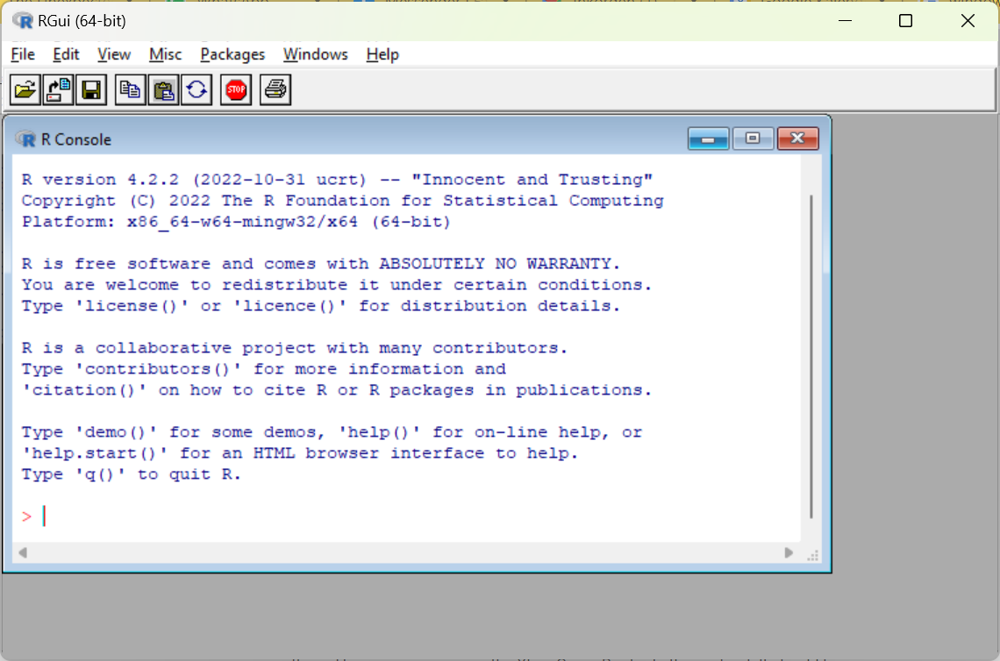
<p class="caption">(\#fig:r-window)The program R</p>
</div>

<div class="figure" style="text-align: center">
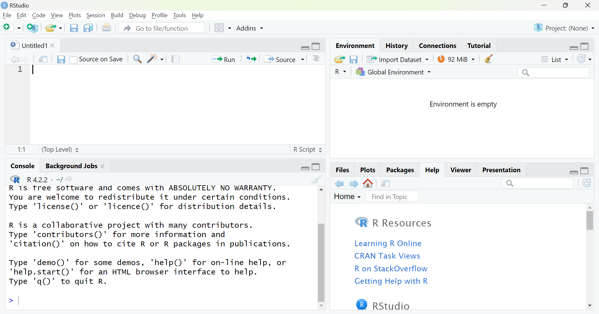
<p class="caption">(\#fig:rstudio-window)The program RStudio</p>
</div>

## R Objects {#sec-r-objects}

Even though we save a script with for example the code `1+2`, only this text is saved, not the result of the code, in this case the value 3. R "remembers" things by creating R objects. The program can have many objects saved simultaneously. An R object can contain many different types of information, like a number, a table or a list with several tables. This means that we can have access to many different types of information simultaneously among the objects in the program's memory. It also means that data in R can be organized in many different ways and some of these ways may at first glance seem a bit more abstract compared to for example Excel and Stata. We will here only go through a few examples of this.

To save some form of information as an R object we use the function `<-` and write the name we want to use for our new R object to the left of the arrow. To the right of the arrow we write the information that should be saved in the object. Here is an example where we save the number 3 in an object, which we name `my_r_object`. To run the below as code, write the text in an R script and press Ctrl + Enter:

```r
my_r_object <- 3
```

The keyboard shortcut for `<-` is Alt + –, which also inserts spaces before and after `<-`. If we prefer we can use the equals sign `=` instead of `<-`. For example:

```r
my_r_object = 3
```

When an object is saved in memory in R, the name of the object appears in the Global Environment, in the top right of RStudio. To see what an object contains we can write the name of the object in the console or in a script and run this object name as a command. For example:

```r
# Create an object
my_r_object <- 3
# Display the object's content
my_r_object
```

To indicate that something is text, a text string, we use quotation marks. For example:

```r
a <- "Hello world!"
```

When we write R scripts we can often use line breaks when we want, as long as the program understands from the code that the command is not finished. As an example we can write `a <-` and then use a line break, since the program will then continue searching for some type of information that should be saved in object `a`. The code simply cannot end after `<-` without some type of information.

All characters between quotation marks are treated as a text string, even numbers. We therefore cannot use text strings for mathematical calculations. Each object must have a unique name for this particular work session. If you use the same name when you create two different objects, the first object disappears and is replaced with the new object with the same name. The program reports no warning for this. You can use the same name on different objects in different scripts or work projects. Each R object has a class that describes the object. To check what class an object has we can for example use the functions `class()` or `str()`.

## Functions in R {#sec-r-functions}

R has many pre-installed functions that we can use for different types of operations. Functions in R are generally written with the name of the function followed by parentheses, for example `mean()`, `sum()`, `log()`. An R function can perform both simple and complex work tasks. In the parentheses for each function we have the possibility to specify different types of arguments and options. For example, we can specify as an argument in the parentheses for the function `sum()` the numbers we want to calculate the sum for: `sum(1,2,3)`. Some functions return results even when called entirely without values in their parentheses, but generally at least some type of input data is required.

We can use objects as arguments in functions, whereupon the information in the object is sent to the function. Results from functions can in turn generally be saved in objects. For example:

```r
number_1 <- 3
number_2 <- 4
number_3 <- 5
sum_of_numbers <- sum(number_1, number_2, number_3)
```

The R function `c()` can be used to send several values as a coherent argument. If we write `c(1,2,3)` the function returns these three numbers as a collection. To calculate the mean of the three numbers we can then write `mean(c(1,2,3))`.

All functions have specific names for the arguments that the function uses. Often the first argument in a function is called `x`. For the function `mean()`, `x` refers to the input values we want to calculate the mean for, that is: `mean(x=c(1,2,3))`. Or for example:

```r
three_numbers <- c(1,2,3)
mean(x=three_numbers)
```

Usually we can omit the name of the first argument and only write for example `mean(c(1,2,3))`. In each function's help section there is a description of the function's arguments and options. The help sections often contain practical examples and links to other useful functions. To read a help section we can write a question mark and the function's name, `?mean`, alternatively use the function `help()`, like `help(mean)`.

When starting a new R script or work project, it is good practice to clear the R objects saved in the global environment, to avoid accidentally using stale objects. To delete all previously saved objects in the global environment we can use the following command:

```r
rm(list=ls())
```

If we only want to delete a specific object from the environment we can use the function `rm()` and specify the name of the object in the parentheses, for example: `rm(a)` or `rm(my_r_object)`.

If we want we can enter line breaks in the parentheses for functions, which can sometimes make the text more readable. Here is an example where we create an object with a collection of text strings:

```r
names <-
c("Erik",
"Maria",
"Leif")
```

On the first line in the above example the program understands that the command is not finished because we must specify what information we want to save in object `names`. On lines 2 and 3 the program understands that the command is not finished since a closing parenthesis for the function `c()` is missing.

There are several ways that missing values can be written in R. A common way is `NA`, abbreviation for *not available*. Other common notations are `NaN` (Not a number), `NA_real` (missing value real number) and `NA_character` (missing value text string). Functions in R handle missing values differently but often we must specify in our code how we want each function to handle missing values. As an example, the following command will return a missing value, `NA`:

```r
mean( c(1,2,NA) )
```

That is, if we ask the function `mean()` to calculate the mean of a collection of values, of which one of these values is `NA`, then we will get back a missing value. Many times we want to calculate the mean of the numbers that are not missing, even if there are one or more missing values in a collection. In that case there is an option in the function `mean()` called `na.rm`. We can define this to `TRUE` or `FALSE`. The default setting for the function `mean()` is that `na.rm=FALSE`. If we instead define it to `na.rm=TRUE` the function calculates the mean of the values that are not `NA`. The following command therefore instead returns the value 1.5:

```r
mean(c(1,2,NA), na.rm=TRUE)
```

Table \@ref(tab:r-math-functions) describes a list of R functions for some common mathematical operations. See each function's help section for instructions regarding how these work as well as available options. The help sections can for example be accessed with the function `help()`, for example: `help(mean)` or with the command `?mean`.

| **R function** | **Description** |
|:---|:---|
| `log()` | Returns the logarithm. `log(x=c(1,2,3))` returns the logarithm of the three numbers 1, 2 and 3. |
| `sum()` | Summation of a collection of values. |
| `mean()` | Mean of a collection of values. |
| `weighted.mean()` | Weighted mean of a collection of values. |
| `median()` | Median of a collection of values. |
| `sqrt()` | Square root of one or more values. |
| `factorial()` | Returns the factorial of one or more positive integers. `factorial(3,2)` returns the results 6 and 2 as separate values. |
| `round()` | Round. `round(x,y)` rounds x to y number of decimals. |
| `min()` | Minimum value of a collection of values. |
| `max()` | Maximum value of a collection of values. |

Table: (\#tab:r-math-functions) Mathematical functions in R.

## R Packages {#sec-r-packages}

Users constantly develop new functions for R and upload these in the form of R packages on the internet. R packages contain one or more new functions. Many packages we can easily download and install in R using the function `install.packages()`. A particularly useful such package is `tidyverse`, which contains several other packages with many functions. To download and install the package we run the following code:

```r
install.packages("tidyverse")
```

When you run the above code, a longer download and installation starts and RStudio generally then shows different types of information and warnings. You don't need to do anything but let the program finish downloading. For this to work you need to have access to the internet and have the ability to save files on the computer's hard drive (administrator rights).

After you have installed a package it is saved on your computer. The next time you open R you don't need to run `install.packages()` again. But after each time we restart the R program we must activate the packages we have downloaded and installed, which we do with the function `library()`. This function thus activates packages that we have already installed. Often it can be practical to begin a script with for example:

```r
library("tidyverse")
```

To summarize, we generally need to run the command `install.packages()` only once. We need to run the command `library("tidyverse")` every time we restart R or RStudio if we want to use the functions in tidyverse.

Sometimes packages that we have installed are updated. To check and update an already installed package we can in RStudio click on the menu `Tools > Check For Package Updates...`.

In the tidyverse package there is the magrittr package and there is the special pipe function `%>%`. The pipe function sends the result of a command on the left forward to the next function on the right. The pipe function places the sent result as the first argument in the next function. In this way we can create an easily comprehensible chain of operations. Example:

```r
# The following two lines give the same result:
my_result <- sum( log( c(3,4,5) ) )
my_result <- c(3,4,5) %>% log() %>% sum()
```

The last line we can read as "take the numbers in `c()`" AND THEN "use the function `log()`" AND THEN "use the function `sum()`". The result is saved in the object `my_result`. The keyboard shortcut for `%>%` is Ctrl + Shift + M.

Now that we have written a few lines in our R script and hopefully also added some comments that explain what the code does, it is high time to save our script as a file on the hard drive. Press Ctrl + S or choose the menu `File > Save as...`. What is now saved is, as mentioned, only the actual text in our R script. The data that the script creates or edits, as well as the results that are created, are not saved with this command. We will return below to how we can export results of various kinds.

## Importing Data {#sec-r-import}

To register data in R we can, as mentioned, create objects and save information in these, as individual values or with the function `c()`. R can save and organize information in many different forms. As an example, the function `c()` creates collections. Tables are another, of several, forms that R can save information in. R can in turn save several different types of tables, each with their special properties. One of the standard formats for tables in R is `data.frame`. Another type of table is `tibble`, which is defined in the tibble package that is included in the tidyverse package, which we installed above. To create an object with a table of type tibble we can use the function `tibble()`. For example like this:

```r
# Create a table of type tibble with variables y, x and z.
my_data_table <- tibble(
    y = c(3,2,5,4),
    x = c(3,4,6,7),
    z = c(1,4,0,1))
```

To instead create a table of type `data.frame` we can use the same code as above but replace the word `tibble` with the expression `data.frame`. When we run many of the functions introduced here, these return precisely a table of type tibble. As described above, each R object has an object class, depending on what type of information is saved in the object. Tibble is a type of object class. To display the content of the object with the table we can use the name of the object as a command:

```r
my_data_table
```

The result is displayed in RStudio's Command window. If the object contains a large table, the first rows and columns are displayed. In addition to entering data manually as commands, we can also import data from files saved on the hard drive. When we are going to do this we often benefit from defining our working directory. The working directory is the place where RStudio will look for files that we instruct the program to retrieve information from, if we don't specify another location. It is also the directory that the program will try to save files in, if we instruct the program to export information to the hard drive and don't specify another specific location.

We can specify working directory with the function `setwd()`. In the parentheses for `setwd()` we write a text string with the directory address we want the script to work against. When we work with R and RStudio in Windows, the directory address may not contain any backslashes `\` (reverse slash). If necessary they need to be changed to slashes `/`. The following will not work:

```r
setwd("C:\Documents")
```

Write instead:

```r
setwd("C:/Documents")
```

To define working directory we can also in RStudio use menu `Session > Set Working Directory > Choose Directory...`. This can also be useful if we have difficulty finding the address to our working directory.

R has many functions that we can use to import data from files saved on the hard drive. We have already mentioned the file format `.R` which is the file format that R scripts are saved as. R also has several own file formats for saving data: `.rds`, `.rdata` and `.rda`. To export a single R object we can use the function `saveRDS()`. Here are two examples that give exactly the same result:

```r
saveRDS(my_data_table, file = "my_file.rds")
my_data_table %>% saveRDS("my_file.rds")
```

To import data from an rds file on the hard drive we can use the function `readRDS("my_file.rds")`.

We can also export the information in several R objects to one and the same file on the hard drive if we instead use the file format `.rdata` or `.rda`. These two file formats are different names for the same file type, where `.rda` is an abbreviation for `.rdata`. To export information to an rda file we can use the function `save()`. Say as an example that we have two objects that we want to export to the same file:

```r
save(my_object_1, my_object_2, file="my_file.rda")
```

To import the same information we can use the function `load()`:

```r
load("my_file.rda")
```

R can also read many different types of file formats, for example from Excel and Stata. If we want to import a data file of a particular type to the program we need to find a function that can read precisely this file format.

To import data from or export data to files with Excel's file format `.xls` or `.xlsx` we can for example install the R packages `readxl` and `writexl` and from these use the functions `read_xlsx()` and `write_xlsx()` respectively. Here is an example:

```r
# Run install.packages() once
install.packages("readxl")
# Run library() after each restart of R
library("readxl")
# Retrieve data from an Excel file
my_data <- read_xlsx(path="my_excel_file.xlsx")
# Export the same data to an Excel file on the hard drive
install.packages("writexl")
library("writexl")
my_data %>% write_xlsx(path="my_R_data.xlsx")
```

Functions that aim to import or export data to and from files can also in many cases have many useful options. For example, we can with the help of these functions choose which tabs in an Excel sheet we want to read data from, or write data to. The packages `readxl` and `writexl` also contain other functions that can be useful, which we find for example with the help of the command:

```r
help(package="readxl")
```

Another package with similar functions is `xlsx`, which we can also install and load using the functions `install.packages()` and `library()`. If some type of option or function is missing in a package, it can sometimes be valuable to try another similar package. We mentioned earlier the file format `.csv`, comma-separated files. Like many other programs, including Excel and Stata, R can also read csv files. If we want to import data from a csv file saved on the hard drive to RStudio we can for example use the function `read.csv()`, which is pre-installed in R when we install the program on the computer. For example like this:

```r
# Import csv file
my_data <- read.csv(file="my file on the hard drive.csv")
```

For the command to work, the file `my file on the hard drive.csv` must be saved in the working directory we specified. The command imports the information in the file and saves it in the object `my_data`. The information is saved as a table of type `data.frame`, which is determined by the function `read.csv`. If we want the information to be saved as a table of type tibble we can for example write:

```r
my_data <- read.csv("my_file.csv") %>% as_tibble()
```

If we instead want to export data from RStudio to a csv file on the hard drive we can use the function `write.csv()`, for example like this:

```r
my_data_object %>% write.csv(file="my_file.csv")
```

## Working with Data Tables {#sec-r-data-tables}

R can, as mentioned, handle information in many different ways and in many different forms, where two variants are in data tables of type tibble and data.frame, which were introduced above. This section gives some examples of how we can edit tables of this type and is based on the following object with table, which we described above:

```r
my_data <- tibble(
    y = c(3,2,5,4),
    x = c(3,4,6,7),
    z = c(1,4,0,1))
```

To display the information in an object we can, as mentioned, call the object name, which in this case is `my_data`. If we want to look at the table in a similar way as when we for example work in Excel and Stata, we can use the function `view()`:

```r
view(my_data)
```

The function `view()` opens a new tab in RStudio that displays the table. To get more comprehensive information about a table we can use the functions `str(my_data)` and `summary(my_data)`. For continuous variables, `summary()` returns percentiles, which can give us a comprehensive picture of the frequency distribution of a variable.

If we want to know names of columns or rows in a table we can use the functions `colnames(my_data)` and `rownames(my_data)`. Note that all these functions return information that we, if needed, can save in new R objects. If we for example want to create a list of the variables in a table we can for example use the following command:

```r
my_variables <- colnames(my_data)
```

The object `my_variables` now contains only the name of the variables. No other information about the variables is saved in `my_variables`, such as what type of data is found in the table `my_data`. To display the first rows in a table we can use the function `head()`, which returns any number of rows counted from the top in a table. To display the last rows in the table we can use `tail()`, which returns rows counted from the bottom. For example like this:

```r
# Display the 22 top rows
head(x = my_data, n = 22)
# Next line gives the same result
my_data %>% head(22)
# The 3 rows at the bottom of the table
my_data %>% tail(3)
```

The functions `head()` and `tail()` can also be used if we for example want to reuse a smaller part of a table. Say for example that we have a table in an object called `my_table` and we want to export the first 100 rows in this table to a csv file on the hard drive. We can do this with the following code:

```r
my_table %>% head(100) %>% write.csv("the_data_file.csv")
```

To edit columns and rows in a table we can use many functions from the dplyr package. This package is included in the tidyverse package, which we installed and activated above. To read more about this package we can use the following command:

```r
help(package="dplyr")
```

The functions below work, unless otherwise stated, in a similar way:

1. The first argument in the function is an object with a table. For example the object `my_data`.
2. Then we describe what we want to do with the table.
3. The result of the function also becomes a table.

As an example, if we want to change the name of a variable we can use the function `rename(new_name = old_name)`:

```r
my_data %>% rename( var_y = y )
```

We use pipe `%>%` to specify the object `my_data` as the first argument in the function `rename()`. The function `rename()` describes what we want to do with the table (change the name of one or more variables). The result of the function `rename()` is in turn also a table of type tibble. For the variable to be changed in the object `my_data` we must also overwrite the old object by reusing the name of the object, for example like this:

```r
my_data <- my_data %>% rename( var_y = y )
```

If for some reason we want to leave the first object untouched we can create a new object by simply naming the new object something else, for example:

```r
my_data_2 <- my_data %>% rename( var_y = y )
```

If we have a table and want to remove columns we can use the function `select()`. For example like this:

```r
# Keep columns y and x
my_data %>% select(y,x)
# Keep all columns except y
my_data %>% select(-y)
# Keep columns y and x but rename them
my_data %>% select( var_x = x, var_y = y )
```

If we want to remove specific rows from a table we can use the function `filter()`. For example like this:

```r
# Keep all rows where variable y>5
my_data %>% filter(y>5)
# Keep all rows where variable x equals 3
my_data %>% filter(x==3)
```

The double equals signs are used to formulate conditions. We can also use `<`, `>`, `<=`, `>=` and `!=` where the last means "not equal to". That is, `filter(x!=3)` would here mean that we want to keep all rows in the table where variable `x` is not equal to 3. We can combine several conditions by separating these with commas in the function `filter()`. The following means that we want to keep only those observations where both conditions are met:

```r
my_data %>% filter(x>2, y>3)
```

To describe how several conditions must be met simultaneously we can use the symbol `&` (and). To describe how one of several conditions must be met we can use the function `|` (or). For example:

```r
# Keep the rows where x>2 OR y>2
my_data %>% filter(x>2 | y>2)
```

Just as before, we must also here use the function `<-` if we want the object `my_data` to be changed in memory. The functions `select()` and `filter()` return a table but if we don't overwrite the old object `my_data`, R will not note that any changes have been made.

To sort a table by observations, from smallest to largest value, we can use `arrange()`. To sort from largest to smallest we can combine this with the function `desc()`. Here are two examples:

```r
# From smallest to largest
my_data %>% arrange(x)
# From largest to smallest
my_data %>% arrange(desc(x))
```

We can change the order of columns with the function `relocate()`. Example:

```r
my_table %>% relocate(z,x,y)
```

To create new columns and edit old ones in a table we can use the function `mutate()`. For example:

```r
# Create new variable from existing variable x
my_data %>% mutate(ln_x = log(x))
# Create new variable with value 1 on all rows
my_data %>% mutate(new_var = 1)
```

The function `mutate()` can also be combined with functions such as `as.numeric()` and `as.character()` to change data format on a variable in a table. If we for example have a variable `x` saved as text and want to read this as numbers instead we can as part of a command use the following:

```r
my_data %>% mutate(x = as.numeric(x))
```

If we want to instruct R that a variable consists of text strings we can instead use the following:

```r
my_data %>% mutate(x = as.character(x))
```

By combining `mutate()` with conditions we can edit specific rows, observations, for example with regard to existing values in one or more variables. The function `row_number()` returns row numbers in a table. We can use this to edit specific observations in a variable. For example:

```r
# Change the value of variable x, row 4
my_data %>% mutate(x = 3 if row_number()==4)
```

To edit specific observations we can also benefit from combining the function `mutate()` with the functions `if_else()` and `case_when()`. In the function `if_else()` we first specify a condition, then comma and the value we want `if_else()` to return if the condition is met, and finally comma and the value that should be returned if the condition is not met. We can for example use this to edit all rows that meet a condition. For example:

```r
my_data %>% mutate(new_variable =
if_else( row_number() <=2, 1, 0))
```

This command creates the new variable `new_variable` and gives it the value 1 for rows 1 and 2 and the value 0 for all other rows. With the function `case_when()` we can specify any number of conditions with associated results. Here follows an example where we add the new variable `k`:

```r
my_data <- my_data %>%
mutate(k = case_when(
    row_number()<=2 ~ 1,
    row_number()==3 ~ 2,
    TRUE ~ 3) )
```

The last argument in the above example, `TRUE ~ 3`, means that the rest of the observations in the variable, those that don't meet any of the other conditions, get the value 3. Just as in previous examples we must use `<-` to overwrite the old object if we want the table saved in the object `my_data` to be changed.

If we use `mutate()` and `case_when()` to edit an existing variable `x`, we can specify `TRUE ~ x`, to let the remaining observations keep previous values. For example:

```r
my_data %>%
mutate(x = case_when(
    row_number()==1 ~ 1,
    TRUE ~ x))
```

To group the rows in a table based on the values in a variable in the table we can use the function `group_by()`. In an example above we created the variable `k`. Let us group the table based on the unique values in `k`. Here follows an example. All commands that follow after the grouping will take this into account.

```r
my_data %>%
group_by(k) %>%
mutate(sum_per_k_value = sum(x, na.rm=TRUE))
```

If we save the table after the grouping, the grouping will be saved too. To remove the grouping we can use the function `ungroup()`. For example:

```r
my_data %>% group_by(k) %>%
mutate(sum(x)) %>% ungroup()
```

Another good package for working with tables is `tidyr`, which is also included in the tidyverse package. Since we activated tidyverse earlier with the command `library("tidyverse")` we have already loaded the tidyr package. When we restart R or RStudio we must run the command `library("tidyverse")` again.

Two good functions in tidyr are `pivot_longer()` and `pivot_wider()`. With the function `pivot_longer()` we can transpose or pivot a table from wide to long format. With `pivot_wider()` we can pivot a table to wide format. Here follows an example where we move around the values in a small table. By working with a small table with few rows and columns it becomes easier to follow what happens in each step.

```r
# Create a table and add a new variable with row numbers
my_table <- tibble( a=c(32,14), b=c(5,66) ) %>%
mutate(row=row_number())
# Pivot the table to long format
my_table <- my_table %>% pivot_longer(cols=a:b)
# Pivot the table to wide format
my_table %>% pivot_wider(names_from=name, values_from=value)
```

Both `pivot_longer()` and `pivot_wider()` have different useful options, which we can read more about in their respective help sections. See also the help sections for each package:

```r
help(package="tidyr")
help(package="dplyr")
```

If we want to retrieve a variable from a table and convert this to a vector or a collection with values, in the way we can create collections of values with the function `c()`, we can for example use the function `pull()`. For example:

```r
my_table %>% pull(x)
```

where `x` in the parentheses for `pull()` is the name of a variable in the table `my_table`. We can also use the dollar sign, the ` $`-operator. Say we have an object `my_table` that contains a table with variables `x`, `person` and `gdp2`. If we want to save a variable from the table in its own new object we can for example use the following commands:

```r
var_x <- my_table$x
var_person <- my_table$person
gdp2_var <- my_table$gdp2
```

If we want to retrieve a specific value we can use square brackets and specify a position, such as a column, a row or a specific element in a table. The following command retrieves the value in variable `gdp2` on row 7:

```r
gdp2_row7 <- my_table$gdp2[7]
```

## Join Tables {#sec-r-joins}

To merge columns in two tables we can use the functions `full_join()`, `inner_join()`, `left_join()` and `right_join()`. These functions are built in a similar way but serve slightly different functions. The two R objects with tables that should be merged are defined in each function as `x` and `y`, for example `full_join(x= table_1, y= table_2)`. If the tables contain columns (variables) that have the same name, the function guesses that we want to match observations in these columns against each other in the two tables. The function `full_join()` merges all observations from two tables. As an example:

```r
# table_1 contains persons 1, 2 and 3
table_1 <- tibble(person=c(1,2,3), age=c(10,20,30))
# table_2 contains persons 1, 2 and 4
table_2 <- tibble(person=c(1,2,4), height=c(120,190,180))
# The following two lines give the same result
full_join(x=table_1, y=table_2, by=c("person"="person"))
table_1 %>% full_join(table_2)
```

In the last line we don't define the option `by`, which is why `full_join()` instead assumes that we want to match the observations in the variables named `person` in the two tables. If we want to match two columns that don't have the same name in the two tables we can specify that in the option `by`. In the parentheses for `by=c()` we can also specify that we want to match on several variables.

The result is displayed in RStudio's Command window. Note the difference when we instead use `inner_join()`, which only merges the observations that match an observation in both tables:

```r
table_1 %>% inner_join(table_2)
```

The function `left_join()` keeps all columns in the first (the left) table. The function `right_join()` keeps all columns in the second table. Note the difference in the results from the following 2 commands:

```r
table_1 %>% left_join(table_2)
table_1 %>% right_join(table_2)
```

The results are shown in figure \@ref(fig:r-joins-1). With `full_join()` we keep all information we have about persons 1 to 4. With `inner_join()` we only keep information about the persons for whom we have values in all columns. With `left_join()` and `right_join()` we keep all persons from the left and right table respectively and lose the person in each case who is not found in the other table.

<div class="figure" style="text-align: center">

<p class="caption">(\#fig:r-joins-1)Merging of table\_1 and table\_2</p>
</div><div class="figure" style="text-align: center">
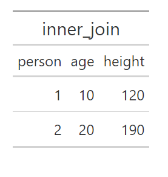
<p class="caption">(\#fig:r-joins-2)Merging of table\_1 and table\_2</p>
</div><div class="figure" style="text-align: center">
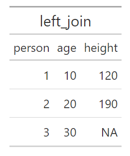
<p class="caption">(\#fig:r-joins-3)Merging of table\_1 and table\_2</p>
</div><div class="figure" style="text-align: center">
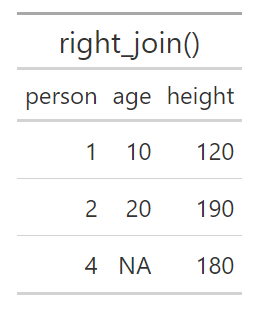
<p class="caption">(\#fig:r-joins-4)Merging of table\_1 and table\_2</p>
</div>

## Calculate Index and Export Tables {#sec-r-index}

Index for a variable year $t$ is calculated in the following way:

$$\text{Index}_{t}=\frac{\text{Value}_{t}}{\text{Value}_{\text{base year}}}\times100$$

where value refers to the value for the variable we want to create an index for. We will now calculate an index for GDP per capita. Table \@ref(tab:r-gdp-table) describes our data with GDP per capita for the years 2015–2019. To create a table with these observations and variables in R we can use the following command:

```r
bnp_data <- tibble(
    year = 2015:2019,
    gdppercap = c(474000, 477800, 483500, 487300, 488800))
```

| **year** | **GDP per capita, 2019 prices** |
|:---:|---:|
| 2015 | 474,000 |
| 2016 | 477,800 |
| 2017 | 483,500 |
| 2018 | 487,300 |
| 2019 | 488,800 |

Table: (\#tab:r-gdp-table) Variables year and GDP.

To then calculate an index for GDP we can use the following command where we use the function `mutate()` to add a variable to the table with the index calculation:

```r
bnp_data <- bnp_data %>%
arrange(year) %>%
mutate(g_index = gdppercap / gdppercap[1] * 100)
```

Since we use `<-` the old object `bnp_data` is overwritten with the new object. The only difference between the new and old object is that we have added a column with the variable `g_index`. Say now that we want to export our table with our index to a file on the hard drive or display the result in another program, for example in a document we are writing in Microsoft Word. We can do this in several ways. We can for example export our table to an Excel file using the function `write_xlsx()`, which we introduced above. For example like this:

```r
bnp_data %>%
write_xlsx(path="my_gdp_index_table.xlsx")
```

This saves all data from the object `bnp_data` to the new Excel file `my_gdp_index_table.xlsx`. If we only want to save parts of the table we can for example select rows and columns using the functions `filter()` and `select()`. Saving tables in Excel can for example be useful if we want to present results in one of Microsoft's programs Word or PowerPoint. We can also create tables directly in RStudio with a specific layout that we choose ourselves. A particular package that can be interesting in this context is `gt`, which we can install and load with `install.packages("gt")` and `library("gt")`. This package contains a large number of functions for precisely this purpose. You can read more about the package at: <https://gt.rstudio.com/articles/intro-creating-gt-tables.html>

## Matrix Calculations {#sec-r-matrices}

In R we can, as mentioned, write mathematical expressions directly in our script or in the Command window. The same applies to calculations with matrices, given that we instruct the program that we want to perform matrix calculations. We start by creating the following matrix:

$$A=\begin{bmatrix}1 & 2\\ 3 & 4\end{bmatrix}$$

To define a matrix we can use the function `matrix()`, for example as in the following command:

```r
A <- matrix(c(1,2,3,4), nrow=2, byrow=TRUE)
```

The first argument in `matrix()` is the data that should fill the elements in the matrix, by using the function `c()` and specifying the numbers 1, 2, 3 and 4. The option `nrow=2` defines that the matrix should have 2 rows. The option `byrow=TRUE` specifies that the data that is entered should be read in row-wise. The values 1 and 2 therefore become the elements in the top row of the matrix. The following command results in exactly the same matrix:

```r
A <- matrix(c(1,3,2,4), nrow=2)
```

To multiply two numbers in R we can, just as in many other programs, use asterisk, for example `2*3`. To matrix multiply two matrices we can instead use the command `%*%`. Here is an example where we define a new matrix `B` and multiply this with matrix `A`:

```r
B <- matrix(c(4,2,3,5), nrow=2)
A %*% B
```

To add or subtract with matrices we can use `+` and `-` as usual. For example `A - B` or `A + B`. To transpose a matrix we can use the function `t()`, for example `t(A)` to transpose matrix `A`. The inverse of matrix $A$ can in mathematics be described as $A^{-1}$. In R we can calculate the inverse of `A` with the function `solve()`:

```r
# Calculate the inverse of matrix A:
solve(A)
```

The function `diag()` can be used both to return the elements in the diagonal from a matrix, give the diagonal in an existing matrix new values or create a new diagonal matrix from for example a vector. For example like this:

```r
# We start from matrix A:
A <- matrix(c(1,3,2,4), nrow=2)
# Return the diagonal in A
diag(A)
# Create a diagonal matrix from other values
c(1,5,4) %>% diag()
# Give the elements in the diagonal in A new values
diag(A) <- c(5,6)
# Last command changed the content in A
A
```

If we only specify a number in the parentheses for `diag()` the function returns a square identity matrix with the same number of rows and columns as the number we specify, where all values on the diagonal equal 1. For example: `diag(2)` returns a $2\times2$ identity matrix. To calculate the sum of the diagonal, the trace, in matrix `A` we can use function `trace()`, for example:

```r
# Calculate trace for A
trace(A)
```

To calculate the determinant of matrix `A` we can use the function `det()`, for example `det(A)`. To save the value that is returned in a new object we must as usual use `<-`. In the example above we also combined `diag(A)` with `<-` to assign new values to the diagonal elements in `A`. In a similar way we can also give the columns in matrix `A` new names. For example like this:

```r
matrix_A <- matrix(c(1,3,2,4), nrow=2)
# Display the content
matrix_A
colnames(matrix_A) <- c("col1","col2")
# Note the difference
matrix_A
```

R objects that contain matrices and vectors are not the same thing as an R object that contains a table of type tibble. If we want to use our matrix as a table we can convert the matrix's content to a tibble table with the function `as_tibble()`. For example like this:

```r
matrix_A <- matrix(c(1,3,2,4), nrow=2)
colnames(matrix_A) <- c("col1","col2")
table_A <- matrix_A %>% as_tibble()
```

## Input–Output Analysis {#sec-r-io}

This section goes through the corresponding example with input-output analysis that we used in the Excel and Stata chapters. We defined matrix $A$:

$$A=Z\cdot\text{diag}\left(S_{m}\right)$$

where $Z$ is the flow matrix and $\text{diag}(S_m)$ is a diagonal matrix with the multiplicative inverse of total production per sector along the diagonal. Matrix $C$ is a column matrix with production for final consumption per sector. The total production from sector $j$ required for all inputs and final consumption is $y_j$, collected in matrix $Y$, which can be defined as:

$$Y=\left(I-A\right)^{-1}S$$

where $I$ is an identity matrix with the same dimensions as $A$. We call $B=(I-A)^{-1}$, which has the same dimensions as $A$, where column sum $j$ is the production multiplier and row sum $j$ is the input multiplier for sector $j$. To perform this calculation in R we start by defining the matrices $Z$, $C$, $S$, $S_m$ and $\text{diag}(S_m)$:

```r
Z <- matrix(c(2,1,1,3), nrow=2)
C <- matrix(c(3,3), ncol=1)
S <- c(6,7)
mat_S <- matrix(c(6,7), nrow=2)
diag_Sm <- diag(1/S)
```

Then we can calculate $A$, $B$ and $Y$:

```r
A <- Z %*% diag(Sm)
B <- solve(diag(2) - A)
Y <- B %*% mat_S
```

Note how we, if we wanted to, can write the entire calculation of $Y$ in one command without creating any objects:

```r
solve(diag(2) -
        (matrix(c(2,1,1,3), nrow=2) %*%
         diag(1/c(6,7))
        )
     ) %*% c(6,7)
```

## Variation and Covariance {#sec-r-variation}

Say that we have an R object `my_data` that contains the variables `x`, `y` and `z` (same as above):

```r
my_data <- tibble(
    y = c(3,2,5,4),
    x = c(3,4,6,7),
    z = c(1,4,0,1))
```

Now we will estimate and calculate mean, variance, standard deviation as well as some percentiles and quartiles for the variables in this table. Parts of this information we can get through the function `summary()`, for example:

```r
my_data %>% summary()
```

We can also use one of the many functions that are pre-installed in R, such as `mean()`, `var()`, `sd()` and `quantile()`. For example like this:

```r
# Calculate mean for variable x
my_data$x %>% mean()
# Calculate mean using summarize
my_data %>%
summarize(mean(x),
mean(z))
```

With the function `quantile()` we can calculate percentiles and thereby also deciles and quartiles. In the parentheses for the function we need to specify a variable and which percentiles we want to calculate. If we have a collection of values saved in the object `x` we can use the following command:

```r
quantile(x, .1)
```

The function then returns percentile 10. The notation `.1` is in R the same value as `0.1`. To calculate several percentiles we can for example use the function `c()`. Here is an example for calculating the 25th, 50th and 75th percentile (first and third quartiles as well as the median):

```r
quantile(x, c(.25, .5, .75))
```

Here follow examples of how we can use `quantile()` with the table in the object `my_data`:

```r
# Calculate 30th percentile for x
my_data$x %>% quantile(.3)
# Calculate 3 different percentiles for x
my_data %>%
summarize(Three_p = quantile(x, c(.1,.2,.3)))
```

To estimate variance and standard deviation for a variable we can, as mentioned, use the functions `var()` and `sd()`. In the parentheses for `sd()` we can only specify one variable at a time. If we only specify one variable in the parentheses for `var()` the function returns the sample variance. For example:

```r
my_data %>% select(y) %>% var()
```

If we specify several variables in the parentheses for `var()` the function instead returns the covariance. R also has a specific function for calculating covariance, called `cov()`. We continue to use the object `my_data` with the table with four observations for variables `y`, `x` and `z`. In this case the following two commands give exactly the same result in the form of a $3\times3$ matrix with estimated variance and covariance between the three variables `x`, `y` and `z` in our table:

```r
# The function var()
my_data %>% var()
# The function cov()
my_data %>% cov()
```

In the above commands we specify the entire object `my_data` as input value to the functions `var()` and `cov()`. This works because all three variables in the table are quantitative and data is saved so that R understands that they are numerical values. If any variable in the table is not numerical, for example a variable with text strings, the functions instead return an error message.

If we instead want to calculate the correlation coefficient between two variables we can use the function `cor()`. If we specify several variables as input value for `cor()`, for example in the form of a table with only quantitative variables, the function returns the pairwise correlation between all variables. Below follows an example where we send the table in `my_data`, which contains three variables, to the function `cor()`:

```r
my_data %>% cor()
```

The result is shown in figure \@ref(fig:r-cor).

<div class="figure" style="text-align: center">

<p class="caption">(\#fig:r-cor)Results of cor()</p>
</div>

## Probability {#sec-r-probability}

R has several pre-installed functions for calculating probabilities based on common probability distributions. Several of these are built in the same way. If we want to create 100 values drawn from a continuous uniform probability distribution we can use the function `runif()` in the following way:

```r
runif(100)
```

The default setting is that the minimum value for this probability distribution is 0 and the maximum value is 1. We can also specify new values for minimum and maximum through the options `min` and `max`. For example:

```r
runif(100, min=0, max=100)
```

As usual we must use the function `<-` if we want to save these values in an R object. If we instead want to know probabilities based on a density function for this type of probability distribution we can use the function `dunif()`. The function `punif()` returns values for the cumulative probability function. The function `qunif()` returns the inverse of the cumulative distribution function, the quantile function. The corresponding R functions for the normal distribution are called `rnorm()`, `dnorm()`, `pnorm()` and `qnorm()`. If we only specify one argument in the parentheses for these functions, all of these are based on the standard normal distribution. The following code gives the cumulative probability for $z=0$:

```r
pnorm(0)
```

The functions have different options for defining the distribution, for example:

```r
pnorm(2, mean=2, sd=1)
```

Table \@ref(tab:r-prob-distributions) describes some examples of functions that we can use to work with some common probability distributions in R. See each function's help section for instructions on how the functions can be used and different options. R also has several pre-installed functions for several common statistical tests, for example `t.test()`.

| **Probability Distribution** | **Examples of functions in R** |
|:---|:---|
| Uniform | `dunif(), punif(), qunif(), runif()` |
| Poisson distribution | `dpois(), ppois(), qpois(), rpois()` |
| Exponential distribution | `dexp(), pexp(), qexp(), rexp()` |
| Gamma distribution | `dgamma(), pgamma(), qgamma(), rgamma()` |
| Chi-squared distribution | `dchisq(), pchisq(), qchisq(), rchisq()` |
| F-distribution | `df(), pf(), qf(), rf()` |
| Normal distribution | `dnorm(), pnorm(), qnorm(), rnorm()` |
| T-distribution | `dt(), pt(), qt(), rt()` |

Table: (\#tab:r-prob-distributions) Probability Distributions in R.

## Regression Analysis {#sec-r-regression}

This section introduces how we can work with regression analysis in R. First by estimating results ourselves using matrix calculations. Then how we can use ready-made R functions to achieve the same results.

### Regression Analysis with Matrices {#sec-r-reg-matrices}

Now we will estimate the following regression model:

$$Y=XB+U$$

where $Y$, $B$ and $U$ are column matrices with the explained variable $Y$, the coefficients $B$ and the error terms $U$. $X$ is a matrix with the explanatory variables, where the first column has the value 1 in each element, for the constant (y-intercept). The estimator for the coefficients can be written with matrices as:

$$\hat{B}=\left(X^{T}X\right)^{-1}X^{T}Y$$

We may perform matrix calculations directly in our R script and therefore start by defining the matrices $Y$ and $X$:

```r
Y <- matrix(c(3,2,5,4), nrow = 4)
X <- matrix(c(1,1,1,1, 3,4,6,7), nrow=4)
```

To estimate $\hat{B}$ we can then use the functions `t()`, `solve()` and matrix multiplication with `%*%`.

```r
Bhat <- solve(t(X) %*% X) %*% t(X) %*% Y
# Check the result
Bhat
```

### Regression Analysis with `lm()` {#sec-r-reg-lm}

R also has many ready-made functions for regression analysis and even more can be downloaded in the form of R packages. To estimate a linear regression model based on the least squares method we can use the function `lm()`.

```r
# Create a table
my_table <- tibble(
    y = c(3,2,5,4),
    x = c(3,4,6,7),
    z = c(1,4,0,1))
# Estimate the regression model
lm(formula = y~x, data= my_table)
```

If we run the code above, the estimated coefficients $a$ and $b$ from the regression model $y=a+bx+u$ are displayed in the Console window, where $y$ and $x$ are variables and $u$ is the error term. The result is shown in figure \@ref(fig:r-lm-results). If we want to add more variables to the regression model we can do so with the plus sign. As an example, say we instead want to estimate the following regression model:

$$y=\beta_{1}+\beta_{2}x+\beta_{3}z+v$$

where $\beta$ are the coefficients and $v$ is the error term. To estimate this model with `lm()` we can use the following command:

```r
lm(y ~ x + z, data = my_table)
```

<div class="figure" style="text-align: center">

<p class="caption">(\#fig:r-lm-results)Results of lm()</p>
</div>

Say now that we want to estimate the following regression model with the interaction term $xz$:

$$y=\alpha_{1}+\alpha_{2}x+\alpha_{3}z+\alpha_{4}xz+\epsilon$$

where $y$, $x$ and $z$ are the variables, $\alpha$ are the coefficients and $\epsilon$ is the error term. The variable $xz$ is variable $x$ multiplied by variable $z$. To estimate this model with the function `lm()` we can do this with the following command:

```r
lm(y ~ x + z + x:z, data = my_table)
```

The term `x:z` is the interaction term. Another way to get the same result is the following notation:

```r
lm(y ~ x*z, data=my_table)
```

The notation `x*z` means that the program adds both `x` and `z` as separate explanatory variables as well as an interaction term for `xz`.

If we want to estimate the regression model $y=\beta_1+\beta_2 x+\beta_3 z+v$ with robust standard errors, that is an adjusted variant of the variance-covariance matrix, we can do this for example with the function `lm_robust()`. In the parentheses for `lm_robust()` we fill in as usual the regression model and data. As an option we can then specify which method we want to use to adjust the standard errors and the variance-covariance matrix by defining the argument `se_type`. For example:

```r
# Use adjustment HC0
lm_robust(y ~x, data=my_table, se_type="HC0")
# Use adjustment HC1
lm_robust(y ~x, data=my_table, se_type="HC1")
```

See the function's help section for more options and more information. When we run a command with `lm()`, several other results are estimated and calculated. To work with these we can for example save the lm result in a new object and use the function `summary()`. Here follows an example of commands. The result from `lm()` combined with `summary()` is shown in figure \@ref(fig:r-lm-summary):

```r
lm_results <- lm(y~x, data = my_table)
lm_results %>% summary()
```

<div class="figure" style="text-align: center">

<p class="caption">(\#fig:r-lm-summary)Results from lm() and summary()</p>
</div>

We can also study the results returned from `lm()` using the functions `str()` and `head()`. For example like this: `lm_results %>% str()`, or `head(lm_results)`. We can also use the ` $`-operator. Here is an example where we estimate the regression model$ y=a+bx+u $and then retrieve the predicted values for$\hat{y} $as well as the residuals$\hat{u} $. We save both of these in two new R objects:

```r
lm_results <- lm(y~x, data = my_table)
predicted_y <- lm_results$fitted.values
residuals <- lm_results$residuals
```

To retrieve the regression's variance-covariance matrix we can use the function `vcov()`:

```r
vcov(lm_results)
```

The command returns a matrix. Since we have two coefficients in this case, a $2\times2$ matrix is returned.

## Export Results to Hard Drive {#sec-r-export-results}

There are different methods for exporting regression results from R to other programs, if we for example are writing a report in Word and want to present our results there. A useful R package in this case is `stargazer`, which we can install and load as usual with the functions `install.packages()` and `library()`:

```r
install.packages("stargazer")
library("stargazer")
```

In the stargazer package there is a function that is also called `stargazer()` which among other things can create nicer tables for presenting regression results. Here follows an example where we again estimate the two regression models $y=a+bx+u$ and $y=\beta_1+\beta_2 x+\beta_3 z+v$. In the parentheses for `stargazer()` we define the option `type="text"` so that the table is displayed in readable format directly in RStudio's Console window. The result is shown in figure \@ref(fig:r-stargazer).

```r
est_1 <- lm(y ~ x, data = my_table)
est_2 <- lm(y ~ x + z, data = my_table)
stargazer(est_1, est_2, type="text")
```

The package and function `stargazer()` have many options that we can use to influence the appearance of the results table. We can also export the results to different file types, for example `.xml` which can be read by Microsoft Word. Academic publications often use LaTeX to create results that follow certain rules, which `stargazer()` also has support for. See the package's and function's help section by using the commands:

```r
help(package="stargazer")
help(stargazer)
```

<div class="figure" style="text-align: center">

<p class="caption">(\#fig:r-stargazer)Results from stargazer()</p>
</div>

## Create Plots {#sec-r-plots}

There are many functions in R that can be used to create graphics and charts. We will here introduce a few parts of the ggplot2 package, which is included in the tidyverse package. By loading tidyverse, ggplot2 is also loaded. In the ggplot2 package we can create charts using the function `ggplot()`. It works in the following way:

1. Specify data table with the columns that should be displayed in the chart.
2. Specify which columns in the table should be displayed, and define how the values from these columns should be illustrated in the chart. This is done with the function `aes()` (aesthetic mappings), which is specified in the parentheses for `ggplot()`.
3. Add one or more geom functions that describe the types of shapes and objects that should be drawn in the chart. Examples of geom functions: `geom_point()` draws points, `geom_line()` draws a line between the data points.

Here is a simple example where we create a simple time series chart. We use the pipe function `%>%` to pipe a small tibble table directly to the function `ggplot()`:


``` r
library(tidyverse)
tibble(time=2015:2022,
  my_variable = c(3,2,4,5,3,5,6,4)) %>%
ggplot(aes(x=time, y=my_variable)) +
geom_point() +
geom_line()
```

<div class="figure">
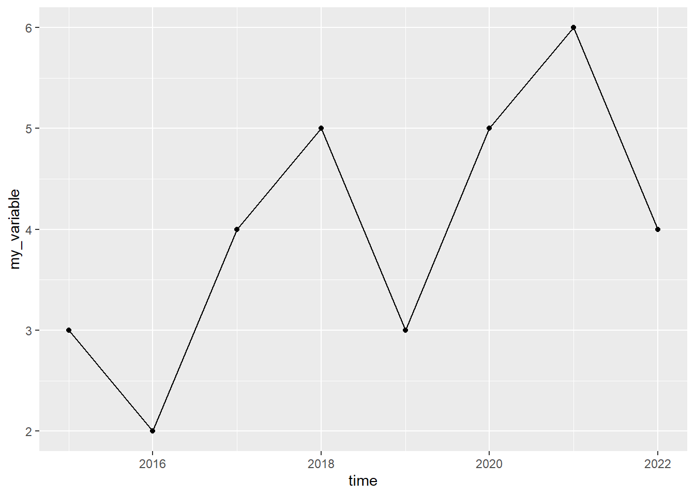
<p class="caption">(\#fig:r-graf1)A graph with a line and dots</p>
</div>

In the parentheses for the geom functions we can specify one or more arguments to change the appearance of the shapes that the function draws, for example: `color`, `shape`, `size`, `linewidth`, `linetype`, `fill`. In the functions' help sections there are descriptions of additional options and how we can use these to influence the chart's appearance. Below follows an example where we change color and shape of lines and dots:


``` r
tibble(time=2015:2022,
  my_variable = c(3,2,4,5,3,5,6,4)) %>%
ggplot(aes(x=time, y=my_variable)) +
geom_point(size=6, color="#F8766D", shape=3) +
geom_line(linetype="dashed", color="#00BFC4")
```

<div class="figure">
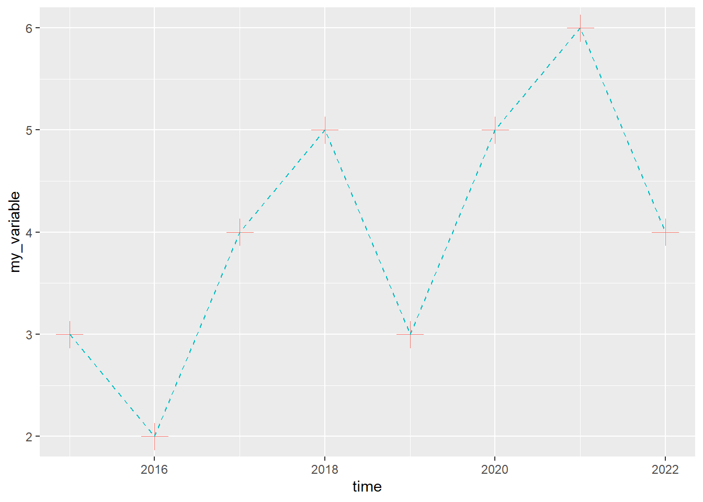
<p class="caption">(\#fig:r-graf2)A graph with a line and dots (styled)</p>
</div>

In the parentheses for `aes()` we can specify several arguments besides `x` and `y`. For example, we can use an aesthetic command, like `color` and define this as a variable, like `color=person`, where `person` is a variable in the table we use in the ggplot command. The unique values in the variable we refer to will define the aesthetic property, which in this case becomes the color of the data points that are drawn in the chart.

Below follows an example with three groups, where each group of observations is grouped in the variable `person`. To create the variable `person` we use the function `rep()` and create three values of each unique value: `"a"`, `"b"` and `"c"`. The table contains nine observations, three per group. By specifying `color=person` in the parentheses for `aes()`, each group will get its own color in the chart:


``` r
tibble(time=rep(c(1,2,3),3),
       person=c(rep("a",3), rep("b",3), rep("c",3)),
       value=c(2,4,3, 4,3,2.5, 3,2,4)) %>%
ggplot(aes(x=time, y=value, color=person)) + geom_line()
```

<div class="figure">
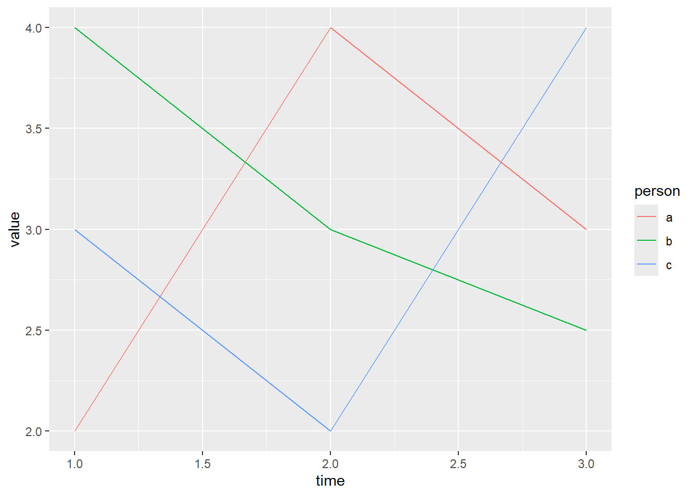
<p class="caption">(\#fig:r-graf3)A graph with colored groups</p>
</div>

To draw a regression line we can use `geom_smooth()`. In the parentheses we can among other things define the option `method`, which specifies which method we want to use to draw the regression line. Below follows an example where we use `method="lm"` where lm stands for linear model, which means that the line is estimated based on the least squares method.

Since we in the parentheses for `aes()` specified that we want to use variable `y` for the argument `y` and variable `x` for the argument `x`, `geom_smooth()` assumes that we want to draw the regression line based on an estimation of the regression model $y=a+bx+u$. In R this regression model can be written `y ~ x`. In the parentheses for `geom_smooth()` we also specify the option `se=TRUE`, which means that the confidence interval is drawn out. Read more in the help section for `geom_smooth()`:


``` r
tibble(x=c(3,4,6,7),
y=c(5,2,3,1)) %>%
ggplot(aes(x=x,y=y)) +
geom_point() +
geom_smooth(method="lm", se=TRUE)
```

<div class="figure">
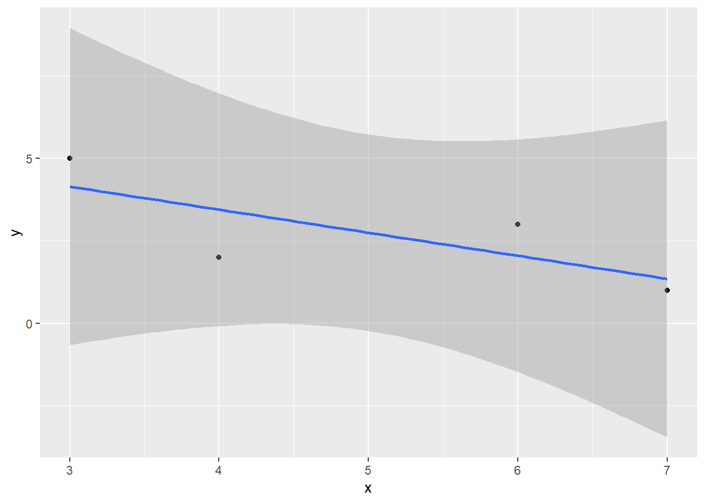
<p class="caption">(\#fig:r-graf-lm)A graph with a regression line</p>
</div>

To draw a histogram we can use the function `geom_histogram()`, which describes the frequency distribution of a variable. We then only need to specify one variable in the parentheses for `aes()`. Here follows an example where we create a variable that draws 300 random observations from the standard normal distribution and plot these in a histogram. We start by defining the random seed for our run, which we can do in R with the function `set.seed()`. In its parentheses we specify the value for the random seed. For the histogram we use the aesthetic argument `color` to define the color of the bars' edges, the option `fill` to define the color inside the bars and the option `alpha` to make the bars transparent:


``` r
# Define random seed
set.seed(1)
# Create variable based on normal distribution
tibble(x=rnorm(300)) %>%
# Create chart
ggplot(aes(x=x)) +
geom_histogram(alpha=.3, fill="#F8766D", color="black")
```

<div class="figure">
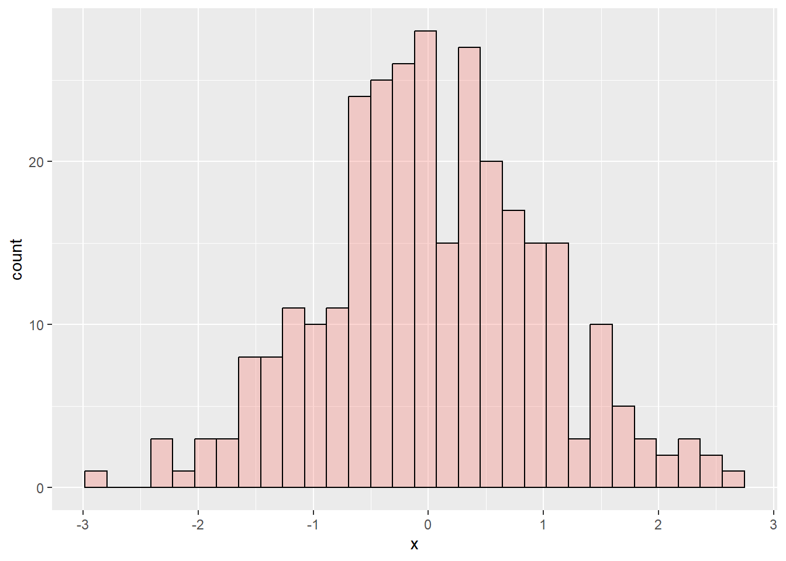
<p class="caption">(\#fig:r-histogram)Histogram created with ggplot()</p>
</div>

A histogram is a form of bar chart. To draw a bar chart generally we can use the function `geom_bar()`, which then requires that we specify at least two variables for the `y`- and `x`-axis. To draw mathematical functions we can use `geom_function()`. For this we don't need to use any data for `ggplot()`. We also don't need to use the function `aes()`. Instead we define all information in the parentheses for `geom_function()`.

Below follows an example where we first define the function using the R function called `function()`. We specify what we call the input variable, by writing `function(x)`. We then describe the mathematical function $y=x^{2}$ and then specify with the option `xlim` within which interval of x-values the mathematical function should be defined.

In the example below we use the function `labs()` which we can use to define titles. In the parentheses for `labs()` we define the option `x` to define the x-axis title, `y` to define the y-axis title, `title` to define the chart's title and we define the option `caption` to write a note below the chart. We also introduce here the function `theme()` which we can use to influence the chart's appearance in more detail. Read more about the many options available for `theme()` in the function's help section:


``` r
ggplot() +
geom_function(fun=function(x) x^2) +
labs(x="My x-variable",
     y="y = f(x)",
     title="My chart",
     subtitle="The subtitle here",
     caption="I drew this chart in R") +
theme(axis.title.y = element_text(angle=0),
      plot.caption = element_text(color="red"),
      plot.title= element_text(size=20, color="purple"))
```

<div class="figure">
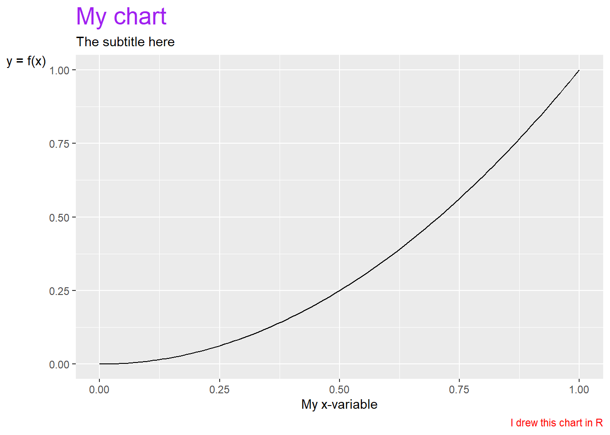
<p class="caption">(\#fig:r-func-graph)A graph with a mathematical function</p>
</div>

Charts can also be saved in R objects by using `<-`. This can often be useful for several things, including for exporting charts to the hard drive in for example image files. To export charts we created with `ggplot()` to the hard drive we can use the function `ggsave()`. In the parentheses we specify with the help of the option `filename` the name of the file we want to save the chart as, for example `ggsave(filename="my_chart.png")`.

We can use different file extensions and thereby the file format, for example `.pdf` or `.png`. It is often helpful to also define height and width in the parentheses for `ggsave()` with the options `height` and `width`. See the function's help section. Here is an example where we first create a chart and save it in the R object `plot_1`. Then we use this object to export the chart in the object to a file on the hard drive using the function `ggsave()`.

```r
plot_1 <- ggplot() +
geom_function(fun=function(x) x^3)
ggsave(plot_1, filename="my_chart.pdf", width=3, height=3)
```

Alongside the function `theme()` there are also special functions, such as `theme_bw()` and `theme_classic()` that we can use to change the appearance of the entire chart directly, without specifying any arguments. We can add free text in ggplot charts with for example the function `annotate()`. To add labels to data points the functions `geom_text()` and `geom_label()` are recommended. If we want to define intervals for the `y`- and `x`-axis we can use the functions `ylim()` and `xlim()`. If we want to control how the scales for any of the options in `aes()` are displayed we can also use a function such as `scale_x_continuous()`, `scale_fill_discrete()` or `scale_color_discrete()`. There isn't room here to describe these but you can read more about them in their respective help sections.

Saving charts in R objects can also be useful if we want to combine several charts in one and the same image. This can among other things be done with the help of the `patchwork` package. To install and activate it we first run the following commands:

```r
install.packages("patchwork")
library("patchwork")
```

After we have loaded patchwork we can among other things use `+` and `/` to organize charts in one and the same image. Read more in the help section for the package by running the command `help(patchwork)`. Below follows an example:


``` r
library(patchwork)
# Create a chart
chart_1 <- ggplot() +
geom_function(fun=function(x) x^2) +
theme_bw()
# Create another chart
chart_2 <- ggplot() +
geom_function(fun=function(x) 1/x) +
theme_classic()
# Combine the charts with patchwork
chart_1 + chart_2
```

<div class="figure">
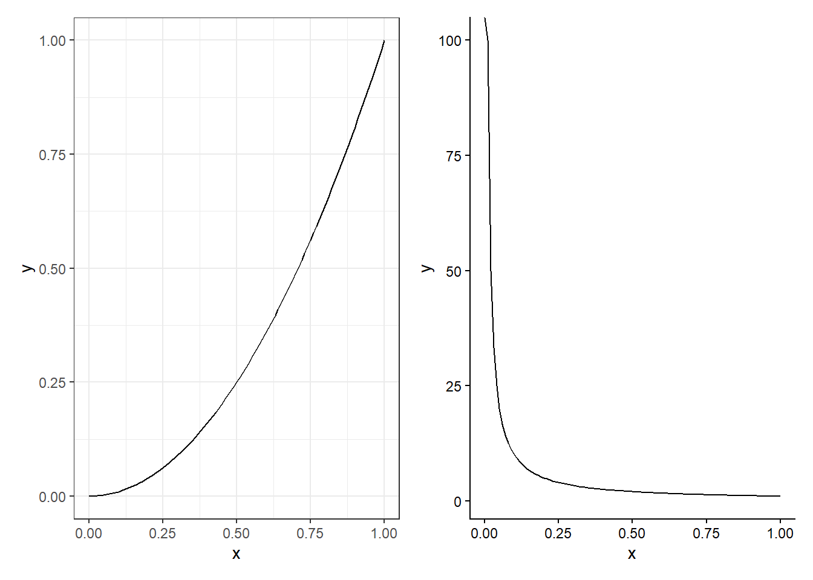
<p class="caption">(\#fig:r-patchwork)Graphs organized with patchwork</p>
</div>

To save the combined charts in one file we can use `ggsave()`:

```r
# Save the charts in one and the same file
(chart_1 + chart_2) %>%
ggsave("my_charts.pdf", width=4, height=2)
```

## Iterations and Loops {#sec-r-loops}

There are many ways to work with iterations in R. We have already used certain forms of iterations in different examples above. For example to calculate the sum per group in a table using the function `group_by()` or to define colors and shapes in charts by combining options like `color` and `fill` in the parentheses for `aes()` with the name of a variable in our table. The function `group_by()` and other functions in among others the dplyr package can many times be combined to achieve unexpected results.

In this section we will introduce how we can build iterations and loops using the function `map()`. The function `map()` is for building loops and has two arguments. The first argument is called `.x` and is the input value that the function should use for each loop round. The input value can consist of a collection of values from the function `c()`, the elements in a vector, the columns in a table or something else. The second argument is `.f`, which defines what the function `map()` should do with the current value in each loop round. We can fill `.f` with a single simple operation or with a long chain of commands.

The function `map()` returns a form of data called a list. A list does not only refer to a collection of values (such as from the function `c()`) but is a special form for how data can be organized. Each element in a list can consist of different things. An element in a list can be a number or a text string but it can also be an entire table. A list can therefore be a collection of tables. We will not go through this in detail here but focus on how we can work with `map()` and tables, as well as get a table as a result of our loop in `map()`. Here is a simple example:

```r
c(1,2,3) %>% map(log)
```

What happens in the command above is that the function `c()` sends the three values 1, 2 and 3 to `map()` which in turn uses the function `log()`. The first round the function takes the value 1 and returns the logarithm of this as the first element in the list that `map()` starts creating. The second round the function takes the value 2, creates the logarithm of this and returns this as the second element to the list from `map()`, and so on.

The entire command returns a list with the logarithmic values of 1, 2 and 3. To instead of a list object get a vector we can add the function `list_simplify()`:

```r
c(1,2,3) %>% map(log) %>% list_simplify()
```

The example is of course completely unnecessary since we can instead take `log(c(1,2,3))`. Say now that we have the following table:

```r
my_table <- tibble(
    y = c(3,2,5,4),
    x = c(3,4,6,7),
    z = c(1,4,0,1))
```

If we want to calculate a result per column, for example mean, we can for example use the following command with `map()`:

```r
my_table %>% map(mean) %>% list_simplify()
```

Say now that we want to calculate several things at the same time and return a table. We can do this with the following command, which is explained below:

```r
my_table %>% map(~{
tibble(
    mean = mean(.x),
    sd = sd(.x)) %>%
return()
}) %>%
list_rbind() %>%
mutate(variable = my_table %>% colnames())
```

The object `my_table` is sent to `map()`. The first round now `map()` uses the first column as input value `.x`. The second round `map()` uses the second column, and so on. In the parentheses for `map()` we write `~{}` and inside the curly brackets we write the commands we want to apply on each loop round. We can also write `.f=~{}` and get exactly the same result.

In this case we specify that we want to create a new tibble table on each round and in this create the variables `mean` and `sd`, which all use the values in `.x` as input values to calculate results. On each round a tibble table is now created with only one row (since `mean()` and `sd()` return only one constant each). We send the tibble table to the function `return()`, which controls what is returned on each loop round. The result becomes the same in this case if we delete `return()`.

After the parentheses for `map()` we send the result (a list) to the function `list_rbind()` which converts the list object to a table where each tibble table created in the loop rounds is converted to a common tibble table. Then we send this single table forward to the function `mutate()` to create a new variable, where we add the name of the three variables `x`, `y` and `z` from `my_table` using the function `colnames()`. The result is shown in figure \@ref(fig:r-map-table).

<div class="figure" style="text-align: center">

<p class="caption">(\#fig:r-map-table)Table created with map()</p>
</div>

## Example with GDP per Working Hours {#sec-r-gdp-example}

In the Excel and Stata chapters we went through examples of how we can work with data on GDP per working hour. We will now do the same thing in R. Table \@ref(tab:r-tcb-data) repeats the observations for real GDP per working hour, calculated in purchasing power adjusted millions of US dollars. To work with this example we need to import the data to R. One way to do this is the following command, where we save the table in the object `tcb_data`:


``` r
library(tidyverse)
tcb_data <- tibble(
country = c("Denmark","Finland","Norway","Sweden","United Kingdom","United States"),
gh1990 = c(62.6, 47, 68.1, 54.6, 50, 53.2),
gh2000 = c(76.6, 64.3, 89.3, 68.4, 63.1, 63.6),
gh2010 = c(84.2, 73.5, 95.9, 81.6, 70.4, 79.5),
gh2020 = c(95.9, 77, 101.1, 89.3, 73.4, 87.4))
```

| **country** | **gh1990** | **gh2000** | **gh2010** | **gh2020** |
|:---|---:|---:|---:|---:|
| Denmark | 62.6 | 76.6 | 84.2 | 95.9 |
| Finland | 47 | 64.3 | 73.5 | 77 |
| Norway | 68.1 | 89.3 | 95.9 | 101.1 |
| Sweden | 54.6 | 68.4 | 81.6 | 89.3 |
| United Kingdom | 50 | 63.1 | 70.4 | 73.4 |
| United States | 53.2 | 63.6 | 79.5 | 87.4 |

Table: (\#tab:r-tcb-data) GDP per Working Hours. Source: The Conference Board. Real GDP purchasing power adjusted millions USD, divided by working hours per year.

Many work tasks in R are easier to perform with data that is organized in long format. We therefore start by pivoting the table to long format using the function `pivot_longer()`. To tidy up the table we also use in the command below the options `names_prefix` (which identifies that the columns gh1990...gh2020 begin with the letters gh), `values_to` (to name the new column with GDP per working hour) and `names_to` (to name the new variable with the years). After `pivot_longer()` we use the functions `mutate()` and `as.numeric()` to convert the new variable year to numbers instead of text strings:


``` r
tcb_data <- tcb_data %>%
pivot_longer(cols=gh1990:gh2020,
    names_prefix = "gh",
    values_to = "gdp_hour",
    names_to = "year") %>%
mutate(year = as.numeric(year))
```

Now the data is in more manageable format. Let us now calculate an index per country. We can do this using the functions `group_by()` and `mutate()`, for example like this:


``` r
tcb_data <- tcb_data %>%
group_by(country) %>%
mutate(gdp_index = gdp_hour/gdp_hour[1] * 100)
```

We have now saved the table in long format and added a new variable with a calculation of the indexed development of GDP per working hour per country. Let us look at the results in two charts. We start by creating a chart for GDP per working hour:


``` r
tcb_data %>% ggplot(
    aes(x=year, y=gdp_hour, color=country)) +
geom_line()
```

<div class="figure">
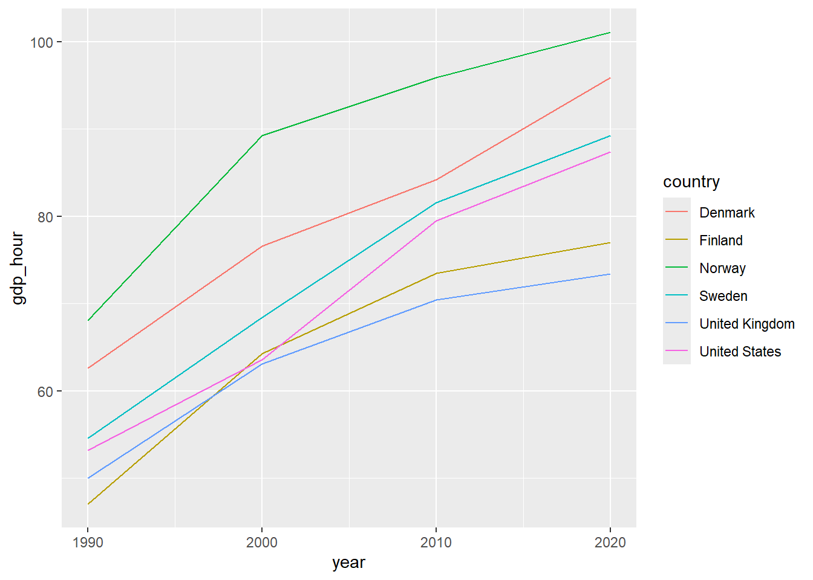
<p class="caption">(\#fig:r-tcb-gdp)GDP per Working Hour</p>
</div>

Then we can create a chart of the indexed development:


``` r
tcb_data %>% ggplot(
    aes(x=year, y=gdp_index, color=country)) +
geom_line()
```

<div class="figure">
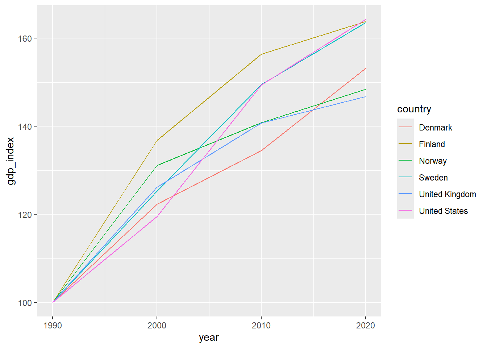
<p class="caption">(\#fig:r-tcb-index-plot)Indexed GDP per Working Hour</p>
</div>

The upper chart shows GDP per working hour. The lower chart shows indexed development. Let us also estimate the following regression model for each country:

$$y_{it}=a_{i}+b_{i}t_{it}+u_{it}$$

where $y_{it}$ is the natural logarithm of GDP per working hour, $a_i$ is the y-intercept (a coefficient) for country $i$, $b_i$ is the slope coefficient for country $i$ with regard to variable $t_{it}$ which is year in country $i$ year $t$ and $u_{it}$ is the error term for country $i$ year $t$. To estimate the regression model we can use the function `lm()`. One way to estimate the model one country at a time is to filter by country in the parentheses for `lm()`. For example like this:

```r
lm_results <- lm(log(gdp_hour) ~ year,
data= tcb_data %>%
filter(country=="Denmark") )
```

Then we can for example return the estimated slope coefficients with the following command:

```r
lm_results %>% coefficients()
```

To only return the second coefficient, the slope coefficient $\hat{b}$, we can use the following command:

```r
(lm_results %>% coefficients())[[2]]
```

There are several ways to avoid writing one call per country. We can for example create a loop using `map()`. Another way is to use `lm()` in the parentheses for `mutate()` and combine this with `group_by()`. Here follows an example. The code returns a table that is displayed in RStudio's Console window. An example of how it can look is shown in figure \@ref(fig:r-koeff-table):

```r
tcb_data %>%
group_by(country) %>%
mutate(b= (lm(log(gdp_hour) ~ year) %>%
    coefficients())[2]) %>%
distinct(country, b)
```

<div class="figure" style="text-align: center">

<p class="caption">(\#fig:r-koeff-table)Table with estimated coefficients</p>
</div>

## Chapter Summary {#sec-r-summary}

- R can be used in the RStudio program. Functions in R are generally written with the function's name followed by parentheses, for example `mean()`. Generally all functions return information that we can save in R objects. To save something in an object we can use `<-`, for example: `result_1 <- mean(c(1,2,3))`. We can then refer to the saved object, such as: `result_1 * 4`.

- We can install new functions by downloading and installing R packages. For example: `install.packages("tidyverse")` and `library("tidyverse")`. The tidyverse package contains several R packages with many functions. Including pipes `%>%`.

- Tables are one of several ways that R can handle data. A useful type of table is tibble. In tidyverse the packages dplyr and tidyr are included which contain many good functions for working with tables. For example: `rename()`, `filter()`, `select()`, `mutate()`, `if_else()`, `case_when()`, `pivot_longer()`, `pivot_wider()`.

- Matrices can be saved as R objects, for example with the function `matrix()`. Calculations with matrices can be performed directly in the R script. For example: `A %*% B` means that we matrix multiply objects `A` and `B` which contain compatible matrices.

- Examples of functions for studying variation and covariation: `var()`, `cov()` and `cor()`. Examples of functions regarding probability: `dnorm()`, `pnorm()`, `qnorm()` and `rnorm()`.

- To estimate regression models with the least squares method we can use the function `lm()`. A regression model $Y=a+bX+U$ can in the parentheses for `lm()` be written `lm(y ~ x)`. We must also specify which data should be used. The results from `lm()` can be studied using `summary()`, `coefficients()` and `residuals()`. Result tables can be created with `stargazer()`.

- We can create charts with the ggplot2 package. The function `ggplot()` can be simplified and described in the following way: `ggplot(data = my_table, aes(y= y_variable, x= x_variable, color= color_variable)) + geom_point() + geom_line()`.

- We can create loops and iterations with `map()`, which has two input values: `.x` for the values that should be used in the loop and `.f` where we can describe what commands the loop should execute.
