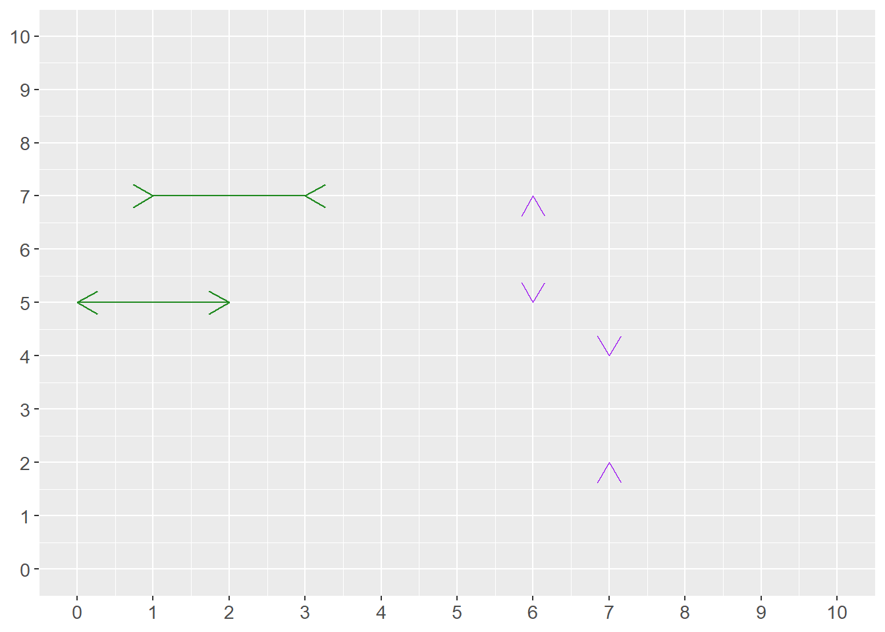

# Why math?

This first chapter introduces some ideas on why math is useful.

## Mathematics in Social Science

This book is about mathematics, statistics, and some common misconceptions. Many seem to believe that math requires a special talent or genetic defect to learn. But I, who wrote this, am not particularly smart. I'm probably not particularly dumb either. I hope that I am like most people are. If I can learn math, so can you.

Another misconception is that mathematics for social scientists only concerns economists. The inherent logic of mathematical language is the same regardless of what we study. There is therefore nothing in mathematics that makes it more or less suitable for use within the behavioral science we call economics compared to the behavioral sciences we call sociology, political science, gender studies, history, etc.

Scientific research is a fancy expression for studying things carefully. There is no single definition that everyone agrees upon for exactly what is and is not science. Analytical work within social science consists of studying people. Advanced analytical work is performed both at universities, government agencies, and private companies.

You, the reader, are not expected to have any higher education in mathematics, statistics, or social science. In several of the chapters below, examples are given of how one can use mathematics to describe ideas and theories. The ambition with these examples is primarily to illustrate and inspire. All are simplified to facilitate pedagogy.

## Measure, theorize, compare {#chap-vad-anvands-matematik}

Simply put, mathematics and statistics are used for three things in social science:

1. measure things

1. describe relationships and theories

1. compare ideas against reality

This section briefly goes through what these three things can entail.

### Measure things {#sec-matte-for-att-mata-saker}

We often put numbers on things we observe around us, such as the number of eggs in the fridge or the amount of money in your bank account. This is called quantifying, measuring the quantity of something. In analytical work, information about reality is called data. Data can consist of all types of information and all forms of information can in some sense and to some extent be quantified. Data that is not measured in numbers are called qualitative or categorical data. For example, a person's gender, name, and country of birth.

Even qualitative data can in many situations, in various ways, be rewritten as numbers. In analytical work, an important aspect is often to note whether a phenomenon exists or not, yes or no. Suppose we want to investigate whether someone living in town A had an income of over 100 million USD last year. The answer is either yes or no. This information can be saved as 0 for no and 1 for yes.

When we collect information for analytical work, we must be careful. If the goal is to investigate how high salaries are in town A, it is important that we have a clear understanding of what the concept "salary" means in this particular measurement and perhaps which residents of town A we are interested in. If the goal is to compare salaries in town A this year with salaries from 10 years ago, the information must be collected at both times in a way that makes such a comparison as accurate as possible.

An important part of analytical work is how we classify information, how we define things. Say we work at a company and want to conduct a survey among our customers, where we are to divide customers into "new customers" and "loyal customers." Or say we work for a department at a hospital and need to divide patients into those who need urgent care and those who need care later. In both these situations, we need to establish clear rules for how we sort our information.

Are there things which cannot be measured? While we can often find ways to approximate or indirectly measure difficult phenomena, some things remain practically impossible to measure in any meaningful sense. For instance, many things are vague or poorly defined and therefore impossible to measure. For example, "the culture of a country," my love for chocolate, or how boring it is to fish.

A common method for collecting information about things that are hard or impossible to measure is to redefine the phenomenon or question. For instance, to study 'job satisfaction,' we might measure it indirectly through survey responses, employee turnover rates, or productivity metrics. To study the love for chocolate, instead of measuring the feeling of eating chocolate, we can send out a survey and let people rate how much they like chocolate. In that case, we measure the answer to the question and not the feeling itself. Another method could be to observe what proportion of their income people spend on chocolate. Or measure what happens in the body when eating chocolate.

There are also phenomena that are clearly defined but practically impossible to measure for practical reasons, or because it would be too expensive to collect the information. For example, "how many carbohydrates did all residents of Europe eat between 10 and 11 o'clock on August 14, 1996?"

A related problem is that it can be difficult to capture what we are actually seeking. Say we wish to measure how good the police are. One measure of successful police work is to see how many crimes the police solve. Another measure might be the absence of crime. But how much crime is (not) committed depends in turn on what is considered illegal in society and how much crime is detected. There is no simple answer to how we solve these things. In some cases, acceptable solutions are possible but the world is full of difficult subjects where numbers will only give us superficial guidance.

In social science, we often measure relatively abstract phenomena. For example, how many people feel something or hold an opinion. A feeling or an opinion can be defined in several ways and often what we measure is perhaps more an expression of this feeling or opinion. We are therefore often forced to use an approximate measure of the phenomenon we are to investigate. Say, for example, that we are to study the following:

- How happy are people today?

To answer this question accurately, we must first specify several things:

1. Definition and measurement: What do we mean by the word "happiness"? Is our goal to measure the feeling of happiness or an expression of happiness? How we define happiness also affects how we should collect information. Should we scan brain activity, or ask several people in a survey that we send out via email?

1. Population and time: We also need to think about whose happiness we should study, which people should be included in the investigation. "People" can include both children and adults, citizens in the country you study, and/or people who are just on vacation over the weekend. Do we mean how people feel right now "today," this specific date? Or how happy people have felt over the past year?

1. Purpose: All the above questions can in turn be affected by the study's more overarching purpose and what types of conclusions we hope to be able to draw in a broader perspective. Do we want to compare happiness between countries? Do we wish to compare happiness over time?

Different collection methods have their advantages and disadvantages in turn. A well-known challenge in these contexts is that those who answer the questions can be influenced by the collection method, the form and sequence of questions, or other information. Should we collect answers using surveys or physical interviews? Can the respondent be anonymous? What type of background information should participants receive? Should we ask about economics, religion, and death?

### Describe relationships and theories {#sec-matte-for-teorier}

In social science, we also use mathematics to describe relationships and theories between different phenomena. In social science, we often want to formulate theories about causal relationships. Another word for causal relationship is causality or causal connection. Two phenomena can covary even if no causal relationship exists between them. A theory about causal relationships can, for example, sound like this:

- Phenomenon $A$ affects phenomenon $B$.

Or:

- A change in phenomenon $X$ causes a change in phenomenon $Y$.

In our daily lives, we naturally relate to causal relationships, for example:

- I have a headache because of the weather.

- If I drink water, I will feel less thirsty.

- If I learn math, others will think I am smart.

A common misconception is that mathematics means our description of relationships and theories becomes simpler than what is the case if we only use words. All social science theories are ideas about human behavior and must therefore, by definition, be simplified descriptions of reality.

Even if we only use words, without mathematics, to describe our theory, we will always be forced to simplify. Reality is simply too complex. Mathematics helps us understand when we simplify and when we are precise. Social scientists often use difficult words to describe even relatively simple relations and connections.

Let us say we are interested in a phenomenon that for some reason is not measurable. We can neither collect data nor find a suitable substitute. Mathematics can even in this situation be useful for describing our ideas. Mathematics allows us to be more precise, helps us understand when we simplify, and thereby contributes to clarifying reasoning. Consider the following statement as an example:

- The higher income people have, the happier they are.

Whether this is a clear statement or not can be discussed. For example, it is not clear whether this is a theory about a causal relationship or whether we just expect a relation between these phenomena. We may for example, have reason to believe that income and happiness covary without therefore meaning that one causes the other. If we mean that there is a causal relationship between income and happiness, it is not clear from the sentence in what way income, for example, causes happiness. This theory, described in this way, also says nothing about how large the actual effect might be, for example how much happier I become if my salary increases by 10 percent compared to if my salary doubles.

Our thesis is formulated as higher income being connected to a happier life. To know if something is "higher" or "more" than something, we must be able to estimate at least two comparable values. Regardless of whether we can collect information about these phenomena, we can have an understanding of them. With mathematics, we can, for example, describe our statement in the following way:

$$
\begin{equation}
y=a*x
 (\#eq:livslangd-inkomst-funktion)
\end{equation}
$$

This expression can be read as $y$ equals $a$ times $x$. The symbol $*$ means multiplication (times). The three letters symbolize the following:

-$y$= a person's happiness

-$x$= a person's income

- The letter $a$ indicates how large an effect a change in a person's income has on the same person's happiness. Right now, the value of $a$ is unknown.

As equation \@ref(eq:livslangd-inkomst-funktion) is written with $y$ to the left of the equals sign and $x$ to the right, the equation describes how variations in income ($x$) bring about, or explain, variations in happiness ($y$). This equation suggests a linear relationship where happiness increases proportionally with income. However, this is likely an oversimplification - real relationships are rarely this straightforward.

With the help of mathematics, it is easy to discuss further precision of our theory. We might want to change how a and $x$ are connected. We can add more variables besides $x$ and describe a more complex idea. We might want to describe how a change in income at age 50 affects happiness differently than a change in income at age 20. We might actually mean that higher income brings about several other things that can make life happier, such as more leisure time and better food, which we might also want to write into the equation. Whether these changes are necessary depends on what we are going to use our reasoning for, what we hope to be able to discuss or show.

The three functions of mathematics in social science — measuring, describing relationships, and comparing ideas against reality — work together in the research process. We first need to measure phenomena to collect data. Then we use mathematical tools to describe potential relationships and formulate theories about how these phenomena might be connected. Finally, we test whether our theoretical descriptions actually match what we observe in the real world. This brings us to the third major function of mathematics in social science.

### Compare ideas against reality

The third area that mathematics is used for in social science is to compare statements and theories with reality. This can be done in many different ways, both simple and advanced. Part \@ref(part-covariation-intro) introduces causal relationships and how we can calculate covariation between two or more phenomena. The stronger statements we make, the more careful we must be with our methods, analyses, and conclusions.

As a rule, one can say that it is relatively easy to find covariation between different phenomena, but it is very difficult to find good results that show causal relationships, which is emphasized and illustrated in several examples.

Another central part of analytical work consists of calculating probabilities. When we study information and trace patterns in it, there is often a theoretical possibility that our results could have arisen by chance. Our possibilities to estimate probabilities are a central part of analytical work. We return to probability in part \@ref(part-probability-intro) .

Analysis of causal relationships, covariation, and probabilities is used in both social science and natural science. People have calculated whether scientific theories match reality for hundreds of years. Here are some examples to show that mathematics and statistics concern you regardless of what you are interested in.

- Does money make you happy? One of humanity's perhaps oldest questions is how we should become happy or at least as glad and satisfied as possible. Many have wondered and calculated whether wealth makes us happy, including Charles Jones and Peter Klenow who published an academic article about this in 2016 that received much attention: "Beyond GDP? Welfare across Countries and Time" [Jones & Klenow (2016)](https://www.aeaweb.org/articles?id=10.1257/aer.20110236) . In the article, they present calculations that show that the average income in a country covaries with various factors that might explain people's well-being: consumption, leisure, mortality, and economic inequality. A central question in their work is how we can measure these things and whether this is actually a causal relationship.

- How do we know that Einstein was right? Albert Einstein is perhaps best known for his work with the theories of relativity, which are partly based on the observation that the speed of light in vacuum is constant, regardless of how the light's source moves. Einstein's work contributed to overturning several theories about how our reality fundamentally works. As an example, many previously believed that light traveled in a substance called ether, which is the same word used to talk about radio transmissions. The American physicist Dayton Miller presented results in 1933 from various experiments that he claimed showed that Einstein was wrong [Miller (1933)](https://link.aps.org/doi/10.1103/RevModPhys.5.203) . Miller's experiments were already discredited by the 1920s through the Michelson-Morley experiment and subsequent research, though he continued to claim contradictory results into the 1930s. Miller used interferometers to measure ether and thereby perform experiments. Based on the data he collected, he calculated the probability that the observations were a coincidence. It was partly based on discussions about mathematics and statistics that the research community concluded that Miller was wrong and Einstein was right.

- Does smoking cause cancer? Nowadays it is considered an indisputable fact that smoking causes cancer. This has not always been the case. Research results regarding tobacco and cancer were presented as early as the end of the 18th century, but as late as the 1950s, the debate was still sometimes intense around this. This discussion also revolved around how one can observe causal relationships and whether the mathematics behind the calculations was correct. Ronald Fisher, one of the 20th century's most influential statisticians, strongly questioned many of the research results of that time and considered the studies to be substandard.

- Do humans affect the climate? Nowadays, virtually all researchers working with this agree that the average temperature on Earth is rising and that this can largely be traced to human activity. But this has been subject to discussions, both regarding the actual calculations as well as the mathematics behind them. During the 1970s, some studies suggested that aerosol pollution might have a cooling effect, but the scientific consensus was already moving toward understanding human-caused warming. This discussion also largely concerns whether the calculations are correct and what type of conclusions can be drawn from them [IPCC (2007)](https://www.ipcc.ch/report/ar4/wg1/) .

## Why Calculate

Mathematics is no guarantee that our reasoning about the world becomes better. But mathematics gives us an opportunity to improve our reasoning in a way that is impossible without it. This section briefly goes through some arguments for why the absence of mathematics risks leading thought astray.

### We lie to both ourselves and others

Humans see patterns in all sorts of things. This is central to our survival but often leads to erroneous conclusions. For example, there are plenty of stories about success and predictions: "Here are 10 things successful people do before breakfast" and "Why politician A will win the next election." A large amount of such literature is carried forward by magical thinking. A lot of such stories may of course be enjoyable either way, but many people adopt the same habits as successful celebrities without the results even being of a similar nature. Many confident statements about politics and the future are pure fantasies.

Another example of misleading conclusions is those we often see in various types of graphical illustrations, diagrams or charts. Diagrams are excellent to illustrate information and create an overview. But any graphical illustration can also often mislead us. Companies use graphical illustrations of data and statistics to convince us to buy their particular products. Politicians and political activists want to convince us that they are right.

It is also easy to deceive yourself with graphics. One way to illustrate how easily things go wrong is given in figure \@ref(fig:det-ar-latt-att-lura-sig-sjalv) . In the figure, eight arrowheads can be seen with four distances between each pair. Many people perceive the distances between the arrowheads as differing. But this is incorrect. All four distances between respective pairs are equally long.

This illusion demonstrates how our perceptions can be systematically biased, which is why we need mathematical tools to avoid being misled by our intuitions when analyzing data.

In this example, you as a reader can check the distances between the arrowheads by counting the number of squares. But many illustrations of information can contain much more complicated optical illusions that are harder to detect. Mathematics can here help us make it harder for us to lie to ourselves and others. This type of optical illusion is called the Müller-Lyer illusion, after a German sociologist who researched the phenomenon at the end of the 19th century.

(\#fig:det-ar-latt-att-lura-sig-sjalv)How far is it between the arrowheads?

### Two dimensions are too few

The diagram in figure \@ref(fig:det-ar-latt-att-lura-sig-sjalv) has two dimensions: height and width. A cube has three dimensions: height, width, and depth. In pictures, it is often difficult to illustrate more than two dimensions. But reality is full of relationships that are more complex than what can be shown in diagrams. In our everyday lives, it is easy to find many examples that are the result of three or more factors.

The effect of one phenomenon can also affect the effect of other phenomena. This type of relationship rarely can be illustrated simply and clearly in pictures or diagrams. In these cases, the simple illustrations instead become misleading. In later chapters, we go through the advantages and disadvantages of graphical illustrations and how mathematics can be used to compare relationships between several phenomena simultaneously.

### Science is needed

In social science, we often work with questions close to ideology and values. It is sometimes difficult for analysts to keep separate what we know about the world and what we wish we knew. Sometimes it can seem impossible to reach out with new knowledge when everyone seems to have decided what they believe about the world. It can then be easy to despair about the use of more technically advanced methods.

Consider how many flawed proposals that might have gained traction in the past can now be quickly identified and dismissed using mathematical analysis Looking at the history of human societies, large parts of modern social science are young. Keep it up.

## Tips for your studies

Here follow some general advice for your studies.

**Mathematics as language.** Mathematics can be described as a language or an addition to our usual language. If a mathematical expression feels confusing, it can help to describe the same thing with your own words.

**Mathematics as patterns.** Mathematics can also be described as a method for seeing patterns. We categorize things to be able to count: 2 red apples, 3 green pears. In social science, we often trace patterns in human behavior to understand how and why people do things.

**Repeat with patience.** Mathematics consists of a large number of rules. To remember large amounts of information often requires much repetition. It is natural that you have to go back and read the same thing again several times. Learning mathematics can be compared to training strength or fitness. No one expects to become strong in one day. Confusion is a natural element in much learning.

**Why do you want to learn math?** Many experience that their work becomes more rewarding if they have a more or less clear goal in front of them. It can help to think about what you want to be able to use mathematics for. You may have whatever motive you want for your studies. An interesting job. A higher salary so you can buy an expensive car. Or maybe you just think it's fun to calculate.

**Try different methods.** There are different ways to absorb information. Try different approaches to find what works best for you. To learn mathematics, you need to calculate yourself. Many then benefit from using pen and paper. It can also help to illustrate things in pictures. Everything can be explained and described in different ways.

**Turn the page.** If you get stuck on a task, you can try jumping ahead to the next section or chapter to go back later. Don't get stuck on something you don't understand. Take a break or read something else. There can be many explanations for why you get stuck. Sometimes the brain needs rest.

**Go to the gym.** Regular breaks and exercise are central to all work. The brain works best when the rest of the body works best. Your body is a physical apparatus that needs to move, whether you want to or not. Physical training counteracts stress and helps the brain process information. The best training is that which actually happens, and even simpler exercises are better than none at all.

**Ask AI.** AI chat-bots can often offer insightful explanations to both technical and more theoretical aspects of math, statistics and scientific methods.

**Check other books.** There are tons of great books on all subjects covered here. You can easily find them by searching online.

