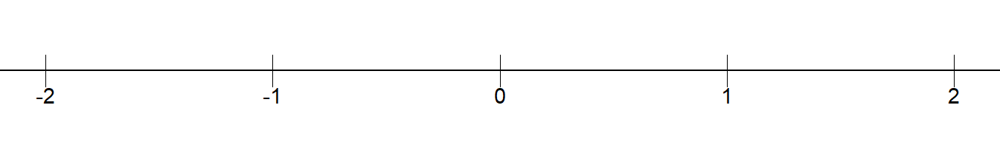
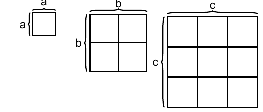

# Basics {#chap-grundlaggande-matematik-1}

This chapter goes through basic mathematics. A challenge with introductions is that you want everything to come first. Some concepts may seem abstract or lack clear motivation initially, but will hopefully become clearer further along.

## Different types of numbers

In mathematics, there are different types of numbers. In this book, we work almost exclusively with real numbers, which are all "ordinary" numbers:

- Positive numbers = All numbers above 0. For example: 5 and 0.00123.

- Negative numbers = All numbers below 0. For example: $-1$.

- Integers = All numbers that can be written without decimals, for example the number 0 or the number 23. Examples of numbers that are not integers are $3.14$ and $5.1$.

- Rational numbers = All numbers that can be expressed as a quotient (fraction) of two other integers. Example: $\frac{7}{9}$, which can be read as "7 divided by 9".

- Irrational numbers = All numbers that cannot be expressed as a quotient of two integers. Irrational numbers have an infinite number of decimals and the decimals do not end in a repeating pattern. A well-known example of an irrational number is the number Pi, which is approximately $3.141592$. Pi is a circle's circumference divided by its diameter (the distance from edge to edge). Pi is written with the Greek letter lowercase pi, $\pi$, and is often rounded to two decimals: $\pi=3.14$.

Real numbers include, among others, the following values:

| $-2$| 0 | 0.00123 | 2.19 | 5 | 27 |
| --- | --- | --- | --- | --- | --- |

In English periods are used as decimal separators. Many countries instead use a comma as decimal separator. All integers can be written with decimals if desired. The integer 17 can, for example, be written as 17.0 or 17.00, or 17.000 and so on. As a rule, we omit the decimals when all decimals (all decimal places) are 0 in a number. The zeros after the decimal point do not provide the reader with any interesting information. The same applies if we have, for example, the number 6.8. It does not help the reader to write this as 6.80 or 6.8000.

Real numbers can be described as being located on a number line with larger values to the right and smaller values to the left. Numbers above 0 are called positive numbers. Numbers below 0 are called negative numbers. If there is no sign in front of a digit, the number is positive. If there is a minus sign in front, the number is negative. Figure \@ref(fig:tallinjen) shows a number line with some integers around 0.

(\#fig:tallinjen)The number line

 A number's absolute value is the number's distance from 0 on the number line. The absolute value of the number 5 is 5. The absolute value of $-5$ is also 5. Absolute value is written with vertical bars. Here are three examples:

$$
\begin{align}
\left|5\right| & =5\\
\left|-5\right| & =5\nonumber \\
\left|4-18\right| & =|-14|=14\nonumber 
\end{align}
$$

Numbers that when divided by 2 result in a new integer are called even numbers. For example, the number 12 is even because $12/2=6$. Since 6 is an integer, 12 is even. All even numbers multiplied by themselves result in a new even number. If the result of division by 2 becomes a number with decimals, the number being divided is an odd number. For example, the number 11 is an odd number because $11/2=5.5$. All odd numbers multiplied by themselves always result in a new odd number. For example:

$$
\begin{equation}
3\times3=9
\end{equation}
$$

Both the number 3 and 9 are odd numbers, which is easy to see since $3/2=1.5$ and $9/2=4.5$. Two other examples: $5\times5=25$ and $7\times7=49$. The numbers 5, 7, 25 and 49 are odd numbers. Here are two examples: 

$$
\begin{align}
2\times2 & =4\\
6\times6 & =36\nonumber 
\end{align}
$$

The numbers 2, 4, 6 and 36 are even numbers. Sometimes we find it useful to rewrite a fraction as a number with decimals, for example $1/2=0.5$, or $\frac{1}{4}=0.25$. Some fractions cannot be written exactly with decimals. One such example is $1/3\approx0.33333....$ Numbers that can be expressed exactly as a fraction with two integers are called rational numbers. Numbers that cannot be expressed as a fraction with two integers are called irrational numbers. A well-known example of an irrational number is pi, $\pi\approx3.14$. All real numbers can be written in the form of a fraction where we divide the number by 1. All real numbers can also be expressed as the number multiplied by 1. As an example, the number 123 is the same as $1*123$ and $123/1$:

$$
\begin{equation}
123=1*123=\frac{123}{1}
\end{equation}
$$

 The number 1 can be written as a fraction with the same numerator and denominator:

$$
\begin{align}
1 & =\frac{123}{123}=\frac{5}{5}=\frac{17.3}{17.3}
\end{align}
$$

## The four arithmetic operations

We have four arithmetic operations:

- Addition $\left(+\right)$

- Subtraction $\left(-\right)$

- Multiplication $\left(\text{written as }*\text{ or }\times\text{ or \,}\cdot\right)$

- Division $\left(\text{written as }/\text{ or }\div\right)$

The equals sign $\left(=\right)$ means that the result to the left of the sign becomes the same as the result to the right of the sign. The equals sign is also called the equality sign. Example: $1+2=3$. The left side of the equals sign is sometimes called the left-hand side, while the right side is called the right-hand side. When two or more numbers are added or subtracted, these numbers are called terms. The result of addition is called the sum:

$$
\begin{equation}
\underbrace{1}_{\text{Term 1}}+\underbrace{2}_{\text{Term 2}}=\underbrace{3}_{\text{Sum}}
\end{equation}
$$

 The result from subtraction is called the difference:

$$
\begin{equation}
\underbrace{1}_{\text{Term 1}}-\underbrace{2}_{\text{Term 2}}=\underbrace{-1}_{\text{Difference}}
\end{equation}
$$

When two or more numbers are multiplied, the numbers are called factors. The result of multiplication is called the product:

$$
\begin{equation}
\underbrace{1}_{\text{Factor 1}}\times\underbrace{2}_{\text{Factor 2}}=\underbrace{2}_{\text{Product}}
\end{equation}
$$

 Multiplication can be written with any of the three symbols $\left(*,\times,\cdot\right)$. There are several different symbols for the same arithmetic operation, but they mean exactly the same thing. For example:

$$
\begin{align}
2\times4*2\cdot2 & =4*2*2*2=2*2*2*4=32
\end{align}
$$

This is perhaps a good example of how mathematics can be described as a language, a way of writing. The main thing is that the reader understands what you write. In division we have a number that we call the numerator, which is divided by another number, which we call the denominator. The result is called the quotient: 

$$
\begin{equation}
\text{Quotient}=\frac{\text{Numerator}}{\text{Denominator}}
\end{equation}
$$

Division can also be written in several ways, for example $\frac{1}{2}$ or $1/2$, which have the same meaning. The expressions $\frac{1}{2}$ and $1/2$ can be read as "one divided by two" or "one over two". We must also take into account parentheses and powers. A power is a mathematical expression where a number, the base, is raised to another number, the exponent:

$$
\begin{equation}
\text{Power}=\text{Base}^{\text{Exponent}}
\end{equation}
$$

An example of a power expression is $10^{2}$, which can be read as "10 to the power of 2". 10 is the base and 2 is the exponent. The exponent indicates how many times the base should be multiplied by itself. For example:

$$
\begin{align}
10^{2} & =10*10=100\\
2^{3} & =2*2*2=8\nonumber \\
3^{4} & =3*3*3*3=81\nonumber 
\end{align}
$$

## Order of operations

There is a specific order for how we should perform the different arithmetic operations:

1. Parentheses

1. Powers

1. Multiplication and division, from left to right in each expression

1. Addition and subtraction, from left to right in each expression

We will now calculate an expression that contains multiplication, addition and subtraction. We therefore start with all multiplication signs, regardless of where in the expression they appear:

$$
\begin{equation}
4+1*2-3=4+2-3
\end{equation}
$$

This expression should be read as four plus one times two minus three equals four plus two minus three. The words "equals" mean that the result on both sides of the equals sign $\left(=\right)$ has the same value and gives the same result. In the next step we calculate addition and subtraction from left to right. In this case it doesn't matter if we first calculate addition and then subtraction, or vice versa:

$$
\begin{equation}
4+2-3=4-1=6-3=3
\end{equation}
$$

For plus and minus it doesn't matter in which order the numbers appear:

$$
\begin{equation}
-1+2+3+4+5=13
\end{equation}
$$

Even if we change the order of the terms to the left of the equals sign we get the same result, as long as the mathematical operator in front of the number (plus or minus) follows:

$$
\begin{equation}
2-1+3+4+5=13
\end{equation}
$$

Note that when a positive number, above 0, appears first in the expression we don't need to write out the plus sign. In multiplication it doesn't matter which of the numbers being multiplied comes first or last. In the order of operations, in the introduction to this section, points 3 and 4 describe how we should first calculate multiplication and division. This should also be calculated from left to right. Here is an example when this rule is important:

$$
\begin{equation}
1/2/2/2
\end{equation}
$$

This expression can be read as 1 divided by 2, divided by 2, divided by 2. If we read the numbers from the left, which is correct, we get:

$$
\begin{align}
\text{\textbf{Correct!} } & \text{Solving from the left:}\nonumber \\
\left(1/2\right)/2/2 & =\left(\left(1/2\right)/2\right)/2\\
 & =\left(1/4\right)/2\nonumber \\
 & =1/8\nonumber \\
 & =0.125\nonumber 
\end{align}
$$

If we instead solve the equation from the right, which is incorrect, we get:

$$
\begin{align}
\textbf{Incorrect! } & \text{Solving from the right: }\nonumber \\
1/2/\left(2/2\right) & =1/2/\left(1\right)\\
 & =1/\left(2/1\right)\nonumber \\
 & =1/2\nonumber \\
 & =0.5\nonumber 
\end{align}
$$

 In row 2 we see the result from the parentheses, 2 divided by 2, which gives the result 1. On the second-to-last row we have 1 divided by 2, which equals 0.5. That a calculation continues on the next line has no mathematical meaning. It is merely a way of writing to make reading easier. Here in the book we also use it so that the mathematical expressions fit on the pages. Let us take another example:

$$
\begin{equation}
2\times3\div4\times5
\end{equation}
$$

This calculation contains both multiplication $\left(\times\right)$ and division $\left(\div\right)$. The calculation rules say that these two should be calculated simultaneously but from left to right. Let us calculate the answer from both left and right to compare:

$$
\begin{align}
\begin{array}{c|c}
\text{\textbf{Correct!} From the left.} & \text{\textbf{Incorrect!} From the right.}\\
2\times3\div4\times5= & 2\times3\div4\times5=\\
=6\div4\times5= & =2\times3\div20=\\
=\frac{3}{2}\times5= & =2\times\frac{3}{20}=\\
=\frac{15}{2}= & =\frac{6}{20}=\\
=7.5 & =0.3
\end{array}
\end{align}
$$

 The order of operations says that we should first calculate parentheses, powers and then multiplication and division, as well as addition and subtraction. Consider the following expression as an example:

$$
\begin{equation}
\left(1/2/2\right)^{2}\times\left(1+2\right)^{3}
\end{equation}
$$

 We start by calculating the contents of the parentheses. In the left parenthesis we calculate from left to right:

$$
\begin{equation}
\left(\frac{1}{4}\right)^{2}\times\left(3\right)^{3}=\left(\frac{1}{4}*\frac{1}{4}\right)\times3^{3}=\frac{1}{16}\times9=\frac{9}{16}
\end{equation}
$$

 When two parentheses are multiplied by each other, it is common for the multiplication sign to be omitted:

$$
\begin{equation}
\left(\frac{1}{4}\right)\times\left(3\right)=\left(\frac{1}{4}\right)\left(3\right)
\end{equation}
$$

The rest of this chapter goes through in more detail how to calculate with parentheses (section \@ref(sec-parenteser) ), division (section \@ref(sec-brak) ) and powers (section \@ref(sec-potenser) ).

## Parentheses {#sec-parenteser}

Parentheses can be used to make extensive mathematical expressions easier to read. There are special calculation rules for parentheses. If there is a minus sign in front of a parenthesis, it affects all terms inside the parenthesis. If we remove the parenthesis, all signs change from minus to plus and from plus to minus. For example:

$$
\begin{align}
1-\left(-2+3\right) & =1+2-3=0
\end{align}
$$

A plus sign in front of the parenthesis does not change any signs in the parenthesis: 

$$
\begin{equation}
1+\left(-2+3\right)=1-2+3=2
\end{equation}
$$

When multiplying numbers in parentheses, corresponding calculation rules apply. Multiplication of two negative numbers becomes a positive number. Multiplication of a negative and a positive number becomes a negative number. Examples:

$$
\begin{align}
-1*\left(-2+3\right) & =2-3
\end{align}
$$

Or we could take:

$$
\begin{equation}
1*\left(-2+3\right)=-2+3
\end{equation}
$$

 Multiplication of a parenthesis affects all values in the parenthesis:

$$
-1\times\left(2+3+4+5\right)=-14
$$

 All real numbers multiplied by 0 become 0:

$$
0\times-1\times\left(1-2-3-4-5\right)=0
$$

Here follow some illustrations of calculation rules for parentheses where we use the letters $a,\,b,\,c,\,d$ and $e$ to symbolize arbitrary real numbers. We use letters to describe general rules. The reader may try replacing the letters with numbers. We start by multiplying $a$ by the parenthesis $\left(b+c\right)$, where $a$ is multiplied by each letter in the parenthesis:

$$
\begin{equation}
a\left(b+c\right)=ab+ac
\end{equation}
$$

It is also possible to illustrate the same thing with numbers:

$$
\begin{align}
2\left(3+4\right) & =2*3+2*4=6+8=14
\end{align}
$$

It doesn't matter whether the number we multiply the parenthesis by is to the left or right of the parenthesis. Here is an example where we rewrite an expression in different ways, but all different writings give the same result:

$$
\begin{align}
c\left(a+b\right)d & =cd\left(a+b\right)\\
 & =\left(a+b\right)cd\nonumber \\
 & =\left(ca+cb\right)d\nonumber \\
 & =cda+cdb\nonumber 
\end{align}
$$

A parenthesis may also be multiplied with another parenthesis. Each number in each parenthesis is then multiplied by each number in the other parenthesis. Let us take an example again where we rewrite an expression in different ways. All these different ways of writing give the same result:

$$
\begin{align}
\left(a+b\right)\left(c+d\right) & =ac+ad+b\left(c+d\right)\\
 & =ac+ad+bc+bd\nonumber \\
 & =a\left(c+d\right)+b\left(c+d\right)\nonumber \\
 & =c\left(a+b\right)+d\left(a+b\right)\nonumber 
\end{align}
$$

Many times our work can be made easier by rewriting an expression so that it becomes a bit neater. When we write multiplication with letters, it is common to omit the multiplication sign. It also doesn't matter in which order the numbers appear: 

$$
\begin{align}
a*b & =ab=ba=b*a
\end{align}
$$

The same thing if we have an expression where we combine letters and numbers. Here is an example where the letter $x$ symbolizes an arbitrary number: 

$$
\begin{align}
x*100 & =x100=100x
\end{align}
$$

The multiplication sign may be omitted when we multiply parentheses: 

$$
\begin{equation}
4*\left(3-2\right)=4\left(3-2\right)
\end{equation}
$$

## Equality and inequality

If we change something on one side of the equals sign $\left(=\right)$ we must make corresponding changes on the other side of the equals sign. Otherwise the meaning of the equals sign becomes incorrect. If we take the expression $1+2=3$ for example, then we can subtract 2 from both sides of the equals sign: 

$$
\begin{align}
1+2-2 & =3-2\\
1 & =1\nonumber 
\end{align}
$$

Or we can multiply both sides by 3:

$$
\begin{align}
2*\left(1+2\right) & =2*\left(3\right)\\
2*3 & =2*3\nonumber \\
6 & =6\nonumber 
\end{align}
$$

There are also symbols for inequalities, so-called inequality signs. Here are some examples of inequality signs:

$$
\begin{align*}
> & \quad\text{Greater than}\\
< & \quad\text{Less than}\\
\geq & \quad\text{Greater than or equal to}\\
\leq & \quad\text{LEss than or equal to}\\
\neq & \quad\text{Not equal to}
\end{align*}
$$

Let us go through some examples:

$$
\begin{align}
a & >4\\
b & <5\nonumber \\
c & \geq7\nonumber \\
d & \leq8\nonumber \\
e & \neq6\nonumber 
\end{align}
$$

The first line $a>4$ means that the letter $a$ symbolizes a value that can be anything greater than 4. The second line $b<5$ means that $b$ symbolizes an arbitrary value that is less than 5. The third line $c\geq7$ means that c is an arbitrary value that is equal to or greater than 7. The fourth line $d\leq8$ means that d is a number that is less than or equal to 8. In the fifth line $e\neq6$ the letter $e$ is a value that is not equal to 6. This means that the letter e can symbolize any value as long as it is not 6. For example $5.99$ or 452.

If we have an expression with an inequality sign and change something on one side, we sometimes must also change on the other side for the inequality sign to still apply. Alternatively, we must change the inequality sign. When we multiply or divide by negative numbers, this can result in the inequality having to be changed to be correct. Example:

$$
\begin{align}
-4 & >-5\\
-4\times\left(-1\right) & >-5\times\left(-1\right)\nonumber \\
\text{\textbf{Incorrect!} }\,\,4 & >5\nonumber 
\end{align}
$$

 The first and second lines are correctly executed but the third line is incorrect. In this situation when we use multiplication by a negative value (-1) we must reverse the inequality sign:

$$
\begin{align}
-4\times\left(-1\right) & >-5\times\left(-1\right)\\
4 & <5\nonumber 
\end{align}
$$

 Now it's correct. There may be multiple inequality signs in the same equation:

$$
\begin{equation}
0<a<1
\end{equation}
$$

This means that $a$ symbolizes a value that is greater than 0 but less than 1. Both inequalities in the expression must apply simultaneously. Since the inequality signs do not include the values 0 and 1, $a$ can be very close to 0 or 1, but not exactly 0 or 1.

## Fractions {#sec-brak}

In the introduction to this chapter we described how when dividing two numbers a numerator is divided by a denominator and that the result is called a quotient. Another word for this is fraction:

$$
\begin{equation}
\text{Fraction}=\text{Quotient}=\frac{\text{Numerator}}{\text{Denominator}}=\text{Numerator/Denominator}
\end{equation}
$$

 The words "numerator" and "denominator" refer to the placement above or below the fraction line. The fraction line is also called the division sign. This can be read as numerator divided by denominator or numerator divided by denominator. Fractions are often used to describe a portion of something: "three-quarters full." It has no mathematical meaning whether we write the fraction vertically, $\frac{3}{4}$, or on one line and separate the numerator and denominator with a slash /, such as $3/4$. We can also write division as $3\div4$. All three ways of writing mean the same thing:

$$
\begin{align}
\frac{3}{4} & =3/4=3\div4=0.75
\end{align}
$$

We can read this as three divided by four or three quarters or 0.75. If we multiply a fraction by a number, only the numerator is multiplied:

$$
\begin{align}
\frac{1}{2}\times3 & =\frac{1\times3}{2}=\frac{3}{2}
\end{align}
$$

When a fraction is multiplied by another fraction, we multiply the numerators together and the denominators together:

$$
\begin{align}
\frac{1}{2}\times3 & =\frac{1}{2}\times\frac{3}{1}=\frac{1\times3}{2\times1}=\frac{3}{2}
\end{align}
$$

The same principle applies to fractions with different numerators and denominators. Here we have two fractions that are multiplied by each other:

$$
\begin{align}
\frac{a}{b}\times\frac{c}{d} & =\frac{a\times c}{b\times d}=\frac{ac}{bd}
\end{align}
$$

 where the letters $a,\,b,\,c$ and $d$ symbolize different arbitrary numbers. The letters are only meant to describe that these rules are general, regardless of which real numbers the letters represent. Another example: 

$$
\begin{align}
\frac{1}{3}*\frac{4}{6} & =\frac{1*4}{3*6}=\frac{4}{18}
\end{align}
$$

If both the numerator and denominator are multiplied by the same number, we can cancel this number. Here is an example where we cancel the letter b:

$$
\begin{align}
\frac{a}{b}*\frac{b}{c} & =\frac{ab}{cb}=\frac{a\cancel{b}}{c\cancel{b}}=\frac{a}{c}
\end{align}
$$

Or the same thing, but with some numbers:

$$
\begin{align}
\frac{1}{3}\times\frac{3}{2} & =\frac{1\times\cancel{3}}{\cancel{3}\times2}=\frac{1}{2}
\end{align}
$$

Another example:

$$
\begin{align}
\frac{1*2*3*4}{1*2*3} & =\frac{24}{6}=4
\end{align}
$$

Another way to describe this calculation is to cancel factors that appear in both the numerator and denominator:

$$
\begin{equation}
\frac{\cancel{1*2*3}*4}{\cancel{1*2*3}}=4
\end{equation}
$$

 Fractions can be positive and negative. The fraction $-\frac{1}{2}$ can be read as minus one half. If there is no sign in front of the fraction, the number is positive. If only one of the numerator and denominator is negative, the entire fraction becomes negative:

$$
\begin{equation}
\frac{-1}{3}=-\frac{1}{3}=\frac{1}{-3}
\end{equation}
$$

 Or like this:

$$
\begin{align}
\frac{1+2+3+4}{-1}+1 & =-\frac{10}{1}+1=-9
\end{align}
$$

If both the numerator and denominator are negative numbers, the fraction becomes positive: 

$$
\begin{align}
\frac{-2}{-3} & =\frac{\cancel{\left(-1\right)}2}{\cancel{\left(-1\right)}3}=\frac{2}{3}
\end{align}
$$

Often it can help to convert the numbers so that two fractions get the same denominator, that is, the same value below the division line. We can do this by multiplying or dividing both the numerator and denominator in a fraction by the same number. As long as we perform multiplication or division by the same value on the entire numerator and the entire denominator, the value of the fraction does not change: 

$$
\begin{align}
\frac{2}{4} & =\frac{2/2}{4/2}=\frac{1}{2}=0.5
\end{align}
$$

The same thing but we multiply both the numerator and denominator by the number 3:

$$
\begin{align}
\frac{2*3}{4*3} & =\frac{6}{12}=\frac{1}{2}=0.5
\end{align}
$$

 The fraction $6/12$ gives exactly the same result as the fraction $2/4$, the fraction $1/2$ and the fraction $\frac{2*3}{4*3}$. Another way to see this is to multiply both the numerator and denominator by an arbitrary number that we can call a:

$$
\begin{align}
\frac{2*a}{4*a} & =\frac{2}{4}*\frac{\cancel{a}}{\cancel{a}}=0.5
\end{align}
$$

 We cancel a from the numerator and denominator since we multiply a by the entire numerator and the entire denominator. Fractions can be divided by other fractions. This is often useful. Here is an example where each new expression gives the same result:

$$
\begin{align}
\frac{0.5}{0.5} & =\frac{\left(\frac{10}{20}\right)}{\left(\frac{1}{2}\right)}=\frac{2*\frac{1}{2}}{1}=\frac{2/2}{1}=\frac{1}{1}
\end{align}
$$

 One more example:

$$
\begin{align}
\frac{1/2}{3/4} & =\frac{4*\left(\frac{1}{2}\right)}{3}=\frac{2}{3}
\end{align}
$$

## Least common denominator

Now we will add the following two fractions: 

$$
\begin{equation}
\frac{1}{3}+\frac{4}{6}
\end{equation}
$$

 To do this we need to find the least common denominator of the two fractions, where the denominator is the value below the division line. The least common denominator for two fractions is the lowest value we can use as the denominator in both fractions and still write both fractions as integers. To find the least common denominator we convert both fractions so that they get the same denominator. We do this by converting the first fraction so that its denominator becomes 6. To find the number we need to use for this we first divide the denominator in fraction no. 2 by the denominator in fraction no. 1: 

$$
\begin{equation}
\frac{6}{3}=2
\end{equation}
$$

 Then we multiply only the first fraction by the number 2:

$$
\begin{equation}
\frac{1}{3}*2=\frac{2}{6}
\end{equation}
$$

 Let us describe this entire calculation based on our original expression:

$$
\begin{equation}
2*\left(\frac{1}{3}\right)+\frac{4}{6}=\frac{2}{6}+\frac{4}{6}=\frac{6}{6}=1
\end{equation}
$$

 Another method for finding common denominators is to multiply each numerator and denominator by the denominators from all other fractions. Example: 

$$
\begin{align}
 & \frac{1}{2}+\frac{1}{3}+\frac{1}{4}+\frac{1}{5}=\\
= & \frac{1*\left(3*4*5\right)}{2*\left(3*4*5\right)}+\frac{1*\left(2*4*5\right)}{3*\left(2*4*5\right)}+\frac{1*\left(2*3*5\right)}{4*\left(2*3*5\right)}+\frac{1*\left(2*3*4\right)}{5*\left(2*3*4\right)}=\nonumber \\
= & \frac{60+40+30+24}{120}=\nonumber \\
= & \frac{154}{120}=\nonumber \\
= & \frac{77}{60}\nonumber 
\end{align}
$$

Let us take another example where we mix letters and numbers. The letters symbolize arbitrary numbers and it doesn't matter which numbers they are: 

$$
\begin{align}
 & \,\frac{a}{2}+\frac{b}{3}+\frac{c}{4}=\\
= & \,\frac{a*3*4}{2*3*4}+\frac{b*2*4}{3*2*4}+\frac{c*2*3}{4*2*3}=\nonumber \\
= & \,\frac{12a+8b+6c}{24}\nonumber 
\end{align}
$$

 As long as we don't know more about what the letters $a$, $b$ and $c$ symbolize, there is also no way to solve this expression. If we separate the numbers so that this becomes separate fractions we easily get back to the original expression or something similar: 

$$
\begin{align}
\frac{12a+8b+6c}{24} & =\frac{12}{24}a+\frac{8}{24}b+\frac{6}{24}c=\frac{a}{2}+\frac{b}{3}+\frac{c}{4}
\end{align}
$$

 A type of notation that is good to be familiar with is the following:

$$
\begin{align}
\frac{a-b}{b} & =\frac{a}{b}-\frac{b}{b}=\frac{a}{b}-1
\end{align}
$$

 We simplify the first fraction $\frac{a-b}{b}$ by dividing it into the two fractions $\frac{a}{b}-\frac{b}{b}$. This works when we have terms in the numerator that are separated by plus and minus. We can also divide fractions with multiple terms in the numerator:

$$
\begin{align}
\frac{a+b*c-d}{fg} & =\frac{a}{fg}+\frac{b}{fg}*\frac{c}{fg}-\frac{d}{fg}
\end{align}
$$

 In this context, however, it is important to point out a common mistake. While we can split the numerators and keep the denominator, we generally cannot split the denominator and keep the numerator. As an example, the fraction $\frac{b}{a-b}$ generally cannot be split into two separate fractions. This probably becomes easier to see if we use numbers instead. The left side in the following example is not the same as the right side:

$$
\begin{align}
\frac{6}{3-2} & \neq\frac{6}{3}-\frac{6}{2}\\
\frac{6}{1} & \neq2-3\nonumber \\
6 & \neq-1\nonumber 
\end{align}
$$

 Above we went through how we can rewrite two fractions so that they get the same denominator by multiplying different fractions by each other's denominators. Here is another way to describe this method:

$$
\begin{align}
\frac{a}{b}*\frac{d}{d}+\frac{c}{d}*\frac{b}{b} & =\frac{ad}{bd}+\frac{cb}{db}=\frac{ad+cb}{bd}
 (\#eq:dd-bb-braken)
\end{align}
$$

 The first fraction's numerator $\left(a\right)$ and denominator $\left(b\right)$ are multiplied by $d$, since this is the right fraction's denominator. This can be described as multiplying the first fraction by a fraction consisting of $d/d$. The right fraction is instead multiplied by the fraction $b/b$, since $b$ is the left fraction's denominator. The same method can also be used if we have more than two fractions with different denominators. Here is an example with three fractions:

$$
\begin{align}
 & \,\frac{a}{b}+\frac{c}{d}+\frac{e}{f}=\\
= & \,\frac{a}{b}\left(\frac{d}{d}*\frac{f}{f}\right)+\frac{c}{d}\left(\frac{b}{b}*\frac{f}{f}\right)+\frac{e}{f}\left(\frac{b}{b}*\frac{d}{d}\right)=\nonumber \\
= & \,\left(\frac{adf}{bdf}\right)+\left(\frac{cbf}{dbf}\right)+\left(\frac{ebd}{fbd}\right)=\nonumber \\
= & \,\frac{adf+cbf+ebd}{bdf}\nonumber 
\end{align}
$$

 In row two, each fraction's numerator and denominator are multiplied by the numerators from the other two fractions. This results in the three fractions getting one and the same denominator and can thereby be written as one large fraction.

## Powers {#sec-potenser}

In the introduction to this chapter we defined power expressions (exponential expressions) as $\text{Power}=\text{Base}^{\text{Exponent}}$. Powers mean, among other things, that we can express large numbers in compressed form, for example: 

$$
\begin{align}
5^{3} & =5*5*5=125\\
5^{9} & =9,765,625\nonumber 
\end{align}
$$

If we have the base $b$ with exponent 2, this is called $b$ squared . We can think of it as a figure with two dimensions: height and width, where all sides of the figure are equally long, that is, a square where all four sides have length b. The number $1^{2}$ can be thought of as a square where height and width are equal to 1. We can write this as $1^{2}=1\times1=1$. This can be read as the square where both width and height are equal to 1 has an area that is 1 area unit. Which unit of measurement is used doesn't matter. It can be centimeters or miles. If the square's sides are 1 cm long, the area is 1 square centimeter.

The number $2^{2}$ can be thought of as a square where width multiplied by height becomes $2\times2=2^{2}=4$. The number $3^{2}=$ a $3\times3$ square. Figure \@ref(fig:tre-kvadrater) illustrates this with three squares. The smallest square has height and width = a with area $a^{2}=a\times a$. The middle square has height = width = $b$ and area = $b^{2}$. The largest square has height = width = $c$ and area = $c^{2}$.

(\#fig:tre-kvadrater)Three squares

A square whose area is calculated as $2^{2}$ can be described as being 4 area units. Exactly what the word area units represents depends on which unit the square's length and width are given in. A square whose width and height are 2 centimeters has an area of 4 square centimeters. If the exponent is instead 3, such as $2^{3}$, it is called cubed. The number $2^{3}$ can be thought of as a cube with three dimensions: width, height and length. If this cube's width, height and length are 2 centimeters, the cube's volume is 8 cubic centimeters.

Illustrating mathematics in pictures is often helpful. But illustrations also have their limitations. For example, no advanced method is required to calculate $2^{4}$. But there is no simple way in which a four-dimensional figure can be illustrated. Even parentheses can have powers and then the same calculation rules for parentheses apply as otherwise. For example, if we multiply two parentheses with a negative number, the result becomes a positive number: 

$$
\begin{align}
\left(-2\right)^{3} & =\left(-2\right)*\left(-2\right)*\left(-2\right)=\left(4\right)*\left(-2\right)=-8
\end{align}
$$

If two power expressions are multiplied with each other and they have the same base, the exponents can be added. For example: 

$$
\begin{align}
2^{2}*2^{3} & =2^{2+3}=2^{5}
\end{align}
$$

 This can also be seen by writing out all numbers:

$$
\begin{align}
2^{2}*2^{3} & =\left(2*2\right)*\left(2*2*2\right)=2*2*2*2*2=2^{5}
\end{align}
$$

The expression with the letters $a$ and $b$ for arbitrary real numbers: 

$$
\begin{equation}
a\left(a+b\right)=a^{2}+ab
\end{equation}
$$

First the number $a$ outside the parentheses is multiplied with the first letter inside the parentheses, which is also an a. We then get $a*a=a^{2}$. Then a outside the parentheses is multiplied with the second letter in the parentheses, which is b. We then get $a*b=ab$. Let us show the same thing but with numbers

$$
\begin{align}
2\left(2+3\right) & =2^{2}+2*3=4+6=10
\end{align}
$$

When dividing powers with the same base, the exponents can be subtracted: 

$$
\begin{align}
\frac{3^{4}}{3^{2}} & =3^{4-2}=3^{2}=9
\end{align}
$$

Another way to write the same thing:

$$
\begin{align}
\frac{3^{4}}{3^{2}} & =\frac{3*3*\cancel{3*3}}{\cancel{3*3}}=\frac{3*3}{1}=3^{2}=9
\end{align}
$$

This also means that when a power stands as denominator in a fraction, the power can be written as numerator with the opposite sign in front of the exponent:

$$
\begin{align}
3^{-2} & =\frac{1}{3^{2}}=\frac{1}{9}
\end{align}
$$

 Or for example:

$$
\begin{equation}
4^{5}=\frac{1}{4^{-5}}
\end{equation}
$$

 Here is another example where we move the denominator to the nominator, and vice versa:

$$
\begin{align}
\frac{2^{-3}}{3^{-5}} & =2^{-3}*3^{5}=\frac{3^{5}}{2^{3}}
\end{align}
$$

A power consists of base and exponent. The entire power expression can in turn have an additional exponent. In that case the two exponents can be multiplied:

$$
\begin{align}
\left(4^{2}\right)^{3} & =4^{2}*4^{2}*4^{2}=4^{2*3}=4^{6}
\end{align}
$$

Powers do not need to be whole numbers. A form of powers that is often used is numbers between 0 and 1. For example $9^{\frac{1}{2}}$, the number 9 raised to one half. Another common way to write the same thing is the following: 

$$
\begin{equation}
9^{\frac{1}{2}}=\sqrt[2]{9}=\sqrt{9}
\end{equation}
$$

This expression is called the square root of 9, or taking the root of the number 9. The square root of a number a is the number that multiplied by itself becomes the number a. If we take the square root of 9 we get $9^{1/2}=\pm3$ since both $3^{2}=9$ and $\left(-3\right)^{2}=9$. Suppose we call the number that multiplied by itself becomes a the letter b. The calculation rule for square root can then be summarized: 

$$
\begin{align}
a^{\frac{1}{2}} & =\pm b\\
\text{where }\left(\pm b\right)^{2} & =a\nonumber 
\end{align}
$$

The expression square root comes from the fact that it is precisely the number 2 we use. If we are only interested in the positive b-value, this is called seeking the positive square root. Often when we are to calculate the square root of a number, it is precisely the positive square root we seek. The square root is so commonly occurring that this is often described only with the symbol $\sqrt{}$, without the number 2. If the exponent is one third, that is $\sqrt[3]{}$, this is called the cube root. The cube root of the number c is the number that multiplied by itself 3 times becomes c: 

$$
\begin{align}
c^{\frac{1}{3}} & =\sqrt[3]{c}=\pm b\\
\text{where }\left(\pm b\right)^{3} & =c\nonumber 
\end{align}
$$

The cube root of the number 8 is 2 since $2^{3}=2*2*2=8$. Any real number can be an exponent: positive, negative, rational and irrational numbers. The rules for roots follow from how powers are defined. As an example:

$$
\begin{align}
8^{\frac{1}{3}}*8^{\frac{1}{3}}*8^{\frac{1}{3}} & =8^{\frac{1}{3}+\frac{1}{3}+\frac{1}{3}}=8^{1}=8
\end{align}
$$

Another way to write the same thing:

$$
\begin{align}
8^{\frac{1}{3}}*8^{\frac{1}{3}}*8^{\frac{1}{3}} & =2*2*2=2^{3}=8
\end{align}
$$

 

Table: Exponent properties (\#tab:rakneregler-for-potenser)

| 1 | $a^{b}*a^{c}=a^{b+c}$| 2 |
| --- | --- | --- |
| $\frac{1}{a^{b}}=a^{-b}$| 3 | $\frac{a^{b}}{a^{c}}=a^{b-c}$|
| 4 | $\left(a^{b}\right)^{c}=a^{bc}$| 5 |
| $\left(\frac{a}{b}\right)^{c}=\frac{a^{c}}{b^{c}}=a^{c}*b^{-c}$| 6 | $\left(a*b\right)^{c}=a^{c}*b^{c}$|
| 7 | $a^{1}=a$| 8 |
| $a^{0}=1$| | |

Table \@ref(tab:rakneregler-for-potenser) summarize some useful properties and rules for exponents and powers. The letters $a$, $b$ and $c$ represent arbitrary real numbers. The first rule means that if we multiply two power expressions with the same base, the exponents can be added as follows: 

$$
\begin{align}
5*5^{2} & =5^{1}*5^{2}=5^{1+2}=5^{3}=125
\end{align}
$$

 where we also use the power rule $a^{1}=a$(row 7 in the table), which describes how all real numbers can be written as power expressions with exponent 1. Row 2 in table \@ref(tab:rakneregler-for-potenser) means that the sign in front of the exponent changes if the power is moved between numerator and denominator:

$$
\begin{align}
a^{b}\left(\frac{c+d}{e-f}\right) & =\frac{1}{a^{-b}}\frac{\left(c+d\right)}{\left(e-f\right)}=\frac{c+d}{a^{-b}e-a^{-b}f}
\end{align}
$$

The calculation rule on row 8 means that all real numbers raised to the power of 0 equal 1. Sometimes we may encounter fractions where the numerator or denominator also consists of a fraction. Then it can help to rewrite the values as power expressions:

$$
\begin{align}
\frac{2}{\frac{1}{2}} & =\frac{2^{1}}{\frac{1^{1}}{2^{1}}}=\frac{2^{1}}{1^{1}*2^{-1}}=\frac{2^{1}*2^{1}}{1}=2*2=4
\end{align}
$$

 Note how the exponent for the number 2 changes sign from $2^{1}$ to $2^{-1}$ and back to $2^{1}$ as we move the number between numerator and denominator.

## Parentheses with powers {#sec-multiplikation-med-parentes}

Parentheses can also have powers. For example:

$$
\begin{align}
\left(2+3\right)^{2} & =\left(2+3\right)\left(2+3\right)\\
 & =2*2+2*3+3*2+3*3\nonumber \\
 & =4+6+6+9\nonumber \\
 & =25\nonumber 
\end{align}
$$

Or like this:

$$
\begin{align}
\left(1+2+3\right)^{2} & =6^{2}=6*6=36
\end{align}
$$

If we put a minus sign in front of this parenthesis, the result becomes negative:

$$
\begin{align}
-\left(1+2+3\right)^{2} & =-\left(\left(1+2+3\right)^{2}\right)\\
 & =-\left(\left(6\right)^{2}\right)\nonumber \\
 & =-\left(6^{2}\right)\nonumber \\
 & =-\left(36\right)\nonumber \\
 & =-36\nonumber 
\end{align}
$$

Here is an example with negative numbers in a parenthesis squared:

$$
\begin{align}
\left(-1-2-3\right)^{2} & =\left(-6\right)^{2}=\left(-6\right)\left(-6\right)=36
\end{align}
$$

In this example, the letters $a$ and $b$ represent arbitrary numbers:

$$
\begin{align}
\left(a+b\right)^{2} & =\left(a+b\right)\left(a+b\right)=a^{2}+ab+ba+b^{2}
 (\#eq:parentes-kvadrat)
\end{align}
$$

Since $ab=ba$ we may simplify this expression a bit to:

$$
\begin{align}
\left(a+b\right)^{2} & =a^{2}+ab+ba+b^{2}\\
 & =a^{2}+ab+ab+b^{2}\nonumber \\
 & =a^{2}+2ab+b^{2}\nonumber 
 (\#eq:parentes-kvadrat-ersultat)
\end{align}
$$

The calculation in equation \@ref(eq:parentes-kvadrat) and \@ref(eq:parentes-kvadrat-ersultat) is sometimes called notable products, meaning that they are common patterns which may be handy to learn by hand. The second notable product shows how a parenthesis with subtraction squared can be calculated:

$$
\begin{align}
\left(a-b\right)^{2} & =\left(a-b\right)\left(a-b\right)\\
 & =a^{2}-ab-ba+b^{2}\nonumber \\
 & =a^{2}-2ab+b^{2}\nonumber 
\end{align}
$$

For multiplication of two parentheses with addition in one and subtraction in the other we get:

$$
\begin{align}
\left(a+b\right)\left(a-b\right) & =a^{2}-ab+ba-b^{2}=a^{2}-b^{2}
\end{align}
$$

To summarize we have here the following notable products:

$$
\begin{align}
\text{Square of the sum:} & \left(a+b\right)^{2}=a^{2}+2ab+b^{2}\\
\text{Square of the difference:} & \left(a-b\right){}^{2}=a^{2}-2ab+b^{2}\nonumber \\
\text{Difference of two squares:} & \left(a+b\right)\left(a-b\right)=a^{2}+ab-ab-b^{2}=a^{2}-b^{2}\nonumber 
 (\#eq:notable-products)
\end{align}
$$

Notice that the same rules apply if we replace the letters in the equations with more comprehensive mathematical expressions. Suppose we have $c=\left(a+b\right)$ and $b=2a$ and want to calculate $c^{2}$. We then get:

$$
\begin{align}
c^{2} & =\left(a+b\right)^{2}\\
 & =\left(a+2a\right)^{2}\nonumber \\
 & =a^{2}+2a\left(2a\right)+\left(2a\right)^{2}\nonumber \\
 & =a^{2}+4a^{2}+4^{2}\nonumber \\
 & =9a^{2}\nonumber 
\end{align}
$$

## Factorization and divisibility {#sec-faktorisering-och-delbarhet}

To be able to simplify expressions, it is also good to be comfortable with factorization. Factorization means that we factor out a common denominator, a factor, that can be multiplied with the affected terms. We start with an example where we factor out the number 5 from the following expression:

$$
\begin{align}
5x+10=5\left(x+2\right)
\end{align}
$$

Just as before, the letter $x$ here represents an arbitrary number. That we use a different letter has no mathematical significance. Let us now factorize the expression 25+125. In this case, we can factor out 25: 

$$
\begin{align}
25+125 & =25\left(1+5\right)
\end{align}
$$

We may also use the notable products in equation \@ref(eq:notable-products) . Suppose we have the expression $x^{2}-25$. This we may rewrite in the following way:

$$
\begin{align}
x^{2}-25 & =\left(x+5\right)\left(x-5\right)=x^{2}-5x+5x-25=x^{2}-25
\end{align}
$$

When we work with powers, it is often useful to think about how one may rewrite the power expression as factors with multiplication. For example:

$$
\begin{align}
\left(\frac{1}{2}\right)^{3} & =\left(\frac{1}{2}\right)\left(\frac{1}{2}\right)\left(\frac{1}{2}\right)=\frac{1*1*1}{2*2*2}=\frac{1}{8}
\end{align}
$$

If we have a parenthesis with an exponent and multiple expressions in the parenthesis, the entire parenthesis should be multiplied by itself. For example:

$$
\begin{align}
\left(\frac{1}{4}+\frac{2}{5}\right)^{2} & =\left(\frac{5+8}{20}\right)^{2}=\left(\frac{13}{20}\right)\left(\frac{13}{20}\right)=\frac{169}{400}
\end{align}
$$

This can in turn be compared with if we multiply two different parentheses:

$$
\begin{align}
\left(3+\frac{2}{3}\right)\left(2-3\right) & =\left(\frac{11}{3}\right)\left(-1\right)=-\frac{11}{3}
\end{align}
$$

Suppose we have a fraction $\frac{a}{b}$ where a and b are arbitrary integers, not equal to 0. If $\frac{a}{b}$ results in a new integer that we call $c$ where $c$ is yet another integer, this is called $a$ being divisible by $b$. The number $b$ is in that case called a divisor of $a$. The number $b$ can be described as a factor in $a$.

If we have $\frac{5}{4}=1.25$, then 4 is not a divisor of 5 since the result 1.25 is not an integer. The decimal value from division is also called a remainder. For example: $\frac{5}{4}=1+\frac{1}{4}=1$ remainder $\frac{1}{4}$. Suppose we now have the fraction $\frac{a}{b}=c$. We can now multiply the left and right sides by $b$ and divide both sides by $c$. In this way we swap places between $b$ and $c$(see section \@ref(sec-brak) ): 

$$
\begin{align}
\frac{a}{b} & =c\\
\frac{a}{c} & =b\nonumber 
 (\#eq:c-delare-till-a)
\end{align}
$$

Since $a$, $b$ and $c$ are integers, equation \@ref(eq:c-delare-till-a) illustrates that both $b$ and $c$ are divisors of $a$. Consider the following example with numbers. The number 2 is a divisor of 6:

$$
\begin{equation}
\frac{6}{2}=3
\end{equation}
$$

The number 3 is an integer, which is a requirement for calling 2 a divisor. The number 3 is also a divisor of 6 since $\frac{6}{3}=2$. Factorization instead means that we break up the number into two or more factors. For the number 6, the numbers 3 and 2 are factors:

$$
\begin{equation}
2\times3=6
\end{equation}
$$

Prime numbers are the positive integers greater than 1 that are only divisible by 1 and themselves. The number 6 is not a prime number since this number has the divisors 1, 2, 3 and 6. The first prime numbers are 2, 3, 5, 7 and 11. Prime numbers can, among other things, be used to find all divisors of a number by writing a number as a factor of prime numbers. This is called prime factorization. Since prime numbers are only divisible by 1 and themselves, there is only one way to prime factorize each integer.

The numbers 2 and 3 are prime numbers and therefore $2*3=6$ is a prime factorization of the number 6. Prime factorization of $9=3*3=3^{2}$. Let us prime factorize the number 121. One way to do this is to test the first prime numbers. This is often a good method since many numbers are divisible by precisely these prime numbers. We try to divide 121 by 2, 3, 5, 7 and 11 and get:

$$
\begin{align}
\frac{121}{11} & =11
\end{align}
$$

This means that $11^{2}=121$ and 11 is thus a divisor of 121. Based on the unique prime factorization, it is now possible to find all possible divisors of the number by combining the prime numbers with each other. Let us take the number 24 as an example. Prime factorization gives

$$
\begin{align}
24 & =2^{3}*3=2*2*2*3
\end{align}
$$

We get the divisors $2*2=4$, $2*2*2=8$ and $2*3=6$. This we can in turn see by taking:

$$
\begin{align}
\frac{24}{2} & =12\\
\frac{24}{3} & =8\nonumber \\
\frac{24}{4} & =6\nonumber \\
\frac{24}{6} & =4\nonumber \\
\frac{24}{8} & =3\nonumber 
\end{align}
$$

## Sum {#sec-summa}

The sum of a collection of numbers can be written with the symbol $\sum$ which is the Greek letter capital sigma. The use of $\sum$ is so common that this is called the summation symbol or summation sign. Say for example that we have a set consisting of the three numbers 4, 5 and 6. The set (not the sum) with these numbers we call $X$ and each individual number we call $x_{i}$ where $i$ indicates which of the numbers it is: $x_{1}=4$, $x_{2}=5$ and $x_{3}=6$. In total we have $n$ amount of numbers where $n=3$. The sum of the numbers in $X$ can be described like this:

$$
\begin{align}
\sum_{i=1}^{n=3}x_{i} & =x_{1}+x_{2}+x_{3}=4+5+6=15
 (\#eq:summa-ex-1)
\end{align}
$$

If we write $\sum_{i=1}^{n}$ the symbols $i=1$ and $n$ mean that we should sum from observation number $i=1$ up to observation number $i=n$. Since $n$ indicates the number of observations, this means that we should sum all values. The summation symbol is thus an abbreviation for addition. This can also be combined with other arithmetic operations. For example

$$
\begin{align}
\sum_{i=1}^{3}\frac{x_{i}}{2} & =\frac{4}{2}+\frac{5}{2}+\frac{6}{2}=7,5
 (\#eq:summa-med-div-ex-2)
\end{align}
$$

The notation $\sum_{i=1}^{3}$ with $i=1$ and 3 above means that we sum the values $i=1$ to $i=3$ for all numbers $x_{i}$. Since division by 2 is not affected by the summation $\frac{1}{2}$ can be moved to the left of the summation:

$$
\begin{equation}
\sum_{i=1}^{3}\frac{x_{i}}{2}=\frac{1}{2}*\sum_{i=1}^{3}x_{i}
\end{equation}
$$

 where the value $\frac{1}{2}$ is constant, it is the same regardless of which value $x_{i}$ has. That these two expressions give the same result as equation \@ref(eq:summa-ex-1) and \@ref(eq:summa-med-div-ex-2) . Here is another example where we factor out multiplication by 3:

$$
\begin{align}
\sum_{i=1}^{3}3x_{i} & =3*4+3*5+3*6=45\\
3\sum_{i=1}^{3}x_{i} & =3*15=45\nonumber 
\end{align}
$$

If instead of addition we want to multiply a collection of values and calculate the sum of this product, this is called calculating the product sum, which is written with $\Pi$(the Greek letter capital Pi)

$$
\begin{align}
\prod_{i=1}^{n=3}x_{i} & =x_{1}*x_{2}*x_{3}=4*5*6=120
\end{align}
$$

## Median {#sec-median}

Median is the middle value in a collection of values. Mathematically this can be described as having a collection of numbers that we sort from lowest to highest. We call the collection of numbers for $X$. Each number is numbered as $x_{1},x_{2},...,x_{n}$, where $n$ is the amount of numbers. If we have the numbers 4, 5, 6 then $x_{1}=4,x_{2}=5$ and $x_{3}=6$, and the amount of numbers $n=3$. The median depends on whether $n$ is an even or odd number: 

$$
\begin{align}
\text{Median }=x_{\frac{n+1}{2}} & \text{, if }n\text{ is an odd number}\\
\text{Median }=\frac{x_{\frac{n}{2}}+x_{\frac{n+2}{2}}}{2} & \text{, if }n\text{ is an even number}\nonumber 
 (\#eq:median)
\end{align}
$$

This might look more complicated than it is. We have the three numbers 4, 5, 6 and $n=3$. Since $n$ is an odd number, we use the upper definition from equation \@ref(eq:median) which gives us:

$$
\begin{align}
x_{\frac{n+1}{2}} & =x_{\frac{3+1}{2}}=x_{2}=5
\end{align}
$$

 where $x_{2}$ is the second number in our collection. Let us take an example where we seek the median in the following collection of values:

| $x_{i}$| 1 | 1 | 1 | 4 | 5 | 6 | 6 | 6 | 7 | 8 | 8 | 9 | 9 | 9 | 9 | 9 |
| --- | --- | --- | --- | --- | --- | --- | --- | --- | --- | --- | --- | --- | --- | --- | --- | --- |
| $i$| 1 | 2 | 3 | 4 | 5 | 6 | 7 | 8 | 9 | 10 | 11 | 12 | 13 | 14 | 15 | 16 |

The upper row $x_{i}$ are the values and the lower row $i$ are the order numbers. We have here $n=16$, which is why we use the median's second definition in equation \@ref(eq:median) :

$$
\begin{align}
\frac{x_{\frac{n}{2}}+x_{\frac{n+2}{2}}}{2} & =\frac{x_{\frac{16}{2}}+x_{\frac{16+2}{2}}}{2}=\frac{6+7}{2}=6,5
\end{align}
$$

 The median is between the eighth and ninth values, $x_{8}$ and $x_{9}$.

## Mean {#sec-medelvarde}

Another useful measure for average value is the mean, which is defined in the following way: 

$$
\begin{equation}
\text{Mean}=\frac{\text{Total of the numbers we want to calculate the mean for}}{\text{Amount of numbers}}
\end{equation}
$$

Let us calculate the mean for the three numbers 4, 5 and 6. The sum of the numbers $\left(4+5+6\right)$ is divided by the amount of numbers $\left(3\right)$:

$$
\begin{align}
\text{Mean} & =\frac{4+5+6}{3}=\frac{15}{3}=5
\end{align}
$$

The mean is often written with a bar over it, which is why the mean for all the values in $X$ can be written $\bar{X}$. The calculation of this mean can then be described:

$$
\begin{equation}
\bar{X}=\frac{\sum_{i=1}^{n}x_{i}}{n}
 (\#eq:medelvarde)
\end{equation}
$$

Now we shall calculate the mean of the numbers 3, 5, 4, 6 and 7. Each value we call $x_{i}$ where $x_{1}=3,x_{2}=5,x_{3}=4,x_{4}=6$ and $x_{5}=7$. The entire collection of the five numbers we call $X$. The mean $\bar{X}$ can be calculated as:

$$
\begin{align}
\bar{X} & =\frac{\sum_{i=1}^{5}x_{i}}{5}=\frac{3+5+4+6+7}{5}=5
\end{align}
$$

If instead of $\sum_{i=1}^{5}$ we write $\sum_{i=2}^{4}$ we sum the second, third and fourth values in the number series. Since we now take the mean of three numbers, the denominator in the expression will change from 5 to 3:

$$
\begin{align}
\bar{X} & =\frac{\sum_{i=2}^{4}x_{i}}{3}=\frac{5+4+6}{3}=5
\end{align}
$$

## Weighted mean {#sec-viktat-medelvarde}

A type of mean that is often useful is what is called weighted mean. As the name suggests, this is a mean where each value is weighted. Suppose we have two school classes, A and B, with 10 and 20 students in each class respectively. On the latest math test, the students in the two classes had on average 32 and 42 points respectively. If we just take the mean of these two values we get:

$$
\begin{equation}
\text{Mean: }\frac{32+42}{2}=37
\end{equation}
$$

But this mean takes no account of the fact that one school class is twice as large and therefore does not give a correct picture of the students' average result. The weighted mean is calculated by taking the sum of each value multiplied by weight and dividing by the sum of the weights: 

$$
\begin{equation}
\text{Weighted mean: }\bar{X}_{\text{Weighted}}=\frac{\sum_{i}^{n}x_{i}v_{i}}{\sum v_{i}}
\end{equation}
$$

 where n is the number of observations, $x_{i}$ is the value for observation $i$ and $v_{i}$ is the weight that belongs to each value. Let us use this equation to calculate a weighted mean where we use the number of students in each class as weight. We multiply the two test scores by the number of students in the classes: 

$$
\begin{align}
\bar{X}_{\text{viktat}} & =\frac{\sum_{i}^{2}x_{i}v_{i}}{\sum_{i}^{2}v_{i}}=\frac{32*10+42*20}{10+20}\approx38.67
\end{align}
$$

The weighted mean becomes approximately 38.67. This gives a more representative picture of the students' test results, compared to the unweighted mean. The denominator in the equation is the sum of the weights. The weights in this case are the number of school students in each class: $\sum_{i}^{2}v_{i}=10+20$.

Consider another example. An unweighted mean of the three values 1, 2 and 3 is $6/3=2$. Now we shall redo this calculation but let value 3 have twice as much weight as values 1 and 2. We therefore give value 3 the weight 50% and values 1 and 2 the weight 25% each: 

$$
\begin{align}
\bar{X}_{\text{weighted}} & =\frac{\sum\text{obs}_{i}\text{weight}_{i}}{\sum\text{weight}_{i}}=\frac{1*0.25+2*0.25+3*0.5}{0.25+0.25+0.5}=2.25
\end{align}
$$

## Percent and per mille {#sec-procent-och-promille}

Fractions can be used to calculate a portion of something, for example percent $\left(\%\right)$ or per mille $\left(\permil\right)$. The word percent means per hundredth and per mille means per thousand. Another way to describe per hundredth and per thousandth is as fractions divided by one hundred and one thousand respectively: 

$$
\begin{align}
\text{One percent} & =\frac{1}{100}=1\%\\
\text{One per mille} & =\frac{1}{1,000}=1\permil\nonumber 
\end{align}
$$

Suppose we have 100,000 apples and shall throw away 13% of these. To calculate how many apples we shall throw away we take: 

$$
\begin{align}
100,000\times\frac{13}{100} & =\frac{100,000\times13}{100}=\frac{1,300,0\cancel{00}}{1\cancel{00}}=13,000
\end{align}
$$

Sometimes the word percentage rate is used to describe a proportion in percent. In this example, the percentage rate of apples that we shall throw away is 13%. When calculating with percent, one sometimes wants to calculate percentage change as well as change in number of percentage points. Say for example that you have 500 and receive 25, so your total wealth has increased from 500 to 525. To calculate how large the increase is calculated in percent, we take the increase as a percentage share of the original amount, 25/500, and divide both numerator and denominator by 5, so that the numerator becomes 100: 

$$
\begin{align}
\frac{25}{500}=\frac{25/5}{500/5} & =\frac{5}{100}=0.05=5\%
\end{align}
$$

Say now that you receive an additional 25. This increase in percent becomes:

$$
\begin{equation}
\frac{25}{525}\approx0.0476=4.76\%
\end{equation}
$$

 where $\approx$ means approximately equal to. The number 0.0476 is 4.76 percent. To know how many percent your wealth has increased from the original sum 500, we divide the total increase 50 by the original sum:

$$
\begin{align}
\frac{50}{500} & =\frac{50/5}{500/5}=\frac{10}{100}=10\%
\end{align}
$$

The International Labour Organization (ILO), an agency under the organization United Nations, UN, estimates that in 2016 on average 40 million people in the world lived under slavery-like conditions. The same year, the earth's population was 7.426 billion. Let us calculate what proportion of the earth's population lived under slavery-like conditions, calculated as percent and per mille:

$$
\begin{align}
\text{Percent: }\frac{40}{7,426}*100 & =0.00539*100=0.539\%\\
\text{Per mille: }\frac{40}{7,426}*1000 & =0.00539*1,000=5.39\permil\nonumber 
\end{align}
$$

These figures suggest that approximately half a percent, or 5.4 per mille, of the earth's population live under slavery-like conditions.

Suppose we have a tax that is 32% on average. In fraction form this is $\frac{32}{100}$ or with decimals 0.32. If a person has 20,000 USD that shall be taxed at this percentage rate. To calculate 32% of 20,000 USD:

$$
\begin{align}
\frac{32}{100}*20,000 & =\frac{32*20,000}{100}=6,400
\end{align}
$$

Note that the number 20,000 can also be written as a fraction:

$$
\begin{align}
\frac{32}{100}*\frac{20,000}{1} & =\frac{32*20,000}{100*1}=\frac{640,000}{100}=6,400
\end{align}
$$

 

Table: The same value described in different ways (\#tab:decimal-brak-potens-procent-promille)

| Decimal number | Fraction | Power | Percent | Per mille | 0.01 |
| --- | --- | --- | --- | --- | --- |
| $\frac{\ensuremath{1}}{100}$| $10^{-2}$| 1% | 10‰ | 0.05 | $\frac{5}{100}$|
| $5*10^{-2}$| 5% | 50‰ | 0.1 | $\frac{\ensuremath{1}}{10}$| $10^{-1}$|
| 10% | 100‰ | 0.1011 | $\frac{1,011}{10,000}$| $1,011*10^{-4}$| 10.11% |
| 101.1‰ | 0.5 | $\frac{\ensuremath{1}}{2}$| $2^{-1}$| 50% | 500‰ |
| 0.75 | $\frac{3}{4}$| $3*4^{-1}=3*2^{-2}$| 75% | 750‰ | 1 |
| $\frac{1}{1}$| $1^{1}*1^{-1}$| 100% | 1,000‰ | 2.5 | $\frac{5}{2}$|
| $5*2^{-1}$| 250% | 2 500‰ | 10.3 | $\frac{103}{10}$| $103*10^{-1}$|
| 1,030% | 10,300‰ | | | | |

We have now covered several key mathematical concepts including decimal numbers, fractions, percent, per mille, and powers. In mathematics, the same numerical value can often be expressed in multiple equivalent forms. Being able to convert between these different representations while maintaining the same value is a fundamental skill that helps solve problems more efficiently. Table \@ref(tab:decimal-brak-potens-procent-promille) demonstrates various ways to express identical values using decimal numbers, fractions, powers, percentages, and per mille.

## Combinatorics {#sec-kombinatorik}

Combinatorics is a part of mathematics that among other things can be used to calculate the number of possible combinations of two phenomena. Consider an example with more characters and possible combinations. Suppose we shall choose one letter and one number. The Swedish alphabet has 29 letters and we have 10 different numbers to choose from 0–9. Among the possible combinations we have for example $a1,a2,a3,...,b7,b8,b9,...,k5,k6$ and so on. The number of possible combinations is given by the number of possible choices multiplied with each other:

$$
\begin{equation}
\text{Number of letters in the alphabet}\times\text{Number of digits}=29\times10=290
\end{equation}
$$

Erik has three t-shirts and two pairs of jeans. From these he can choose $3\times2=6$ combinations when he shall go out. Now we shall select two of the letters $a,\,b$ and c and combine these. We may choose the same letter twice. We then have nine possible combinations: $aa,\,bb,\,cc,\,ab,\,ba,\,ac,\,ca,\,bc$ and $cb$. One way to calculate this is to take the number of possible characters (3) raised to the power of the number of characters to be chosen (2):

$$
\begin{equation}
3^{2}=3*3=9
\end{equation}
$$

The same thing applies if the number of possible combinations increases. Say that you shall choose a password for your email and it must be at least 12 characters long. Each character can consist of a letter from the Swedish alphabet, one of the numbers 0 to 9 or one of the following 10 special characters: !, ", #, ¤, %, &, /, (, ) and =. To calculate the number of possible combinations, we add the possible alternatives for each character:

$$
\begin{equation}
29\text{ letters}+10\text{ digits}+10\text{ special characters}=49
\end{equation}
$$

The number of possible passwords can then be calculated to:

$$
\begin{equation}
49^{12}=191,581,231,380,566,000,000
\end{equation}
$$

This number can be read as approximately 191.6 trillion, where 1 trillion is written with a one and 18 zeros. This enormous number of possible combinations is exactly why strong passwords are crucial for cybersecurity, using long passwords with a mix of letters, numbers and symbols etc. When hackers attempt to break into accounts, they often simply try different password combinations until they find the correct one. With $49^{12}≈191.6$ trillion possible combinations, even a powerful computer trying millions of passwords per second would need an impractically long time to test every possibility.

Now we shall calculate how many ways the letters can be arranged $\left\{ a,b,c\right\}$ without using any letter twice in the same combination. In total we have 6 different ordered combinations: $abc,acb,cab,bac,bca$ and $cba$.

Ordered combinations are called permutations. To calculate the number of permutations, the number of ordered combinations, we take the number of alternatives and multiply this with each integer down to 1: 

$$
\begin{align}
3! & =3*2*1=6
\end{align}
$$

 The expression 3! can be read as three factorial. For eight different alternatives we get:

$$
\begin{align}
8! & =8*7*6*5*4*3*2*1=40,320
\end{align}
$$

Generally, it holds that 0!=1. To understand this we may imagine a scenario where we shall choose to put on some nice clothes when we shall go to a party and want to calculate the number of possible combinations. We realize that we don't have any clothes we like and therefore have 0 alternatives. But not choosing any clothes is also a type of combination.

The total number of possible combinations therefore becomes 1. Factorial is according to the same logic only defined for non-negative integers, the natural numbers: 0, 1, 2,... and so on. A general way to describe the above permutations is that if n is an arbitrary natural number then it holds for all natural numbers that:

$$
\begin{equation}
n!=n*\left(n-1\right)*\left(n-2\right)*...*3*2*1
 (\#eq:permutationer)
\end{equation}
$$

If $n=13$ then $13!$ means that we get:

$$
\begin{equation}
13!=13*12*11*...*3*2*1
\end{equation}
$$

Say now that we again shall choose among the letters $\left\{ a,b,c\right\}$ but we shall only arrange 2 of these. When we choose the first letter we have three to choose from. When we then shall choose the next letter we have two left to choose from. If we as the first letter chose c we have left a or b to choose from as the second letter. The number of possible combinations is in this case $3*2=6$. To describe this more generally we may rewrite equation \@ref(eq:permutationer) to: 

$$
\begin{equation}
n*\left(n-1\right)*...*\left(n-k+1\right)
\end{equation}
$$

 where $n$ is still an arbitrary number and $k$ is the number that we shall choose. The number $k$ must by definition here be a number between 0 and $n$. So in the case where we have three letters and shall select two we have that $n=3$ and $k=2$. The number of possible alternatives can then be described as: 

$$
\begin{align}
3*\left(3-2+1\right) & =3*2=6
\end{align}
$$

 This equation can also be written like this:

$$
\begin{align}
n*\left(n-1\right)*...*\left(n-k+1\right)=\frac{n!}{\left(n-k\right)!}
 (\#eq:permutationer-generellt)
\end{align}
$$

 Let us use this new equation to calculate the number of possible combinations of the three letters $\left\{ a,b,c\right\}$ if we shall select two of them:

$$
\begin{align}
\frac{n!}{\left(n-k\right)!} & =\frac{3!}{\left(3-2\right)!}=\frac{3*2*1}{1!}=\frac{6}{1}=6
\end{align}
$$

Let us take another example. We find ourselves now in the future. You have become a mathematical genius and rich from your many brilliant inventions. But you feel bored and decide to sort your luxury cars. You have a total of 12 cars and now want to calculate how many different ways you can combine two of your cars on the driveway to your enormous house. We have $n=12$ and $k=2$. The total number of possible arrangements is given by: 

$$
\begin{align}
\frac{n!}{\left(n-k\right)!} & =\frac{12!}{\left(12-2\right)!}=\frac{12*11*10*9*8*7*6*5*4*3*2*1}{10*9*8*7*6*5*4*3*2*1}
\end{align}
$$

Since all numbers in the denominator are also found in the numerator the fraction can be simplified by deleting the same multipliers in the numerator as in the denominator. We mark the numbers that shall be crossed out with parentheses: 

$$
\begin{align}
\frac{12*11*\left(10*9*8*7*6*5*4*3*2*1\right)}{\left(10*9*8*7*6*5*4*3*2*1\right)}=12*11=132
\end{align}
$$

For the first car you have 12 to choose from. When you shall choose the second you have 11 to choose from. Equation \@ref(eq:permutationer-generellt) can also be used for the first examples in this section. To calculate $n!$ for all possible combinations of all available alternatives, that is $k=n$, we get:

$$
\begin{align}
n! & =\frac{n!}{\left(n-k\right)!}=\frac{n!}{\left(n-n\right)!}=\frac{n!}{0!}=\frac{n!}{1}=n!
\end{align}
$$

Even the absence of alternatives is a possible alternative. If we have $n$ possible alternatives but choose not to choose any of these, $k=0$, we get:

$$
\begin{align}
\frac{n!}{\left(n-k\right)!} & =\frac{n!}{\left(n-0\right)!}=\frac{n!}{n!}=1
\end{align}
$$

So far our selected values have been placed in a specific order, for example $acb$ or $bca$. If we are uninterested in the order, the alternatives $abc,acb,bca,bac,cab$ and $cba$ count as only one alternative.

When we are not interested in which order the values stand in, this is called a combination. If we have n possible alternatives, select k number from these and want to know the number of possible combinations, it can be calculated in the following way:

$$
\begin{equation}
\binom{n}{k}=\frac{n!}{\left(n-k\right)!*k!}
 (\#eq:kombinationer-utan-ordning-binomialkoeff)
\end{equation}
$$

 The notation $\binom{n}{k}$ can be read as "n over k". If we select two $\left(k=2\right)$ from three alternatives $\left(n=3\right)$:

$$
\begin{align}
\binom{n}{k} & =\frac{n!}{\left(n-k\right)!*k!}=\frac{3!}{\left(3-2\right)!2!}=\frac{3*\cancel{2*1}}{1*\cancel{2*1}}=3
\end{align}
$$

Let the three alternatives be the letters $\left\{ a,b,c\right\}$. The possible alternatives are then $ab,ac,bc$. Let us take the example with the 12 luxury cars again, $n=12$ and $k=2$, but without internal order: 

$$
\begin{align}
\binom{n}{k} & =\frac{n!}{\left(n-k\right)!*k!}\\
 & =\frac{12!}{\left(12-2\right)!2!}\nonumber \\
 & =\frac{12*11*\left(10*9*8*7*6*5*4*3*2*1\right)}{\left(10*9*8*7*6*5*4*3*2*1\right)*2*1}\nonumber \\
 & =\frac{12*11}{2}\nonumber \\
 & =6*11\nonumber \\
 & =66\nonumber 
\end{align}
$$

Another useful trick is to think symmetrically about combinatorial problems. Say for example that we have the letters $\left\{ a,b,c\right\}$ and shall choose two of these. This can either be set up as choosing 2 letters, alternatively choosing 1 letter that shall remain:

$$
\begin{align}
\binom{3}{2} & =\binom{3}{1}\\
\frac{3!}{\left(3-2\right)!2!} & =\frac{3!}{\left(3-1\right)!1!}\nonumber \\
\frac{3*\cancel{2*1}}{1*\cancel{2*1}} & =\frac{3*\cancel{2*1}}{\cancel{2*1}*1}\nonumber \\
\frac{3}{1} & =\frac{3}{1}\nonumber 
\end{align}
$$

This can generally be described as:

$$
\begin{equation}
\binom{n}{k}=\binom{n}{n-k}
 (\#eq:n-over-k-n-over-n-k)
\end{equation}
$$

To see this one can substitute the right side of this expression into equation \@ref(eq:kombinationer-utan-ordning-binomialkoeff) and then in the fraction replace $k$ with $n-k$: 

$$
\begin{align}
\binom{n}{n-k} & =\frac{n!}{\left(n-\left(n-k\right)\right)!\left(n-k\right)!}=\binom{n}{k}
\end{align}
$$

## Chapter summary

- Real numbers: all values on the number line, integers, rational and irrational numbers. The four arithmetic operations: addition, subtraction, multiplication and division. One may also use powers, parentheses and fractions. Addition: terms and sum. Subtraction: terms and difference. Multiplication: factors and product. Division: numerator, denominator and quotient. Order of operations: parentheses, powers, multiplication, division, addition and subtraction, from left to right.

- Absolute value describes a number's distance from 0 on the number line. Example: $\left|-1\right|=1$. Equality $\left(=\right)$ and inequality (for example $>$ and $<$) describe the relation between values. Mathematical operations on one side of the equals sign must be matched by operations on the other side. Percent means hundredth, $1/100=1\%$. Per mille means thousandth, $1/1,000=1\permil$. Factorization means that we factor out a common factor. Prime numbers are the positive integers greater than 1 that are only divisible by 1 and themselves. Example: 2, 3, 5, 7, 11.

- Power = $\text{base}^{\text{exponent}}$. Example: $2^{3}=2*2*2=8$. For $a^{\frac{1}{2}}=b$, where $a$ is an arbitrary number, $b$ is the number that multiplied by itself becomes $a$. That is: $b^{2}=a$. $a^{\frac{1}{2}}=\sqrt{a}=$ square root of $a$. $a^{\frac{1}{3}}=$ cube root of $a$.

- Notable products include $\left(a+b\right)^{2}=a^{2}+2ab+b^{2}$, and $\left(a-b\right)^{2}=a^{2}-2ab+b^{2}$, and: $\left(a+b\right)\left(a-b\right)=a^{2}-b^{2}$.

- Mean: $\frac{\sum_{i=1}^{n=3}x_{i}}{n}=\frac{x_{1}+x_{2}+x_{3}}{3}$. Weighted mean: $\frac{\sum_{i}^{n}x_{i}v_{i}}{\sum v_{i}}$ where $v_{i}$ is weight for each value $x_{i}$. Median is the middle value. Product sum: $\prod_{i=1}^{n=3}x_{i}=x_{1}*x_{2}*x_{3}$.

-$3^{2}=9$: Number of combinations with repetition when we choose 2 values from a set with 3 values. Three factorial: $3!=3*2*1=6$= number of permutations, possible combinations without repetition with order. Number of permutations when we choose $k$ alternatives from $n$ values: $\frac{n!}{\left(n-k\right)!}$. Possible combinations $k$ from $n$ alternatives without order: $\binom{n}{k}=\frac{n!}{\left(n-k\right)!k!}$.

## Exercises

