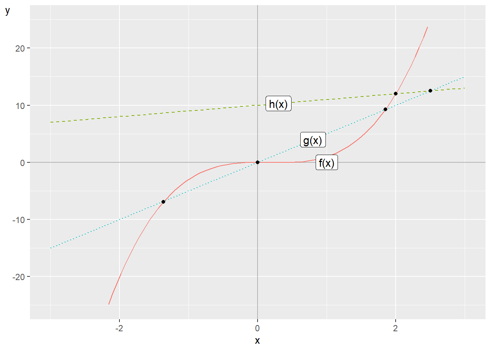
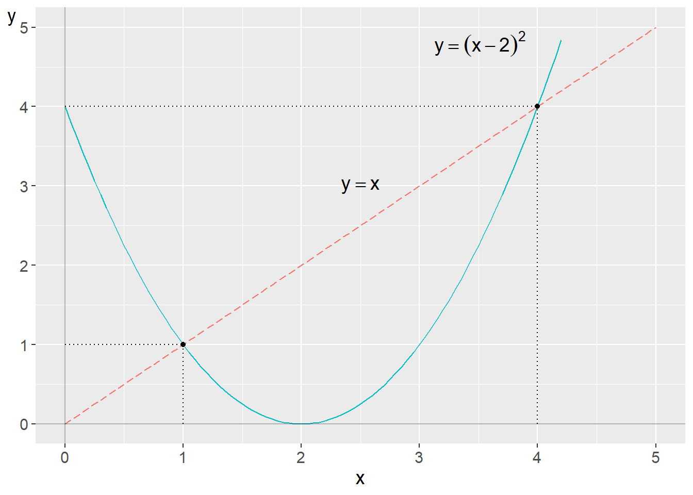
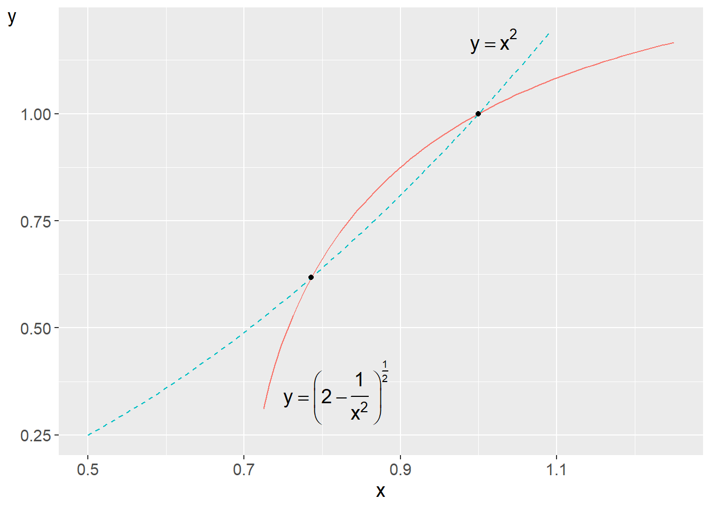
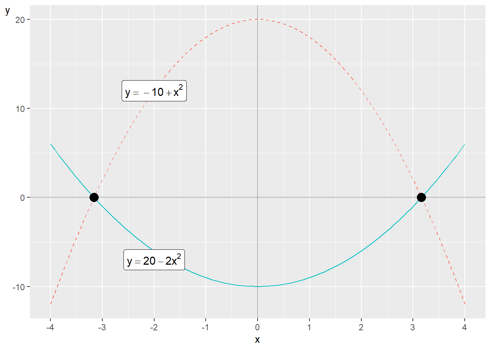
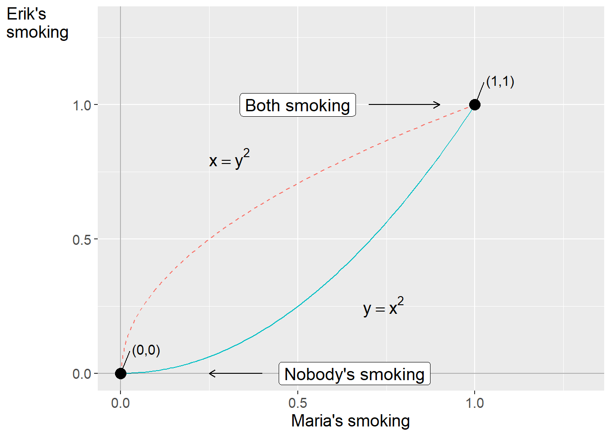
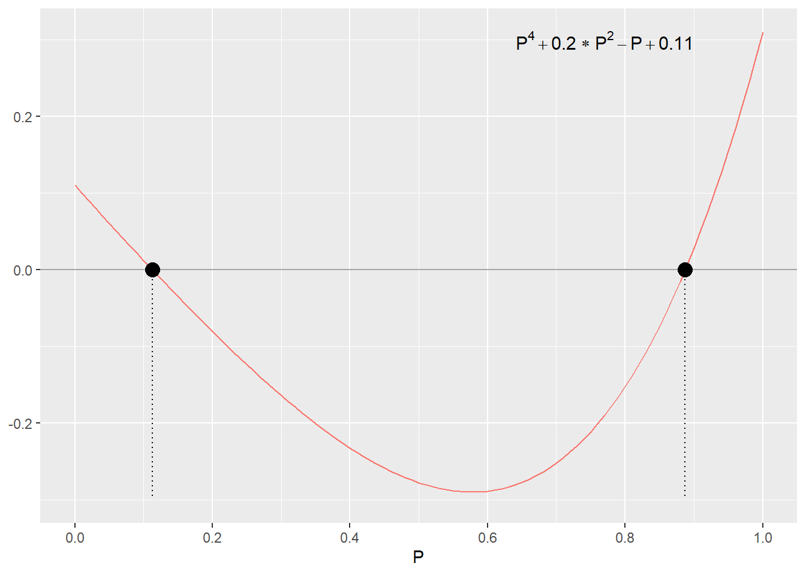
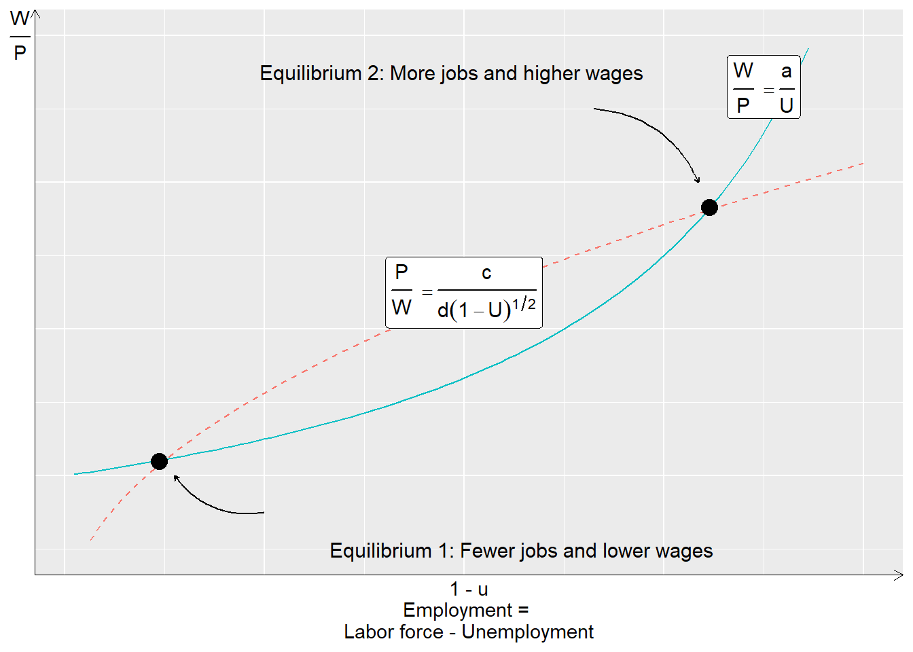

# Non-linear equations in systems {#chap-ickelinjara-ekvationer-i}

Non-linear equations can also be included in systems together. This can help us describe theories and reason about different phenomena. Non-linear equation systems can be more difficult to work with compared to linear equation systems. But sometimes this type of equations can also be solved in similar ways to linear ones. This chapter gives a brief introduction with some examples from social science.

## Solutions with non-linear systems

As described above, for linear equation systems we can know in advance how many solutions we can expect given certain conditions: none, one or infinitely many solutions. With non-linear equation systems there are no such rules. If the lines in a graph are not straight they can meet 0, 1, 2, 3 or however many times up to infinity. This can be illustrated by comparing the following equations:

$$
\begin{align}
\begin{cases}
f\left(x\right) & =2x^{3}-x^{2}+7\\
g\left(x\right) & =5x\\
h\left(x\right) & =10+x
\end{cases}
\end{align}
$$

 and plot these in figure \@ref(fig:exempel-pa-ickelinjara) . There is no $x$-value for which all three functions meet, so a system with these three functions thus lacks solutions. The first function, $f\left(x\right)$, is the solid line. The second function, $g\left(x\right)$, is the dotted line and the third function, $h\left(x\right)$, is the dashed line. 

(\#fig:exempel-pa-ickelinjara)Example of a non-linear equation system

Function $f\left(x\right)$ is non-linear while the other two are linear. Since function $g\left(x\right)$ only has one slope coefficient, the number 5, and no coefficient for y-intercept, the line intersects the y-axis at $x=y=0$. At this point, $\left(x,y\right)=\left(0,0\right)$, function $f\left(x\right)$ also intersects the y-axis, which is also seen in the figure.

The lines for $f\left(x\right)$ and $g\left(x\right)$ meet at three points. A system with only these two functions would therefore have three solutions. The lines for $f\left(x\right)$ and $h\left(x\right)$ meet at one point and a system with only these two functions would therefore have a unique solution. The lines for $g\left(x\right)$ and $h\left(x\right)$ meet at the point $x=10/4=2.5$.

## Substitution

There are several basic methods that we can use to solve non-linear equation systems. One of these is substitution. Suppose we have a system with the following two equations and the two variables $y$ and $x$:

$$
\begin{equation}
\begin{cases}
y=x\\
y=\left(x-2\right)^{2}
\end{cases}
\end{equation}
$$

 The first equation is linear and the second is non-linear. This system we can solve by taking the definition of y from the first equation and substituting into the lower equation: 

$$
\begin{align}
x & =\left(x-2\right)^{2}\\
x & =x^{2}-4x+4\nonumber \\
0 & =x^{2}-5x+4\nonumber \\
0 & =\left(x-4\right)\left(x-1\right)\nonumber 
\end{align}
$$

The equation is 0 for $x_{1}^{*}=4$ and $x_{2}^{*}=1$ respectively. Let us test these solutions by substituting the values into the system. For $x=4$ we get

$$
\begin{equation}
\begin{cases}
y=4\\
y=\left(4-2\right)^{2}=4
\end{cases}
\end{equation}
$$

For $x=1$ we get:

$$
\begin{equation}
\begin{cases}
y=1\\
y=\left(1-2\right)^{2}=1
\end{cases}
\end{equation}
$$

(\#fig:ickelinjart-system-1)Two equations with two solutions

We get the solutions $\left(x^{*},y^{*}\right)=\left(1,1\right)$ and $\left(4,4\right)$. Figure \@ref(fig:ickelinjart-system-1) illustrates the two equations and the two points where the equations meet. Let us now examine the following equation system: 

$$
\begin{equation}
\begin{cases}
y=f\left(x\right)=\left(2-\frac{1}{x^{2}}\right)^{\frac{1}{2}}\\
y=g\left(x\right)=x^{2}
\end{cases},\forall x>0
 (\#eq:ickelinjara-system-substitutering-ex2)
\end{equation}
$$

We have two definitions of $y$ that we can set equal to each other:

$$
\begin{align}
\left(1-\frac{1}{x^{2}}\right)^{1/2} & =x^{2}\\
x^{4}+\frac{1}{x^{2}}-2 & =0\nonumber 
 (\#eq:4egrads-poly-for-2-jamvikter)
\end{align}
$$

One way to simplify our work now is to define a new variable, $t=x^{2}$:

$$
\begin{align}
x^{4}+\frac{1}{x^{2}}-2 & =0\\
t^{2}+\frac{1}{t}-2 & =0\nonumber 
\end{align}
$$

This expression we can rewrite:

$$
\begin{equation}
t^{3}-2t+1=0
\end{equation}
$$

To find candidate solutions to this third-degree polynomial we try $t=0$ and $t=1$: 

$$
\begin{align}
t=0\Rightarrow & \left(0\right)^{3}-2*0+1\neq0\\
t=1\Rightarrow & 1^{3}-2*1+1=0\nonumber 
\end{align}
$$

This means that $t_{1}=1$ is a solution and that $t-1$ is thereby a factor of the expression $t^{3}-2t+1$. To find more roots we can use polynomial long division (see section \@ref(sec-polynom-av-hogre-grad) ):

| $t^{2}$| $+t$| $-1$| $t^{3}$| $-2t$| $+1$|
| --- | --- | --- | --- | --- | --- |
| $t$| $-1$| $-(t^{3}$| $-t^{2}$) | $t^{2}$| $-2t$|
| $+1$| $-(t^{2}$| $-t)$| $-t$| $+1$| $-(-t$|
| $+1)$| $0$| | | | |

Since the division worked out evenly, we got 0 at the bottom, this confirms that $t-1$ is a factor of $t^{3}-2t+1$. On the top row we get the quotient $t^{2}+t-1$, which is a second-degree polynomial that we can solve with the quadratic formula. This gives us two additional solutions for $t$:

$$
\begin{align}
t & =-\frac{1}{2}\pm\sqrt{1+\left(\frac{1}{2}\right)^{2}}\\
t_{2} & =-0.5-\sqrt{1.25}\nonumber \\
t_{3} & =-0.5+\sqrt{1.25}\approx0.618\nonumber 
\end{align}
$$

 Now we have three solutions for t that we can use in $t=x^{2}$ to solve out $x=\pm\sqrt{t}$. Since the square root is not defined for negative real numbers we only have use of $t>0$. Our first solution was $t_{1}=1$, which gives two candidate solutions for $x$: 

$$
\begin{align}
x_{1,2} & =\pm\sqrt{1}
\end{align}
$$

 Since the equation system is only defined for $x>0$, $x_{1}=1$ is a possible solution. We test by substitution in the system in equation \@ref(eq:ickelinjara-system-substitutering-ex2) :

$$
\begin{equation}
\begin{cases}
y=f\left(1\right)=\left(2-\frac{1}{1}\right)^{\frac{1}{2}}=1\\
y=g\left(1\right)=1
\end{cases}
\end{equation}
$$

 That is correct. Of $t_{2}$ and $t_{3}$ we are only interested in $t_{3}$:

$$
\begin{align}
x & =\pm\sqrt{t_{3}}\\
x & =\pm\sqrt{0.618}\nonumber \\
\Rightarrow x_{2} & =0.786\nonumber 
\end{align}
$$

 We are only interested in the positive square root, which gives us a second solution for x. We test this by substitution in our equation system:

$$
\begin{equation}
\begin{cases}
y=f\left(0.786\right) & =\left(2-\frac{1}{\left(0.786\right)^{2}}\right)^{\frac{1}{2}}=0.618\\
y=g\left(0.786\right) & =\left(0.786\right)^{2}=0.618
\end{cases}
\end{equation}
$$

 

(\#fig:tva-jamvikter-ickelinjart)Two equilibria in a non-linear system

We have found four roots for the fourth-degree polynomial we started with in equation \@ref(eq:4egrads-poly-for-2-jamvikter) . The system's two solutions $x_{1}=1$ and $x_{2}=0.786$ as well as two negative roots. The equation system and its solutions are illustrated in figure \@ref(fig:tva-jamvikter-ickelinjart) .

## Row reduction with non-linear equations

Another useful method for solving non-linear equation systems is row reduction, or elimination, in a similar way as we did for linear equation systems in section \@ref(sec-radreduktion) . The principle is based on that we can add and subtract equations in the same system with each other and thereby eliminate terms so that we get new definitions of the variables. To illustrate this method we can check if the following equation system has any solutions:

$$
\begin{equation}
\begin{cases}
y=20-2x^{2}\\
y=x^{2}-10
\end{cases}
 (\#eq:ickelinjart-ekvations-sys-2)
\end{equation}
$$

 We subtract row 2 from row 1:

$$
\begin{equation}
\begin{cases}
0=30-3x^{2}\\
y=x^{2}-10
\end{cases}
\end{equation}
$$

 From row 1 we can now find the solutions for $x$:

$$
\begin{align}
x^{2} & =10\\
x^{*} & =\pm10^{\frac{1}{2}}\nonumber 
\end{align}
$$

 

(\#fig:ickelinjara-ekvationssystem-2)The non-linear equation system in equation \@ref(eq:ickelinjart-ekvations-sys-2)

In this case we can without difficulty also use substitution and reach the same result, for example by taking the definition of y in row 2 and substituting this into row 1. From this we can solve out $x$: 

$$
\begin{align}
x^{2}-10 & =20-2x^{2}\\
x & =\pm10^{1/2}\nonumber 
\end{align}
$$

The equation system in equation \@ref(eq:ickelinjart-ekvations-sys-2) is illustrated in figure \@ref(fig:ickelinjara-ekvationssystem-2) , where the two equilibria, where the functions' lines meet, are marked with points.

## Example 1: Two friends {#sec-ska-vi-borja-roka}

Earlier we used linear equation systems to describe some examples of social science discussions. Non-linear equations and equation systems also occur abundantly in social science. Here follow some simplified examples that have drawn inspiration from more comprehensive academic works and research articles. In the first example we have two friends, Erik and Maria, who do everything together. Both are considering whether they should start smoking. Erik's relationship to smoking can be described with the following function:

$$
\begin{equation}
\text{Erik's smoking}=y=x^{2}
\end{equation}
$$

The letter $x$ is a variable that describes how much Maria smokes. Maria's smoking can in turn be described with the function:

$$
\begin{equation}
\text{Maria's smoking}=x=y^{2}
\end{equation}
$$

We now have the following equation system:

$$
\begin{equation}
\begin{cases}
y=x^{2} & \forall x\in\left[0,1\right]\\
x=y^{2} & \forall y\in\left[0,1\right]
\end{cases}
 (\#eq:rokning-ekv-sys)
\end{equation}
$$

The system describes how Erik's smoking is a positive function of Maria's smoking, which in turn is a positive function of Erik's smoking. Both equations are only defined for values of $x$ and $y$ within the interval $\left[0,1\right]$. One way to find the system's solutions is to rewrite equation two to $y=x^{\frac{1}{2}}$ and then use this in the first equation: 

$$
\begin{align}
x^{2} & =x^{\frac{1}{2}}\\
x^{2}-x^{\frac{1}{2}} & =0\nonumber \\
x^{\frac{1}{2}}\left(x^{\frac{3}{2}}-1\right) & =0\nonumber 
\end{align}
$$

Now we can see that the system's solutions are given by $x^{\frac{1}{2}}=0$ and $\left(x^{\frac{3}{2}}-1\right)=0$. For $x^{\frac{1}{2}}=0$, $x$ must be 0, which is the first solution: $x_{1}^{*}=0$. For $\left(x^{\frac{3}{2}}-1\right)$ we get a second solution:

$$
\begin{align}
x^{\frac{3}{2}}-1 & =0\\
\left(x^{3}\right)^{\frac{1}{2}} & =1\nonumber \\
x_{2}^{*} & =1\nonumber 
\end{align}
$$

We have the solutions $x_{1}^{*}=0$ and $x_{2}^{*}=1$, which gives us the solutions for $y$:

$$
\begin{align}
y_{1}^{*}\left(x_{1}^{*}\right) & =0^{2}=0\\
y_{2}^{*}\left(x_{2}^{*}\right) & =1^{2}=1\nonumber 
\end{align}
$$

Solution 1 gives the point $\left(x_{1}^{*},y_{1}^{*}\right)=\left(0,0\right)$ and solution 2 gives the point $\left(x_{2}^{*},y_{2}^{*}\right)=\left(1,1\right)$. These solutions mean that either none of the friends smoke $\left(0,0\right)$ or both smoke all the time $\left(1,1\right)$, where the value 1 can be described as much as possible.

These solutions can be described as the system's stable equilibria. If one of the friends tries smoking with less than 1 pack per day, such as smoking half a pack, the equation system moves toward the solution $\left(0,0\right)$. Say for example that $x=0.5$. This gives $y=\left(0.5\right)^{2}=0.25$. That is, if one smokes half a pack then the other only smokes a quarter pack. Since both friends influence each other, the next day we get $x=\left(0.25\right)^{2}=0.0625$, whereupon $y=\left(0.0625\right)^{2}\approx0.0039$, approaching closer to 0 to infinity. This process continues indefinitely, with both smoking levels decreasing toward zero—making $(0,0)$ a stable equilibrium. $(1,1)$ is a stable equilibrium if any of the two friends start there, since $y=x^{2}=\left(1\right)^{2}=1$. In this theoretical example they cannot smoke more than the value 1.

The two functions and the two solutions (the two stable equilibria) are illustrated in figure \@ref(fig:tva-vanners-rokvanor) . The lines meet at the two points $\left(0,0\right)$ and $\left(1,1\right)$.

(\#fig:tva-vanners-rokvanor)The smoking habits of two friends

## Example 2: More smoking

Let us continue calculating Erik and Maria's smoking but based on other equations. The purpose of this example is to illustrate how we by changing a little in the equations can illustrate different types of theories and patterns. Suppose we now have the following equation system:

$$
\begin{equation}
\begin{cases}
y=x^{2}+\frac{1}{4} & \forall x\in\left[0,1\right]\\
x=y^{2}+\frac{1}{4} & \forall y\in\left[0,1\right]
\end{cases}
\end{equation}
$$

 where $x$ and $y$ still symbolize the two friends' smoking and how smoking is affected by the other's smoking. In both equations we have added the constant $\frac{1}{4}$. This constant can be interpreted as both liking to smoke a little bit but that the other's smoking can also affect one's own smoking. To solve out the system's solutions we start by taking the definition of y from the upper equation and substituting this into the lower equation:

$$
\begin{align}
x & =\left(x^{2}+\frac{1}{4}\right)^{2}+\frac{1}{4}\\
 & =x^{4}+\frac{x^{2}}{2}+\frac{1}{16}+\frac{1}{4}\nonumber \\
0 & =x^{4}+\frac{x^{2}}{2}-x+\frac{5}{16}\nonumber 
\end{align}
$$

Now we have a fourth-degree equation from which we can proceed and solve out x. We first rewrite the equation so that we get:

$$
\begin{equation}
16x^{4}+8x^{2}-16x+5=0
 (\#eq:rokning-ex-2)
\end{equation}
$$

From this it is easier to see the equation's potential rational roots, see section \@ref(sec-rationella-rotter) . We seek $p/q$ where $p$ is an integer factor of the constant 5 and $q$ is an integer factor of 16, the multiplier of the power expression in the equation that has the largest exponent. Possible values for $p$ are $\pm1$ and $\pm5$. Possible values for $q$ are $\pm1,\pm2,\pm4,\pm8,\pm16$. We now get the following potential roots:

$$
\begin{equation}
\frac{p}{q}=\pm1,\pm\frac{1}{2},\pm\frac{1}{4},\pm\frac{1}{8},\pm\frac{1}{16},\pm\frac{5}{2},\pm\frac{5}{4},\pm\frac{5}{8},\pm\frac{5}{16},\pm5
\end{equation}
$$

By testing these roots in equation \@ref(eq:rokning-ex-2) we can see that $x=\frac{p}{q}=\frac{1}{2}$ is a root for the equation. This value for $x$ happens to also be the system's only solution. This results in the corresponding solution for y:

$$
\begin{align}
y^{*} & =\left(x^{*}\right)^{2}+\frac{1}{4}=\left(\frac{1}{2}\right)^{2}+\frac{1}{4}=\frac{1}{2}
\end{align}
$$

The system's unique solution is thus $\left(x^{*},y^{*}\right)=\left(\frac{1}{2},\frac{1}{2}\right)$. This equation system thus results in Erik and Maria smoking half a pack of cigarettes per day. Suppose now that the two friends' smoking can be described with the following equation system:

$$
\begin{equation}
\begin{cases}
y=1-x^{2} & \forall x\in\left[0,1\right]\\
x=1-y^{2} & \forall y\in\left[0,1\right]
\end{cases}
\end{equation}
$$

Let us start by interpreting the equations in ordinary words. In both equations the respective variable is a negative function of the other variable. This is an illustration that both smoke, given that the other does not smoke. The system has three solutions. Let us look at the first two: $\left(x^{*},y^{*}\right)=\left(1,0\right)$ and $\left(x^{*},y^{*}\right)=\left(0,1\right)$. Both of these solutions mean that one person smokes one pack per day while the other does not smoke at all. There is also a third solution: 

$$
\begin{align}
\left(x^{*},y^{*}\right) & =\left(\frac{5^{1/2}-1}{2},\frac{5^{1/2}-1}{2}\right)\approx\left(0.62,\,0.62\right)
\end{align}
$$

This can be interpreted as both being able to consider smoking simultaneously, but in that case they will smoke less than they would have done if they smoked separately. They will both smoke somewhat half-heartedly.

This simple example illustrates how we with the help of mathematics can describe social relationships, or at least parts of these. We can of course rewrite or expand the equations to thereby describe in more detail how we imagine people behave in different situations or how the process could develop over time. We can also use several variables to describe how several people in a group affect each other.

## Example 3: They call it love

In section \@ref(sec-dejting) we looked at an example concerning Erik's dating strategies. Say now that Erik has found a partner and wants to work to make their relationship function. But Erik doesn't want to put more work into the relationship than what Erik's partner does. The partner feels the same and also doesn't want to engage unless Erik does it. We can describe with the help of a non-linear equation system in a similar way as the example with smoking:

$$
\begin{equation}
\begin{cases}
K=P^{2}+0.1\\
P=K^{2}+0.1
\end{cases}
 (\#eq:system-kim-och-partner)
\end{equation}
$$

 where $K$ and $P$ symbolize Erik and Erik's partner and 0.1 is a constant that symbolizes how much work they are prepared to put in regardless of how much the other one exerts themselves. From the lower equation we solve an expression for $K$: 

$$
\begin{equation}
K=\left(P-0.1\right)^{1/2}
\end{equation}
$$

Now we have two definitions of $K$ that we can set equal to each other: 

$$
\begin{align}
\left(P-0.1\right)^{1/2} & =P^{2}+0.1\\
P-0.1 & =\left(P^{2}+0.1\right)^{2}\nonumber \\
P-0.1 & =P^{4}+2*0.1*P^{2}+\left(0.1\right)^{2}\nonumber 
\end{align}
$$

On the right-hand side on the bottom row we now have the following fourth-degree polynomial:

$$
\begin{equation}
P^{4}+0.2P^{2}-P+0.11=0
 (\#eq:fjardegradspolynomet-kims-relation)
\end{equation}
$$

From here we can continue by testing rational roots (see section \@ref(sec-rationella-rotter) ) or different values for $P$ and see if we can find the first root. After that we can work further with polynomial division. We test $P=0,\frac{1}{2}$ and 1:

$$
\begin{align}
\text{For }P=0: & & 0+0-0+0.11 & =0.11\neq0\\
\text{For }P=\frac{1}{2}: & & \left(\frac{1}{2}\right)^{4}+0.2\left(\frac{1}{2}\right)-\frac{1}{2}+0.11 & =-0.2775\neq0\nonumber \\
\text{For }P=1: & & 1+0.2-1+0.11 & =0.31\neq0\nonumber 
\end{align}
$$

None of these were a solution, but note how the results for the polynomial are positive for $P=0$ and $P=1$, but negative for $P=1/2$. There should be one or more values for $P$ between these values that result in the polynomial being equal to 0, meaning there is a solution for $P$ between 0 and 1/2, as well as another solution between 1/2 and 1. Another method to find these solutions is to plot a graph for the functions in question, either by hand or with the help of a computer.

Figure \@ref(fig:fjardegradspolynomet-relationer) illustrates the line for the fourth-degree polynomial in equation \@ref(eq:fjardegradspolynomet-kims-relation) . The line passes 0 where $P$ is just over $0.1$ and just under $0.9$. This is the system's two stable equilibria, and the solutions to the equations.

(\#fig:fjardegradspolynomet-relationer)Erik's polynomial

The same solutions are seen when the two equations in system \@ref(eq:system-kim-och-partner) are illustrated together. There are two solutions to the system: one solution with relatively low values where both Erik and the partner exert themselves relatively little to make the relationship work, and one solution where both work hard to make things work. The solutions to the system are $K_{1}=P_{1}\approx0.11$ and $K_{2}=P_{2}\approx0.89$.

## Example 4: Another theory about work {#sec-nairu-med-flera-jamvikter}

In section \@ref(sec-nairu-teori) we went through an equation system that described a theory for work. That system was non-linear in its first form but with the help of logarithmization we got linear equations. In that example, linearity did not affect the number of solutions to the system. We calculated a unique solution for the two variables in both cases. However, there are discussions around labor market and social economy where we can also benefit from non-linear equation systems with multiple equilibria. We will therefore look at yet another simplified model that can be used to reason around the labor market and the equilibrium levels for employment, unemployment and real wage.

In this example we have two non-linear functions, one for wage-setting and one for price-setting: 

$$
\begin{equation}
\begin{cases}
\frac{W}{P}=\frac{a}{U} & ,b>0\\
\frac{P}{W}=\frac{c}{d\left(1-U\right)^{1/2}} & ,d>0
\end{cases}
 (\#eq:s-multp-eq)
\end{equation}
$$

The letters $W$ and $P$ symbolize wages and prices. The expression $W/P$ is real wage, and $U$ is percent unemployment. The parenthesis $\left(1-U\right)$ is the share of the workforce that is employed. The letters $a,b,c$ and $d$ are positive coefficients. The first equation in the system is the wage-setting curve and the second equation is the price-setting curve.

Unlike in section \@ref(sec-nairu-teori) we now assume that the price-setting curve also has a positive slope. This means that the curves can meet more than once and that we thereby get at least two solutions. Now we will check the conditions for this. We start by rewriting the second equation so that this gives us an expression for $W/P$. We set this new expression equal to the first equation's definition of $W/P$, which gives:

$$
\begin{align}
\frac{d\left(1-U\right)^{1/2}}{c} & =\frac{a}{U}\\
U\left(1-U\right)^{1/2} & =\frac{ac}{d}\nonumber \\
U^{2}-U & =\left(\frac{ac}{d}\right)^{2}\nonumber \\
U^{2}-U-h & =0\nonumber 
\end{align}
$$

 where $h$ in the last row is a designation for $\left(\frac{ac}{d}\right)^{2}$. We now have a second-degree polynomial that we can solve with for example the quadratic formula (see equation \@ref(eq:pq-formeln) ):

$$
\begin{align}
U & =-\left(\frac{-1}{2}\right)\pm\sqrt[2]{\left(\frac{-1}{2}\right)^{2}-\left(-h\right)}\\
U_{1} & =\frac{1}{2}-\sqrt{\frac{1}{4}+h}\nonumber \\
U_{2} & =\frac{1}{2}+\sqrt{\frac{1}{4}+h}\nonumber 
\end{align}
$$

These solutions we can substitute into the system's equations and solve for the solutions of the variable $W/P$. For the first equation this gives two solutions: 

$$
\begin{align}
\left(\frac{W}{P}\right)_{1} & =\frac{a}{U}=\frac{a}{\frac{1}{2}+\sqrt{\frac{1}{4}+h}}\\
\left(\frac{W}{P}\right)_{2} & =\frac{a}{U}=\frac{a}{\frac{1}{2}-\sqrt{\frac{1}{4}+h}}\nonumber 
\end{align}
$$

Figure \@ref(fig:tva-jamvikter-pa-arbetsmarknaden) illustrates the two equations and solutions. At the point (solution) down to the left in the figure the amount of jobs and wages are relatively smaller, compared to the point (solution) up to the right.

(\#fig:tva-jamvikter-pa-arbetsmarknaden)Two equilibria for wage and labor

As mentioned above, a central assumption in this example is that the curves slope in the same direction. If the curves slope in different directions they can only meet once, in the way we went through in section \@ref(sec-nairu-teori) . Exactly why the curves according to this theory would slope in the same direction is not covered in this review. We simply accept it as a theoretical assumption. Another approach would be that we start the reasoning on a more fundamental level and describe how workers and employers behave (Manning, 1990).

## Chapter summary

- Non-linear equations can be included in equation systems. For non-linear equations there are no general rules for number of solutions. Non-linear equations can meet anywhere between 0 and infinitely many times.

- To find solutions to a non-linear equation system we can use row reduction and substitution in similar ways as we use it for linear equation systems.

- Another way to find solutions for a non-linear equation system is to use polynomial division.

- Non-linear equation systems can among other things be used to describe theoretical questions where we have more than one solution to the system, more than one equilibrium. This can for example be used to describe macroeconomic perspectives on wage and price formation or social dynamics between friends or partners.

## Exercises

