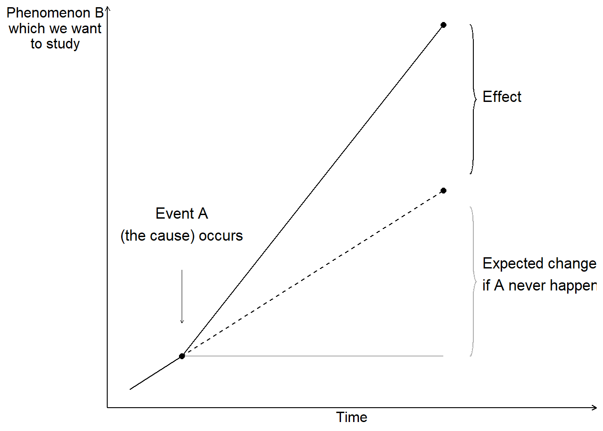

# Fundamental Counterfactual Analysis {#chap-kontrafaktisk-analys}

This chapter introduces the fundamentals of how we in social science can study causal relationships using counterfactual analysis.

## Cause and effect {#sec-orsak-och-effekt}

To be able to study causal relationships, we need to compare what happened due to a cause with what would have happened if the cause had never occurred. What did not happen is called the counterfactual outcome, also called potential outcome. The causal relationship entails an effect, which is the difference between the actual outcome and the counterfactual outcome. The cause can be anything that can be thought to affect something else, for example human behavior, environmental change, legislation, a process, and so on.

In our daily lives, we constantly assume different types of causal relationships. We drink water to become less thirsty. We pursue education to learn skills and qualify for new jobs. We take medicine to alleviate illness. Our conviction about many such everyday causal relationships is often based on a similar logic to that used in analytical work and research. By collecting observations (experiencing) in our everyday lives and conducting repeated attempts (every day), we have experience that a lot of our everyday actions entail certain effects.

Figure \@ref(fig:kontrafaktiskt-utfall) illustrates how cause A occurs at a point in time and affects a phenomenon B, whose development follows the solid line diagonally up to the right in the graph. The change in level since the cause occurred is the distance between the horizontal gray line and the solid black line. A common misunderstanding is that it is sufficient to compare this visible change, the difference between the horizontal gray line and the solid black line. But the effect, the result of cause A, is the difference between the solid line and the dashed line. The dashed line describes how the development would have looked if cause A had never happened, the counterfactual outcome.

(\#fig:kontrafaktiskt-utfall)Counterfactual outcome

By definition, counterfactual outcomes cannot be observed, since this would require us to have access to a parallel universe where the only difference from our universe is that the cause never happened. To study causal relationships, we instead observe a group of observations that have been treated (exposed to cause A) and a group of observations that have not been treated. These groups are called treatment group and control group. Ideally, the only difference between the two groups should be the treatment itself. We interpret the difference between the groups as an effect.

Say we are to study the effect of how a new medicine affects disease symptoms in patients. We have a group of patients who receive medicine and another group that does not receive medicine. We compare how their disease symptoms develop and interpret the difference between the groups as an effect of the medicine. By studying the control group, we hope, ideally, to be able to observe a result that describes the counterfactual outcome, how the symptoms would have developed for the patients who received medicine if they had never received it. It is important that it is precisely groups with several observations. By comparing several observations, we reduce the risk that the patterns we observe are a result of chance, which we will return to later.

If phenomenon A causes phenomenon B, we call A active treatment. We call the alternative scenario control treatment. The control treatment is usually the passive alternative where we do not perform an action, for example not taking a medicine. Often it is clear from the context what is cause and effect, which is why these are usually called treatment and control. For each unit of analysis, it is only possible to study one result. An observation can only be either treatment or control.

Ideally, we want to study how a patient feels after having taken the medicine, compared to how the same patient would have felt if this person had never taken the medicine. If it is a medicine that is to treat a recurring condition, for example headache, it is tempting to try this by asking the same patient to take the medicine one day and refrain from taking the medicine the next time, and compare the difference. But this is not the counterfactual outcome either. The effect of the medicine might vary for one and the same patient over time. The patient might be in better or worse condition at one time point, which affects both the headache and what effect the medicine has. The patient might get used to the medicine, which also affects both the patient's experience and the effect.

Let us instead imagine that we are to study what effect the government's new policy (cause) has on the amount of job opportunities (outcome). To analyze this, we would preferably compare the outcome, that is, what has actually happened and we may observe, against how the world would have looked if the government's policy had never taken place (the counterfactual outcome). This is of course impossible. It is possible observe how the world looked before and after the government's policy, but these are two separate observations. The situation before is not the counterfactual outcome. Things happen during the time period that can affect how the world looks and we can never be sure what causes the changes we see. We also cannot be sure that the change we observe is a good measure of the policy's effect, which is what we want to estimate.

Often it is difficult to say exactly what the counterfactual outcome is. If we are interested in the effect of a patient taking a medicine compared to if a patient does not take a medicine, it may sound obvious. But should the patient who does not take the medicine lie completely still during the time or take a walk? Should both patients take a jog or drink and eat something particular?

If we want to study effects of the government's policy, it usually becomes even more difficult to know what the counterfactual outcome is. What would have happened if the government had not implemented its policy? Would the government have implemented some other policy or resigned? If the policy only concerns a smaller part of society, for example only the companies in one industry, we may sometimes treat the affected industry as treatment group and other industries as control group and compare their developments.

When we divide units of analysis, for example patients, into treatment group and control group, there is a risk that we miss some characteristic that will ultimately affect the results in our analysis. The division into groups must therefore occur in such a way that this division itself does not affect the phenomenon we want to study, such as the disease symptoms.

Often there are phenomena that affect both the distribution between treatment and non-treatment as well as the outcome we want to study the effect on. Say for example that we want to study what effect an education has on students' future incomes. If we compare the students' income development with the rest of the population, we risk missing that the students might have some characteristic or prerequisite that would affect their incomes regardless of whether they studied the education or not. This characteristic also affects the students' decision to study the education. Even without the education, the students would therefore have had higher incomes compared to people who did not study the education (compare figure \@ref(fig:kontrafaktiskt-utfall) ). This means in that case that a simple comparison of the students' incomes with the rest of the population overestimates the effects of the education.

A method that is often described as the ideal for distributing units of analysis into control and treatment groups is chance (randomization). The idea behind this is that units of analysis have known and unknown characteristics that can affect our analysis. By distributing the units of analysis randomly, these characteristics, if we have sufficiently many observations, will not have any systematic impact on the analysis results. Using this method is called conducting a randomized controlled trial.

Randomized studies often require a large amount of observations and therefore risk becoming costly and complicated. If we for example want to study the effects of an education, one method could be that we select a group of people randomly in the population and let half of these study the education. The part of the group that gets to study the education becomes our treatment group and the rest becomes our control group. Since the participants know that they are participating in an experiment, this can in itself affect the results. The participants might behave in some other way than people who would study the education voluntarily. Letting a large amount of people study an education for free as an experiment with unclear results can become both costly and demanding.

## Variation, Covariation and Association {#sec-samvariation}

Suppose we are to study how phenomenon A affects phenomenon B, which we do with the help of a treatment and control group. To be sure that A causes B, we first want to isolate a variation in A that is created externally and is not created by, for example, phenomenon B. This is called observing an exogenous variation in A.

Thereafter we examine whether we find any form of covariation. If phenomenon A on average increases at the same time as phenomenon B on average increases, and decreases at the same time as B decreases, then there is a positive covariation between A and B. If phenomenon A increases at the same time as B decreases and A decreases while B increases, then there is a negative covariation between A and B. Compare positive and negative slope in graphs that we introduced in chapter \@ref(chap-funktioner-och-diagram) .

Covariation is a necessary condition for us to be able to claim that there is a causal relationship between two phenomena. Say for example that we study what effect a medicine has on patients' disease symptoms. We control when the patients take the medicine (exogenous variation) and then observe the disease symptoms. We examine whether there is a covariation between use of the medicine and disease symptoms.

Covariation is a condition for us to be able to claim that we have found a causal relationship. It is also a requirement for us to be able to measure an effect (the difference between the treatment and control groups). However, covariation is no proof of a causal relationship. Suppose we observe that neighborhoods with more police patrols tend to have higher crime rates. A simple interpretation might suggest that police cause crime. However, the more likely explanation is that police are deployed to areas with existing crime problems - the causation runs in the opposite direction.

Consider another example. Students who receive tutoring often perform worse on standardized tests than students who don't receive tutoring. Does this mean tutoring hurts academic performance? More likely, students who struggle academically are more likely to seek tutoring in the first place. The tutoring might actually improve their performance compared to what it would have been without help, but not enough to surpass students who never needed extra assistance.

These examples illustrate why establishing causation requires careful analysis beyond simply observing covariation. We must consider alternative explanations: reverse causation (B causes A instead of A causing B), confounding variables (C causes both A and B), or selection effects (certain types of units are more likely to experience the treatment). Even when we find strong covariation, multiple causal stories may be consistent with the same pattern of data.

## Observational Study and Experiment {#sec-observationsstudie-experiment}

When we study covariation, it is common to distinguish between observational studies and experiments. In an observational study, we study collected data, for example from a survey or information collected by others. In an experiment, we arrange collection of data to be able to study cause and effect, for example by randomly distributing units of analysis between treatment and control groups. In both observational studies and experiments, we study covariation.

Effects are often mixed up with other phenomena that we also want information about. Say for example that we send out a survey to students who have studied a course and ask if they have had use of the course. Everyone answers yes, which means that the students are satisfied. This is admittedly fun to know but it is not the same thing as the education's effect on the students' lives, since we do not have a counterfactual outcome, or a control group, to compare against.

In section \@ref(sec-log-bnp-och-lycka) we compared GDP and happiness in the world's countries and showed a positive covariation, where inhabitants in countries with higher GDP are more satisfied with their lives. This is an example of an observational study. The covariation does not necessarily show how large an effect an income increase would have on happiness. People in rich countries have on average many advantages compared to inhabitants in poor countries that can be thought to affect both happiness and wealth.

To estimate an effect, we need to control for all other phenomena that can affect the covariation. Full-scale controlled experiments are in many cases unethical and impossible within social science. Say for example that we want to study the relationship between income and happiness. We decide to randomly assign a large group of people into treatment and control groups. The treatment group gets lots of money while the control group gets to live their entire lives in poverty. Even if we were to disregard the ethical aspects, the participants' behavior and experiences will probably be affected by the knowledge that they are participating in an experiment. The results therefore become meaningless regardless of how we go about it.

Due to the difficulties of using experiments, social science is largely instead referred to what is called quasi-experiments, or natural experiments. Quasi-experiments refer to analyses where the division into treatment and control groups is identified by the analyst afterwards. Often this happens by the analyst finding some mechanism that has led to a more or less unintentional random division into treatment and control groups.

Say for example that the government enacts a new law that is to be implemented in all the country's municipalities. Due to some typographical error in a document, the law is delayed by one year for some of the municipalities. We use this to study effects of the new law (the treatment). We have by chance gotten two groups of municipalities: a group where the law takes effect the first year (the treatment group) and another group with municipalities where the law takes effect one year later (the control group).

A well-known historical example of a quasi-experiment was the cholera outbreak that occurred in London in 1854. The physician John Snow noted that mortality in cholera seemed to be connected with the use of dirty water from the River Thames. By studying variations in mortality and water use between different parts of London and over time, Snow argued that the dirty water caused increased mortality among the population. The water use was not designed by any analyst and the inhabitants of London were not randomly divided into treatment and control groups. But since the use of water with different dirtiness was randomly distributed in London, Snow could utilize this to study whether water consumption caused diseases.

We return to these questions in chapter \@ref(chap-ols-kvasiexperiment) where we introduce some methods for quasi-experimental observational studies.

## Population and Sample {#sec-population-urval-superpopulation}

A decisive question in analytical work is how we delimit our problem and how large a part of the world and world history we want to be able to make statements about. These phenomena can be described with the help of the concepts population, sample and superpopulation.

Population refers in statistics to the collection of units, observations, that we study. The population can consist of both a finite or an infinite amount of values. Examples of a finite population could be all cars in a city, all citizens in a country or all heart operations performed at a hospital. The population can also be infinite, for example if we conduct repeated equivalent experiments we can in theory do this an infinite number of times.

Sample is the observations we take from the population. Our hope is that the patterns we observe in the sample are the same patterns that are found in the entire population. The goal is therefore that the sample should be more or less representative of the population. Samples can be created in different ways, which is described a bit more thoroughly in section \@ref(sec-samla-in-data) . When we work with samples, which is normally the case within social science, there is always a certain risk and probability that our results are incorrect and could just as well have arisen by chance. In Part III we introduce how we can reason about and calculate probability and chance. Work with data under uncertainty is called statistical inference (statistical reasoning). To study causal relationships (causality) is sometimes called causal inference. The word inference means reasoning, to draw conclusions.

Superpopulation is the theoretical population that we hope to be able to make statements about beyond the study's sample and population. Suppose we perform an analysis on a sample of observations that we take from a population. Often we want to be able to make statements both about the population that exists today and different conceivable populations that may exist in the future. In certain cases we perform analyses to be able to predict what will happen if something changes, that is, to be able to predict different conceivable outcomes. These hypothetical observations belong to what is called the superpopulation.

In section \@ref(sec-lite-mangdlara) we introduced set theory. If we imagine that we have a study where the population consists of a collection of observations that we number from 1 to N and each observation is called $x_{i}$ where $i=1,2,3,...,N$. The letter $N$ symbolizes number of observations, regardless of whether it is a small or large value. It is central to remember here that when we study observations from our population there is for each observation $x_{i}$ from the population, an observable version $\left(x_{i}^{\text{observable}}\right)$ that we study, and a non-observable one that we will never see $\left(x_{i}^{\text{non-observable}}\right)$. This applies to both the treatment and control groups.

Suppose we conduct a study regarding the effect of a medicine on patients with a certain disease, where the population is all patients with the disease. We collect all N observations from the population and divide these into treatment group (receives medicine) and control group (does not receive medicine). The observations in the treatment group we call $x_{i,B}$ and those in the control group $x_{i,K}$. Regardless of which group each observation belongs to, we work only with what we observe and each observation in each group will have a non-observable, counterfactual, version.

Sometimes it is difficult to exactly define what is a study's exact population and superpopulation. If we study what effect a medicine has on patients' disease symptoms, the population can for example consist of all patients in the entire world with this disease. From these patients we take a sample, for example 100 patients, which we divide into treatment and control groups. By studying this sample, our ambition is to estimate the covariation between medicine and symptoms in the population. We thereby want to be able to make statements about the effect the medicine has in the sample, which is an estimate of the effect the medicine has in the population. We thereby also try to estimate the effects of the medicine in the superpopulation, which in this case is all comparable patients that can be thought to come to exist in the future. Since people are different, it is not always so obvious how general our results are and how far-reaching conclusions are possible.

Suppose we instead are interested in what effect an education has on people's future earnings. The population would in this case be able to be all persons who can be thought to participate in the education, for example all adult people in the ages 18 to 64 years. Or maybe we are only interested in people with certain specific prerequisites. Depending on what is the study's purpose and ambition, it can affect how we define the population.

Even superpopulation can be difficult to define. Suppose we find that the education has a positive impact on the participants' future earnings. If a large number of people studied the education, there would be masses of people with the same education. Then the education might not have the same effect compared to a situation where only a small proportion of the population had studied the education.

## Information and variables {#sec-information-och-variabler}

Within analytical work, information about reality is often called data. Data is just another word for information and can consist of anything that we can perceive with our senses, for example numbers, text, images, sound recordings. All analytical work uses information about reality in some form or extent. All data must in turn be interpreted. For example, much analytical work consists of mapping events: What happened where and when? Exactly what type of information is required for an analysis depends on what is the study's purpose. To formulate the study's purpose can sometimes require detailed deliberations.

Social scientific analysis uses information about reality in different ways. When we work with quantitative methods, for example studying how different phenomena vary, we often benefit from categorizing information in data variables. A data variable can contain any type of information, for example street numbers, names of children born in April, the gross national product for different countries or all individual words in a novel organized with one word per row. To use a data variable for calculations, this variable needs to consist of numbers or be rewritten into numbers.

When we define variables, it is important that all information that we collect into a variable has the same properties. If we for example collect information about inhabitants' life expectancy and income, we should place this information in two different variables: one variable for life expectancy and one variable for income. If we mix information in a variable, for example life expectancy and income, it becomes impossible to do calculations on the variable. Within one and the same variable, data should use the same unit of measurement. We do not want to have one observation in centimeters and another in inches in the same column.

A common way to organize data is tables, where each column represents a variable and each row an observation. In the same way that we have clear categories for our variables in the columns, we need to have clear categories for our observations. Exactly what represents an observation depends on what the data describes. It can for example be one observation per individual or per country. Often we also need to delimit what time point an observation refers to, for example an observation can contain information about a person per week. The next row can in that case contain the next observation, for example information about the same person the week after. What the data observations describe is called unit of observation.

Table: Three variables with four observations (\#tab:tre-variabler-med)

|  | Variable 1 $\left(y\right)$| Variable 2 $\left(x\right)$| Variable 3 $\left(z\right)$|
| --- | --- | --- | --- |
| Observation 1 | $y_{1}$| $x_{1}$| $z_{1}$|
| Observation 2 | $y_{2}$| $x_{2}$| $z_{2}$|
| Observation 3 | $y_{3}$| $x_{3}$| $z_{3}$|
| Observation 4 | $y_{4}$| $x_{4}$| $z_{4}$|

 Table \@ref(tab:tre-variabler-med) shows an example where we have three data variables and call these $x$, $y$ and z. We number the observations $y_{1}$ to $y_{4}$, $x_{1}$ to $x_{4}$ as well as $z_{1}$ to $z_{4}$. There are no rules for how variables should be named or numbered. It also occurs that variables are called by the same letter and distinguished through numbering, for example the variables $x_{1}$, $x_{2}$ and so on.

## Different types of data {#sec-olika-typer-av-data}

Data that is used for calculations is usually divided into different data types: ratio data, interval data, ordinal data and nominal data. One way to think about this is that we have a variable, $x$, with some form of information about reality. The division is then based on the following criteria:

- Ranking: Can the observations in $x$ be ranked?

- Equidistance: Is the distance between two values in $x$ equally large?

- Absolute zero point: Is the variable defined in such a way that there is a value that is the smallest conceivable?

Depending on the answers to these three questions, we may define our variable as one of the four data types. The three criteria and the four data types are summarized in table \@ref(tab:fyra-datatyper) .

Table: Four types of data (\#tab:fyra-datatyper)

|  | Ranking | Equidistance | Absolute zero point |
| --- | --- | --- | --- |
| Nominal data | No | No | No |
| Ordinal data | Yes | No | No |
| Interval data | Yes | Yes | No |
| Ratio data | Yes | Yes | Yes |

Let us go through the four data types and give some examples. Nominal data is not ranked, has no clear distance between each scale step and no absolute zero point. Typical examples of this are categorical variables, for example languages, names of countries, gender. Since the information in this type of data mostly concerns grouping or categorizing, the possibility to use mathematical operations is limited to primarily defining whether an observation belongs or does not belong to one category or another.

Ordinal data has ranking but not equidistance or absolute zero point. A typical example is school grades, or placement in a list or queue, for example place 1, 2, 3 and so on. Another example can be survey responses where respondents are asked to rank alternatives from best to worst. In addition to categorizing, this data type can also use mathematical operations for inequality, for example that position 1 comes before position 2, which comes before position 3. It is thereby possible to calculate the median value for this type of data, but not for example the mean, see section \@ref(sec-medelvarde) .

Interval data allows calculations of difference and addition and subtraction. However not ratios. We therefore cannot in a meaningful way compare the double value of interval data. Typical examples include temperatures in for example degrees Celsius. The difference between –2 and +3 degrees Celsius is the same as +5 and +10 degrees Celsius. But we cannot in the same way calculate these distances as ratios, since 0 degrees Celsius is just a marker for the temperature when water freezes.

Ratio data allows the same mathematical methods as the other three data types, including the calculations of ratios. This includes many common measures within physics and technology, such as for example length, time and mass. Unlike the other data types, it is possible to use division for ratio data and compare relative distances, such as that 10 meters is twice as long as 5 meters.

This division into four types of data is commonly occurring. Other more detailed divisions can also occur. To think about data in these forms can help us to sort information and see what possibilities and limitations that precisely our data offer. This should however primarily be seen as a tool, rather than a rule system.

## Collecting a sample {#sec-samla-in-data}

To understand the idea behind sampling of data, we will in this section briefly go through some overarching examples of how this can happen. First the population must be defined. A popular method is to then take a simple random sample (SRS). As the name suggests, this is based on letting all observations in the population have the same theoretical possibility to be included in the sample. The probability for each individual observation must also be above 0. The observations that are to be included in the sample are chosen randomly, for example through lottery or with the help of a computer's random generator. Say for example that we want to know what all of the adult inhabitants think about Jesus. We may then randomly sample 100 persons and ask them.

Another method is systematic sampling: we give each person a number. Instead of drawing numbers randomly, we select every 1,000th person. This also gives a random sample as long as the numbered list of the population does not contain any patterns.

There are several commonly occurring methods that are not random. One such method is quota sampling, or quota-based sampling. This method is based on that we know of some characteristics in the population that are important for the study. We therefore weight the sample based on these characteristics to create a sample that is more representative of the population. For example, we are interested in what the population of a country thinks about Jesus and think that the population's proximity to the sea is important for explaining variations in faith. We estimate that 40% of the population lives near the sea and therefore control our sample so that 40% of the sample consists of residents in the vicinity of the sea. A problem with this method is that many factors affect people's view of Jesus and if our sampling method is deficient, it risks worsening the result.

To be sure that different parts of the population are represented in our sample, we may use stratified sampling. The population is divided into different groups, strata. From each stratum, observations are chosen randomly. The number of observations does not need to be the same proportion in the sample as in the population, as long as we adjust our calculations for this. Suppose we want to investigate the views on Jesus among the population for a country. In our study we want to make sure that we get enough inhabitants from the northern inland of the country. By doing so we make sure that it is possible to make more precise statements about this specific group. In the northern inland lives about five percent of the population. If we randomly select observations from all people in the country, the risk is that we get a correct proportion of respondents from the northern inland, but these observations will at the same time be too few to make any more detailed observations about the people of the northern inland. For instance, how much does opinions differ among parents and children in the northern inland. To get more reliable results, one may collect extra many observations from a group that actually constitutes a smaller proportion of the full population of the country. When we then calculate on our data material, we must take into account the bias in the sample that we ourselves have created, so we do not risk getting an incorrect picture of the population.

Another method is cluster sampling, also called group sampling. The full population is divided into clusters, groups, and some of these clusters are selected randomly. Thereafter, random samples can be made from each group. For example, we are to ask the students at a school what they think about Jesus. The population is all students at the school. We divide the students into clusters depending on which school class they belong to. The school classes that are to be included in the study are chosen randomly.

Collecting information usually entails several challenges, such as how to best measure a phenomenon, whether the sources are reliable, whether our information can be verified or whether we succeed in interpreting it correctly. These are important aspects of analytical work but there is no room to go through them here.

## How do we know the things we know? {#sec-ar-allting-osakert}

We described above the concepts superpopulation, population and sample. Since we cannot observe the counterfactual outcome that we are interested in when we study causal relationships, it can be described as us in these situations always working with a sample of data. When we work with samples, there is always more or less uncertainty to what extent we succeed in finding the values we seek for our population and superpopulation.

Even in situations where we actually have access to data for our entire population, there are reasons to regard the information as uncertain, that is, that there is a greater or smaller probability that our results are incorrect. Say for example that we study the economic development in Europe's countries in recent decades. We have gotten hold of a table with data where we have a collection of variables with one observation per year and country. Even if our data contains information about all countries over a long time period, this should be regarded as a sample. Collection of data can entail measurement errors, for example due to technical aids or human mistakes. Or perhaps the data we use does not measure exactly what we want to study, but is an approximate measure of something more complex.

Another reason to treat most information as sample data is that there can be uncertainty around exactly how the population should be defined. We might want to be able to make statements about all patients of a certain age or all adult people in the entire country. Then it is usually a bit uncertain exactly what characteristics our population has. We can also think about these questions in terms of the superpopulation that will exist in the future. Even for these coming observations, there is uncertainty around their exact characteristics.

In part IV we will introduce how we can work more carefully and in detail with uncertainty and probability. The rest of this part is devoted to describing methods for how to study variation and covariation.

## Exercises

