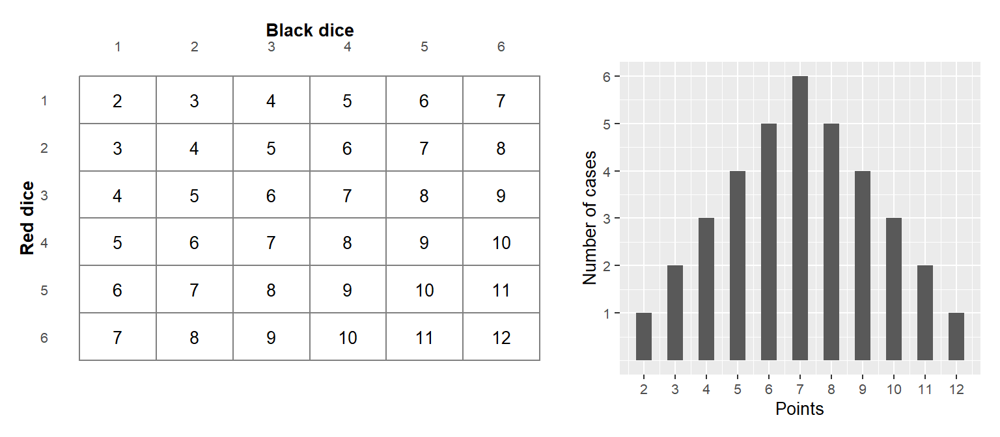
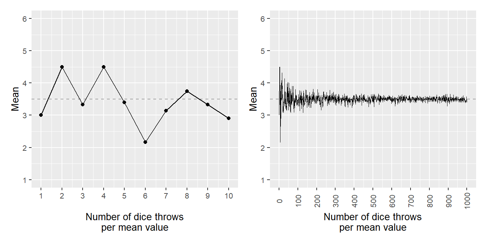
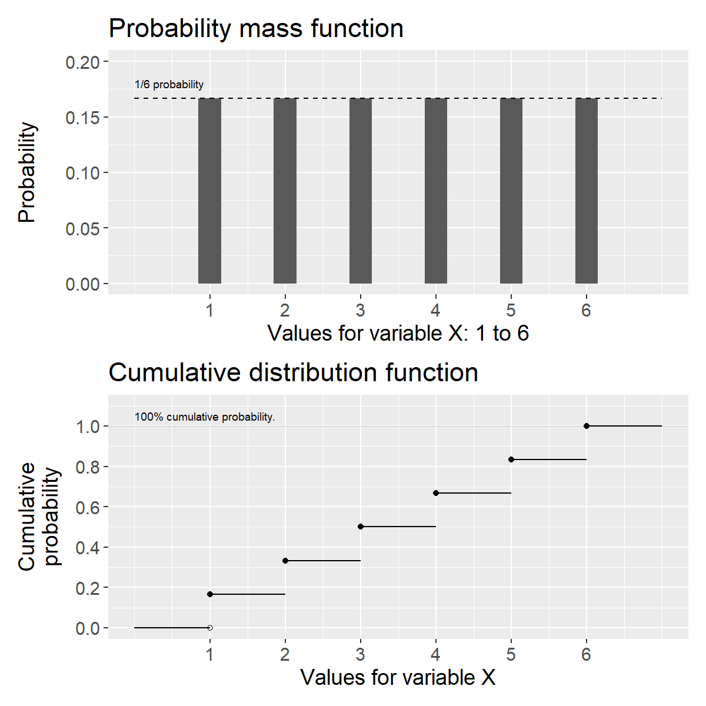
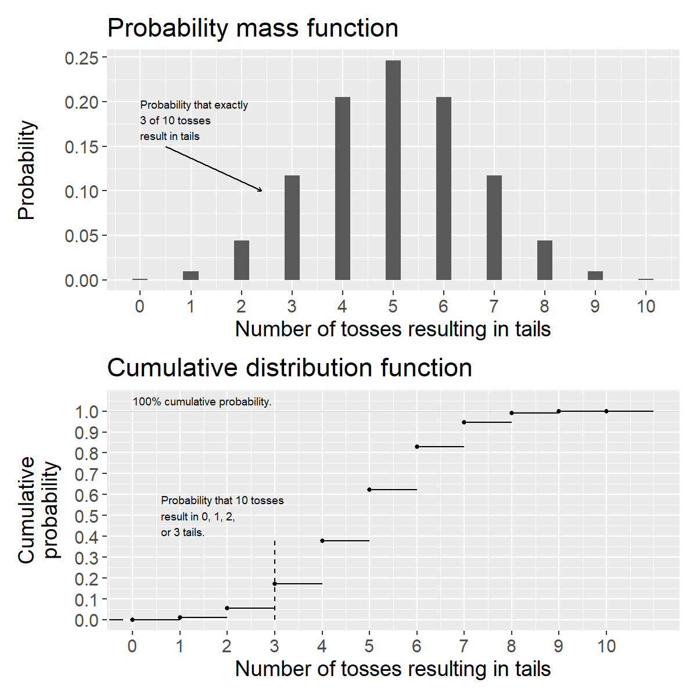
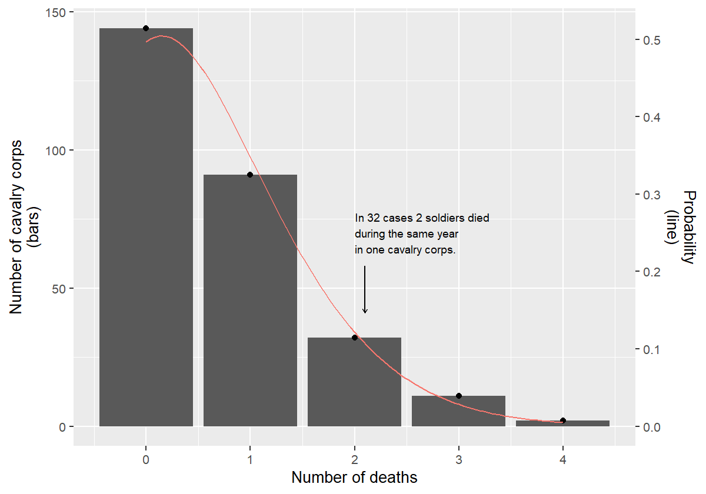

# Basic Probability 1: discrete distributions {#ch-probability-discrete}

This chapter introduces probability theory and discrete probability distributions, which have a limited number of possible values, such as two sides of a coin or six sides of a die.

## How we know what we know

Say we design an experiment where we want to study the effects of a medicine and have two patients at our disposal. One patient receives the medicine (treatment) and the other receives no medicine (control). Since we are only comparing two people, there is a high risk that the study's results could just as well be a result of chance. One way to reduce the risk of random results is to use more observations. But even with a large number of observations, we cannot be completely certain that the results are not just as well a result of chance. In this part of the book we will go through how we may work with this type of question using probability theory and mathematical calculations.

Even in our daily lives we use probability in some sense to draw conclusions. Based on previous observations, we often have a feeling for various forms of more or less likely results. In many situations we believe we are more certain of our position precisely because we have observed corresponding phenomena many times before. Our everyday reasoning ability is biased and easily confuses facts and fantasy. Our daily life is also full of unique situations where we cannot repeat exactly the same situation, but must make a subjective assessment from case to case based on previous experience and information.

## Random variables {#sec-random-variables}

In previous chapters we have worked with variables defined by a mathematical function over a domain, for example the function \(y=x^{2}\) defined over all real numbers. We have worked with data variables consisting of collected information, observations. Later in this book, when we go through regression analysis, we will work with variables that are predicted using regression models.

When we are now going to work with probability and chance we will use random variables. A random variable is a variable whose results are affected by a random process. By random process we mean any situation whose outcome is uncertain beforehand.

Random variables can be defined by mathematical functions that describe the probability for the values (outcomes) that the variable can assume. Say for example that we have a variable \(M\) that can assume two different values: the number 1 or 2. These values are the sample space for variable \(M\): \(\left\{ 1,2\right\}\). The probability for each outcome is 50%. We describe \(M\) with the probability function \(P\left(M\right)\), where the function is called \(P\) after the word probability:

\begin{equation}
\begin{aligned}
P\left(M=1\right) & =\frac{1}{2}=0.5=50\%\\
P\left(M=2\right) & =\frac{1}{2}
\end{aligned}
(\#eq:coin-flip)
\end{equation}

The total probability for the two possible outcomes in \(M\) is \(0.5 + 0.5 = 1\), that is 100%. Equation \@ref(eq:coin-flip) is an example of a probability distribution. We say that the variable \(M\) follows a discrete probability distribution, since the distribution has a limited number of outcomes. An experiment, or trial, is called the process that leads to an outcome. An event refers to one or several outcomes, a subset of the sample space.

A continuous probability distribution has an infinite number of outcomes within one or several intervals. Say for example that a random variable \(X\) can assume all possible decimals between 0 and 1 (the sample space) with the same probability. Theoretically, \(X\) can assume the value 0.23 with the same probability as 0.9999345. There are infinitely many decimals and therefore infinitely many outcomes. Since there are infinitely many outcomes, the probability, mathematically, for each specific value approaches 0. For a continuously random variable we therefore instead calculate the probability for an interval of outcomes. For example, there is a 50% probability for the event that \(X\) assumes a value between 0 and 0.5 and 50% probability that \(X\) assumes a value between 0.5 and 1.

There are infinitely many probability distributions. As long as we can come up with a new description of a probability distribution, it exists. Say now that we have a six-sided die \(T\) with the numbers 1 to 6 and that each side has an equal probability of coming up, one sixth, \(\frac{1}{6}\). The probability for the different outcomes can be described:

\begin{equation}
P\left(T=t\right)=\begin{cases}
\frac{1}{6} & t=1,2,3,4,5,6\\
0 & \text{otherwise}
\end{cases}
\end{equation}

The total probability for all outcomes is \(\frac{1}{6}\cdot6=1=100\%\). Suppose we instead have a six-sided die \(X_{2}\) with the integers 1 to 6, which is unbalanced in such a way that the probability for outcome 3 is \(\frac{2}{7}\) while the probability for each other outcome is \(\frac{1}{7}\). The number 7 in the denominator is not the number of sides on the die but follows from the variable's probability distribution. Variable \(X_{2}\) can be summarized as:

\begin{equation}
P\left(X_{2}=x\right)=\begin{cases}
\frac{1}{7} & x=1,2,4,5,6\\
\frac{2}{7} & x=3\\
0 & \text{otherwise}
\end{cases}
(\#eq:weighted-die)
\end{equation}

Let us now assume that we have two six-sided perfectly balanced dice, one red and one black with the numbers 1 to 6. The probability for each unique result with \(t\) number of perfectly balanced six-sided dice can generally be described as \(\left(\frac{1}{6}\right)^{t}=\frac{1}{6^{t}}\). With one die the probability for each result is 1/6. With two dice it is \(1/6^{2}=1/36\). With two dice there are 36 possible combinations. The probability that we get the point sum 2 is the same as the point sum 12: 1/36. With three dice \(1/6^{3}=1/216\).

<div class="figure">

<p class="caption">(\#fig:tva-tarningar)Number of cases and result sum for two dice</p>
</div>

Now we will calculate the probability for the total point sum for the two dice, which we call variable \(Z\). Figure \@ref(fig:tva-tarningar) illustrates this with a table of all 36 possible point combinations (left) and a graph showing the number of combinations per point sum from 2 to 12 (right). The probability for outcome \(Z=3\) is 2/36, which we see by adding together the probability for each unique result that gives this point sum, \(\left(\text{red},\text{black}\right)=\left(1,2\right)\) and \(\left(2,1\right)\). The result that red die = 1 and black die = 2 is considered the same result as red die = 2 and black = 1:

\begin{equation}
P\left(Z=3\right)=\frac{1}{36}+\frac{1}{36}=\frac{2}{36}
\end{equation}

Outcome 7 is given by most combinations: \(\left(1,6\right),\left(6,1\right),\left(2,5\right),\left(5,2\right),\left(3,4\right)\) and \(\left(4,3\right)\). This outcome therefore has the highest probability:

$$P\left(Z=7\right) =\frac{1+1+1+1+1+1}{36}=\frac{6}{36}=\frac{1}{6}$$

The probability of getting 3 points or less with the two dice, \(Z\leq3\), can be calculated in the following way. There are three squares out of 36 possible for this result and the probability can therefore be calculated as:

$$P\left(Z\leq3\right) =P\left(2\right)+P\left(3\right)=\frac{1}{36}+\frac{2}{36}=\frac{3}{36}=\frac{1}{12}$$

## Probability with multiple variables {#sec-multivariate-probability}

If we are to calculate the probability for an outcome with regard to multiple random variables, this is called a multivariate probability distribution. If we only have two variables in the probability distribution it is called a bivariate probability distribution. There are several ways that variables can interact in probability. Here are examples of simultaneous and conditional probability.

**Simultaneous probability:** Suppose we have two random variables \(X\) and \(Y\). The outcome in the two variables is determined simultaneously, at the same time, and do not affect each other. Say for example that we roll two dice where the result of one die does not affect the other and we are interested in the dice's total point sum.

**Conditional probability:** Conditional probability describes the probability that a variable \(X\) assumes a value \(x\), given that another random variable \(Y\) assumes a value \(y\), which can be written: \(P\left(X=x|Y=y\right)\). Say for example that we are to choose a ball at random from one hundred balls, of which 80 are red and 20 are yellow. Half of the balls of each color are hollow and half are filled, see Table \@ref(tab:balls-table). The probability of getting a red ball is 80/100=4/5 and a yellow ball 20/100=1/5. The probability for hollow or filled is 1/2 regardless of color. If \(X\) = color and \(Y\) = hollow/filled then the probability of getting a red ball, given that the ball is hollow:

$$P\left(X=\text{red}|Y=\text{hollow}\right) =\frac{40}{50}=\frac{4}{5}$$

We divide the number of red hollow balls \(\left(40\right)\) by the number of hollow balls in total \(\left(50\right)\). The probability that a ball is filled, given that it is yellow is:

$$P\left(Y=\text{filled}|X=\text{yellow}\right) =\frac{10}{20}=\frac{1}{2}$$


Table: (\#tab:balls-table)Three types of balls

|       | Filled | Hollow | Sum |
|:------|:------:|:------:|:---:|
|Red    |   40   |   40   | 80  |
|Yellow |   10   |   10   | 20  |
|Sum    |   50   |   50   | 100 |

## Expected value and variance {#sec-expected-value-variance}

For a random variable we cannot estimate (calculate) a mean in the way that we do for a collection of discrete values, such as a collection of numbers. Instead we use what is called expected value, also called expectation value. Expected value is a generalization of the weighted mean. The expected value for a random variable is the sum of each outcome multiplied by its probability:

\begin{equation}
E\left(M\right)=\sum_{i}^{n}m_{i}P\left(m_{i}\right)
(\#eq:expected-value)
\end{equation}

where \(E\left(\right)\) is called the expected value function, which can also be written \(E\left[M\right]\), \(\mathbb{E}\left(M\right)\) or \(EM\). In section \@ref(sec-varians-och-standardavvikelse) we introduced the population mean \(\mu\). The expected value for population \(X\) is \(E\left(X\right)=\mu_{X}\). For variable \(M\) that has outcomes 1 and 2 each with 0.5 probability, the expected value is:

$$E\left(M\right) =m_{1}\cdot P\left(m_{1}\right)+m_{2}\cdot P\left(m_{2}\right)=1\cdot0.5+2\cdot0.5=1.5$$

Suppose we instead have a random variable \(H\) with outcomes 1 and 2 with 75% and 25% probability respectively. The expected value then becomes:

$$E\left(H\right) =1\cdot0.75+2\cdot0.25=1.25$$

The expected value function \(E\left(\right)\) is a linear function, which can be described as that given that we have the random variables \(X\) and \(Y\), the following applies:

\begin{equation}
E\left(X+Y\right)=E\left(X\right)+E\left(Y\right)
(\#eq:exp-linearity)
\end{equation}

If we have two six-sided perfectly balanced dice \(X\) and \(Y\), each with the possible outcomes 1 to 6 where each outcome has 1/6 probability, then the expected value \(E\left(X\right)=E\left(Y\right)=3.5\). The expected value for \(X\) plus the expected value for \(Y\):

\begin{equation}
E\left(X\right)+E\left(Y\right)=3.5+3.5=7
(\#eq:exp-two-dice)
\end{equation}

Let us call the point sum for the two dice \(Z\). Its expected value is given by:

$$E\left(Z\right) =\frac{2+6+12+20+30+42+40+36+30+22+12}{36}=7$$

When we added the expected value for \(X\) and \(Y\) we got result 7, in equation \@ref(eq:exp-two-dice). Another way to write this is the following:

$$E\left(Z\right)=E\left(X+Y\right)=E\left(X\right)+E\left(Y\right)=7$$

Compare equation \@ref(eq:exp-linearity). The linearity of expected value also has significance when we multiply a random variable by a constant. Say for example that we have an arbitrary constant \(a\). If we multiply the expected value \(E\left(X\right)\) by \(a\) this is the same thing as \(a\) multiplied by each individual value in variable \(X\):

\begin{equation}
E\left(aX\right)=aE\left(X\right)
(\#eq:exp-constant)
\end{equation}

If we instead add a constant \(b\) we may also move this out of the expected value function, as \(E\left(aX+b\right)=aE\left(X\right)+b\). In section \@ref(sec-varians-och-standardavvikelse) we defined variance for population and sample. For a random discrete variable \(X\) variance can be defined as:

$$\text{var}\left(X\right)=\sum_{i}^{n}\left(x_{i}-\mu_{X}\right)^{2}P\left(x_{i}\right)$$

where \(\mu_{X}=E\left(X\right)\) and \(P\left(x_{i}\right)\) is the probability for each value \(x_{i}\). The expected value we defined in equation \@ref(eq:expected-value) as \(E\left(X\right)=\sum_{i}^{n}x_{i}P\left(x_{i}\right)\). For a probability distribution where all values have the probability \(\frac{1}{n}\) and \(n\) is the number of observations, the variance is:

$$\text{var}\left(X\right)=\frac{1}{n}\sum_{i}^{n}\left(x_{i}-\mu_{X}\right)^{2}$$

This can for example describe the variance for a perfectly balanced six-sided die where all values have the probability \(\frac{1}{6}\). We will now see how variance and expected value are connected. We remove the parentheses and move in the summation \(\sum_{i}^{n}\). Since \(\mu_{X}\) is a constant we can move this out of the summation:

$$\text{var}\left(X\right) =\sum_{i}^{n}x_{i}^{2}P\left(x_{i}\right)-2\mu_{X}\sum_{i}^{n}x_{i}P\left(x_{i}\right)+\mu_{X}^{2}\sum_{i}^{n}P\left(x_{i}\right)$$

The expression \(\sum_{i}^{n}x_{i}P\left(x_{i}\right)\) is the same as the expected value \(E\left(X\right)\) and \(\mu_{X}\) (see equation \@ref(eq:expected-value)). The expression \(\sum_{i}^{n}x_{i}^{2}P\left(x_{i}\right)\) can also be written \(E\left(X^{2}\right)\). The sum of probabilities for all possible outcomes is by definition \(\sum_{i}^{n}P\left(x_{i}\right)=1\), that is 100%. Based on this we now write:

\begin{equation}
\begin{aligned}
\text{var}\left(X\right) &=E\left(X^{2}\right)-2\mu_{X}^{2}+\mu_{X}^{2}\\
&=E\left(X^{2}\right)-\mu_{X}^{2}
\end{aligned}
\end{equation}

Since \(E\left(X\right)=\mu_{X}\) we write:

\begin{equation}
\text{var}\left(X\right)=E\left(X^{2}\right)-\left(E\left(X\right)\right)^{2}
(\#eq:variance-expected)
\end{equation}

Note that \(E\left(X^{2}\right)\) is the expected value of \(X^{2}\), while \(\left(E\left(X\right)\right)^{2}\) is the expected value \(E\left(X\right)\) squared. Variance can also be expressed as the expected value:

\begin{equation}
\text{var}\left(X\right)=E\left(X-\mu_{X}\right)^{2}
(\#eq:variance-expected2)
\end{equation}

One way to think about the meaning of this expression is that variance is a value (a constant) that describes the spread in a variable. The expected value describes this spread in a random variable's population. To see that equation \@ref(eq:variance-expected) and \@ref(eq:variance-expected2) are the same thing we write:

\begin{equation}
\begin{aligned}
\text{var}\left(x\right) &=E\left(X-\mu_{X}\right)^{2}\\
&=E\left(X-E\left(X\right)\right)^{2}\\
&=E\left(X^{2}-2XE\left(X\right)+E\left(X\right)^{2}\right)\\
&=E\left(X^{2}\right)-2E\left(X\right)E\left(X\right)+E\left(X\right)^{2}\\
&=E\left(X^{2}\right)-\left(E\left(X\right)\right)^{2}
\end{aligned}
\end{equation}

If we now have \(\text{var}\left(aX+b\right)\), where \(a\) and \(b\) are constants we get:

$$\text{var}\left(aX+b\right)=a^{2}\text{var}\left(X\right)$$

That is, a constant \(a\) that is multiplied by the random variable can be moved out of the variance function \(\text{var}\left(\right)\) and multiplied by itself. The second constant \(b\) disappears. The positive square root of the variance for \(X\) is also in this case the standard deviation and can be written \(\sigma_{x}=s\left(x\right)=\sqrt{\text{var}\left(x\right)}\), where \(\sigma\) represents the variance in the population (a constant). For standard deviation it applies that:

\begin{equation}
s\left(aX+b\right)=\left|a\right|s\left(X\right)
(\#eq:sd-linear)
\end{equation}

which means that if we multiply a random variable \(X\) by a constant \(a\) then its variance and standard deviation are multiplied, but it does not change the form of the spread.

## Conditional expected value {#sec-conditional-expected-value}

The expected value for a variable can also depend on the outcome of another variable. This is called conditional expected value. If the outcome of variable \(Y\) depends on variable \(X\), the conditional expected value for \(Y\), given \(X\) can be written:

$$E\left(Y|X\right)=\sum_{i}y_{i}P\left(Y|X\right)$$

Say for example that random variable \(Y\) is a perfectly balanced six-sided die, values 1 to 6, probability \(\frac{1}{6}\). Random variable \(X\) is a perfectly balanced coin with sample space 1 or 2 with probability \(\frac{1}{2}\). If \(X=1\) the values for \(Y\) are 1 to 6. If \(X=2\) we add 10 to the value for \(Y\), which is why \(Y=11\) to 16. The sample space for the two variables \(X\) and \(Y\) together: \(\left\{ 1,2,3,4,5,6,11,12,13,14,15,16\right\}\). The conditional expected value for variable \(Y\) given \(X=1\) and \(X=2\) can be written:

$$E\left(Y|X=1\right)=3.5 \qquad E\left(Y|X=2\right)=13.5$$

The conditional expected value \(Y\) of \(X\) is its own random variable with its own probability distribution for the sample space with integers 1 to 6 and integers 11 to 16. The **law of total expectation** is a useful rule. For the random variables \(X\) and \(Y\) this can be formulated:

\begin{equation}
E\left(E\left(Y|X\right)\right)=E\left(Y\right)
(\#eq:law-total-expectation)
\end{equation}

The expected value of the conditional expected value \(E\left(Y|X\right)\) is the same as the expected value \(E\left(Y\right)\). We illustrate using the coin \(X\) and the die \(Y\) from the previous example. The law of total expectation gives:

\begin{equation}
\begin{aligned}
E\left(E\left(Y|X\right)\right) &= E\left(Y|X=1\right)P\left(X=1\right)+E\left(Y|X=2\right)P\left(X=2\right)\\
&=3.5\cdot\frac{1}{2}+13.5\cdot\frac{1}{2}\\
&=8.5
\end{aligned}
\end{equation}

The conditional expected value function also has the following property:

$$E\left(XY|X\right)=XE\left(Y|X\right)$$

where \(X\) and \(Y\) are random variables. The equation means that the expected value of \(X\) times \(Y\) conditional on \(X\) is the same thing as \(X\) times the expected value of \(Y\) conditional on \(X\). To see this we write:

$$E\left(XY|X\right)=\sum_{i}xy_{i}P\left(Y|X\right)=x\sum_{i}y_{i}P\left(Y|X\right)=XE\left(Y|X\right)$$

## Law of large numbers {#sec-law-large-numbers}

The more experiments that are conducted with a random variable, the greater the probability that the results approach the population value. This also means that the larger sample we take, the greater the probability that an estimated mean corresponds with the population's expected value. This is called the law of large numbers.

We illustrate this with a random variable where the possible outcomes are integers 1 to 6 and where each outcome has the probability 1/6, which is why the expected value is 3.5 (like a six-sided perfectly balanced die). We let the computer choose an integer randomly between 1 and 6. Then choose two values and calculate the mean for these, then three values and so on until we have 1,000 means, where the last mean is calculated from 1,000 randomly created integers between 1 and 6.

<div class="figure">

<p class="caption">(\#fig:dicemeans)Law of large numbers: simulated means from a die (values 1–6) for increasing sample sizes. The dashed line marks the expected value 3.5.</p>
</div>

Figure \@ref(fig:dicemeans) illustrates the 1,000 results in two graphs, where the left graph only illustrates the first ten means and the right graph shows all calculated results, including those visible in the left graph. On the horizontal x-axis in both graphs the number of random values used to calculate the mean at that point is described. The point furthest to the right in the right graph is the mean of 1,000 randomly chosen integers between 1 and 6. Exactly as the law of large numbers predicts, these means approach the expected value 3.5.

More formally, the law of large numbers can be formulated in the following way: suppose we have an infinite sequence of random variables \(X_{1},X_{2},...,X_{n}\) that have the same expected value \(\mu\):

$$E\left(X_{1}\right)=E\left(X_{2}\right)=\cdots=\mu$$

The mean for \(n\) of these variables is:

$$\bar{X}_{n}=\frac{1}{n}\sum_{i}^{n}X_{i}$$

The law of large numbers can then be expressed as that the following limit value is 1 when \(n\) approaches infinity:

\begin{equation}
\lim_{n\rightarrow\infty}P\left(\left|\bar{X}_{n}-\mu\right|<\epsilon\right)=1
(\#eq:law-large-numbers)
\end{equation}

where \(\left|\bar{X}_{n}-\mu\right|\) is the absolute value of the mean \(\bar{X}_{n}\) minus the expected value \(\mu\). The function \(P\left(\right)\) describes the probability for an outcome. The term \(\epsilon\) is an arbitrary positive value, for example a very low value close to 0. The entire equation can be read as that the probability that \(\left|\bar{X}_{n}-\mu\right|\) is less than \(\epsilon\) approaches 100% when the number of random variables \(X_{i}\) grows to infinity, that is \(n\rightarrow\infty\).

Another way to describe this is that the difference between \(\bar{X}_{n}\) and \(\mu\) approaches 0 and this difference will be less than the low value \(\epsilon\). The definition in equation \@ref(eq:law-large-numbers) is called the law of large numbers in weak form. The law of large numbers in strong form can be formulated:

$$P\left(\lim_{n\rightarrow\infty}\bar{X}_{n}=\mu\right)=1$$

This should be read as that the mean \(\bar{X}_{n}\) instead becomes equal to the expected value \(\mu\) when \(n\) approaches infinity. The probability for this, \(P\left(\right)\), is equal to 1, that is 100%.

## Uniform probability distributions {#sec-uniform-distribution}

We have now in different examples used the probability function \(P\left(\right)\) to describe the probability for specific outcomes. For a random variable \(M\) we will now clarify that when we want to define the probability for a specific value we use the function \(f\left(M\right)\). The two functions \(f\) and \(P\) describe the same thing so far:

$$f\left(m\right)=P\left(M=m\right)$$

For discrete probability distributions the probability function \(f\) is called probability mass function, PMF. In equation \@ref(eq:expected-value) we described the expected value for a random discrete variable as possible outcomes multiplied by the probability for these. If we instead of the probability function \(P\) use \(f\), the expected value for random variable \(M\) can be written:

\begin{equation}
E\left(M\right)=\sum_{i}^{n}m_{i}f\left(m_{i}\right)
(\#eq:expected-value-pmf)
\end{equation}

Now we will introduce what is called the cumulative distribution function (CDF), or just the distribution function. The distribution function describes the probability that a random variable assumes a value within a specific interval. Here too we use the probability function \(P\left(\right)\) to for example describe the probability that random variable \(M\) assumes a value equal to or less than the value \(m\), which we describe as \(P\left(M\leq m\right)\). We call the distribution function \(F\):

$$F\left(m\right)=P\left(M\leq m\right)$$

Say now that we have a random variable \(X\) with sample space \(\left\{ 1,2,3,4,5,6\right\}\), where each outcome has the probability \(\frac{1}{6}\):

\begin{equation}
f\left(x\right)=P\left(X=x\right)=\begin{cases}
\frac{1}{6} & x=1,2,3,4,5,6\\
0 & \text{otherwise}
\end{cases}
(\#eq:pmf-die)
\end{equation}

The first row in the probability function describes the probability 1/6 for integers 1 to 6. The second row describes that for all other outcomes the probability is 0. \(X\) follows a uniform discrete probability distribution. The distribution is uniform because each outcome has the same probability. The distribution is discrete because there are a limited number of possible outcomes. That variable \(X\) follows a uniform probability distribution can be described with the following expression:

$$X\sim U\left(a,b\right)$$

where tilde \(\sim\) describes that \(X\) follows the probability distribution \(U\), which is an abbreviation for uniform probability distribution. The letters \(a\) and \(b\) indicate the limits for the interval of the distribution's possible values. In this case \(a=1\) and \(b=6\), which is why \(X\sim U\left(1,6\right)\). For a discrete variable that follows a uniform probability distribution, the distribution function can be described generally as:

\begin{equation}
F\left(x\right)=P\left(X\leq x\right)=\frac{x-a+1}{b-a+1},\quad x=a,a+1,\ldots,b
(\#eq:cdf-uniform)
\end{equation}

where \(a\) and \(b\) are the lowest and highest integer that \(X\) can assume, that is 1 and 6 respectively. The distribution function for \(X\):

\begin{equation}
F\left(x\right)=P\left(X\leq x\right)=\frac{x}{6},\quad x=1,2,3,4,5,6
(\#eq:cdf-die)
\end{equation}

For example, this means that \(F\left(2\right)=2/6\), which means that the cumulative probability of getting outcome 1 or 2 is equal to 2/6. One may also describe the same distribution function as:

$$F\left(x\right)=P\left(X\leq x\right)=\begin{cases}
0 & \forall\, x<1\\
\frac{x}{6} & 1\leq x<6\\
1 & x\geq6
\end{cases}$$

where we added the top row to describe that \(F\left(x\right)=0\) for \(x<1\). The probability that \(X\leq x\) then increases stepwise for \(x=1,2,3,4,5\) and 6 to reach \(F\left(x\right)=1\), that is 100%, from \(x=6\) and upward.

The cumulative probability \(P\left(X\leq x\right)\) must by definition be a value between 0 and 1, between 0 and 100%. What then remains of 100% is the probability that \(X>x\):

\begin{equation}
F\left(x\right)=P\left(X\leq x\right)=1-P\left(X>x\right)
(\#eq:complementary-prob)
\end{equation}

The probability \(P\left(X>x\right)\) we calculate by taking \(1-F\left(x\right)\), which we see by rearranging the equation:

\begin{equation}
P\left(X>x\right) =1-P\left(X\leq x\right)=1-F\left(x\right)
(\#eq:complementary-cdf)
\end{equation}

For variable \(X\) the probability of getting 3 to 6 points is:

$$P\left(X>2\right) =1-F\left(2\right)=1-\frac{2}{6}=\frac{4}{6}$$

The expected value for \(X\) is then:

$$E\left(X\right) =\sum_{i}x_{i}f\left(x_{i}\right)=1\cdot\frac{1}{6}+2\cdot\frac{1}{6}+3\cdot\frac{1}{6}+4\cdot\frac{1}{6}+5\cdot\frac{1}{6}+6\cdot\frac{1}{6}=3.5$$

<div class="figure">

<p class="caption">(\#fig:dice-pmf-cdf)Probability mass function (top) and cumulative distribution function (bottom) for a uniform discrete probability distribution that can assume the integers 1 to 6.</p>
</div>

Figure \@ref(fig:dice-pmf-cdf) illustrates the probability function and cumulative distribution function for variable \(X\) that can only assume integers 1 to 6 and the probability for each result is \(\frac{1}{6}\). The upper graph shows the probability function, equation \@ref(eq:pmf-die).

In the lower graph the cumulative, accumulated, probability that \(X\leq x\) is illustrated, which increases stepwise by \(\frac{1}{6}\) for each integer on the horizontal x-axis, see equation \@ref(eq:cdf-die). In the lower graph this is illustrated by the horizontal lines between the points, where the cumulative probability is constant between each integer since the variable is discrete and cannot assume any values between these integers. At \(X=6\) the cumulative probability is 100%, since we have then counted all possible outcomes.

## The binomial distribution {#sec-binomial-distribution}

Say now that we have a variable \(M\) with the two outcomes 1 and 2 respectively, each with 50% probability. One can think of \(M\) as a perfectly balanced coin. We now define the probability for outcome 1 as the probability \(p=0.5=50\%\). The probability for the second outcome, value 2, must by definition be \(1-p=1-0.5=0.5\).

Now we will describe the probability that we with variable \(M\) get more of outcome 2. Each individual result of \(M\) is independent of the previous result. The probability of getting \(k\) number of outcome 2 in \(n\) trials can then be described with the following probability mass function:

\begin{equation}
f\left(k\right) =P\left(M=k\right)=\binom{n}{k}p^{k}\left(1-p\right)^{n-k}
(\#eq:binomial-pmf)
\end{equation}

where

$$\binom{n}{k}=\frac{n!}{k!\left(n-k\right)!}$$

Equation \@ref(eq:binomial-pmf) describes the probability function for what is called the binomial distribution. The expression \(\binom{n}{k}\) is called the binomial coefficient and \(n!\) is \(n\) factorial, such as \(2!=2\cdot1\). In a binomial distribution the outcome in one trial is independent from other trials, which is why the results from different rounds do not affect each other. It also does not matter in which order we get \(k\) outcomes.

Let us now use equation \@ref(eq:binomial-pmf) to calculate the probability that we with two trials get outcome 2 exactly two times: \(n=2\) and \(k=2\). If we summarize the results as \(\left(\text{result trial 1},\text{result trial 2}\right)\) we get the following results: \(\left\{ \left(1,1\right),\left(1,2\right),\left(2,1\right),\left(2,2\right)\right\}\). The probability for the result \(\left(2,2\right)\) is then:

\begin{equation}
\begin{aligned}
f\left(k\right)=P\left(M=k\right) &=\binom{n}{k}p^{k}\left(1-p\right)^{n-k}\\
&=\binom{2}{2}0.5^{2}\left(1-0.5\right)^{2-2}\\
&=\left(\frac{2!}{2!\left(2-2\right)!}\right)0.5^{2}\left(0.5\right)^{0}\\
&=0.25
\end{aligned}
(\#eq:binomial-example)
\end{equation}

The probability is \(\frac{1}{4}=0.25\). Each unique value of the four possible results has the probability 25%. There are two possibilities to get outcome 2 once in two trials: result \(\left(1,2\right)\) or result \(\left(2,1\right)\). The probability for this is therefore 50%:

$$f\left(1\right) =\left(\frac{2!}{1!\left(2-1\right)!}\right)0.5^{1}\left(0.5\right)^{2-1}=\left(\frac{2\cdot1}{1\cdot1}\right)0.5\cdot0.5=0.5$$

Let us now calculate the probability of getting 10 outcomes with 2s in 10 trials:

\begin{equation}
f\left(10\right) =\binom{10}{10}0.5^{10}\left(0.5\right)^{10-10}\approx0.00098
(\#eq:binomial-10-10)
\end{equation}

For the binomial distribution, the cumulative distribution function \(F\) describes the probability that variable \(M\) is equal to or less than the value \(k\):

\begin{equation}
F\left(k\right)=P\left(M\leq k\right)=\sum_{i=0}^{\lfloor k\rfloor}\binom{n}{i}p^{i}\left(1-p\right)^{n-i}
(\#eq:binomial-cdf)
\end{equation}

where \(\sum\) describes the sum of probabilities from the value \(i=0\), up to and including the value \(\lfloor k\rfloor\). The expression \(\lfloor k\rfloor\) is the floor function for the number \(k\). The floor function for a real number gives the largest integer that is equal to or less than this number. Examples: \(\lfloor3.001\rfloor=3\), \(\lfloor3.6\rfloor=3\) and \(\lfloor3.9\rfloor=3\). A similar function is what is called the ceiling function, which is instead written \(\lceil k\rceil\) and gives the smallest integer that is equal to or greater than the real number \(k\), for example: \(\lceil3.002\rceil=4\) or \(\lceil3.8\rceil=4\). Let us calculate the cumulative probability of getting outcome 2 one or zero times in 2 trials. We have \(n=2\) and sum from \(i=0\) up to \(k=1\). From equation \@ref(eq:binomial-cdf) we get:

\begin{equation}
\begin{aligned}
F\left(1\right) &=\sum_{i=0}^{\lfloor1\rfloor}\binom{2}{i}0.5^{i}\left(1-0.5\right)^{2-i}\\
&=\binom{2}{0}0.5^{0}\left(1-0.5\right)^{2-0}+\binom{2}{1}0.5^{1}\left(1-0.5\right)^{2-1}\\
&=0.75
\end{aligned}
\end{equation}

The cumulative probability is 75%. Now we perform 10 trials \(\left(n=10\right)\) and want to know the probability of getting 3 or fewer of outcome 2:

$$F\left(3\right) =\sum_{i=0}^{\lfloor3\rfloor}\binom{10}{i}0.5^{i}\left(0.5\right)^{10-i}\approx0.001+0.01+0.044+0.117=0.172$$

The probability of getting 0, 1, 2 or 3 outcome 2s in 10 trials is approximately 17.2%.


```
## Warning in geom_segment(aes(x = 0.5, xend = 2.4, y = 0.15, yend = 0.1), : All aesthetics have length 1, but the data has 11 rows.
## ℹ Please consider using `annotate()` or provide this layer with data containing
##   a single row.
```

<div class="figure">

<p class="caption">(\#fig:binomial-pmf-cdf)Probability mass function (top) and cumulative distribution function (bottom) for a binomial distribution with \(n=10\) and \(p=0.5\).</p>
</div>

Figure \@ref(fig:binomial-pmf-cdf) illustrates the binomial distribution's probability mass function (equation \@ref(eq:binomial-pmf)) and distribution function (equation \@ref(eq:binomial-cdf)). The graphs describe probabilities for different results, given that we make 10 trials, for example 10 tosses with a coin. The upper graph describes the probability that we with 10 tosses of the coin get different numbers of tails. The almost invisible bar furthest to the left describes the low probability of getting 0 tails in 10 tosses. The almost invisible bar furthest to the right describes the low probability of getting tails on all 10 tosses, see equation \@ref(eq:binomial-10-10). The middle bar shows the probability of getting 5 tails in 10 trials, approximately 24.6%.

The lower graph describes the cumulative distribution function. Note that the two graphs have different vertical scales, where the lower graph's scale goes from 0 to 100%. In a similar way as before, the distribution function is illustrated by stepwise levels of cumulative probability that the result is equal to or less than the values on the horizontal x-axis. For results under 0 the probability is 0. We cannot get a negative number of outcomes, for example a negative number of tails. This is illustrated by the black horizontal line furthest down to the left in the graph.

At zero the probability increases to just under 0.1%, which is illustrated by the first point with its associated horizontal line, see equation \@ref(eq:binomial-10-10). Thereafter the cumulative probability increases stepwise since we sum the probability for more results. Furthest to the right in the lower graph the cumulative probability is 100% since the probability of getting 0 to 10 tails in 10 tosses, which covers all possible alternatives, by definition must be 100%. If a random variable \(M\) follows the binomial distribution this can be described in the following way:

$$M\sim b\left(n,p\right)$$

where \(b\) stands for the binomial distribution, \(n\) is the number of trials and \(p\) is the probability for one of the two possible values in the current variable. The binomial distribution's expected value is:

\begin{equation}
E\left(M\right)=np
(\#eq:binomial-ev)
\end{equation}

which is the number of trials \(n\) multiplied by the probability \(p\). If \(M\sim b\left(2,\frac{1}{2}\right)\) we have the expected value \(E\left(M\right)=1\), which should be read as that we in two trials on average will get one successful result. If we instead have \(M\sim b\left(10,\frac{1}{2}\right)\) then \(E\left(M\right)=5\), which we also see in the upper graph in figure \@ref(fig:binomial-pmf-cdf). Variance can also be used as a measure of the spread of the possible values in a probability distribution. The binomial distribution has variance:

$$\text{var}\left(M\right)=np\left(1-p\right)$$

where we multiply the number of occurrences \(n\) with the probability for one value, \(p\), and the probability for the other value, \(1-p\).

## The Poisson distribution {#sec-poisson-distribution}

In many situations we want to calculate the probability for an event within an intended time frame. A commonly occurring probability distribution for this type of example is what is called the Poisson distribution, named after the French mathematician Siméon Denis Poisson (1781–1840). Let us illustrate with a classic example. In 1898 the Polish economist and statistician Ladislaus Bortkiewicz described the probability that \(x\) number of Prussian soldiers are kicked to death by a horse by accident in a specific year. The calculation was based on data collected between 1875 and 1894 for 14 Prussian cavalry corps.

<div class="figure">

<p class="caption">(\#fig:bortkiewicz)Deaths per cavalry corps per year (Bortkiewicz 1898).</p>
</div>

Figure \@ref(fig:bortkiewicz) illustrates the data that Bortkiewicz based his work on, where the bars show the number of deaths per cavalry corps per year. The bar for 0 deaths per year is highest. In 91 cases one death occurred in a cavalry corps during one of the years. In 32 cases 2 soldiers died during one year in one and the same cavalry corps. In two cases 4 soldiers died during one and the same year in one and the same cavalry corps.

When Bortkiewicz studied these numbers he noticed a pattern in the distribution that can be described with the help of the line that follows the bars' highest points. The line is drawn using the following equation, which describes the probability function for a Poisson distribution:

\begin{equation}
f\left(x,\lambda\right)=P\left(X=x\right)=e^{-\lambda}\frac{\lambda^{x}}{x!}
(\#eq:poisson-pmf)
\end{equation}

The probability function \(f\) for the random variable \(X\) with possible outcomes \(x\) describes the probability for the number of deaths per cavalry corps per year. The letter \(e\) is Euler's number and \(\lambda\) (Greek lambda) is the average number of events, in this case the average number of deaths. Bortkiewicz's data includes 280 observations and sums to 196 deaths, since some of the observations have 0 deaths. The average number of deaths therefore becomes:

$$\lambda=\frac{196}{280}=0.7$$

Let us estimate the probability that three soldiers are kicked to death in a cavalry corps during one year. We have \(x=3\) and \(\lambda=0.7\). The probability can then be estimated to:

$$f\left(x=3,\lambda=0.7\right) =e^{-\lambda}\frac{\lambda^{x}}{x!}=e^{-0.7}\frac{0.7^{3}}{3!}\approx0.0284$$

The probability is approximately 2.84%. We see this in figure \@ref(fig:bortkiewicz) by comparing the height of the bar for 3 deaths with the line. The Poisson distribution's distribution function gives us the probability \(P\left(X\leq x\right)\):

\begin{equation}
F\left(x\right)=P\left(X\leq x\right)=e^{-\lambda}\sum_{i=0}^{\lfloor x\rfloor}\frac{\lambda^{i}}{i!}
(\#eq:poisson-cdf)
\end{equation}

where \(\lfloor k\rfloor\) is the floor function of the value \(k\) (see equation \@ref(eq:binomial-cdf)). Function \(F\) sums the probability for integers up to \(x\). That variable \(X\) follows the Poisson distribution can be written:

$$X\sim \text{Pois}\left(\lambda\right),\quad\lambda>0$$

The mean \(\lambda\) is also the Poisson distribution's expected value and variance:

$$E\left(X\right)=\text{var}\left(X\right)=\lambda$$

If a variable follows the Poisson distribution this is often called that the variable's values follow a Poisson process. Let us estimate another example with the Poisson distribution. Suppose we run a customer service reception on the telephone that is open a total of 100 hours in a year. On average we receive 50 calls:

$$\lambda=\frac{50}{100}=\frac{1}{2}=0.5$$

We now want to know the probability that someone calls within the first hour. We call our random variable \(Y\) with possible outcomes \(y\). If no one calls we have \(y=0\). The number of calls per hour follows a random Poisson process and we therefore estimate the probability that no one calls during the next hour using equation \@ref(eq:poisson-pmf):

$$f\left(y=0\right) =e^{-\lambda}\frac{\lambda^{x}}{x!}=e^{-0.5}\frac{0.5^{0}}{0!}\approx0.607$$

The probability for zero calls in the first hour is approximately 61%. The probability for five calls in the first hour is:

$$f\left(y=5\right) =e^{-\lambda}\frac{\lambda^{x}}{x!}=e^{-0.5}\frac{0.5^{5}}{5!}\approx0.00016$$

## Chapter Summary {#sec-ch21-summary}

- A random variable can assume different values. Each value has a probability. An example of a random variable is a perfectly balanced coin that can assume two values with 50% probability each. Or a perfectly balanced six-sided die, where each value has the probability \(\frac{1}{6}\). The probability that a random variable \(X\) assumes the value \(x\) can be written with the function \(P\left(X=x\right)\), where \(P\) is short for probability.
- A random variable's expected value can be described as \(E\left(X\right)=\sum_{x}xP\left(x\right)\), where \(P\left(x\right)\) describes the probability for the value \(x\) in variable \(X\). If variable \(X\) can only assume the values 1 and 2 respectively, each with 50% probability, we get the expected value \(E\left(X\right)=1\cdot0.5+2\cdot0.5=1.5\).
- Conditional expected value \(E\left(y|x\right)\) describes the expected value for \(y\) given a value for \(x\). The law of total expectation: \(E\left(E\left(y|x\right)\right)=E\left(y\right)\) means that the expected value of the conditional expected value \(y\) of \(x\) is the same as the expected value for \(y\). Another way to describe this is that the conditional expected value is the mean of possible expected values for \(y\) conditional on the value for \(x\).
- The variance in a random variable can be described as \(\text{var}\left(x\right)=E\left(x^{2}\right)-\left(E\left(x\right)\right)^{2}\) where \(\text{var}\left(x\right)\) is the function for variance and \(E\left(x\right)\) is the expected value function.
- Probability distributions can be a result of two or more variables. Suppose we have the two random variables \(X\) and \(Y\):
    - Joint probability distribution: the results for \(X\) and \(Y\) are independent of each other and sum to a coherent probability distribution, for example two dice.
    - Conditional probability distribution: one variable's outcome is dependent on the other variable. Conditional expected value is an example of this.
- A discrete probability distribution has a limited number of possible values. Each value has a probability. The values can have the same or different probability.
- A probability mass function describes the probability for each value in a discrete random variable, for example \(f\left(x\right)=P\left(X=x\right)=\frac{1}{2},\,x=1,2\), where 1 and 2 are the values that variable \(X\) can assume. The probability that a random discrete variable \(X\) assumes a value that is equal to or less than \(x\) is described with the cumulative distribution function, \(F\left(x\right)=P\left(X\leq x\right)\).
- A variable whose values have the same probability can be described as following a uniform probability distribution, which can be written as \(X\sim U\left(a,b\right)\) where \(a\) and \(b\) are the lower and upper limits for the interval that the uniform distribution covers. If variable \(X\) can assume the values 1 and 2 we get \(a=1\) and \(b=2\).
- The binomial distribution: variable \(X\) can assume two values, \(x_{1}\) and \(x_{2}\) respectively. The probability for \(x_{1}\) is equal to \(p\in\left[0,1\right]\). The probability of getting \(k\) number of results of \(x_{1}\) in \(n\) number of trials is estimated as \(f\left(k\right)=P\left(X=k\right)=\binom{n}{k}p^{k}\left(1-p\right)^{n-k}\). If a random variable \(X\) follows the binomial distribution this can be described as \(X\sim B\left(n,p\right)\) where \(n\) is the number of trials and \(p\) is the probability for one outcome. Expected value: \(E\left(X\right)=np\). Variance: \(\text{var}\left(X\right)=np\left(1-p\right)\).
- The Poisson distribution can be used to describe the probability for \(x\) number of results within a limited time period or a physical area. The probability function describes the probability for \(x\) number of occurrences \(f\left(x\right)=P\left(X=x\right)=e^{-\lambda}\frac{\lambda^{x}}{x!}\). Cumulative distribution function: \(F\left(x\right)=P\left(X\leq x\right)=e^{-\lambda}\sum_{i=0}^{\lfloor x\rfloor}\frac{\lambda^{i}}{i!}\). Expected value \(E\left(X\right)=\lambda\) and variance \(\text{var}\left(X\right)=\lambda\).
- The law of large numbers means, in weak form, that given the infinite sequence of variables \(X_{1},X_{2},\ldots,X_{n}\) with the expected value \(E\left(X_{1}\right)=E\left(X_{2}\right)=\cdots=\mu\), and the mean \(\bar{X}_{n}=\frac{1}{n}\sum_{i}^{n}X_{i}\), it holds that \(\lim_{n\rightarrow\infty}P\left(\left|\bar{X}_{n}-\mu\right|<\epsilon\right)=1\). The law of large numbers in strong form: \(P\left(\lim_{n\rightarrow\infty}\bar{X}_{n}=\mu\right)=1\).

## Exercises

<div id="ex-21" class="exercises-container"></div>
<script>
(function(){
var ex=[
  {q:'<p>An urn contains 3 red and 2 blue balls. One ball is drawn at random.</p><ol type="a"><li>What is \\(P(\\text{red})\\)?</li><li>What is \\(P(\\text{blue})\\)?</li><li>What is \\(P(\\text{red or blue})\\)?</li></ol>',a:'<p>(a) \\(P(\\text{red})=3/5=0.6\\), (b) \\(P(\\text{blue})=2/5=0.4\\), (c) \\(P(\\text{red or blue})=1\\).</p>'},
  {q:'<p>A random variable \\(X\\) takes values 1, 2, 3 with probabilities 0.3, 0.5, 0.2.</p><ol type="a"><li>Verify that the probabilities sum to 1.</li><li>Calculate \\(E(X)=\\sum x_{i}P(X=x_{i})\\).</li><li>Calculate \\(\\text{var}(X)=E(X^{2})-[E(X)]^{2}\\).</li></ol>',a:'<p>(a) \\(0.3+0.5+0.2=1\\) ✓, (b) \\(E(X)=1(0.3)+2(0.5)+3(0.2)=1.9\\), (c) \\(E(X^2)=1(0.3)+4(0.5)+9(0.2)=4.1\\), \\(\\text{var}(X)=4.1-1.9^2=0.49\\).</p>'},
  {q:'<p>Events \\(A\\) and \\(B\\) have \\(P(A)=0.4\\), \\(P(B)=0.3\\), \\(P(A\\cap B)=0.1\\).</p><ol type="a"><li>Calculate \\(P(A\\cup B)\\).</li><li>Are \\(A\\) and \\(B\\) independent?</li><li>Calculate \\(P(A\\mid B)\\).</li></ol>',a:'<p>(a) \\(P(A\\cup B)=0.4+0.3-0.1=0.6\\), (b) no: \\(P(A)P(B)=0.12\\neq P(A\\cap B)=0.1\\), (c) \\(P(A\\mid B)=P(A\\cap B)/P(B)=0.1/0.3=1/3\\).</p>'},
  {q:'<p>A random variable \\(X\\) has \\(E(X)=5\\) and \\(\\text{var}(X)=4\\).</p><ol type="a"><li>What is \\(E(2X+3)\\)?</li><li>What is \\(\\text{var}(2X+3)\\)?</li><li>What is the standard deviation \\(s(2X+3)\\)?</li></ol>',a:'<p>(a) \\(E(2X+3)=2\\cdot5+3=13\\), (b) \\(\\text{var}(2X+3)=4\\cdot\\text{var}(X)=16\\), (c) \\(s(2X+3)=\\sqrt{16}=4\\).</p>'},
  {q:'<p>\\(E(Y\\mid X=1)=8\\) and \\(E(Y\\mid X=0)=3\\), with \\(P(X=1)=0.4\\).</p><ol type="a"><li>Calculate \\(E(Y)=E(Y\\mid X=1)P(X=1)+E(Y\\mid X=0)P(X=0)\\).</li><li>If \\(X\\) represents university education (1=yes, 0=no) and \\(Y\\) is income, interpret \\(E(Y\\mid X=1)=8\\).</li><li>Does this conditional expectation prove that education causes higher income?</li></ol>',a:'<p>(a) \\(E(Y)=8(0.4)+3(0.6)=3.2+1.8=5.0\\), (b) average income among those with university education is 8 units, (c) no — selection bias may explain the difference; education may be correlated with unobserved factors such as family background.</p>'},
  {q:'<p>A fair die has six equally likely outcomes.</p><ol type="a"><li>What is \\(E(X)\\) for a single roll?</li><li>What does the law of large numbers say about the sample mean \\(\\bar{X}_{n}\\) as \\(n\\rightarrow\\infty\\)?</li><li>Why is this useful for statistical inference?</li></ol>',a:'<p>(a) \\(E(X)=3.5\\), (b) \\(\\bar{X}_{n}\\rightarrow\\mu=3.5\\) as \\(n\\rightarrow\\infty\\), (c) large samples give reliable estimates of population parameters — the sample mean converges to the true mean.</p>'},
  {q:'<p>\\(X\\) is uniformly distributed on \\(\\{1,2,3,4\\}\\) (discrete uniform).</p><ol type="a"><li>What is the probability mass function \\(f(x)\\)?</li><li>What is \\(E(X)\\)?</li><li>What is \\(P(2\\leq X\\leq3)\\)?</li></ol>',a:'<p>(a) \\(f(x)=1/4\\) for \\(x\\in\\{1,2,3,4\\}\\), (b) \\(E(X)=(1+2+3+4)/4=2.5\\), (c) \\(P(2\\leq X\\leq3)=2/4=0.5\\).</p>'},
  {q:'<p>A biased coin has \\(P(\\text{heads})=0.3\\). It is flipped \\(n=5\\) times. Let \\(X\\) = number of heads.</p><ol type="a"><li>Calculate \\(P(X=0)=(1-p)^{n}\\).</li><li>Calculate \\(E(X)=np\\).</li><li>Calculate \\(\\text{var}(X)=np(1-p)\\).</li></ol>',a:'<p>(a) \\(P(X=0)=0.7^{5}\\approx0.168\\), (b) \\(E(X)=5\\cdot0.3=1.5\\), (c) \\(\\text{var}(X)=5\\cdot0.3\\cdot0.7=1.05\\).</p>'},
  {q:'<p>For a binomial distribution with \\(n=10\\) and \\(p=0.5\\):</p><ol type="a"><li>Calculate \\(E(X)\\).</li><li>Calculate \\(\\text{var}(X)\\).</li><li>Calculate \\(P(X=0)\\).</li></ol>',a:'<p>(a) \\(E(X)=np=5\\), (b) \\(\\text{var}(X)=np(1-p)=2.5\\), (c) \\(P(X=0)=\\binom{10}{0}0.5^0\\cdot0.5^{10}=(0.5)^{10}\\approx0.001\\).</p>'},
  {q:'<p>Events occur at a rate of \\(\\lambda=3\\) per hour. \\(X\\) follows a Poisson distribution.</p><ol type="a"><li>What is \\(E(X)\\)?</li><li>What is \\(\\text{var}(X)\\)?</li><li>Calculate \\(P(X=0)=e^{-\\lambda}\\).</li></ol>',a:'<p>(a) \\(E(X)=3\\), (b) \\(\\text{var}(X)=3\\), (c) \\(P(X=0)=e^{-3}\\approx0.050\\).</p>'},
  {q:'<p>For a Poisson distribution with \\(\\lambda=2\\):</p><ol type="a"><li>Calculate \\(P(X=0)=e^{-2}\\).</li><li>Calculate \\(P(X=1)=e^{-2}\\cdot\\frac{2^{1}}{1!}\\).</li><li>What is \\(E(X)\\)?</li></ol>',a:'<p>(a) \\(P(X=0)=e^{-2}\\approx0.135\\), (b) \\(P(X=1)=2e^{-2}\\approx0.271\\), (c) \\(E(X)=\\lambda=2\\).</p>'},
  {q:'<p>Two random variables \\(X\\) and \\(Y\\) are independent with \\(E(X)=3\\), \\(E(Y)=4\\), \\(\\text{var}(X)=2\\), \\(\\text{var}(Y)=5\\).</p><ol type="a"><li>Calculate \\(E(X+Y)\\).</li><li>Calculate \\(\\text{var}(X+Y)\\).</li><li>What would \\(\\text{var}(X+Y)\\) be if \\(X\\) and \\(Y\\) were not independent?</li></ol>',a:'<p>(a) \\(E(X+Y)=3+4=7\\), (b) \\(\\text{var}(X+Y)=2+5=7\\) (since independent), (c) \\(\\text{var}(X+Y)=\\text{var}(X)+\\text{var}(Y)+2\\,\\text{cov}(X,Y)\\); if not independent the covariance term must be added.</p>'}
];
var c=document.getElementById("ex-21");
if(!c)return;
var h='<ol class="exercise-list">';
ex.forEach(function(e){
  h+='<li class="exercise-item">';
  h+='<div class="exercise-question">'+e.q+'</div>';
  if(e.a){
    h+='<details class="exercise-answer">';
    h+='<summary>Show answer &#9654;</summary>';
    h+='<div class="answer-content">'+e.a+'</div>';
    h+='</details>';
  }
  h+='</li>';
});
h+='</ol>';
c.innerHTML=h;
function fixMathAlign(el){
  el.querySelectorAll(".MathJax_Display").forEach(function(d){
    d.style.textAlign="left";
    d.style.marginLeft="1.5em";
  });
}
if(window.MathJax){
  if(MathJax.Hub){
    MathJax.Hub.Queue(["Typeset",MathJax.Hub,c]);
    MathJax.Hub.Queue(function(){fixMathAlign(c);});
  } else if(MathJax.typesetPromise){
    MathJax.typesetPromise([c]).then(function(){fixMathAlign(c);});
  }
}
c.querySelectorAll("details").forEach(function(d){
  d.addEventListener("toggle",function(){
    if(d.open&&window.MathJax){
      if(MathJax.Hub){
        MathJax.Hub.Queue(["Typeset",MathJax.Hub,d]);
        MathJax.Hub.Queue(function(){fixMathAlign(d);});
      } else if(MathJax.typesetPromise){
        MathJax.typesetPromise([d]).then(function(){fixMathAlign(d);});
      }
    }
  });
});
})();
</script>
