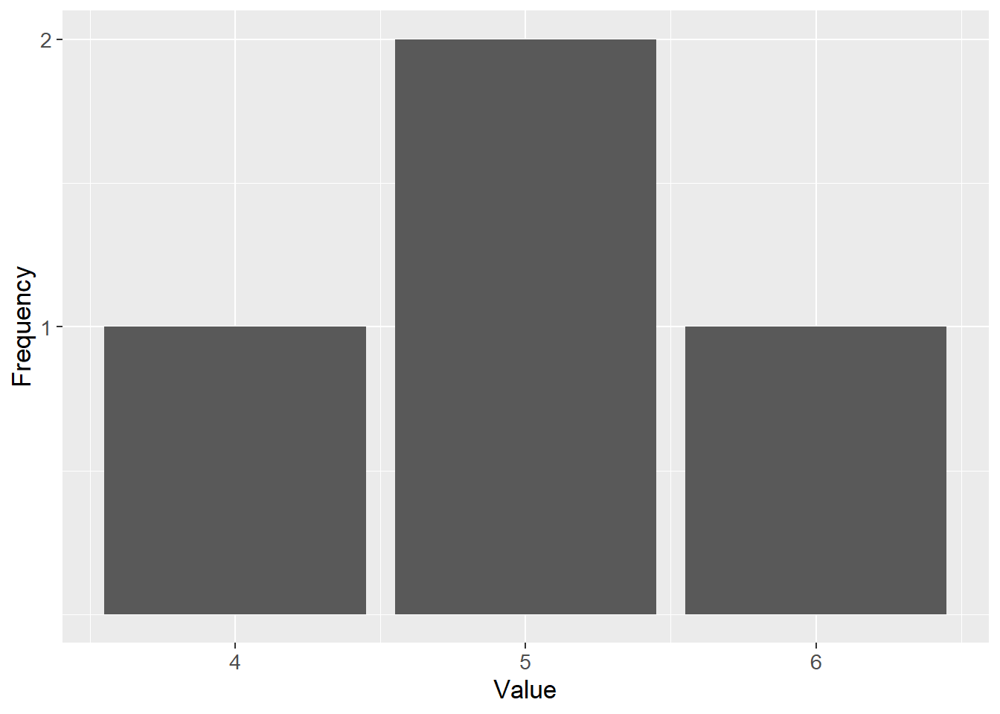
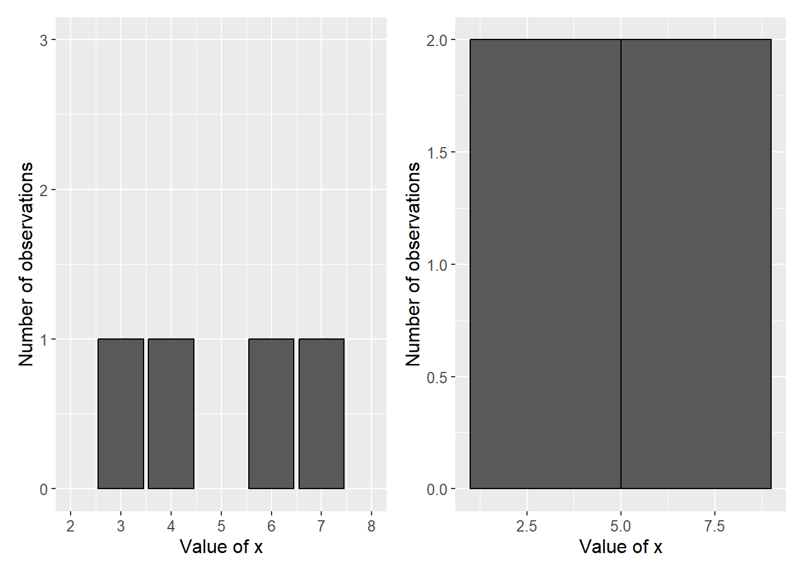
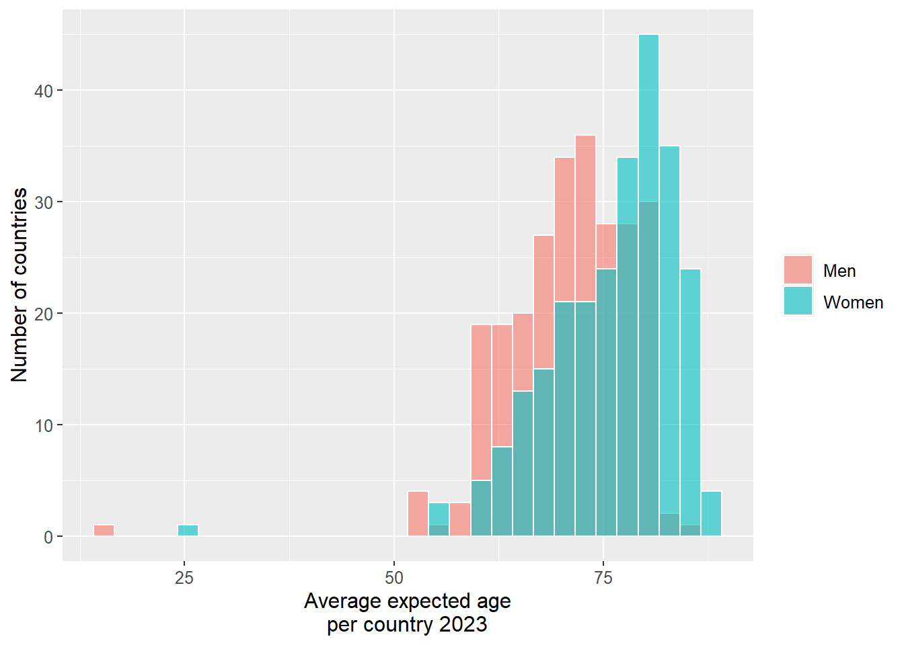
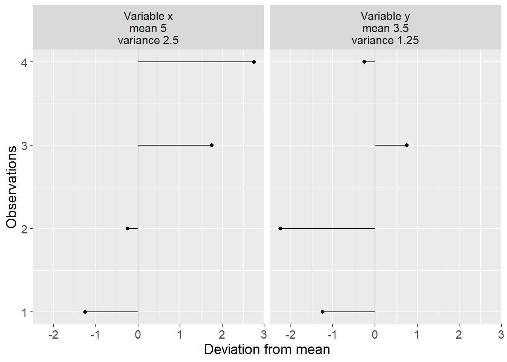
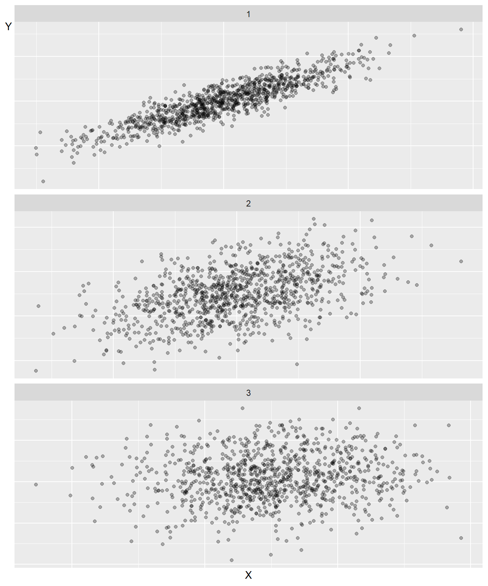
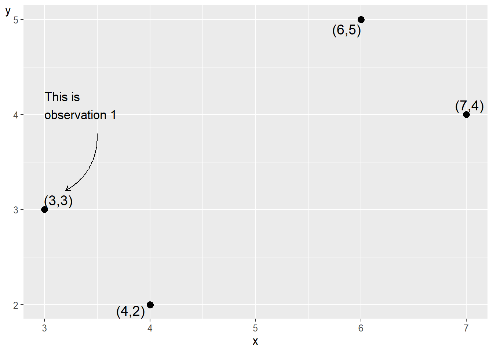

# Variation and covariation {#chap-variation-och-samvariation}

In the previous chapter we went through how covariation is a fundamental criterion for us to be able to argue that a causal relationship exists. In this chapter we will look more closely at variation and covariation and how to use mathematics to estimate these phenomena when we have access to data.

## Frequency Distribution {#sec-frekvensfordelning}

To study covariation between variables, observations must have different values; there must be variation within the variables. If we, for example, have ten observations for the variables $x$ and $y$ and all observations have the values $\left(x,y\right)=\left(5,23\right)$, then there is no variation within variable $x$ or $y$. The variables therefore cannot covary either.

One way to study the spread of values is frequency distribution. Suppose we have the following four values: 4, 5, 5 and 6, where the number 5 occurs twice. One way to show the spread in a collection of values is a bar graph, a graph where the frequency of each respective value is reported with bars. Figure \@ref(fig:frekvensfordelning-ex-1) shows the frequency distribution for the four values.

Now we have a variable $x$ that has the following four values: 3, 4, 6 and 7. Figure \@ref(fig:stapeldiagram-for-antal-obs) illustrates this variable in two different bar graphs. In the left graph this is illustrated with a bar of height 1 per value. The right graph shows a so-called histogram. A histogram is a form of bar graph where each bar represents an interval of values. In the graph to the right, the left bar represents the three values 3, 4 and 6. On the vertical y-axis, this bar therefore reaches up to the value 3, because the bar represents three observations. The right bar in the right graph we have one observation, which represents the value 7.

(\#fig:frekvensfordelning-ex-1)Frequency distribution for the values $4,5,5,6$

(\#fig:stapeldiagram-for-antal-obs)Two illustrations of a frequency distribution

Bar graphs and histograms are often used to describe the spread in data. Consider another example with more observations. Figure \@ref(fig:livslangd-kommunerna-man-kvinnor) shows a histogram that illustrates the distribution of average life expectancy for men and women in 290 countries and regions in the world, with one average value per gender and country/region. There are 290 observations for men and 290 observations for women. The horizontal x-axis shows the values for expected age, while the number of observations (countries or regions) is shown on the vertical y-axis.

In the graph we see that women on average live longer than men, since the bars for women are located more to the right in the graph. The bar furthest to the left and the right in the graph illustrates that there is a few places in the world where men and women, on average, tend to live shorter as well as longer lives, compared to the other places.

(\#fig:livslangd-kommunerna-man-kvinnor)Average expected life in countries and regions in the world. Data from Our World In Data.

## Measures of Central Tendency and Measures of Dispersion {#sec-spridningsmatt-kvartiler-och}

For describing what constitutes an average value for a collection of values, we use what are called measures of central tendency. Two examples of measures of central tendency are mean (sum divided by number) and median (the middle value). We introduced both of these measures in section \@ref(sec-medelvarde) . Another useful measure of central tendency is mode, which is the value that occurs most frequently. Consider the following fifteen numbers as an example:

| 1 | 1 | 1 | 4 | 5 | 6 | 6 | 6 | 7 | 8 | 8 | 9 | 9 | 9 | 9 |
| --- | --- | --- | --- | --- | --- | --- | --- | --- | --- | --- | --- | --- | --- | --- |

For this collection of values, the mode = 9 since the number 9 occurs most frequently. The median for these numbers is the value 6 since it is the middle value. The mean is the sum divided by the number of values $=89/15\approx5.93$.

To compare how the values are spread around the average value, we use different types of measures of dispersion. One way to get a picture of the spread in a collection of values is to calculate the range, the difference between the highest and lowest value. For the 15 numbers above, the range is $9-1=8$. A useful measure of dispersion is percentiles, which are the values that divide a collection of values into 100 parts. Similarly, other divisions are also used, such as deciles, quintiles and quartiles. A decile divides a collection of values into ten parts, quintile into five and quartile into four.

Percentiles are indicated with corresponding numbers 1–100, where $P_{10}$ symbolizes the tenth percentile and is the value that is greater than 10% of the values in the collection. Here we are content with a simplified example. Consider all the integers 0 to 1,000. The tenth percentile for this set is $P_{10}=100$, since the value 100 delimits the bottom 10 percent of the values. The fourteenth percentile is $P_{14}=140$. The twentieth percentile is $P_{20}=200$, and so on.

Percentiles $P_{10},\:P_{20},\:P_{30},\:P_{40},\:P_{50},\:P_{60},\:P_{70},\:P_{80}$ and $P_{90}$ are the same values as the deciles. Deciles can be written as $D_{1}$ for decile 1, which is the same value as $P_{10}$, $D_{2}$ for decile 2, and so on. Percentiles $P_{20},\:P_{40},\:P_{60}$ and $P_{80}$ are the same values as the quintiles, where $P_{20}=K_{1}$ for quintile 1. Percentiles $P_{25},\:P_{50}$ and $P_{75}$ are the same values as the quartiles, which divide the collection into four parts. Quartiles are often written as $Q_{1},\:Q_{2}$ and $Q_{3}$. $P_{50}=Q_{2}$ marks the middle value in the collection, which is the same thing as the median. Sometimes the concepts interquartile range and quartile deviation are used. Interquartile range is the difference between the third and first quartile: $Q_{3}-Q_{1}$. Quartile deviation is interquartile range divided by 2: $\left(Q_{3}-Q_{1}\right)/2$.

## Variance and standard deviation {#sec-varians-och-standardavvikelse}

Two other common measures of dispersion are variance and standard deviation. Both of these are very central to all statistical analysis, which is why we go through them a bit more thoroughly here. In section \@ref(sec-population-urval-superpopulation) we introduced population and sample. When we work with information and data variables, for example data that describes some phenomenon in society, we very rarely have access to reliable information about the population. When we study causal relationships, we lack observations for the counterfactual scenario that we are actually interested in and therefore do not have access to all data. Instead, we are then referred to trying to estimate what the population looks like by studying the sample data we have access to.

Say now that we are interested in variable x. In the population for this variable there are N number of observations and from this population we take n number of observations for our sample. Our goal is to find out what the spread in the population looks like and we use our sample data to study this. Note here that what we are actually constantly seeking are the values that exist in the population. We make calculations on our sample data to estimate the values in the population. The expressions estimate and estimate mean the same thing.

If we have access to population data, the mean is known. To mark this, the population's mean is usually written as $\mu_{x}$(the Greek letter mu). The mean $\bar{x}$ is an estimate of the population's $\mu_{x}$, where $\bar{x}=\sum_{i}x_{i}/n$.

To study spread, we calculate distance from the mean. In the population, the difference between observation $x_{i}$ and the mean $\mu_{x}$ is written as $x_{i}-\mu_{x}$, where letter $i$ means observation number $i$. With our sample data we take $x_{i}-\bar{x}$. The sum of differences from the mean $\sum_{i}\left(x_{i}-\bar{x}\right)$ is always 0, which we see by writing: 

$$
\begin{align}
\sum\left(x_{i}-\bar{x}\right) & =\sum x_{i}-n\bar{x} (\#eq:sum-of-diff-from-mean)\\
 & =\sum x_{i}-n\frac{1}{n}\sum x_{i}\nonumber \\
 & =\sum x_{i}-\sum x_{i}\nonumber \\
 & =0\nonumber
\end{align}
$$

One way to measure deviations from the mean is to estimate mean absolute deviation:

$$
\begin{equation}
\textbf{Mean absolute deviation} =\frac{1}{n}\sum\left|x_{i}-\bar{x}\right|
\end{equation}
$$

We can also replace the mean $\bar{x}$ with some other measure of central tendency such as median or mode. Another way to sum deviations from the mean to a positive value is to square the deviations: $\left(x_{i}-\bar{x}\right)^{2}$. If we divide the sum of the squared differences by the number of observations n, we get the variance for variable $x$:

$$
\begin{align}
\textbf{Variance: }\text{var}\left(x\right) & =\left(\frac{1}{n}\right)\sum_{i}^{n}\left(x_{i}-\bar{x}\right)^{2}
 (\#eq:varians-def-1-div-med-n)
\end{align}
$$

 where the parenthesis $\left(x_{i}-\bar{x}\right)^{2}$ shall be calculated for each observation and summed:

$$
\begin{equation}
\sum_{i}^{n}\left(x_{i}-\bar{x}\right)^{2}=\left(x_{1}-\bar{x}\right)^{2}+\left(x_{2}-\bar{x}\right)^{2}+...+\left(x_{n}-\bar{x}\right)^{2}
\end{equation}
$$

By squaring each deviation from the mean we get a positive measure. This also means that greater deviations from the mean will have a greater weight for the estimated variance.

In the same way that the mean $\bar{x}$ is an estimate of the population's $\mu_{x}$, $\text{var}\left(x\right)$ is an estimate of the variance in the population. The variance in the population is often denoted with the Greek letter small sigma squared, $\sigma_{x}^{2}$, which indicates that this is the population value for variable $x$.

Standard deviation for a collection of observations is the positive square root of the variance. For population, standard deviation is often denoted $\sigma_{x}$. Estimated standard deviation for variable $x$ can be written $\hat{\sigma}_{x}$, $sd_{x}$ or $s_{x}$: 

$$
\begin{align}
\textbf{Standard deviation: } & s_{x}=+\sqrt{\text{var}\left(x\right)}=\left(\frac{\sum_{i}^{n}\left(x_{i}-\bar{x}\right)^{2}}{n}\right)^{1/2}
\end{align}
$$

When we estimate the mean with sample data $\left(\bar{x}\right)$, this often deviates from the population's mean $\left(\mu_{x}\right)$. This deviation tends to lead to our estimate of the population's variance becoming too small. To correct for this, in the equation for variance (equation \@ref(eq:varians-def-1-div-med-n) ) we divide by $n-1$ instead of $n$. This new definition of variance is called corrected variance or sample variance: 

$$
\begin{equation}
\textbf{Sample variance: }\text{var}\left(x\right)=\left(\frac{1}{n-1}\right)\sum_{i}^{n}\left(x_{i}-\bar{x}\right)^{2}
 (\#eq:varians-def-2-div-n-1)
\end{equation}
$$

Division by $n-1$ is called Bessel's correction and often results in the estimated variance being closer to the population's variance. Many computer programs have ready commands for estimating (calculating) variance and then use Bessel's correction as in equation \@ref(eq:varians-def-2-div-n-1) . For standard deviation we also use Bessel's correction:

$$
\begin{align}
\textbf{Sample standard deviation: }s_{x} & =\left(\frac{\sum_{i}^{n}\left(x_{i}-\bar{x}\right)^{2}}{n-1}\right)^{1/2}
\end{align}
$$

If we have a constant a that represents an arbitrary value, the variance for this is $\text{var}\left(a\right)=0$. This is because a single value has no spread. If $a$ is multiplied by a variable $x$, the variance for $ax$ equals $a^{2}\text{var}\left(x\right)$. We see this by taking: 

$$
\begin{align}
\text{var}\left(ax\right) & =\left(\frac{1}{n}\right)\sum_{i}\left(ax_{i}-a\bar{x}\right)^{2}\\
 & =\left(\frac{1}{n}\right)\sum_{i}\left(a^{2}x_{i}^{2}-2a^{2}\bar{x}+a^{2}\bar{x}^{2}\right)\nonumber 
\end{align}
$$

Since $a$ is not affected by the summation, we factor out all $a^{2}$: 

$$
\begin{equation}
\begin{aligned}
\text{var}\left(ax\right) & =a^{2}\left(\frac{1}{n}\right)\sum\left(x_{i}^{2}-2\bar{x}+\bar{x}^{2}\right)\\
 & =a^{2}\left(\frac{1}{n}\right)\sum\left(x_{i}-\bar{x}\right)^{2}\\
 & =a^{2}\text{var}\left(x\right)
\end{aligned}
(\#eq:var-ax-a2-var-x)
\end{equation}
$$

For standard deviation we get:

$$
\begin{align}
s_{x}\left(ax\right) & =\left(\frac{1}{n}\sum_{i}^{n}\left(ax_{i}-a\bar{x}\right)^{2}\right)^{1/2}\\
 & =\left(\frac{1}{n}\sum_{i}^{n}\left(a^{2}x_{i}^{2}-2a^{2}\bar{x}+a^{2}\bar{x}^{2}\right)\right)^{1/2}\nonumber \\
 & =\left(a^{2}\right)^{1/2}\left(\frac{1}{n}\sum_{i}^{n}\left(x_{i}-\bar{x}\right)^{2}\right)^{1/2}\nonumber \\
 & =\left|a\right|s_{x}\nonumber 
\end{align}
$$

Table: Some calculations with variables $x$ and $y$(\#tab:variablerna-x-y-nagra-berakningar-k18)

| Observation | $x_{i}$| $y_{i}$| $x_{i}-\bar{x}$| $y_{i}-\bar{y}$| $\left(x_{i}-\bar{x}\right)^{2}$| $\left(y_{i}-\bar{y}\right)^{2}$|
| --- | --- | --- | --- | --- | --- | --- |
| 1 | 3 | 3 | $-2$| $-0,5$| 4 | 0,25 |
| 2 | 4 | 2 | $-1$| $-1,5$| 1 | 2,25 |
| 3 | 6 | 5 | 1 | 1,5 | 1 | 2,25 |
| 4 | 7 | 4 | 2 | 0,5 | 4 | 0,25 |
| Mean | 5 | 3,5 | | | | |
| Sum | 20 | 14 | | | 10 | 5 |

 

(\#fig:varians-for-tva)Variance for variables $x$ and $y$

 where $\left|a\right|$ is the absolute value of the constant a. Now we shall calculate (estimate) the variance with four observations for two variables: $x$ and $y$. Variable $x$ has the values 3, 4, 6 and 7. Variable y has the values 3, 2, 5 and 4. Table \@ref(tab:variablerna-x-y-nagra-berakningar-k18) summarizes the calculations we need. We use the definition of variance from equation \@ref(eq:varians-def-2-div-n-1) : 

$$
\begin{equation}
\begin{aligned}
\text{var}\left(x\right) & =\frac{\sum_{i}\left(x_{i}-\bar{x}\right)^{2}}{n-1}=\frac{10}{3}\\
\text{var}\left(y\right) & =\frac{\sum_{i}\left(y_{i}-\bar{y}\right)^{2}}{n-1}=\frac{5}{3}
\end{aligned}
(\#eq:varians-for-x-och-y)
\end{equation}
$$

The variance for variable $x$ is larger than the variance in variable $y$. This indicates that the values in $x$ are more spread out from the mean compared to the spread in variable $y$. Figure \@ref(fig:varians-for-tva) illustrates deviations from the mean for each respective variable. In the heading for each respective graph, mean and variance are reported. To calculate standard deviation for variables $x$ and $y$, we take the positive square root of the variance: 

$$
\begin{equation}
\begin{aligned}
s_{x}= & \sqrt{\frac{\sum_{i}^{n}\left(x_{i}-\bar{x}\right)^{2}}{n-1}}=+\sqrt{\frac{10}{3}}\approx10.05\\
s_{y}= & +\sqrt{\frac{5}{3}}\approx0.745
\end{aligned}
(\#eq:standardavvikelse-ex1-x-y)
\end{equation}
$$

We summarize some of the measures of central tendency and measures of dispersion with the two tables below. In the upper table, a collection of values is presented. In the lower table \@ref(tab:fig-ex-spridning-lagesmatt), these are described with measures of central tendency and measures of dispersion.

| $x_{i}$| 12 | 27 | 35 | 38 | 53 | 53 | 55 | 57 | 66 | 69 | 74 | 89 | 98 |
| --- | --- | --- | --- | --- | --- | --- | --- | --- | --- | --- | --- | --- | --- |
| $i$| 1 | 2 | 3 | 4 | 5 | 6 | 7 | 8 | 9 | 10 | 11 | 12 | 13 |

Table: Example with measures of central tendency and measures of dispersion. (\#tab:fig-ex-spridning-lagesmatt)

| Measure | Description | Result |
| --- | --- | --- |
| Mean | Sum divided by number | 55.8 |
| Median | Middle value | 55 |
| Mode | Most frequently occurring | 53 |
| Quartiles | Divides the distribution into four parts | $Q_{1}=38$, $Q_{3}=69$|
| Percentiles | Divides the distribution into parts | $P_{20}=36.2$, $P_{80}=72$|
| Variance | Measures spread among values | 539.1 |
| Standard deviation | Positive square root of the variance | 23.2 |
| Minimum | Smallest value | 12 |
| Maximum | Greatest value | 98 |

## Standardized values {#sec-standardiserade-varden}

It is difficult to compare variance between two different variables if the variables are measured in different units, for example, such as weight and height. One method to facilitate comparisons between variables is standardization and normalization. Standardized values for a variable x are a measure of how far a value $\left(x_{i}\right)$ in a variable is from the variable's mean $\left(\bar{x}\right)$ counted in number of standard deviations. This is a very useful measure that is often used in statistics. Standardized values are also called standard scores, z-scores or z-values. Standardized values for a variable x can be calculated in the following way:

$$
\begin{equation}
\textbf{Standardized value: }x_{i}=z_{i}=\frac{x_{i}-\bar{x}}{s_{x}}
 (\#eq:standardiserat-varde-1)
\end{equation}
$$

 where $x_{i}$ is each respective value in variable $x$ and $z_{i}$ is the standardized value of $x_{i}$. $\bar{x}$ is the mean for $x$ and $s_{x}$ is the standard deviation for variable $x$. Each observation's distance to the mean is divided by the standard deviation for the current variable. Standardized variables always get the mean 0 and standard deviation 1.

If we take our variables $x$ and $y$ that we used as examples in the previous section and convert these to standardized values, we get the two new variables $z_{x}$ and $z_{y}$. Calculations and results are reported in table \@ref(tab:standardiserade-varden-x-y) . Observations 1 and 2 for $z_{x}$ and $z_{y}$ become negative since these values lie below their respective means.

Table: Standardized values (\#tab:standardiserade-varden-x-y)

| Observation | $x_{i}$| $y_{i}$| $z_{x}=\left(x_{i}-\bar{x}\right)/s_{x}$| $z_{y}$|
| --- | --- | --- | --- | --- |
| 1 | 3 | 3 | $-1.1$| $-0.39$|
| 2 | 4 | 2 | $-0.55$| $-1.16$|
| 3 | 6 | 5 | $0.55$| 1.16 |
| 4 | 7 | 4 | 1.1 | 0.39 |
| Mean, $\bar{x}$ and $\bar{y}$| 5 | 3.5 | 0 | 0 |
| Standard deviation, $s$| 1.83 | 1.29 | 1 | 1 |

Normalization can mean slightly different things in statistics. One meaning is to convert a variable so that all values become between 0 and 1. Normalization of a variable $x$ is done in the following way:

$$
\begin{equation}
\textbf{Normalized value: }x_{norm}=\frac{x_{i}-x_{min}}{x_{max}-x_{min}}
 (\#eq:normalisering)
\end{equation}
$$

 where $x_{i}$ is observation i for variable $x$, $x_{min}$ is the lowest value in variable $x$ and $x_{max}$ is the highest value for the variable. Similar to standardization, this can also be used to compare variables that otherwise differ from each other. Table \@ref(tab:normaliserade-varden-for) shows normalized values for variables $x$ and $y$.

So far in this chapter we have described different ways to measure and study variation in data. Next we will introduce covariation - how to compare variation in two or more variables (phenomenon). As described in the previous chapter covariation is the basic method to study causal relationships.

Table: Normalized values (\#tab:normaliserade-varden-for)

| 
Observation
 | $x_{i}$| $y_{i}$| $x_{norm}$| $y_{norm}$|
| --- | --- | --- | --- | --- |
| 1 | 3 | 3 | 0 | 0.33 |
| 2 | 4 | 2 | 0.25 | 0 |
| 3 | 6 | 5 | 0.75 | 1 |
| 4 | 7 | 4 | 1 | 0.67 |
| Min. | 3 | 2 | 0 | 0 |
| Max. | 7 | 5 | 1 | 1 |

## Covariation in graphs {#sec-samvariation-i-diagram}

In section \@ref(sec-samvariation) we introduced the concept of covariation and went through how positive covariation means that low values for one variable X on average are associated with low values for another variable Y, and that high values on average are associated with high values. Negative covariation means that high values in one variable X are associated with low values in the other variable Y and low values in X are associated with high values in Y.

One way to study covariation is to illustrate the information we are interested in in graphs. But graphs rarely go particularly far. Here follows an attempt to illustrate these things. Figure \@ref(fig:tre-exempel-pa-samvariation) illustrates three examples that describe covariation between the two variables X and Y. Each graph shows its own collection of observations, where each dot represents an observation with a value for X and Y respectively. In the uppermost graph, no. 1, we see a clear positive covariation. The dots lie almost on a straight line up toward the right in the graph. In the graph we may relatively easily read how much variable Y changes on average when X increases by one unit, in the same way as when we introduced linear functions and graphs in chapter \@ref(chap-funktioner-och-diagram) .

In graph no. 2 we can still describe the placement of the dots roughly as along a line up toward the upper right corner. But the dots are more spread out, which makes it a bit harder to say with certainty exactly how much Y changes on average when we go from low to high values on X. It therefore requires a more detailed analysis with the help of calculations if we want to know something more exact about the relationship between the variables.

In the third graph at the bottom it is more uncertain whether we have any meaningful relationship between the variables at all. The dots are spread out as in a large cloud. But even in this graph there is a positive covariation between X and Y, which the author knows since the graph's data is created with the help of the computer.

As a rule, it is required that we calculate covariations more carefully in order for us to be completely sure whether the variables can be assumed to covary or not, and how large this covariation is.

(\#fig:tre-exempel-pa-samvariation)Three examples of covariation

## Covariation 1: Covariance {#sec-kovarians}

Now we shall introduce our first statistical measure of linear covariation: covariance. Covariance is a measure of covariation between two variables, for example $x$ and $y$. For population data:

$$
\begin{equation}
cov(x,y)=\frac{1}{n}\sum_{i}^{n}(x_{i}-\bar{x})(y_{i}-\bar{y})
\end{equation}
$$

Our goal is to estimate the covariation in a population and possibly a superpopulation. From our population we take a sample of observations that we use to estimate the covariation.

In previous examples we have worked with populations for one variable. Since we are now interested in covariation, our population consists of two variables. The covariance between $x$ and $y$ in a population is denoted $\sigma_{xy}$(compare the notation for the population's variance $\sigma_{x}$). Positive covariance means positive covariation: higher values of $x$ are associated with higher values of $y$. Negative covariance means negative covariation, that higher values of $x$ are associated with smaller values of $y$ and vice versa. It does not matter in which order we write the variables in the parentheses: $\text{cov}\left(x,y\right)=\text{cov}\left(y,x\right)$. If we take the covariance for $x$ and the same variable $x$, we get the variance of $x$:

$$
\begin{align}
\text{cov}\left(x,x\right) & =\left(\frac{1}{n}\right)\sum_{i}^{n}\left(x_{i}-\bar{x}\right)\left(x_{i}-\bar{x}\right)\\
 & =\left(\frac{1}{n}\right)\sum_{i}^{n}\left(x_{i}-\bar{x}\right)^{2}\nonumber \\
 & =\text{var}\left(x\right)\nonumber 
\end{align}
$$

We can also apply Bessel's correction here to reduce the underestimation of the spread in the population that we risk making. This gives us what is called sample covariance:

$$
\begin{equation}
\textbf{Sample covariance: }\text{cov}\left(x,y\right)=\left(\frac{1}{n-1}\right)\sum_{i}\left(x_{i}-\bar{x}\right)\left(y_{i}-\bar{y}\right)
 (\#eq:cov-sample)
\end{equation}
$$

(\#fig:data-for-kovarians-1)Four observations for $x$ and $y$

 

Table: Calculations for covariance between $x$ and $y$(\#tab:berakningar-for-kovarians)

| Observation | $x_{i}$| $y_{i}$| $x_{i}-\bar{x}$| $y_{i}-\bar{y}$| $\left(x_{i}-\bar{x}\right)\left(y_{i}-\bar{y}\right)$|
| --- | --- | --- | --- | --- | --- |
| 1 | 3 | 3 | $-2$| $-0.5$| 1 |
| 2 | 4 | 2 | $-1$| $-1.5$| 1.5 |
| 3 | 6 | 5 | 1 | 1.5 | 1.5 |
| 4 | 7 | 4 | 2 | 0.5 | 1 |
| Mean | 5 | 3.5 | | | |
| Sum | | | | | 5 |

Let us estimate the covariance between variables x and y that we used in the previous section. Figure \@ref(fig:data-for-kovarians-1) describes our four observations in a table to the left and a graph to the right. In the table we have one observation per row and one variable per column. In the graph each observation is represented by a point. The point furthest to the left is observation 1: $\left(x,y\right)=\left(3,3\right)$. The point furthest to the right is observation 4: $\left(x,y\right)=\left(7,4\right)$. Row 1 in the table consists of the first value for x and y respectively and represents values that belong together in some way. If we work with observed data, collected information, each observation represents an observation unit, for example information about a person or perhaps a country. Our four observations could thus represent four people, four countries or something else. In table \@ref(tab:berakningar-for-kovarians) we have calculated the parts we need to get the covariance between x and y (equation \@ref(eq:cov-sample) ): 

$$
\begin{align}
\text{cov}\left(x,y\right) & =\left(\frac{1}{n-1}\right)\sum_{i}\left(x_{i}-\bar{x}\right)\left(y_{i}-\bar{y}\right)=\left(\frac{1}{3}\right)\times5=\frac{5}{3}
 (\#eq:cov-ex-1)
\end{align}
$$

We find that $\text{cov}\left(x,y\right)=\frac{5}{3}$. This positive value indicates positive covariation. Covariance is useful for getting an estimate of whether the covariation between two variables is positive or negative, but it is difficult to say much more than that. There are no limitations for which values covariance can take. The value of covariance depends on which unit the variables' values have. For example, we will get different results depending on whether we use a variable that describes income in USD or in thousands of USD.

## Covariation 2: The correlation coefficient {#sec-pearsons-r}

Another measure of linear covariation is Pearson's $r$, also called Pearson's correlation coefficient or the correlation coefficient. The correlation coefficient for variables $x$ and $y$ is denoted for population $\rho_{xy}$(Greek rho): 

$$
\begin{align}
\textbf{Correlation coefficient: }\rho_{xy} & =\frac{\sigma_{xy}}{\sigma_{x}\sigma_{y}}
 (\#eq:pearsons-r-population)
\end{align}
$$

 where $\sigma_{xy}$ is the covariance between $x$ and $y$ in the population, and $\sigma_{x}$ and $\sigma_{y}$ are standard deviation in the population for each respective variable.

Another way to describe this is that the correlation coefficient is standardized covariance (compare section \@ref(sec-standardiserade-varden) ). The correlation coefficient can only take values between $-1$ and 1, where $-1$ means perfect negative correlation and 1 means perfect positive correlation. If the correlation coefficient equals 0, this indicates that there is no linear covariation between the variables. Since all results for the correlation coefficient are within the interval $\left[-1,1\right]$, different correlation coefficients are comparable.

If we work with sample data, the correlation coefficient is denoted $r_{xy}$ or $corr\left(x,y\right)$:

$$
\begin{equation}
r_{xy}=\frac{\text{cov}\left(x,y\right)}{s_{x}s_{y}}
\end{equation}
$$

 where we instead have estimated covariance in the numerator and estimated standard deviation for the two variables in the denominator. The different parts in this equation we have defined earlier in this chapter. We write out the equations and add Bessel's correction:

$$
\begin{equation}
\begin{aligned}
r_{xy} & =\frac{\text{cov}\left(x,y\right)}{s_{x}s_{y}}\\
 & =\frac{\left(\frac{1}{n-1}\right)\sum_{i}^{n}\left(x_{i}-\bar{x}\right)\left(y_{i}-\bar{y}\right)}{\left(\frac{\sum_{i}^{n}\left(x_{i}-\bar{x}\right)^{2}}{n-1}\right)^{1/2}\left(\frac{\sum_{i}^{n}\left(y_{i}-\bar{y}\right)^{2}}{n-1}\right)^{1/2}}\\
 & =\frac{\left(n-1\right)^{-1}\sum_{i}^{n}\left(x_{i}-\bar{x}\right)\left(y_{i}-\bar{y}\right)}{\left(n-1\right)^{-1}\left(\sum_{i}^{n}\left(x_{i}-\bar{x}\right)^{2}\right)^{1/2}\left(\sum_{i}^{n}\left(y_{i}-\bar{y}\right)^{2}\right)^{1/2}}\\
 & =\frac{\sum_{i}^{n}\left(x_{i}-\bar{x}\right)\left(y_{i}-\bar{y}\right)}{\left(\sum_{i}^{n}\left(x_{i}-\bar{x}\right)^{2}\right)^{1/2}\left(\sum_{i}^{n}\left(y_{i}-\bar{y}\right)^{2}\right)^{1/2}}
\end{aligned}
(\#eq:pearsons-r-sample)
\end{equation}
$$

Since Bessel's correction is included in all three measures, we cancel $\left(n-1\right)^{-1}$ from both numerator and denominator in the last row. Let us again demonstrate by estimating $r_{xy}$ for the two variables $x$ and $y$ and their four observations from figure \@ref(fig:data-for-kovarians-1) . We reuse the results for covariance (equation \@ref(eq:cov-ex-1) ) and standard deviation for $x$ and $y$(equation \@ref(eq:standardavvikelse-ex1-x-y) ):

$$
\begin{align}
r_{xy} & =\frac{\text{cov}\left(x,y\right)}{s_{x}s_{y}}\approx\frac{5/3}{\left(+\sqrt{\frac{10}{3}}\right)\left(+\sqrt{\frac{5}{3}}\right)}\approx0.71
 (\#eq:pearsons-0-71)
\end{align}
$$

This result indicates a positive correlation. High values of $x$ coincide with high values of $y$ and low values of $x$ coincide with low values of $y$. Different correlation coefficients can be compared but it is still difficult to interpret this type of result more precisely.

## Chapter summary

- Frequency distribution shows number of observations per value or interval and can be reported in for example a table or a graph. A special type of bar graph that is often used in these cases is histogram, which shows frequencies per interval. In statistics, different measures of dispersion are used to measure distribution of values in a variable.

- Variance in the population for variable $x$: $\sigma_{x}$. Estimated variance with sample data for the same variable $x$: $\hat{\sigma_{x}}=\text{var}\left(x\right)=\frac{1}{n}\sum\left(x_{i}-\bar{x}\right)^{2}$ where $n$ is number of observations, $x_{i}$ is observation i of variable $x$ and $\bar{x}$ is mean.

- Standard deviation for variable $x$: $+\sqrt{\sigma_{x}}$. For sample data: $\hat{\sigma}_{x}=s_{x}=+\left(var\right)^{1/2}=\left(\frac{\sum\left(x_{i}-\bar{x}\right)}{n}\right)^{1/2}$.

- Bessel's correction means that we divide by $n-1$ instead of $n$. This reduces the error that risks arising when we use sample data to estimate measures of dispersion for a population. Bessel's correction can also be used for other measures.

- Standardized value, also called z-value or z-score, indicates a value's difference with the mean divided by standard deviation. For variable x this can be calculated $z_{x}=\frac{x_{i}-\bar{x}}{s_{x}}$. Normalized values for variable $x$ are given by $x_{norm}=\frac{x_{i}-x_{min}}{x_{max}-x_{min}}$.

- Covariance is a measure of linear covariation between two variables. For the population for $x$ and $y$: $\sigma_{xy}$. Estimated with sample data: $\hat{\sigma}_{xy}=\text{cov}\left(x,y\right)=\frac{1}{n}\sum\left(x_{i}-\bar{x}\right)\left(y_{i}-\bar{y}\right)$.

- The correlation coefficient (Pearson's r) for population: $\rho_{xy}=\frac{\text{cov}\left(x,y\right)}{s_{x}s_{y}}$. Sample data: $r_{xy}=\sum\left(\frac{x_{i}-\bar{x}}{s_{x}}\right)\left(\frac{y_{i}-\bar{y}}{s_{y}}\right)$ where $s_{x}$ is standard deviation for variable $x$.

## Exercises

