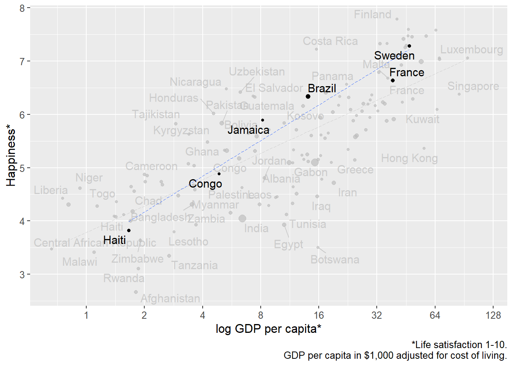
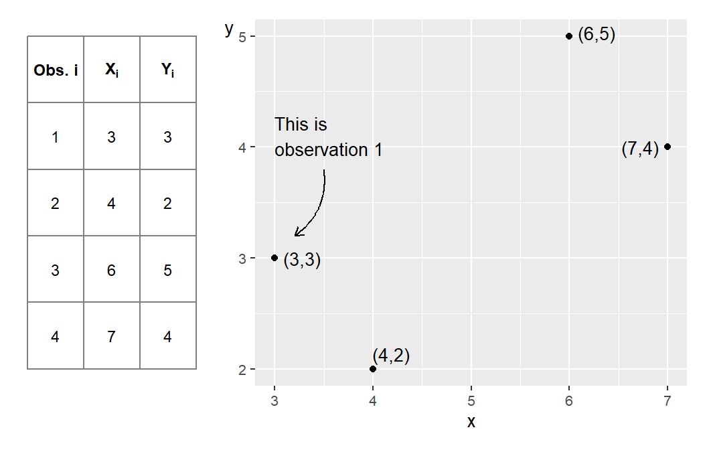
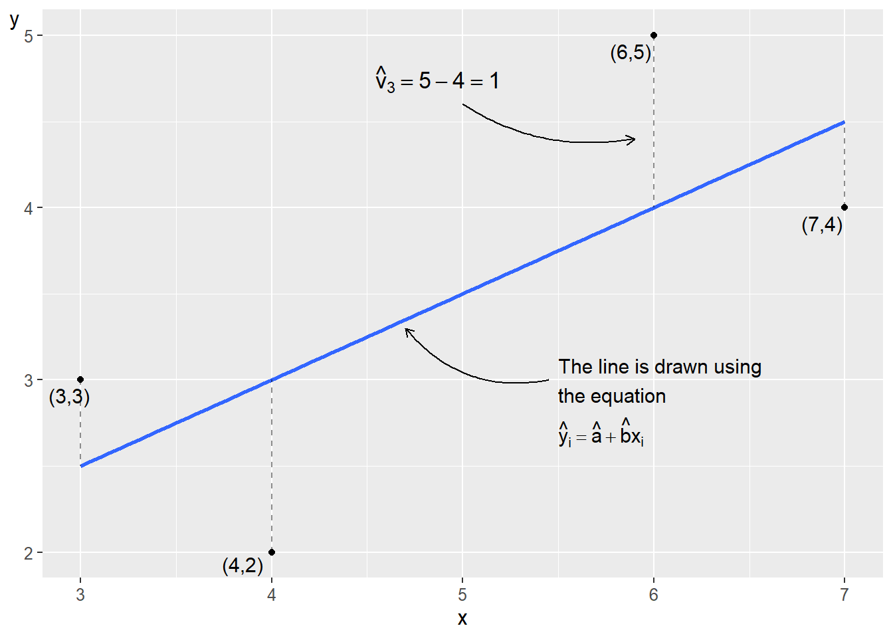
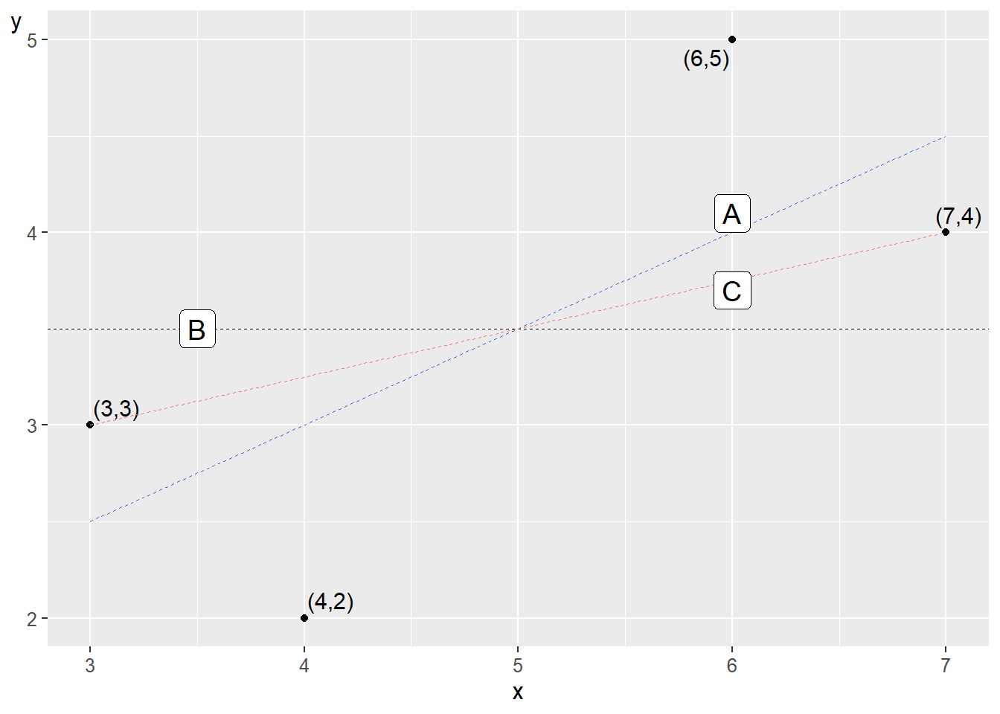
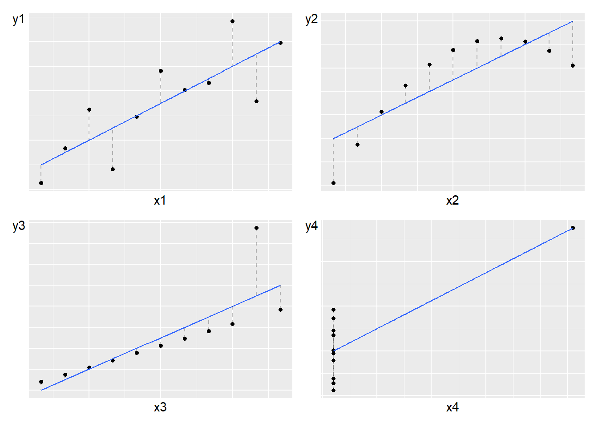
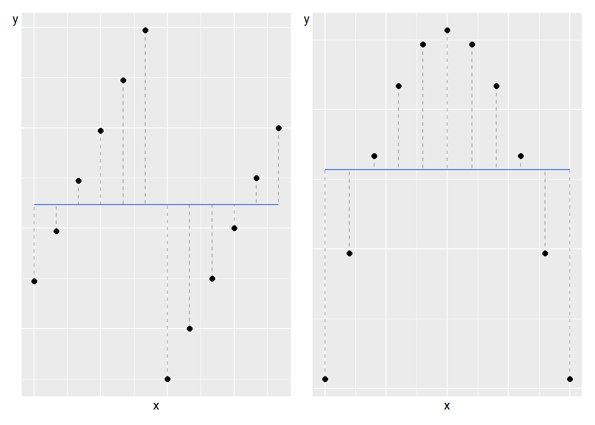
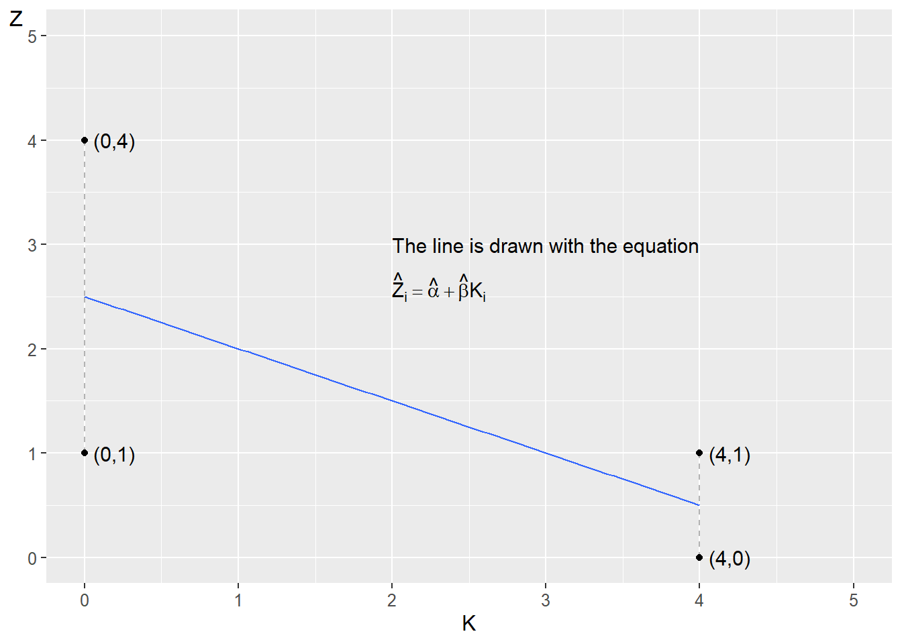
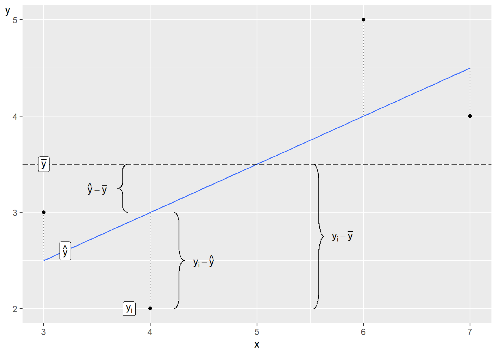

# The Least Squares Method {#chap-ols}

This chapter introduces the least squares method, which is another method for studying linear covariation. In chapter \@ref(chap-kontrafaktisk-analys) we introduced different ways to study covariation among two variables. The least squares method can be used to study how one variable covaries with one or several other variables simultaneously. In this chapter, we begin by estimating the covariation between two variables to later introduce several variables.

The least squares method is a central building block within social and natural sciences, which is why we will devote much attention to this in the rest of this book. The least squares method can be traced back to 1805 when the French mathematician Adrien-Marie Legendre (1752–1833) published a book about comets (Legendre, 1806). The earliest example within social science research is [Yule (1899)](https://www.jstor.org/stable/2979889), which represents the first known example of using the least squares method with multiple variables.

The chapter will start with some basic logic behind the least square method, and then introduce the mathematical basics on how to calculate covariation with this method. In the next chapter we will introduce some examples from social science.

## Basic logic

In figure \@ref(fig:gdp-and-happiness-ols-illustration-1) (same as the graph to the right in figure \@ref(fig:bnp-och-lycka-1) ) we see a straight black line through the black dots. The line show the average change in happiness (on the vertical axis) as we go from low values of GDP to higher (on the horizontal axis). This line is not any line. It is drawn using a special method called the least squares method. The line is an illustration of a numerical result given by calculations based on the observations (the black dots), where each dot represents a combined value of happiness and GDP.

The straight black line is called the regression line. The least squares method is an example of regression analysis, which is a field within statistics. This book does not cover any other regression methods.

The least squares method is one way to calculate the average change in one variable, which we call the explained (or dependent) variable, as another (the explanatory or independent) variable increase with one unit. In the case of figure \@ref(fig:gdp-and-happiness-ols-illustration-1) we have calculated the average change in the variable happiness (the explained variable), as GDP per capita (the explanatory variable) increases with one unit. One unit of GDP per capita is in this case equal to 1,000 USD adjusted for local prices, purchasing power.

Why would we want to calculate this? For instance, this may be interesting if we wish to test some kind of theory of how GDP, or income, affects happiness. The graphical result in figure \@ref(fig:gdp-and-happiness-ols-illustration-1) indicate a positive covariation – people in countries with higher GDP is happier on average. But suppose now that we have a theory that says that this happiness is actually caused by temperature. Using least squares we can measure covariation between both temperature and happiness, as well as covariation between GDP and happiness at the same time. This way, we may study to what extent GDP or temperature may explain happiness. This require that we can use least squares with three or more variables. These kind of methods are extremely useful for a lot of analytical work and is introduced in chapter \@ref(chap-ols-flera-variabler-matriser) .

Before we move on to the mathematics behind the least squares method it is important to remember that when we study covariation we are usually trying to estimate covariation in a population. But since population values are usually unknown, we use sample data to estimate the population covariation. Estimations of population values are associated with uncertainty. In chapter \@ref(ch-regression-statistical-tests) we will introduce how we can calculate probabilities regarding this uncertainty.

(\#fig:gdp-and-happiness-ols-illustration-1)GDP and happiness

## Covariation with Straight Line {#sec-minstakvadratmetoden-ols}

For our calculations, we will here again use the same made up observations for the variables $X$ and $Y$ as in chapter \@ref(chap-kontrafaktisk-analys), which are repeated in figure \@ref(fig:tab-data-for-ols-1) . The reason we use these numbers is to make the mathematical calculations easy. In the hypothetical examples here, it is irrelevant exactly what the population represents and calculated examples are used only as illustration of the method.

All straight lines in a graph can be described with an equation of the form $Y=a+bX$, that is, the equation of the straight line (section \@ref(sec-den-rata-linjens) ). The constant coefficient $a$ is the line's y-intercept or intercept while the constant coefficient b is the line's slope, or slope coefficient. $Y$ and $X$ are in this case our variables. The line we will draw will give us an illustration of the average change in variable $Y$ as we move from relatively lower to relatively higher values on $X$.

(\#fig:tab-data-for-ols-1)Four observations for $x$ and $y$

Figure \@ref(fig:ols-1) shows the four points and a straight line, which slopes upward in the graph and illustrates the linear covariation between the points. The least squares method allows us to use information from $X$ and $Y$ to find precisely those values for the coefficients a and b that allow us to draw the straight line through the points where the sum of the vertical squared distance between each point and the straight line is as small as possible.

In the figure's graph, an example of the distance is given in the form of $\hat{v}_{3}=5-4$. Any other straight line would result in a larger summed vertical distance between the points and the line. If the distance between a point and the line equals 5, the squared distance is the same value squared, $5^{2}=25$. Points that lie below the line get a negative distance, for example -5, and the squared value then becomes $\left(-5\right)^{2}=25$.

(\#fig:ols-1)A line drawn using the least squares method

## Regression analysis {#sec-regressionsanalys}

The least squares method is one of several methods in regression analysis. In regression analysis we determine the variable whose variation we will map based on the variation in one or several other variables. Variation in an explanatory variable is used to explain some or all of the variation in an explained variable.

Regression analysis is a method for mapping patterns in data. We then use this to study causal relationships. But as discussed in earlier sections it is important to remember that patterns (covariation) are no proof of a causal relationship (chapter \@ref(chap-kontrafaktisk-analys) ). The term "explanatory variable" therefore does not mean that one variable necessarily is the cause behind the state of the other variable.

We will now, based on the least squares method, estimate the linear covariation between the variables $Y$ and $X$ where we determine that $Y$ is our explained variable and $X$ is our explanatory variable. How we decide this depends on what idea underlies our analysis, for example a theory about GDP and happiness. Based on this, we set up the following regression model: 

$$
\begin{equation}
Y=a+bX+V
 (\#eq:regressionsmodell-1)
\end{equation}
$$

Since variable $Y$ stands to the left of the equals sign in the regression model, it is the explained variable. Variable $X$, to the right of the equals sign, is the explanatory variable. This regression model exists in our population, it is the population model or the population's regression model. With sample data, we can estimate this population model. Depending on the purpose of the study, we may also have an interest in our regression model representing a relation in a superpopulation (section \@ref(sec-population-urval-superpopulation) ).

The letters $a$ and $b$ are the model's coefficients or parameters. The slope coefficient $b$ should be read as a marginal increase in variable $X$ being associated with on average $b$ change in variable $Y$. Coefficient $a$, the constant, is the line's y-intercept. We do not know what values $a$ and $b$ have in the population model. That is what we want to estimate. The estimated versions of the coefficients' population values $a$ and $b$ we write as $\hat{a}$ and $\hat{b}$. The hat symbol $\left(\hat{}\right)$ is estimated values, that is, our estimates with sample data of population values (compare figure \@ref(fig:ols-1) ). Letters $a$ and $b$ without the hat symbol refer to their population values.

If we have a population with $N$ number of observations, from which we obtain $n$ number of observations for our sample, we use these $n$ observations to estimate the coefficients $\hat{a}$ and $\hat{b}$, and thereafter $\hat{Y}$. The line we will draw is called the regression line (already drawn in figure \@ref(fig:ols-1) ). When we have estimated $\hat{a}$ and $\hat{b}$, we can with the help of the observations in variable $X$ also estimate new values for variable $Y$. The estimated version of $Y$ we call $\hat{Y}$, which is the $Y$-value on the regression line. The estimated coefficients $\hat{a}$ and $\hat{b}$ that we seek in this case are constants, which means that they have the same values regardless of which values for variable $X$ we compare against.

In the regression model, the letter $V$ represents what is called the error term. Regression analysis aims to measure the extent to which variations in the explanatory variable(s) coincide with variations in the explained variable $Y$. The error term indicates the difference between each observation's $Y$-value and the regression line in the population. Estimated error terms are called residuals, written $\hat{V}$, and are the difference between $\hat{Y}$(the $Y$-values along the regression line) and observed $Y$: 

$$
\begin{equation}
\hat{V}_{i}=Y_{i}-\hat{Y_{i}}
 (\#eq:residulaen-def-1)
\end{equation}
$$

If we insert the estimated coefficients, the residuals and the variable $\hat{Y}$ into the regression model in equation \@ref(eq:regressionsmodell-1) we write:

$$
\begin{equation}
\hat{Y}=\hat{a}+\hat{b}X+\hat{V}
\end{equation}
$$

Our regression model $Y=a+bX+V$ can also be written:

$$
\begin{equation}
Y_{i}=a+bX_{i}+V_{i}
 (\#eq:regressionsmodell-1a)
\end{equation}
$$

The letter $i$ is an index for observation number. In this case, we use the four observations in figure \@ref(fig:tab-data-for-ols-1) , which is why $i=\left\{ 1,2,3,4\right\}$. If we take observation $i=2$, we have $Y_{2}=a+bX_{2}+V_{2}$. The two values for $a$ and $b$ are constant for all observations and these therefore do not have any index $i$.

Before we go through the mathematics around the least squares method, we look at the equation for the regression line in figure \@ref(fig:ols-1) . If variable $X$ increases by 1, this is associated with an on average 0.5 higher value on $Y$. This means that the regression line's slope coefficient $\hat{b}$ in this case is:

$$
\begin{equation}
\hat{b}=0.5
\end{equation}
$$

The value for the regression model's y-intercept is $\hat{a}$, which we estimate by taking the straight line's equation $Y=a+bX$, but substituting $a$ and $b$ with estimated $\hat{a}$ and $\hat{b}$ and rearranging a bit:

$$
\begin{align}
Y & =\hat{a}+\hat{b}X\\
\hat{a} & =Y-\hat{b}X\nonumber 
\end{align}
$$

Now we have a definition for $\hat{a}$. In figure \@ref(fig:ols-1) , we see that the regression line passes through the point $\left(X,Y\right)=\left(3,\;2.5\right)$. If we insert these values for $X$ and $Y$ in the equation for $\hat{a}$, we get:

$$
\begin{align}
\hat{a} & =Y-\hat{b}X=2,5-0.5*3=1
\end{align}
$$

Now we have the results for $\hat{a}$ and $\hat{b}$ as well as the values for variable $X$. Now we also estimate $\hat{Y}$ and thereby draw the regression line:

$$
\begin{equation}
\hat{Y_{i}}=\hat{a}+\hat{b}X_{i}
 (\#eq:yhat-def-1a)
\end{equation}
$$

Table \@ref(tab:berakning-av) shows our calculations for estimating $\hat{Y}$ with the observed values for $X=\left\{ 3,4,6,7\right\}$. The values in the table are the same as in figure \@ref(fig:ols-1) . The point on the diagonal line that the vertical dashed lines meet is the values for $\hat{Y}$. If we calculate $\hat{Y}$ for other values for $X$, we get other points along the regression line.

Table: Estimation of $\hat{Y}$(\#tab:berakning-av)

| 
Observation $i$
 | 
 $X$
 | 
 $\hat{Y}=1+0.5 \cdot X$
 |
| --- | --- | --- |
| 1 | 3 | $1+0.5 \cdot 3=2.5$|
| 2 | 4 | $1+0.5 \cdot 4=3$|
| 3 | 6 | $1+0.5 \cdot 6=4$|
| 4 | 7 | $1+0.5 \cdot 7=4.5$|

In figure \@ref(fig:ols-1) the line slopes upward to the right and $\hat{b}$>0, which means that we have a positive covariation between the variables $X$ and $Y$. If $\hat{b}<0$, we have a negative covariation, whereupon the line would have sloped downward to the right in the graphs. Larger values in $X$ then covariate with on average smaller values in $Y$ and smaller values in $X$ coincide with on average higher values in $Y$. If $\hat{b}=0$, the line is horizontal and lacks slope, which in that case indicates that we do not find any linear covariation between the variables. Estimated $\hat{Y}$ is also called predicted $Y$.

## Error term and residual {#sec-felterm-och-residual}

The error term $V$ represents the variation in our explained variable $Y$ that cannot be explained by the regression model and the explanatory variable $X$. Our regression model should be designed in such a way that all variation in $Y$ that depends on other factors should be evenly and randomly distributed over the error terms' different values, which we will return to later. In equation \@ref(eq:yhat-def-1a) we defined predicted $\hat{Y_{i}}=\hat{a}+\hat{b}X_{i}$. We now insert this definition into our equation for the residual $\hat{V}_{i}$:

$$
\begin{align}
\hat{V}_{i} & =Y_{i}-\hat{Y}_{i}=Y_{i}-\left(\hat{a}+\hat{b}X_{i}\right)=Y_{i}-\hat{a}-\hat{b}X_{i}
\end{align}
$$

 where we see that $\hat{V}_{i}$ is a function of the observations in the variables $Y_{i}$ and $X_{i}$ as well as the estimated coefficients $\hat{a}$ and $\hat{b}$. Table \@ref(tab:berakning-av-vhat) shows estimated results for $\hat{Y}$ and $\hat{V}$ from the observations in figure \@ref(fig:tab-data-for-ols-1) . In figure \@ref(fig:ols-1) we read the values for $\hat{V}_{i}$ as the vertical distance between the diagonal line and each point. For observation 3 in the graph, we have written out the calculation:

$$
\begin{align}
\hat{V}_{3} & =Y_{i}-\hat{Y}_{i}=5-4=1
\end{align}
$$

 Note that the sum of the residuals $\hat{V}_{i}$ is 0: 

$$
\begin{equation}
\sum_{i}\hat{V_{i}}=\sum\left(Y_{i}-\hat{Y_{i}}\right)=0
 (\#eq:summan-av-residualerna-ej-i-kvadrat)
\end{equation}
$$

 which means that the sum of the vertical distance between the line and the points above the line is equal to the sum of the distance between the line and the points below the line. For the same reason, the mean of the residuals $\sum_{i}\hat{V}_{i}/n=0$. If the sum of the error terms were equal to 0, all observations would lie on the regression line and the regression model would provide a complete explanation for the variation in the explained variable $Y$. There is no reason why we should strive for such a regression model. There can be many reasons why the sum of the error terms and the residuals are not close to 0, which we will return to later. 

Table: Estimate $\hat{V}$(\#tab:berakning-av-vhat)

| Observation $i$| $Y_{i}$| $\hat{Y}_{i}$| $\hat{V}_{i}=Y_{i}-\hat{Y}_{i}$|
| --- | --- | --- | --- |
| 1 | 3 | 2.5 | $0.5$|
| 2 | 2 | 3 | $-1$|
| 3 | 5 | 4 | 1 |
| 4 | 4 | 4.5 | $-0.5$|
| Sum | | | 0 |
| Mean | | | 0 |

## Calculating with Least Squares

We estimated $\hat{a}$ and $\hat{b}$ earlier by comparing a regression line in a graph. Now we will use the least squares method to estimate the coefficients $\hat{a}$ and $\hat{b}$ based on the observations in our variables $X$ and $Y$. In practice, the calculations are usually performed by a computer and many analysis programs have ready-made commands for this. The method does not require advanced mathematics but when we have many variables and observations, the calculations can take a long time if we do them by hand.

In this example, we have only four observations and two variables (figure \@ref(fig:tab-data-for-ols-1) ), which is why it is relatively simple to do the calculation by hand. Manual calculations help us understand the method better. The least squares method gives us the following definitions for estimating the coefficients $\hat{a}$ and $\hat{b}$:

$$
\begin{align}
\hat{a} & =\bar{Y}-\hat{b}\bar{X} (\#eq:ols-konstanter-definition-1)\\
\hat{b} & =\frac{\sum_{i}\left(X_{i}-\bar{X}\right)\left(Y_{i}-\bar{Y}\right)}{\sum_{i}\left(X_{i}-\bar{X}\right)^{2}}\nonumber
\end{align}
$$

These equations are called the coefficients' estimators. With the help of sample data, we estimate the coefficients in the population. Let us go through these equations step by step. The definition for $\hat{a}$:

-$\hat{a}$ is the estimated constant coefficient, which indicates the regression line's $Y$-intercept for $X=0$.

-$\bar{Y}$ and $\bar{X}$ are means of $Y$ and $X$, estimated with the sample data we have for each variable.

-$\hat{b}$ is the estimated value of the constant coefficient $b$, the line's slope. We need $\hat{b}$ to estimate $\hat{a}$.

- The definition of $\hat{b}$:

-$\sum_{i}$ means the sum of all observations, where the letter $i$ refers to how the observations are indexed: observation 1 to 4. We sum all observations from 1 to 4, which is why we in this case have $\sum_{i}=\sum_{i=1}^{n=4}$.

- The parenthesis $\left(X_{i}-\bar{X}\right)$ means that we for each observation i of $X$ subtract the mean $\bar{X}$. The parenthesis $\left(Y_{i}-\bar{Y}\right)$ means the same thing for each observation $i$ of $Y$. For each observation we multiply $\left(X_{i}-\bar{X}\right)\left(Y_{i}-\bar{Y}\right)$.

- The numerator in the definition for $\hat{b}$ means that we for each observation calculate $\left(X_{i}-\bar{X}\right)\left(Y_{i}-\bar{Y}\right)$ and sum these. This we divide by $\sum_{i}\left(X_{i}-\bar{X}\right)^{2}$, where we for each observation take the parenthesis $\left(X_{i}-\bar{X}\right)$ squared and sum over all observations.

Table: Example with the Least Squares Method. (\#tab:exempel-med-minstakvadratmetoden)

| Observation | $X_{i}$| $Y_{i}$| $X_{i}-\bar{X}$| $Y_{i}-\bar{Y}$| $\left(X_{i}-\bar{X}\right)^{2}$| $\left(X_{i}-\bar{X}\right)\left(Y_{i}-\bar{Y}\right)$|
| --- | --- | --- | --- | --- | --- | --- |
| 1 | 3 | 3 | $-2$| $-0.5$| 4 | 1 |
| 2 | 4 | 2 | $-1$| $-1.5$| 1 | 1.5 |
| 3 | 6 | 5 | 1 | 1.5 | 1 | 1.5 |
| 4 | 7 | 4 | 2 | 0.5 | 4 | 1 |
| Mean $\left(\bar{X}\text{ eller }\bar{Y}\right)$| 5 | 3.5 | | | | |
| Sum $\left(\sum\right)$| 20 | 14 | | | 10 | 5 |

 Table \@ref(tab:exempel-med-minstakvadratmetoden) describes the calculations we need for $\hat{a}$ and $\hat{b}$. Go carefully through each step in the table and make sure you understand what happens in each column. The sum of the observations in variable $X$ is given by $\sum_{i=1}^{n=4}X_{i}=3+4+6+7=20$. The mean for $X$ is given by $\bar{X}=20/4=5$. We begin with $\hat{b}$ which we need the value for to estimate $\hat{a}$:

$$
\begin{align}
\hat{b} & =\frac{\sum_{i}\left(X_{i}-\bar{X}\right)\left(Y_{i}-\bar{Y}\right)}{\sum_{i}\left(X_{i}-\bar{X}\right)^{2}}=\frac{5}{10}=0.5
\end{align}
$$

The result $\hat{b}=0.5$ means that an increase of $X$ by one unit is on average associated with a 0.5 higher $Y$. Since we now have $\hat{b}$, we also estimate $\hat{a}$: 

$$
\begin{align}
\hat{a} & =\bar{Y}-\hat{b}\bar{X}=3.5-0.5\times5=1
\end{align}
$$

The result $\hat{a}=1$ means that for $X=0$, $\hat{Y}=1$. The results $\hat{a}=1$ and $\hat{b}=0.5$ are the same as we saw in section \@ref(sec-minstakvadratmetoden-ols) . Let us now calculate the points on the straight line by calculating $\hat{Y_{i}}$. This is given by the regression model, the estimates for $\hat{a}$ and $\hat{b}$ and the observations from the explanatory variable $X$. We get the following definition for estimated $\hat{Y}$:

$$
\begin{align}
\hat{Y}_{i} & =\hat{a}+\hat{b}X_{i}=1+0.5X_{i}
 (\#eq:yhat-def-1)
\end{align}
$$

 where $X_{i}$ are the observations for $X$. With $\hat{Y}$ we may also estimate the residual $\hat{V}$. The results are presented in table \@ref(tab:berakning-av-y-och-v) . In the column for $\hat{Y}$ we see the values for the vertical $Y$-axis along the regression line. We only have values on the regression line that coincide with the values we have for variable $X$. Try yourself to draw the points in a graph $\left(X_{1},\hat{Y}_{1}\right)=\left(3,2.5\right)$, $\left(4,3\right)$, $\left(6,4\right)$ and $\left(7,4.5\right)$.

Table: Estimating $\hat{Y}$ and $\hat{V}$(\#tab:berakning-av-y-och-v)

| Observation | $X_{i}$| $Y_{i}$| $\hat{Y}_{i}=1+0.5X_{i}$| $\hat{V}_{i}=Y_{i}-\hat{Y}_{i}$| $\left(\hat{V}_{i}\right)^{2}$|
| --- | --- | --- | --- | --- | --- |
| 1 | 3 | 3 | 2.5 | 0.5 | 0.25 |
| 2 | 4 | 2 | 3 | $-1$| 1 |
| 3 | 6 | 5 | 4 | 1 | 1 |
| 4 | 7 | 4 | 4.5 | $-0.5$| 0.25 |
| Sum | | | | | $\sum_{i}\hat{V}_{i}^{2}=2.5$|

In section \@ref(sec-kovarians) we introduced covariance. The estimator for coefficient $\hat{b}$ for the regression model $Y=a+bX+V$ can also be defined as the covariance between $X$ and $Y$ divided by the variance of the explanatory variable $X$: 

$$
\begin{align}
\frac{\text{cov}\left(X,Y\right)}{\text{var}\left(X\right)} & =\frac{\left(\frac{1}{n}\right)\sum_{i}^{n}\left(X_{i}-\bar{X}\right)\left(Y_{i}-\bar{Y}\right)}{\left(\frac{1}{n}\right)\sum_{i}^{n}\left(X_{i}-\bar{X}\right)^{2}}\\
 & =\frac{\sum_{i}^{n}\left(X_{i}-\bar{X}\right)\left(Y_{i}-\bar{Y}\right)}{\sum_{i}^{n}\left(X_{i}-\bar{X}\right)^{2}}=\hat{b}\nonumber 
\end{align}
$$

We here see that this is the same definition for $\hat{b}$ as in equation \@ref(eq:ols-konstanter-definition-1) .

## Other straight lines

The least squares method helps us find the regression line that minimizes the sum of the vertical distance between the regression line and the observations. All other straight lines result in a larger summed value for the squared distance between these lines and the points.

This we may illustrate with the help of an example where we use the same four observations for x and y in figure \@ref(fig:tab-data-for-ols-1) that we used in the previous section. But instead of the regression line that we estimated based on the least squares method, we now have a horizontal line where $\hat{Y}=3.5$ for all $Y_{i}$, which is the same as the mean for Y in our four observations: $\bar{Y}=\left(3+4+5+6\right)/4=3.5$. A horizontal line has slope coefficient $b=0$. Let us calculate the sum of the squared residuals $\left(\sum_{i}\hat{V_{i}}^{2}\right)$ for this line: 

$$
\begin{align}
\sum_{i}\hat{V_{i}}^{2} & =\sum_{i}\left(Y_{i}-\hat{Y_{i}}\right)^{2}\\
 & =\left(3-3.5\right)^{2}+\left(4-3.5\right)^{2}+\left(5-3.5\right)^{2}+\left(6-3.5\right)^{2}\nonumber \\
 & =9\nonumber 
\end{align}
$$

 which is more than 2.5. The regression line we could draw based on our regression model that we estimated with the least squares method is therefore better if we are to minimize the summed vertical distance. Let us exemplify with another line, which passes through observation 1 and 4, that is, the points $\left(X,Y\right)=\left(3,3\right)$ and $\left(7,4\right)$. Based on these values for $X$ and $Y$, we know that when $X$ increases from 3 to 7, this is associated with an average change in $Y$ from 3 to 4, which is why the line's slope is:

$$
\begin{align}
\hat{b} & =\frac{Y_{4}-Y_{1}}{X_{4}-X_{1}}=\frac{4-3}{7-3}=\frac{1}{4}
\end{align}
$$

The second coefficient $\hat{a}$ we calculate with the point $\left(x_{1},y_{1}\right)=\left(3,3\right)$:

$$
\begin{align}
\hat{a} & =Y_{i}-\hat{b}X_{i}=3-\frac{1}{4}*3=\frac{9}{4}
\end{align}
$$

Since the line passes through observation 1 and 4, we know that the residual for these two is $\hat{V}_{i}=0$. For observation 2, we have that $X=4$, which gives:

$$
\begin{align}
\hat{Y}_{2} & =9/4+\frac{1}{4}*4=13/4
\end{align}
$$

 For observation 3, we have $X=6$ which gives:

$$
\begin{align}
\hat{Y}_{3} & =9/4+\frac{1}{4}*6=15/4
\end{align}
$$

 For observation 2 and 3, we have that $Y_{2}=2$ and $Y_{3}=5$:

$$
\begin{align}
\sum_{i}\hat{V}_{i}^{2} & =\sum_{i}\left(Y_{i}-\hat{Y_{i}}\right)^{2}\\
 & =\left(Y_{1}-\hat{Y}_{1}\right)^{2}+\left(Y_{2}-\hat{Y}_{2}\right)^{2}+\left(Y_{3}-\hat{Y}_{3}\right)^{2}+\left(Y_{4}-\hat{Y}_{4}\right)^{2}\nonumber \\
 & =0+\left(2-13/4\right)^{2}+\left(5-15/4\right)^{2}+0\nonumber \\
 & =3.1875>2.5\nonumber 
\end{align}
$$

(\#fig:tre-rata-linjer)Three straight lines

 Figure \@ref(fig:tre-rata-linjer) illustrates the three lines we have now compared. Line A in the graph is the one we estimated based on the least squares method. Line B is the horizontal line where $\hat{Y}=\bar{Y}=3.5$. Line C is drawn by the function $Y=9/4+\frac{1}{4}X$ and goes through two of the points.

## What the Line Doesn't Tell Us {#sec-en-linje-ar-en-linje}

(\#fig:anscombe)Four examples of linear covariation, from [(Anscombe, 1973)](https://www.jstor.org/stable/2682899)

 Figure \@ref(fig:anscombe) shows four examples where combined values for the variables $X$(horizontal axis) and $Y$(vertical axis) are plotted. The $Y$-variables and $X$-variables in each graph all have the same mean: $\bar{Y}=7.5$ and $\bar{X}=9$. The coefficients $a$ and $b$ in the regression model $Y=a+bX+V$ that draw the regression lines in each graph have the same values in all four graphs: $\hat{a}=3$ and $\hat{b}=0.5$. The lines slope upward to the right in each graph, which is given by $\hat{b}>0$. In all four graphs, we thus use the least squares method to find a positive covariation that looks the same in the regression model. The example illustrates that despite the patterns in the four graphs differing drastically, calculated results can easily give the impression that different collections of data have more in common than they actually do. The four graphs were first presented in 1973 by the British statistician Francis John Anscombe [(Anscombe, 1973)](https://www.jstor.org/stable/2682899) . The examples illustrate the importance of both calculating covariation and studying data in graphs.

Despite the points in the graphs being placed in different patterns, we get the same positive linear covariation in all four examples. In the upper left graph, we see that the points lie spread along the diagonal line up toward the right corner of the graph. In the upper right graph, the points lie in a concave arc, up toward the graph's right corner. The points' pattern is clearly nonlinear, but we still calculate a linear positive covariation. In the lower left graph, all points except one lie on a straight line. In the lower right graph, all points except one lie on a vertical line.

(\#fig:weird-ols-2)Regression lines with zero slope

Consider two more examples on a similar theme. Figure \@ref(fig:weird-ols-2) describes two graphs where the dots again show combined values of the variables $x$ and $y$. The straight lines are regression lines calculated based on the least squares method. Now the lines are horizontal, which means that the slope coefficients are equal to 0 in both cases. When $x$ increases, this is not associated with any change in variable $y$.

But when we look at the graphs in the figure, we clearly see that the dots in the two graphs lie in different patterns, which suggests different types of covariation. In the left graph, the relationship between the variables is clearly positive, but only if we study the observations as two groups. In the right graph, a nonlinear covariation is visible when we look at all observations. If we look only at the left half of the graph, a positive covariation is visible, while the points in the right half of the graph have a negative covariation.

## Another example {#sec-ols-ex-2}

Let us now estimate the following regression model:

$$
\begin{equation}
Z=\alpha+\beta K+U
 (\#eq:ols-reg-modell-2)
\end{equation}
$$

 where $Z$ and $K$ are variables, $\alpha$ and $\beta$ are the coefficients that we shall estimate based on the least squares method and $U$ is the error term. That we now use other letters does not affect the mathematics. Let us repeat our method:

1. We have an idea that $K$ covariates with $Z$. This is a statement about covariation, not a theory about a causal relationship.

1. We formulate our statement about covariation in the form of a regression model in equation \@ref(eq:ols-reg-modell-2) .

1. We use the least squares method to find the estimators (the equations) for $\hat{\alpha}$ and $\hat{\beta}$, where the hat symbol $\hat{}$ indicates that they are estimated versions of $\alpha$ and $\beta$.

1. After we have estimated the coefficients, we estimate the regression line's equation $\hat{Z}=\hat{\alpha}+\hat{\beta}K$ and draw the regression line in a graph. The values for $\hat{Z}$ indicate the regression line's values on the vertical axis.

1. The residual $\hat{U}=Z-\hat{Z}$ is the vertical distance (y-axis) between the regression line's $\hat{Z}$ and each observation $Z$.

Table: Calculations with $Z$ and $K$(\#tab:berakningar-med-z-k)

| Observation $i$| $Z_{i}$| $K_{i}$| $Z_{i}-\bar{Z}$| $K_{i}-\bar{K}$| $\left(Z_{i}-\bar{Z}\right)\left(K_{i}-\bar{K}\right)$| $\left(K_{i}-\bar{K}\right)^{2}$|
| --- | --- | --- | --- | --- | --- | --- |
| 1 | 1 | 0 | $-0.5$| $-2$| 1 | 4 |
| 2 | 4 | 0 | 2.5 | $-2$| $-5$| 4 |
| 3 | 0 | 4 | $-1.5$| 2 | $-3$| 4 |
| 4 | 1 | 4 | $-0.5$| 2 | $-1$| 4 |
| Sum | 6 | 8 | | | $-8$| 16 |
| Mean | 1.5 | 2 | | | | |

The observations for the variables $Z$ and $K$ are described in table \@ref(tab:berakningar-med-z-k) together with the calculations we need to estimate the regression model in equation \@ref(eq:ols-reg-modell-2) . For the slope coefficient $\hat{\beta}$ we get:

$$
\begin{align}
\hat{\beta} & =\frac{\sum_{i}\left(K_{i}-\bar{K}\right)\left(Z_{i}-\bar{Z}\right)}{\sum_{i}\left(K_{i}-\bar{K}\right)^{2}}=\frac{-8}{16}=-\frac{1}{2}
\end{align}
$$

For the other coefficient $\hat{\alpha}$:

$$
\begin{align}
\hat{\alpha} & =\bar{Z}-\hat{\beta}\bar{K}=1,5-\left(-\frac{1}{2}\right)2=2.5
\end{align}
$$

That $\hat{\beta}<0$ means that the regression line's slope is negative and that we have a negative covariation between the four observations for $Z$ and $K$. We now set up an equation for predicted $\hat{Z}$: 

$$
\begin{align}
\hat{Z_{i}} & =\hat{\alpha}+\hat{\beta}K_{i}=2.5-\frac{1}{2}K_{i}
 (\#eq:beraknade-ekvationen-ex-2)
\end{align}
$$

With the help of this and the observed values for variable $K$, we estimate four values for predicted $\hat{Z}$, which are described in table \@ref(tab:berakning-av-residual-e) . With $\hat{Z}$ we then estimate the four residuals $\hat{U}$, which are described in the same table. The four observations and the regression line that can be drawn with equation \@ref(eq:beraknade-ekvationen-ex-2) are illustrated in figure \@ref(fig:ols-ex-2) .

Table: Estimated residuals $\hat{U}$(\#tab:berakning-av-residual-e)

| Observation $i$| $Z_{i}$| $K_{i}$| $\hat{Z_{i}}$| $\hat{U}_{i}=Z_{i}-\hat{Z}_{i}$|
| --- | --- | --- | --- | --- |
| 1 | 1 | 0 | 2.5 | –1.5 |
| 2 | 4 | 0 | 2.5 | 1.5 |
| 3 | 0 | 4 | 0.5 | –0.5 |
| 4 | 1 | 4 | 0.5 | 0.5 |

 

(\#fig:ols-ex-2)Four observations and a regression line

## Which model fits the data best? {#sec-ssr-sse-sst-vilken-modell-ar-bast}

To compare how well different statistical models fit the data they aim to describe the pattern for, there are several commonly used methods. An important part in the evaluation of the regression model is to compare the residuals, that is, the distance between the data we used in our explained variable $Y$ and the predicted values for the same variable $\hat{Y}$.

One way to compare how well a regression model $Y=a+bX+V$ fits the data that the model is estimated against is to compare the Sum of Squared Errors (SSE):

$$
\begin{equation}
SSE=\sum_{i}^{n}\hat{V}_{i}^{2}=\sum_{i}^{n}\left(Y_{i}-\hat{Y_{i}}\right)^{2}
 (\#eq:rss)
\end{equation}
$$

SSE is the amount of variation in the explained variable $Y$ that cannot be explained by the regression model. Another useful measure is the Sum of Squares due to Regression (SSR): 

$$
\begin{equation}
SSR=\sum_{i}^{n}\left(\hat{Y}_{i}-\bar{Y}\right)^{2}
 (\#eq:sse)
\end{equation}
$$

SSR can be described as the variation in $Y$ that can be explained by the regression model. As mentioned earlier, the concept "explained" in this context does not necessarily mean causal explanation. The total sum of squares is the sum of SSE and SSR. TSS can be interpreted as the amount of variation that occurs in $Y$ before the regression model is estimated and written as the sum of the squared difference between observed $Y_{i}$ and the mean $\bar{Y}$: 

$$
\begin{align}
TSS & =SSR+SSE (\#eq:sst)\\
\sum_{i}^{n}\left(Y_{i}-\bar{Y}\right)^{2} & =\sum_{i}^{n}\left(\hat{Y}_{i}-\bar{Y}\right)^{2}+\sum_{i}^{n}\left(Y_{i}-\hat{Y_{i}}\right)^{2}\nonumber
\end{align}
$$

(\#fig:differens-mellan-y-ybar-yhat)Difference between $Y_{i},\bar{Y}_{i}$ and $\hat{Y}_{i}$

One way to illustrate the differences between SSE, SSR and TSS is given in figure \@ref(fig:differens-mellan-y-ybar-yhat) . We use here again the four observations for $X=\left\{ 3,4,6,7\right\}$ and $Y=\left\{ 2,3,4,5\right\}$ that we used in our first example in this chapter. In the figure the residuals are highlighted with dashed vertical lines between the values of $Y_{i}$ and the regression line $\hat{Y}_{i}$.

The abbreviations TSS, SSR and SSE are common to use. Unfortunately, other abbreviations also occur to describe the same thing. The essential thing is of course what each designation or abbreviation represents in each context, thus the mathematics itself.

Based on the sums of squares, we can estimate the coefficient of determination, which is usually denoted $R^{2}$: 

$$
\begin{align}
R^{2} & =\frac{SSR}{TSS}=\frac{TSS-SSE}{TSS}=1-\frac{SSE}{TSS}=1-\frac{\sum\left(Y_{i}-\hat{Y_{i}}\right)^{2}}{\sum\left(Y_{i}-\bar{Y}\right)^{2}}
\end{align}
$$

$R^{2}$ measures what proportion of the variation in the explained variable, for example $Y$, that can be explained by the regression model and the variation in the explanatory variable, for example $X$. $R^{2}$ can take values between 0 and 1. $R^{2}=0$ means that nothing of the variation in $Y$ can be explained by the regression model and the variation in $X$. $R^{2}=1$ means that all variation in variable $Y$ is explained by the regression model and the variation in variable $X$.

Put simply, $R^{2}$ is a measure of how well we manage to explain the variation in $Y$. In social science we study human behavior, which often is the result of many phenomenons and complex relationships. It is therefore only natural that $R^{2}$ is usually relatively low for any regression model which try to explain human life.

For instance, say we wish to explain variations in happiness between countries, as discussed in the introduction to this chapter. We can easily come up with a long list of variables which might affect how the population of different countries feel about their lives. Most regression models will therefore probably only explain a limited part of the variation in happiness.

To study how well a regression model fits against data, we compare the mean sum of squares, also called mean squares. To get the mean squares, we divide each sum of squares by the number of degrees of freedom. In statistics, degrees of freedom refers to the number of parameters that can vary in a calculation, which we will return to below. The Mean Squares of Errors (MSE): 

$$
\begin{align}
MSE=\frac{SSE}{n-p} & =\frac{\sum_{i}\left(Y_{i}-\hat{Y}_{i}\right)^{2}}{n-p}
 (\#eq:msr)
\end{align}
$$

The denominator $n-p$ shows the number of degrees of freedom, where $n$ is the number of observations and $p$ is the number of estimated coefficients in the regression model. In figure \@ref(fig:differens-mellan-y-ybar-yhat) we have $n=4$. If we have the regression model $Y=a+bX+V$, we have $p=2$ for the coefficients $a$ and $b$. Simplified, a low MSE can mean that the regression model's predicted $\hat{Y}$ ends up relatively close to the observations $Y$. The Mean Squares of the Regression (MSR) is calculated by dividing SSR by the number of explanatory variables:

$$
\begin{equation}
MSR=\frac{SSR}{p-1}=\frac{\sum_{i}^{n}\left(\hat{Y}_{i}-\bar{Y}\right)^{2}}{p-1}
\end{equation}
$$

In the numerator we here take $p$(number of estimated coefficients) minus 1, since coefficient $a$ is not multiplied by any explanatory variable.

Table: Variables $X$ and $Y$ and some calculations (\#tab:variablerna-x-y-vilken-modell-ar-bast)

| Observation $i$| $X_{i}$| $Y_{i}$| $\hat{Y}_{i}$| $Y_{i}-\hat{Y}_{i}$| $Y_{i}-\bar{Y}$| $\left(Y_{i}-\hat{Y}_{i}\right)^{2}$| $\left(Y_{i}-\bar{Y}\right)^{2}$|
| --- | --- | --- | --- | --- | --- | --- | --- |
| 1 | 3 | 3 | 2.5 | 0.5 | $-0.5$| 0.25 | 0.25 |
| 2 | 4 | 2 | 3 | $-1$| $-1.5$| 1 | 2.25 |
| 3 | 6 | 5 | 4 | 1 | 1.5 | 1 | 2.25 |
| 4 | 7 | 4 | 4.5 | $-0.5$| 0.5 | 0.25 | 0.25 |
| Mean | 5 | 3.5 | | | | | |
| Sum | | | | | | 2.5 | 5 |

Table: Variables $Z$ and $K$ and some calculations (\#tab:variablerna-z-k-vilken-modell-ar-bast)

| Obs. $i$| $Z_{i}$| $K_{i}$| $\hat{Z}_{i}$| $\hat{\epsilon}_{i}=Z_{i}-\hat{Z}_{i}$| $Z_{i}-\bar{Z}$| $\left(Z_{i}-\hat{Z}_{i}\right)^{2}$| $\left(Z_{i}-\bar{Z}\right)^{2}$|
| --- | --- | --- | --- | --- | --- | --- | --- |
| 1 | 1 | 0 | 2.5 | $-1.5$| $-0.5$| 2.25 | 0.25 |
| 2 | 4 | 0 | 2.5 | 1.5 | 2.5 | 2.25 | 6.25 |
| 3 | 0 | 4 | 0.5 | $-0.5$| $-1.5$| 0.25 | 2.25 |
| 4 | 1 | 4 | 0.5 | 0.5 | $-0.5$| 0.25 | 0.25 |
| Mean | 1.5 | 2 | | | | | |
| Sum | | | | | | 5 | 9 |

Earlier in this chapter we have used two different collections of observations (figure \@ref(fig:tab-data-for-ols-1) and table \@ref(tab:berakningar-med-z-k) ) to estimate the two regression models in equation \@ref(eq:regressionsmodell-1) and \@ref(eq:ols-reg-modell-2) based on the least squares method. One way to compare which regression model best fits a dataset is to compare MSE for each regression model. We begin with the regression model in equation \@ref(eq:regressionsmodell-1) : $Y=a+bX+V$. Table \@ref(tab:variablerna-x-y-vilken-modell-ar-bast) repeats the observations for the variables x and y as well as some calculations that we need, which gives MSR:

$$
\begin{align}
MSE_{\text{model 1}} & =\frac{\sum_{i}\left(Y_{i}-\hat{Y}_{i}\right)^{2}}{n}=\frac{2,5}{4}=0.625
\end{align}
$$

Let us calculate MSE also for the second regression model, from equation \@ref(eq:ols-reg-modell-2) : $Z=\alpha+\beta K+U$, with the variables $Z$ and $K$. Table \@ref(tab:variablerna-z-k-vilken-modell-ar-bast) repeats the variables' values and summarizes some calculations, which gives: 

$$
\begin{align}
MSE_{\text{model 2}} & =\frac{5}{4}=1.25
\end{align}
$$

 Since $MSE_{\text{model 2}}>MSE_{\text{model 1}}$, this suggests that the first regression model's predicted $\hat{Y}$ lies closer to observed $Y$, compared to how well the second regression model succeeds in predicting the explained variable $Z$ in that model.

MSR is calculated using the observations we use and the result can therefore change if we add or subtract observations, alternatively if we specify our regression models in some other way. Let us also estimate $R^{2}$. For the first regression model $Y=a+bX+V$ we get (see table \@ref(tab:variablerna-x-y-vilken-modell-ar-bast) ):

$$
\begin{align}
R_{\text{model 1}}^{2} & =1-\frac{\sum_{i}\left(Y_{i}-\hat{Y_{i}}\right)^{2}}{\sum_{i}\left(Y_{i}-\bar{Y}\right)^{2}}=1-\frac{2.5}{5}=\frac{1}{2}
\end{align}
$$

The result $R^{2}=1/2$ indicates that half of the variation in Y can be explained by the regression model and the variations in $X$. Let us also calculate $R^{2}$ for the second regression model $Z=\alpha+\beta K+\epsilon$(see table \@ref(tab:variablerna-z-k-vilken-modell-ar-bast) ):

$$
\begin{align}
R_{\text{model 2}}^{2} & =1-\frac{\sum_{i}\left(Z_{i}-\hat{Z_{i}}\right)^{2}}{\sum_{i}\left(Z_{i}-\bar{Z}_{i}\right)^{2}}=1-\frac{5}{9}=\frac{4}{9}
\end{align}
$$

 Since $\frac{4}{9}<\frac{1}{2}$, this indicates that the first regression model has a higher degree of explanation compared to the second model.

## Derivation of the Estimators {#sec-harled-ols-med-vanliga-f}

For the regression model:

$$
\begin{equation}
Y_{i}=a+bX_{i}+V_{i}
 (\#eq:ols-for-harledning)
\end{equation}
$$

 where $Y_{i}$ and $X_{i}$ are variables and $V_{i}$ is the error term, we introduced estimators for the coefficients $\hat{a}$ and $\hat{b}$ in equation \@ref(eq:regressionsmodell-1) . Now we shall go through how we derive these. The least squares method allows us to define the estimators $\hat{a}$ and $\hat{b}$ so that we minimize the sum of the squared residuals $\sum_{i}\hat{V}_{i}^{2}=\sum\left(Y_{i}-\hat{Y_{i}}\right)^{2}$. The estimators can therefore be derived from a minimization problem (see chapter \@ref(chap-optimering-utifran-funktioner) ). The sum of the squared residuals becomes:

$$
\begin{align}
\sum_{i=1}^{n}\hat{V}_{i}^{2} & =\hat{V}_{1}^{2}+\hat{V}_{2}^{2}+...+\hat{V}_{n}^{2} (\#eq:harled-ols-residualsumman)\\
 & =\left(Y_{1}-\hat{Y}_{1}\right)^{2}+\left(Y_{2}-\hat{Y}_{2}\right)^{2}+...+\left(Y_{n}-\hat{Y}_{n}\right)^{2}\nonumber \\
 & =\sum_{i=1}^{n}\left(Y_{i}-\hat{Y_{i}}\right)^{2}\nonumber
\end{align}
$$

 where n is the number of observations, $\hat{Y}$ is predicted $Y$. To be able to estimate $\hat{Y}=\hat{a}+\hat{b}X$, we need to estimate $\hat{a}$ and $\hat{b}$. From equation \@ref(eq:ols-for-harledning) we take the definition of $\hat{Y_{i}}$ and insert into equation \@ref(eq:harled-ols-residualsumman) :

$$
\begin{align}
\sum_{i=1}^{n}\hat{V}_{i}^{2} & =\sum_{i=1}^{n}\left(Y_{i}-\hat{Y_{i}}\right)^{2}\\
 & =\sum_{i=1}^{n}\left(Y_{i}-\left(\hat{a}+\hat{b}X_{i}\right)\right)^{2}\nonumber \\
 & =\sum_{i=1}^{n}\left(Y_{i}-\hat{a}-\hat{b}X_{i}\right)^{2}\nonumber 
\end{align}
$$

Now we have an equation where the sum of squared residuals $\sum_{i}\hat{V_{i}}^{2}$ is a function of estimated $\hat{a}$ and $\hat{b}$. It is this function that we shall minimize with respect to $\hat{a}$ and $\hat{b}$, which we write as a minimization problem:

$$
\begin{equation}
\min_{\text{w.r.t. }\hat{a},\hat{b}}\sum_{i=1}^{n}\hat{V}_{i}^{2}=\sum_{i=1}^{n}\left(Y_{i}-\hat{a}-\hat{b}X_{i}\right)^{2}
 (\#eq:ols-minimeringsproblem)
\end{equation}
$$

 We differentiate the right-hand side with respect to $\hat{a}$ and $\hat{b}$. By setting the results equal to 0, we get two first-order conditions:

$$
\begin{align}
\left[\sum_{i=1}^{n}\hat{V}_{i}^{2}\right]_{\hat{a}}^{'} & =-2\sum_{i=1}^{n}\left(Y_{i}-\hat{a}-\hat{b}X_{i}\right)=0 (\#eq:ols-foc-a)\\
\left[\sum_{i=1}^{n}\hat{V}_{i}^{2}\right]_{\hat{b}}^{'} & =-2\sum_{i=1}^{n}X_{i}\left(Y_{i}-\hat{a}-\hat{b}X_{i}\right)=0\nonumber
\end{align}
$$

 where both results arise by differentiating the parenthesis (moving down exponent 2) and differentiating the contents of each parenthesis. When we differentiate with respect to $\hat{a}$, we get –1. When we differentiate with respect to $\hat{b}$, we get $–X_{i}$. We put $-2$ to the left of the summation sign since these things are not affected by the summation. From the two first-order conditions, we solve for $\hat{a}$ and $\hat{b}$. We begin with the first condition:

$$
\begin{align}
-2\sum_{i=1}^{n}\left(Y_{i}-\hat{a}-\hat{b}X_{i}\right) & =0\\
\left(-2\right)\sum_{i=1}^{n}Y_{i}-\left(-2\right)\sum_{i=1}^{n}\hat{a}-\left(-2\right)\sum_{i=1}^{n}\hat{b}X_{i} & =0\nonumber 
\end{align}
$$

Since all terms are multiplied by $-2$, we cancel this factor. Since $\hat{a}$ is constant over all observations, the term $\sum_{i}^{n}\hat{a}$ is the same thing as the number of observations times $\hat{a}$: $\sum_{i}^{n}\hat{a}=n\hat{a}$. We now write:

$$
\begin{align}
0= & \left(-2\right)\sum_{i=1}^{n}Y_{i}-\left(-2\right)\sum_{i=1}^{n}\hat{a}-\left(-2\right)\sum_{i=1}^{n}\hat{b}X_{i}\\
0= & \sum_{i=1}^{n}Y_{i}-\sum_{i=1}^{n}\hat{a}-\sum_{i=1}^{n}\hat{b}X_{i}\nonumber \\
0= & \sum_{i=1}^{n}Y_{i}-n\hat{a}-\sum_{i=1}^{n}\hat{b}X_{i}\nonumber \\
n\hat{a}= & \sum_{i=1}^{n}Y_{i}-\sum_{i=1}^{n}\hat{b}X_{i}\nonumber 
\end{align}
$$

We divide by n so that the term farthest to the right becomes $\frac{1}{n}\sum\hat{b}X_{i}$. The mean for $X$ can be written $\bar{X}=\frac{1}{n}\sum_{i}^{n}X_{i}$ which gives:

$$
\begin{align}
\hat{a} & =\frac{1}{n}\sum_{i=1}^{n}Y_{i}-\frac{1}{n}\sum_{i=1}^{n}\hat{b}X_{i} (\#eq:harledd-version-av-a-hat)\\
\hat{a} & =\bar{Y}-\hat{b}\bar{X}\nonumber
\end{align}
$$

Now we have an expression for $\hat{a}$. To derive $\hat{b}$, we begin with the second first-order condition in equation \@ref(eq:ols-foc-a) . We take the opportunity here to simplify the writing of the summation signs $\sum_{i}^{n}=\sum$ but the meaning is still the same. Summation is done over the expressions that have subscript $i$:

$$
\begin{align}
0 & =\sum_{i}-2x_{i}\left(Y_{i}-\hat{a}-\hat{b}X_{i}\right)\\
 & =\sum X_{i}Y_{i}-\sum X_{i}\hat{a}-\sum X_{i}\hat{b}X_{i}\nonumber 
\end{align}
$$

Since the constants are not summed, we move these to the left of the summation signs. In the term farthest to the right we have $x_{i}*x_{i}=x_{i}^{2}$. We substitute $\hat{a}$ with the definition from equation \@ref(eq:harledd-version-av-a-hat) : 

$$
\begin{align}
0 & =\sum X_{i}Y_{i}-\hat{a}\sum X_{i}-\hat{b}\sum X_{i}X_{i}\\
 & =\sum X_{i}Y_{i}-\hat{a}\sum X_{i}-\hat{b}\sum x_{i}^{2}\nonumber \\
 & =\sum X_{i}Y_{i}-\left(\bar{Y}-\hat{b}\bar{X}\right)\sum X_{i}-\hat{b}\sum X_{i}^{2}\nonumber \\
 & =\sum X_{i}Y_{i}-\bar{Y}\sum X_{i}+\hat{b}\bar{X}\sum X_{i}-\hat{b}\sum X_{i}^{2}\nonumber \\
 & =\sum X_{i}Y_{i}-\bar{Y}\sum X_{i}-\hat{b}\left(\sum X_{i}^{2}-\bar{X}\sum X_{i}\right)\nonumber 
\end{align}
$$

We move $\hat{b}$ to the left side of the equals sign:

$$
\begin{align}
\hat{b}\left(\sum X_{i}^{2}-\bar{X}\sum X_{i}\right) & =\sum X_{i}Y_{i}-\bar{Y}\sum X_{i} (\#eq:ols-b-harled)\\
\hat{b} & =\frac{\sum X_{i}Y_{i}-\bar{Y}\sum X_{i}}{\sum X_{i}^{2}-\bar{X}\sum X_{i}}\nonumber
\end{align}
$$

Now we have an expression for $\hat{b}$. For it to look the same as in section \@ref(sec-minstakvadratmetoden-ols) , we rewrite a bit. The final result remains the same:

$$
\begin{align}
\hat{b} & =\frac{\sum X_{i}Y_{i}-\bar{Y}\sum Y_{i}}{\sum X_{i}^{2}-\bar{X}\sum X_{i}}\\
 & =\frac{\sum X_{i}Y_{i}-\bar{Y}\sum_{i}X_{i}-\bar{X}\sum y_{i}+\bar{X}\sum Y_{i}}{\sum X_{i}^{2}-\bar{X}\sum X_{i}-\bar{X}^{2}\sum1+\bar{X}^{2}\sum1}\nonumber \\
 & =\frac{\sum\left(X_{i}-\bar{X}\right)\left(Y_{i}-\bar{Y}\right)}{\sum\left(X_{i}-\bar{X}\right)^{2}}\nonumber 
\end{align}
$$

Now we have the same thing as equation \@ref(eq:ols-b-harled) . Note that the first condition in equation \@ref(eq:ols-foc-a) means: 

$$
\begin{equation}
\sum_{i}\hat{V}_{i}=0
 (\#eq:ols-foc-1)
\end{equation}
$$

 and the second condition can be described as:

$$
\begin{equation}
\sum X_{i}\hat{V}_{i}=0
 (\#eq:ols-foc-2)
\end{equation}
$$

 This we will have use for later on.

## Chapter summary

- The least squares method (often referred to as *Ordinary Least Squares*, OLS) is a method for studying linear covariation between two or more variables and thereby describing patterns in data. The least squares method is one of several methods within regression analysis.

- Based on an idea about covariation, we formulate a regression model $Y_{i}=a+bX_{i}+V_{i}$ where $Y_{i}$ is the explained variable and $X_{i}$ is the explanatory variable, both noted for observation $i$. $a$ and $b$ are the coefficients that we shall estimate. $V$ is the error term, which measures the variation in the explained variable $Y$ that the regression model and the explained variable $X$ cannot explain. The estimated error term is called residual $\hat{V}$ and indicates the difference between estimated $\hat{Y}_{i}$ and observed $Y_{i}$. Symbols with a hat over them are estimated versions.

- The least squares method allows us to define how a and b shall be estimated so that the sum of the squared residuals $\sum_{i}^{n}\hat{V}_{i}^{2}=\sum_{i}^{n}\left(Y_{i}-\hat{Y_{i}}\right)^{2}$ is minimized. We estimate the coefficients $\hat{a}$ and $\hat{b}$ and thereafter $\hat{Y}$ and $\hat{V}$.

- The coefficients are estimated as $\hat{a}=\bar{Y}-\hat{b}\bar{X}$ and $\hat{b}=\frac{\sum_{i}\left(X_{i}-\bar{X}\right)\left(Y_{i}-\bar{Y}\right)}{\sum_{i}\left(X_{i}-\bar{X}\right)^{2}}$ where $\bar{Y}$ and $\bar{X}$ are means. The results for $\hat{a}$ and $\hat{b}$ are constants.

-$b$ indicates the line's slope. Result $\hat{b}>0$ indicates positive covariation. $\hat{b}<0$ indicates negative covariation. Result $\hat{b}=0$ indicates that there is no linear covariation between $X$ and $Y$.

-$a$ indicates the y-intercept. If coefficient $\hat{a}=0$, we have the model $\hat{Y_{i}}=\hat{b}X_{i}+\hat{V}_{i}$, for which the straight line passes through the origin, $\left(0,0\right)$. If coefficient $\hat{b}=0$, we have the model $\hat{Y}_{i}=\hat{a}=\bar{Y}$, where $\hat{Y}_{i}$ is equal to the mean for $Y$, meaning $\hat{a}=\bar{Y}$ for all observations $i$.

## Exercises

