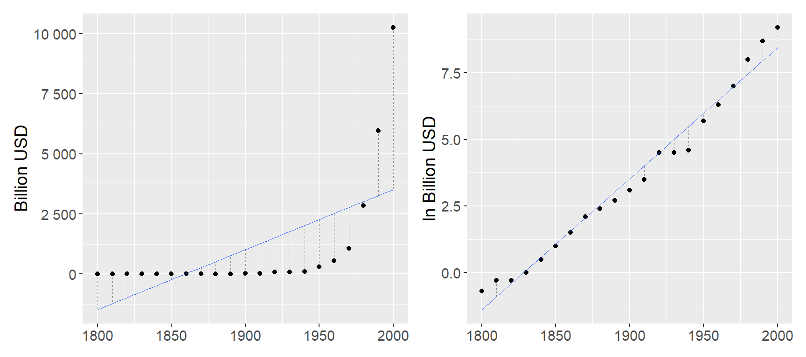
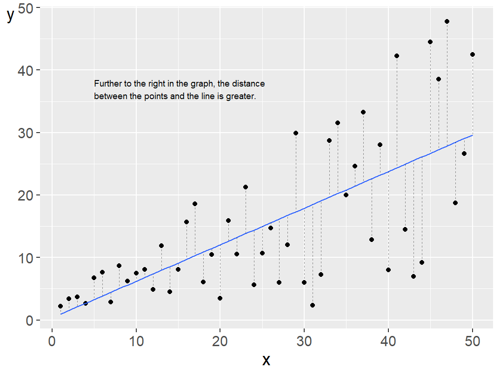
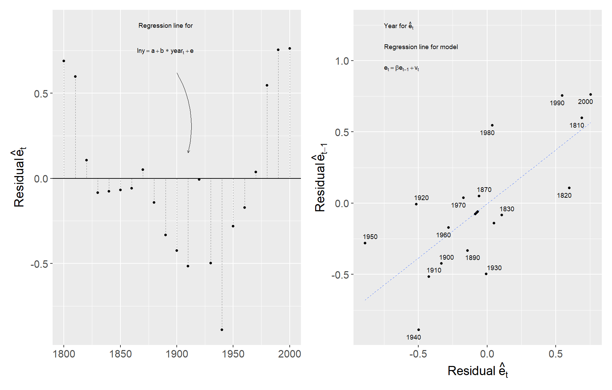
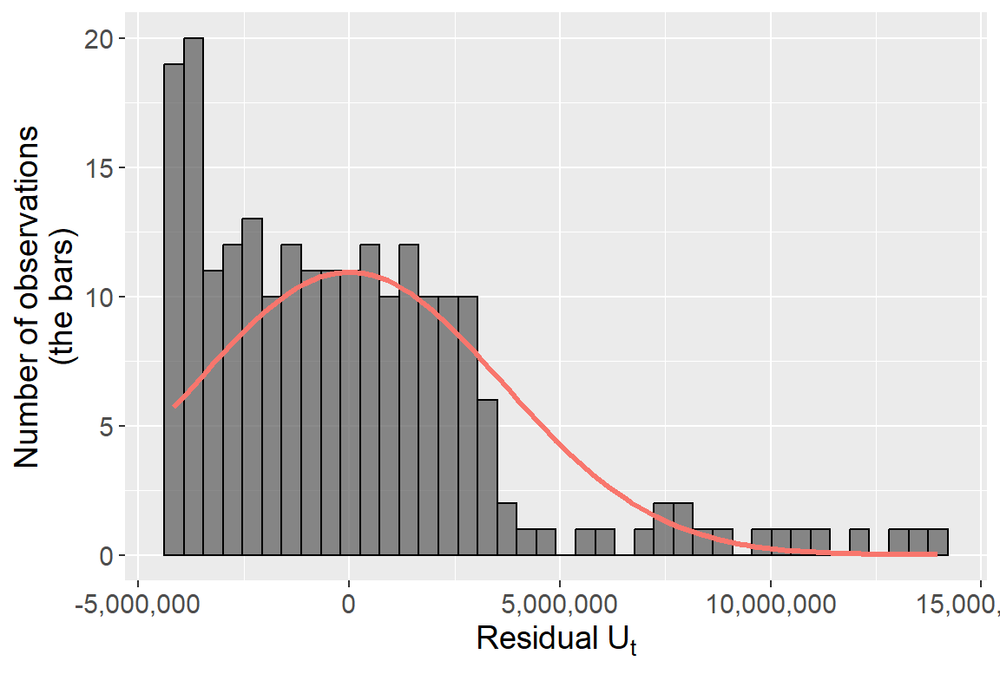
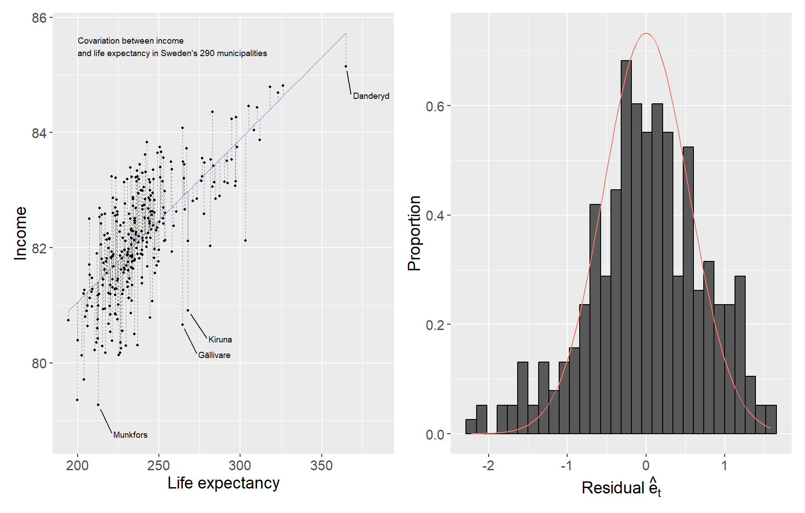

# Conditions of the Least Squares Method {#ch-ols-conditions}


In the previous chapters we mentioned different starting points and assumptions for regression analysis with the least squares method. This chapter goes through these assumptions in somewhat more detail and discusses their implications.

## Gauss-Markov {#sec-gauss-markov}

The theoretical assumptions for the least squares method are described in the **Gauss-Markov theorem**, named after Carl Friedrich Gauss and Andrey Markov. The theorem describes the conditions for the least squares method estimator to have the smallest sampling variance among all linear unbiased estimators. The word "unbiased" refers to the model estimating the population value correctly. The conditions can be presented in slightly different ways and the description depends partly on what type of data we are studying.

If one or more of these conditions are not fulfilled, the results we estimate using the least squares method risk becoming misleading. When we analyze real data, it is common that one or more conditions are not fulfilled. This may sound discouraging, but fortunately there are also several established methods for handling these challenges. This chapter provides occasional simple examples of solutions, but for those interested there is a large amount of literature to delve deeper into.

## Assumption 1: Linearity {#sec-assumption-linearity}

We start from the following regression model for the population, described with matrices:

\begin{equation}
Y = XB + V
(\#eq:gm-population)
\end{equation}

where we have $n$ number of observations and $k$ number of explanatory variables $x_1, \ldots, x_k$ and $k+1$ number of coefficients $b_0, b_1, \ldots, b_k$. The letters in the regression model symbolize the same matrices as described in previous examples.

The regression model describes a linear relationship that is found in the population. Linearity means that all coefficients in a regression model have exponent = 1. The following models are not linear:

$$
\begin{aligned}
Y &= a + \frac{1}{b}X + e \\
\log Z &= \alpha + \beta D + \epsilon
\end{aligned}
$$

In the first regression model we have $\frac{1}{b} = b^{-1}$. In the second model we have that $\log(Z_1 + Z_2) \neq \log(Z_1) + \log(Z_2)$, where $Z_1$ and $Z_2$ are two arbitrary values in variable $Z$.

It can be difficult to test whether a regression model is a good linear approximation of the data we are studying. We may for instance inspect the data in a scatter graph or histogram, and compare different measures of dispersion. We can both compare how the explained variable covaries with our explanatory variables, and compare how the residuals are distributed around a regression line.

Let us illustrate this by comparing US GDP every tenth year during the period 1800--2000 using data from Measuring Worth,^[Data available at www.measuringworth.org/usgdp/.] see Table \@ref(tab:gdp-table), with years, GDP and logarithmic GDP. In Figure \@ref(fig:gdp-plots) the linear trend over time for GDP and ln(GDP) respectively is illustrated in separate graphs. In the left graph the trend is estimated based on the regression model:

$$Y_t = a + b\,\text{YEAR}_t + V_t$$

where $Y_t$ is GDP in year $t$ and $\text{YEAR}_t$ is the year variable. In the right graph we have estimated the regression model:

\begin{equation}
\ln Y_t = c + d\,\text{YEAR}_t + U_t
(\#eq:gm-log-gdp-trend)
\end{equation}

where $\ln Y_t$ is logarithmic GDP in year $t$.


Table: (\#tab:gdp-table)US GDP 1800--2000. Data from Measuring Worth (www.measuringworth.org/usgdp/).

| Year | GDP (billions USD) | ln GDP |
|:----:|:------------------:|:------:|
| 1800 |       0.486        |  -0.7  |
| 1810 |       0.714        |  -0.3  |
| 1820 |       0.718        |  -0.3  |
| 1830 |       1.032        |  0.0   |
| 1840 |       1.590        |  0.5   |
| 1850 |       2.656        |  1.0   |
| 1860 |       4.410        |  1.5   |
| 1870 |       7.899        |  2.1   |
| 1880 |       10.592       |  2.4   |
| 1890 |       15.607       |  2.7   |
| 1900 |       21.197       |  3.1   |
| 1910 |       33.746       |  3.5   |
| 1920 |       89.246       |  4.5   |
| 1930 |       92.160       |  4.5   |
| 1940 |      102.899       |  4.6   |
| 1950 |      299.827       |  5.7   |
| 1960 |      542.382       |  6.3   |
| 1970 |      1073.303      |  7.0   |
| 1980 |      2857.307      |  8.0   |
| 1990 |      5963.144      |  8.7   |
| 2000 |     10250.952      |  9.2   |

A linear model fits the data relatively poorly when we use GDP, which we see in the left graph. The data points in the graph are placed approximately in the shape of a lying L. The development is exponential and not linear. The regression line does capture the positive development but does not give a representative picture of the long-term trend in GDP. During the years 1800--1850, to the left in the graph, the regression line is below 0. This means that the regression model predicts that GDP was negative all years before 1850. Since GDP is a measure of everything that is produced, bought and sold in a society, this is not possible. The linear model does however capture the long-term trend in logarithmic GDP relatively well, which is seen in the right graph where the points follow the regression line for all the years 1800--2000.

<div class="figure" style="text-align: center">

<p class="caption">(\#fig:gdp-plots)Linear trend for GDP and ln GDP.</p>
</div>

Another way to compare how well the linear regression model captures the covariation in the data is to compare the residuals. In the two graphs vertical lines connect each point and the regression line. In the left graph the distance between the points and the regression line varies considerably — in a way that they do not in the right graph.

Logarithms can often be used to create a more linear relationship between variables. This often works well for exponential series. Unfortunately there is no general solution that works for all regression models. Note however how the data points in the right graph do not describe an exact linear relationship.

In practice, we often encounter populations with variables with nonlinear relationships. But even then we benefit from a linear regression model as a linear approximation, rather than an exact description of the population. When this is more or less suitable depends on what the purpose of the analysis is.

## Assumption 2: Independent and Identically Distributed Observations {#sec-assumption-iid}

In the regression model the explained variable $Y$ is a random variable drawn from the population. The explanatory variables in matrix $X$ can either be random (as in an observational study) or created through a controlled process, for example in a controlled experiment where we ourselves design the treatment. Regardless, none of the variables are correlated with the error term.

In the description of the least squares method we assume that each observation $(y_i, x_{1,i}, \ldots, x_{k,i})$, $i = 1, \ldots, n$, is **independent and identically distributed** (i.i.d.). That is, each observation is drawn in a random sample from a population with the same distribution. That the observations are independent means that the observations do not covary with each other in a systematic way.

Say for example that we want to study the covariation between some characteristics that people have. The characteristics are our variables and each person has their own observation. We draw a random sample from the population, which fulfills the assumption of i.i.d.

But say now that we want to follow people over time, so that each observation is information about a person at a point in time. One of the variables is earnings. Even though people's earnings vary over time, we will be able to see patterns where different observations can be followed over time. The observations for a person's earnings are therefore not independent of each other and therefore also do not fulfill the assumption of i.i.d.

## Assumption 3: Expected Value and Variance of the Error Terms {#sec-assumption-homoscedasticity}

The expected value of the error terms with respect to the explanatory variables $X$ is $E(V|X) = 0$. This also means that the error terms $V$ do not covary with any of the explanatory variables $X$. This can be described as us having **exogenous** explanatory variables $X$. If any explanatory variable $x_1, \ldots, x_k$ is correlated with the error term $v$, this is called the variable being **endogenous**. In addition we assume that the error terms $V$ have the same variance, regardless of observation and variable:

$$var(V|X) = \sigma^2 I_n$$

where the symbol $\sigma^2$ symbolizes the population's constant variance and $I_n$ is an $n \times n$ identity matrix. That the error term exhibits constant variance is usually called **homoscedasticity**. Its opposite is called **heteroscedasticity**, which means that the variance in the error term varies across the observations in one or more explanatory variables $X$.

Figure \@ref(fig:heteroscedasticity-plot) illustrates heteroscedasticity by comparing the residuals' covariation against the explanatory variable $X$. The points' distance to the regression line varies across $X$. Further to the right in the graph the distance between the line and the points is larger compared to the points further to the left. The residuals' variance is thus not constant (homoscedasticity) across different observations but varies (heteroscedasticity).

<div class="figure" style="text-align: center">

<p class="caption">(\#fig:heteroscedasticity-plot)Heteroscedasticity: the distance between points and the regression line increases with X.</p>
</div>

A common assumption for the error terms is that these follow a normal distribution (see Section \@ref(sec-assumption-normality) below). Combined with the assumption of homoscedasticity this means that the error terms' dispersion around the regression line follows a normal distribution with the same shape, regardless of which values for the explanatory variables $X$ we compare against. With heteroscedasticity we may for example have normally distributed error terms but with different variance. Figure \@ref(fig:hetero-normal) illustrates an example where we have three normal distributions with different variance along a regression line.

<div class="figure" style="text-align: center">

```{=html}
<div class="plotly html-widget html-fill-item" id="htmlwidget-d1c2f30280d62f282cce" style="width:672px;height:480px;"></div>
<script type="application/json" data-for="htmlwidget-d1c2f30280d62f282cce">{"x":{"visdat":{"2790454a62e8":["function () ","plotlyVisDat"]},"cur_data":"2790454a62e8","attrs":{"2790454a62e8":{"x":{},"y":{},"z":{},"line":{"width":1,"color":"black"},"mode":"lines","showlegend":false,"alpha_stroke":1,"sizes":[10,100],"spans":[1,20],"type":"scatter3d"}},"layout":{"margin":{"b":40,"l":60,"t":25,"r":10},"scene":{"zaxis":{"title":"","showbackground":true,"backgroundcolor":"lightgray","showname":false,"showgrid":true,"zeroline":true,"showline":true,"showticklabels":false,"range":[0,0.014]},"xaxis":{"title":"X","showgrid":true,"gridcolor":"white","showline":true,"showticklabels":false},"yaxis":{"title":"Y","showgrid":true,"gridcolor":"white","zeroline":false,"showline":true,"showticklabels":false},"camera":{"eye":{"x":-1.7,"y":1.3,"z":0.59999999999999998}}},"annotations":[{"x":20,"y":60,"z":2,"xshift":-120,"yshift":-140,"text":"Regression model:<br />Y = a + b X + V","font":{"size":7}}],"hovermode":"closest","showlegend":false},"source":"A","config":{"modeBarButtonsToAdd":["hoverclosest","hovercompare"],"showSendToCloud":false},"data":[{"x":[1,1,1,1,1,1,1,1,1,1,1,1,1,1,1,1,1,1,1,1,1,1,1,1,1,1,1,1,1,1,1,1,1,1,1,1,1,1,1,1,1,1,1,1,1,1,1,1,1,1,1,1,1,1,1,1,1,1,1,1,1,1,1,1,1,1,1,1,1,1,1,1,1,1,1,1,1,1,1,1,1,1,1,1,1,1,1,1,1,1,1,1,1,1,1,1,1,1,1,1,1,1,1,1,1,1,1,1,1,1,1,1,1,1,1,1,1,1,1,1,1,1,1,1,1,1,1,1,1,1,1,1,1,1,1,1,1,1,1,1,1,1,1,1,1,1,1,1,1,1,1,1,1,1,1,1,1,1,1,1,1,1,1,1,1,1,1,1,1,1,1,1,1,1,1,1,1,1,1,1,1,1,1,1,1,1,1,1,1,1,1,1,1,1,1,1,1,1,1,1,1,1,1,1,1,1,1,1,1,1,1,1,1,1,1,1,1,1,1,1,1,1,1,1,1,1,1,1,1,1,1,1,1,1,1,1,1,1,1,1,1,1,1,1,1,1,1,1,1,1,1,1,1,1,1,1,1,1,1,1,1,1,1,1,1,1,1,1,1,1,1,1,1,1,1,1,1,1,1,1,1,1,1,1,1,1,1,1,1,1,1,1,1,1,1,1,1,1,1,1,1,1,1,1,1,1,1,1,1,1,1,1,1,1,1,1,1,1,1,1,1,1,1,1,1,1,1,1,1,1,1,1,1,1,1,1,1,1,1,1,1,1,1,1,1,1,1,1,1,1,1,1,1,1,1,1,1,1,1,1,1,1,1,1,1,1,1,1,1,1,1,1,1,1,1,1,1,1,1,1,1,1,1,1,1,1,1,1,1,1,1,1,1,1,1,1,1,1,1,1,1,1,1,1,1,1,1,1,1,1,1,1,1,1,1,1,1,1,1,1,1,1,1,1,1,1,1,1,1,1,1,1,1,1,1,1,1,1,1,1,1,1,1,1,1,1,1,1,1,1,1,1,1,1,1,1,1,1,1,1,1,1,1,1,1,1,1,1,1,1,1,1,1,1,1,1,1,1,1,1,1,1,1,1,1,1,1,1,1,1,1,1,1,1,1,1,1,1,1,1,1,1,1,1,1,1,1,1,1,1,1,1,1,1,1,1,1,1,1,1,1,1,1,1,1,1,1,1,1,1,1,1,1,1,1,1,1,1,1,1,1,1,1,1,1,1,1,1,1,1,1,1,1,1,1,1,1,1,1,1,1,1,1,1,1,1,1,1,1,1,1,1,1,1,1,1,1,1,1,1,1,1,1,1,1,1,1,1,1,1,1,1,1,1,1,1,1,1,1,1,1,1,1,1,1,2,2,2,2,2,2,2,2,2,2,2,2,2,2,2,2,2,2,2,2,2,2,2,2,2,2,2,2,2,2,2,2,2,2,2,2,2,2,2,2,2,2,2,2,2,2,2,2,2,2,2,2,2,2,2,2,2,2,2,2,2,2,2,2,2,2,2,2,2,2,2,2,2,2,2,2,2,2,2,2,2,2,2,2,2,2,2,2,2,2,2,2,2,2,2,2,2,2,2,2,2,2,2,2,2,2,2,2,2,2,2,2,2,2,2,2,2,2,2,2,2,2,2,2,2,2,2,2,2,2,2,2,2,2,2,2,2,2,2,2,2,2,2,2,2,2,2,2,2,2,2,2,2,2,2,2,2,2,2,2,2,2,2,2,2,2,2,2,2,2,2,2,2,2,2,2,2,2,2,2,2,2,2,2,2,2,2,2,2,2,2,2,2,2,2,2,2,2,2,2,2,2,2,2,2,2,2,2,2,2,2,2,2,2,2,2,2,2,2,2,2,2,2,2,2,2,2,2,2,2,2,2,2,2,2,2,2,2,2,2,2,2,2,2,2,2,2,2,2,2,2,2,2,2,2,2,2,2,2,2,2,2,2,2,2,2,2,2,2,2,2,2,2,2,2,2,2,2,2,2,2,2,2,2,2,2,2,2,2,2,2,2,2,2,2,2,2,2,2,2,2,2,2,2,2,2,2,2,2,2,2,2,2,2,2,2,2,2,2,2,2,2,2,2,2,2,2,2,2,2,2,2,2,2,2,2,2,2,2,2,2,2,2,2,2,2,2,2,2,2,2,2,2,2,2,2,2,2,2,2,2,2,2,2,2,2,2,2,2,2,2,2,2,2,2,2,2,2,2,2,2,2,2,2,2,2,2,2,2,2,2,2,2,2,2,2,2,2,2,2,2,2,2,2,2,2,2,2,2,2,2,2,2,2,2,2,2,2,2,2,2,2,2,2,2,2,2,2,2,2,2,2,2,2,2,2,2,2,2,2,2,2,2,2,2,2,2,2,2,2,2,2,2,2,2,2,2,2,2,2,2,2,2,2,2,2,2,2,2,2,2,2,2,2,2,2,2,2,2,2,2,2,2,2,2,2,2,2,2,2,2,2,2,2,2,2,2,2,2,2,2,2,2,2,2,2,2,2,2,2,2,2,2,2,2,2,2,2,2,2,2,2,2,2,2,2,2,2,2,2,2,2,2,2,2,2,2,2,2,2,2,2,2,2,2,2,2,2,2,2,2,2,2,2,2,2,2,2,2,2,2,2,2,2,2,2,2,2,2,2,2,2,2,2,2,2,2,2,2,2,2,2,2,2,2,2,2,2,2,2,2,2,2,2,2,2,2,2,2,2,2,2,2,2,2,3,3,3,3,3,3,3,3,3,3,3,3,3,3,3,3,3,3,3,3,3,3,3,3,3,3,3,3,3,3,3,3,3,3,3,3,3,3,3,3,3,3,3,3,3,3,3,3,3,3,3,3,3,3,3,3,3,3,3,3,3,3,3,3,3,3,3,3,3,3,3,3,3,3,3,3,3,3,3,3,3,3,3,3,3,3,3,3,3,3,3,3,3,3,3,3,3,3,3,3,3,3,3,3,3,3,3,3,3,3,3,3,3,3,3,3,3,3,3,3,3,3,3,3,3,3,3,3,3,3,3,3,3,3,3,3,3,3,3,3,3,3,3,3,3,3,3,3,3,3,3,3,3,3,3,3,3,3,3,3,3,3,3,3,3,3,3,3,3,3,3,3,3,3,3,3,3,3,3,3,3,3,3,3,3,3,3,3,3,3,3,3,3,3,3,3,3,3,3,3,3,3,3,3,3,3,3,3,3,3,3,3,3,3,3,3,3,3,3,3,3,3,3,3,3,3,3,3,3,3,3,3,3,3,3,3,3,3,3,3,3,3,3,3,3,3,3,3,3,3,3,3,3,3,3,3,3,3,3,3,3,3,3,3,3,3,3,3,3,3,3,3,3,3,3,3,3,3,3,3,3,3,3,3,3,3,3,3,3,3,3,3,3,3,3,3,3,3,3,3,3,3,3,3,3,3,3,3,3,3,3,3,3,3,3,3,3,3,3,3,3,3,3,3,3,3,3,3,3,3,3,3,3,3,3,3,3,3,3,3,3,3,3,3,3,3,3,3,3,3,3,3,3,3,3,3,3,3,3,3,3,3,3,3,3,3,3,3,3,3,3,3,3,3,3,3,3,3,3,3,3,3,3,3,3,3,3,3,3,3,3,3,3,3,3,3,3,3,3,3,3,3,3,3,3,3,3,3,3,3,3,3,3,3,3,3,3,3,3,3,3,3,3,3,3,3,3,3,3,3,3,3,3,3,3,3,3,3,3,3,3,3,3,3,3,3,3,3,3,3,3,3,3,3,3,3,3,3,3,3,3,3,3,3,3,3,3,3,3,3,3,3,3,3,3,3,3,3,3,3,3,3,3,3,3,3,3,3,3,3,3,3,3,3,3,3,3,3,3,3,3,3,3,3,3,3,3,3,3,3,3,3,3,3,3,3,3,3,3,3,3,3,3,3,3,3,3,3,3,3,3,3,3,3,3,3,3,3,3,3,3,3,3,3,3,3,3,3,3,3,3,3,3,3,3,3,3,3,3,3,3,3,3,3,3,3,3,3,3,3,3,3,3,3,3,3,3,3,3,3,3,3,3,3,3,3,3,3,3,3,3,3,3,3,3,3,3,3,3,3,3,3,3,3],"y":[-300,-299,-298,-297,-296,-295,-294,-293,-292,-291,-290,-289,-288,-287,-286,-285,-284,-283,-282,-281,-280,-279,-278,-277,-276,-275,-274,-273,-272,-271,-270,-269,-268,-267,-266,-265,-264,-263,-262,-261,-260,-259,-258,-257,-256,-255,-254,-253,-252,-251,-250,-249,-248,-247,-246,-245,-244,-243,-242,-241,-240,-239,-238,-237,-236,-235,-234,-233,-232,-231,-230,-229,-228,-227,-226,-225,-224,-223,-222,-221,-220,-219,-218,-217,-216,-215,-214,-213,-212,-211,-210,-209,-208,-207,-206,-205,-204,-203,-202,-201,-200,-199,-198,-197,-196,-195,-194,-193,-192,-191,-190,-189,-188,-187,-186,-185,-184,-183,-182,-181,-180,-179,-178,-177,-176,-175,-174,-173,-172,-171,-170,-169,-168,-167,-166,-165,-164,-163,-162,-161,-160,-159,-158,-157,-156,-155,-154,-153,-152,-151,-150,-149,-148,-147,-146,-145,-144,-143,-142,-141,-140,-139,-138,-137,-136,-135,-134,-133,-132,-131,-130,-129,-128,-127,-126,-125,-124,-123,-122,-121,-120,-119,-118,-117,-116,-115,-114,-113,-112,-111,-110,-109,-108,-107,-106,-105,-104,-103,-102,-101,-100,-99,-98,-97,-96,-95,-94,-93,-92,-91,-90,-89,-88,-87,-86,-85,-84,-83,-82,-81,-80,-79,-78,-77,-76,-75,-74,-73,-72,-71,-70,-69,-68,-67,-66,-65,-64,-63,-62,-61,-60,-59,-58,-57,-56,-55,-54,-53,-52,-51,-50,-49,-48,-47,-46,-45,-44,-43,-42,-41,-40,-39,-38,-37,-36,-35,-34,-33,-32,-31,-30,-29,-28,-27,-26,-25,-24,-23,-22,-21,-20,-19,-18,-17,-16,-15,-14,-13,-12,-11,-10,-9,-8,-7,-6,-5,-4,-3,-2,-1,0,1,2,3,4,5,6,7,8,9,10,11,12,13,14,15,16,17,18,19,20,21,22,23,24,25,26,27,28,29,30,31,32,33,34,35,36,37,38,39,40,41,42,43,44,45,46,47,48,49,50,51,52,53,54,55,56,57,58,59,60,61,62,63,64,65,66,67,68,69,70,71,72,73,74,75,76,77,78,79,80,81,82,83,84,85,86,87,88,89,90,91,92,93,94,95,96,97,98,99,100,101,102,103,104,105,106,107,108,109,110,111,112,113,114,115,116,117,118,119,120,121,122,123,124,125,126,127,128,129,130,131,132,133,134,135,136,137,138,139,140,141,142,143,144,145,146,147,148,149,150,151,152,153,154,155,156,157,158,159,160,161,162,163,164,165,166,167,168,169,170,171,172,173,174,175,176,177,178,179,180,181,182,183,184,185,186,187,188,189,190,191,192,193,194,195,196,197,198,199,200,201,202,203,204,205,206,207,208,209,210,211,212,213,214,215,216,217,218,219,220,221,222,223,224,225,226,227,228,229,230,231,232,233,234,235,236,237,238,239,240,241,242,243,244,245,246,247,248,249,250,251,252,253,254,255,256,257,258,259,260,261,262,263,264,265,266,267,268,269,270,271,272,273,274,275,276,277,278,279,280,281,282,283,284,285,286,287,288,289,290,291,292,293,294,295,296,297,298,299,300,-300,0,0,0,60,-240,-239,-238,-237,-236,-235,-234,-233,-232,-231,-230,-229,-228,-227,-226,-225,-224,-223,-222,-221,-220,-219,-218,-217,-216,-215,-214,-213,-212,-211,-210,-209,-208,-207,-206,-205,-204,-203,-202,-201,-200,-199,-198,-197,-196,-195,-194,-193,-192,-191,-190,-189,-188,-187,-186,-185,-184,-183,-182,-181,-180,-179,-178,-177,-176,-175,-174,-173,-172,-171,-170,-169,-168,-167,-166,-165,-164,-163,-162,-161,-160,-159,-158,-157,-156,-155,-154,-153,-152,-151,-150,-149,-148,-147,-146,-145,-144,-143,-142,-141,-140,-139,-138,-137,-136,-135,-134,-133,-132,-131,-130,-129,-128,-127,-126,-125,-124,-123,-122,-121,-120,-119,-118,-117,-116,-115,-114,-113,-112,-111,-110,-109,-108,-107,-106,-105,-104,-103,-102,-101,-100,-99,-98,-97,-96,-95,-94,-93,-92,-91,-90,-89,-88,-87,-86,-85,-84,-83,-82,-81,-80,-79,-78,-77,-76,-75,-74,-73,-72,-71,-70,-69,-68,-67,-66,-65,-64,-63,-62,-61,-60,-59,-58,-57,-56,-55,-54,-53,-52,-51,-50,-49,-48,-47,-46,-45,-44,-43,-42,-41,-40,-39,-38,-37,-36,-35,-34,-33,-32,-31,-30,-29,-28,-27,-26,-25,-24,-23,-22,-21,-20,-19,-18,-17,-16,-15,-14,-13,-12,-11,-10,-9,-8,-7,-6,-5,-4,-3,-2,-1,0,1,2,3,4,5,6,7,8,9,10,11,12,13,14,15,16,17,18,19,20,21,22,23,24,25,26,27,28,29,30,31,32,33,34,35,36,37,38,39,40,41,42,43,44,45,46,47,48,49,50,51,52,53,54,55,56,57,58,59,60,61,62,63,64,65,66,67,68,69,70,71,72,73,74,75,76,77,78,79,80,81,82,83,84,85,86,87,88,89,90,91,92,93,94,95,96,97,98,99,100,101,102,103,104,105,106,107,108,109,110,111,112,113,114,115,116,117,118,119,120,121,122,123,124,125,126,127,128,129,130,131,132,133,134,135,136,137,138,139,140,141,142,143,144,145,146,147,148,149,150,151,152,153,154,155,156,157,158,159,160,161,162,163,164,165,166,167,168,169,170,171,172,173,174,175,176,177,178,179,180,181,182,183,184,185,186,187,188,189,190,191,192,193,194,195,196,197,198,199,200,201,202,203,204,205,206,207,208,209,210,211,212,213,214,215,216,217,218,219,220,221,222,223,224,225,226,227,228,229,230,231,232,233,234,235,236,237,238,239,240,241,242,243,244,245,246,247,248,249,250,251,252,253,254,255,256,257,258,259,260,261,262,263,264,265,266,267,268,269,270,271,272,273,274,275,276,277,278,279,280,281,282,283,284,285,286,287,288,289,290,291,292,293,294,295,296,297,298,299,300,301,302,303,304,305,306,307,308,309,310,311,312,313,314,315,316,317,318,319,320,321,322,323,324,325,326,327,328,329,330,331,332,333,334,335,336,337,338,339,340,341,342,343,344,345,346,347,348,349,350,351,352,353,354,355,356,357,358,359,360,60,60,60,120,-180,-179,-178,-177,-176,-175,-174,-173,-172,-171,-170,-169,-168,-167,-166,-165,-164,-163,-162,-161,-160,-159,-158,-157,-156,-155,-154,-153,-152,-151,-150,-149,-148,-147,-146,-145,-144,-143,-142,-141,-140,-139,-138,-137,-136,-135,-134,-133,-132,-131,-130,-129,-128,-127,-126,-125,-124,-123,-122,-121,-120,-119,-118,-117,-116,-115,-114,-113,-112,-111,-110,-109,-108,-107,-106,-105,-104,-103,-102,-101,-100,-99,-98,-97,-96,-95,-94,-93,-92,-91,-90,-89,-88,-87,-86,-85,-84,-83,-82,-81,-80,-79,-78,-77,-76,-75,-74,-73,-72,-71,-70,-69,-68,-67,-66,-65,-64,-63,-62,-61,-60,-59,-58,-57,-56,-55,-54,-53,-52,-51,-50,-49,-48,-47,-46,-45,-44,-43,-42,-41,-40,-39,-38,-37,-36,-35,-34,-33,-32,-31,-30,-29,-28,-27,-26,-25,-24,-23,-22,-21,-20,-19,-18,-17,-16,-15,-14,-13,-12,-11,-10,-9,-8,-7,-6,-5,-4,-3,-2,-1,0,1,2,3,4,5,6,7,8,9,10,11,12,13,14,15,16,17,18,19,20,21,22,23,24,25,26,27,28,29,30,31,32,33,34,35,36,37,38,39,40,41,42,43,44,45,46,47,48,49,50,51,52,53,54,55,56,57,58,59,60,61,62,63,64,65,66,67,68,69,70,71,72,73,74,75,76,77,78,79,80,81,82,83,84,85,86,87,88,89,90,91,92,93,94,95,96,97,98,99,100,101,102,103,104,105,106,107,108,109,110,111,112,113,114,115,116,117,118,119,120,121,122,123,124,125,126,127,128,129,130,131,132,133,134,135,136,137,138,139,140,141,142,143,144,145,146,147,148,149,150,151,152,153,154,155,156,157,158,159,160,161,162,163,164,165,166,167,168,169,170,171,172,173,174,175,176,177,178,179,180,181,182,183,184,185,186,187,188,189,190,191,192,193,194,195,196,197,198,199,200,201,202,203,204,205,206,207,208,209,210,211,212,213,214,215,216,217,218,219,220,221,222,223,224,225,226,227,228,229,230,231,232,233,234,235,236,237,238,239,240,241,242,243,244,245,246,247,248,249,250,251,252,253,254,255,256,257,258,259,260,261,262,263,264,265,266,267,268,269,270,271,272,273,274,275,276,277,278,279,280,281,282,283,284,285,286,287,288,289,290,291,292,293,294,295,296,297,298,299,300,301,302,303,304,305,306,307,308,309,310,311,312,313,314,315,316,317,318,319,320,321,322,323,324,325,326,327,328,329,330,331,332,333,334,335,336,337,338,339,340,341,342,343,344,345,346,347,348,349,350,351,352,353,354,355,356,357,358,359,360,361,362,363,364,365,366,367,368,369,370,371,372,373,374,375,376,377,378,379,380,381,382,383,384,385,386,387,388,389,390,391,392,393,394,395,396,397,398,399,400,401,402,403,404,405,406,407,408,409,410,411,412,413,414,415,416,417,418,419,420,120,120],"z":[1.2151765699646571e-10,1.369833762597151e-10,1.5435568425141057e-10,1.7386159945760366e-10,1.9575415824882351e-10,2.2031527249364594e-10,2.4785888628300237e-10,2.7873446138094789e-10,3.1333082376265092e-10,3.5208040657971607e-10,3.9546392812489392e-10,4.4401554687157962e-10,4.9832853945901983e-10,5.5906155160309279e-10,6.2694547635839517e-10,7.0279101896408677e-10,7.8749701269997102e-10,8.8205955578746192e-10,9.8758204542208972e-10,1.1052861915499435e-09,1.2365241000331712e-09,1.3827915224224804e-09,1.5457423777045837e-09,1.7272046601561982e-09,1.9291978568546758e-09,2.153952008508655e-09,2.4039285581256449e-09,2.6818431436709488e-09,2.9906905033431856e-09,3.3337716754445668e-09,3.7147236891105789e-09,4.1375519574393082e-09,4.6066656008784166e-09,5.1269159461491871e-09,5.7036384645679508e-09,6.3426984334319553e-09,7.0505406252280753e-09,7.8342433518696266e-09,8.7015772150302208e-09,9.661068938999359e-09,1.0722070689395233e-08,1.1894835309615522e-08,1.3190597937150435e-08,1.4621664493906993e-08,1.6201507578562688e-08,1.794487032476669e-08,1.9867878826798234e-08,2.1988163774164106e-08,2.4324991978626379e-08,2.6899408521388873e-08,2.9734390294685954e-08,3.2855011760901428e-08,3.6288623803640605e-08,4.006504659896979e-08,4.4216777491368422e-08,4.8779214917867042e-08,5.3790899485430465e-08,5.9293773370905456e-08,6.53334592798655e-08,7.1959560270424952e-08,7.92259818206415e-08,8.7191277593432727e-08,9.5919020431050428e-08,1.0547820019202607e-07,1.1594365012714574e-07,1.273965035773418e-07,1.399246828654081e-07,1.5362342234500911e-07,1.6859582766457542e-07,1.8495347340011234e-07,2.0281704130973517e-07,2.2231700156355579e-07,2.4359433940537397e-07,2.6680132980711682e-07,2.9210236278305885e-07,3.1967482213810949e-07,3.4971002053278271e-07,3.8241419385635477e-07,4.1800955800900815e-07,4.5673543130293842e-07,4.9884942580107074e-07,5.4462871101985213e-07,5.9437135352884399e-07,6.483977360842756e-07,7.0705206003546191e-07,7.7070393484174255e-07,8.397500586323464e-07,9.1461599383202627e-07,9.9575804196024187e-07,1.0836652217908029e-06,1.1788613551307971e-06,1.2819072645421219e-06,1.3934030873842865e-06,1.5139907106032243e-06,1.6443563307257201e-06,1.7852331435426586e-06,1.937404167974385e-06,2.1017052086080095e-06,2.279027961377292e-06,2.4703232668204736e-06,2.6766045152977074e-06,2.8989512084778212e-06,3.1385126813106454e-06,3.3965119885868717e-06,3.6742499600491422e-06,3.9731094278554547e-06,4.294559630007341e-06,4.6401607931388478e-06,5.0115688978172146e-06,5.4105406292304201e-06,5.8389385158292056e-06,6.2987362581504377e-06,6.7920242496730953e-06,7.3210152911466989e-06,7.888050499383124e-06,8.4956054110150288e-06,9.1462962811971354e-06,9.8428865766578624e-06,1.0588293661898695e-05,1.1385595676685053e-05,1.2238038602275438e-05,1.314904351309353e-05,1.4122214009760723e-05,1.5161343828574206e-05,1.6270424621636167e-05,1.7453653900915203e-05,1.8715443138549594e-05,2.0060426014684752e-05,2.1493466803074713e-05,2.3019668883569691e-05,2.4644383369460397e-05,2.6373217836454847e-05,2.8212045138827697e-05,3.0167012297006144e-05,3.2244549439542486e-05,3.4451378781073624e-05,3.679452361648562e-05,3.9281317310087526e-05,4.191941225715884e-05,4.4716788793770769e-05,4.7681764029296806e-05,5.0823000574530432e-05,5.4149515136813996e-05,5.7670686952068785e-05,6.1396266022094808e-05,6.5336381123998368e-05,6.9501547557098754e-05,7.3902674591180698e-05,7.8551072578495582e-05,8.3458459690479244e-05,8.8636968238760147e-05,9.409915053867958e-05,9.9857984272247531e-05,0.0001059268773062204,0.00011231967191981938,0.00011905064839551708,0.00012613452792531856,0.0001335864747840524,0.00014142209772038898,0.00014965745051561129,0.00015830903165959937,0.00016739378309306067,0.00017692908796474463,0.00018693276735224566,0.00019742307589502259,0.00020841869628845185,0.00021993873258811144,0.0002320027022740512,0.00024463052702555945,0.00025784252215790609,0.00027165938467371226,0.0002861021798829938,0.00030119232654754897,0.00031695158050721635,0.00033340201674762114,0.00035056600987137083,0.00036846621293724099,0.00038712553463473925,0.00040656711476451672,0.00042681429799845563,0.00044789060589685796,0.00046981970716402727,0.00049262538612765015,0.00051633150943175381,0.00054096199093763573,0.00056654075483202374,0.00059309169694682557,0.00062063864430016537,0.00064920531287394889,0.00067881526364898376,0.00070949185692462851,0.0007412582049561295,0.0007741371229491122,0.00080815107845720613,0.00084332213923540627,0.00087967191960854378,0.00091722152542109776,0.00095599149764154072,0.00099600175470141556,0.0010372715336564114,0.0010798193302637613,0.0011236628380773611,0.0011688188866690293,0.0012153033790912955,0.0012631312287039731,0.001312316295493532,0.0013628713220208916,0.0014148078691396677,0.0014681362516331378,0.0015228654739241462,0.0015790031660178831,0.0016365555198428561,0.0016955272261604446,0.0017559214122181124,0.0018177395803256574,0.001880981547537739,0.0019456453866293502,0.0020117273685538116,0.0020792219065752845,0.0021481215022696757,0.002218416693589111,0.0022900960051858471,0.0023631459011916453,0.0024375507406480357,0.0025132927357817631,0.0025903519133178348,0.002668706079020046,0.0027483307856456356,0.0028291993044967756,0.002911282600746952,0.0029945493127148974,0.0030789657352526746,0.0031644958074076605,0.0032511011045106824,0.0033387408348342761,0.003427371840956147,0.0035169486059532474,0.0036074232645416067,0.0036987456192661061,0.0037908631618328048,0.0038837210996642592,0.0039772623877455185,0.0040714277658151889,0.0041661558009421671,0.0042613829355143571,0.0043570435406510106,0.0044530699750352223,0.0045493926491477184,0.0046459400948673244,0.0047426390403875916,0.0048394144903828673,0.0049361898113408544,0.0050328868219623422,0.0051294258885124068,0.005225726024991063,0.0053217049979750967,0.0054172794359667598,0.0055123649430691337,0.0056068762167924124,0.0057007271697801457,0.0057938310552296543,0.0058861005957665021,0.005977448115519055,0.0060677856751260029,0.0061570252093970587,0.0062450786673352255,0.0063318581542178556,0.00641727607542345,0.0065012452816816434,0.0065836792154152952,0.0066644920578359931,0.0067435988764476115,0.0068209157726070516,0.0068963600287866664,0.0069698502551794892,0.0070413065352859907,0.0071106505701199422,0.007177805820670893,0.0072426976482618446,0.0073052534524430781,0.0073654028060664671,0.0074230775871893208,0.0074782121074625681,0.0075307432366650785,0.007580610523054033,0.007627756309210483,0.0076721258430695717,0.0077136673838363225,0.0077523323025002833,0.0077880751766758079,0.0078208538795091175,0.0078506296624085772,0.0078773672313708163,0.0079010348166922255,0.0079216042358731219,0.0079390509495402359,0.0079533541102321768,0.0079644966039121388,0.0079724650840921011,0.0079772499984733219,0.0079788456080286535,0.0079772499984733219,0.0079724650840921011,0.0079644966039121388,0.0079533541102321768,0.0079390509495402359,0.0079216042358731219,0.0079010348166922255,0.0078773672313708163,0.0078506296624085772,0.0078208538795091175,0.0077880751766758079,0.0077523323025002833,0.0077136673838363225,0.0076721258430695717,0.007627756309210483,0.007580610523054033,0.0075307432366650785,0.0074782121074625681,0.0074230775871893208,0.0073654028060664671,0.0073052534524430781,0.0072426976482618446,0.007177805820670893,0.0071106505701199422,0.0070413065352859907,0.0069698502551794892,0.0068963600287866664,0.0068209157726070516,0.0067435988764476115,0.0066644920578359931,0.0065836792154152952,0.0065012452816816434,0.00641727607542345,0.0063318581542178556,0.0062450786673352255,0.0061570252093970587,0.0060677856751260029,0.005977448115519055,0.0058861005957665021,0.0057938310552296543,0.0057007271697801457,0.0056068762167924124,0.0055123649430691337,0.0054172794359667598,0.0053217049979750967,0.005225726024991063,0.0051294258885124068,0.0050328868219623422,0.0049361898113408544,0.0048394144903828673,0.0047426390403875916,0.0046459400948673244,0.0045493926491477184,0.0044530699750352223,0.0043570435406510106,0.0042613829355143571,0.0041661558009421671,0.0040714277658151889,0.0039772623877455185,0.0038837210996642592,0.0037908631618328048,0.0036987456192661061,0.0036074232645416067,0.0035169486059532474,0.003427371840956147,0.0033387408348342761,0.0032511011045106824,0.0031644958074076605,0.0030789657352526746,0.0029945493127148974,0.002911282600746952,0.0028291993044967756,0.0027483307856456356,0.002668706079020046,0.0025903519133178348,0.0025132927357817631,0.0024375507406480357,0.0023631459011916453,0.0022900960051858471,0.002218416693589111,0.0021481215022696757,0.0020792219065752845,0.0020117273685538116,0.0019456453866293502,0.001880981547537739,0.0018177395803256574,0.0017559214122181124,0.0016955272261604446,0.0016365555198428561,0.0015790031660178831,0.0015228654739241462,0.0014681362516331378,0.0014148078691396677,0.0013628713220208916,0.001312316295493532,0.0012631312287039731,0.0012153033790912955,0.0011688188866690293,0.0011236628380773611,0.0010798193302637613,0.0010372715336564114,0.00099600175470141556,0.00095599149764154072,0.00091722152542109776,0.00087967191960854378,0.00084332213923540627,0.00080815107845720613,0.0007741371229491122,0.0007412582049561295,0.00070949185692462851,0.00067881526364898376,0.00064920531287394889,0.00062063864430016537,0.00059309169694682557,0.00056654075483202374,0.00054096199093763573,0.00051633150943175381,0.00049262538612765015,0.00046981970716402727,0.00044789060589685796,0.00042681429799845563,0.00040656711476451672,0.00038712553463473925,0.00036846621293724099,0.00035056600987137083,0.00033340201674762114,0.00031695158050721635,0.00030119232654754897,0.0002861021798829938,0.00027165938467371226,0.00025784252215790609,0.00024463052702555945,0.0002320027022740512,0.00021993873258811144,0.00020841869628845185,0.00019742307589502259,0.00018693276735224566,0.00017692908796474463,0.00016739378309306067,0.00015830903165959937,0.00014965745051561129,0.00014142209772038898,0.0001335864747840524,0.00012613452792531856,0.00011905064839551708,0.00011231967191981938,0.0001059268773062204,9.9857984272247531e-05,9.409915053867958e-05,8.8636968238760147e-05,8.3458459690479244e-05,7.8551072578495582e-05,7.3902674591180698e-05,6.9501547557098754e-05,6.5336381123998368e-05,6.1396266022094808e-05,5.7670686952068785e-05,5.4149515136813996e-05,5.0823000574530432e-05,4.7681764029296806e-05,4.4716788793770769e-05,4.191941225715884e-05,3.9281317310087526e-05,3.679452361648562e-05,3.4451378781073624e-05,3.2244549439542486e-05,3.0167012297006144e-05,2.8212045138827697e-05,2.6373217836454847e-05,2.4644383369460397e-05,2.3019668883569691e-05,2.1493466803074713e-05,2.0060426014684752e-05,1.8715443138549594e-05,1.7453653900915203e-05,1.6270424621636167e-05,1.5161343828574206e-05,1.4122214009760723e-05,1.314904351309353e-05,1.2238038602275438e-05,1.1385595676685053e-05,1.0588293661898695e-05,9.8428865766578624e-06,9.1462962811971354e-06,8.4956054110150288e-06,7.888050499383124e-06,7.3210152911466989e-06,6.7920242496730953e-06,6.2987362581504377e-06,5.8389385158292056e-06,5.4105406292304201e-06,5.0115688978172146e-06,4.6401607931388478e-06,4.294559630007341e-06,3.9731094278554547e-06,3.6742499600491422e-06,3.3965119885868717e-06,3.1385126813106454e-06,2.8989512084778212e-06,2.6766045152977074e-06,2.4703232668204736e-06,2.279027961377292e-06,2.1017052086080095e-06,1.937404167974385e-06,1.7852331435426586e-06,1.6443563307257201e-06,1.5139907106032243e-06,1.3934030873842865e-06,1.2819072645421219e-06,1.1788613551307971e-06,1.0836652217908029e-06,9.9575804196024187e-07,9.1461599383202627e-07,8.397500586323464e-07,7.7070393484174255e-07,7.0705206003546191e-07,6.483977360842756e-07,5.9437135352884399e-07,5.4462871101985213e-07,4.9884942580107074e-07,4.5673543130293842e-07,4.1800955800900815e-07,3.8241419385635477e-07,3.4971002053278271e-07,3.1967482213810949e-07,2.9210236278305885e-07,2.6680132980711682e-07,2.4359433940537397e-07,2.2231700156355579e-07,2.0281704130973517e-07,1.8495347340011234e-07,1.6859582766457542e-07,1.5362342234500911e-07,1.399246828654081e-07,1.273965035773418e-07,1.1594365012714574e-07,1.0547820019202607e-07,9.5919020431050428e-08,8.7191277593432727e-08,7.92259818206415e-08,7.1959560270424952e-08,6.53334592798655e-08,5.9293773370905456e-08,5.3790899485430465e-08,4.8779214917867042e-08,4.4216777491368422e-08,4.006504659896979e-08,3.6288623803640605e-08,3.2855011760901428e-08,2.9734390294685954e-08,2.6899408521388873e-08,2.4324991978626379e-08,2.1988163774164106e-08,1.9867878826798234e-08,1.794487032476669e-08,1.6201507578562688e-08,1.4621664493906993e-08,1.3190597937150435e-08,1.1894835309615522e-08,1.0722070689395233e-08,9.661068938999359e-09,8.7015772150302208e-09,7.8342433518696266e-09,7.0505406252280753e-09,6.3426984334319553e-09,5.7036384645679508e-09,5.1269159461491871e-09,4.6066656008784166e-09,4.1375519574393082e-09,3.7147236891105789e-09,3.3337716754445668e-09,2.9906905033431856e-09,2.6818431436709488e-09,2.4039285581256449e-09,2.153952008508655e-09,1.9291978568546758e-09,1.7272046601561982e-09,1.5457423777045837e-09,1.3827915224224804e-09,1.2365241000331712e-09,1.1052861915499435e-09,9.8758204542208972e-10,8.8205955578746192e-10,7.8749701269997102e-10,7.0279101896408677e-10,6.2694547635839517e-10,5.5906155160309279e-10,4.9832853945901983e-10,4.4401554687157962e-10,3.9546392812489392e-10,3.5208040657971607e-10,3.1333082376265092e-10,2.7873446138094789e-10,2.4785888628300237e-10,2.2031527249364594e-10,1.9575415824882351e-10,1.7386159945760366e-10,1.5435568425141057e-10,1.369833762597151e-10,1.2151765699646571e-10,0,0,0.0079788456080286535,0,0,4.4318484119380074e-05,4.5665899546701441e-05,4.704957526933979e-05,4.8470329059789442e-05,4.9928992136123765e-05,5.1426409230539394e-05,5.2963438653110201e-05,5.4540952350565457e-05,5.6159835959909689e-05,5.7820988856694728e-05,5.952532419775854e-05,6.1273768958236869e-05,6.3067263962659278e-05,6.4906763909933647e-05,6.6793237392026198e-05,6.8727666906139709e-05,7.071104886019449e-05,7.2744393571412189e-05,7.4828725257805644e-05,7.696508202237322e-05,7.9154515829799686e-05,8.1398092475460214e-05,8.3696891546530334e-05,8.6052006374996717e-05,8.8464543982372316e-05,9.0935625015910524e-05,9.3466383676122831e-05,9.6057967635395874e-05,9.8711537947511295e-05,0.00010142826894787076,0.00010420934814422592,0.00010705597609772187,0.00010996936629405572,0.00011295074500456136,0.0001160013511370256,0.00011912243607605179,0.00012231526351277972,0.00012558110926378212,0.00012892126107895305,0.00013233701843821374,0.00013582969233685613,0.00013940060505935825,0.0001430510899414969,0.00014678249112060044,0.00015059616327377448,0.00015449347134395173,0.00015847579025360817,0.00016254450460600505,0.00016670100837381057,0.00017094670457496957,0.00017528300493568541,0.00017971132954039631,0.0001842331064686205,0.00018884977141856162,0.00019356276731736962,0.00019837354391795314,0.00020328355738225836,0.00020829426985092186,0.00021340714899922782,0.00021862366757929386,0.00022394530294842898,0.00022937353658360692,0.00023490985358201363,0.00024055574214762972,0.00024631269306382508,0.00025218219915194384,0.0002581657547158769,0.00026426485497261723,0.00027048099546881786,0.00027681567148336574,0.00028327037741601187,0.00028984660616209411,0.00029654584847341279,0.00030336959230531634,0.00031031932215008269,0.00031739651835667416,0.00032460265643697445,0.00033193920635861125,0.00033940763182449188,0.00034700938953918819,0.00035474592846231425,0.00036261868904906221,0.00037062910247806475,0.00037877858986677481,0.0003870685614745561,0.0003955004158937022,0.00040407553922860306,0.00041279530426330415,0.00042166106961770314,0.00043067417889265734,0.00043983595980427189,0.00044914772330767097,0.00045861076271054888,0.00046822635277683164,0.00047799574882077036,0.00048792018579182765,0.00049800087735070778,0.00050823901493691202,0.00051863576682820568,0.00052919227719240309,0.00053990966513188065,0.00055078902372125769,0.00056183141903868054,0.00057303788919117131,0.00058440944333451464,0.00059594706068816076,0.00060765168954564775,0.00061952424628105164,0.00063156561435198655,0.00064377664329969355,0.000656158147746766,0.00066871090639307159,0.0006814356610104458,0.00069433311543674187,0.00070740393456983385,0.00072064874336217981,0.00073406812581656891,0.00074766262398367599,0.00076143273696207311,0.00077537891990133985,0.00078950158300894154,0.0008038010905615417,0.00081827775992142804,0.00083293186055874468,0.0008477636130802223,0.00086277318826511536,0.00087796070610905621,0.00089332623487655002,0.0009088697901628287,0.00092459133396580683,0.0009404907737688695,0.00095656796163524015,0.00097282269331467512,0.00098925470736323717,0.0010058636842769058,0.0010226492456397805,0.0010396109532876422,0.0010567483084876362,0.0010740607511348379,0.0010915476589664736,0.0011092083467945555,0.0011270420657577057,0.0011450480025929236,0.0011632252789280709,0.0011815729505958226,0.0012000900069698559,0.0012187753703240178,0.0012376278952152312,0.0012566463678908815,0.0012758295057214185,0.0012951759566589174,0.0013146842987223103,0.001334353039510023,0.0013541806157407129,0.0013741653928228178,0.0013943056644536028,0.0014145996522483878,0.0014350455054006242,0.001455641300373476,0.0014763850406235574,0.0014972746563574487,0.0015183080043216167,0.0015394828676263373,0.0015607969556042083,0.0015822479037038303,0.001603833273419196,0.0016255505522553412,0.001647397153730768,0.0016693704174171381,0.0016914676090167239,0.0017136859204780735,0.00173602247015033,0.0017584743029766237,0.0017810383907269358,0.0018037116322708034,0.0018264908538902192,0.001849372809633053,0.0018723541817072956,0.0018954315809164024,0.0019186015471359939,0.0019418605498321296,0.0019652049886213652,0.0019886311938727592,0.0020121354273519741,0.0020357138829075944,0.002059362687199748,0.0020830779004710836,0.0021068555173601533,0.0021306914677571786,0.0021545816177021967,0.0021785217703255053,0.0022025076668303325,0.0022265349875176112,0.0022505993528526965,0.0022746963245738592,0.0022988214068423302,0.0023229700474336622,0.0023471376389701181,0.0023713195201937958,0.0023955109772801336,0.0024197072451914337,0.0024439035090699957,0.0024680949056704272,0.0024922765248306593,0.0025164434109811711,0.0025405905646918902,0.0025647129442562034,0.0025888054673114881,0.0026128630124955315,0.0026368804211381815,0.0026608524989875483,0.0026847740179700239,0.0027086397179833799,0.0027324443087221621,0.0027561824715345669,0.0027798488613099649,0.0028034381083962062,0.0028269448205458024,0.0028503635848900729,0.0028736889699402827,0.0028969155276148272,0.0029200377952914142,0.0029430502978832511,0.0029659475499381571,0.0029887240577595275,0.0030113743215480441,0.0030338928375630014,0.003056274100302099,0.0030785126046985294,0.0031006028483341612,0.0031225393336676128,0.0031443165702759734,0.0031659290771089278,0.0031873713847540151,0.003208638037711725,0.0032297235966791426,0.0032506226408408217,0.0032713297701655445,0.0032918396077076476,0.0033121468019115296,0.0033322460289179965,0.0033521319948710609,0.0033717994382238057,0.0033912431320419225,0.0034104578863035258,0.0034294385501938392,0.0034481800143933332,0.0034666772133579164,0.0034849251275897446,0.0035029187858972581,0.0035206532676429953,0.0035381237049777968,0.0035553252850599711,0.0035722532522580088,0.0035889029103354465,0.0036052696246164796,0.0036213488241309223,0.0036371360037371343,0.003652626726221539,0.0036678166243733611,0.0036827014030332336,0.0036972768411143238,0.0037115387935946604,0.003725483193479334,0.003739106053731284,0.0037524034691693792,0.0037653716183325392,0.0037780067653086459,0.0037903052615270165,0.0038022635475132493,0.0038138781546052415,0.0038251457066292406,0.0038360629215347859,0.0038466266129874283,0.0038568336919181613,0.0038666811680284924,0.0038761661512501417,0.0038852858531583591,0.0038940375883379039,0.0039024187757007427,0.0039104269397545587,0.0039180597118212111,0.0039253148312042886,0.0039321901463049719,0.0039386836156854082,0.0039447933090788895,0.0039505174083461127,0.0039558542083768739,0.0039608021179365609,0.0039653596604568575,0.003969525474770118,0.0039732983157868837,0.0039766770551160884,0.0039796606816275108,0.0039822483019560694,0.0039844391409476401,0.0039862325420460505,0.0039876279676209969,0.0039886249992366609,0.0039892233378608219,0.0039894228040143268,0.0039892233378608219,0.0039886249992366609,0.0039876279676209969,0.0039862325420460505,0.0039844391409476401,0.0039822483019560694,0.0039796606816275108,0.0039766770551160884,0.0039732983157868837,0.003969525474770118,0.0039653596604568575,0.0039608021179365609,0.0039558542083768739,0.0039505174083461127,0.0039447933090788895,0.0039386836156854082,0.0039321901463049719,0.0039253148312042886,0.0039180597118212111,0.0039104269397545587,0.0039024187757007427,0.0038940375883379039,0.0038852858531583591,0.0038761661512501417,0.0038666811680284924,0.0038568336919181613,0.0038466266129874283,0.0038360629215347859,0.0038251457066292406,0.0038138781546052415,0.0038022635475132493,0.0037903052615270165,0.0037780067653086459,0.0037653716183325392,0.0037524034691693792,0.003739106053731284,0.003725483193479334,0.0037115387935946604,0.0036972768411143238,0.0036827014030332336,0.0036678166243733611,0.003652626726221539,0.0036371360037371343,0.0036213488241309223,0.0036052696246164796,0.0035889029103354465,0.0035722532522580088,0.0035553252850599711,0.0035381237049777968,0.0035206532676429953,0.0035029187858972581,0.0034849251275897446,0.0034666772133579164,0.0034481800143933332,0.0034294385501938392,0.0034104578863035258,0.0033912431320419225,0.0033717994382238057,0.0033521319948710609,0.0033322460289179965,0.0033121468019115296,0.0032918396077076476,0.0032713297701655445,0.0032506226408408217,0.0032297235966791426,0.003208638037711725,0.0031873713847540151,0.0031659290771089278,0.0031443165702759734,0.0031225393336676128,0.0031006028483341612,0.0030785126046985294,0.003056274100302099,0.0030338928375630014,0.0030113743215480441,0.0029887240577595275,0.0029659475499381571,0.0029430502978832511,0.0029200377952914142,0.0028969155276148272,0.0028736889699402827,0.0028503635848900729,0.0028269448205458024,0.0028034381083962062,0.0027798488613099649,0.0027561824715345669,0.0027324443087221621,0.0027086397179833799,0.0026847740179700239,0.0026608524989875483,0.0026368804211381815,0.0026128630124955315,0.0025888054673114881,0.0025647129442562034,0.0025405905646918902,0.0025164434109811711,0.0024922765248306593,0.0024680949056704272,0.0024439035090699957,0.0024197072451914337,0.0023955109772801336,0.0023713195201937958,0.0023471376389701181,0.0023229700474336622,0.0022988214068423302,0.0022746963245738592,0.0022505993528526965,0.0022265349875176112,0.0022025076668303325,0.0021785217703255053,0.0021545816177021967,0.0021306914677571786,0.0021068555173601533,0.0020830779004710836,0.002059362687199748,0.0020357138829075944,0.0020121354273519741,0.0019886311938727592,0.0019652049886213652,0.0019418605498321296,0.0019186015471359939,0.0018954315809164024,0.0018723541817072956,0.001849372809633053,0.0018264908538902192,0.0018037116322708034,0.0017810383907269358,0.0017584743029766237,0.00173602247015033,0.0017136859204780735,0.0016914676090167239,0.0016693704174171381,0.001647397153730768,0.0016255505522553412,0.001603833273419196,0.0015822479037038303,0.0015607969556042083,0.0015394828676263373,0.0015183080043216167,0.0014972746563574487,0.0014763850406235574,0.001455641300373476,0.0014350455054006242,0.0014145996522483878,0.0013943056644536028,0.0013741653928228178,0.0013541806157407129,0.001334353039510023,0.0013146842987223103,0.0012951759566589174,0.0012758295057214185,0.0012566463678908815,0.0012376278952152312,0.0012187753703240178,0.0012000900069698559,0.0011815729505958226,0.0011632252789280709,0.0011450480025929236,0.0011270420657577057,0.0011092083467945555,0.0010915476589664736,0.0010740607511348379,0.0010567483084876362,0.0010396109532876422,0.0010226492456397805,0.0010058636842769058,0.00098925470736323717,0.00097282269331467512,0.00095656796163524015,0.0009404907737688695,0.00092459133396580683,0.0009088697901628287,0.00089332623487655002,0.00087796070610905621,0.00086277318826511536,0.0008477636130802223,0.00083293186055874468,0.00081827775992142804,0.0008038010905615417,0.00078950158300894154,0.00077537891990133985,0.00076143273696207311,0.00074766262398367599,0.00073406812581656891,0.00072064874336217981,0.00070740393456983385,0.00069433311543674187,0.0006814356610104458,0.00066871090639307159,0.000656158147746766,0.00064377664329969355,0.00063156561435198655,0.00061952424628105164,0.00060765168954564775,0.00059594706068816076,0.00058440944333451464,0.00057303788919117131,0.00056183141903868054,0.00055078902372125769,0.00053990966513188065,0.00052919227719240309,0.00051863576682820568,0.00050823901493691202,0.00049800087735070778,0.00048792018579182765,0.00047799574882077036,0.00046822635277683164,0.00045861076271054888,0.00044914772330767097,0.00043983595980427189,0.00043067417889265734,0.00042166106961770314,0.00041279530426330415,0.00040407553922860306,0.0003955004158937022,0.0003870685614745561,0.00037877858986677481,0.00037062910247806475,0.00036261868904906221,0.00035474592846231425,0.00034700938953918819,0.00033940763182449188,0.00033193920635861125,0.00032460265643697445,0.00031739651835667416,0.00031031932215008269,0.00030336959230531634,0.00029654584847341279,0.00028984660616209411,0.00028327037741601187,0.00027681567148336574,0.00027048099546881786,0.00026426485497261723,0.0002581657547158769,0.00025218219915194384,0.00024631269306382508,0.00024055574214762972,0.00023490985358201363,0.00022937353658360692,0.00022394530294842898,0.00021862366757929386,0.00021340714899922782,0.00020829426985092186,0.00020328355738225836,0.00019837354391795314,0.00019356276731736962,0.00018884977141856162,0.0001842331064686205,0.00017971132954039631,0.00017528300493568541,0.00017094670457496957,0.00016670100837381057,0.00016254450460600505,0.00015847579025360817,0.00015449347134395173,0.00015059616327377448,0.00014678249112060044,0.0001430510899414969,0.00013940060505935825,0.00013582969233685613,0.00013233701843821374,0.00012892126107895305,0.00012558110926378212,0.00012231526351277972,0.00011912243607605179,0.0001160013511370256,0.00011295074500456136,0.00010996936629405572,0.00010705597609772187,0.00010420934814422592,0.00010142826894787076,9.8711537947511295e-05,9.6057967635395874e-05,9.3466383676122831e-05,9.0935625015910524e-05,8.8464543982372316e-05,8.6052006374996717e-05,8.3696891546530334e-05,8.1398092475460214e-05,7.9154515829799686e-05,7.696508202237322e-05,7.4828725257805644e-05,7.2744393571412189e-05,7.071104886019449e-05,6.8727666906139709e-05,6.6793237392026198e-05,6.4906763909933647e-05,6.3067263962659278e-05,6.1273768958236869e-05,5.952532419775854e-05,5.7820988856694728e-05,5.6159835959909689e-05,5.4540952350565457e-05,5.2963438653110201e-05,5.1426409230539394e-05,4.9928992136123765e-05,4.8470329059789442e-05,4.704957526933979e-05,4.5665899546701441e-05,4.4318484119380074e-05,0,0.0039894228040143268,0,0,1.2681399259822112e-18,1.6193761744227479e-18,2.0662068092159463e-18,2.6341791351854822e-18,3.3555390432190441e-18,4.2709526949824479e-18,5.4316615368798856e-18,6.9021773233378739e-18,8.7636494856087302e-18,1.1118068857096902e-17,1.409351083462763e-17,1.7850669197270439e-17,2.2590991071420403e-17,2.8566796424277751e-17,3.6093855035238571e-17,4.5567003845169299e-17,5.7479522426949741e-17,7.2447149534734615e-17,9.1237825920722015e-17,1.1480849591346601e-16,1.4435060238676834e-16,1.8134627851420265e-16,2.2763768936225182e-16,2.8551252414022905e-16,3.5780930655804404e-16,4.4804700125305388e-16,5.6058437873179342e-16,7.0081579591326623e-16,8.7541149760867425e-16,1.0926122982548241e-15,1.362590625402623e-15,1.6978924716307136e-15,2.1139778991368151e-15,2.6298814780880333e-15,3.2690185433718253e-15,4.0601685766505409e-15,5.0386735425465263e-15,6.2478968446223173e-15,7.7409979743396632e-15,9.5830892079547024e-15,1.1853854222266322e-14,1.465072467656189e-14,1.8092730149312316e-14,2.2325159920128059e-14,2.7525202653718606e-14,3.3908762902633915e-14,4.1738692476485021e-14,5.1334721276659511e-14,6.3085427518203999e-14,7.74626529403565e-14,9.5038846503631607e-14,1.1650791236221388e-13,1.4271024713348227e-13,1.7466278063898941e-13,2.1359498683804819e-13,2.6099201166755983e-13,3.1864627665736191e-13,3.8871916699637161e-13,4.7381470655578729e-13,5.7706746762862636e-13,7.022473683929966e-13,8.5388448627397884e-13,1.037417571940513e-12,1.2593705998798422e-12,1.5275624526269768e-12,1.8513557243963192e-12,2.2419516663246589e-12,2.7127395030672739e-12,3.2797097558079625e-12,3.9619428404723346e-12,4.7821861071276825e-12,5.7675346872930518e-12,6.9502340659322429e-12,8.3686252464499352e-12,1.006825678948617e-11,1.2103191947302228e-11,1.4537543661842992e-11,1.7447275433226865e-11,2.0922312095089485e-11,2.5069011465465676e-11,3.0013055802755224e-11,3.5902831127946746e-11,4.2913372936776879e-11,5.1250968798973774e-11,6.1158522028426681e-11,7.2921796234850581e-11,8.6876678388247104e-11,1.0341761832614404e-10,1.2300742572721553e-10,1.4618863181668646e-10,1.7359665285209388e-10,2.0597502619921276e-10,2.4419302803171935e-10,2.8926602491084606e-10,3.4237896031582172e-10,4.0491343225658079e-10,4.7847888012775594e-10,5.6494846874984845e-10,6.6650033595919292e-10,7.8566495810576986e-10,9.2537948643828856e-10,1.0890500177356896e-09,1.2806228859204736e-09,1.5046661991062913e-09,1.7664630000473876e-09,2.0721175988471366e-09,2.4286768167485112e-09,2.8442680907016892e-09,3.3282566221508504e-09,3.8914240122089048e-09,4.546171111345978e-09,5.3067481273008272e-09,6.1895153826782876e-09,7.2132384963131259e-09,8.3994221828028326e-09,9.7726873256226264e-09,1.1361196484064503e-08,1.3197133546145404e-08,1.5317243841993189e-08,1.7763441688538147e-08,2.0583493050204054e-08,2.3831781775375953e-08,2.7570168708443731e-08,3.186895388593549e-08,3.6807953006399098e-08,4.2477700420979936e-08,4.8980792028684116e-08,5.6433382680603218e-08,6.496685400420556e-08,7.4729669955220295e-08,8.5889438893392685e-08,9.8635202561811081e-08,1.1317997402948786e-07,1.2976354843469469e-07,1.4865561224290366e-07,1.701591787079231e-07,1.9461437929695238e-07,2.2240264300785905e-07,2.5395129776684313e-07,2.8973863044247879e-07,3.3029944444209236e-07,3.7623115636130252e-07,4.2820047572819524e-07,4.8695071450932165e-07,5.5330977571244624e-07,6.281988731158647e-07,7.1264203685867243e-07,8.0777646232078342e-07,9.1486376238335755e-07,1.035302185764276e-06,1.1706398666411665e-06,1.3225891731752969e-06,1.4930422247986932e-06,1.6840876501868529e-06,1.8980286596693186e-06,2.1374025073860585e-06,2.4050014197313456e-06,2.7038950674878076e-06,3.0374546594874163e-06,3.4093787355856025e-06,3.8237207361395819e-06,4.284918423978566e-06,4.7978252329761573e-06,5.3677436147157127e-06,6.0004604513075985e-06,6.7022845981016232e-06,7.4800866147655311e-06,8.3413407368988642e-06,9.2941691329472185e-06,1.0347388482603728e-05,1.1510558903061469e-05,1.2794035238345987e-05,1.4209020714445754e-05,1.5767622949012307e-05,1.7482912288964912e-05,1.9368982432362192e-05,2.1441013272353987e-05,2.3715335880871719e-05,2.6209499527935342e-05,2.8942340609040977e-05,3.1934053328052684e-05,3.5206261956372001e-05,3.8782094460940401e-05,4.2686257263888955e-05,4.6945110865466017e-05,5.1586746029333135e-05,5.6641060195536742e-05,6.2139833751575303e-05,6.8116805756138294e-05,7.4607748673488912e-05,8.1650541639288995e-05,8.9285241741166469e-05,9.7554152759743069e-05,0.00010650189077847625,0.00011617544603380541,0.00012662424034108594,0.00013790017939697237,0.00015005769922568223,0.00016315380600530254,0.00017724810848143498,0.00019240284214943549,0.00020868288436373545,0.00022615575951371339,0.00024489163339077056,0.00026496329586113621,0.00028644613095395595,0.00030941807347488568,0.0003339595512621685,0.00036015341221548814,0.00038808483524816037,0.00041784122434091457,0.00044951208491093831,0.00048318888175340191,0.00051896487786463072,0.00055693495351668491,0.00059719540502257669,0.00063984372270979714,0.00068497834770736088,0.0007326984072481414,0.00078310342829387199,0.00083629302940459345,0.00089236659089734409,0.00095142290347016755,0.0010135597956066121,0.0010788737402223523,0.0011474594411686606,0.0012194094003666227,0.0012948134665102425,0.0013737583664451699,0.0014563272205016071,0.0015425990432339446,0.0016326482311946491,0.0017265440395446553,0.0018243500494755916,0.0019261236285892816,0.0020319153865455274,0.0021417686284488598,0.0022557188085969757,0.0023737929873566244,0.0024960092940649659,0.0026223763989745158,0.0027528929973659774,0.0028875473090441677,0.0030263165965062496,0.0031691667051273013,0.0033160516287444788,0.0034669131040363436,0.0036216802370874833,0.0037802691654989476,0.0039425827593518167,0.0041085103642533784,0.0042779275895927105,0.0044506961450042183,0.0046266637278842438,0.004805663964626743,0.0049875164080400037,0.0051720265931775762,0.0053589861535640031,0.0055481729995203698,0.0057393515599973377,0.0059322730890057291,0.0061266760373982904,0.0063222864904030791,0.0065188186709407977,0.0067159755083777799,0.0069134492719755249,0.007110922267899303,0.0073080675982451068,0.0075045499801390525,0.0077000266225590863,0.0078941481581285937,0.0080865596267384286,0.0082769015074709348,0.0084648107949299219,0.0086499221157274875,0.0088318688805447566,0.0090102844668723623,0.009184803427250407,0.0093550627175693554,0.0095207029397657052,0.009681369593051074,0.0098367143276532707,0.0099863961949243057,0.010130082887585018,0.010267451963830332,0.010398192049013818,0.010522004008666382,0.010638602086681329,0.010747715002617231,0.01084908700223031,0.010942478855548918,0.011027668797043172,0.011104453402721193,0.01117264839929874,0.011232089400938346,0.01128263256943603,0.011324155194145039,0.011356556188364278,0.011379756499381097,0.011393699429840521,0.011398350868612362,0.011393699429840521,0.011379756499381097,0.011356556188364278,0.011324155194145039,0.01128263256943603,0.011232089400938346,0.01117264839929874,0.011104453402721193,0.011027668797043172,0.010942478855548918,0.01084908700223031,0.010747715002617231,0.010638602086681329,0.010522004008666382,0.010398192049013818,0.010267451963830332,0.010130082887585018,0.0099863961949243057,0.0098367143276532707,0.009681369593051074,0.0095207029397657052,0.0093550627175693554,0.009184803427250407,0.0090102844668723623,0.0088318688805447566,0.0086499221157274875,0.0084648107949299219,0.0082769015074709348,0.0080865596267384286,0.0078941481581285937,0.0077000266225590863,0.0075045499801390525,0.0073080675982451068,0.007110922267899303,0.0069134492719755249,0.0067159755083777799,0.0065188186709407977,0.0063222864904030791,0.0061266760373982904,0.0059322730890057291,0.0057393515599973377,0.0055481729995203698,0.0053589861535640031,0.0051720265931775762,0.0049875164080400037,0.004805663964626743,0.0046266637278842438,0.0044506961450042183,0.0042779275895927105,0.0041085103642533784,0.0039425827593518167,0.0037802691654989476,0.0036216802370874833,0.0034669131040363436,0.0033160516287444788,0.0031691667051273013,0.0030263165965062496,0.0028875473090441677,0.0027528929973659774,0.0026223763989745158,0.0024960092940649659,0.0023737929873566244,0.0022557188085969757,0.0021417686284488598,0.0020319153865455274,0.0019261236285892816,0.0018243500494755916,0.0017265440395446553,0.0016326482311946491,0.0015425990432339446,0.0014563272205016071,0.0013737583664451699,0.0012948134665102425,0.0012194094003666227,0.0011474594411686606,0.0010788737402223523,0.0010135597956066121,0.00095142290347016755,0.00089236659089734409,0.00083629302940459345,0.00078310342829387199,0.0007326984072481414,0.00068497834770736088,0.00063984372270979714,0.00059719540502257669,0.00055693495351668491,0.00051896487786463072,0.00048318888175340191,0.00044951208491093831,0.00041784122434091457,0.00038808483524816037,0.00036015341221548814,0.0003339595512621685,0.00030941807347488568,0.00028644613095395595,0.00026496329586113621,0.00024489163339077056,0.00022615575951371339,0.00020868288436373545,0.00019240284214943549,0.00017724810848143498,0.00016315380600530254,0.00015005769922568223,0.00013790017939697237,0.00012662424034108594,0.00011617544603380541,0.00010650189077847625,9.7554152759743069e-05,8.9285241741166469e-05,8.1650541639288995e-05,7.4607748673488912e-05,6.8116805756138294e-05,6.2139833751575303e-05,5.6641060195536742e-05,5.1586746029333135e-05,4.6945110865466017e-05,4.2686257263888955e-05,3.8782094460940401e-05,3.5206261956372001e-05,3.1934053328052684e-05,2.8942340609040977e-05,2.6209499527935342e-05,2.3715335880871719e-05,2.1441013272353987e-05,1.9368982432362192e-05,1.7482912288964912e-05,1.5767622949012307e-05,1.4209020714445754e-05,1.2794035238345987e-05,1.1510558903061469e-05,1.0347388482603728e-05,9.2941691329472185e-06,8.3413407368988642e-06,7.4800866147655311e-06,6.7022845981016232e-06,6.0004604513075985e-06,5.3677436147157127e-06,4.7978252329761573e-06,4.284918423978566e-06,3.8237207361395819e-06,3.4093787355856025e-06,3.0374546594874163e-06,2.7038950674878076e-06,2.4050014197313456e-06,2.1374025073860585e-06,1.8980286596693186e-06,1.6840876501868529e-06,1.4930422247986932e-06,1.3225891731752969e-06,1.1706398666411665e-06,1.035302185764276e-06,9.1486376238335755e-07,8.0777646232078342e-07,7.1264203685867243e-07,6.281988731158647e-07,5.5330977571244624e-07,4.8695071450932165e-07,4.2820047572819524e-07,3.7623115636130252e-07,3.3029944444209236e-07,2.8973863044247879e-07,2.5395129776684313e-07,2.2240264300785905e-07,1.9461437929695238e-07,1.701591787079231e-07,1.4865561224290366e-07,1.2976354843469469e-07,1.1317997402948786e-07,9.8635202561811081e-08,8.5889438893392685e-08,7.4729669955220295e-08,6.496685400420556e-08,5.6433382680603218e-08,4.8980792028684116e-08,4.2477700420979936e-08,3.6807953006399098e-08,3.186895388593549e-08,2.7570168708443731e-08,2.3831781775375953e-08,2.0583493050204054e-08,1.7763441688538147e-08,1.5317243841993189e-08,1.3197133546145404e-08,1.1361196484064503e-08,9.7726873256226264e-09,8.3994221828028326e-09,7.2132384963131259e-09,6.1895153826782876e-09,5.3067481273008272e-09,4.546171111345978e-09,3.8914240122089048e-09,3.3282566221508504e-09,2.8442680907016892e-09,2.4286768167485112e-09,2.0721175988471366e-09,1.7664630000473876e-09,1.5046661991062913e-09,1.2806228859204736e-09,1.0890500177356896e-09,9.2537948643828856e-10,7.8566495810576986e-10,6.6650033595919292e-10,5.6494846874984845e-10,4.7847888012775594e-10,4.0491343225658079e-10,3.4237896031582172e-10,2.8926602491084606e-10,2.4419302803171935e-10,2.0597502619921276e-10,1.7359665285209388e-10,1.4618863181668646e-10,1.2300742572721553e-10,1.0341761832614404e-10,8.6876678388247104e-11,7.2921796234850581e-11,6.1158522028426681e-11,5.1250968798973774e-11,4.2913372936776879e-11,3.5902831127946746e-11,3.0013055802755224e-11,2.5069011465465676e-11,2.0922312095089485e-11,1.7447275433226865e-11,1.4537543661842992e-11,1.2103191947302228e-11,1.006825678948617e-11,8.3686252464499352e-12,6.9502340659322429e-12,5.7675346872930518e-12,4.7821861071276825e-12,3.9619428404723346e-12,3.2797097558079625e-12,2.7127395030672739e-12,2.2419516663246589e-12,1.8513557243963192e-12,1.5275624526269768e-12,1.2593705998798422e-12,1.037417571940513e-12,8.5388448627397884e-13,7.022473683929966e-13,5.7706746762862636e-13,4.7381470655578729e-13,3.8871916699637161e-13,3.1864627665736191e-13,2.6099201166755983e-13,2.1359498683804819e-13,1.7466278063898941e-13,1.4271024713348227e-13,1.1650791236221388e-13,9.5038846503631607e-14,7.74626529403565e-14,6.3085427518203999e-14,5.1334721276659511e-14,4.1738692476485021e-14,3.3908762902633915e-14,2.7525202653718606e-14,2.2325159920128059e-14,1.8092730149312316e-14,1.465072467656189e-14,1.1853854222266322e-14,9.5830892079547024e-15,7.7409979743396632e-15,6.2478968446223173e-15,5.0386735425465263e-15,4.0601685766505409e-15,3.2690185433718253e-15,2.6298814780880333e-15,2.1139778991368151e-15,1.6978924716307136e-15,1.362590625402623e-15,1.0926122982548241e-15,8.7541149760867425e-16,7.0081579591326623e-16,5.6058437873179342e-16,4.4804700125305388e-16,3.5780930655804404e-16,2.8551252414022905e-16,2.2763768936225182e-16,1.8134627851420265e-16,1.4435060238676834e-16,1.1480849591346601e-16,9.1237825920722015e-17,7.2447149534734615e-17,5.7479522426949741e-17,4.5567003845169299e-17,3.6093855035238571e-17,2.8566796424277751e-17,2.2590991071420403e-17,1.7850669197270439e-17,1.409351083462763e-17,1.1118068857096902e-17,8.7636494856087302e-18,6.9021773233378739e-18,5.4316615368798856e-18,4.2709526949824479e-18,3.3555390432190441e-18,2.6341791351854822e-18,2.0662068092159463e-18,1.6193761744227479e-18,1.2681399259822112e-18,0,0.011398350868612362],"line":{"color":"black","width":1},"mode":"lines","showlegend":false,"type":"scatter3d","marker":{"color":"rgba(31,119,180,1)","line":{"color":"rgba(31,119,180,1)"}},"error_y":{"color":"rgba(31,119,180,1)"},"error_x":{"color":"rgba(31,119,180,1)"},"frame":null}],"highlight":{"on":"plotly_click","persistent":false,"dynamic":false,"selectize":false,"opacityDim":0.20000000000000001,"selected":{"opacity":1},"debounce":0},"shinyEvents":["plotly_hover","plotly_click","plotly_selected","plotly_relayout","plotly_brushed","plotly_brushing","plotly_clickannotation","plotly_doubleclick","plotly_deselect","plotly_afterplot","plotly_sunburstclick"],"base_url":"https://plot.ly"},"evals":[],"jsHooks":[]}</script>
```

<p class="caption">(\#fig:hetero-normal)Normal distributions with different variance along a regression line.</p>
</div>

If the error term's variance is not constant across different observations (heteroscedasticity), this can lead to the statistical tests (for example t-test and F-test) giving incorrect results. It is therefore often important to check for heteroscedasticity, which can be done in different ways. One way is to compare the dispersion of the residuals in graphs.

Above we described how we in many situations can use a linear regression model to describe a linear approximation for a relationship between two variables that is actually nonlinear. In such cases it is also common that the error terms do not have constant variance, that is, we find heteroscedasticity.

## Assumption 4: Multicollinearity {#sec-assumption-multicollinearity}

The explanatory variables in the regression model must not correlate too strongly with each other. If a variable is a linear function of another variable in the regression model this is called them exhibiting **collinearity**. If several variables exhibit high correlation this is called **multicollinearity**. Suppose we have the explanatory variable $x_1$= earnings in USD, and $x_2$= earnings in thousands of USD. Variable $x_1$ can be described as a linear function of $x_2$: $x_1 = 1{,}000 \cdot x_2$. The relationship between $x_1$ and $x_2$ is called *perfect collinearity*. If $x_1$ is included in the regression model then it does not add any information to our analysis to also add $x_2$.

Multicollinearity can affect the results in the regression analysis and disturb the calculation of the slope coefficients. In addition it can cause the variance in slope coefficients to become larger than what would otherwise have been the case. This can in turn reduce the probability that we in a t-test discover a statistically significant covariation between the variables concerned and the explained variable. Instead we risk accepting a false null hypothesis, a type 2 error.

The assumption about the absence of multicollinearity does not mean that two or more variables in a regression model may not covary at all. In regression analysis it is common that many variables have some form of relationship and that they therefore often covary more or less. The problem arises when they exhibit too high correlation. Perfect collinearity is usually easy to remedy by removing one of the variables from the regression model. Sometimes however it happens that two variables happen to have high correlation. In such cases it is difficult to give general recommendations.

To detect collinearity we can study covariation between variables in graphs. A common relatively simple check is to estimate the correlation coefficient $r_{xy}$ for all pairs of explanatory variables. There is no exact value for $r_{xy}$ that guarantees high collinearity, but a common recommendation is that if two explanatory variables exhibit $r_{xy} > 0.8$, this should be regarded as an indication of problematically high collinearity.

Another common method for checking the occurrence of multicollinearity is to estimate the **Variance Inflation Factor (VIF)**. Suppose we have the following regression model:

\begin{equation}
Y = a + bX + cZ + V
(\#eq:vif-model)
\end{equation}

To estimate VIF we take the auxiliary regression:

$$X = \beta_1 + \beta_2 Z + U$$

We estimate $R^2$ for this regression and thereafter the VIF factor for $\hat{b}$:

\begin{equation}
VIF(\hat{b}) = \frac{1}{1 - R^2}
(\#eq:vif)
\end{equation}

A rule of thumb is that if the VIF factor for an explanatory variable is over 5 or 10, this indicates high multicollinearity.

## Assumption 5: Correlation Between Residuals {#sec-assumption-autocorrelation}

The error terms in the regression model are assumed to be uncorrelated, which can be described as the covariance $cov(v_i, v_j) = 0$ for observation $i$ and $j$(where $i$ and $j$ refer to any observations). Another way to describe this is that the error term should not covary with itself. This phenomenon is called **autocorrelation**, or serial correlation. We usually do not know the error terms in the population but we may examine the occurrence of autocorrelation among our estimated residuals.

Autocorrelation can for example arise if our regression model estimates the covariation between variables over time. We illustrate this by again comparing the example with the linear trend for the natural log of GDP (Section \@ref(sec-assumption-linearity)):

$$\ln Y_t = c + d\,\text{YEAR}_t + U_t$$

Figure \@ref(fig:autocorrelation-plots) illustrates the covariation between the estimated residuals $\hat{U}_t$ from this model. In the left graph only the residuals are shown, where the marked horizontal line at $Y = 0$ is the regression line. The points in the left graph (the residuals) form the shape of a U. Residuals that are positive, above the 0-line, are often followed by another positive residual. And the residuals that are negative, below the 0-line, are often followed by another negative residual.

The pattern in the left graph is confirmed in the right graph where we instead see the covariation between residual $\hat{U}_t$ and the residual for the previous year $\hat{U}_{t-1}$. The straight diagonal line in the graph is the regression line from the regression model $\hat{U}_t = \beta\hat{U}_{t-1} + \epsilon$. The correlation is positive, which indicates autocorrelation.

<div class="figure" style="text-align: center">

<p class="caption">(\#fig:autocorrelation-plots)Residuals from the ln GDP regression model.</p>
</div>

Autocorrelation does not affect the coefficients in our original regression model. But autocorrelation can lead to the standard error becoming smaller than it actually is, which in turn can cause the t-tests for the slope coefficients to give a higher t-value than otherwise and we may reject a true null hypothesis (type 1 error).

That is, in the t-test for slope coefficient $b$ we estimate the t-value $t = \frac{\hat{b} - b_0}{se(\hat{b})}$, where $se(\hat{b})$ is the standard error for estimated $\hat{b}$. If we test the hypothesis that $b = 0$ then $b_0 = 0$ and $t = \frac{\hat{b}}{se(\hat{b})}$. If the standard error in the denominator of the t-value decreases then our estimated t-value increases and we will then get a value further out in the tails of the t-distribution.

## Assumption 6: Normally Distributed Error Terms {#sec-assumption-normality}

In addition to the above conditions for the least squares method, an additional condition is often mentioned in this context: that the error term is normally distributed across all observations and explanatory variables in $X$. We describe this as $V|X \sim N(0, \sigma^2 I_n)$ where $\sigma^2$ is the variance and $I_n$ is an $n \times n$ identity matrix. Given that the error terms and the residuals are approximately normally distributed we use t-tests to calculate the probability that our estimated coefficients are a result of a random process.

Even if we have good reasons to expect that the error term follows a normal distribution, in practice error terms can follow any distribution. This condition too we therefore check by studying the residuals. A first step can be to compare how the residuals are distributed in graphs. Let us illustrate this using the same data for logarithmic GDP from Figure \@ref(fig:gdp-plots). The regression model is $\ln Y_t = c + d\,\text{YEAR}_t + U_t$. If we take the estimated residuals from that model and compare how they are distributed around their own mean, we get the distribution shown in Figure \@ref(fig:normality-gdp).

<div class="figure" style="text-align: center">

<p class="caption">(\#fig:normality-gdp)Residuals from the ln GDP regression model.</p>
</div>

The bars show the number of residuals. In the graph we have also drawn a curve for a normal distribution with the same mean and standard deviation as the estimated residuals. The bars do not really follow the normal distribution curve. The residuals show a U-shaped pattern over time (as seen in Figure \@ref(fig:autocorrelation-plots)), which means their distribution is also non-normal — with fewer observations near zero than a normal distribution would imply.

Let us look at another example. Consider a regression model:

\begin{equation}
L_i = a + bM_i + e_i
(\#eq:gm-lifeexp)
\end{equation}

where $L_i$ is mean life expectancy for the inhabitants in country $i$ and $M_i$ is GDP per capita. Figure \@ref(fig:normality-lifeexp) illustrates estimated results from this regression model in two graphs. In the graph to the left we see a positive covariation between life expectancy and earnings. In the graph to the right the residuals are shown, where the bars show the proportional distribution of the residuals and a normal distribution density curve with the same mean and variance as the residuals.

<div class="figure" style="text-align: center">

<p class="caption">(\#fig:normality-lifeexp)Life expectancy and income in Sweden's 290 municipalities.</p>
</div>

We compare the bars to the density curve to judge if the residuals' distribution resembles a normal distribution. Whether we accept the residuals' distribution as an indication that the population error terms follow a normal distribution depends, at least partly, on how big deviations from a normal distribution we wish to tolerate.

Sometimes a transformation of the variables in the regression model, for example taking logarithms, can lead to the residuals following a normal distribution. There are also specific methods for how to perform a regression analysis and instead assume that the error terms follow other types of probability distribution, which there is no room to go through here.

## Adjusted Standard Errors {#sec-robust-se}

In this chapter we have gone through the conditions of the least squares method as well as examples of phenomena that violate these. Some of these deviating phenomena can be remedied by thinking through the model's design. Some deviating phenomena can be handled by adjusting the data we study.

There are also many well-known alternative methods for estimating regression models and using statistical tests. A well-known such example is what is called **robust standard errors**, also called heteroscedasticity-robust standard errors or heteroscedasticity-consistent standard errors. Sometimes the same thing is called White's standard errors after an article by Halbert White (1980) that contributed to the spread of this method within economics. Here follows a brief description, largely based on Hansen (2022) chapter 4. Many computer programs for statistical analysis have simple shortcut commands for all such calculations.

Robust standard errors is a summary term for a type of adjustment that we can perform on the residuals so that these can be used for regression analysis based on the least squares method, even in the presence of heteroscedasticity. Suppose we have the following regression model for the population:

$$Y = XB + V$$

where $Y$ and $X$ are matrices with explained and explanatory variables respectively, $B$ is the coefficients and $V$ is the error terms. We have previously defined the estimator $\hat{B} = (X^TX)^{-1}X^TY$ and the variance-covariance matrix:

\begin{equation}
var(\hat{B}|X) = (X^TX)^{-1} X^T E[VV^T|X] X (X^TX)^{-1}
(\#eq:vcov-robust-gen)
\end{equation}

Given that the error terms exhibit constant variance $\sigma^2$(homoscedasticity), $E(VV^T|X) = \sigma^2 I$ and $var(\hat{B}|X) = \sigma^2(X^TX)^{-1}$. If we work with sample data it is common that the residuals exhibit irregular variance (heteroscedasticity). What we now seek is an alternative version of the variance-covariance matrix that takes into account whether we have heteroscedasticity in our data.

It is possible to estimate the residuals' variance as $\hat{s}^2 = \frac{\sum(y_i - \hat{y}_i)^2}{(n-p)}$. The letters $V$ in the expression $E(VV^T|X)$ are the error terms in the population, which we do not know. Instead we use the estimated residuals $\hat{V}$ and get $E(\hat{V}\hat{V}^T|X) = \text{diag}(\hat{v}_1^2, \hat{v}_2^2, \ldots, \hat{v}_n^2)$, which is a diagonal matrix where the diagonal elements consist of the squared estimated residuals. We insert this into the variance-covariance matrix in equation \@ref(eq:vcov-robust-gen) and rewrite:

\begin{equation}
var(\hat{B}|X)^{\text{HC0}} = (X^TX)^{-1} \!\left(\sum_{i=1}^n X_i X_i^T \hat{v}_i^2\right)\! (X^TX)^{-1}
(\#eq:vcov-hc0)
\end{equation}

This is a variant of the variance-covariance matrix, robust for heteroscedasticity. We mark this version of the variance-covariance matrix with "HC0": $var(\hat{B}|X)^{\text{HC0}}$. Estimated results in $var(\hat{B}|X)^{\text{HC0}}$ we use to for example estimate t-tests for the coefficients in regression models where the data exhibit heteroscedasticity.

In the chapter on multiple regression we saw how the variance-covariance matrix $var(\hat{B}|X)$ is symmetric, the elements in the diagonal in $var(\hat{B}|X)$ are the variance for each coefficient's estimator, while the other elements are covariance for the coefficients' estimators. The difference with $var(\hat{B}|X)^{\text{HC0}}$ consists in how the estimates are estimated.

There are also additional variants of $var(\hat{B}|X)$. The following version is often denoted $var(\hat{B})^{\text{HC1}}$ and aims to adjust for $\hat{v}_i^2$ risking becoming too low:

\begin{equation}
var(\hat{B})^{\text{HC1}} = \frac{n}{n-k}\,(X^TX)^{-1} \!\left(\sum_{i=1}^n X_i X_i^T \hat{v}_i^2\right)\! (X^TX)^{-1}
(\#eq:vcov-hc1)
\end{equation}


Table: (\#tab:yz-table)Variables $y$, $x$ and $z$.

| $y$ | $x$ | $z$ |
|:---:|:---:|:---:|
|  3  |  3  |  1  |
|  2  |  4  |  4  |
|  5  |  6  |  0  |
|  4  |  7  |  1  |

where $n$ is the number of observations and $k$ is the number of coefficients in the regression model. The factor $\frac{n}{n-k}$ means that HC1 is often recommended over HC0. We illustrate the differences between the three versions of the variance-covariance matrix $var(\hat{B})$, $var(\hat{B})^{\text{HC0}}$ and $var(\hat{B})^{\text{HC1}}$ with the three variables $y$, $x$ and $z$, the four observations in Table \@ref(tab:yz-table) and the following regression model:

$$
Y = XB + V, \quad
\begin{bmatrix}3\\2\\5\\4\end{bmatrix} =
\begin{bmatrix}1&3&1\\1&4&4\\1&6&0\\1&7&1\end{bmatrix}
\begin{bmatrix}a\\b\\c\end{bmatrix} +
\begin{bmatrix}v_1\\v_2\\v_3\\v_4\end{bmatrix}
$$

where $V$ is the error terms. We estimated this regression model in a previous chapter, found the residuals $\hat{V} \approx \{-0.2, 0.14, 0.41, -0.34\}$ and the variance $var(\hat{V}) = \hat{s}^2 \approx 0.338$. We do not go through the calculations in detail here but primarily describe the results:

\begin{align}
var(\hat{B}|X) &= \hat{s}^2(X^TX)^{-1} \nonumber \\
&\approx \begin{bmatrix}1.49 & -0.23 & -0.16\\ -0.23 & 0.04 & 0.02\\ -0.16 & 0.02 & 0.05\end{bmatrix}
\end{align}

For $var(\hat{B}|X)^{\text{HC0}}$ we get:

\begin{align}
var(\hat{B}|X)^{\text{HC0}} &= (X^TX)^{-1}\!\left(\sum_i^n X_i X_i^T \hat{e}_i^2\right)\!(X^TX)^{-1} \nonumber \\
&\approx \begin{bmatrix}0.247 & -0.041 & -0.025\\ -0.041 & 0.0086 & 0.002\\ -0.025 & 0.002 & 0.0066\end{bmatrix}
\end{align}

For $var(\hat{B}|X)^{\text{HC1}}$:

\begin{align}
var(\hat{B}|X)^{\text{HC1}} &= \left(\frac{n}{n-k}\right)(X^TX)^{-1}\!\left(\sum_i^n X_i X_i^T \hat{e}_i^2\right)\!(X^TX)^{-1} \nonumber \\
&\approx \begin{bmatrix}0.987 & -0.164 & -0.102\\ -0.164 & 0.034 & 0.008\\ -0.102 & 0.008 & 0.026\end{bmatrix}
\end{align}

where $\frac{n}{n-k} = \frac{4}{4-3} = 4$. Note how the elements in the diagonal for each variance-covariance matrix represent the variance for the coefficients' estimators. Of these three matrices we get the highest values in $var(\hat{B}|X)$. Second highest values are given by $var(\hat{B}|X)^{\text{HC1}}$, while the lowest variance for the coefficients' estimators is found in $var(\hat{B}|X)^{\text{HC0}}$. These are three variants of the variance-covariance matrix among many conceivable ones.

## Chapter Summary {#sec-ch27-summary}

- The Gauss-Markov theorem describes the theoretical assumptions that must hold for the least squares method's estimator to have the smallest sampling variance among all linear unbiased estimators. A common, but not necessary, assumption in regression analysis with the least squares method is that the error terms follow a normal distribution.

- It is common that one or several of the assumptions in the Gauss-Markov theorem are not fulfilled. There are different methods and tests to check if the conditions are fulfilled as well as different methods to handle deviations from the conditions.

- As an example, in the presence of heteroscedasticity one can use adjusted standard errors (robust standard errors).

## Exercises {#sec-ch27-exercises}

```{=html}
<div id="ex-27"></div>
<script>
var exercises27 = [
  {
    question: "The Gauss-Markov theorem states that OLS is BLUE when its assumptions hold. (a) What does BLUE stand for? (b) Name three assumptions of the Gauss-Markov theorem. (c) What is the key consequence if OLS is BLUE?",
    answer: "(a) Best Linear Unbiased Estimator. (b) Any three of: \\(E(\\varepsilon|X)=0\\), \\(\\text{Var}(\\varepsilon_i)=\\sigma^2\\) (homoscedasticity), no perfect multicollinearity, no autocorrelation. (c) OLS has the smallest variance among all linear unbiased estimators."
  },
  {
    question: "The true relationship is \\(Y = aX^2 + \\varepsilon\\) but we estimate \\(\\hat{y} = \\hat{a} + \\hat{b}X\\). (a) Which Gauss-Markov assumption is violated? (b) How can non-linearity be detected visually? (c) How can we address non-linearity while still using OLS?",
    answer: "(a) The linearity assumption. (b) A residuals-vs-fitted plot will show a curved pattern. (c) Include \\(X^2\\) as an additional regressor."
  },
  {
    question: "Homoscedasticity assumes \\(\\text{Var}(\\varepsilon_i) = \\sigma^2\\) for all \\(i\\). (a) What is heteroscedasticity? (b) A residuals-vs-fitted plot shows variance growing with \\(\\hat{y}\\). What does this indicate? (c) Does heteroscedasticity bias \\(\\hat{b}\\)?",
    answer: "(a) \\(\\text{Var}(\\varepsilon_i)\\) varies across observations. (b) Heteroscedasticity — the variance of the error term grows with the fitted values. (c) No — \\(\\hat{b}\\) remains unbiased; only the standard errors are affected."
  },
  {
    question: "\\(X_1\\) and \\(X_2\\) have correlation \\(r = 0.99\\). (a) What is this problem called? (b) What happens to \\(\\text{se}(\\hat{b})\\) when regressors are nearly collinear? (c) Name one practical remedy.",
    answer: "(a) Multicollinearity. (b) \\(\\text{se}(\\hat{b})\\) inflates — estimates become less precise. (c) Drop one of the collinear variables, or collect more data."
  },
  {
    question: "The Gauss-Markov theorem requires \\(E(\\varepsilon|X) = 0\\). (a) What does this assumption mean in words? (b) What is violated if an omitted variable \\(Z\\) affects \\(Y\\) and is correlated with \\(X\\)? (c) Is \\(\\hat{b}\\) biased in this case?",
    answer: "(a) Errors are uncorrelated with \\(X\\) on average — the model is correctly specified. (b) The assumption \\(E(\\varepsilon|X) = 0\\) is violated. (c) Yes — omitted variable bias."
  },
  {
    question: "Autocorrelation in error terms: \\(\\text{Cov}(\\varepsilon_t, \\varepsilon_{t-1}) \\neq 0\\). (a) In which type of data is autocorrelation most common? (b) A plot of residuals vs. time shows a clear wave pattern. What does this suggest? (c) What is one consequence for OLS standard errors?",
    answer: "(a) Time series data. (b) Autocorrelation in the residuals. (c) OLS standard errors are unreliable — typically underestimated, inflating t-statistics."
  },
  {
    question: "Three OLS violations and their consequences. (a) Heteroscedasticity: is \\(\\hat{b}\\) unbiased? (b) Omitted variable correlated with \\(X\\): is \\(\\hat{b}\\) unbiased? (c) Measurement error in \\(X\\): is \\(\\hat{b}\\) biased?",
    answer: "(a) Yes — heteroscedasticity does not bias \\(\\hat{b}\\). (b) No — an omitted variable correlated with \\(X\\) causes omitted variable bias. (c) Yes — attenuation bias (the coefficient is biased toward zero)."
  },
  {
    question: "The Gauss-Markov theorem does not require normally distributed errors. (a) Is OLS unbiasedness affected by non-normal errors? (b) When is normality of \\(\\varepsilon\\) important for exact inference? (c) With \\(n = 1000\\), does non-normality of \\(\\varepsilon\\) strongly affect t-tests? Why?",
    answer: "(a) No — unbiasedness holds regardless of the error distribution. (b) Normality is needed for exact small-sample t-tests and F-tests. (c) No — by the Central Limit Theorem, \\(\\hat{b}\\) is approximately normally distributed for large \\(n\\)."
  },
  {
    question: "Robust standard errors. OLS: \\(\\hat{b} = 3\\), \\(\\text{se}_{\\text{OLS}} = 0.5\\). Robust: \\(\\text{se}_{\\text{robust}} = 0.8\\). (a) Which standard error is more reliable under heteroscedasticity? (b) Does using robust SE change \\(\\hat{b}\\)? (c) If \\(\\text{se}_{\\text{robust}} = 2\\) instead, compute the robust t and decide whether to reject \\(H_0: b = 0\\) at \\(\\alpha = 0.05\\).",
    answer: "(a) The robust standard error is more reliable under heteroscedasticity. (b) No — only the standard error changes, not the coefficient estimate. (c) \\(t = 3/2 = 1.5 < 1.96\\), so we do not reject \\(H_0\\)."
  },
  {
    question: "Diagnosis — identify the most likely problem in each scenario. (a) Residuals vs. fitted plot shows a funnel/fan shape. (b) Residuals vs. time plot shows a regular wave pattern. (c) Correlation matrix shows \\(r(X_1, X_2) = 0.97\\).",
    answer: "(a) Heteroscedasticity. (b) Autocorrelation. (c) Multicollinearity."
  },
  {
    question: "Model specification. (a) Adding a relevant omitted variable \\(Z\\) (correlated with \\(X\\)): how does \\(\\hat{b}\\) change? (b) Adding an irrelevant variable: what happens to \\(\\hat{b}\\) and efficiency? (c) Name the fundamental trade-off in choosing covariates.",
    answer: "(a) \\(\\hat{b}\\) changes — the original estimate suffered from omitted variable bias. (b) \\(\\hat{b}\\) is unaffected on average but the standard error increases (less efficiency). (c) Omitted variable bias vs. efficiency loss from over-controlling."
  },
  {
    question: "Heteroscedasticity in a wage regression: \\(\\hat{y} = 10000 + 2000x\\) where \\(x\\) is years of education. (a) Why might errors have larger variance for high-education workers? (b) What is the effect on OLS standard errors if heteroscedasticity is ignored? (c) Name the HC0 and HC1 variants of robust standard errors in terms of what they estimate.",
    answer: "(a) High earners have more variability in wages — bonuses, equity, and career diversity grow with education. (b) Standard errors are biased and inference is unreliable. (c) HC0 and HC1 are heteroscedasticity-consistent estimators of the variance-covariance matrix; HC1 applies a small-sample degrees-of-freedom correction by multiplying by \\(n/(n-k)\\)."
  }
];

(function() {
  var container = document.getElementById("ex-27");
  exercises27.forEach(function(ex, i) {
    var div = document.createElement("div");
    div.style.marginBottom = "1.2em";
    div.innerHTML =
      "<p><strong>Exercise " + (i + 1) + ".</strong> " + ex.question + "</p>" +
      "<details><summary>Answer</summary><p>" + ex.answer + "</p></details>";
    container.appendChild(div);
  });
  if (window.MathJax) {
    MathJax.Hub
      ? MathJax.Hub.Queue(["Typeset", MathJax.Hub, container])
      : MathJax.typesetPromise([container]);
  }
  container.querySelectorAll("details").forEach(function(d) {
    d.addEventListener("toggle", function() {
      if (window.MathJax) {
        MathJax.Hub
          ? MathJax.Hub.Queue(["Typeset", MathJax.Hub, d])
          : MathJax.typesetPromise([d]);
      }
    });
  });
})();
</script>
```
