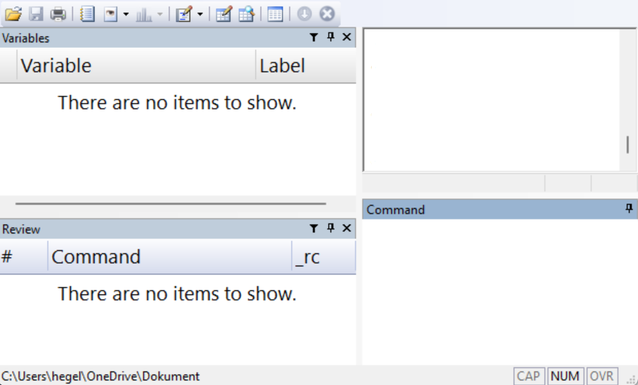
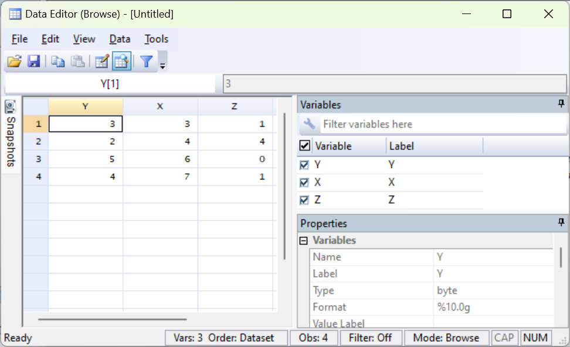
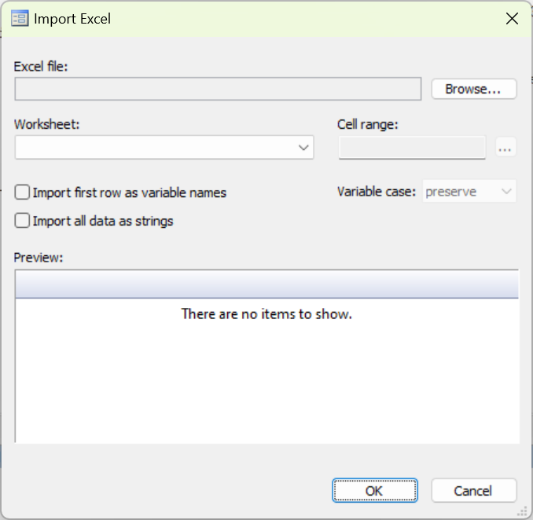
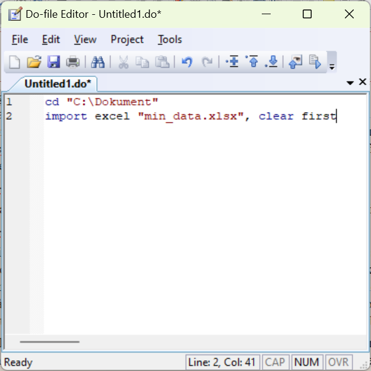
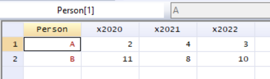
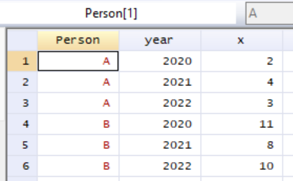
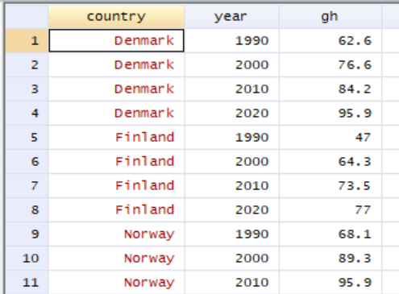

# Stata {#ch-stata}
This chapter introduces the statistical analysis program Stata, whose latest version at the time of writing is called Stata 19. To follow along with the examples, you need to have access to the program on your computer. For instance, you can purchase a license at www.stata.com. If you are a student at a university, you may have access to a free license or special discounts through your university. This introduction to Stata is brief and aims to get the reader started with their own work as quickly as possible, thereby learning more through practice. There is abundant material offering more comprehensive introductions to Stata, see for example

www.stata.com/features/documentation

On this webpage, we find among other things the Stata User Guide:

www.stata.com/manuals/u.pdf

Stata also has support for a Swedish interface, meaning that menus and other elements are displayed in Swedish. See the link for how to change your settings:

www.stata.com/features/overview/swedish-interface/

## General info about Stata {#sec-stata-general}

The figure below shows an example of what Stata can look like. In the image we see four boxes, windows. In the upper left we see Variable, which shows a list of the variables (columns) we currently have access to. In the lower left, Command, shows a list of the most recently entered commands. In the lower left is the Command window. In the upper right we see the results window, Results.

It is also possible that additional windows other than those shown in the image are displayed. If any of the windows in the image are not shown when we open the program, we can open this and other windows by going to the Window menu and choosing among the options there: Command, Results, Review, Variables and more.


``` r

```


When we open Stata for the first time, we see no table. To look at the data that is loaded in the program, we can open the Data Editor window. This can be done through the menu Window > Data Editor, or with the keyboard shortcut Ctrl + 8. It is also possible to access the Data Editor via the icons at the top below the menus in Stata's window. When we open the Data Editor window for the first time, it is empty.


``` r

```


The figure above shows an example of what the data window can look like. In the image we have a table with the three variables $Y, X$ and $Z$ with four observations, where $Y=\left\{ 3,2,5,4\right\}$, $X=\left\{ 3,4,6,7\right\}$ and $Z=\left\{ 1,4,0,1\right\}$. Note how the variable names appear as column headers. The variable names are thus not values among the observations, as they would be in an Excel sheet, for example.

In the boxes to the right in the image we can see a bit more information about the variables, such as what type of data each variable contains and what data format the variables have. This information about our data is sometimes called metadata. In the image, the first observation for variable Y is selected. The cell contains the value 3.

In the Properties window we see that the entire column with variable Y consists of data of the type float. Float is a data format for real numbers. To the right in the image we also see that variable Y has the format %10.0g, which describes how the real numbers in the column are displayed, for example number of decimals, see below. When we read a file with a data table from the hard drive into Stata, the table opens by default in the program's data window.

Somewhat simplified, we can describe it as Stata working with one data table at a time, or at least one main table. All commands we give the program are interpreted by the program as wanting to perform on this main table, unless otherwise specified. This is a difference from, for example, Microsoft Excel where we can have several tables with different types of information in the same worksheet, together with charts and more, for example.

This means, among other things, that a column in Stata is intended to contain only one type of information. All data in the column is classified as one data type, for example real values or text strings. As a comparison, in Excel we have the possibility to have different types of information saved in the same column or on the same row.

The Data Editor window can be opened in two modes: Browse, with data write-protected, and Edit, without write protection. If we open the Data Editor in Edit mode, we must be careful not to accidentally edit data and lose information.

## Commands in Stata {#sec-stata-commands}

In Stata we can control the program using the menus or by writing commands, also called writing program code or scripts. Stata has its own language, its own syntax, which is specially designed for data analysis. The chapter focuses primarily on how we can write code. We begin with an example of how we can use the menus.

### Commands with menus

In Stata we often work with data retrieved from existing data files, for example data that is saved in an Excel sheet or some other program and data format. We can also enter data manually, see the section on entering data manually below. Say we want to import an Excel file to Stata from the computer's hard drive (see also the section on importing and exporting data below). We can then choose menu File > Import... > Excel spreadsheet (*.xls, *.xlsx). A new dialog box opens, where we can choose different options for how the file should be imported to Stata. Under Import... we can also choose to import other file types.

Stata can retrieve the information that is saved in the Excel sheet. If we then work with this data in Stata, the Excel sheet is not affected. Note that this is a difference compared to if we open the same file in Excel. If we edit an Excel sheet in Excel and save the file again, old information is overwritten. If we want to overwrite the Excel file in Stata, we must export the data we are working with to the hard drive and overwrite the old file. This is practical because it reduces the risk of us overwriting useful information.


``` r

```


The figure above shows what the dialog box for importing Excel files can look like. In the top box in the dialog box we choose which Excel file we want to import data from. By clicking on the Browse... button we get the opportunity to click our way through the directories to the file. Excel sheets can contain several tabs (worksheets) with data. In the box for Worksheet in the dialog box we specify the name of the tab in the Excel sheet from which we want to retrieve data. Under Cell range we can specify which cells in the Excel sheet's tab the data should be retrieved from. To retrieve data in cells A1 to B4 we can write A1:B4.

Stata generally uses a period as the decimal separator, which is standard in many countries in the world and therefore also in many computer programs. In Sweden, a comma is generally used as the decimal separator, which can sometimes cause problems when we are going to use computer programs. If the data we want to import is saved with commas, Stata can generally read our data but then interprets the information as text data. We can easily remedy this, which we will return to below.

### Commands using do-files

All commands we can perform using the menus can also be performed with written commands. Sometimes we also benefit from combining the methods. When we specify a command through the menus, Stata shows how the same command would have looked as a written command. Stata has a large collection of functions pre-installed, which can be accessed both through menus and Stata's own programming language.

Written commands can be entered either in the lower right window Command in Stata or in the window called the Do-File editor. If we write commands in the Command window, the command is executed but the text we wrote is not saved. What we write in the Do-file editor can be saved as a text file, which is why we focus on that method here. To open the Do-file editor we can click on the menu Window > Do-file editor > New Do-file editor. We can also use the keyboard shortcut Ctrl + 9.

A practical way to work with Do-files is to begin the file by specifying the working directory for this particular work project. By specifying a working directory, we instruct Stata where on the hard drive the program should retrieve files from and where the program should save files, if we give instructions to export information to a file.

The first time we want to define a working directory, it may be easiest to do this using the menu File > Change Working Directory.... This opens a dialog box where we can click our way to the directory on our computer that we want to use as the working directory. Select the directory and click OK. If we choose, for example, a directory called Documents that is located on the computer's hard drive C, and everything is correct, the following text will now appear in the results window:

```stata
. cd "C:\Documents"
```

Written commands in Stata are often written with the name of a function followed by the arguments the function should use. In many functions we can then, if we want, write a comma and specify various options. To choose a working directory we use the function `cd`, which is an abbreviation for current directory.

Now we can copy the text `cd "C:\Documents"` from the results window and paste it into the do-file editor. The text we write in the do-file editor can be sent to the program, which then performs various actions. Sending written commands, program code, to the program is called executing the program or running the code.

To run a line of program code in the do-file editor, we select one or more characters on the line we want to run and click Execute selection (do) or press Ctrl + D. To run all code in the current do-file we can use the keyboard shortcut Ctrl + D. The code that is run is reported in the results window along with any results from the execution. If we are unsure about which working directory we have chosen, we can use the function `pwd` (abbreviation for present working directory).

The text in the do-file editor can be saved as a file on your computer's hard drive, and then gets the file extension .do. A do-file is a plain text file (in Windows these can be saved as .txt files). Thanks to the file extension .do, however, the program recognizes this file as a do-file for Stata. That is, if we save the text in the do-file editor, only the actual text is saved, which does not take up much space on the hard drive. Any results that the code creates when it is run are not saved, such as data, tables and charts.

Say now that we want to import an Excel file called my_file.xlsx. The file is saved in the directory we specified as the working directory. For this we can use the function `import excel` and specify filename and other options. If we have run the `cd` command above and specified our working directory, we can place our Excel file in this directory and write the following command:

```stata
import excel my_file.xlsx
```

If we want, we can also write a comma and define which tab in the Excel file data should be retrieved from by defining the option `sheet()`. If we do not specify a tab, data is retrieved from the first tab in the file. If the tab we want to retrieve data from is called sheet1, we can write:

```stata
import excel my_file.xlsx, sheet(sheet1)
```

We can also specify which cells we want to retrieve data from in this tab by defining the option `cellrange()`:

```stata
import excel my_file.xlsx, sheet(sheet1) cellrange(A1:B5)
```

By specifying `cellrange(A1:B5)`, only the information stored in cells A1 to B5 in the current tab and file is imported. If we already have data open in Stata's main table (the data editing window, Data Editor), the program will abort the command with a warning that data loaded in Stata will be lost: no; data in memory would be lost. This is a helpful warning.

Always be careful to save the information we are working with if we want to be sure not to lose our work. After we have saved our work, we can either use the command `clear all` to delete all data that is open in Stata. Then we can import data and the program will not give any error message. A faster method is to, after we have saved our data, use the option `clear`, which also deletes all data in Stata's main table:

```stata
import excel my_data.xlsx, clear
```

In Stata's data window, we noted how the variable names are specified as column names above the observations. If the first, top row in the data we import is the name of the variables, we can specify the option `first`. The program will then use the information in this top row to name the variables. For example, we can write like this:

```stata
import excel my_data.xlsx, clear first
```


``` r

```


The figure above shows what it can look like in the do-file editor in Stata. To run the code we select some of the characters on both lines and click Run or use the keyboard shortcut Ctrl + R. Written commands in Stata are generally written one per line. We can also let a command continue on the next line by adding the symbols `///` at the far right of a line. For example like this:

```stata
import excel ///
    min_data.xlsx, ///
    clear first
```

In the example above we use indentation, the spaces at the beginning of line two and three. This is often practical to make the code more readable, but it is only a matter of taste and does not affect the program. If we are unsure about how something should be written in the code, we can use the menus. If we click through a command using the menus, Stata prints out how the same command can be written as code. We can then reuse this text for our do-file, in the way we went through above for choosing the current working directory.

Another way to learn more about the options for a function and also find new functions is to look up the help pages for a function, which we find via the functions `help` or `search`, followed by the name of the function we want to read about. If we want to read about `import excel` we can for example write:

```stata
help import excel
```

The result is displayed in the window called Viewer. Often a list of search results is displayed that we can click through.

Many times we also benefit from documenting our work to simply remember exactly what we have done. It can be surprising how quickly one can forget things one worked with just a few days earlier. For the same reason, programming facilitates collaboration with other analysts. If someone has written program code that clearly describes what happens in an analysis, it facilitates the possibility for others to continue the work.

A central part of writing readable code is to write good comments in the code that explain what the code does. We do this so that we ourselves, or other users we want to show the code to, can more easily follow along with the code. Many people have an amazing ability to surprisingly quickly forget what we have done and thought. To write comments in Stata's do-files we use the asterisk `*`. A line in the do-file that begins with `*` is ignored by the program. We can therefore use `*` to add comments that describe what the code does. Here is an example:

```stata
* Line that begins with asterisk is ignored by the program.
* Next line defines working directory.
cd "C:\Documents"
* Next line imports data from an Excel file.
import excel my_data.xlsx, clear first
```

Stata has a large number of ready-made functions pre-installed when we install the program. There are also additional functions that we can download for free from the internet. On this webpage there are a large number of links with more information about many different types of functions and tools: www.stata.com/links/resources-for-adding-features/

One of these is the Statistical Software Components (SSC) database, which is run by Boston College in the USA. This database has a large number of functions that are largely created by other users on a voluntary basis. SSC is so well-known that there is a special function for installing new functions from there: `ssc install`. One such function that we can download to Stata from SSC is called outreg2. Right now we don't need to worry about what outreg2 can be used for, we will return to that below. To install outreg2 we can write and run the following code:

```stata
ssc install outreg2
```

When we run this command, Stata will connect to the internet and download a package with the function `outreg2` as well as instructions for how the function works to our computer and save it on the hard drive. The function is now installed in Stata and we can then use one or more new functions that came with the package. After installation we can also read the function's help section by running the command `help outreg2`. An installation generally only needs to be performed once. The next time we restart Stata, outreg2 is already installed in our program.

## Importing and exporting data {#sec-stata-import}

Stata can read data from different types of files. Above we went through how we can import an Excel file of type xls or xlsx to Stata. Stata's own file format for data files is called .dta. Dta-files generally contain a table with columns and rows, where each column represents a variable, as well as information about the different variables. To import the information in a dta-file named my_stata_data.dta, saved in the current working directory on the computer's hard drive (see above), to Stata we can use the function `use`. For example like this:

```stata
use my_stata_data.dta
```

Before we import data to Stata we need to remove the data we have open in the program's data window, just as we went through above. We can either do this with the command `clear all`, or use the option `clear` (same as when we used the function `import excel` above):

```stata
use my_stata_data.dta, clear
```

To export the data that is open in Stata's main table (Data Editor) to a dta-file we can use the function `save`. For example like this:

```stata
save my_stata_data.dta
```

We will go through more about how this works later, when we give examples with data. As mentioned in the previous section, we can import Excel files to Stata with the function `import excel`. We can also export data from Stata to Excel files such as .xlsx using the function `export excel`.

Stata also has ready-made functions for importing and exporting data from and to file formats from other analysis programs. As an example, we can import data files from the program SAS with the function `import sas`. To import data files from the program SPSS we can use the function `import spss`.

A particularly useful file format is .csv (Comma-Separated Values). Csv-files are an example of a type of data file that many analysis programs can both import data from and export data to. Csv-files often consist of, as the name suggests, data where each value is separated by a comma. However, it is possible to save information in this file format and separate the values with some other symbol, for example semicolon ; which often occurs.

To import a csv-file to Stata we can use the function `import delimited`, which is a function for importing data files with comma- or tab-separated values. After the function's name we write the filename, for example my_datafile.csv. We can also specify the option `delimiters()` and in the parentheses for this option describe what type of character the data values in the file are separated with.

```stata
import delimited my_datafile.csv, delimiters(";")
```

The function also has several other options, which you can read more about on the function's help pages. To export data from Stata to a csv-file we can use the function `export delimited`. Read more about this function in its help section.

## Enter data manually {#sec-stata-enter-data}

So far we have described how we can import data from existing data files on the computer's hard drive. We can also enter data manually if we prefer. As we went through above, Stata generally works with one main table, that is the rows and columns shown in the Data Editor window. When we specify commands and run code in Stata, the program assumes that all commands refer to this data table, unless we specify otherwise.

If we want to start with an empty table and enter data ourselves, we begin with the command `clear all`, to remove the variables we have open. To enter new variables we must start by specifying how many observations our table should have. We do this with the command `set obs`, followed by a number that specifies the number of observations. For example:

```stata
set obs 4
```

This defines that we want to have 4 observations. To create a new variable in our main table we can use the function `generate`, followed by the name of the new variable, an equals sign and the information we want the variable to contain. Here is an example where we create a new variable named `new_variable` where all observations have the value 1:

```stata
generate new_variable = 1
```

Say now that we instead want to create a variable that we call `n_obs` where each row contains the current row number for this observation. We can do this by writing:

```stata
generate n_obs = _n
```

The code `_n` instructs the program to retrieve the number of this row for each row of our new variable `n_obs`. In this case, this will create a new column with the numbers 1, 2, 3 and 4, since we defined above that we want to have 4 rows. If we instead prefer to enter each observation manually, we can also open the Data editor window in editing mode, edit mode. Then we can click on the box we want to edit and change the value there.

To enter observations manually we can also use the function `input`, followed by the name of the new variable we want to create. For example `input Y`. On the next line we then specify the value for observation 1. The line below that we specify the value for observation 2, and so on. Below follows an example of code with comments where we use the commands `clear all`, `set obs`, `generate` and `input`. Feel free to try using the same code in Stata and check the result in the program's data window.

```stata
* Remove all variables that are open.
clear all
* Next line defines number of observations to 4.
set obs 4

* Create a variable that specifies row number.
generate n_obs = _n

* Create variables Y and X
input Y X
3 3
2 4
5 6
4 7
```

Now that we have written some code in our do-file and hopefully also added some comments that explain what the code does, it is high time to save our script as a file on the computer's hard drive. Press Ctrl + S or choose in the menu File > Save as.... What is now saved is, as mentioned, only the actual text in the do-file. The data that the file can create, for example, is not saved. This is generally just good. The text takes up very little space on the computer's hard drive and it often goes quickly to run through even relatively long do-files.

Often we also want to save the actual data table that we are working with in Stata. Partly because we may have done something special that we are afraid of losing. Or because we want to show our data to someone else. To save the information in Stata's data table in a file on the hard drive, we must use one of the functions we went through above for exporting data (see the section on importing and exporting data). For example:

```stata
save my_data.dta
```

to save the table as a Stata file. Or if we want to save our data in an Excel file that can more easily be opened in Excel, we can use the following command:

```stata
export excel "my_data_from_stata.xlsx", replace
```

## Edit Columns and Rows {#sec-stata-edit}

A large part of data analysis generally consists of editing columns and rows. In Stata we can, as described above, create new columns with for example the function `generate`. If we want to remove two variables `variable_X` and `variable_Y` from the main table we can use the function `drop`, for example:

```stata
drop variable_X variable_Y
```

When we specify the name of the variables after the function `drop`, these variable names must match the name of the variables in the data table. The program distinguishes between small and capital letters so our spelling of the variables must be exactly the same as the spelling in the data table. If the program cannot find one or more of the variables we name in the data table, we get an error message.

If we want to remove all variables and observations from the data table we can write `drop _all` or `clear all`, as we did above. If we instead want to choose which variables we want to keep and delete the rest, we can use the function `keep`. For example like this:

```stata
keep variable_X variable_Y
```

which lets us keep these two columns and deletes all other columns in the main table. If we have a variable and want to change the name of it, we can use the function `rename` followed by existing variable and new variable name. For example:

```stata
rename variable_old_name variable_new_name
```

To sort observations in numerical or alphabetical order we can use the functions `sort` or `gsort`. The function `sort` sorts in ascending order. The function `gsort` sorts in either ascending or descending order. For example:

```stata
sort var_X
```

sorts all observations in the entire data table by arranging the values in variable var_X in ascending order. We get the same result if we instead use the command `gsort var_X`. To sort in descending order we can write:

```stata
gsort -var_X
```

We can also add several variables to sort the table in several steps. For example:

```stata
gsort country year
```

sorts the table by placing the values in variable country in ascending order. Within each unique value in variable country, variable year is sorted in ascending order. Each variable in Stata has a data format, which partly controls how the values in a variable are displayed in the data table and partly controls how the program handles the values. To change format on one or more variables we can use the function `format`. For example like this:

```stata
format %9.0g x y z
```

This command sets the three variables x y and z to have the format right-aligned general, with a maximum of 9 characters visible in the variable. If we write 0 as decimal for the g-format, the program determines how many decimals are shown, depending on the maximum number of allowed characters (in this case 9). If we want to use commas instead of periods we can replace the period in the format %9.0g with a comma %9,0g. The command to change format on variables x, y and z then reads:

```stata
format %9,0g x y z
```

Read more about the function `format` and its various options in the function's help pages, which we as usual find by calling the command `help format`.

Stata, like many other computer programs, handles numbers and text strings in different ways. A number can be saved as a text string and is then regarded as text. Stata cannot perform mathematical operations on text strings, even if a string consists only of something that we humans regard as a number. There are special display formats for both numbers and text. If we want to convert a variable from numbers to text strings we can use the function `tostring` and either add the option `replace` (which overwrites existing variable) or `gen(my_new_variable)`, which creates a new variable that we can name:

```stata
* Convert the numerical variable to text:
tostring X, replace
* Keep numerical variable and create new text variable:
tostring X, gen(X_as_string)
```

If we instead have a variable that is saved as text but contains numbers, and we want to recode so that the program regards the numbers in the variable as numbers, we can use the function `destring`. This function also has the options `replace` and `gen()`:

```stata
* Convert the text variable to numerical:
destring Z, replace
* Keep text variable and create new numerical variable:
destring Z, gen(Z_as_numerical)
```

The function `destring` can be used if we have data with numbers where commas are used as decimal separators and Stata interprets these numbers as text strings. With the option `dpcomma`, `destring` can convert numbers saved with decimal commas to numbers with periods instead. For example:

```stata
destring Z, replace
```

If we want to overwrite all or parts of an existing variable with new values we can use the function `replace` (not the same thing as the option replace that we used above). Say we have a variable called income that contains values for income. If we want to take the natural logarithm of the observations in the variable we can use the following command:

```stata
replace income = log(income)
```

Table: Mathematical Functions in Stata

| Function | Description |
|----------|-------------|
| `ln()` | Natural logarithm. |
| `log()` | Natural logarithm, same as `ln()`. |
| `log10()` | Base-10 logarithm. |
| `exp()` | Exponential function, antilogarithm. |
| `sqrt()` | Square root. |
| `int()` | Round to integer. |
| `round()` | Round. `round(x)` rounds x to integer. `round(x,y)` rounds x to y number of decimals. |
| `sum()` | Summation of a collection of values, for example a variable. |
| `max()` | Returns maximum of a collection of values. |
| `min()` | Returns minimum. |

The function `replace` assumes that the variable we name after `replace` (in this case income) is found in the data table. We must spell the name of this variable exactly the same as the variable in the data table. It is not enough that the variable is mentioned in the script. It is only after we have created the variable income that we can run the function `replace`. The function `log()` here returns the values in the variable income in logarithmic form. Since we use the function `replace`, the existing variable income is deleted and replaced with the new variable with the same name with logarithmic values. If the variable income contains any negative values, this command will result in these being created as missing values in the new variable, since the logarithm is not defined for negative values. Missing values in Stata are displayed as a period in the data table.

There are also other functions that can be used to perform mathematical operations. Note that these functions in Stata's normal mode can only be used if we save the result of the function somewhere, for example in a variable. We cannot, for example, use the following as a separate command:

```stata
log(5)
```

We can, however, create a variable with the same function:

```stata
generate x = log(5)
```

The function `replace` can also be used to change the value of a specific observation. For this we add one or more conditions. Conditions can in this case be added using the command `if`. Here is an example where we replace the value on row 2 in variable X with 10, regardless of what value was there previously.

```stata
replace X = 10 if _n==2
```

The expression `_n==2` means that the row number must be equal to 2. When we describe equal to as a condition, this is written with two equals signs. The same applies in several other programming languages. The table below gives examples of inequality signs we can use to describe conditions.

Table: Inequality Signs for Conditions

| Sign | Meaning |
|------|---------|
| `>` | greater than |
| `>=` | greater than or equal to |
| `<` | less than |
| `<=` | less than or equal to |
| `!=` | not equal to |

The last expression `!=` can be used to, for example, specify which observations should not be affected by a change. Say, for example, that we want to change all observations for variable X except row 2 which should remain unchanged. We can then write like this:

```stata
replace X = 10 if _n!=2
```

We can also combine several conditions using the following expressions:

- `&` and
- `|` or

Here is an example where we set all values for variable X to 10 for observations on row 3 or above and where variable Y is above 5:

```stata
replace X = 10 if _n>=3 & Y>5
```

By combining conditions with the functions `drop` and `keep` we can select which rows in the data table we want to keep or delete. The following command deletes rows 1 to 9:

```stata
keep if _n>=10
```

The following command deletes rows 1 to 5:

```stata
drop if _n<=5
```

Or:

```stata
drop if _n==1 | _n==2 | _n==3 | _n==4 | _n==5
```

This is thus an unnecessarily cumbersome solution and the first example with the condition `if _n<=5` is preferable in this case. In Stata, missing values are written as a period `.` in the data table. When we perform operations on variables where missing values occur, these are treated somewhat differently, depending on which functions we use. It is therefore important to check this carefully in each case. When we use conditions we can also address missing values by writing a period. Say we have the data shown in the table below (variables Z and K):

| Row | Z | K |
|-----|---|---|
| 1 | 10 | . |
| 2 | 20 | 1 |
| 3 | 30 | 1 |
| 4 | 40 | 2 |

and specify the following command:

```stata
generate L = Z + K if K!=.
```

This will create a new variable L with the values ., 21, 31, 42. Row 1 gets missing value because variable K=. on this row (missing value). We get the same result if we instead specify the command:

```stata
generate L = Z + K
```

This means that the missing value is interpreted as unknown. Since the program does not know what value Z=10 should be added to on row 1, the result in the new variable L is also left as a missing value. Let us now look at the following command:

```stata
generate Zsum = sum(Z)
```

This creates a new variable `Zsum` using the function `sum()`. The function `sum()` gives us in this case the cumulative sum of the values in variable Z, that is: $Zsum=\left\{ 10,30,60,100\right\}$. We can compare this with if we instead sum variable K with the following command:

```stata
generate Ksum = sum(K)
```

In this case, the missing value K in the first observation is treated as 0, not as a missing value. To calculate a constant in the form of the total sum we can instead use the function `total()`, for example:

```stata
generate K_total_sum = total(K)
```

When we work with data analysis we often benefit from being able to transpose our data, that is change whether our data is organized in width or height. In Stata's data table we have some type of information for two people, A and B, for the years 2020, 2021 and 2022. The development per person is described in width where each year has its own column. Variable names in Stata cannot begin with a number so the three columns with years are named x2020, x2021 and x2022.


``` r

```


If we want to display this information in a chart in Stata it becomes easily complicated, since Stata's functions for displaying charts are primarily designed based on the idea that a variable is organized in one column, see the section on creating plots below. In this case we have one and the same variable spread across three columns, depending on the year.

Now we are going to transpose this table so that we get all the numbers in columns x2020, x2021 and x2022 in one and the same column that we call x. We also want to have the years from the column headers gathered in a column next to x. To transpose the table to long format we can use the function `reshape long`. We must then describe to the function which columns we want to retrieve data from and gather in a new column x. This can in this case be done like this:

```stata
reshape long x, i(Person) j(year)
```

The first information we specify is x, which is the prefix of the three columns with years. It is from these three columns that the function `reshape` now retrieves data that should be organized lengthwise. The program finds these three columns precisely because all three are named x... something. Then we describe in the parentheses for `i()` that we want to keep the column Person. In the parentheses for `j()` we finally specify the name of the new variable where the information that comes after "x" in the name of the three columns from which we retrieve data should be placed. In this case it is three years, which is why we decide to name this variable year.


``` r

```


## The function egen {#sec-stata-egen}

Alongside `generate` there is also the function `egen` which can be used to create new variables, both in similar ways as `generate` and with more complex options and functions. If we start with the following example:

```stata
egen Xs = sum(X)
```

This creates a new variable Xs with a constant total sum for variable X. This is thus the same result as when we combine `generate` and `total()`. However, `egen` has several useful functions. One example among many is the function `std()` which returns standardized values of a variable. We can for example write:

```stata
egen standardized_X = std(X)
```

Say now that we have ten variables that we have named var_1, var_2, ..., var_10. Now we want to create a new column where we get the sum per row in these 10 variables. We can then use `egen` together with the function `rowtotal()` with the following command:

```stata
egen row_sum = rowtotal(var_1:var_10)
```

We use the colon symbol to indicate that we want to include all columns (variables) in the data table from var_1 to var_10. The function `egen` also has other functions for doing calculations per row, such as `rowmean()` which returns the mean per row, `rowmax()` which returns the maximum value per row and `rowmiss()` which returns the number of missing values per row. To read more about different possibilities and options with `egen`, see the function's help section which we find with the command `help egen`.

We can also do calculations on entire or parts of columns. Above we mentioned for example how we can combine `generate` and `sum()` to calculate cumulative sum, as well as `egen` and `sum()` to calculate sum per column. Say now that we have a data table where variables id, X and Y are numerical and variable Z contains text strings. We can think of variable id as a variable for identifying analysis units, where each unique value 1 and 2 respectively represents for example a person, a household or an organization. Variable nr is also categorical with the two unique values a and b respectively.

If we now for example want to calculate the sum of the numerical variable X per unique value in variable id (per person/household/organization) we can use the following commands:

```stata
bysort id: egen sumX = sum(X)
```

The prefix `bysort id:` sorts the data table based on variable id in ascending values. In addition, this groups the table based on the unique values in variable id. Each unique value in id, values 1 and 2 respectively, forms its own group within which the following command is executed. Then we use the function `egen` in combination with `sum()`, just as we did earlier. But now we get the sum of the values in variable X per group, which in this case means per unique value in id. For group 1 the sum in the new variable becomes 50. For group 2 the sum becomes 149. The new variable sumX thus gets the values 50, 50, 149, 149. If we prefer we can also divide this into two steps and write the following commands that give the same result:

```stata
sort id
by id: egen sumX = sum(X)
```

We can also group on the unique combinations of several variables. For example:

```stata
bysort id nr: egen X_sum = sum(X)
```

This creates 3 unique groups: id=1 with nr=a, id=2 with nr=a, and id=2 with nr=b. The sum of variable X for these three groups is: 50, 72, 77.

With the help of functions like `generate`, `replace` and `egen` we can create different types of results in tables. These functions can for example be used to compile an overview of extensive data material, for example by calculating number of observations, summing values, calculating mean and standard deviation.

If we then want to present our results in another program, for example Excel, Word or PowerPoint, it may again be time to export our data to a file on the hard drive, for example using the function `export excel`. There are also special functions for exporting tables to various specific formats. To export results from Stata to MS Word it is recommended to check out the function `asdoc`, which can be installed with the following command:

```stata
ssc install asdoc
```

Stata has, as far as the author knows, no pre-installed function for calculating weighted means. Based on the functions we have gone through above we can relatively easily create our own calculation. There are also functions developed by users that can be combined with `egen` to calculate weighted means. See the following link: https://ideas.repec.org/c/boc/bocode/s418804.html

## Join tables {#sec-stata-join}

Often when we work with data analysis we want to be able to merge two or more tables with each other into one table. This can for example happen by having a table to which we add rows, where the new rows have the same variables as our table. Sometimes we also want to add columns, where all or some observations in our table match observations in the data that is added.

One way to do this in Stata is by using the function `merge`. The function is based on having a collection of variables open in the program (in the data table) and another collection saved in a dta-file on the hard drive. Both tables have at least one common column with one or more observations with the same values. Say for example that we are working with a table with information about height for person 1, 2 and 3. The two variables are called person and height. In our working directory we have saved the file weight.dta, which contains information about weight for person 1, 2 and 3. The two variables in the file weight.dta are called person and weight. Now we want to add the variable weight to our data table in Stata using the function `merge`. For this to work, both the data file on the hard drive and our data table must be sorted on the same variable. Then we can use the following command:

```stata
merge person using weight.dta
```

If you have done correctly and run the command, the variable weight is added to the data table and each value is matched against the values in the variable person. The program also creates the new variable `_merge` with information about which values found a matching observation in the data tables. See the help section for the function `merge` for more information. Below follows a somewhat longer code that creates all data directly in the script, in case you want to try yourself. You must first specify the working directory where the file should be saved.

```stata
clear all
input person weight
1 55
2 66
3 77
end
sort person
save weight.dta, replace
drop _all
input person height
1 160
2 170
3 180
end
sort person
merge person using weight.dta
```

All versions of Stata before Stata 16 could only have one table open at a time. If we work in Stata 16 or later we can also have other tables saved in the program's memory. To save a data table temporarily in the program's memory we can use the function `frame create`. We can then edit this with `frame change`. We can in turn use this among other things to check whether a variable in one table matches a variable in the other table, using the function `frlink`. Read more in these functions' help sections.

## Calculate index using Stata {#sec-stata-index}

Index for year t can be calculated in the following way:

$$\text{Index}_{t}=\frac{\text{Value}_{t}}{\text{Value}_{\text{base year}}}*100$$

The base year's value is here 100. Say now that we have GDP per capita for the years 2015–2019 in the way described in the table below (see the chapter on Excel for a similar example). If we want to enter this data manually into Stata's data table we can use the following command where we call the variables year and gdp:

| Year | GDP per capita, 2019 prices |
|------|----------------------------|
| 2015 | 474,000 |
| 2016 | 477,800 |
| 2017 | 483,500 |
| 2018 | 487,300 |
| 2019 | 488,800 |

```stata
input year gdp
2015 474000
2016 477800
2017 483500
2018 487300
2019 488800
end
```

We will now index gdp and specify year 2015 as the base year. We can do this in several ways. For example, we can use square brackets to refer the base year's value to the first observation in the data table in the calculation of the index. To be sure that the first observation really is year 2015, we start by sorting the table with the function `gsort`:

```stata
gsort year
generate index_gdp_1 = gdp/ gdp[1] *100
```

We can also save the base year as a scalar:

```stata
scalar gdp2015 = gdp[1]
```

and then calculate the index variable:

```stata
generate index_gdp_2 = gdp/ gdp2015 *100
```

## Matrix calculations and MATA {#sec-stata-mata}

Alongside Stata's regular functions, the program also has a special programming language, a special syntax, for working with matrices and linear algebra called Mata. Commands in Mata work somewhat differently compared to Stata's regular functions and commands that we went through above. Stata's regular functions generally assume that we want to use or edit data in the program's data table. We also cannot write regular mathematical operations, 1+1, in Stata's command window, unless we simultaneously specify where this information should be saved, such as in a variable. With Mata we can work in a different way with both mathematical operations and with information outside the program's main table.

To use Mata we begin the script with the command `mata`, write in the commands for Mata we want to use and end with the command `end`. We can then for example write a mathematical calculation without defining that the answer should be saved somewhere. Here is an example where we ask the program to calculate the number 2+2:

```stata
mata
2+2
end
```

If we run this command, the answer is displayed directly in Stata's results window. Say now that we want to define the following matrix A:

$$A=\left[\begin{matrix}1 & 2\\ 3 & 4 \end{matrix}\right]$$

This can be done with the following command:

```stata
mata
A = (1,2\3,4)
end
```

We name the matrix A and inside the parentheses we specify which elements the matrix should contain. Commas `,` separate the values on the same row. Backslashes `\` separate rows. Since we have two values, a line break and two more values, the program understands that we want to create a $2\times2$ matrix. To create a row vector R we can use the following command in Mata:

```stata
R = (3,2,5,4)
```

To create a column vector K we can write:

```stata
K = (3\2\5\4)
```

In Stata's do-files we can write comments that the program ignores by starting a line with asterisk `*`. In Mata we cannot use this notation but instead write comments by starting a line with `//` or writing `/* comment */`. For example:

```stata
mata
// next line defines matrix A
A = (1,2\3,4)
/* next line ends Mata input */
end
```

Matrix A is now saved in the program's memory but is not displayed in Stata's data table. To create a matrix we can, besides Mata, also use Stata's function `matrix define`. We then do not need to specify `mata` first but instead write:

```stata
matrix define A = (1,2 \ 3,4)
```

This gives the same result as the example with Mata above, and creates a $2\times2$ matrix A that is saved in the program's memory. Another method is to first define the matrix's dimensions using the function `J()` and then add the matrix's elements. For example like this:

```stata
matrix define A = J(2,2,.)
```

The expression `J(2,2,.)` creates a $2\times2$ matrix and the period is interpreted as all elements should contain missing values. Another example:

```stata
matrix define B = J(4,7,1)
```

The command creates a matrix B with 4 rows, 7 columns and where all elements contain the number 1. To display the content of matrices in Stata's memory we can use the function `matrix list` and specify the name of a matrix. For example:

```stata
matrix list A
```

The result, the elements in matrix A, is then described in Stata's results window. To check which matrices are currently saved in the program's memory we can use the following command:

```stata
matrix dir
```

To remove a matrix A that we have saved in Stata's memory we can use the command:

```stata
matrix drop A
```

To delete all matrices in Stata's memory we can write:

```stata
matrix drop _all
```

If we want to name the rows in a matrix we can use the function `matrix rownames`, for example like this:

```stata
matrix rownames A = "row 1" "row 2"
```

To name the columns in a matrix we can instead write:

```stata
matrix colnames A = "column 1" "column 2"
```

If we want to rename an existing matrix we can write:

```stata
matrix rename old_name new_name
```

Say now that we are going to transpose matrix A and create the following matrix

$$A^{T}=\left[\begin{matrix}1 & 3\\ 2 & 4 \end{matrix}\right]$$

For this we write `A'`, for example in the following way:

```stata
matrix define A_transpose = A'
```

To display the content of this new matrix we can use `matrix list A_transpose`. The diagonal in matrix A above contains the elements 1 and 4. To extract the diagonal from this matrix we can use the function `diagonal()`, which returns a vector with these elements. For example:

```stata
matrix define d_A = diagonal(A)
```

If we want to create a diagonal matrix from these values directly we can instead use the function `diag()`, like this:

```stata
matrix define diag_A = diag(A)
```

The function `diag()` can also be used to create a diagonal matrix from a vector. Here is an example where we first define the vector $\vec{a}=\left[\begin{matrix}1 & 3 & 2 & 4 & 5\end{matrix}\right]$:

```stata
* Define vector a
a = (1,3,2,4,5)
* Create diagonal matrix from this vector
diag(a)
```

To create an identity matrix we can use the function `I()`. The command `I(n)` creates an $n\times n$ identity matrix, where n is any integer. The command `I(m,n)` creates an $m\times n$ matrix with the value 1 on the diagonal and 0 in all other elements. Here is an example where we create a $2\times2$ identity matrix:

```stata
* Create identity matrix
matrix define identity_2 = I(2)
* Display the matrix
matrix list identity_2
```

To calculate the inverse of matrix A, which is real and square, we can use the function `luinv()`. For example like this:

```stata
matrix A_inverse = luinv(A)
```

To calculate the determinant of a matrix A, which is a scalar, we can instead of `matrix define` use the function `scalar define`, as well as the function `det()`. To display the content of the saved scalar determinant_A we then use the function `scalar list`, instead of `matrix list`.

```stata
scalar define determinant_A = det(A)
scalar list determinant_A
```

Scalars are a type of object that Stata uses to save information temporarily in memory. Another type of object Stata can use to save information is macros. There are local and global macros. To refer to a named saved local macro we write the name of a local macro with accent `` ` `` before and apostrophe `'` after. To refer to a global macro we write ` $macro_name`, that is we use a dollar sign in front of the name. To display a general list of which macros Stata has saved in memory right now we can also use the function `macro dir`.

Scalars and macros can be used for different things when we program, for example if we want to refer to and report special results or reuse these in new calculations in our code. We can also save text strings in this way by using quotation marks. Here is an example where we create two macros and save numbers in them. A local macro that we call alpha and a global macro that we call beta:

```stata
* Save local macro
local alpha = 12
display `alpha'
* Save global macro
global beta = 23
display $beta
```

We can now refer to all of these directly in the same way as we refer to macros.

To perform mathematical operations with scalars and matrices we can use regular mathematical symbols, such as for example:

```stata
matrix define AA = A * A
```

which means that we matrix multiply A by itself. Here is another example where we take the determinant of A, determinant_A, and multiply this by matrix A:

```stata
matrix define dA = determinant_A * A
```

Say now that we have two $2\times2$ matrices A and B and want to perform the following calculation:

$$A-B=\left[\begin{matrix}1 & 2\\ 3 & 4 \end{matrix}\right]-\left[\begin{matrix}5 & 6\\ 7 & 8 \end{matrix}\right]$$

For this we can use the following commands:

```stata
matrix define A = (1,2 \ 3,4)
matrix define B = (5,6 \ 7,8)
matrix define A_minus_B = A - B
```

The commands for matrices and scalars we have described here do not affect variables and values in Stata's data table, but if we want we can retrieve information from the data table and save as matrices in memory, and we can also export information from the matrices to Stata's data table. Say that we have four observations in Stata's data table for the two variables $Y=\left\{ 3,2,5,4\right\}$ and $X=\left\{ 3,4,6,7\right\}$. To save variable Y in Stata's data table as a matrix in memory, we can use the function `mkmat`, for example like this:

```stata
mkmat Y, matrix(Y_matrix)
```

where the option `matrix()` lets us specify the name of the matrix we create. In memory, a column matrix with four elements and the same values as in variable Y is now saved. To export the values in a matrix to Stata's data table we can use the function `svmat`, for example like this:

```stata
svmat Y, names(Y_from_matrix)
```

where with the help of the option `names()` we can specify how the columns we create in Stata's data table should be named. All commands for matrices described above can also be written using Mata, but the difference is that we then do not need to write out `matrix define` and similar parts of the commands. Instead we can just write out the operations directly. If we want to retrieve data from variables and save in a matrix we can use `mkmat` but if we want to be able to use this matrix in mata we can instead use the function `putmata`. To retrieve information from mata and save as variables in Stata's data table we can use the function `getmata`. Here follows an example of some operations in Mata:

```stata
mata
// Create matrix A
A = (1,2 \ 3,4)
/* Write out the name of A to display the content */
A
// Matrix multiply A^2
A * A
// Transpose A
A_t = A'
A_t
// Return the diagonal from A
diagonal(A)
// Create diagonal matrix from the diagonal of A
diag(A)
// Create 2x2 identity matrix
I(2)
// Define vector a and create a diagonal matrix
a = (1,3,2,4,5)
diag(a)
// Calculate trace for A
B = trace(A)
B
// Calculate inverse matrix of A
A_inverse = luinv(A)
// Determinant of A
det(A)
det(A) * A
end
```

Note that with Mata we can also use Stata's mathematical functions and return results directly without saving the results anywhere new. For example:

```stata
mata
// Create a matrix
x = J(3,4,5)
x
// create a vector
z = (1,2,3,4,5)
z
// Calculate the sum of the elements
sum(x)
sum(z)
end
```

## Input-output analysis {#sec-stata-io}

Say that we want to use Stata to do an input-output analysis. In the chapter on Excel we saw how we can define matrix A:

$$A=Z*\text{diag}\left(S_{m}\right)$$

where $Z$ is the flow matrix and $\text{diag}\left(S_{m}\right)$ is a diagonal matrix with the multiplicative inverse of total production per sector along the diagonal. We define matrix C as a column matrix with production for final consumption per sector. The total production from sector j required for all inputs and final consumption we call $y_{j}$, which we collect in matrix $Y$, which can be written as:

$$Y = \left(I-A\right)^{-1}S$$

where $I$ is an identity matrix with the same dimensions as $A$. Each element in $Y$ is the total production required with regard to inputs and final consumption. Matrix $\left(I-A\right)^{-1}$ we call $B$, which has the same dimensions as $A$. In $B$, column sum $j$ is the production multiplier and row sum j is the input multiplier for sector j.

We can calculate these matrices using Mata in Stata. In the example below we define the matrices manually. As we described above, it is also possible to retrieve the matrices' elements from the data table using the function `mkmat`. We start by defining matrices Z, C and S and $\text{diag}\left(S_{m}\right)$. Then we can calculate matrix $A$, $B$ and finally $Y$. Feel free to try it yourself in your own program and check the results:

```stata
mata
// Define matrix Z, C and S
Z = (2,1 \ 1,3)
Z
C = (3\3)
S = (6\7)
Sm = (1/6 \ 1/7)
// Define A
A = Z * diag(Sm)
A
B = luinv( I(2) - A )
B
Y = B* S
Y
end
```

## Variation and covariance {#sec-stata-variation}

Stata has several functions that can create descriptive statistical measures and present these in tables. One example is the function `summarize`. As an argument to the function we write the name of the variable or variables we want information about, for example:

```stata
summarize Y
```

The result of the command is displayed in Stata's main window, the results window. If we write several variables, such as `summarize Y X`, one variable per row is listed in the results table. We can also add the option `detail` to get more detailed descriptive information about each variable.

Here follows an example where we produce detailed statistics about variables Y and X. The result includes percentiles, number of observations, mean, standard deviation (Std.dev), variance, skewness and kurtosis. The last two concepts are different measures of how skewed the frequency distribution for the variable is.

```stata
summarize Y X, detail
```

To get information about what type of data a variable has, we can use the function `codebook`, for example:

```stata
codebook Y
```

The result shows that variable Y is numeric, has values between 2 and 5, of which all 4 are unique. At the bottom we also get a frequency table that shows the number of observations for each unique value the variable has: 2, 3, 4 and 5. The frequency distribution can be presented in slightly different ways depending on the variable being described. As an example, for a continuous variable with many observations, `codebook` may instead return percentiles. If we want `codebook` to return a more compact table with overview information, we can instead use the option `compact`. If we do not write out any name of a variable, the entire data table is described:

```stata
codebook, compact
```

There are several ways to export this type of result to other programs or save the results as a file on the hard drive. We mentioned above the function `asdoc`. To export results from commands with `codebook` specifically, there is also `codebookout`, which also requires installation with `ssc install codebookout`.

Another function that can be used to describe the values in a quantitative column (variable) is `tabstat`. With the help of the option `statistics()` we can define what type of measures we want to display. Here is an example:

```stata
tabstat X Y, ///
    statistics(min, max, mean, variance, sd)
```

Stata has several pre-installed functions for analyzing covariation between two or more variables. If we for example want to estimate the correlation or covariance between two variables in Stata's data table we can use the function `correlate`. To estimate the correlation coefficient (Pearson's r) we can use the following command:

```stata
correlate Y X
```

To instead estimate the covariance we can write:

```stata
correlate Y X, covariance
```

Both commands above return a matrix with pairwise estimates of correlation and covariance respectively. We can also use the function `pwcorr`. These functions also have several options that we can use to control what type of results are returned and how these are presented, see the functions' help sections.

## Probability {#sec-stata-probability}

Stata also has several pre-installed functions for working with common probability distributions. As an example, if we want to know the cumulative probability for the standard normal distribution, given a specified z-value, we can for example use the function `normal()`. In the parentheses we specify a z-value and the function returns the proportion of the distribution that is equal to or less than this z. As long as we do not use Mata we cannot use this type of function without saving the results somewhere. The following command therefore results in an error message:

```stata
normal(0)
```

One way to use the function outside Mata is to save the result in a local macro, for example like this:

```stata
local zd = normal(0)
display `zd'
```

With Mata, however, the function returns results without us saving these anywhere new. For example:

```stata
mata
normal(-1)
normal(0)
normal(1)
end
```

If we instead want to calculate the probability for exact values on the standard normal distribution, based on its density function, we can use the function `normalden()` and specify a z-value in the parentheses. If we specify two arguments in the parentheses for `normalden()` we can change the mean $\mu$ for the normally distributed density function we want to use. If we specify three arguments we can also change the standard deviation $\sigma$. Here follow some examples:

```stata
mata
// Probability for the value 0
normalden(0)
// Probability for 1 if mean = 1
normalden(1,1)
// Probability for 2 if mean = 2, standard deviation = 1
normalden(2,2,1)
end
```

The table below describes some examples of functions in Stata that can be used to calculate with different known probability distributions. See each function's help section for more information about how these work and available options, for example:

```stata
help runiform
```

In the help sections there is also information about additional functions that can be used to calculate probability in Stata. Stata also has several pre-installed functions for statistical tests. See for example the function `ttest` and its help section.

Table: Probability distributions in Stata

| Probability Distribution | Functions in Stata |
|--------------------------|-------------------|
| Uniform distribution | `runiform()`, `runiformint()` |
| Binomial distribution | `binomial()`, `binomialp()`, `binomialtail()`, `rbinomial()`, `rnbinomial()` |
| Poisson distribution | `poisson()`, `poissonp()`, `invpoisson()`, `rpoisson()` |
| Chi-squared distribution | `chi2()`, `chi2den()`, `chi2tail()`, `rchi2()` |
| Gamma distribution | `gammap()`, `gammaden()`, `rgamma()` |
| F-distribution | `F()`, `Fden()`, `Ftail()` |
| Normal distribution | `normal()`, `normalden()`, `invnormal()`, `rnormal()` |
| T-distribution | `t()`, `tden()`, `ttail()`, `rt()` |

## Regression analysis {#sec-stata-regression}

This section introduces how we can work with regression analysis in Stata. First by using matrix calculations (compare the chapter on Excel). Then with the help of ready-made functions.

### Regression analysis with matrices

Say that we have four observations for the two variables Y and X saved in Stata's data table. Now we are going to estimate the following regression model:

$$Y=a+bX+u$$

where a and b are the coefficients and u is the error term. We can write this regression model with matrices as:

$$Y=XB+U$$

where $Y$, $B$ and $U$ are column matrices and $X$ is a matrix where the first column has the value 1 in each element and column 2 is the explanatory variable X. As we described in the chapter on Excel, the coefficient estimator for the least squares method can be written with matrices in the following way:

$$\hat{B}=\left(X^{T}X\right)^{-1}X^{T}Y$$

To estimate $\hat{B}$ we start by saving the variables from the data table as matrices using the function `mkmat`. For example like this:

```stata
* Create two matrices
mkmat Y, matrix(Y_mat)
mkmat X, matrix(X_mat)
* Add column 1 to matrix X_mat
matrix define X_mat = ((1\1\1\1), X_mat)
```

Now we have what we need to estimate $\hat{B}$, which we can do with the following command:

```stata
matrix define B_hat = inv(X_mat' * X_mat) * X_mat' * Y_mat
```

If we instead want to use mata to estimate $\hat{B}$ we can first use `putmata` to save the two matrices that we need to work with them in mata, for example like this:

```stata
putmata Y X=(1 X), replace
```

This command first creates the column matrix Y, from variable Y in Stata's data table. Then matrix X is created by giving all elements in the first column the value 1 and the remaining columns are defined by variable X in Stata's data table. The option `replace` can be added to replace any previous matrices saved in mata with the same name as these. Then we can perform the same operations on the matrices as we did above. Below follows an example of how we can write these commands. All results are printed in Stata's results window:

```stata
mata
* Display the content of matrix Y and X
Y
X
* Estimate the coefficients
Bhat = luinv(X'*X)*X'*Y
* Display the result
Bhat
end
```

### Regression analysis using `regress`

Stata has a large number of pre-installed functions for statistical analysis and regression analysis. There are also additionally a large number to download for free on the internet. Say now that we again have four observations for the two variables $Y=\left\{ 3,2,5,4\right\}$ and $X=\left\{ 3,4,6,7\right\}$. We will now again estimate the regression model $Y=a+bX+U$ where $a$ and $b$ are the coefficients and $U$ is the error term. To estimate this model with the least squares method in Stata we can use the function `regress` in the following way:

```stata
regress Y X
```

The result of this command is shown below. In the image three different collections of results are visible. At the top left an ANOVA table is shown with estimated sum of squares, mean sum of squares and degrees of freedom for SSE (sum of squares explained), which in Stata's results appears on the row Model. The row labeled Residual shows SSR and the bottom row, Total, shows SST.

At the top right a list with mixed results is shown: At the top the number of observations is shown and then the calculated F-value as well as the calculated probability based on this F-value that we would have gotten this type of result if this test's null hypothesis were true. This F-test is automatically formulated as all coefficients for the regression model's explanatory variables being equal to zero, which in this case means $H_{0}:b=0$. The result in this example indicates that we do not have reason to reject the F-test's null hypothesis with high statistical probability.

Below the two results that concern the F-test, $R^{2}$ and adjusted $R^{2}$, that is $\bar{R^{2}}$, are reported. At the bottom among these results is Root MSE, which is the square root of the mean sum of squares for the residuals, that is: Root MSE $=\sqrt{MSR}$.

The estimated coefficients $\hat{a}$ and $\hat{b}$ are in the lower table under the heading Coef. From top to bottom in this table the estimated coefficients for the explanatory variable(s) are shown. In this case it is thus only $\hat{b}=0.5$. At the far left in the bottom row is \_cons, which refers to this being an estimate concerning the regression model's constant, the y-intercept, which here is estimated to $\hat{a}=1$.

The next column to the right of the coefficients' estimates is the coefficients' standard errors (Std. Err.). Then the calculated t-value is given for a t-test where the null hypothesis, unless otherwise specified, is formulated as the coefficient in question being zero. For the top row the t-test's null hypothesis is thus $H_{0}:b=0$. The next column has the heading $P>|t|$ and gives the probability that the absolute value of the calculated t exceeds the critical t-value for the current t-distribution. The two columns at the far right show the lower and upper bounds for estimated confidence intervals for each coefficient with confidence level $\alpha=0.05$.

The function `regress` assumes that the first variable we write out is the explained variable in a linear regression model and that if we write out more variables after this, these are set as explanatory variables. This means that if we write the following command:

```stata
regress Y X Z
```

then Stata interprets this as us wanting to estimate the following regression model:

$$Y=a+bX+cZ+u$$

where a, b and c are coefficients. If we have a dataset with a continuous variable Y and a factor variable Z we can for example manually create dummy variables in our data table using the functions and commands we went through in the sections on editing columns/rows and on the function `egen`. The disadvantage of this solution is that it is time-consuming and increases the risk of mistakes, especially if we need to create many new variables. If our dummy variables are only to be used to estimate the regression model, we can fortunately use a faster method. By writing `i.` before the variables that we want to be treated as indicator variables (factor variables), the program will automatically create dummy variables for all unique values in the current variable, excluding one value that becomes the base level. For example like this:

```stata
regress Y i.Z
```

If our factor variable Z has three unique values, this means that Stata in this case will estimate the following regression model:

$$Y=\alpha_{1}+\alpha_{2}D_{1}+\alpha_{3}D_{2}+\epsilon$$

where $D_{1}$ and $D_{2}$ are dummy variables for two of the three unique values in variable Z. The three $\alpha_{i}$ are the coefficients that we estimate with the least squares method. $\epsilon$ is the error term. For `regress` there are also options if we want to create interaction terms without having to edit our data table. Say for example that we have variables Y, X and Z and want to estimate the following regression model:

$$Y=\beta_{1}+\beta_{2}X+\beta_{3}Z+\beta_{4}XZ+v$$

where $\beta_{i}$ are the coefficients and v is the error term. To estimate this model with the least squares method in Stata we can use the following commands:

```stata
regress Y X##Z
```

This causes the program to add both the interaction term for XZ and the coefficients X and Z separately. The command therefore gives the same result as the following command:

```stata
regress Y X Z X#Z
```

If we use one hash symbol, only the actual interaction term, XZ, is included. If we use two hash symbols `##`, both the interaction term and each variable included in this term separately are included.

Say now that we would like to estimate the regression model Y=a+bX+cZ+u, with robust standard errors, that is with an adjusted variance-covariance matrix, we can use the option `vce()`. In the parentheses for `vce()` we write which method we want to use to adjust the standard errors and the variance-covariance matrix. For adjustment with HC1 we can use the following command:

```stata
* Regression analysis with HC1
regress Y X Z, vce(robust)
```

See more options in the function's help section. The regression results report a large number of figures. If we want to use any of these figures specifically we can retrieve these by using one of the functions `return list`, `ereturn list` or `sreturn list` directly after `regress`. These three functions return information that is saved by Stata in slightly different ways. If we run the command `ereturn list` directly after the command with `regress` we get a list of information that was created in memory from the latest run of `regress` and from which we can now retrieve one or more values.

Information is divided into scalars, macros, matrices and functions. From the list returned by `regress` and `ereturn list` we can refer to named scalars and macros as local macros, for example like this:

```stata
regress Y X
ereturn list
display `e(r2)'
```

To display a matrix we can write:

```stata
matrix list e(b)
```

If we want to save any matrix from the results from `regress` we can for example use the function `matrix define`. From the list of results we can among other things retrieve matrix `e(b)` which contains estimated coefficients and matrix `e(V)` which contains the variance-covariance matrix. For example like this:

```stata
regress Y X
* Save the variance-covariance matrix
matrix define var_covar = e(V)
* Save matrix B
matrix define B = e(b)
```

## Export results to disk {#sec-stata-export}

When we estimate regression models we often want to present all or parts of the results in some other form than Stata's results window, such as in Microsoft Word. Stata has several ready-made functions for exporting results to different file formats on the hard drive, for example the functions `putexcel`, `putdocx` or `putpdf`. There are also "homemade" functions by other users that we can download for free from the internet (for an introduction to some of these, see www.stata.com/support/faqs/data-management/copying-tables/). One of these functions is `outreg2`, which requires that we download and install it, which we can do by running the following command:

```stata
ssc install outreg2
```

If we estimate a regression model with the function `regress`, as above, we can directly after this run a command with the function `outreg2` to export our regression results to a file on the hard drive. The function `outreg2` has several options that we can use to influence exactly which results are saved, to what type of file the results are saved and how the result presentation looks in more detail. `outreg2` can among other things save the results in an Excel file or a Word document, but also other file formats, which we can read more about in the function's help section. Here is an example:

```stata
* Estimate the regression model Y = a + b*X + u
regress Y X
* Export the results to a Word and an Excel file
outreg2 using my_results, word excel replace
```

This command first runs the function `regress` to estimate the regression model, exactly as above. Then we run `outreg2`, which then assumes that we want to save precisely the latest results we produced. The expression `using my_results,` means that we instruct the function `outreg2` to save data in a file that we name my_results. After the comma we specify three options: `word`, `excel` and `replace`. The option `word` instructs the function to save the results in an rtf-file (Rich Text Format, a format for Word documents). The option `excel` instructs the function to save the results in an xml-document, which is a file format for Excel files. The option `replace` means that in case there is already a file called either my_results.rtf or my_results.xml, these old files are overwritten without warning.

Another useful function for exporting results in a similar way is the functions `eststo` and `estout`. These work in such a way that we use `eststo` to save regression results in memory and can then retrieve these results with `estout` and either display them in Stata's results window in edited form, or export them to a file on the hard drive, such as an Excel sheet or a Word document. Here is an example:

```stata
* Use eststo to save two regression results:
eststo: regress Y X
eststo: regress Y X Z
estout
```

We can also add different options to influence how the results are presented. Here follows another example with several options. We start with the command `eststo clear`, which clears the memory from results saved with `eststo`. If we do not clear the memory, `eststo` continues to save new tables together with old results.

This time we have added to `estout` among other things the option `cells()`, in whose parentheses we can specify which results are presented and in what format the numbers should be displayed. The next option is `varlabels()` which we can use to define which labels should be used for the explanatory variables, which is written in the form `varlabel(variable 1 label 1 variable 2 label 2)`. We use the option `mlabels()` to set headings on the columns, which names the regression models we estimated. With the option `stats()` we can instruct whether we want to present some other type of result, such as $R^{2}$ and number of observations. The result for the code below is shown in the figure:

```stata
eststo clear
eststo: regress Y X
eststo: regress Y X Z
estout, cells(b(star fmt(2)) se(par fmt(2)) p) ///
    varlabels(X variable_x Z variable_Z _cons Constant) ///
    mlabels("Model_1" "Model_2") ///
    stats(r2 N, labels("R squared" "Obs"))
```

## Creating plots {#sec-stata-plots}

Stata has a large number of functions and options for creating different types of charts. If we want to create a histogram we can use the function `histogram`. This function has different options that can affect the appearance of the chart, which we can read more about on the function's help page.

Before we create the histogram we will create a random variable, whose values are drawn from a normal distribution, which we can do using the function `rnormal()`. Each observation is drawn from a known population but exactly which value each observation gets is drawn randomly, using the computer's random generator.

The computer's random generator is however not more random than that we can control its conditions. If we want to be sure that the random draw that creates the variable gives exactly the same result every time we run the script, we can define a random seed with the function `set seed`. We then write `set seed` and any number, for example `set seed 1`. Read more about random seeds in this function's help section.

Here follows an example where we first define the random seed to the value 1, create 300 observations for a variable based on a normal distribution and then create a histogram with the function `histogram`:

```stata
clear all
* Set number for random seed
set seed 1
set obs 300
* Create variable x from the standard normal distribution
generate x = rnormal()
* Display a histogram over x
histogram x
```

The command `histogram` opens a new window in Stata, Graph, which displays the chart. Note that the letter x is interpreted by the program as the name of a variable in the data table. If no variable is loaded with that name (note small and capital letters) then the program will return an error message.

Even though the image is displayed on the screen, it has not been saved on the computer's hard drive yet. To save this as a file in our working directory we must use the function `graph export`, and name the file to be saved. By specifying a file extension we also choose file format, for example .png or .pdf. To read more about which file formats the function `graph export` supports, see the function's help section. If we run the following command, the latest chart we created is saved as an image file of type png:

```stata
graph export my_histogram.png
```

Above we performed commands per group in the data table. We can also create charts per group. Here is an example where we create two groups, identified with variable id and values 1 and 2 respectively. The first 200 observations we create from a standard normal distribution. The last 200 observations we create from a normal distribution with mean 1 and standard deviation 2. When we create the histogram we now use the option `by()` and specify which variable we want to use for grouping, which in this case is id.

```stata
clear all
set seed 1
set obs 400
* Create the first 200 observations of id
generate id = 1 if _n<201
* Create the remaining 200 observations of id
replace id = 2 if _n>200
* Create values for x, observation 1-200
generate x = rnormal() if id==1
* Create values for x, observation 201-400
replace x = rnormal(1,2) if id==2
* Create one histogram per group in the same chart
histogram x, by(id)
graph export two_histograms.png
```

The result shows two histograms. In the left chart we see the distribution of variable x for the observations where id=1. In the right chart the values for x for id=2 are shown.

Say now that we have the two variables Y and X with four observations. To create a scatter plot with these four observations, we can use the function `scatter` followed by the name of the variables. The variable we write first ends up on the y-axis and the second on the x-axis. For example like this:

```stata
scatter Y X
```

The function `scatter` can also use the option `by()` to divide into several charts, depending on the unique values in a variable in our data table. If we want to combine different types of data presentations in the same chart we can add different chart types in the same command. Say for example that we want to create a scatter plot with a regression line in it. We then begin the entire command with the function `twoway`, which is a general function for creating many different types of charts. Then we put the scatter plot in parentheses: `(scatter Y X)`. Then we add parentheses to create the regression line `(lfit Y X)`. The following command creates a scatter plot with regression line:

```stata
twoway (scatter Y X) (lfit Y X)
```

The function `twoway` can be combined with different types of functions and commands to create different types of charts and influence their appearance. If we instead of the regression line want to draw a chart where we have both points and a line that connects the points, we can combine the functions `twoway`, `scatter` and `line`. Here follows an example where we also use the options `color()` and `legend()` in the parentheses for the function `line`. By placing `color()` and `legend()` in respective parentheses we can influence how `scatter` and `line` display the data in the chart:

```stata
twoway ///
    (scatter Y X, color(black)) ///
    (line Y X, color(black) ///
        legend(position(3) cols(1)))
```

We write `color(black)` to define the color of the points created by `scatter`, and the line created by `line`, respectively, as black. In the parentheses for `line` we also add the option `legend()` where we define the legend's position using `position()`. The position is specified in this case as placement according to the dial on a clock with 12 numbers. Position 3 = 3 o'clock = to the right of the chart.

The option `cols()` in the parentheses for `legend()` in the parentheses for `line`, specifies the number of columns in the legend, which is why `cols(1)` means that everything written in the legend is placed in one column.

We can also name the charts we create by specifying the option `name()` and writing any name without spaces in the parentheses. Then we can combine our saved charts, for example to save them in one and the same image file. To check which charts are saved in memory we can use the function `graph dir`. Here is an example:

```stata
* Create a scatter plot and call it graf_1
twoway scatter Y X, title("Scatter Plot") name(graf_1)
* Create a line chart and call it graf_2
twoway line Y X, title("Line Chart") name(graf_2)
* Check which charts are saved in memory
graph dir
```

To combine the two charts we can then use the function `graph combine`, for example like this:

```stata
graph combine graf_1 graf_2
```

This creates a common image for the two charts. In the help section for the function `graph combine` we can read about different options for influencing the layout of the image and the charts. The image we now create with `graph combine` can then be exported as an image file to the computer's hard drive, in the same way as we did above with `graph export`. For example like this:

```stata
* Create an image of the two charts in memory
graph combine graf_1 graf_2
* Export the image as an image file to the hard drive
graph export "Combo graf.pdf"
```

In the help section for `twoway` we can read about several other functions and commands for creating different types of charts. Above we introduced the function `histogram` for drawing histograms, which is a form of bar chart. If we instead want to draw a regular bar chart based on two or more variables we can use the functions `twoway bar`. For example like this:

```stata
twoway bar Y X
```

The above command creates a bar chart where the bars are at the height of variable Y on the y-axis and variable X on the x-axis. If we prefer to draw the corresponding bars horizontally instead we can add the option `horizontal`:

```stata
twoway bar Y X, horizontal
```

To draw lines with mathematical functions we can use the functions `twoway function`. Below follows an example where we draw a chart for the two mathematical functions $y=x^{2}$ and $z=x-x^{2}$. We use the option `range()` to control which x-values are drawn out, the option `color()` to control the lines' color and `lpattern()` to control the lines' form. We also use `legend()` to define and place the legend:

```stata
twoway ///
(function y=x^2 , ///
    range(-1 1) color(red) ///
    lpattern(dash)) ///
(function z=x-x^2, ///
    range(-1 1) color(black) ///
    lpattern(dot) ///
    legend(position(3) cols(1)))
```

There are also different options for influencing a chart's appearance in more detail. As an example, if we want to add a title to the chart we can use the function `title()`, for example:

```stata
twoway scatter Y X, title("Here is a scatter plot")
```

To specify titles for the y- and x-axes we can for example use the functions `xtitle()` and `ytitle()`. In the parentheses for these we first write the text we want to specify as the titles' headings. In the parentheses for `xtitle()` and `ytitle()` we can also specify different options to influence the axis titles' appearance, for example the function `orientation()`, if we want to rotate the text, and `placement()`, if we want to specify a specific placement. To change the color of the chart's background we can use the function `graphregion()`, which in this case must be placed in one of the parentheses for `scatter` or `line`. In the parentheses for `scatter` and `line` we can also specify options to define how we want the points and line to look, for example with the functions `color()`, to define color, or `lpattern()` to define the line's form.

Here is an example where we use line breaks and indentation to make the entire command a bit more readable. Note that most of the command is placed in the parentheses for `scatter`:

```stata
twoway ///
(scatter Y X, ///
    color(black) ///
    legend(off) ///
    xtitle("X-variabeln") ///
    ytitle("Y-variabeln", ///
        orientation(horizontal) placement(12)) ///
    graphregion(color(white)) ) ///
(line Y X, ///
    color(black) ///
    lpattern(dash))
```

Say now that we want to display all data in one and the same chart but separate the observations using colors or patterns. To achieve this we can for example use the function `scatter` twice in separate parentheses and define color manually in each individual case. Here is an example with code:

```stata
twoway ///
(scatter x y if id==1, ///
    color(black) ///
    legend(label(1 "1"))) ///
(scatter x y if id==2, ///
    color(red) ///
    legend(label(2 "2")))
```

We can also let the program choose colors based on the unique values in a variable, using the option `colorvar()`. For example like this:

```stata
scatter x y, colorvar(id)
```

Sometimes we want to draw scatter plots with many different combinations for two variables at a time in our data table. We can do this with the function `graph matrix` followed by two or more variables. The program then creates one chart per pairwise combination of the variables we specified. Say for example that we have four observations of the three variables $X=\left\{ 3,2,5,4\right\}$, $Y=\left\{ 3,4,6,7\right\}$ and $Z=\left\{ -1,2,3,7\right\}$. To draw scatter plots with the combinations $(X,Y)$, $(X,Z)$ and $(Y,Z)$ we can use the following command:

```stata
graph matrix Y X Z
```

The result shows all pairwise combinations. In the diagonal the variable names are described: Y, X and Z. The three charts below and above the diagonal respectively are different combinations of the three variables. The middle chart in the top row has Y on the y-axis and X on the x-axis. The middle chart in the left column has Y on the x-axis and X on the y-axis. The data points in these two charts are however exactly the same. If we only want to show the charts below the diagonal we can use the option `half`:

```stata
graph matrix Y X Z, half
```

## Iterations and loops {#sec-stata-loops}

An incredibly useful part of programming concerns repetitions and how we can instruct the program to perform repeated work tasks with small changes in each round. Within programming this is often referred to as iterations or loops. We will here primarily use the term loops to describe some examples of functions. Already in the examples above we have here and there used repetitions. For example when we instruct the program to create a variable and on each row write in the row number using the call `_n`.

Stata has several functions that are specifically designed for working with repetitions where we can more freely design what the repetition should lead to and what should be performed at each repetition, each round. One such example is the function `forvalues`, which goes through a loop based on a series of numbers that we choose. We start by writing out an example and explain below what happens in this example step by step:

```stata
forvalues local_macro = 1/3 {
    display `local_macro'
}
```

The function `forvalues` defines a local macro (see above) which we here call `local_macro`. The expression `local_macro` is thus chosen by the user and if we prefer we can write just a single letter or some other expression that begins with letters without spaces. The expression `= 1/3` means that the function goes through the integers 1 to 3 and for each number performs the commands described between the curly brackets `{ }`. The first curly bracket `{` must be written on the same line as `forvalues` and no code may come after it, except for comments.

In this simple example we instruct the function to report for each loop round what value the local macro `local_macro` currently has, using the function `display` that we introduced above. The result is shown in Stata's results window.

Instead of `1/3`, which instructs `forvalues` to go through the integers 1 to 3, we can write `1(1)3`. This means that the function starts at 1. For each loop round it goes one integer forward, until it reaches the number 3, which becomes the value for the last loop round. The expression `1(10)100` would in this context mean that the function starts at 1, jumps 10 numbers at a time, until it reaches 100. The integers 1 to 3 can also be written `1:3`. If we want to count downward from 3 to 1 we can instead write `3(-1)1`.

Loops with `forvalues` can be used to do many different things. Say as an example that we have a data table with the variable year, which covers the years 2000–2020, and variables Y, X and Z. For each year we have many observations with information in variables Y, X, Z concerning many people's lifestyle habits. Say now that we would like to estimate one or more regression models but only with data from one year at a time. One way to do this is the following command where we create a loop with `forvalues`:

```stata
forvalues y = 2000(1)2020 {
    regress Y X Z if year==`y'
}
```

Within the curly brackets `{}` we now estimate a regression model Y=a+bX+cZ+u, per year. The condition `if year==\`y'` means that the regression analysis only uses observations where the variable year = the current year for this loop round.

Another function in Stata for creating loops is `foreach`. Unlike `forvalues`, which creates loops over numbers, `foreach` can create loops with both numbers and other types of objects, such as text strings, variables and macros. Depending on what type of values the loop should go through, the command is written in slightly different ways. For example:

```stata
foreach a in x y z {
    display "`a'"
}
```

The loop goes through the letters x y z. In each round a text string is displayed, marked with quotation marks and the content of the local macro a. The result is that the three letters are shown in Stata's results window. Let us now compare two similar commands with `foreach` that give different results. We start with this:

```stata
* foreach in
foreach a in 1/3 {
    display `a'
}
```

If we run the above command, only one number is shown as a result: the number 0.33333... (that is 1/3). This is because the function does not interpret `1/3` as a list of numbers but as precisely a mathematical expression for a number, which is why the loop is only run 1 round. If we write `foreach a in 1/3 1/4` then the loop is run two rounds and the local macro a equals 1/3 the first round and 1/4 the second round (one third and one fourth respectively). Let us now look at the next example:

```stata
* foreach of numlist
foreach a of numlist 1/3 {
    display `a'
}
```

This time we have replaced the word `in` with the expression `of numlist`. By doing this we instruct the program that the expression `1/3` should be interpreted precisely as a list with numbers, that is the integers 1/3. This time the loop is run three rounds and the local macro a gets the value 1, 2 and 3 respectively. There are several other ways to set up loops with `foreach`, which we can read more about in the function's help section. We reach this as usual with the command `help foreach`.

Above we showed an example of how we could create a loop that goes through all the years and performs a regression analysis per year. Another way to create such a loop is to use the function `levelsof`, which creates a list of the unique values of a variable. Say as an example that we have a variable year with years and we want to create a loop that goes through each unique year. We can accomplish this with the following command:

```stata
levelsof year, local(the_years)
display "`the_years'"
```

The first line in the example above saves the unique years in the local macro `the_years`. The second line returns the values in `the_years` in the form of a text string, and adds a space between each unique value, like "2000 2001 2002" ...and so on. We can in turn combine this with `foreach`. Here is an example where we estimate a regression model with variables Y, X and Z for each year:

```stata
foreach y of local the_years {
    regress Y X Z if year == `y'
}
```

In the first line we create the loop using `foreach` and add the command `local`, which describes to the function `foreach` that the next concept in the command is a list of local macros, that is the values we have collected in the macro `the_years`. Note that in the first line we refer to `the_years` without the characters accent `` ` `` and apostrophe `'`.

## Example with GDP per hour {#sec-stata-gdp}

Now we will again use data on real purchasing power adjusted GDP per working hour, calculated in millions of US dollars, which we introduced in the chapter on Excel. The data is repeated in the table below, where we see observations for the countries Sweden, Denmark, Finland, Norway, USA and United Kingdom for the years 1990, 2000, 2010 and 2020.

Table: GDP per Working Hour

| country | gh1990 | gh2000 | gh2010 | gh2020 |
|---------|--------|--------|--------|--------|
| Denmark | 62.6 | 76.6 | 84.2 | 95.9 |
| Finland | 47 | 64.3 | 73.5 | 77 |
| Norway | 68.1 | 89.3 | 95.9 | 101.1 |
| Sweden | 54.6 | 68.4 | 81.6 | 89.3 |
| United Kingdom | 50 | 63.1 | 70.4 | 73.4 |
| United States | 53.2 | 63.6 | 79.5 | 87.4 |

Source: The Conference Board. Real GDP purchasing power adjusted millions USD, divided by working hours per year.

To work with this data in Stata we need to import it to the program. We can do this for example by opening the data table in Stata in editing mode (edit mode) and then copying the table and pasting it into Stata. Be careful to replace the commas with periods, for example using the function `destring` (see the section on editing columns and rows).

Many of Stata's functions are designed for data organized with one variable per column, that is long format. The table above is organized in width, where the values per country should be read from left to right. To transpose the table to long format we can use the function `reshape`, which we also introduced earlier:

```stata
reshape long gh, i(country) j(year)
```

Since we specify `gh` after `reshape long`, the command searches for variables whose names begin with these letters. In the table the four columns with the years begin with these letters. It is these columns that will now be organized more in height. In the parentheses for `i()` we specify the variable country that already exists in the table. In the parentheses for `j()` we specify a new variable where we want to save the information from the names of the variables we transpose. In this case it is the years we want to save in a new variable, which is why in this example we choose to call this new variable year. This organizes all data from the table in a long format with the variables country, year and gh.


``` r

```


The figure above shows the first rows after transposition. Say now that we are going to calculate a mean per year. Since our data is now organized in long format we can do this with the following command:

```stata
bysort year: egen year_mean = mean(gh)
```

The function `bysort` sorts the entire table based on the values in the variable year (smallest to largest). With the function `egen` we create a new variable that we choose to call `year_mean`, to which we calculate means of the variable gh (GDP per working hour). The function `bysort` creates a grouping per unique value in the variable year, and since we use the prefix `bysort year`, a mean is calculated per year. Now we will calculate an index over GDP per working hour per country. We can do this with the following command:

```stata
* Sort the table by country and year
sort country year
* Group the table per country
by country: generate gh_index = gh/gh[1] * 100
```

When we have data in long format it is also easier to create charts that give us an overview of the development of GDP per working hour in recent decades in these countries. The code below gives an example of how we can create the chart:

```stata
twoway ///
(line gh year if country=="Denmark") ///
(line gh year if country=="Sweden") ///
(line gh year if country=="Finland") ///
(line gh year if country=="Norway") ///
(line gh year if country=="United States") ///
(line gh year if country=="United Kingdom", ///
legend(order(1 "DK" 2 "SWE" 3 "FIN" 4 "NOR" 5 "USA" 6 "UK") ///
position(3) cols(1)))
```

Another way to create a similar chart is the following command:

```stata
twoway line gh year, colorvar(country)
```

With the same functions we can also create a chart over the indices we created per country:

```stata
twoway line gh_index year, colorvar(country)
```

Let us now estimate the following regression model per country:

$$y_{it}=a_{i}+b_{i}t_{it}+u_{it}$$

where $y_{it}$ is the natural logarithm of GDP per working hour in country i year t, $a_{i}$ is a coefficient (y-intercept, the constant) for country i, $t_{it}$ is year t for country i year t and $u_{it}$ is the error term. Estimated $\hat{b}_{i}$ will give us an approximate measure of average percentage change of $y_{it}$ per year and country. To estimate one model per country we can for example use `foreach`:

```stata
foreach a in Denmark Sweden Finland ///
Norway `United States' `United Kingdom' {
    regress gh year if country=="`a'"
}
```

We can also combine `levelsof` with `foreach`. Below follows an example where we also add a command that saves the slope coefficient from each regression result:

```stata
* Retrieve unique values for the variable country
levelsof country, local(tc)
* Create local macro
local vlist
* Create loop over the unique values in country
foreach c of local tc {
    regress gdphour year if country=="`c'"
    * Round and save the slope coefficient in a local macro
    local temp = round(_b[year], .01)
    * Add the result to the local macro coef
    local coef `coef' `temp'
}
```

To display the macro coef we can use the function `display`:

```stata
display "`coef'"
1.08 .99 1.06 1.17 .78 1.19
```

## Chapter Summary {#sec-stata-summary}

- Stata is a program designed for data analysis where we generally work with one main table at a time, which is displayed in the program's data window. Information can also be saved temporarily in the program's memory in various ways. Stata can be controlled through the menus and through written commands. The written commands can be given in the program's Command window or through do-files. The do-files can be saved as plain text documents.

- Data to the program can be entered manually via the data window, via commands in the Command window or the do-files. We can also import data files in different formats from the hard drive to the program, whereupon these are opened in the program's main data table, the data window Data editor. Stata generally works with one main table with data. Variables and observations for this data table are what we can see in the data window.

- Stata has a large number of functions pre-installed. For example, we can create and edit variables in Stata's data table using the functions `generate` and `replace`. To change specific values or observations we can combine `replace` with conditions, such as `replace x=1 if y==2`. Another useful function for creating and editing variables is `egen`, which has many options and additions. To merge the columns in two tables with matching observations we can use the function `merge`.

- In Stata we can work with matrix calculations by for example using the function `matrix define`. We can also use Mata, which is a special programming language that we can work with in Stata to for example perform matrix calculations. To save data from Stata's data table in matrices we can use the functions `mkmat` and `putmata`. To save matrices as data we can use `svmat` or `getmata`.

- Stata has several pre-installed functions for calculating variation and covariation. For example `correlate` and `pwcorr`. Stata also has several functions for working with common probability distributions, such as `normal()`, `runiform()` and `binomial()`.

- To estimate the regression model $y=a+bx+u$ we can use the command `regress y x`. Using the functions `return list`, `ereturn list` and `sreturn list` we can work with the estimates that `regress` returns.

- To create charts we can use the function `twoway` in combination with for example `scatter`, `line` or `lfit`. By specifying options to these we can define how the charts should look and how data should be illustrated. For example `twoway (line x y, color(red))`.

- To create loops with repetitions in Stata we can use the functions `forvalues` and `foreach`.
